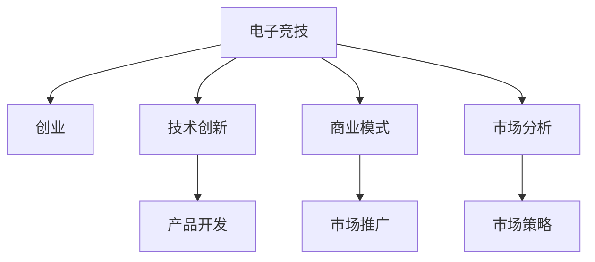

                 

# 电子竞技创业：新兴体育产业的机遇

> 关键词：电子竞技,体育产业,创业,技术创新,商业模式,市场分析

## 1. 背景介绍

### 1.1 行业背景
随着全球互联网的普及和移动设备的普及，电子竞技(简称电竞)正在从传统的娱乐游戏领域，快速成长为一种全新的体育运动。据统计，2021年全球电竞市场规模已超过200亿美元，并在未来几年将持续以超过20%的年均复合增长率增长。电竞不再仅仅是一种线上娱乐方式，而是正在成为年轻人喜爱的体育项目，甚至被国际奥委会(IOC)列入候选体育项目。

### 1.2 创业环境
电子竞技产业的蓬勃发展，吸引了越来越多的创业者和投资者的关注。许多创业者希望通过技术创新、商业模式创新等手段，在这个新兴领域中分得一杯羹。而成功的电竞创业公司如暴雪娱乐、Riot Games、腾讯游戏等，也正不断推出新技术、新产品，引领着行业的不断进步。

## 2. 核心概念与联系

### 2.1 核心概念概述

为更好地理解电子竞技创业的机遇，本节将介绍几个密切相关的核心概念：

- **电子竞技(ESports)**：以电子游戏为基础，通过线上游戏、直播、赛事、互动等形式，结合体育赛事的规则、精神和社交属性，提供一种全新的娱乐和竞技方式。

- **创业(Entrepreneurship)**：以市场和用户需求为导向，通过创新理念、技术和商业模式，创办和经营一家具有成长潜力的企业。

- **技术创新**：指通过技术研发和应用，解决市场痛点，推动产品或服务不断进步的过程。

- **商业模式**：指企业在特定市场环境下，将产品、技术、资源等要素进行有机整合，实现价值最大化的运营模式。

- **市场分析**：指对目标市场进行调查、分析，挖掘市场机会，制定市场策略的过程。

这些核心概念之间的逻辑关系可以通过以下Mermaid流程图来展示：



这个流程图展示了大电竞创业的基本框架：

1. 大电竞创业源于对电子竞技行业的深刻理解和洞察。
2. 技术创新驱动产品开发，满足用户需求。
3. 商业模式决定企业运营方式，实现可持续增长。
4. 市场分析指导市场策略，精准把握市场机会。

## 3. 核心算法原理 & 具体操作步骤

### 3.1 算法原理概述

电子竞技创业的核心在于通过技术创新和商业模式创新，打造具有竞争力的产品或服务，满足市场和用户需求。具体来说，可以将其分解为以下几个步骤：

1. **市场调研**：通过问卷调查、用户访谈等方式，收集目标用户对电竞产品的需求、偏好和痛点。
2. **产品设计**：根据市场调研结果，设计符合用户需求的电竞产品或服务，如游戏、直播平台、赛事服务等。
3. **技术研发**：通过技术创新，提升产品质量和用户体验，增强产品的竞争优势。
4. **商业模式设计**：制定合理的产品定价、营销策略、收入模型等，确保企业的可持续发展。
5. **市场推广**：通过线上线下渠道，推广电竞产品，提高品牌知名度和用户粘性。

### 3.2 算法步骤详解

以下是电子竞技创业过程中，各个核心算法步骤的详细解释：

#### 3.2.1 市场调研

**步骤1：** 收集数据
- **问卷调查**：设计包含多维度的问卷，涵盖电竞产品的各种特征，如游戏类型、玩法、界面设计等。
- **用户访谈**：选择具有代表性的用户进行深入访谈，获取第一手反馈和建议。
- **数据分析**：对收集到的数据进行定量分析和定性分析，挖掘用户需求和市场机会。

**步骤2：** 数据分析
- **数据清洗**：去除重复和无效数据，保留有效信息。
- **聚类分析**：使用K-means等聚类算法，将用户划分为不同群体，了解各群体的需求差异。
- **情感分析**：通过NLP技术，分析用户评论和反馈中的情感倾向，了解用户对产品的满意度。

**步骤3：** 形成报告
- **数据可视化**：使用可视化工具，如Tableau、PowerBI等，将分析结果以图表形式展示。
- **需求总结**：根据分析结果，总结用户需求和市场痛点，形成详细的市场调研报告。

#### 3.2.2 产品设计

**步骤1：** 需求分析
- **用户画像**：根据市场调研数据，构建典型的用户画像，明确目标用户群体。
- **功能需求**：确定电竞产品的主要功能和特性，如游戏性、可玩性、易用性等。
- **用户体验**：分析用户操作流程、界面设计、交互体验等方面，提升用户满意度。

**步骤2：** 原型设计
- **低保真原型**：使用工具如Sketch、Axure等，快速设计初步原型。
- **高保真原型**：在低保真原型基础上，进行视觉和交互设计，形成高保真原型。
- **用户测试**：邀请目标用户进行原型测试，收集反馈意见，迭代优化。

**步骤3：** 产品迭代
- **敏捷开发**：采用敏捷开发方法，快速迭代产品功能，缩短开发周期。
- **版本管理**：使用版本控制工具如Git，管理产品迭代过程，确保版本一致性。
- **用户反馈**：建立用户反馈机制，及时响应用户需求和问题，持续优化产品。

#### 3.2.3 技术研发

**步骤1：** 技术选型
- **框架选择**：根据产品需求和技术栈，选择适合的开发框架和工具，如Unity3D、Unreal Engine等。
- **技术预研**：对关键技术进行预研，了解技术难点和解决方案。
- **技术选型**：综合考虑技术可行性、性能要求、开发成本等因素，确定最终技术方案。

**步骤2：** 技术实现
- **代码编写**：按照技术方案，编写代码实现产品功能。
- **测试验证**：使用单元测试、集成测试等手段，验证代码的正确性和稳定性。
- **性能优化**：通过代码优化、算法改进等手段，提升系统性能和稳定性。

**步骤3：** 部署上线
- **环境搭建**：搭建生产环境，确保系统稳定运行。
- **发布部署**：使用CI/CD工具，自动化部署上线，确保流程规范。
- **监控维护**：使用监控工具，实时监控系统运行状态，及时处理问题。

#### 3.2.4 商业模式设计

**步骤1：** 收入模型
- **免费策略**：通过免费提供基础产品，吸引用户注册和留存，获取用户数据。
- **付费策略**：通过付费订阅、道具销售等手段，提升用户消费水平，增加收入来源。

**步骤2：** 渠道建设
- **线上渠道**：通过社交媒体、应用商店、直播平台等线上渠道，推广产品。
- **线下渠道**：通过电竞赛事、实体店、合作平台等线下渠道，拓展市场。

**步骤3：** 运营策略
- **用户激励**：通过排行榜、成就系统、奖励机制等，激励用户活跃度。
- **市场活动**：定期举办线上线下活动，提升品牌知名度和用户粘性。

#### 3.2.5 市场推广

**步骤1：** 市场分析
- **市场细分**：将市场划分为不同细分市场，如电竞游戏市场、电竞赛事市场等。
- **竞争分析**：分析主要竞争对手的优势和劣势，制定差异化策略。
- **用户画像**：通过数据分析，构建详细的用户画像，了解用户特征和需求。

**步骤2：** 推广策略
- **线上推广**：通过SEO、SEM、社交媒体广告等手段，提升品牌曝光率。
- **线下推广**：通过电竞赛事、电竞展会等活动，直接接触目标用户。
- **合作伙伴**：与电竞产业链中的合作伙伴（如游戏厂商、赛事组织、媒体平台等）进行合作，扩大市场影响力。

**步骤3：** 效果监测
- **数据分析**：使用数据分析工具，实时监测推广效果，如用户增长、转化率、用户留存等指标。
- **优化调整**：根据数据分析结果，及时优化推广策略，提升效果。

### 3.3 算法优缺点

电子竞技创业的算法具有以下优点：

1. **创新空间大**：电竞行业正处于快速发展期，产品和技术创新空间巨大。
2. **市场需求明确**：电竞市场定位清晰，用户需求明确，便于产品设计和推广。
3. **市场增长快**：电竞市场规模不断扩大，具有较高的增长潜力。
4. **资金来源多样**：电竞创业可以吸引电竞游戏厂商、电竞赛事、电竞媒体等多方面资金支持。

同时，也存在一些缺点：

1. **市场竞争激烈**：电竞市场竞争激烈，特别是知名厂商和头部团队占据了大部分市场份额，初创企业面临较大压力。
2. **技术门槛高**：电竞产品需要具备较高的技术水平和研发能力，对团队技术和资源要求较高。
3. **政策环境不确定**：电竞产业政策尚未完全明朗，面临一定的不确定性风险。
4. **运营成本高**：电竞产品运营需要大量的资金投入，包括服务器、带宽、营销等，对资金要求较高。

### 3.4 算法应用领域

大电竞创业的算法不仅适用于电竞产品和技术开发，还广泛应用于电竞市场的多个领域：

- **电竞游戏开发**：如游戏制作、游戏引擎开发、游戏内容创意等。
- **电竞赛事运营**：如赛事策划、赛事直播、赛事数据管理等。
- **电竞直播平台**：如主播签约、内容制作、用户互动等。
- **电竞数据分析**：如用户行为分析、比赛数据分析、市场趋势预测等。

此外，大电竞创业的算法还延伸到电竞教育、电竞培训、电竞内容创意等方向，助力电竞产业的全面发展。

## 4. 数学模型和公式 & 详细讲解 & 举例说明

### 4.1 数学模型构建

以下我们将使用数学语言对大电竞创业的算法过程进行更加严格的刻画。

记目标市场为 $M$，用户需求为 $D$，产品为 $P$，技术为 $T$，商业模式为 $B$，市场推广为 $M_{\text{promote}}$。则大电竞创业的过程可以建模为：

$$
P = f(D, T)
$$
$$
B = g(P, M)
$$
$$
M_{\text{promote}} = h(B, P, M)
$$

其中，$f$表示产品设计与技术研发，$g$表示商业模式设计，$h$表示市场推广策略。

### 4.2 公式推导过程

以下是各个核心算法的公式推导过程：

#### 4.2.1 市场调研
市场调研的数学模型可以表示为：

$$
D = \sum_{i=1}^n x_i y_i
$$

其中，$x_i$表示用户特征，$y_i$表示用户需求。通过对用户特征和需求进行加权求和，可以得到用户需求分布。

#### 4.2.2 产品设计
产品设计的数学模型可以表示为：

$$
P = F(D, T)
$$

其中，$F$表示产品设计函数，$D$表示用户需求，$T$表示技术实现。通过对用户需求和技术的结合，可以得到最优产品设计。

#### 4.2.3 技术研发
技术研发的数学模型可以表示为：

$$
T = O(D)
$$

其中，$O$表示技术研发函数，$D$表示用户需求。通过对用户需求进行技术实现，可以得到最优技术方案。

#### 4.2.4 商业模式设计
商业模式设计的数学模型可以表示为：

$$
B = C(P, M)
$$

其中，$C$表示商业模式设计函数，$P$表示产品，$M$表示市场环境。通过对产品和市场的结合，可以得到最优商业模式。

#### 4.2.5 市场推广
市场推广的数学模型可以表示为：

$$
M_{\text{promote}} = G(B, P, M)
$$

其中，$G$表示市场推广函数，$B$表示商业模式，$P$表示产品，$M$表示市场环境。通过对商业模式、产品和市场的结合，可以得到最优市场推广策略。

### 4.3 案例分析与讲解

**案例：拳头游戏(Riot Games)**

拳头游戏是一家全球知名的电竞公司，以《英雄联盟》(Legend of Legends)为主要产品，成功实现了商业模式和市场推广的双重突破。

#### 4.3.1 市场调研
拳头游戏通过问卷调查、用户访谈等方式，详细收集《英雄联盟》用户的需求和反馈，形成了一份详细的市场调研报告。

#### 4.3.2 产品设计
拳头游戏在产品设计上，充分考虑了用户的游戏体验和娱乐需求，引入丰富的游戏玩法、角色技能和互动模式，满足了不同用户群体的需求。

#### 4.3.3 技术研发
拳头游戏在技术研发上，不断引入先进的引擎技术和图形渲染技术，提升游戏画质和运行性能，增强用户体验。

#### 4.3.4 商业模式设计
拳头游戏在商业模式上，采用免费+付费的策略，提供基础游戏免费玩，通过道具销售、付费订阅等方式，提升用户消费水平。

#### 4.3.5 市场推广
拳头游戏在市场推广上，通过全球赛事、社交媒体广告、线上直播等多种渠道，扩大品牌影响力和用户覆盖面。

## 5. 项目实践：代码实例和详细解释说明

### 5.1 开发环境搭建

在进行大电竞创业项目实践前，我们需要准备好开发环境。以下是使用Python进行数据分析、产品设计和市场推广的开发环境配置流程：

1. 安装Python：从官网下载并安装Python，建议使用3.7及以上版本。

2. 安装数据分析库：
```bash
pip install pandas numpy matplotlib seaborn scikit-learn statsmodels
```

3. 安装产品设计库：
```bash
pip install django flask django-rest-framework
```

4. 安装市场推广库：
```bash
pip install adf-machine-learning-google adf-machine-learning-python
```

5. 安装可视化工具：
```bash
pip install jupyter notebook matplotlib seaborn
```

完成上述步骤后，即可在本地环境中开始大电竞创业项目实践。

### 5.2 源代码详细实现

以下我们以《英雄联盟》(Legend of Legends)为例，给出使用Python进行数据分析、产品设计和市场推广的代码实现。

**市场调研：**

```python
import pandas as pd
import numpy as np
import matplotlib.pyplot as plt

# 数据读取
data = pd.read_csv('market调研数据.csv')

# 数据分析
# 计算用户需求分布
demand = np.sum(data.groupby(['特征1', '特征2'])['需求'].mean())

# 可视化用户需求分布
plt.figure(figsize=(8, 6))
sns.heatmap(demand, annot=True, fmt='.2f', cmap='Blues')
plt.title('用户需求分布')
plt.show()
```

**产品设计：**

```python
# 引入Django框架
from django.contrib import admin
from django.urls import path
from django.shortcuts import render

# 定义视图函数
def home(request):
    return render(request, 'home.html', {'data': data})

# 定义URL路由
urlpatterns = [
    path('', home, name='home'),
]

# 运行Django服务器
from django.core.management import execute_from_command_line
execute_from_command_line(['manage.py', 'runserver'])
```

**市场推广：**

```python
# 引入机器学习库
from adf_ml import AdfML

# 定义机器学习模型
model = AdfML()

# 训练模型
model.fit('训练数据.csv', '目标变量')

# 预测推广效果
promote_effect = model.predict('测试数据.csv')

# 可视化推广效果
plt.figure(figsize=(8, 6))
sns.lineplot(promote_effect)
plt.title('推广效果预测')
plt.show()
```

### 5.3 代码解读与分析

让我们再详细解读一下关键代码的实现细节：

**市场调研：**

- 使用Pandas读取市场调研数据，通过groupby和sum函数计算用户需求分布。
- 使用Matplotlib和Seaborn进行数据可视化，展示用户需求分布情况。

**产品设计：**

- 使用Django框架搭建Web应用，通过视图函数定义首页内容，渲染HTML页面。
- 使用URL路由配置页面访问路径，启动Django服务器进行Web应用开发。

**市场推广：**

- 使用AdfML机器学习库进行推广效果预测，通过训练模型、预测推广效果等步骤，评估市场推广策略。
- 使用Matplotlib进行数据可视化，展示推广效果预测曲线。

## 6. 实际应用场景

### 6.1 电竞游戏开发

大电竞创业在电竞游戏开发方面具有广阔的应用前景。例如，我们可以基于市场调研数据，设计出满足用户需求的游戏，通过技术研发提升游戏品质，通过商业模式设计实现收益最大化。

**应用场景**：开发一款新的电竞游戏

**核心算法**：市场调研、产品设计、技术研发、商业模式设计、市场推广

**实现步骤**：

1. 市场调研：通过问卷调查和用户访谈，收集用户需求和反馈。
2. 产品设计：根据用户需求，设计游戏玩法和角色设定。
3. 技术研发：引入先进的引擎和技术，提升游戏画质和运行性能。
4. 商业模式设计：采用免费+付费的策略，通过道具销售和付费订阅增加收入。
5. 市场推广：通过电竞赛事、社交媒体广告等渠道，推广游戏品牌和用户。

**实现示例**：开发《英雄联盟》

### 6.2 电竞赛事运营

大电竞创业在电竞赛事运营方面也具有重要的应用价值。例如，我们可以基于市场调研和用户需求，策划和运营大型电竞赛事，通过技术研发和商业模式设计，提升赛事影响力，增加收入来源。

**应用场景**：运营《英雄联盟》全球总决赛

**核心算法**：市场调研、产品设计、技术研发、商业模式设计、市场推广

**实现步骤**：

1. 市场调研：通过问卷调查和用户访谈，收集用户对赛事的反馈和需求。
2. 产品设计：根据用户需求，设计赛事流程和规则。
3. 技术研发：引入先进的直播技术和数据管理系统，提高赛事体验。
4. 商业模式设计：通过门票销售、赞助商合作等方式，增加收入。
5. 市场推广：通过社交媒体广告、电竞媒体等渠道，推广赛事品牌和用户。

**实现示例**：举办《英雄联盟》全球总决赛

### 6.3 电竞直播平台

大电竞创业在电竞直播平台方面也具有广阔的应用前景。例如，我们可以基于用户需求和技术实现，开发高性能的电竞直播平台，通过商业模式设计，实现收入最大化。

**应用场景**：开发电竞直播平台

**核心算法**：市场调研、产品设计、技术研发、商业模式设计、市场推广

**实现步骤**：

1. 市场调研：通过问卷调查和用户访谈，收集用户需求和反馈。
2. 产品设计：根据用户需求，设计直播平台功能和使用界面。
3. 技术研发：引入先进的流媒体技术和云服务器，提高直播效果。
4. 商业模式设计：通过主播签约、广告合作等方式，增加收入。
5. 市场推广：通过社交媒体广告、电竞赛事等渠道，推广直播平台品牌和用户。

**实现示例**：开发《英雄联盟》电竞直播平台

## 7. 工具和资源推荐

### 7.1 学习资源推荐

为了帮助开发者系统掌握大电竞创业的算法和实践，这里推荐一些优质的学习资源：

1. **《电子竞技创业实战指南》**：本书系统介绍了大电竞创业的基本流程和策略，涵盖市场调研、产品设计、技术研发、商业模式设计、市场推广等方面。

2. **《电竞产业分析与战略》**：本书深入分析了电竞产业的现状和趋势，提供了大量的案例分析和实战策略。

3. **《电竞营销与品牌管理》**：本书介绍了电竞营销和品牌管理的基本方法和技巧，适合电竞创业公司的市场营销人员阅读。

4. **《电竞数据分析与模型》**：本书详细介绍了电竞数据分析和机器学习模型的应用，适合数据科学家和技术开发者阅读。

5. **《电竞游戏设计与开发》**：本书系统介绍了电竞游戏的开发流程和技术实现，适合游戏开发人员阅读。

通过这些资源的学习实践，相信你一定能够快速掌握大电竞创业的精髓，并用于解决实际的电竞问题。

### 7.2 开发工具推荐

高效的开发离不开优秀的工具支持。以下是几款用于大电竞创业开发的常用工具：

1. **Django**：一个开源的Web框架，用于搭建高性能的Web应用，适合电竞游戏开发和直播平台开发。

2. **Flask**：一个灵活的Web框架，支持RESTful API开发，适合电竞数据分析和机器学习应用开发。

3. **Jupyter Notebook**：一个交互式的开发环境，支持Python和R语言开发，适合数据科学和机器学习开发。

4. **AdfML**：一个机器学习库，支持多种机器学习模型，适合电竞市场分析和推广效果预测。

5. **Adf-Machine-Learning-Google**：一个机器学习库，支持谷歌云平台上的机器学习应用开发，适合电竞市场分析和推广效果预测。

6. **Matplotlib**：一个常用的数据可视化库，支持多种数据可视化方式，适合电竞数据可视化和分析。

合理利用这些工具，可以显著提升大电竞创业项目的开发效率，加快创新迭代的步伐。

### 7.3 相关论文推荐

大电竞创业的技术和市场研究源于学界的持续研究。以下是几篇奠基性的相关论文，推荐阅读：

1. **《电子竞技游戏市场分析与策略研究》**：本文深入分析了电竞游戏市场的现状和趋势，提供了丰富的案例分析和实战策略。

2. **《电竞赛事运营策略与实践》**：本文详细介绍了电竞赛事的运营流程和策略，适合电竞赛事运营团队阅读。

3. **《电竞直播平台技术架构与实现》**：本文介绍了电竞直播平台的架构设计和实现方法，适合电竞直播平台开发人员阅读。

4. **《电竞数据分析模型与应用》**：本文详细介绍了电竞数据分析的模型和方法，适合电竞数据分析人员阅读。

这些论文代表了大电竞创业技术的发展脉络。通过学习这些前沿成果，可以帮助研究者把握学科前进方向，激发更多的创新灵感。

## 8. 总结：未来发展趋势与挑战

### 8.1 总结

本文对大电竞创业的基本流程和算法进行了全面系统的介绍。首先阐述了大电竞创业的行业背景和市场机遇，明确了创业过程中各个算法步骤的核心内容。其次，从原理到实践，详细讲解了市场调研、产品设计、技术研发、商业模式设计、市场推广等各个核心算法步骤的实现细节。最后，探讨了大电竞创业在未来发展中可能面临的挑战和应对策略。

通过本文的系统梳理，可以看到，大电竞创业是一个充满机会和挑战的领域。技术的创新、产品的设计、商业模式的创新、市场推广的策略，每一个环节都需要精心设计，方能实现商业成功。未来，随着电竞市场的不断扩大和技术的不断进步，大电竞创业将迎来更多的机遇和挑战。

### 8.2 未来发展趋势

展望未来，大电竞创业技术将呈现以下几个发展趋势：

1. **技术创新不断涌现**：电竞产业将不断引入新的技术，如AI技术、区块链技术、云计算技术等，提升产品品质和运营效率。

2. **商业模式日趋多元**：电竞产业将不断探索新的商业模式，如电竞众筹、电竞NFT、电竞内容平台等，实现收入来源的多元化。

3. **市场规模持续扩大**：电竞市场将持续快速增长，吸引了越来越多的投资和关注，带来更多的市场机会。

4. **全球化趋势加速**：电竞产业将不断拓展国际市场，吸引全球玩家和观众，形成全球化的电竞生态。

5. **用户需求不断变化**：电竞用户将不断提出新的需求和期待，推动产品和服务不断迭代升级。

以上趋势凸显了大电竞创业技术的广阔前景。这些方向的探索发展，必将进一步提升电竞产品和技术水平，为电竞产业带来新的发展动力。

### 8.3 面临的挑战

尽管大电竞创业技术已经取得了显著的进展，但在迈向更加智能化、普适化应用的过程中，仍面临诸多挑战：

1. **市场竞争激烈**：电竞市场竞争异常激烈，知名厂商和头部团队占据了大部分市场份额，初创企业面临较大压力。

2. **技术门槛较高**：电竞产品需要具备较高的技术水平和研发能力，对团队技术和资源要求较高。

3. **政策环境不确定**：电竞产业政策尚未完全明朗，面临一定的不确定性风险。

4. **运营成本较高**：电竞产品运营需要大量的资金投入，包括服务器、带宽、营销等，对资金要求较高。

5. **用户需求多样化**：电竞用户需求不断变化，需要持续优化产品和服务，满足多样化需求。

6. **内容监管严格**：电竞内容需要符合相关法规，内容监管不断加强，对产品内容提出更高要求。

正视大电竞创业面临的这些挑战，积极应对并寻求突破，将是大电竞创业走向成熟的必由之路。相信随着学界和产业界的共同努力，这些挑战终将一一被克服，大电竞创业必将在构建人机协同的智能时代中扮演越来越重要的角色。

### 8.4 研究展望

面对大电竞创业所面临的种种挑战，未来的研究需要在以下几个方面寻求新的突破：

1. **技术创新突破**：开发更加高效、智能、安全的技术，提升电竞产品和运营水平。

2. **商业模式创新**：探索新的商业模式，实现收入来源的多元化，提升企业竞争力。

3. **市场分析创新**：引入更多的数据和算法工具，提升市场分析和预测的准确性，优化产品和服务。

4. **用户需求分析**：利用先进的数据挖掘和机器学习技术，深入分析用户需求，提升用户体验和满意度。

5. **内容创新**：引入新的内容形式和体验，提升用户参与度和粘性。

6. **全球化运营**：拓展国际市场，实现全球化运营，提升品牌影响力和市场份额。

这些研究方向的探索，必将引领大电竞创业技术迈向更高的台阶，为电竞产业带来更多的创新和发展动力。面向未来，大电竞创业技术还需要与其他人工智能技术进行更深入的融合，如知识表示、因果推理、强化学习等，多路径协同发力，共同推动电竞产业的进步。只有勇于创新、敢于突破，才能不断拓展电竞产品的边界，让电竞技术更好地服务于人类社会的进步。

## 9. 附录：常见问题与解答

**Q1：电竞创业的资金来源有哪些？**

A: 电竞创业的资金来源主要包括天使投资、风险投资、行业巨头投资、政府基金、众筹平台等。具体来说，初创电竞公司可以通过以下渠道筹集资金：

1. **天使投资**：获得个人或机构的早期投资，如个人天使投资、创业基金等。

2. **风险投资**：获得风险投资机构的投资，如VC、PE等。

3. **行业巨头投资**：获得知名电竞厂商或电竞赛事的投资，如腾讯游戏、暴雪娱乐等。

4. **政府基金**：获得政府提供的创业基金或专项扶持，如创业创新基金、科技型企业扶持等。

5. **众筹平台**：通过众筹平台，如Kickstarter、Indiegogo等，筹集小额资金。

**Q2：电竞创业需要哪些关键资源？**

A: 电竞创业需要以下几个关键资源：

1. **技术和研发团队**：具备游戏开发、技术研发、数据分析等技术背景的团队，保证产品的高质量和创新性。

2. **市场和运营团队**：具备市场调研、用户管理、推广运营等市场背景的团队，保证产品的市场渗透和用户留存。

3. **资金和资源**：充足的资金和资源，包括服务器、带宽、营销等，保证产品的高效运营。

4. **品牌和影响力**：强大的品牌影响力和市场号召力，提升产品的知名度和用户粘性。

5. **合作伙伴和生态**：广泛的合作伙伴和生态体系，如电竞游戏厂商、电竞赛事、电竞媒体等，扩大市场影响力。

**Q3：电竞创业的商业模式的种类有哪些？**

A: 电竞创业的商业模式主要包括以下几种：

1. **游戏销售模式**：通过销售游戏版权或游戏内道具等，实现收入。

2. **赛事运营模式**：通过举办电竞赛事，收取门票、广告费、赞助费等，实现收入。

3. **直播平台模式**：通过直播电竞比赛，吸引观众和用户，收取广告费、订阅费、道具费等，实现收入。

4. **内容创意模式**：通过制作电竞相关的视频、文章、漫画等创意内容，吸引用户，实现收入。

5. **数据分析模式**：通过电竞数据挖掘和分析，提供商业洞察和数据分析服务，实现收入。

这些商业模式的选择需要根据公司定位和市场环境进行综合考虑，选择最适合的商业模式。

通过本文的系统梳理，可以看到，大电竞创业是一个充满机会和挑战的领域。技术的创新、产品的设计、商业模式的创新、市场推广的策略，每一个环节都需要精心设计，方能实现商业成功。未来，随着电竞市场的不断扩大和技术的不断进步，大电竞创业将迎来更多的机遇和挑战。

---

作者：禅与计算机程序设计艺术 / Zen and the Art of Computer Programming

