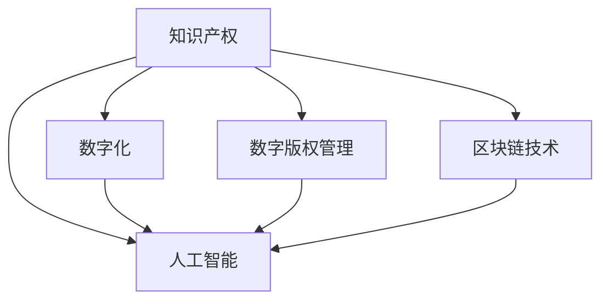

                 

# 知识产权与传统文化保护

> 关键词：知识产权保护, 传统文化的数字化, 数字版权管理(DRM), 区块链技术, 人工智能(AI)辅助鉴定

## 1. 背景介绍

### 1.1 问题由来

在全球化和数字化进程加速的今天，文化遗产的保存和传承面临严峻的挑战。一方面，传统文化的传承需与现代生活相结合，通过数字化手段使其更具活力；另一方面，知识产权保护的缺失使得传统文化的原创性难以得到保障，导致盗版盗用现象频发。因此，如何平衡文化遗产保护与知识产权保护之间的关系，成为了全球范围内亟待解决的难题。

### 1.2 问题核心关键点

本文旨在探讨如何利用人工智能、区块链等先进技术手段，对传统文化的知识产权进行有效保护，并通过数字化手段实现传统文化的传承。具体核心关键点包括：

1. **知识产权保护**：确保传统文化的原创性得到法律和技术的双重保障，防止盗版盗用。
2. **数字化传承**：通过数字化手段，使传统文化得以在网络空间得以广泛传播和长久保存。
3. **智能识别与鉴定**：利用人工智能技术，对传统文化进行智能识别与鉴定，增强传承的准确性和权威性。
4. **区块链技术**：通过区块链技术，确保传统文化产权流转的透明性和不可篡改性。

## 2. 核心概念与联系

### 2.1 核心概念概述

为更好地理解知识产权与传统文化保护的技术手段，本节将介绍几个密切相关的核心概念：

- **知识产权(Knowledge Property Rights, KPR)**：指创作者对其文学、艺术、科学和技术等作品的独占使用权和获得经济利益的权利。知识产权保护涵盖了著作权、专利权、商标权等多个方面，旨在激励创新和创造。
- **数字化(Digitization)**：将传统媒介中的信息或内容转换为数字形式，以便于在计算机和网络中进行存储、传输和处理。数字化是文化传承的关键技术手段之一。
- **数字版权管理(Digital Rights Management, DRM)**：通过技术手段对数字作品的使用进行控制和管理，防止未经授权的复制、分发和修改。DRM是保护数字作品知识产权的重要工具。
- **区块链(Blockchain)**：一种去中心化的分布式账本技术，通过加密哈希链连接所有区块，实现数据的透明性和不可篡改性。区块链在版权保护和分布式存储中具有广泛的应用前景。
- **人工智能(Artificial Intelligence, AI)**：通过模拟人类的智能行为，使机器具备自主学习、推理和决策能力。AI在版权识别、鉴定和自动保护中扮演重要角色。

这些核心概念之间的逻辑关系可以通过以下Mermaid流程图来展示：



这个流程图展示了一系列的相互依赖和相互促进的技术手段，共同构成了对传统文化知识产权进行保护和传承的技术框架。

## 3. 核心算法原理 & 具体操作步骤
### 3.1 算法原理概述

知识产权与传统文化保护的技术手段主要包括以下几个方面：

- **数字版权管理(DRM)**：通过加密、访问控制等技术手段，确保数字作品仅能被授权用户访问和使用。DRM技术可以有效防止盗版盗用，保护知识产权。
- **区块链技术**：通过分布式账本和智能合约，实现版权的透明流转和确权，防止篡改和侵权行为。区块链技术具有去中心化和不可篡改性，是数字版权保护的理想选择。
- **人工智能(AI)**：利用图像识别、文本分析、语音识别等技术，对传统文化进行自动鉴定和版权保护。AI技术可以在大规模数据上快速识别版权信息，提高效率和准确性。

### 3.2 算法步骤详解

基于上述技术手段，传统文化的知识产权保护和数字化传承可以遵循以下步骤：

**Step 1: 版权登记和确权**
- 利用区块链技术，对传统文化作品进行版权登记和确权，生成不可篡改的版权证书。
- 通过智能合约，规定版权流转的规则和条件，防止未经授权的使用。

**Step 2: 数字化处理和存储**
- 对传统文化作品进行数字化处理，转换为可存储、可传输的数字形式。
- 利用分布式存储技术，将数字作品存储于多个节点，确保数据的完整性和可靠性。

**Step 3: 版权保护和识别**
- 利用数字版权管理技术，对数字作品进行加密和访问控制，确保仅授权用户能访问。
- 使用人工智能技术，对数字作品进行版权识别和鉴定，确保版权信息准确无误。

**Step 4: 版权流转和监管**
- 通过区块链技术，记录版权流转的完整历程，确保版权流转的透明性和不可篡改性。
- 利用人工智能技术，对版权流转过程进行监控，及时发现和处理侵权行为。

### 3.3 算法优缺点

利用这些技术手段进行传统文化的知识产权保护和数字化传承，具有以下优点：

- **高效性**：利用人工智能和区块链技术，可以快速处理大规模数据，实现高效的版权保护和流转。
- **安全性**：区块链技术保证了版权信息的不可篡改性，人工智能技术提高了版权识别的准确性，确保了文化产权的可靠保护。
- **透明性**：区块链技术记录了版权流转的完整历程，增加了版权保护的透明性和可追溯性。
- **可扩展性**：分布式存储和区块链技术具有高度的可扩展性，能够适应不断增长的数字作品和用户需求。

同时，这些技术手段也存在一定的局限性：

- **技术成本高**：区块链和AI技术需要较高的技术投入和运行成本。
- **依赖网络稳定性**：区块链技术的分布式存储和访问控制依赖于网络稳定性和带宽资源。
- **隐私和安全性问题**：尽管区块链具有较高的安全性，但仍需关注用户隐私保护和数据安全问题。

### 3.4 算法应用领域

基于这些技术手段，知识产权与传统文化保护的应用领域包括：

- **数字化图书馆**：利用区块链和DRM技术，保护和传播古籍、艺术品等传统文化的数字副本。
- **数字艺术品交易平台**：通过区块链技术记录艺术品流转历史，确保艺术品真实性和版权。
- **智能博物馆**：利用AI技术进行艺术品智能鉴定和版权保护，提升博物馆管理效率。
- **在线教育平台**：利用区块链技术保护教育资源版权，防止盗版盗用。
- **虚拟现实(VR)与增强现实(AR)应用**：通过AI和区块链技术，对虚拟文化遗产进行真实还原和版权保护。

## 4. 数学模型和公式 & 详细讲解 & 举例说明

### 4.1 数学模型构建

传统文化的版权保护和数字化传承涉及多个领域，包括版权登记、版权识别、版权流转等。以下将构建一个简化的数学模型，用于描述版权保护的基本流程。

设 $C$ 为待保护的文化作品，版权信息为 $I$，版权流转路径为 $P$，版权保护系统为 $S$。版权保护过程可以表示为：

$$
\text{版权保护过程} = \{C, I, P, S\}
$$

其中：

- $C$ 表示待保护的文化作品，可以是文本、图片、音频等。
- $I$ 表示版权信息，包括作者、发布日期、授权条件等。
- $P$ 表示版权流转路径，包括注册、授权、使用等环节。
- $S$ 表示版权保护系统，包括区块链、DRM、AI等技术手段。

### 4.2 公式推导过程

以版权登记为例，版权登记过程可以表示为：

$$
\text{版权登记} = C, I \rightarrow \text{区块链记录}
$$

其中，版权登记过程通过区块链技术，将文化作品 $C$ 和版权信息 $I$ 记录在区块链上，生成不可篡改的版权证书。

### 4.3 案例分析与讲解

假设有一幅中国古画 $C$，其版权信息为 $I$，包括作者张三、创作年代明朝、授权条件仅限博物馆展览。通过区块链技术进行版权登记，生成不可篡改的版权证书。然后，利用DRM技术对该画进行加密和访问控制，确保仅博物馆内的访客能够观看。最后，通过智能合约，规定版权流转的规则，如每次展览需获得版权所有者同意，并将展览信息记录在区块链上。

## 5. 项目实践：代码实例和详细解释说明
### 5.1 开发环境搭建

在进行传统文化知识产权保护的技术实践前，我们需要准备好开发环境。以下是使用Python进行区块链和DRM开发的环境配置流程：

1. 安装Anaconda：从官网下载并安装Anaconda，用于创建独立的Python环境。

2. 创建并激活虚拟环境：
```bash
conda create -n blockchain-dev python=3.8 
conda activate blockchain-dev
```

3. 安装相关库：
```bash
pip install pyblockchain drmemlib
```

完成上述步骤后，即可在`blockchain-dev`环境中开始区块链和DRM的开发实践。

### 5.2 源代码详细实现

这里我们以区块链技术为例，使用PyBlockchain库实现一个简单的版权登记系统。

```python
from pyblockchain import Blockchain, Transaction, Block, Wallet

# 初始化区块链
blockchain = Blockchain()

# 创建钱包
my_wallet = Wallet()
author_wallet = Wallet()

# 生成版权证书
data = {'作品': '中国古画', '作者': '张三', '创作年代': '明朝', '授权条件': '仅限博物馆展览'}
hash = hashlib.sha256(str(data).encode()).hexdigest()

# 创建交易
transaction = Transaction()
transaction.add_input(author_wallet.address, 0.01)
transaction.add_output(my_wallet.address, 0.01)
transaction.add_metadata({'版权信息': hash})

# 创建区块
block = Block(transaction)
block.add_transaction(transaction)

# 将区块添加到区块链
blockchain.add_block(block)
```

上述代码实现了对一件中国古画的版权登记。首先，使用`Blockchain`类初始化区块链，然后创建两个钱包，一个用于版权所有者张三，另一个用于博物馆。接着，生成版权证书，将其存储在区块链上，并通过交易将版权信息传递给博物馆。最后，将交易添加到区块，并添加到区块链中。

### 5.3 代码解读与分析

让我们再详细解读一下关键代码的实现细节：

**Blockchain类**：
- `__init__`方法：初始化区块链，包括设置难度、奖励和共识机制。
- `add_block`方法：将区块添加到区块链中。
- `add_transaction`方法：向区块中添加交易。

**Transaction类**：
- `__init__`方法：初始化交易，包括输入、输出和元数据。
- `add_input`方法：添加输入地址和金额。
- `add_output`方法：添加输出地址和金额。
- `add_metadata`方法：添加元数据。

**Wallet类**：
- `__init__`方法：初始化钱包，包括地址和余额。
- `address`属性：获取钱包地址。

该代码实现了基本的区块链版权登记功能，包括创建钱包、生成版权信息、创建交易、生成区块和添加区块等。在实际应用中，还需要进一步扩展，如实现更复杂的交易类型、智能合约、去中心化存储等。

## 6. 实际应用场景
### 6.1 智能博物馆

基于区块链和DRM技术的智能博物馆系统，可以显著提升博物馆的管理效率和用户体验。具体应用场景包括：

- **版权管理**：利用区块链技术，记录每件展品的所有权和使用情况，防止盗版盗用。
- **数字展品管理**：利用DRM技术，对数字展品进行加密和访问控制，确保仅授权用户能观看。
- **虚拟导览**：利用VR和AR技术，对虚拟展品进行展示，并通过AI进行智能讲解。
- **用户互动**：通过区块链技术，记录用户参观信息和互动行为，生成个性化参观报告。

### 6.2 数字艺术品交易平台

数字艺术品交易平台利用区块链和DRM技术，确保艺术品的真实性和版权。具体应用场景包括：

- **艺术品登记**：利用区块链技术，记录艺术品的流转历史和版权信息，确保艺术品真实性。
- **交易监管**：利用智能合约，规定交易的规则和条件，防止未经授权的交易行为。
- **去中心化存储**：利用分布式存储技术，确保艺术品的高可用性和可靠性。
- **用户溯源**：通过区块链技术，记录每个用户的购买历史和行为，便于溯源和维权。

### 6.3 在线教育平台

在线教育平台利用区块链和DRM技术，保护教育资源的版权。具体应用场景包括：

- **版权登记**：利用区块链技术，记录每个教育资源的所有权和使用情况，防止盗版盗用。
- **资源共享**：利用DRM技术，对教育资源进行加密和访问控制，确保仅授权用户能使用。
- **用户互动**：通过区块链技术，记录学生的学习行为和互动信息，生成个性化学习报告。
- **教学评估**：利用AI技术，对学生的学习行为和成绩进行智能评估，提供个性化反馈。

### 6.4 未来应用展望

随着区块链和AI技术的不断成熟，知识产权与传统文化保护将迎来更广阔的应用前景：

- **去中心化生态**：区块链技术将构建去中心化的版权保护生态，使得版权流转更加透明和可信。
- **跨平台应用**：AI技术将实现跨平台、跨媒介的文化传承，使得传统文化的传播更加广泛和高效。
- **智能合约普及**：智能合约的普及将使得版权流转和管理更加自动化和智能化。
- **用户隐私保护**：区块链和DRM技术将提升用户隐私保护能力，防止数据泄露和滥用。
- **教育普及**：在线教育平台的普及将使得更多人能够接触和学习传统文化，增强文化传承的普及性。

## 7. 工具和资源推荐
### 7.1 学习资源推荐

为了帮助开发者系统掌握知识产权与传统文化保护的技术，这里推荐一些优质的学习资源：

1. **《区块链技术原理与应用》系列博文**：由区块链专家撰写，深入浅出地介绍了区块链的基本原理、应用场景和技术实现。
2. **《数字版权管理》课程**：由专业机构开设的在线课程，涵盖数字版权管理的基本概念、技术实现和管理实践。
3. **《人工智能与传统文化保护》书籍**：结合人工智能和传统文化保护，全面介绍了AI在版权识别、鉴定和版权保护中的应用。
4. **《数字版权管理工具》网站**：提供各类数字版权管理的工具和插件，帮助开发者快速实现版权保护功能。
5. **《区块链技术与艺术》会议论文集**：收录区块链技术在艺术领域应用的前沿研究，提供丰富的理论和技术实践。

通过对这些资源的学习实践，相信你一定能够快速掌握知识产权与传统文化保护的技术精髓，并用于解决实际的NLP问题。
###  7.2 开发工具推荐

高效的开发离不开优秀的工具支持。以下是几款用于知识产权与传统文化保护开发的常用工具：

1. **PyBlockchain**：Python封装的区块链开发库，提供简单易用的API和示例代码，帮助开发者快速实现区块链应用。
2. **DRMEM**：Python封装的数字版权管理库，提供丰富的DRM功能，包括加密、访问控制、水印等。
3. **Ethereum**：全球领先的区块链平台，提供智能合约、分布式存储等功能，适合构建大型区块链应用。
4. **OpenAI**：提供强大的人工智能平台，支持图像识别、文本分析等任务，帮助实现智能版权识别。
5. **Masternode**：支持多个区块链平台，提供去中心化应用开发工具和模板，帮助开发者构建去中心化生态。

合理利用这些工具，可以显著提升知识产权与传统文化保护任务的开发效率，加快创新迭代的步伐。

### 7.3 相关论文推荐

知识产权与传统文化保护的研究源于学界的持续研究。以下是几篇奠基性的相关论文，推荐阅读：

1. **《区块链技术在版权保护中的应用》**：详细介绍了区块链技术在版权保护中的基本原理和实际应用。
2. **《数字版权管理技术与工具》**：综述了数字版权管理的基本技术和工具，提供丰富的理论和技术实践。
3. **《人工智能在版权识别中的应用》**：探讨了AI技术在版权识别中的基本原理和实际应用，提供详细的技术细节和案例分析。
4. **《智能合约在版权流转中的应用》**：探讨了智能合约在版权流转中的应用，提供详细的技术细节和实际案例。
5. **《去中心化存储在文化遗产保护中的应用》**：探讨了去中心化存储技术在文化遗产保护中的应用，提供详细的技术细节和实际案例。

这些论文代表了大语言模型微调技术的发展脉络。通过学习这些前沿成果，可以帮助研究者把握学科前进方向，激发更多的创新灵感。

## 8. 总结：未来发展趋势与挑战
### 8.1 研究成果总结

本文对知识产权与传统文化保护的技术手段进行了全面系统的介绍。首先阐述了版权保护和数字化传承的技术需求，明确了区块链、DRM、AI等技术手段的核心价值。其次，从原理到实践，详细讲解了版权保护的基本流程和技术实现，提供了完整的代码实例和详细解释。同时，本文还探讨了知识产权与传统文化保护在实际应用中的广泛场景，展示了技术的广阔前景。最后，本文精选了相关的学习资源和工具，力求为读者提供全方位的技术指引。

通过本文的系统梳理，可以看到，基于区块链和AI技术的知识产权与传统文化保护技术，已经在多个领域得到了广泛应用，为文化遗产的保存和传承提供了坚实的技术保障。未来，伴随技术的不断演进和创新，这些技术手段必将进一步拓展其应用范围，为传统文化的保护和传承带来新的突破。

### 8.2 未来发展趋势

展望未来，知识产权与传统文化保护技术将呈现以下几个发展趋势：

1. **区块链技术普及**：区块链技术将进一步普及，成为版权保护和分布式存储的标准技术手段。
2. **AI技术应用深化**：AI技术将深入应用于版权识别、鉴定和版权保护中，提升版权保护的准确性和效率。
3. **去中心化生态建设**：去中心化生态将逐步构建，使得版权流转和管理更加透明和可信。
4. **跨平台跨媒介应用**：跨平台、跨媒介的文化传承将更加广泛和高效，打破时间和空间的限制。
5. **智能合约普及**：智能合约将普及于版权流转和管理中，使得版权保护和管理更加自动化和智能化。

以上趋势凸显了知识产权与传统文化保护技术的广阔前景。这些方向的探索发展，必将进一步提升文化遗产保护和传承的技术水平，为人类文化的长期保存和传承提供新的动力。

### 8.3 面临的挑战

尽管知识产权与传统文化保护技术已经取得了一定的进展，但在迈向更加智能化、普适化应用的过程中，仍面临诸多挑战：

1. **技术成本高**：区块链和AI技术需要较高的技术投入和运行成本。
2. **网络稳定性**：区块链技术的分布式存储和访问控制依赖于网络稳定性和带宽资源。
3. **隐私和安全性问题**：尽管区块链具有较高的安全性，但仍需关注用户隐私保护和数据安全问题。
4. **法律和政策障碍**：版权保护的法律和政策尚未完善，需进一步规范和推动。
5. **跨文化适应性**：不同文化的版权保护和数字化传承需求各异，需开发适应不同文化特点的技术手段。

这些挑战需要学界和产业界共同努力，不断推进技术的创新和完善，以实现文化遗产的有效保护和传承。

### 8.4 研究展望

面对知识产权与传统文化保护所面临的挑战，未来的研究需要在以下几个方面寻求新的突破：

1. **成本效益优化**：开发低成本、高效能的区块链和AI技术，降低技术投入和运行成本。
2. **跨平台跨媒介应用**：开发适应不同文化和媒介的版权保护和数字化传承技术，实现更广泛的应用。
3. **智能合约改进**：研究更灵活、更安全的智能合约设计，提升版权流转的可靠性和安全性。
4. **隐私保护技术**：开发隐私保护技术，如零知识证明、同态加密等，保护用户隐私和数据安全。
5. **法律和政策支持**：推动版权保护法律和政策的完善，建立健全的版权保护体系。
6. **跨文化适应性**：研究不同文化的版权保护需求，开发适应不同文化特点的技术手段。

这些研究方向的探索，必将引领知识产权与传统文化保护技术迈向更高的台阶，为文化遗产的长期保存和传承提供新的技术路径。面向未来，我们需要不断探索和创新，才能真正实现人工智能技术在传统文化保护中的广泛应用，为人类的文化传承注入新的活力。

## 9. 附录：常见问题与解答

**Q1：传统文化的数字化是否会破坏其原有价值？**

A: 数字化过程本身不会破坏传统文化的原有价值，但需要在数字化过程中注意原作的完整性和真实性。数字化技术可以更好地保存和传播传统文化，提升其影响力。

**Q2：如何确保数字化作品的版权信息准确无误？**

A: 利用区块链技术进行版权登记和确权，生成不可篡改的版权证书。通过智能合约和DRM技术，确保版权信息的准确性和完整性。

**Q3：区块链技术在版权保护中的优势和局限性是什么？**

A: 区块链技术的优势包括去中心化、不可篡改、透明度高，可以有效保护版权信息。但其局限性包括技术复杂、运行成本高、网络依赖性强，需进一步优化和改进。

**Q4：AI技术在版权保护中的应用有哪些？**

A: AI技术在版权保护中的应用包括版权识别、鉴定、版权管理等。通过图像识别、文本分析、语音识别等技术，可以实现版权信息的快速识别和鉴定。

**Q5：如何实现版权的透明流转和确权？**

A: 利用区块链技术进行版权登记和确权，生成不可篡改的版权证书。通过智能合约和DRM技术，确保版权流转的透明性和不可篡改性。

这些常见问题的解答，希望能帮助你更好地理解和掌握知识产权与传统文化保护的技术。

