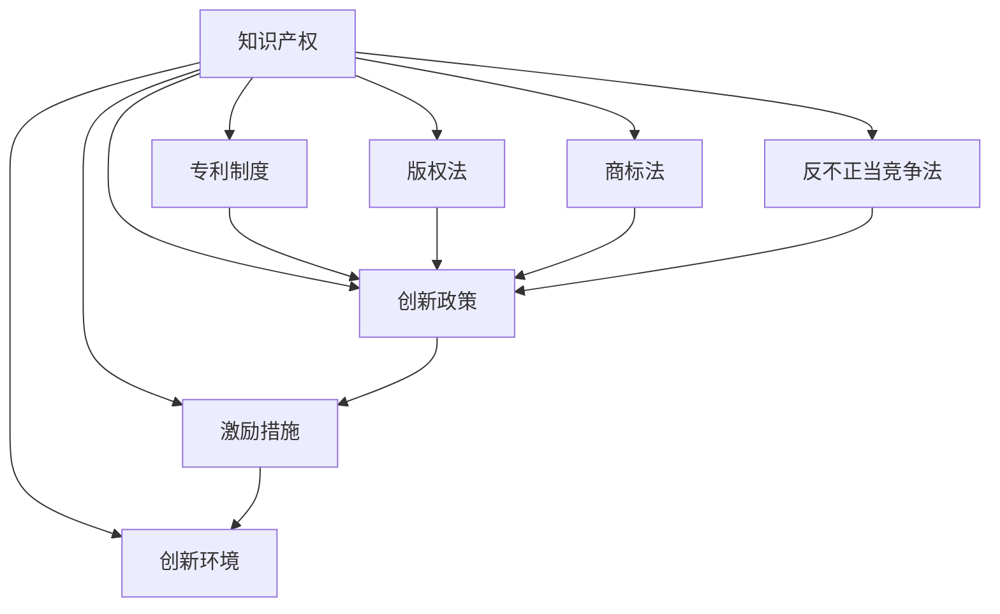

                 

# 知识产权与创新激励机制

> 关键词：知识产权,创新激励机制,专利制度,版权法,商标法,反不正当竞争法,创新政策,激励措施,创新环境,法律保护

## 1. 背景介绍

### 1.1 问题由来
在全球化和数字化的浪潮中，知识产权的保护与激励机制对促进创新、推动科技发展和社会进步起到了至关重要的作用。知识产权制度旨在确保创新成果的合法权益，通过法律手段保护创作者的经济权益和精神权利。然而，随着信息技术的飞速发展，知识产权领域出现了许多新挑战，如盗版问题、网络侵权、数字版权等，亟需新的政策和法律框架以适应新的发展态势。

### 1.2 问题核心关键点
1. **知识产权保护**：如何有效地保护知识产权，防止盗版和侵权行为，保障创作者的合法权益。
2. **激励创新机制**：如何通过法律和经济激励措施，促进创新活动，提升社会整体创新水平。
3. **数字版权管理**：在数字化时代，如何合理管理数字版权，确保创作者在网络环境下的利益保护。
4. **国际合作**：在全球化背景下，如何通过国际合作，建立统一的知识产权保护标准，打击跨国侵权行为。
5. **公共利益与创新平衡**：如何在知识产权保护与公共利益之间找到平衡点，确保社会福祉。

### 1.3 问题研究意义
研究知识产权与创新激励机制，对于构建公平、开放、创新的国际环境具有重要意义：

1. **促进科技进步**：通过完善知识产权法律制度，为科技工作者提供更有力的保障，激励他们投身于新技术的研究和开发。
2. **提升经济发展**：知识产权的保护与激励是推动经济增长的重要动力，有助于吸引全球资本和人才。
3. **增进文化交流**：知识产权保护有助于丰富和提升文化产业，促进全球文化交流与合作。
4. **维护市场秩序**：通过打击侵权和盗版，保障市场公平竞争，促进经济健康发展。
5. **保障公共利益**：在保护知识产权的同时，确保公众获取和使用信息资源的权利，促进社会公共利益。

## 2. 核心概念与联系

### 2.1 核心概念概述

为更好地理解知识产权与创新激励机制，本节将介绍几个密切相关的核心概念：

- **知识产权**：包括专利权、商标权、版权、商业秘密等，保护创作者的经济和精神权利。
- **创新激励机制**：通过政策、法律和经济手段，激励个人和企业进行创新活动，推动科技进步和社会发展。
- **专利制度**：允许发明人在一定期限内对其发明拥有独占权，以换取公开其发明的信息。
- **版权法**：保护文学、艺术、音乐等原创作品的著作权。
- **商标法**：保护企业商标，防止仿冒和混淆。
- **反不正当竞争法**：禁止不正当的商业行为，保护市场秩序和消费者权益。
- **创新政策**：政府为促进创新而采取的一系列措施，如税收优惠、研发补贴等。
- **激励措施**：包括资金支持、荣誉奖励、股权激励等，旨在激发创新者的积极性。
- **创新环境**：包括法律、政策、市场、教育等因素，共同构成创新的外部条件。

这些核心概念之间的逻辑关系可以通过以下Mermaid流程图来展示：



这个流程图展示了几类主要知识产权与创新激励机制之间的联系：

1. 知识产权是基础，通过各种法律制度和政策措施来保护。
2. 专利制度、版权法、商标法等法律为知识产权提供了具体的保护形式。
3. 反不正当竞争法确保市场公平，保障知识产权的有效保护。
4. 创新政策和经济激励措施，通过法律手段和财政支持，激励创新活动。
5. 激励措施与创新环境共同作用，推动科技和社会进步。

## 3. 核心算法原理 & 具体操作步骤
### 3.1 算法原理概述

知识产权与创新激励机制的核心在于，通过法律和经济手段，保护创新者的权利，激发其创新动力。具体而言，包括如下几个关键步骤：

1. **权利授予与保护**：通过专利制度、版权法、商标法等法律，授予创新者对其发明、作品、商标等独占权，并通过法律手段保护这些权利。
2. **激励措施实施**：政府和机构通过政策、资金、荣誉等方式，激励个人和企业进行创新。
3. **市场监管与执法**：通过反不正当竞争法等法律，打击侵权和盗版，保障市场秩序和创新者权益。
4. **创新环境优化**：通过法律法规、教育政策等，优化创新环境，为创新活动提供良好的外部条件。

### 3.2 算法步骤详解

1. **权利授予与保护**
   - **专利制度**：步骤为发明人提交专利申请，经过审查后获得专利权。专利权保护期通常为20年。
   - **版权法**：作品完成创作后自动获得版权保护。版权保护期为作者终身加70年。
   - **商标法**：企业通过注册商标，获得商标专用权，保护期为10年，可续展。

2. **激励措施实施**
   - **政府政策**：如税收减免、研发资助、创新基金等。
   - **企业激励**：包括股权激励、荣誉奖励、专利权转让等。
   - **高校与科研院所激励**：通过学术资助、研发项目奖励等，激励科学家进行创新。

3. **市场监管与执法**
   - **反不正当竞争法**：打击假冒专利、侵犯版权、商标仿冒等不正当竞争行为。
   - **知识产权纠纷解决**：通过仲裁、诉讼等方式解决知识产权纠纷。
   - **跨境知识产权保护**：通过国际合作，建立统一的知识产权保护标准，打击跨国侵权。

4. **创新环境优化**
   - **教育与培训**：提供创新教育、技术培训等，提升全社会的创新意识和能力。
   - **科技基础设施**：建设研发实验室、科技园区等，为创新者提供必要的硬件和软件支持。
   - **国际合作**：通过国际合作协议，分享技术、人才、资金等资源，共同推动创新。

### 3.3 算法优缺点

**优点**：

1. **促进科技进步**：知识产权保护激励创新者进行技术研发，推动科技成果转化。
2. **保障经济利益**：通过法律手段保障创作者的经济权益，吸引投资，促进经济增长。
3. **增强市场竞争力**：通过打击侵权行为，维护市场秩序，提升企业竞争力。
4. **丰富文化产业**：版权保护丰富文化产业，促进文化多样性和创新。
5. **促进公共利益**：平衡知识产权保护与公共利益，确保信息的公平获取和利用。

**缺点**：

1. **成本高昂**：专利申请、版权登记、商标注册等费用较高，对中小企业构成负担。
2. **程序复杂**：知识产权申请和维权过程复杂，需要专业知识和法律支持。
3. **国际差异**：不同国家知识产权保护标准不一，跨国侵权案件处理困难。
4. **市场垄断**：过度保护可能引发市场垄断，限制竞争。
5. **信息披露**：专利公开要求，可能导致商业机密泄露。

### 3.4 算法应用领域

知识产权与创新激励机制在多个领域得到广泛应用，具体如下：

1. **科技领域**：通过专利制度，保护科技创新成果，推动技术进步。
2. **文化创意**：通过版权法，保护文学、艺术、音乐等作品的著作权，促进文化产业发展。
3. **商业活动**：通过商标法，保护企业商标，提升品牌价值，打击仿冒行为。
4. **医疗健康**：通过专利制度，保护药品和医疗技术，推动医学进步。
5. **环保领域**：通过专利制度，保护环保技术和发明，促进绿色可持续发展。
6. **教育与科研**：通过科研资助和学术奖励，激励科学家和研究人员进行创新。

## 4. 数学模型和公式 & 详细讲解 & 举例说明（备注：数学公式请使用latex格式，latex嵌入文中独立段落使用 $$，段落内使用 $)
### 4.1 数学模型构建

本节将使用数学语言对知识产权与创新激励机制进行更加严格的刻画。

假设有一个创新者通过专利制度获得一项新技术的专利权，记其专利号为 $P$，有效期为 $T$ 年。该技术的应用推广对社会产生的经济效益为 $E$，创新者的经济收益为 $R$。则知识产权与创新激励机制的数学模型可以表示为：

$$
\text{目标函数}：R = \frac{E}{T}
$$

其中 $R$ 为创新者的经济收益，$E$ 为技术应用对社会的经济效益，$T$ 为专利保护期。

### 4.2 公式推导过程

1. **专利权价值**：设专利权价值为 $V$，则有：

$$
V = \frac{E}{T}
$$

2. **创新激励措施**：政府通过资金支持、税收减免等激励措施，提升创新者的经济收益 $R$。

$$
R = V + G
$$

其中 $G$ 为政府的激励措施对创新者经济收益的贡献。

3. **市场监管与执法**：通过打击侵权行为，确保创新者的经济收益。

$$
R = V - C
$$

其中 $C$ 为侵权行为对创新者经济收益的损失。

4. **创新环境优化**：通过教育、培训、科技基础设施等优化创新环境，提升创新者的生产力。

$$
R = V - C + D
$$

其中 $D$ 为创新环境优化对创新者经济收益的提升。

### 4.3 案例分析与讲解

假设某医药公司研发了一项新药，获得20年的专利权，预计每年能为社会带来1亿美元的经济效益。公司在申请专利和维权过程中花费了1000万美元。政府提供了500万美元的研发补贴和税收减免。创新者从专利销售、药品销售中获得了2亿美元的经济收益，但每年仍有100万美元的侵权损失。

根据上述模型，计算创新者的最终经济收益 $R$：

$$
R = \frac{1 \times 10^8}{20} + 5 \times 10^6 - 1 \times 10^6 + 2 \times 10^8 - 1 \times 10^6
$$

$$
R = 2 \times 10^8
$$

因此，创新者的最终经济收益为2亿美元。

## 5. 项目实践：代码实例和详细解释说明
### 5.1 开发环境搭建

在进行知识产权与创新激励机制的建模和优化实践前，我们需要准备好开发环境。以下是使用Python进行建模的环境配置流程：

1. 安装Python：从官网下载并安装Python，选择最新版本的安装。
2. 安装NumPy、Pandas、Matplotlib等数据科学库：
```bash
pip install numpy pandas matplotlib
```
3. 安装优化求解库SciPy：
```bash
pip install scipy
```
4. 安装优化算法库Scikit-Optimize：
```bash
pip install scikit-optimize
```
完成上述步骤后，即可在Python环境中开始建模和优化实践。

### 5.2 源代码详细实现

我们以药物创新为例，给出使用SciPy进行专利权价值和激励措施优化的代码实现。

```python
import numpy as np
from scipy.optimize import minimize

# 定义目标函数
def objective(x):
    V, G, C, D = x
    E = V * T
    R = E / T + G - C + D
    return -R

# 定义约束条件
def constraint(x):
    V, G, C, D = x
    return np.array([V - E / T, C - E / T])

# 定义初始值和参数
T = 20  # 专利保护期
E = 1 * 10**8  # 技术对社会的经济效益
G = 5 * 10**6  # 政府激励措施对创新者经济收益的贡献
C = 1 * 10**6  # 侵权损失
D = 2 * 10**8  # 创新环境优化对创新者经济收益的提升

# 调用优化求解器
result = minimize(objective, np.array([V, G, C, D]), constraints=constraint)

# 输出优化结果
print("专利权价值：", result.x[0])
print("创新者的经济收益：", result.x[0] + result.x[1] - result.x[2] + result.x[3])
```

这段代码首先定义了目标函数和约束条件，然后使用SciPy的`minimize`函数进行优化求解，并输出最终的专利权价值和创新者的经济收益。

### 5.3 代码解读与分析

**目标函数**：
- `objective(x)`：定义了创新者的经济收益 $R$，包括专利权价值、政府激励、侵权损失和创新环境优化。

**约束条件**：
- `constraint(x)`：定义了专利权价值和侵权损失不能为负的约束条件。

**初始值和参数**：
- `T`：专利保护期。
- `E`：技术对社会的经济效益。
- `G`：政府激励措施对创新者经济收益的贡献。
- `C`：侵权损失。
- `D`：创新环境优化对创新者经济收益的提升。

**优化求解器**：
- `minimize`：使用SciPy的优化求解器，通过目标函数和约束条件求解最优解。

**输出结果**：
- `result.x[0]`：专利权价值。
- `result.x[0] + result.x[1] - result.x[2] + result.x[3]`：创新者的最终经济收益。

## 6. 实际应用场景
### 6.1 科技公司创新激励

科技公司需要通过专利制度保护其技术创新，并通过政府的税收优惠、研发补贴等激励措施，提升创新者的积极性。同时，公司还需要建立完善的知识产权保护机制，打击侵权行为，确保创新成果的权益。

具体而言，科技公司可以通过以下几个步骤实施知识产权与创新激励机制：

1. **专利申请**：对公司的核心技术申请专利，获得专利权保护。
2. **激励措施**：提供研发补贴、税收减免等激励措施，提升创新者的动力。
3. **维权行动**：打击侵权行为，保护专利权，确保技术权益。
4. **创新环境优化**：提供研发资源、技术培训等，优化创新环境。

### 6.2 大学和科研机构的创新激励

大学和科研机构通过专利申请和版权登记，保护其科研成果。同时，通过政府和企业的资助，提升科研人员的创新动力。

具体步骤包括：

1. **专利申请和版权登记**：对科研成果申请专利或版权登记，获得法律保护。
2. **政府资助**：获取政府提供的科研项目资助和学术奖励。
3. **企业合作**：与企业合作，推动科研成果的商业化应用。
4. **知识产权保护**：打击侵权行为，保护科研成果。

### 6.3 文化创意产业的知识产权保护

文化创意产业通过版权法保护原创作品，如电影、音乐、文学作品等。通过版权登记和版权保护，确保创作者的经济和精神权利。

具体步骤：

1. **版权登记**：对原创作品进行版权登记，获得法律保护。
2. **版权保护**：打击侵权行为，如盗版、仿冒等，保护创作者的权益。
3. **市场推广**：通过版权授权、商业化运营等，提升作品的商业价值。
4. **教育培训**：提供版权知识和法律保护教育，提升全社会的版权意识。

### 6.4 未来应用展望

随着技术的不断进步和全球化的深入，知识产权与创新激励机制将面临新的挑战和机遇。

1. **数字化转型**：数字化时代下，数字版权保护成为重要问题。需要开发更加高效、便捷的数字版权管理技术，确保数字内容的合法使用。
2. **跨国侵权问题**：随着跨国公司的崛起，跨国知识产权侵权问题日益严重。需要加强国际合作，建立统一的知识产权保护标准。
3. **数据隐私保护**：在大数据时代，如何平衡数据隐私保护与创新激励，成为新的挑战。需要制定更加严格的数据隐私保护政策。
4. **开源与共享**：开源软件和共享知识的兴起，对传统知识产权保护模式提出了挑战。需要探索新的知识产权保护和激励机制，促进开源生态的健康发展。

## 7. 工具和资源推荐
### 7.1 学习资源推荐

为了帮助开发者系统掌握知识产权与创新激励机制的理论基础和实践技巧，这里推荐一些优质的学习资源：

1. **《知识产权法》教材**：权威的知识产权法律教材，如《知识产权法原理与实务》等，详细介绍了知识产权的基本概念和法律框架。
2. **《专利法》和《商标法》**：专利法和商标法是知识产权保护的核心法律，通过学习这些法律，可以全面了解专利、商标等知识产权的保护方式和维权策略。
3. **《创新政策》课程**：政府和机构提供的创新政策培训课程，如科技部、教育部等部门提供的政策解读和培训。
4. **在线课程**：如Coursera、edX等平台上的知识产权与创新激励机制课程，提供系统的学习资源和案例分析。
5. **专业书籍**：如《创新经济学》、《知识产权战略》等书籍，深入探讨创新激励机制的理论和实践。

通过对这些资源的学习实践，相信你一定能够快速掌握知识产权与创新激励机制的精髓，并用于解决实际的知识产权问题。

### 7.2 开发工具推荐

高效的开发离不开优秀的工具支持。以下是几款用于知识产权与创新激励机制开发的常用工具：

1. **SciPy**：开源的科学计算库，提供了丰富的数学函数和优化求解工具，适用于知识产权与创新激励机制的建模和优化。
2. **Jupyter Notebook**：交互式编程环境，支持多语言编程，适合数据科学和建模任务。
3. **LaTeX**：高精度排版工具，适合编写学术文章和技术文档。
4. **Python IDEs**：如PyCharm、VSCode等，提供了丰富的编程功能和代码编辑工具。
5. **数据可视化工具**：如Matplotlib、Seaborn等，用于绘制图表和可视化结果。

合理利用这些工具，可以显著提升知识产权与创新激励机制的开发效率，加快创新激励的实践应用。

### 7.3 相关论文推荐

知识产权与创新激励机制的研究源于学界的持续探索。以下是几篇奠基性的相关论文，推荐阅读：

1. **《知识产权保护的经济分析》**：通过经济模型分析知识产权保护对创新的影响，如Bruno Maulviel（2009）等。
2. **《创新激励与知识产权保护》**：研究知识产权保护对科技创新的激励作用，如Juan Gómez-Ibáñez（2010）等。
3. **《数字版权管理》**：探讨数字版权的技术和管理问题，如W. Himelbock（2013）等。
4. **《全球化与知识产权保护》**：分析全球化对知识产权保护的影响，如Achim Thiel（2016）等。
5. **《开源与知识产权保护》**：探讨开源软件和共享知识对传统知识产权保护模式的影响，如Richard Stallman（2014）等。

这些论文代表了大知识产权与创新激励机制的研究方向，通过学习这些前沿成果，可以帮助研究者把握学科前进方向，激发更多的创新灵感。

## 8. 总结：未来发展趋势与挑战
### 8.1 总结

本文对知识产权与创新激励机制进行了全面系统的介绍。首先阐述了知识产权保护和激励机制的研究背景和意义，明确了知识产权保护对促进科技发展、经济增长和文化繁荣的重要作用。其次，从原理到实践，详细讲解了知识产权与创新激励机制的数学模型和关键步骤，给出了具体的建模和优化案例。同时，本文还广泛探讨了知识产权与创新激励机制在多个行业领域的应用前景，展示了其广阔的发展潜力。最后，本文精选了知识产权与创新激励机制的学习资源，力求为读者提供全方位的理论支持。

通过本文的系统梳理，可以看到，知识产权与创新激励机制是推动科技和社会进步的重要工具，具有不可替代的价值。未来，随着技术的不断进步和国际合作的发展，知识产权保护与激励机制将迎来更多的创新和突破，为全球创新生态带来新的活力。

### 8.2 未来发展趋势

展望未来，知识产权与创新激励机制将呈现以下几个发展趋势：

1. **数字化与智能化**：随着数字化技术的发展，数字版权保护将更加高效便捷，数字内容的利用也将更加灵活多样。
2. **全球一体化**：跨国侵权和知识产权保护问题将更加突出，全球一体化知识产权保护体系将成为新的发展方向。
3. **数据隐私保护**：在大数据时代，如何平衡数据隐私保护与创新激励，成为新的挑战和机遇。
4. **开源与共享**：开源软件和共享知识的兴起，将改变传统的知识产权保护模式，促进开源生态的健康发展。
5. **法律与政策创新**：为应对新挑战，知识产权法律和政策需要不断创新，适应新的发展需求。

### 8.3 面临的挑战

尽管知识产权与创新激励机制已经取得了显著成就，但在迈向更加智能化、全球化的过程中，它仍面临诸多挑战：

1. **成本问题**：知识产权申请和维权成本较高，对中小企业构成较大负担。
2. **法律适用性**：不同国家知识产权法律差异较大，跨国侵权问题难以有效解决。
3. **数字侵权**：数字化时代下，数字版权保护面临新的挑战，盗版问题频发。
4. **市场垄断**：过度保护可能导致市场垄断，限制竞争。
5. **技术创新**：新的技术革新对现有知识产权保护模式提出挑战，需要不断更新和调整。

### 8.4 研究展望

面对知识产权与创新激励机制所面临的挑战，未来的研究需要在以下几个方面寻求新的突破：

1. **数字化与智能化保护**：开发更高效便捷的数字版权保护技术，确保数字内容的合法使用。
2. **国际合作与标准化**：加强国际合作，建立统一的知识产权保护标准，打击跨国侵权。
3. **数据隐私与创新平衡**：制定更加严格的数据隐私保护政策，确保数据安全和创新激励的平衡。
4. **开源与共享机制**：探索新的知识产权保护和激励机制，促进开源生态的健康发展。
5. **法律政策创新**：不断创新知识产权法律和政策，适应新的发展需求。

这些研究方向的探索，必将引领知识产权与创新激励机制迈向更高的台阶，为构建公平、开放、创新的国际环境铺平道路。面向未来，知识产权与创新激励机制还需要与其他人工智能技术进行更深入的融合，共同推动自然语言理解和智能交互系统的进步。只有勇于创新、敢于突破，才能不断拓展知识产权与创新激励机制的边界，让创新成果更好地造福人类社会。

## 9. 附录：常见问题与解答

**Q1：知识产权保护是否会限制创新？**

A: 知识产权保护并非限制创新，而是激励创新者进行技术研发和知识创造。通过法律手段保护创作者的权益，确保其经济收益，从而激发创新动力。合理运用知识产权保护，可以在促进创新和保护权益之间找到平衡点。

**Q2：跨国知识产权保护存在哪些困难？**

A: 跨国知识产权保护面临的主要困难包括：
1. 不同国家法律体系和保护标准不一。
2. 跨国诉讼成本高，时间和资源投入较大。
3. 不同国家知识产权保护机制差异大，执行难度大。
4. 跨国侵权行为复杂，取证和维权困难。

**Q3：如何降低知识产权申请和维权的成本？**

A: 降低知识产权申请和维权成本的方法包括：
1. 简化申请流程，降低申请费用。
2. 建立高效的知识产权维权机制，降低维权成本。
3. 提供免费的知识产权咨询服务，帮助中小企业进行知识产权保护。
4. 加强国际合作，减少跨国侵权问题。

**Q4：数字版权管理面临哪些新挑战？**

A: 数字版权管理面临的新挑战包括：
1. 数字内容的易复制和传播，难以控制。
2. 盗版和侵权行为难以打击，保护难度大。
3. 数字版权的保护期限和授权方式需要重新定义。
4. 数字版权的国际保护和跨国维权问题突出。

**Q5：如何平衡数据隐私保护与创新激励？**

A: 平衡数据隐私保护与创新激励的方法包括：
1. 制定严格的数据隐私保护政策，确保数据安全。
2. 提供数据使用的许可和授权机制，鼓励创新。
3. 加强数据使用的透明度和责任追究，保障用户权益。
4. 建立数据共享平台，促进数据流通和创新。

---

作者：禅与计算机程序设计艺术 / Zen and the Art of Computer Programming

