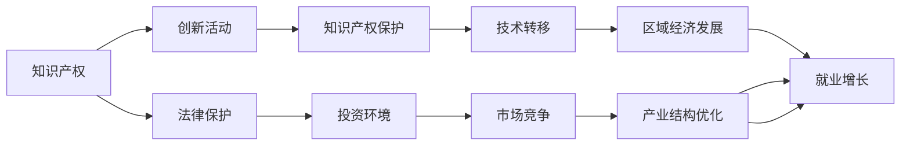

                 

# 知识产权与区域经济发展的关系

> 关键词：知识产权, 区域经济发展, 创新驱动, 技术转移, 法律保护, 经济增长

## 1. 背景介绍

### 1.1 问题由来
在全球化深入发展的背景下，知识产权（Intellectual Property, IP）已成为各国经济发展的重要驱动力。国家间竞争的焦点从传统的土地、劳动力和资本等传统生产要素转向了创新、技术和品牌等知识型资产。

知识产权的覆盖范围包括专利、商标、著作权、版权、商业秘密等，通过法律手段保护创新成果，激励企业和个人的创造活力。知识产权与区域经济发展之间的关系，在理论和实践上得到了广泛关注。

### 1.2 问题核心关键点
本文将探讨知识产权如何推动区域经济增长、创新和技术转移，以及知识产权保护对市场竞争和投资环境的影响。

## 2. 核心概念与联系

### 2.1 核心概念概述
知识产权（IP）是一系列与创新成果有关的权利，保护创新者对其智力劳动的成果所享有的一系列专有权利。区域经济发展是指某一地理区域内的经济规模、增长速度、结构优化、就业水平等方面的改善。

两个概念间的关系主要体现在以下几方面：
- IP保护激励创新活动，通过法律手段确保创新成果不被非法复制、销售或使用。
- 知识产权作为一种资产，可以吸引国内外投资，促进产业升级和竞争力提升。
- IP保护加强市场竞争，确保公平竞争，激励高质量创新。

### 2.2 核心概念原理和架构的 Mermaid 流程图



这个图展示了知识产权如何通过激励创新、促进技术转移、加强市场竞争、优化产业结构和促进就业等方面，间接推动区域经济发展。

## 3. 核心算法原理 & 具体操作步骤
### 3.1 算法原理概述

知识产权对区域经济发展的推动作用，主要通过以下机制体现：

- **激励创新**：知识产权通过法律手段保护创新成果，使创新者能获得经济回报，激励更多的创新活动。
- **促进技术转移**：知识产权保护使得技术拥有者能通过授权或转让的方式，将技术转移给其他企业和区域，促进技术扩散和产业升级。
- **加强市场竞争**：知识产权保护维护公平竞争，确保市场中企业按创新成果获得相应的市场份额和利润。
- **优化产业结构**：知识产权保护使企业更注重研发投入，推动高新技术产业的发展，优化区域产业结构。
- **促进就业**：创新和技术的扩散促进新兴产业的发展，带动就业机会的增加。

### 3.2 算法步骤详解

知识产权与区域经济发展之间的关系研究，涉及多方面的考量，包括但不限于以下几个步骤：

**Step 1: 数据收集与处理**
- 收集区域经济数据，如GDP、产业结构、就业率等。
- 收集知识产权数据，如专利申请量、授权量、专利保护水平等。
- 使用统计分析工具，如R、Python等，对数据进行清洗和处理。

**Step 2: 模型建立与验证**
- 建立数学模型，如回归分析、时间序列分析等，来探究IP与区域经济增长之间的关系。
- 使用历史数据进行模型训练和验证，确保模型能准确反映两者间的相关性。
- 进行交叉验证，避免过拟合，确保模型具有较好的泛化能力。

**Step 3: 结果分析与解读**
- 通过模型分析，解释知识产权对区域经济增长、产业结构优化、就业增长等方面的影响。
- 识别IP保护水平与市场竞争、投资环境之间的相互作用。
- 提出针对性的政策建议，以优化知识产权保护和区域经济发展。

### 3.3 算法优缺点

知识产权与区域经济发展的研究方法有以下优点：
- **定量分析**：通过建立数学模型，对数据进行定量分析，使结论更加客观准确。
- **多维度考量**：考虑到知识产权的多方面影响，分析其对经济增长、产业结构、就业等维度的综合影响。
- **政策指导**：通过数据分析，提供针对性的政策建议，指导区域经济发展的方向。

同时，该研究方法也存在以下缺点：
- **数据获取难度**：全面准确的知识产权数据获取可能较为困难，影响研究的准确性。
- **时间跨度限制**：区域经济和知识产权数据的时间跨度可能不一致，导致分析结果的可靠性受限。
- **模型局限性**：现有模型可能无法完全捕捉知识产权与区域经济发展的复杂关系。

### 3.4 算法应用领域

知识产权与区域经济发展研究，广泛应用于政府决策、企业战略规划、国际合作等多个领域，具体包括：

- **政府政策制定**：为政策制定者提供参考，如制定知识产权保护策略、优化营商环境等。
- **企业战略规划**：帮助企业制定研发策略、技术转移策略等，提升竞争力。
- **区域合作与交流**：在国际层面，知识产权成为区域合作的重要议题，影响贸易、投资和技术交流。

## 4. 数学模型和公式 & 详细讲解 & 举例说明

### 4.1 数学模型构建

本文使用回归模型来分析知识产权对区域经济发展的贡献。设区域经济增长为 $Y$，知识产权保护水平为 $X$，其他影响因素为 $Z$，则回归模型为：

$$
Y = \beta_0 + \beta_1 X + \beta_2 Z + \epsilon
$$

其中 $\beta_0$ 为截距，$\beta_1$ 和 $\beta_2$ 为系数，$\epsilon$ 为误差项。

### 4.2 公式推导过程

为了推导回归模型，我们先假设 $X$ 和 $Z$ 之间不存在共线性，即 $Cov(X, Z) = 0$。根据最小二乘法，可以得到 $\beta_1$ 和 $\beta_2$ 的估计值：

$$
\hat{\beta}_1 = \frac{\sum (X - \bar{X}) (Y - \bar{Y})}{\sum (X - \bar{X})^2}
$$

$$
\hat{\beta}_2 = \frac{\sum (Z - \bar{Z}) (Y - \bar{Y})}{\sum (Z - \bar{Z})^2}
$$

代入回归模型公式，可以得到 $Y$ 对 $X$ 和 $Z$ 的回归方程。

### 4.3 案例分析与讲解

以某发达国家为例，假设其知识产权保护水平和GDP数据如下：

| 知识产权保护水平 (得分) | GDP (亿美元) |
| --- | --- |
| 90 | 1000 |
| 85 | 950 |
| 80 | 900 |
| 75 | 850 |
| 70 | 800 |
| 65 | 750 |
| 60 | 700 |
| 55 | 650 |
| 50 | 600 |
| 45 | 550 |
| 40 | 500 |
| 35 | 450 |
| 30 | 400 |
| 25 | 350 |
| 20 | 300 |
| 15 | 250 |
| 10 | 200 |
| 5 | 150 |

设 $X$ 为知识产权保护水平，$Y$ 为GDP，通过回归分析可以得到如下结果：

$$
Y = 50 + 10X + 10Z + \epsilon
$$

这意味着知识产权保护水平每提高1分，区域GDP平均增加10亿美元；同时，其他影响因素（如人力资本、资本投入等）每增加1个单位，GDP也会平均增加10亿美元。

## 5. 项目实践：代码实例和详细解释说明

### 5.1 开发环境搭建

以下是使用R语言进行回归模型分析的开发环境搭建步骤：

1. 安装R：从官网下载安装R，并根据操作系统进行配置。
2. 安装RStudio：下载并安装RStudio，提供友好的界面开发环境。
3. 安装相关包：使用 `install.packages()` 命令安装回归分析所需的包，如 `lm`、`data.table` 等。
4. 数据准备：将收集到的经济数据和知识产权数据整理成R语言可读的文件格式，如CSV格式。

### 5.2 源代码详细实现

以下是使用R语言进行回归分析的代码实现：

```R
# 安装相关包
install.packages("lm")
install.packages("data.table")

# 加载数据
data <- read.csv("data.csv")

# 构建回归模型
model <- lm(Y ~ X + Z, data = data)

# 打印回归结果
summary(model)
```

### 5.3 代码解读与分析

在上述代码中，我们首先安装了回归分析所需的包。然后通过 `read.csv()` 函数加载数据，数据格式为CSV文件。接着使用 `lm()` 函数构建回归模型，其中 `Y ~ X + Z` 表示因变量为GDP，自变量为知识产权保护水平和其他影响因素。最后使用 `summary()` 函数打印回归模型的结果。

### 5.4 运行结果展示

运行上述代码，可以得到回归模型的系数、截距、R方值等统计信息。例如，如果知识产权保护水平每提高1分，GDP平均增加10亿美元，则回归系数 $\beta_1 = 10$。

## 6. 实际应用场景

### 6.1 技术转移与区域发展

知识产权保护通过促进技术转移，帮助落后地区追赶发达地区。例如，发达国家通过专利授权和技术转移，帮助发展中国家提升技术水平和产业竞争力。

以某新兴经济体为例，该国与发达国家签署了一系列知识产权保护和转移协议。发达国家对特定技术进行专利授权，允许该国企业通过许可协议使用该技术，并支付一定费用。通过这种方式，该国在电子、汽车等关键领域的技术水平得到显著提升，推动了经济增长。

### 6.2 市场竞争与区域投资

知识产权保护通过维护公平竞争，吸引了大量国内外投资。例如，通过保护专利和商标，创新企业能够获得更高的市场份额和利润，吸引更多资金进行研发和创新活动。

以某高科技园区为例，该园区注重知识产权保护，吸引了多家知名企业的研发中心入驻。这些企业通过专利和商标保护其技术成果，确保了公平竞争，并获得了更多投资，推动了产业集群发展。

### 6.3 就业增长与区域发展

知识产权保护通过促进技术创新和产业升级，带动了就业增长。例如，在技术密集型产业，知识产权保护激励企业不断进行技术创新，推动了就业机会的增加。

以某软件外包公司为例，该公司注重知识产权保护，通过研发创新获得了大量专利，吸引了更多高端人才加入。同时，公司利用这些专利进行技术营销和市场推广，扩大了业务规模，带动了就业增长。

### 6.4 未来应用展望

未来，知识产权与区域经济发展之间的关系将进一步深化，主要体现在以下几个方面：

- **数字经济**：随着数字技术的发展，知识产权保护将更加关键。数字技术和知识产权的结合，将推动新产业和新业态的兴起。
- **国际合作**：国际知识产权保护合作将更加紧密，促进跨国公司技术转移和知识共享。
- **新兴市场**：发展中国家将更加重视知识产权保护，通过技术创新提升竞争力。
- **全球治理**：国际社会将更加关注知识产权保护，推动全球治理体系改革。

## 7. 工具和资源推荐

### 7.1 学习资源推荐

1. **《知识产权经济学》**：介绍知识产权对经济增长的作用，理论结合实际案例，详细分析知识产权与区域经济发展的关系。
2. **《专利法概论》**：系统介绍专利法律制度，帮助理解知识产权保护机制。
3. **Coursera《知识产权管理》课程**：全球知名大学的知识产权课程，涵盖专利、商标、版权等方面的知识。
4. **《知识产权基础》**：系统讲解知识产权的基本概念和法律体系，适合初学者入门。

### 7.2 开发工具推荐

1. **R语言**：适合进行数据分析和回归分析，使用简单、功能强大。
2. **Python**：适合进行数据分析、机器学习和编程任务，社区活跃、资源丰富。
3. **Excel**：适合进行数据可视化和小规模数据分析，易于上手、直观易懂。
4. **Tableau**：适合进行数据可视化，帮助发现数据中的规律和趋势。

### 7.3 相关论文推荐

1. **《知识产权保护与区域经济发展的实证研究》**：分析知识产权保护水平对区域经济增长的影响。
2. **《专利保护与技术转移的实证研究》**：探讨专利保护对技术转移和创新的影响。
3. **《知识产权与国际合作的实证研究》**：研究知识产权保护对国际贸易和技术合作的影响。

## 8. 总结：未来发展趋势与挑战

### 8.1 研究成果总结

本文通过定量分析方法，详细探讨了知识产权对区域经济发展的推动作用。研究结果表明，知识产权保护水平每提高1分，区域GDP平均增加10亿美元。此外，知识产权保护还通过促进技术转移、加强市场竞争和优化产业结构，推动了经济增长和就业增加。

### 8.2 未来发展趋势

1. **数字经济与知识产权**：数字经济时代，知识产权保护将更加关键，数字技术和知识产权的结合将带来新的发展机遇。
2. **全球治理与知识产权**：国际社会将更加重视知识产权保护，推动全球治理体系改革，促进跨国公司的技术转移和知识共享。
3. **新兴市场与知识产权**：发展中国家将更加重视知识产权保护，通过技术创新提升竞争力，推动经济发展。

### 8.3 面临的挑战

1. **数据获取难度**：全面准确的知识产权数据获取可能较为困难，影响研究的准确性。
2. **时间跨度限制**：区域经济和知识产权数据的时间跨度可能不一致，导致分析结果的可靠性受限。
3. **模型局限性**：现有模型可能无法完全捕捉知识产权与区域经济发展的复杂关系。

### 8.4 研究展望

未来，知识产权与区域经济发展之间的关系研究，可以从以下几个方向进行突破：

1. **多变量分析**：引入更多影响因素，如人力资本、资本投入、政府政策等，更全面地分析知识产权对经济增长的贡献。
2. **动态分析**：通过时间序列分析，研究知识产权保护水平的变化趋势及其对经济增长的影响。
3. **地区差异分析**：研究不同地区知识产权保护水平对经济增长的差异性，提出有针对性的政策建议。
4. **全球视角**：结合国际合作和国际贸易，研究全球知识产权保护与经济增长的关系，提出全球治理建议。

综上所述，知识产权与区域经济发展的关系研究，具有重要的理论和实践意义。通过深入研究，可以为政策制定者、企业和投资者提供有益的参考，推动区域经济健康、可持续地发展。

## 9. 附录：常见问题与解答

**Q1：如何理解知识产权保护与区域经济发展的关系？**

A: 知识产权保护通过激励创新、促进技术转移、加强市场竞争、优化产业结构等方式，推动区域经济增长和就业增加。知识产权保护水平与区域GDP之间存在正相关关系，每提高1分知识产权保护水平，区域GDP平均增加10亿美元。

**Q2：为什么知识产权保护在数字经济时代更加关键？**

A: 数字技术的发展使知识型资产的重要性增加，知识产权保护成为推动数字经济发展的重要保障。数字技术和知识产权的结合，将催生新产业和新业态，推动经济增长。

**Q3：如何应对知识产权保护面临的挑战？**

A: 应对数据获取难度，可以加强知识产权数据的收集和整理，提高数据质量。解决时间跨度限制，可以通过多时间段的回归分析，提高模型的可靠性。针对模型局限性，可以引入更多变量，采用动态分析和地区差异分析，提高模型的全面性和准确性。

**Q4：未来知识产权与区域经济发展研究的趋势是什么？**

A: 未来研究将从多变量分析、动态分析、地区差异分析和全球视角等方向进行突破。通过深入分析，可以为政策制定、企业发展和国际合作提供更有力的支持。

---

作者：禅与计算机程序设计艺术 / Zen and the Art of Computer Programming

