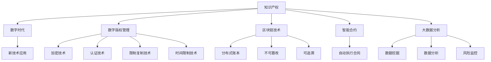

                 

# 知识产权在数字时代的挑战与机遇

## 1. 背景介绍

随着信息技术的快速发展，数字经济已经成为全球经济的重要组成部分。数字技术的应用范围不断扩大，涉及各行各业，包括制造业、金融、医疗、教育、娱乐等。然而，数字经济的发展也带来了新的挑战，尤其是知识产权保护的问题。传统知识产权保护机制在数字时代面临诸多新挑战，例如知识产权侵权行为难以追踪、在线平台知识产权保护难度大、开源社区知识产权管理复杂等。同时，数字经济也带来了新的机遇，例如数字版权保护技术的进步、知识产权交易模式的创新、知识产权服务生态系统的构建等。

## 2. 核心概念与联系

### 2.1 核心概念概述

为了深入理解数字时代知识产权保护的问题和机遇，本节将介绍几个关键概念及其相互联系。

- **知识产权 (Intellectual Property, IP)**：包括版权、商标、专利、工业设计、商业秘密等，是法律认可的一种无形资产。知识产权保护有助于创新和技术进步，鼓励企业和个人创造和传播知识。

- **数字时代**：以数字化、网络化和智能化为特征的时代，数字化技术对社会各领域产生了深远影响。数字时代的特点是数据量大、传播快、可复制性强，给知识产权保护带来了新的挑战。

- **数字版权管理 (Digital Rights Management, DRM)**：通过技术手段保护数字作品（如音乐、电影、软件等）的版权。DRM技术包括加密、认证、限制复制、时间限制等措施。

- **区块链技术**：一种分布式账本技术，具有去中心化、不可篡改、可追溯等特点，可以用于保护知识产权的数字证明和交易。

- **智能合约**：基于区块链技术的自动执行合同，可以用于知识产权的自动化管理、保护和交易。

- **大数据分析**：利用大数据技术进行知识产权的挖掘、分析和监控，有助于发现侵权行为和潜在风险。

这些核心概念构成了数字时代知识产权保护的基础，共同影响着知识产权的创造、保护和应用。

### 2.2 核心概念原理和架构的 Mermaid 流程图



这个流程图展示了知识产权保护的核心概念及其相互关系。知识产权是数字时代的重要资产，通过数字版权管理、区块链技术、智能合约和大数据分析等手段，可以在保护知识产权的同时，促进数字经济的发展。

## 3. 核心算法原理 & 具体操作步骤

### 3.1 算法原理概述

数字时代的知识产权保护涉及多个技术领域的交叉应用，包括计算机科学、法律、经济学等。核心算法原理主要包括：

- **数字版权管理**：通过加密、认证、限制复制等技术手段，保护数字作品的版权。
- **区块链技术**：利用分布式账本和加密技术，提供去中心化、不可篡改的数字证明和交易记录。
- **智能合约**：基于区块链技术的自动化合同，实现知识产权的自动管理和保护。
- **大数据分析**：利用数据挖掘、分析和监控技术，发现和应对知识产权侵权行为。

### 3.2 算法步骤详解

**Step 1: 准备知识产权数据**
- 收集和整理知识产权的相关数据，包括作品、作者、版权信息等。
- 利用大数据分析技术，挖掘知识产权的特征和趋势。

**Step 2: 选择技术手段**
- 根据具体情况，选择数字版权管理、区块链技术、智能合约和大数据分析中的某一种或多种技术。
- 评估技术的可行性和成本，确定最适合的知识产权保护方案。

**Step 3: 实施知识产权保护**
- 利用数字版权管理技术，对数字作品进行加密、认证、限制复制等保护措施。
- 利用区块链技术，记录和验证知识产权的转移和交易。
- 利用智能合约技术，实现知识产权的自动化管理和保护。
- 利用大数据分析技术，监测和发现知识产权侵权行为。

**Step 4: 持续优化和改进**
- 根据知识产权保护的效果和反馈，不断优化和改进技术手段。
- 定期更新和维护数字版权管理、区块链、智能合约和大数据分析系统。

### 3.3 算法优缺点

数字时代的知识产权保护算法具有以下优点：

- **全面性**：通过多种技术的结合，可以实现全面的知识产权保护。
- **自动化**：利用智能合约和大数据分析技术，实现自动化的知识产权管理和保护。
- **透明性**：区块链技术提供了透明的交易记录和验证机制。
- **安全性**：加密、认证、限制复制等技术手段，提高了知识产权的保护水平。

同时，这些算法也存在一些缺点：

- **复杂性**：多种技术的结合增加了实现和维护的复杂性。
- **成本高**：数字版权管理、区块链和智能合约技术的实现需要较高的成本。
- **技术门槛高**：对技术实现和维护的要求较高，需要专业人才的支持。

### 3.4 算法应用领域

数字时代的知识产权保护算法适用于多个领域，包括：

- **媒体和娱乐产业**：音乐、电影、游戏等数字作品的版权保护。
- **软件和应用程序**：开源软件和商业软件的版权保护。
- **电子商务和在线市场**：商品和服务的知识产权管理和保护。
- **科技和创新**：专利和技术的知识产权保护。
- **教育和文化**：著作权和版权的数字化管理和保护。

## 4. 数学模型和公式 & 详细讲解 & 举例说明

### 4.1 数学模型构建

为了描述数字时代知识产权保护的技术框架，我们可以构建以下数学模型：

- **数字版权管理模型**：
$$
\text{DRM}(x, y) = f(x, y)
$$
其中 $x$ 表示数字作品，$y$ 表示版权保护措施，$f$ 表示数字版权管理函数。

- **区块链交易模型**：
$$
\text{Blockchain}(t, s, p) = g(t, s, p)
$$
其中 $t$ 表示时间戳，$s$ 表示智能合约，$p$ 表示交易记录，$g$ 表示区块链交易函数。

- **智能合约执行模型**：
$$
\text{Smart Contract}(x, s) = h(x, s)
$$
其中 $x$ 表示知识产权，$s$ 表示智能合约，$h$ 表示智能合约执行函数。

- **大数据分析模型**：
$$
\text{Big Data}(x, a, r) = k(x, a, r)
$$
其中 $x$ 表示数据集，$a$ 表示分析算法，$r$ 表示风险评估，$k$ 表示大数据分析函数。

### 4.2 公式推导过程

数字版权管理的加密过程可以表示为：
$$
E(x, k) = c
$$
其中 $x$ 表示数字作品，$k$ 表示密钥，$c$ 表示加密后的作品。

区块链交易的验证过程可以表示为：
$$
V(c, t, s, p) = \text{True}
$$
其中 $c$ 表示加密后的作品，$t$ 表示时间戳，$s$ 表示智能合约，$p$ 表示交易记录。

智能合约的执行过程可以表示为：
$$
S(x, s) = r
$$
其中 $x$ 表示知识产权，$s$ 表示智能合约，$r$ 表示执行结果。

大数据分析的风险评估过程可以表示为：
$$
R(x, a) = d
$$
其中 $x$ 表示数据集，$a$ 表示分析算法，$d$ 表示风险评估结果。

### 4.3 案例分析与讲解

假设某电影公司希望通过数字版权管理技术保护其数字作品，可以按照以下步骤进行操作：

1. **数据准备**：收集电影的拍摄、制作、发行等相关信息，构建电影版权数据库。
2. **加密保护**：使用AES或RSA等加密算法对电影进行加密，生成加密密钥和密文。
3. **区块链记录**：将电影的版权信息、加密密钥和时间戳等记录到区块链上，生成加密后的作品和交易记录。
4. **智能合约保护**：制定智能合约，规定电影的分发和版权使用规则，并自动执行和记录。
5. **数据分析监测**：利用大数据分析技术，监测和分析电影版权的使用情况和侵权行为，及时发现并采取措施。

## 5. 项目实践：代码实例和详细解释说明

### 5.1 开发环境搭建

在进行数字版权管理项目开发前，需要先搭建好开发环境。以下是Python环境下，使用DRM模块和Blockchain模块的配置流程：

1. 安装Python解释器和相关库：
   ```bash
   python -m pip install --upgrade pip setuptools wheel
   ```

2. 安装DRM库：
   ```bash
   python -m pip install drm
   ```

3. 安装Blockchain库：
   ```bash
   python -m pip install blockchain
   ```

4. 安装相关依赖库：
   ```bash
   python -m pip install pycrypto
   ```

完成上述步骤后，即可在Python环境中进行DRM和Blockchain模块的开发。

### 5.2 源代码详细实现

下面以数字版权管理为例，展示使用DRM模块实现电影版权加密的代码：

```python
import drm
from cryptography.fernet import Fernet

# 生成加密密钥
key = Fernet.generate_key()

# 加密电影文件
with open('movie.mp4', 'rb') as f:
    movie_data = f.read()
    cipher_suite = drm.FinalCipher()
    cipher_suite.set_key(key)
    cipher_suite.encrypt(movie_data)
    encrypted_movie = cipher_suite.finish()
    
# 记录交易到区块链
blockchain = drm.Blockchain()
blockchain.add_transaction(key, encrypted_movie)
blockchain.write_blockchain()
```

### 5.3 代码解读与分析

**DRM库使用**：
- 使用DRM库的FinalCipher类进行加密，生成加密密钥和密文。
- 使用DRM库的Blockchain类记录交易到区块链。

**Python加密库使用**：
- 使用PyCrypto库中的Fernet类生成加密密钥。
- 使用Fernet类对电影文件进行加密，生成密文。

**区块链记录**：
- 使用DRM库的Blockchain类记录电影版权信息和交易记录到区块链。

**代码解读**：
- 首先生成一个加密密钥，使用Fernet类对电影文件进行加密，生成密文。
- 然后使用DRM库的Blockchain类，将加密密钥和密文记录到区块链上，生成交易记录。

### 5.4 运行结果展示

运行上述代码后，可以生成电影的加密密钥、密文和区块链交易记录，实现对电影版权的数字保护。

## 6. 实际应用场景

### 6.1 智能合约在版权保护中的应用

智能合约可以用于自动执行版权协议，保护知识产权。例如，某音乐平台使用智能合约来管理音乐版权的授权和使用，具体步骤如下：

1. **数据准备**：收集音乐作品的版权信息、使用规则和授权记录。
2. **智能合约设计**：编写智能合约，定义音乐授权的规则和条件。
3. **智能合约部署**：将智能合约部署到区块链上，并自动执行和记录。
4. **智能合约监测**：利用大数据分析技术，监测音乐版权的使用情况和侵权行为，及时发现并采取措施。

### 6.2 区块链技术在版权交易中的应用

区块链技术可以提供去中心化、不可篡改的数字证明和交易记录，帮助保护知识产权。例如，某软件公司使用区块链技术来记录和管理软件版权的转让和交易，具体步骤如下：

1. **数据准备**：收集软件作品的版权信息、版本信息和转让记录。
2. **区块链记录**：将软件版权信息、版本信息和转让记录记录到区块链上，生成加密后的作品和交易记录。
3. **区块链验证**：使用区块链技术验证软件的版权信息和转让记录，确保数据的真实性和完整性。
4. **区块链监测**：利用大数据分析技术，监测和分析软件版权的使用情况和侵权行为，及时发现并采取措施。

### 6.3 大数据分析在版权保护中的应用

大数据分析可以用于监测和分析版权的使用情况和侵权行为，帮助及时发现和应对侵权行为。例如，某出版公司使用大数据分析技术来监测和分析图书版权的使用情况，具体步骤如下：

1. **数据准备**：收集图书作品的版权信息、发行信息和阅读记录。
2. **大数据分析**：利用大数据分析技术，分析图书版权的使用情况和侵权行为。
3. **侵权预警**：根据分析结果，及时发现并预警潜在的侵权行为。
4. **侵权处理**：根据预警结果，采取相应的侵权处理措施。

## 7. 工具和资源推荐

### 7.1 学习资源推荐

为了帮助开发者系统掌握数字时代知识产权保护的理论基础和实践技巧，这里推荐一些优质的学习资源：

1. **《数字版权管理》课程**：由斯坦福大学开设的课程，讲解数字版权管理的原理和实践，适合初学者入门。
2. **《区块链技术》课程**：由麻省理工学院开设的课程，讲解区块链技术的原理和应用，适合深入学习区块链技术。
3. **《智能合约》书籍**：由以太坊联合创始人编写的书籍，详细介绍智能合约的原理和实现方法。
4. **《大数据分析》书籍**：由Cloudera开设的课程，讲解大数据分析的原理和实践，适合数据科学家学习。
5. **《数字版权保护技术》论文集**：包含大量关于数字版权保护技术的最新研究论文，适合深入研究和学习。

通过对这些资源的学习实践，相信你一定能够快速掌握数字时代知识产权保护的技术精髓，并应用于实际项目中。

### 7.2 开发工具推荐

高效的开发离不开优秀的工具支持。以下是几款用于数字版权保护开发的常用工具：

1. **DRM库**：Python加密库，支持多种加密算法，方便实现数字版权管理功能。
2. **Blockchain库**：Python区块链库，支持多种区块链技术，方便实现区块链交易功能。
3. **PyCrypto库**：Python加密库，支持多种加密算法，方便实现数据加密和解密功能。
4. **Python区块链框架**：如Ethereum、Hyperledger等，方便实现智能合约和区块链应用。
5. **大数据分析工具**：如Hadoop、Spark、Hive等，方便进行大规模数据分析和处理。

合理利用这些工具，可以显著提升数字时代知识产权保护系统的开发效率，加速技术创新迭代的步伐。

### 7.3 相关论文推荐

数字时代知识产权保护的技术发展迅速，以下是几篇奠基性的相关论文，推荐阅读：

1. **《区块链技术与知识产权保护》**：介绍区块链技术在知识产权保护中的应用，探讨其优点和挑战。
2. **《智能合约在版权保护中的应用》**：分析智能合约在版权保护中的实现方法和优势，讨论其未来发展趋势。
3. **《大数据分析在版权管理中的应用》**：介绍大数据技术在版权管理和侵权监测中的应用，分析其应用效果。
4. **《数字版权管理的新趋势》**：探讨数字版权管理的新趋势和新技术，分析其影响和前景。

这些论文代表了大数字时代知识产权保护技术的发展脉络。通过学习这些前沿成果，可以帮助研究者把握学科前进方向，激发更多的创新灵感。

## 8. 总结：未来发展趋势与挑战

### 8.1 研究成果总结

本文对数字时代知识产权保护的问题和机遇进行了全面系统的介绍。首先阐述了数字时代知识产权保护的重要性，明确了数字版权管理、区块链技术、智能合约和大数据分析等技术的应用场景。其次，从原理到实践，详细讲解了数字时代知识产权保护的核心算法原理和具体操作步骤。最后，探讨了未来数字时代知识产权保护的发展趋势和面临的挑战。

### 8.2 未来发展趋势

展望未来，数字时代知识产权保护技术将呈现以下几个发展趋势：

1. **技术融合**：多种技术的融合将进一步提升知识产权保护的效果和效率。例如，区块链、智能合约和大数据分析技术的结合，可以实现更加全面的知识产权管理和保护。
2. **自动化**：智能合约和大数据分析技术的进一步发展，将使知识产权保护过程更加自动化和智能化。例如，智能合约可以自动执行和记录知识产权的授权和使用，大数据分析可以实时监测和预警侵权行为。
3. **标准化**：数字时代知识产权保护技术的标准化和规范化将有助于提高技术的可信度和可扩展性。例如，制定数字版权管理和区块链交易的标准协议，促进不同平台和系统之间的互操作性。
4. **可扩展性**：数字时代知识产权保护技术需要具备良好的可扩展性，以适应不同类型的知识产权和应用场景。例如，区块链技术的分布式架构和去中心化特性，可以支持大规模、高并发的知识产权保护需求。

### 8.3 面临的挑战

尽管数字时代知识产权保护技术已经取得了显著进展，但在迈向更加智能化、普适化应用的过程中，仍面临诸多挑战：

1. **技术复杂性**：数字时代知识产权保护技术涉及多种技术和算法，实现和维护的复杂性较高。需要专业人才的支持和维护。
2. **成本高昂**：数字版权管理、区块链和智能合约技术的实现需要较高的成本，尤其是硬件设备和算力成本。
3. **数据隐私和安全**：数字时代知识产权保护技术需要处理大量敏感数据，数据隐私和安全问题亟待解决。需要采取相应的数据加密和隐私保护措施。
4. **法律和伦理问题**：数字时代知识产权保护技术需要遵循相应的法律法规和伦理规范，避免侵权和滥用行为。需要制定相关的法律法规和伦理标准。
5. **市场接受度**：数字时代知识产权保护技术需要得到市场和用户的认可和接受，推广和应用难度较大。需要加强宣传和教育，提高市场接受度。

### 8.4 研究展望

未来，数字时代知识产权保护技术需要从多个方面进行进一步研究和优化：

1. **技术优化**：需要进一步优化数字时代知识产权保护技术的实现和性能，提高其可扩展性和可维护性。
2. **标准化和规范化**：需要制定数字时代知识产权保护技术的标准和规范，促进不同平台和系统之间的互操作性。
3. **法律和伦理规范**：需要制定相应的法律法规和伦理标准，规范数字时代知识产权保护技术的应用和推广。
4. **市场推广和应用**：需要加强市场推广和用户教育，提高数字时代知识产权保护技术的接受度和应用范围。

通过不断优化和创新，数字时代知识产权保护技术必将在未来的发展中发挥更加重要的作用，助力数字经济的繁荣和知识产权的保护。

## 9. 附录：常见问题与解答

**Q1: 数字版权管理技术有哪些？**

A: 数字版权管理技术主要包括：

- **加密技术**：如AES、RSA等，用于保护数字作品的版权。
- **认证技术**：如数字签名、时间戳等，用于验证数字作品的真实性和完整性。
- **限制复制技术**：如DRM系统，限制数字作品的复制和分发。
- **时间限制技术**：如时间戳技术，限制数字作品的使用时间。

**Q2: 区块链技术在数字时代知识产权保护中有哪些应用？**

A: 区块链技术在数字时代知识产权保护中的应用包括：

- **去中心化**：提供去中心化的数字证明和交易记录，防止单点故障和数据篡改。
- **不可篡改**：提供不可篡改的交易记录，确保数据的真实性和完整性。
- **可追溯**：提供可追溯的交易记录，方便追踪和审计知识产权的使用情况。

**Q3: 智能合约在数字时代知识产权保护中的作用是什么？**

A: 智能合约在数字时代知识产权保护中的作用包括：

- **自动化**：自动执行和记录知识产权的授权和使用，提高效率和安全性。
- **透明性**：提供透明的交易记录和验证机制，确保交易的公正性和可追溯性。
- **智能性**：根据预设条件和规则，自动执行和处理知识产权的交易和操作。

**Q4: 大数据分析在数字时代知识产权保护中有哪些应用？**

A: 大数据分析在数字时代知识产权保护中的应用包括：

- **监测和预警**：实时监测和分析知识产权的使用情况和侵权行为，及时发现并预警潜在的侵权行为。
- **数据分析**：利用数据分析技术，发现和分析知识产权的趋势和变化，提供数据支持。
- **风险评估**：根据分析结果，评估知识产权的风险和威胁，制定相应的应对措施。

**Q5: 数字时代知识产权保护技术需要哪些基础条件？**

A: 数字时代知识产权保护技术需要以下基础条件：

- **技术平台**：需要选择合适的技术平台，如Python、区块链、智能合约等。
- **数据资源**：需要收集和整理知识产权的相关数据，包括版权信息、使用记录等。
- **法律法规**：需要制定相应的法律法规和伦理标准，规范数字时代知识产权保护技术的应用和推广。
- **人才支持**：需要具备专业的人才支持，熟悉数字版权管理、区块链技术、智能合约和大数据分析等技术。

**Q6: 数字时代知识产权保护技术的未来发展方向是什么？**

A: 数字时代知识产权保护技术的未来发展方向包括：

- **技术融合**：多种技术的融合将进一步提升知识产权保护的效果和效率。例如，区块链、智能合约和大数据分析技术的结合，可以实现更加全面的知识产权管理和保护。
- **自动化**：智能合约和大数据分析技术的进一步发展，将使知识产权保护过程更加自动化和智能化。例如，智能合约可以自动执行和记录知识产权的授权和使用，大数据分析可以实时监测和预警侵权行为。
- **标准化**：数字时代知识产权保护技术的标准化和规范化将有助于提高技术的可信度和可扩展性。例如，制定数字版权管理和区块链交易的标准协议，促进不同平台和系统之间的互操作性。
- **法律和伦理规范**：需要制定相应的法律法规和伦理标准，规范数字时代知识产权保护技术的应用和推广。

通过不断优化和创新，数字时代知识产权保护技术必将在未来的发展中发挥更加重要的作用，助力数字经济的繁荣和知识产权的保护。

---

作者：禅与计算机程序设计艺术 / Zen and the Art of Computer Programming

