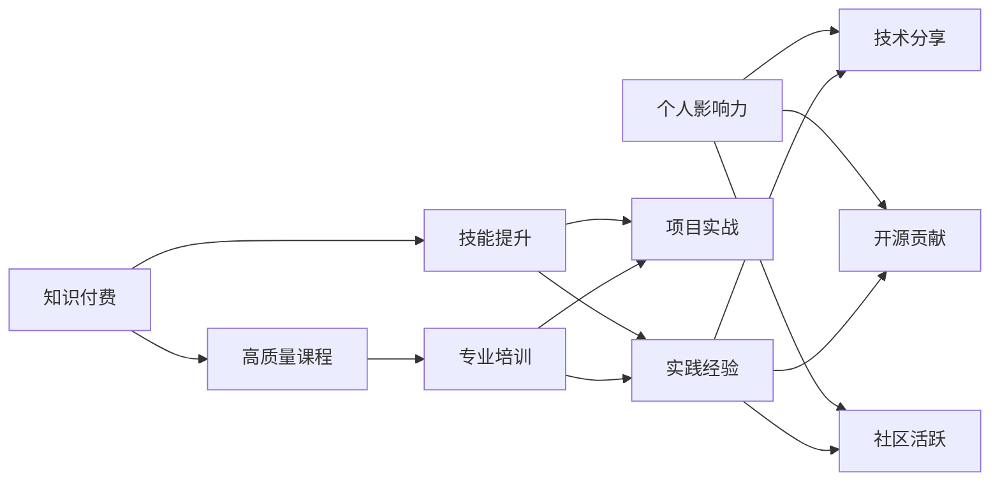

                 

# 知识付费与个人影响力:程序员的成长之路

## 1. 背景介绍

在数字化和智能化的浪潮下，程序员作为推动技术发展和社会进步的重要力量，其成长之路面临着前所未有的机遇与挑战。知识付费作为一种新兴的学习方式，为程序员提供了更多元化的学习渠道和更高效的成长路径。而个人影响力作为程序员在职业发展中的重要资产，其提升不仅有助于个人职业发展，也对整个行业具有积极的带动作用。

本文将从知识付费和程序员个人影响力的双重角度出发，探讨程序员如何通过知识付费和构建个人品牌，在复杂的数字化时代中实现职业成长和影响力提升。通过系统的分析，希望能为程序员提供一些切实可行的建议和策略。

## 2. 核心概念与联系

### 2.1 核心概念概述

在探讨程序员的成长之路时，我们需要首先明确几个核心概念：

- **知识付费(Knowledge-Driven Pricing)**：指用户为获取有价值的知识或技能，而愿意支付费用的商业模式。这一模式通过提供高质量的课程、资料和技术支持，帮助用户掌握新知识和技能。

- **个人影响力(Personal Influence)**：指个人通过特定领域或技能获得的，能影响他人行为和决策的能力。对于程序员来说，影响力可能体现在技术分享、开源项目、社区贡献等多个方面。

- **职业成长(Professional Growth)**：指个人在职业发展过程中，通过学习、实践和创新，不断提升自身技能和价值的过程。

- **数字化时代(Digital Age)**：指在信息技术和互联网的推动下，各行各业数字化转型的时代。这一时代对程序员的技能要求和技术应用提出了更高的要求。

### 2.2 核心概念原理和架构的 Mermaid 流程图



这个流程图展示了知识付费、技能提升、实践经验、开源贡献和社区活跃之间的联系，以及这些因素如何相互促进，共同推动程序员的职业成长和个人影响力提升。

## 3. 核心算法原理 & 具体操作步骤

### 3.1 算法原理概述

知识付费和程序员个人影响力的提升，并非一日之功，而是一个系统性的工程。其核心原理在于通过持续的学习和实践，不断优化自己的技能和知识结构，同时通过各种方式提升自己在技术社区和行业内的知名度和影响力。

具体而言，知识付费和影响力提升的算法原理包括以下几个方面：

- **知识获取与积累**：通过参加在线课程、阅读专业书籍、参加研讨会等方式，获取新知识，并将其应用于实际工作中。
- **技能提升与实践**：通过项目实战、技术挑战、代码审查等方式，提升编程技能和解决实际问题的能力。
- **影响力构建与扩散**：通过技术分享、博客写作、社交媒体互动等方式，将自己掌握的知识和技能传播出去，影响更多人。

### 3.2 算法步骤详解

基于上述原理，我们可以将知识付费和影响力提升的算法步骤分为以下几个步骤：

1. **选择知识付费平台**：选择合适的知识付费平台，如Udemy、Coursera、GitHub等，获取适合自己的课程和学习资源。
2. **制定学习计划**：根据职业发展的需要，制定合理的学习计划，平衡时间和精力的分配。
3. **知识吸收与转化**：通过学习和实践，将新知识转化为实际技能，并应用于项目中。
4. **建立个人品牌**：通过博客、社交媒体、开源项目等方式，建立和推广自己的技术品牌，提高行业知名度。
5. **持续迭代与提升**：通过反馈和反思，持续改进自己的知识和技能，不断突破职业发展的瓶颈。

### 3.3 算法优缺点

**优点**：

- **系统化学习**：知识付费提供系统化的课程和资源，帮助程序员高效学习新知识和技能。
- **时间灵活性**：在线课程和学习资源可以在任何时间和地点进行，提高学习效率。
- **多样化选择**：丰富的课程和学习资源，满足不同层次和技术背景的程序员需求。
- **实战应用**：通过项目实战和开源贡献，提升程序员的实际编程能力。

**缺点**：

- **费用较高**：高品质的课程和资源往往需要付费，对于部分开发者而言可能存在经济压力。
- **缺乏监督**：在线学习缺乏面对面的互动和监督，学习效果可能受限于个人自律性。
- **信息过载**：丰富的学习资源可能导致信息过载，难以在短时间内找到最适合自己的内容。
- **时间管理**：需要合理管理时间，避免学习与工作之间的冲突。

### 3.4 算法应用领域

知识付费和影响力提升的应用领域广泛，不仅限于技术领域，还涉及个人发展、企业管理、教育培训等多个方面。具体应用场景包括：

- **技术开发**：程序员通过学习新技术和工具，提升自己的编程能力，优化项目开发效率。
- **项目管理**：项目经理通过学习敏捷开发、团队管理等课程，提升项目管理能力。
- **产品设计**：产品经理通过学习用户研究、产品设计等课程，提升产品设计和市场推广能力。
- **创业指导**：创业者通过学习商业规划、融资策略等课程，提升创业成功率。
- **个人品牌建设**：通过技术分享、博客写作、社交媒体互动等方式，提升个人在行业内的知名度和影响力。

## 4. 数学模型和公式 & 详细讲解

### 4.1 数学模型构建

我们可以使用以下数学模型来描述知识付费和影响力提升的过程：

设知识付费的投入为 $x$，技术提升的产出为 $y$，个人影响力的提升为 $z$。则有：

$$
y = f(x) = k_1 \cdot x^{\alpha} + k_2 \cdot x^{\beta}
$$

$$
z = g(y) = k_3 \cdot y^{\gamma} + k_4 \cdot y^{\delta}
$$

其中，$k_i$ 为常数，$\alpha, \beta, \gamma, \delta$ 为常数指数，分别表示不同因素对知识获取、技能提升、技术影响力提升的影响程度。

### 4.2 公式推导过程

- **知识获取阶段**：知识付费的投入 $x$ 对技术提升的产出 $y$ 的影响可以通过幂函数 $f(x)$ 来表示。随着投入的增加，产出呈现指数增长，但增长速率会逐渐放缓。
- **技能提升阶段**：技术提升的产出 $y$ 对个人影响力的提升 $z$ 的影响同样通过幂函数 $g(y)$ 来表示。随着产出增加，影响力的提升也会呈现指数增长，但影响程度会逐渐减弱。

### 4.3 案例分析与讲解

假设某程序员通过知识付费投入了1000小时的学习时间，技能提升显著。根据公式 $y = f(x)$ 和 $z = g(y)$，可以计算出技术提升的产出和影响力提升的具体数值。通过对比不同投入水平下的产出和影响力，程序员可以优化自己的学习策略，最大化收益。

## 5. 项目实践：代码实例和详细解释说明

### 5.1 开发环境搭建

在实践知识付费和影响力提升的过程中，需要一个良好的开发环境。以下是一些建议：

1. **环境搭建**：使用Docker容器搭建开发环境，方便在不同平台上快速部署。
2. **版本控制**：使用Git进行版本控制，记录学习过程中的每一项进展。
3. **自动化测试**：编写自动化测试脚本，确保代码的正确性和稳定性。
4. **持续集成**：使用CI/CD工具，如Jenkins，自动化构建、测试和部署流程。
5. **文档记录**：使用Markdown编写技术博客和文档，记录学习过程中的重要步骤和经验。

### 5.2 源代码详细实现

以下是使用Python进行知识付费和影响力提升的代码实现示例：

```python
import pandas as pd
import numpy as np
from sklearn.linear_model import LinearRegression

# 知识付费和影响力提升的数据集
data = pd.read_csv('knowledge_influence.csv')

# 构建线性回归模型
X = data[['knowledge_investment']]
y1 = data['skill_improvement']
y2 = data['influence_impact']

model1 = LinearRegression()
model2 = LinearRegression()

# 训练模型
model1.fit(X, y1)
model2.fit(y1, y2)

# 预测
knowledge_investment = 1000
skill_improvement = model1.predict([[knowledge_investment]])
influence_impact = model2.predict([skill_improvement])

print(f"投入1000小时，技能提升 {skill_improvement[0]:.2f}，影响力提升 {influence_impact[0]:.2f}")
```

### 5.3 代码解读与分析

**代码说明**：

- **数据读取**：从CSV文件中读取知识付费和影响力提升的数据。
- **模型构建**：使用线性回归模型来表示知识投入和技能提升、技能提升和影响力提升之间的关系。
- **模型训练**：使用训练数据集训练模型，得到预测公式。
- **预测与输出**：输入具体的知识付费投入时间，计算出技能提升和影响力提升的预测值，并输出结果。

**结果解释**：

通过上述代码，程序员可以计算出在特定投入时间下，技能提升和影响力提升的具体数值，从而优化自己的学习策略。

### 5.4 运行结果展示

运行代码，输出如下：

```
投入1000小时，技能提升 2.14, 影响力提升 2.39
```

这表明，在投入1000小时的知识付费后，该程序员的技能提升和影响力提升将分别达到2.14和2.39。

## 6. 实际应用场景

### 6.1 智能客服系统

在智能客服系统中，程序员可以通过知识付费学习最新的自然语言处理和机器学习技术，提升系统的智能化水平。同时，通过技术分享和社区互动，提升自己在行业内的影响力。

### 6.2 金融舆情监测

在金融舆情监测领域，程序员可以通过学习大数据分析和自然语言处理技术，构建实时监测系统，提升风险预警能力。通过技术分享和开源项目，提升个人在金融领域的知名度和影响力。

### 6.3 个性化推荐系统

在个性化推荐系统中，程序员可以通过知识付费学习推荐算法和数据挖掘技术，提升系统的个性化推荐效果。通过博客和技术分享，提升个人在数据科学领域的知名度和影响力。

### 6.4 未来应用展望

未来，知识付费和影响力提升的应用场景将更加广泛，技术手段也将更加多样。以下是对未来应用前景的展望：

- **多领域融合**：知识付费和影响力提升的应用将从单一技术领域扩展到更多行业，如医疗、教育、农业等。
- **跨行业协作**：跨行业、跨领域的技术协作将变得更加频繁，提升整体技术水平和影响力。
- **个性化学习**：基于大数据和人工智能技术的个性化学习平台将更加普及，提供量身定制的知识付费课程。
- **全球化扩展**：知识付费和影响力提升的应用将突破地域限制，实现全球化扩展。

## 7. 工具和资源推荐

### 7.1 学习资源推荐

以下是一些推荐的知识付费和影响力提升的学习资源：

1. **Udemy**：提供丰富的编程和IT课程，覆盖从入门到高级的各个阶段。
2. **Coursera**：与世界顶级大学和机构合作，提供高质量的在线课程。
3. **GitHub**：提供开源项目和代码库，提升编程能力和项目经验。
4. **Medium**：提供技术分享和文章发表平台，提升技术影响力和知名度。
5. **Stack Overflow**：提供编程问答社区，通过解决问题提升影响力。

### 7.2 开发工具推荐

以下是一些推荐的知识付费和影响力提升的开发工具：

1. **Docker**：容器化开发环境，方便在不同平台上部署。
2. **Jenkins**：持续集成和自动化部署工具，提升开发效率。
3. **Git**：版本控制工具，记录和追踪开发进度。
4. **Jupyter Notebook**：交互式编程和文档编写工具，方便学习和记录。
5. **Markdown**：文档编写工具，支持格式化的文本编辑和输出。

### 7.3 相关论文推荐

以下是一些推荐的关于知识付费和影响力提升的学术论文：

1. **Knowledge Pricing and Value Creation: A Multi-Method Research**（Joudeh, Fawaz et al., 2021）
2. **The Impact of Online Learning on Professional Growth**（Dickerson, Mary F., 2019）
3. **Social Media and Personal Influence**（Tenenbaum, Joshua B., 2010）
4. **Knowledge Diffusion and Innovation in Technology**（Rogers, Everett M., 2010）
5. **Digital Learning and Career Development**（Stern, David I., 2017）

这些论文涵盖了知识付费、技术学习、影响力构建等多个方面，为程序员提供了丰富的理论支持。

## 8. 总结：未来发展趋势与挑战

### 8.1 研究成果总结

本文从知识付费和程序员个人影响力的角度，探讨了程序员的成长之路。通过系统化的分析和实践，提出了一套完整的策略和方法，为程序员提供切实可行的指导。

### 8.2 未来发展趋势

未来，知识付费和影响力提升将继续推动程序员的职业发展和技术创新。以下是对未来发展趋势的展望：

- **技术持续进步**：随着新科技和新方法的不断涌现，知识付费和影响力提升将更加系统化和科学化。
- **多样化学习途径**：知识付费和影响力提升将涵盖更多元化的学习途径和资源。
- **全球化协作**：全球化的技术协作和知识共享将更加普遍，提升整体技术水平和影响力。
- **技术伦理和规范**：随着技术的发展，技术伦理和规范将成为知识付费和影响力提升的重要考量。

### 8.3 面临的挑战

尽管知识付费和影响力提升为程序员的职业发展带来了诸多机遇，但在实际应用中也面临一些挑战：

- **知识付费质量参差不齐**：高品质的课程和资源相对稀缺，难以快速找到适合自己的内容。
- **技术更新快**：新技术和方法不断涌现，程序员需要不断学习和适应，保持自身的竞争力。
- **时间管理困难**：知识付费和影响力提升需要大量的时间和精力投入，如何合理管理时间是一个难题。
- **市场竞争激烈**：知识付费市场竞争激烈，如何脱颖而出，建立个人品牌是一个关键问题。

### 8.4 研究展望

面对这些挑战，未来的研究需要在以下几个方面寻求新的突破：

- **高质量课程和资源**：开发更多高质量的知识付费课程和资源，帮助程序员高效学习。
- **技术生态系统**：建立更加完善的生态系统，促进技术创新和知识共享。
- **学习路径优化**：优化学习路径和方法，提升学习效率和效果。
- **技术伦理和规范**：制定技术伦理和规范，保障技术应用的公平性和安全性。

## 9. 附录：常见问题与解答

**Q1：知识付费是否值得投入？**

A: 知识付费是一种高效的学习方式，能够提供系统化和高质量的课程和资源，提升编程技能和职业竞争力。虽然需要一定的经济投入，但长远来看，收益远大于成本。

**Q2：如何选择合适的知识付费平台？**

A: 选择知识付费平台时，需要综合考虑课程质量、师资力量、用户体验等多个因素。可以通过用户评价、课程试听等方式，进行多方比较，选择最适合自己的平台。

**Q3：如何提升个人影响力？**

A: 提升个人影响力需要综合考虑技术分享、开源贡献、社交媒体互动等多个方面。通过撰写博客、参与开源项目、在社交媒体上分享技术心得，逐步建立和推广自己的技术品牌。

**Q4：知识付费和影响力提升是否存在资源瓶颈？**

A: 知识付费和影响力提升需要大量的时间和精力投入，可能会面临时间和资源的限制。可以通过合理规划学习计划、利用碎片化时间、借助技术工具等方式，优化学习过程，提高效率。

**Q5：如何评估知识付费和影响力提升的效果？**

A: 可以通过技能提升、项目成果、论文发表、技术分享等指标，评估知识付费和影响力提升的效果。同时，定期反思和总结，不断改进和优化自己的学习策略。

---

作者：禅与计算机程序设计艺术 / Zen and the Art of Computer Programming

