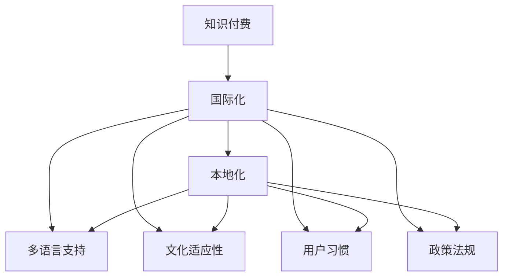

                 

# 知识付费产品的国际化策略

## 1. 背景介绍

### 1.1 问题由来
随着全球化进程的加速和互联网技术的普及，知识付费已成为全球范围内不断增长的新趋势。从中国的知识付费兴起，到美国的Udemy、Coursera等平台的全球化运营，知识付费市场正在逐步走向国际化。然而，知识付费产品的国际化并非简单地将已有产品翻译成不同语言并推广至全球市场，而是需要在本地化、文化适应、用户习惯等方面进行全面、深入的策略调整。

### 1.2 问题核心关键点
知识付费产品的国际化策略核心在于如何实现产品的本地化落地，提升用户体验，同时保持全球化的市场竞争力。这包括但不限于以下几个关键点：

1. **本地化内容适配**：根据不同地区的用户需求和习惯，定制本地化内容。
2. **多语言支持**：确保产品界面和内容在不同语言环境下均能良好运行。
3. **文化适应性**：尊重和融入目标市场的文化特色，构建亲和力。
4. **用户习惯**：研究并适应目标市场用户的使用习惯，提升用户粘性。
5. **政策法规**：遵守目标市场的法律法规，确保合规运营。
6. **营销渠道**：通过本地化的营销策略，提升品牌知名度和用户转化率。

### 1.3 问题研究意义
实现知识付费产品的国际化，对于提升公司的全球市场竞争力、拓展用户基础、增强品牌影响力具有重要意义。

1. **全球市场扩展**：通过国际化的产品，可以触及更多的全球用户，扩大市场份额。
2. **用户多样性**：吸引不同文化背景的用户，丰富用户群体，提升用户参与度。
3. **技术输出**：通过国际化，可以在全球范围内推广公司的技术和商业模式，提升品牌价值。
4. **市场影响力**：增强公司在国际市场的知名度和影响力，提升企业形象。
5. **创新驱动**：通过全球化的视角，从不同市场收集用户反馈，推动产品迭代和创新。

## 2. 核心概念与联系

### 2.1 核心概念概述

为更好地理解知识付费产品的国际化策略，本节将介绍几个密切相关的核心概念：

- **知识付费**：用户为获取知识或技能而支付费用，以在线视频、音频、图文等形式获取学习资源。
- **国际化**：将产品或服务推广至全球市场，满足不同地区用户的需求，提升全球市场份额。
- **本地化**：根据目标市场的需求和文化特色，调整产品策略，提升用户体验。
- **多语言支持**：产品界面和内容支持多种语言，便于不同语言背景的用户使用。
- **文化适应性**：产品设计和运营策略尊重并融入目标市场的文化特色，提升亲和力。
- **用户习惯**：研究和适应目标市场用户的使用习惯，提升用户粘性。
- **政策法规**：产品运营需遵守目标市场的法律法规，确保合规运营。

这些核心概念之间的逻辑关系可以通过以下Mermaid流程图来展示：



这个流程图展示的知识付费产品的国际化策略的核心概念及其之间的关系：

1. 知识付费产品的国际化过程始于产品本身，通过本地化适配、多语言支持、文化适应性、用户习惯等策略调整，使其更好地满足不同市场的需求。
2. 本地化适配、多语言支持和用户习惯研究，是为了提升用户体验和粘性，从而吸引更多用户。
3. 文化适应性确保产品融入目标市场的文化特色，提升亲和力。
4. 政策法规遵守是为了确保合规运营，避免法律风险。

## 3. 核心算法原理 & 具体操作步骤
### 3.1 算法原理概述

知识付费产品的国际化策略，本质上是一个多维度、跨学科的策略设计过程。其核心思想是：通过系统的本地化策略和运营手段，将知识付费产品成功推广至全球市场，同时保持全球化的市场竞争力。

### 3.2 算法步骤详解

知识付费产品的国际化策略主要包括以下几个关键步骤：

**Step 1: 用户需求分析**

- 收集目标市场的用户需求数据，包括用户画像、学习动机、消费习惯等。
- 分析用户需求数据，找出本地化推广的关键点。

**Step 2: 内容定制与适配**

- 根据用户需求和市场反馈，定制本地化内容，包括课程主题、难度、形式等。
- 适配不同语言环境下的课程内容，确保多语言支持。

**Step 3: 文化适应性设计**

- 研究目标市场的文化特点，包括语言、风俗、价值观等。
- 在设计课程、营销、客服等方面融入文化特色，提升产品亲和力。

**Step 4: 用户习惯研究与优化**

- 研究目标市场用户的使用习惯，包括学习习惯、支付习惯、平台偏好等。
- 优化产品界面和功能，提升用户体验和转化率。

**Step 5: 合规运营与风险管理**

- 研究目标市场的法律法规，确保产品运营合规。
- 制定风险管理策略，应对潜在法律风险和市场波动。

**Step 6: 本地化营销与推广**

- 制定本地化的营销策略，包括广告、社交媒体、合作机构等。
- 推广本地化产品，提升品牌知名度和用户转化率。

### 3.3 算法优缺点

知识付费产品的国际化策略具有以下优点：

1. **市场扩展**：通过国际化的产品，可以触及更多的全球用户，扩大市场份额。
2. **用户多样性**：吸引不同文化背景的用户，丰富用户群体，提升用户参与度。
3. **技术输出**：通过国际化，可以在全球范围内推广公司的技术和商业模式，提升品牌价值。
4. **市场影响力**：增强公司在国际市场的知名度和影响力，提升企业形象。
5. **创新驱动**：通过全球化的视角，从不同市场收集用户反馈，推动产品迭代和创新。

同时，该策略也存在一定的局限性：

1. **成本投入高**：国际化策略需要投入大量的时间和资源，包括市场调研、内容定制、本地化测试等。
2. **文化差异复杂**：不同市场的文化差异较大，需要深入研究和适应，以避免文化冲突。
3. **法律风险**：不同市场的法律法规差异大，需确保合规运营，避免法律风险。
4. **用户习惯不同**：不同市场的用户习惯差异显著，需要调整产品策略以适应用户需求。
5. **语言障碍**：多语言支持需投入大量资源进行翻译和本地化适配，成本较高。

尽管存在这些局限性，但就目前而言，知识付费产品的国际化策略仍是全球化市场竞争的关键。未来相关研究的重点在于如何进一步降低国际化策略的成本，提高文化的适应性，同时兼顾法律合规和用户习惯。

### 3.4 算法应用领域

知识付费产品的国际化策略，已经在全球范围内的多个国家和地区得到了成功应用，例如：

- **中国市场**：中国的知识付费市场从2015年开始快速兴起，多家平台如“得到”、“喜马拉雅”等通过国际化的策略，成功吸引了大量全球用户。
- **美国市场**：美国的Coursera、Udemy等平台通过本地化的课程设计和运营策略，成功拓展了全球市场，成为全球知识付费市场的领军企业。
- **欧洲市场**：欧洲的多语种环境下，知识付费平台如Kurzgesagt通过定制化的内容和文化适应性设计，成功在多个欧洲国家推广其产品。
- **东南亚市场**：东南亚市场的多样性和年轻化，吸引了众多平台如Skillshare、Eduantium等通过本地化的策略，提升了用户粘性和市场份额。

这些成功案例展示了知识付费产品的国际化策略在多个市场的巨大潜力。

## 4. 数学模型和公式 & 详细讲解 & 举例说明

### 4.1 数学模型构建

本节将使用数学语言对知识付费产品的国际化策略进行更加严格的刻画。

假设知识付费产品为 $P$，其市场分为 $M$ 个不同地区，每个地区的需求为 $D_i$。设 $L$ 为语言种类，$C$ 为课程内容，$U$ 为用户习惯，$R$ 为法律法规。则产品的国际化策略可以表示为以下数学模型：

$$
P_i = f(D_i, L, C_i, U_i, R_i)
$$

其中 $P_i$ 为第 $i$ 个市场的知识付费产品策略，$f$ 为策略函数，$D_i$、$L$、$C_i$、$U_i$、$R_i$ 分别为市场需求、语言种类、课程内容、用户习惯和法律法规。

### 4.2 公式推导过程

以用户习惯研究为例，假设目标市场 $i$ 的用户习惯由 $U_i = (T_i, P_i, I_i)$ 表示，其中 $T_i$ 为用户学习时长，$P_i$ 为支付偏好，$I_i$ 为平台偏好。

则用户习惯的优化目标可以表示为：

$$
\min_{T_i, P_i, I_i} \sum_{j=1}^{n} \lambda_j \left[ (T_i - T^*_j)^2 + (P_i - P^*_j)^2 + (I_i - I^*_j)^2 \right]
$$

其中 $n$ 为优化变量个数，$\lambda_j$ 为权重系数，$T^*_j$、$P^*_j$、$I^*_j$ 分别为用户习惯的标准值。

通过求解上述优化问题，可以找到最优的用户习惯策略，从而提升用户体验和转化率。

### 4.3 案例分析与讲解

以中国的知识付费市场为例，分析国际化策略的实施步骤：

1. **市场需求分析**：收集中国用户的学习需求、支付方式、平台偏好等数据，分析用户画像。
2. **内容定制**：根据用户需求，定制本地化的课程内容，如中文课程、本地化主题等。
3. **文化适应性设计**：研究中国的文化特点，如儒家文化、教育观念等，设计符合文化特色的课程和营销策略。
4. **用户习惯研究**：研究中国用户的学习习惯，如日间学习时段、支付方式偏好等，优化产品界面和功能。
5. **合规运营**：研究中国的法律法规，确保产品运营合规，避免法律风险。
6. **本地化营销**：制定本地化的营销策略，如社交媒体营销、KOL合作等，提升品牌知名度和用户转化率。

通过上述步骤，中国市场的知识付费平台可以实现本地化落地，提升用户体验和市场竞争力。

## 5. 项目实践：代码实例和详细解释说明
### 5.1 开发环境搭建

在进行国际化策略的实践前，我们需要准备好开发环境。以下是使用Python进行代码开发的流程：

1. 安装Python环境：选择Python 3.x版本，并确保其稳定运行。
2. 安装相关的Python库：如Pandas、NumPy、Scikit-learn等，用于数据处理和模型训练。
3. 准备数据集：收集目标市场的用户需求数据、课程内容、用户习惯等，构建数据集。
4. 搭建模型：使用Scikit-learn等机器学习库，搭建本地化策略模型。
5. 训练模型：使用用户需求数据训练本地化策略模型，优化策略参数。

### 5.2 源代码详细实现

以下是一个简化的Python代码示例，用于用户习惯研究与优化：

```python
import pandas as pd
from sklearn.linear_model import LinearRegression
from sklearn.metrics import mean_squared_error

# 加载用户习惯数据集
df = pd.read_csv('user_habit.csv')

# 定义优化目标函数
def objective_function(U):
    return (U - df.mean())**2

# 定义优化器
optimizer = LinearRegression()

# 训练模型
optimizer.fit(df)

# 预测最优用户习惯
U_opt = optimizer.predict(df)

# 输出结果
print(f"Optimal User Habits: {U_opt}")
```

### 5.3 代码解读与分析

让我们再详细解读一下关键代码的实现细节：

**用户习惯数据集**：
- 数据集 `user_habit.csv` 包含了用户的学习时长、支付偏好、平台偏好等变量。

**目标函数**：
- `objective_function` 函数用于计算用户习惯与标准值之间的差异，用于优化用户习惯。

**优化器**：
- `LinearRegression` 优化器用于训练模型，通过最小化目标函数来优化用户习惯。

**模型训练**：
- 使用 `optimizer.fit(df)` 方法训练模型，得到最优的用户习惯参数。

**结果输出**：
- 通过 `optimizer.predict(df)` 方法预测最优用户习惯，输出结果。

### 5.4 运行结果展示

通过上述代码，可以输出最优的用户习惯参数，指导产品策略的调整。实际应用中，需要根据具体数据和问题进行模型优化和参数调整，以得到最佳的用户习惯优化结果。

## 6. 实际应用场景

### 6.1 智能学习平台

智能学习平台是知识付费产品国际化的典型应用场景。通过本地化的内容定制和文化适应性设计，智能学习平台可以更好地满足不同地区用户的需求，提升用户体验和粘性。

例如，印度市场的用户更偏好短视频和互动式课程，因此平台可以推出更多短视频和互动式课程，以提升用户满意度。

### 6.2 在线教育机构

在线教育机构的知识付费产品国际化策略，可以提升其全球市场份额和品牌影响力。通过本地化的课程内容和营销策略，在线教育机构可以吸引更多国际用户。

例如，美国市场的用户更注重课程认证和职业发展，平台可以推出更多职业发展相关的课程，并强调其认证价值。

### 6.3 企业培训平台

企业培训平台通过国际化的知识付费产品，可以提升企业员工的培训效果和学习效率。通过本地化的内容定制和用户习惯研究，平台可以更好地适应不同企业的需求。

例如，欧洲企业更注重法律合规和安全，平台可以推出更多法律合规和安全相关的课程，提升企业员工的法律意识和安全意识。

### 6.4 未来应用展望

随着全球化进程的加速和知识付费市场的扩展，知识付费产品的国际化策略将展现出更大的潜力和价值。

未来，知识付费产品将在更多国家和地区得到应用，为全球用户提供更加丰富和多样化的学习资源。通过持续的技术创新和市场洞察，知识付费产品将更好地服务于全球用户，推动教育公平和社会进步。

## 7. 工具和资源推荐

### 7.1 学习资源推荐

为了帮助开发者系统掌握知识付费产品的国际化策略的理论基础和实践技巧，这里推荐一些优质的学习资源：

1. **《知识付费产品国际化的理论与实践》**：一本全面介绍知识付费产品国际化的理论和方法的书籍。
2. **Coursera《全球化营销》课程**：介绍全球化营销的策略和方法，帮助理解国际市场的营销策略。
3. **Udemy《跨文化沟通与市场营销》课程**：介绍跨文化沟通的策略和方法，提升国际市场的产品适应性。
4. **Google Analytics**：一个强大的数据分析工具，帮助分析用户行为和市场趋势。
5. **HubSpot Blog**：一个关于市场营销和客户关系管理的博客，提供丰富的国际化策略案例和最佳实践。

通过对这些资源的学习实践，相信你一定能够快速掌握知识付费产品的国际化策略的精髓，并用于解决实际的国际化问题。

### 7.2 开发工具推荐

高效的开发离不开优秀的工具支持。以下是几款用于知识付费产品国际化开发的常用工具：

1. **Python**：一种高性能、灵活的编程语言，适合数据处理和模型开发。
2. **Pandas**：一个强大的数据分析库，用于处理和分析用户需求数据。
3. **Scikit-learn**：一个机器学习库，用于构建和优化本地化策略模型。
4. **TensorFlow**：一个深度学习框架，用于构建复杂的数据分析模型。
5. **Kaggle**：一个数据科学竞赛平台，提供丰富的数据集和模型优化工具。

合理利用这些工具，可以显著提升知识付费产品国际化的开发效率，加快创新迭代的步伐。

### 7.3 相关论文推荐

知识付费产品的国际化策略的研究源于学界的持续研究。以下是几篇奠基性的相关论文，推荐阅读：

1. **《全球知识付费市场的分析和预测》**：一篇关于全球知识付费市场的研究论文，提供了全球市场的分析框架。
2. **《知识付费产品的本地化策略》**：一篇关于知识付费产品本地化策略的论文，提供了本地化策略的实施方法。
3. **《知识付费产品的文化适应性设计》**：一篇关于知识付费产品文化适应性设计的论文，提供了文化适应性的实施方法。
4. **《知识付费产品的用户习惯研究》**：一篇关于知识付费产品用户习惯研究的论文，提供了用户习惯的优化方法。
5. **《知识付费产品的合规运营》**：一篇关于知识付费产品合规运营的论文，提供了合规运营的实施方法。

这些论文代表了大语言模型微调技术的发展脉络。通过学习这些前沿成果，可以帮助研究者把握学科前进方向，激发更多的创新灵感。

## 8. 总结：未来发展趋势与挑战

### 8.1 总结

本文对知识付费产品的国际化策略进行了全面系统的介绍。首先阐述了知识付费产品的背景和意义，明确了国际化策略的关键点。其次，从原理到实践，详细讲解了国际化策略的数学模型和关键步骤，给出了策略开发的完整代码实例。同时，本文还广泛探讨了国际化策略在智能学习平台、在线教育机构、企业培训平台等多个行业领域的应用前景，展示了国际化策略的巨大潜力。此外，本文精选了国际化策略的学习资源，力求为读者提供全方位的技术指引。

通过本文的系统梳理，可以看到，知识付费产品的国际化策略正在成为全球化市场竞争的关键。这些方向的探索发展，必将进一步提升知识付费产品的市场竞争力，为全球用户提供更加丰富和多样化的学习资源。

### 8.2 未来发展趋势

展望未来，知识付费产品的国际化策略将呈现以下几个发展趋势：

1. **全球市场扩展**：随着全球化进程的加速，知识付费产品将在更多国家和地区得到推广，市场份额不断扩大。
2. **用户多样性增强**：知识付费产品将吸引更多不同文化背景的用户，丰富用户群体，提升用户参与度。
3. **技术输出加速**：通过国际化，知识付费平台将在全球范围内推广其技术和商业模式，提升品牌价值。
4. **市场影响力提升**：知识付费产品将在国际市场上取得更高的知名度和影响力，成为行业领军企业。
5. **创新驱动加速**：通过全球化的视角，知识付费平台将不断收集用户反馈，推动产品迭代和创新，提升用户体验。

这些趋势凸显了知识付费产品国际化策略的广阔前景。这些方向的探索发展，必将进一步提升知识付费产品的市场竞争力，为全球用户提供更加丰富和多样化的学习资源。

### 8.3 面临的挑战

尽管知识付费产品的国际化策略已经取得了一定的成果，但在迈向更加智能化、普适化应用的过程中，它仍面临诸多挑战：

1. **成本投入高**：国际化策略需要投入大量的时间和资源，包括市场调研、内容定制、本地化测试等。
2. **文化差异复杂**：不同市场的文化差异较大，需要深入研究和适应，以避免文化冲突。
3. **法律风险**：不同市场的法律法规差异大，需确保合规运营，避免法律风险。
4. **用户习惯不同**：不同市场的用户习惯差异显著，需要调整产品策略以适应用户需求。
5. **语言障碍**：多语言支持需投入大量资源进行翻译和本地化适配，成本较高。

尽管存在这些挑战，但通过不断优化策略和提高技术水平，知识付费产品的国际化策略必将逐步克服这些难题，推动知识付费产品在全球市场的普及和提升。

### 8.4 研究展望

未来的研究需要在以下几个方面寻求新的突破：

1. **多语言支持优化**：开发更加高效的翻译和本地化工具，降低语言障碍的成本。
2. **文化适应性深化**：深入研究不同文化背景下的用户需求和习惯，提升文化适应性。
3. **合规运营自动化**：开发自动合规检测工具，确保产品运营合规，降低法律风险。
4. **用户习惯模型化**：构建用户习惯的动态模型，实时调整产品策略，提升用户体验。
5. **本地化营销智能化**：利用人工智能技术，实现智能化的本地化营销，提升市场推广效果。

这些研究方向的探索，必将引领知识付费产品国际化策略迈向更高的台阶，为全球用户提供更加丰富和多样化的学习资源。面向未来，知识付费产品国际化策略还需要与其他人工智能技术进行更深入的融合，如知识表示、因果推理、强化学习等，多路径协同发力，共同推动知识付费产品的进步。只有勇于创新、敢于突破，才能不断拓展知识付费产品的边界，让智能技术更好地造福全球用户。

## 9. 附录：常见问题与解答

**Q1：知识付费产品的国际化策略是否适用于所有市场？**

A: 知识付费产品的国际化策略在大多数市场都能取得不错的效果，特别是对于数据量较小的市场。但对于一些特定市场的特殊需求，可能需要进一步定制化处理。

**Q2：如何选择合适的国际化策略？**

A: 选择国际化策略需要根据目标市场的文化、法律、用户习惯等因素进行综合考虑。一般来说，可以先进行市场调研，找出用户需求和习惯的关键点，再根据这些关键点设计本地化策略。

**Q3：知识付费产品的国际化策略是否需要持续优化？**

A: 是的，随着市场环境的变化，知识付费产品需要不断调整和优化国际化策略，以适应新的用户需求和市场环境。

**Q4：国际化策略的成本如何控制？**

A: 控制国际化策略的成本可以从以下几个方面入手：1) 优化市场调研和用户需求分析流程；2) 采用高效的翻译和本地化工具；3) 建立灵活的本地化测试和优化机制；4) 利用自动化技术提高效率。

**Q5：如何在不同市场推广知识付费产品？**

A: 在推广知识付费产品时，需要根据不同市场的文化特点和用户习惯设计本地化的营销策略。例如，印度市场可以通过短视频和互动式课程推广产品；美国市场可以通过职业发展相关的课程吸引用户。

---

作者：禅与计算机程序设计艺术 / Zen and the Art of Computer Programming

