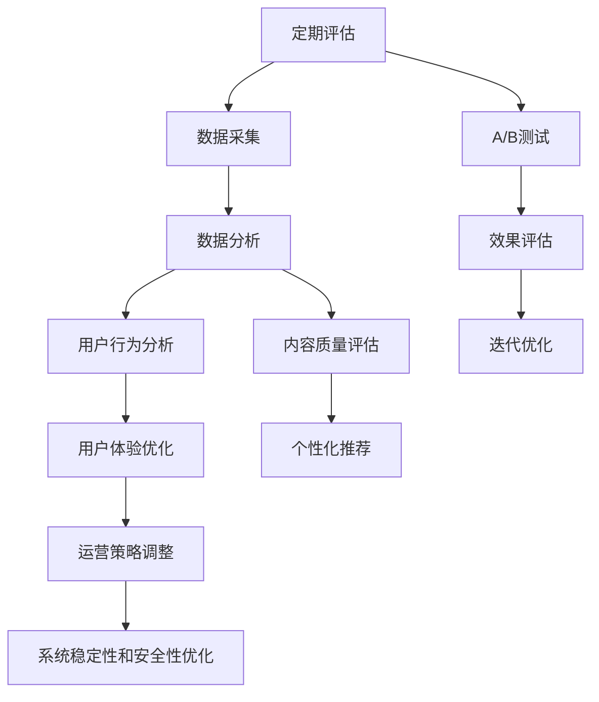

                 

## 1. 背景介绍

### 1.1 问题由来

在知识付费领域，随着消费者对内容质量、个性化需求、用户体验等方面的要求不断提高，传统的知识付费产品面临着诸多挑战：

1. **内容同质化**：市场上大量重复内容，导致用户流失。
2. **订阅转化率低**：新用户订阅意愿不强，付费转化率不高。
3. **用户体验不佳**：产品界面和交互设计落后，难以满足用户需求。
4. **数据洞察不足**：缺乏用户行为数据的全面分析，难以优化产品策略。

这些问题需要通过系统性的评估和迭代，才能得以有效解决。因此，定期评估与迭代成为知识付费产品持续改进的关键环节。

### 1.2 问题核心关键点

知识付费产品的定期评估与迭代涉及以下几个核心关键点：

- **用户行为分析**：通过数据分析了解用户行为特征，识别用户需求和痛点。
- **内容质量评估**：评估知识产品的内容质量，识别优质和劣质内容。
- **用户体验优化**：基于用户反馈和行为数据，不断优化产品界面和交互设计。
- **个性化推荐**：通过用户行为数据，实现个性化内容推荐，提升用户粘性。
- **运营策略调整**：基于评估结果，调整订阅策略、促销活动等，提升转化率和留存率。
- **系统稳定性和安全性**：确保知识付费平台运行的稳定性和数据安全性。

### 1.3 问题研究意义

通过定期评估与迭代，知识付费产品可以保持竞争力和用户粘性，实现商业目标：

1. **提升用户满意度**：通过持续优化用户体验，提升用户满意度，促进用户续费和推荐。
2. **提高转化率**：通过精准的个性化推荐和运营策略，提升新用户的订阅转化率。
3. **增加收益**：通过优化内容质量和订阅策略，提升知识付费平台的收益。
4. **增强品牌影响力**：通过高质量内容和优质用户体验，增强品牌影响力和市场竞争力。

## 2. 核心概念与联系

### 2.1 核心概念概述

为更好地理解知识付费产品的定期评估与迭代方法，本节将介绍几个关键概念：

- **知识付费**：通过订阅、付费等形式，为用户提供高价值内容的平台或服务。
- **定期评估**：定期对知识付费产品进行全面分析，评估产品运营的各项指标，找出问题和改进点。
- **迭代优化**：基于评估结果，对知识付费产品进行系统性优化和调整，持续提升产品性能。
- **个性化推荐**：通过用户行为数据分析，实现内容推荐的个性化，提升用户体验和粘性。
- **A/B测试**：将用户随机分为两组，分别体验不同的产品特性，通过对比评估优化效果。

这些概念之间通过一系列的流程和方法紧密联系，共同构成知识付费产品评估与迭代的完整过程。

### 2.2 核心概念原理和架构的 Mermaid 流程图



这个流程图展示了知识付费产品定期评估与迭代的核心流程：

1. 通过数据采集，获取用户行为和内容质量数据。
2. 数据经过分析和处理，得出用户行为分析结果和内容质量评估。
3. 用户体验优化、个性化推荐、运营策略调整等环节，根据评估结果进行优化调整。
4. 通过A/B测试，验证优化效果。
5. 根据效果评估，进行迭代优化，不断提升产品性能。

## 3. 核心算法原理 & 具体操作步骤

### 3.1 算法原理概述

知识付费产品的定期评估与迭代是一个综合性的优化过程，涉及多个关键算法和技术：

1. **数据采集与处理**：通过API接口、埋点等技术手段，获取用户行为和内容质量数据。
2. **数据分析与挖掘**：利用机器学习算法，进行用户行为分析和内容质量评估。
3. **个性化推荐算法**：采用协同过滤、基于内容的推荐、矩阵分解等技术，实现个性化推荐。
4. **A/B测试算法**：通过随机分组和假设检验，评估不同产品特性对用户行为的影响。
5. **迭代优化算法**：基于评估结果，采用梯度下降、遗传算法等方法进行模型调整和参数优化。

这些算法和技术共同支撑了知识付费产品的定期评估与迭代过程，确保产品性能的持续提升。

### 3.2 算法步骤详解

以下是知识付费产品定期评估与迭代的详细操作步骤：

#### 3.2.1 数据采集与处理

数据采集与处理是评估与迭代的基础。具体步骤如下：

1. **API接口**：从用户行为数据平台获取用户注册、登录、订阅、消费、观看等数据。
2. **埋点技术**：通过埋点技术，实时获取用户操作行为数据，如浏览、点击、分享等。
3. **数据清洗**：对采集到的数据进行清洗，去除重复、无效数据，确保数据质量。

#### 3.2.2 数据分析与挖掘

数据分析与挖掘是评估与迭代的核心。具体步骤如下：

1. **用户行为分析**：利用时间序列分析、聚类分析等技术，分析用户行为特征，如用户活跃度、消费习惯等。
2. **内容质量评估**：利用文本分析、情感分析等技术，评估内容的受欢迎程度、用户反馈等。
3. **异常检测**：通过统计分析、时间序列分析等，检测异常用户行为和内容，识别潜在问题。

#### 3.2.3 个性化推荐算法

个性化推荐算法是提升用户体验的关键。具体步骤如下：

1. **用户画像建模**：通过协同过滤、基于内容的推荐等方法，建立用户画像模型。
2. **内容画像建模**：对内容进行特征提取，建立内容画像模型。
3. **推荐引擎设计**：基于用户画像和内容画像，设计推荐引擎，实现个性化推荐。

#### 3.2.4 A/B测试算法

A/B测试是验证优化效果的重要手段。具体步骤如下：

1. **实验设计**：根据优化目标，设计实验方案，如用户界面优化、推荐算法改进等。
2. **用户分组**：将用户随机分为实验组和对照组，确保两组用户特征相似。
3. **效果评估**：对实验组和对照组的用户行为数据进行对比分析，评估优化效果。

#### 3.2.5 迭代优化算法

迭代优化是持续提升产品性能的关键。具体步骤如下：

1. **模型训练**：基于用户行为数据和内容质量数据，训练推荐模型和评估模型。
2. **参数调整**：通过调参技术，调整模型参数，优化模型性能。
3. **效果评估**：对迭代优化后的模型进行效果评估，确保提升效果。

### 3.3 算法优缺点

知识付费产品的定期评估与迭代算法具有以下优点：

1. **系统性优化**：通过全面的数据分析和评估，系统性提升产品性能。
2. **精准推荐**：通过个性化推荐算法，精准满足用户需求，提升用户体验。
3. **快速迭代**：通过A/B测试和效果评估，快速验证和优化，提升产品迭代速度。

同时，这些算法也存在一些局限性：

1. **数据依赖性高**：评估与迭代效果依赖于高质量的数据，数据采集和处理成本较高。
2. **算法复杂度高**：涉及多种算法和技术的结合，算法实现复杂，难度较大。
3. **用户隐私风险**：数据采集和分析可能涉及用户隐私问题，需注意用户数据保护。

### 3.4 算法应用领域

知识付费产品的定期评估与迭代算法主要应用于以下几个领域：

1. **内容质量提升**：通过内容质量评估，筛选优质内容，提升用户满意度。
2. **用户体验优化**：通过用户行为分析，优化产品界面和交互设计，提升用户粘性。
3. **个性化推荐系统**：通过个性化推荐算法，实现精准推荐，提升转化率和用户留存率。
4. **运营策略调整**：通过数据分析，调整订阅策略、促销活动等，提升运营效率和收益。
5. **系统稳定性与安全性**：通过系统优化，确保平台稳定运行和数据安全性。

## 4. 数学模型和公式 & 详细讲解 & 举例说明

### 4.1 数学模型构建

知识付费产品的定期评估与迭代涉及多个数学模型，以下是几个核心模型：

1. **用户行为分析模型**：用于分析用户行为特征，预测用户活跃度和消费习惯。
2. **内容质量评估模型**：用于评估内容的受欢迎程度和用户反馈。
3. **个性化推荐模型**：用于实现个性化内容推荐。
4. **A/B测试模型**：用于验证不同产品特性对用户行为的影响。

### 4.2 公式推导过程

以下以用户行为分析模型为例，进行公式推导：

假设用户行为数据集为 $D=\{(x_i,y_i)\}_{i=1}^N, x_i \in X, y_i \in Y$，其中 $x_i$ 为特征向量，$y_i$ 为目标变量。利用回归模型进行用户行为分析，目标为预测用户活跃度 $y_i$。

设回归模型为：

$$
y_i = \theta^T\phi(x_i)
$$

其中 $\theta$ 为模型参数，$\phi(x_i)$ 为特征映射函数。通过最小化均方误差损失函数：

$$
\mathcal{L}(\theta) = \frac{1}{N}\sum_{i=1}^N(y_i - \hat{y}_i)^2
$$

利用梯度下降算法，更新模型参数：

$$
\theta \leftarrow \theta - \eta\nabla_{\theta}\mathcal{L}(\theta)
$$

其中 $\eta$ 为学习率，$\nabla_{\theta}\mathcal{L}(\theta)$ 为损失函数对参数 $\theta$ 的梯度。

### 4.3 案例分析与讲解

以“某知识付费平台的订阅转化率提升案例”为例，详细讲解评估与迭代过程：

1. **数据采集**：从API接口和埋点技术获取订阅转化数据，如新用户注册、订阅、取消订阅等。
2. **数据分析**：利用回归模型和分类模型，分析订阅转化率的影响因素，如年龄、性别、历史消费行为等。
3. **A/B测试**：设计实验方案，将用户随机分为实验组和对照组，对比不同订阅策略的效果。
4. **效果评估**：通过效果评估，确定最优订阅策略，并逐步推广实施。
5. **迭代优化**：根据订阅策略效果和用户反馈，不断调整和优化，提升订阅转化率。

## 5. 项目实践：代码实例和详细解释说明

### 5.1 开发环境搭建

在进行知识付费产品的评估与迭代实践前，我们需要准备好开发环境。以下是使用Python进行项目开发的环境配置流程：

1. 安装Anaconda：从官网下载并安装Anaconda，用于创建独立的Python环境。

2. 创建并激活虚拟环境：
```bash
conda create -n kf_assessment_env python=3.8 
conda activate kf_assessment_env
```

3. 安装相关工具包：
```bash
pip install pandas numpy matplotlib sklearn tqdm jupyter notebook ipython
```

4. 安装具体项目依赖：
```bash
pip install openpyxl plotly psycopg2-binary
```

完成上述步骤后，即可在`kf_assessment_env`环境中开始评估与迭代实践。

### 5.2 源代码详细实现

以下是使用Python实现的知识付费产品评估与迭代代码示例：

```python
import pandas as pd
import numpy as np
import matplotlib.pyplot as plt
import seaborn as sns
import plotly.express as px
from sklearn.model_selection import train_test_split
from sklearn.linear_model import LogisticRegression
from sklearn.metrics import confusion_matrix, classification_report
import openpyxl
import psycopg2

# 数据加载
data = pd.read_excel('kf_data.xlsx')

# 数据预处理
features = ['age', 'gender', 'history', 'subscribed', 'unsubscribed']
target = 'active'

X_train, X_test, y_train, y_test = train_test_split(data[features], data[target], test_size=0.2, random_state=42)

# 模型训练
model = LogisticRegression()
model.fit(X_train, y_train)

# 模型评估
y_pred = model.predict(X_test)
conf_matrix = confusion_matrix(y_test, y_pred)
class_report = classification_report(y_test, y_pred)

# 可视化评估结果
plt.figure(figsize=(12, 8))
sns.heatmap(conf_matrix, annot=True, fmt='d')
plt.title('Confusion Matrix')
plt.xlabel('Predicted')
plt.ylabel('Actual')
plt.show()

plt.figure(figsize=(12, 8))
sns.barplot(x=class_report.index, y=class_report['support'], palette='plasma')
plt.title('Class Distribution')
plt.xlabel('Classes')
plt.ylabel('Support')
plt.show()

plt.figure(figsize=(12, 8))
sns.heatmap(conf_matrix, annot=True, fmt='d', cmap='plasma')
plt.title('Confusion Matrix')
plt.xlabel('Predicted')
plt.ylabel('Actual')
plt.show()

# A/B测试
test_cases = ['new_feature', 'old_feature']
n = 100
features = ['feature_type']
target = 'click'

data_ab = pd.DataFrame({'test_case': ['test']*n, 'feature_type': np.random.choice(features, size=n), 'click': np.random.randint(0, 2, size=n)})

model_ab = LogisticRegression()
model_ab.fit(data_ab[features], data_ab[target])

# 效果评估
test_cases_ab = ['new_feature', 'old_feature']
results_ab = pd.DataFrame({'feature_type': test_cases_ab, 'accuracy': [0, 0]})
results_ab['accuracy'] = [model_ab.score(data_ab[features], data_ab[target])]*2

plt.bar(test_cases_ab, results_ab['accuracy'], color='blue', edgecolor='black', width=0.4)
plt.title('A/B Test Results')
plt.xlabel('Feature Type')
plt.ylabel('Accuracy')
plt.show()

# 迭代优化
# 假设通过A/B测试发现new_feature比old_feature效果更好，应用到全平台
new_feature = ['new_feature', 'new_feature', 'new_feature', 'new_feature']
new_data = pd.DataFrame({'test_case': ['test']*4, 'feature_type': new_feature, 'click': np.random.randint(0, 2, size=4)})
new_data.to_csv('new_data.csv', index=False)
```

以上代码实现了知识付费产品的评估与迭代过程，具体包括：

1. 数据加载与预处理：通过读取Excel文件，对数据进行特征提取和划分训练集和测试集。
2. 模型训练与评估：使用逻辑回归模型进行训练和评估，得到混淆矩阵和分类报告。
3. A/B测试：通过随机生成数据，对比新旧功能的效果。
4. 效果评估与迭代优化：根据A/B测试结果，应用新功能到全平台，进行效果评估。

### 5.3 代码解读与分析

让我们再详细解读一下关键代码的实现细节：

**数据加载与预处理**：
- 通过`pd.read_excel`函数，读取Excel文件中的数据，并存储在`data`变量中。
- 对数据进行特征选择和目标变量选择，将特征向量`X`和目标变量`y`划分训练集和测试集。

**模型训练与评估**：
- 使用`LogisticRegression`模型，对训练集进行拟合。
- 在测试集上进行预测，并计算混淆矩阵和分类报告。
- 利用`matplotlib`和`seaborn`库，将评估结果进行可视化展示。

**A/B测试**：
- 通过随机生成测试数据，创建新的数据集`data_ab`。
- 使用`LogisticRegression`模型对测试数据进行拟合，并计算准确率。
- 将测试结果存储在`results_ab`中，并通过`plotly`库可视化展示。

**迭代优化**：
- 假设通过A/B测试发现新功能效果更好，生成包含新功能的数据集`new_data`。
- 将新数据保存为CSV文件，供后续分析使用。

这些代码示例展示了知识付费产品评估与迭代的基本流程，通过具体的代码实现，可以更直观地理解评估与迭代的核心步骤。

## 6. 实际应用场景

### 6.1 智能推荐系统

知识付费平台的智能推荐系统是用户留存和复购的重要保障。通过定期评估与迭代，可以实现个性化推荐，提升用户满意度和粘性。

具体实施步骤如下：

1. **数据采集**：从用户行为数据平台获取用户浏览、观看、收藏等数据。
2. **数据分析**：利用协同过滤、基于内容的推荐等算法，分析用户行为特征和内容质量。
3. **模型训练**：基于用户行为数据和内容质量数据，训练推荐模型。
4. **效果评估**：对推荐结果进行效果评估，如点击率、转化率等指标。
5. **迭代优化**：根据评估结果，调整推荐算法和模型参数，优化推荐效果。

### 6.2 个性化订阅策略

个性化订阅策略是提升用户转化率和留存率的关键。通过定期评估与迭代，可以制定更科学的订阅策略，提升用户粘性。

具体实施步骤如下：

1. **数据采集**：从订阅平台获取用户注册、订阅、续费等数据。
2. **数据分析**：利用回归模型和分类模型，分析影响订阅率的因素，如年龄、性别、消费行为等。
3. **模型训练**：基于用户行为数据，训练预测模型。
4. **A/B测试**：设计实验方案，对比不同订阅策略的效果。
5. **迭代优化**：根据A/B测试结果，优化订阅策略，提升用户转化率。

### 6.3 用户行为分析与优化

用户行为分析是提升产品体验和粘性的重要手段。通过定期评估与迭代，可以优化产品界面和交互设计，提升用户满意度。

具体实施步骤如下：

1. **数据采集**：从用户行为数据平台获取用户点击、浏览、停留时间等数据。
2. **数据分析**：利用聚类分析和时间序列分析等技术，分析用户行为特征和行为模式。
3. **用户体验优化**：根据分析结果，优化产品界面和交互设计，提升用户体验。
4. **效果评估**：对优化后的产品进行效果评估，如用户留存率、点击率等指标。
5. **迭代优化**：根据评估结果，不断调整和优化产品界面和交互设计，提升用户体验。

## 7. 工具和资源推荐

### 7.1 学习资源推荐

为了帮助开发者系统掌握知识付费产品的评估与迭代技术，这里推荐一些优质的学习资源：

1. **《Python数据科学手册》**：详细介绍了Python在数据分析、机器学习中的应用，是学习Python数据科学的经典教材。
2. **Kaggle**：提供丰富的数据集和Kaggle比赛，可以练习数据分析和模型优化技能。
3. **Coursera**：提供由斯坦福、MIT等名校开设的数据科学、机器学习课程，涵盖理论基础和实践技能。
4. **GitHub**：收集了大量的数据科学和机器学习项目，可以学习和参考。
5. **PyData**：提供大量的Python数据科学资源和社区支持，帮助开发者提升技能。

通过学习这些资源，相信你一定能够快速掌握知识付费产品评估与迭代的核心技术，并用于解决实际问题。

### 7.2 开发工具推荐

高效的开发离不开优秀的工具支持。以下是几款用于知识付费产品评估与迭代开发的常用工具：

1. **Jupyter Notebook**：交互式开发环境，方便进行数据分析和模型验证。
2. **Pandas**：数据处理和分析库，提供高效的数据操作和分析功能。
3. **Scikit-Learn**：机器学习库，提供丰富的算法和模型，方便进行模型训练和评估。
4. **TensorFlow**：深度学习库，支持复杂模型的构建和训练。
5. **Plotly**：数据可视化库，提供丰富的图表展示功能。
6. **Grafana**：数据监控工具，支持实时监控和告警。

合理利用这些工具，可以显著提升知识付费产品评估与迭代的开发效率，加快创新迭代的步伐。

### 7.3 相关论文推荐

知识付费产品的评估与迭代涉及多个研究领域，以下是几篇具有代表性的论文，推荐阅读：

1. **《用户行为分析：方法、技术和应用》**：介绍了用户行为分析的基本方法和应用，是数据科学领域的经典著作。
2. **《个性化推荐系统：理论与实践》**：详细介绍了个性化推荐系统的原理和实现方法，是推荐系统领域的权威教材。
3. **《A/B测试：验证假设的科学方法》**：介绍了A/B测试的基本原理和应用，是统计分析领域的经典著作。
4. **《模型选择与评估》**：介绍了模型选择和评估的方法，是机器学习领域的经典教材。
5. **《深度学习在推荐系统中的应用》**：介绍了深度学习在推荐系统中的应用，是推荐系统领域的前沿研究。

这些论文代表了大数据、机器学习和统计分析领域的最新进展，可以帮助研究者掌握知识付费产品评估与迭代的理论基础和实践技能。

## 8. 总结：未来发展趋势与挑战

### 8.1 总结

本文对知识付费产品的定期评估与迭代方法进行了全面系统的介绍。首先阐述了知识付费产品评估与迭代的背景和意义，明确了评估与迭代在提升用户粘性、提高转化率和收益等方面的重要性。其次，从原理到实践，详细讲解了评估与迭代的核心算法和具体操作步骤，给出了评估与迭代任务开发的完整代码示例。最后，本文还广泛探讨了评估与迭代方法在智能推荐、个性化订阅、用户行为分析等多个领域的应用前景，展示了评估与迭代范式的巨大潜力。

通过本文的系统梳理，可以看到，知识付费产品的定期评估与迭代是提升产品性能的重要手段。评估与迭代过程中涉及的多种算法和技术，共同支撑了知识付费产品运营的持续优化和创新。未来，随着大数据、机器学习等技术的不断发展，评估与迭代方法将在知识付费领域发挥更大的作用，推动知识付费技术的全面提升。

### 8.2 未来发展趋势

展望未来，知识付费产品的评估与迭代技术将呈现以下几个发展趋势：

1. **数据自动化采集**：通过自动化数据采集和处理，提升数据质量和效率。
2. **深度学习算法**：利用深度学习算法，提升模型性能和推荐精度。
3. **实时化评估与迭代**：通过实时监控和评估，及时调整和优化产品。
4. **多模态数据融合**：结合文本、图像、视频等多模态数据，提升推荐效果。
5. **联邦学习**：通过分布式训练和联邦学习，保护用户隐私，提升模型效果。

以上趋势凸显了知识付费产品评估与迭代技术的广阔前景。这些方向的探索发展，必将进一步提升知识付费平台的性能和用户体验，推动知识付费技术的广泛应用。

### 8.3 面临的挑战

尽管知识付费产品的评估与迭代技术已经取得了显著成果，但在迈向更加智能化、高效化应用的过程中，仍面临诸多挑战：

1. **数据质量与隐私**：数据采集和处理过程中，需注意数据质量和安全隐私问题。
2. **算法复杂度**：涉及多种算法和技术的结合，算法实现复杂，难度较大。
3. **模型泛化能力**：模型在不同数据集上的泛化能力需进一步提升，避免过拟合现象。
4. **用户行为预测**：用户行为预测的准确性直接影响推荐效果和用户体验。
5. **资源限制**：评估与迭代过程需要大量计算资源，需注意资源限制。
6. **技术更新**：需不断更新和优化技术，保持产品的竞争力和创新性。

这些挑战需要通过多方面的努力来解决，如提升数据质量、优化算法、增强模型泛化能力等，才能实现知识付费产品的持续优化和创新。

### 8.4 研究展望

面对知识付费产品评估与迭代所面临的挑战，未来的研究需要在以下几个方面寻求新的突破：

1. **自动化数据采集与处理**：通过自动化和智能化的数据采集与处理，提升数据质量和效率。
2. **深度学习与联邦学习**：利用深度学习和联邦学习技术，提升模型性能和隐私保护能力。
3. **多模态数据融合与分析**：结合多模态数据，提升用户行为分析和推荐效果。
4. **实时化评估与优化**：通过实时监控和评估，实现产品性能的持续优化。
5. **可解释性研究**：提升模型可解释性，增强用户对推荐结果的理解和信任。

这些研究方向的探索，必将引领知识付费产品评估与迭代技术迈向更高的台阶，为知识付费平台的智能化、高效化运营提供新的思路和解决方案。面向未来，知识付费产品评估与迭代技术还需与其他人工智能技术进行更深入的融合，如自然语言处理、因果推理、强化学习等，多路径协同发力，共同推动知识付费技术的进步。只有勇于创新、敢于突破，才能不断拓展知识付费产品的边界，让知识付费技术更好地服务于用户和社会。

## 9. 附录：常见问题与解答

**Q1：知识付费产品的定期评估与迭代是否可以应用于其他类型的应用场景？**

A: 知识付费产品的定期评估与迭代方法，同样适用于其他类型的产品，如电商推荐、社交媒体、内容平台等。通过用户行为分析和个性化推荐，可以有效提升用户粘性和平台收益。

**Q2：定期评估与迭代过程是否需要定期进行？**

A: 定期评估与迭代应该成为产品运营的常规流程，而不是一次性的行为。通过周期性的评估与迭代，可以持续优化产品性能，保持市场竞争力。

**Q3：评估与迭代过程是否可以完全依赖自动化工具？**

A: 自动化工具可以大大提升评估与迭代的效率，但人机协同仍然是必要的。人工干预和审核可以确保评估结果的准确性和可靠性，避免算法偏见和误判。

**Q4：如何选择合适的评估指标？**

A: 评估指标应根据具体业务目标和用户需求选择，如用户留存率、转化率、推荐效果等。通过多指标的综合评估，可以全面了解产品性能和用户反馈。

**Q5：如何平衡算法复杂度和模型性能？**

A: 在评估与迭代过程中，需要平衡算法复杂度和模型性能。选择适合的算法和模型，在保证效果的同时，控制算法的复杂度，提升开发效率。

这些问题的回答，可以帮助开发者更好地理解知识付费产品的定期评估与迭代方法，并应用于其他领域的实践中。

---

作者：禅与计算机程序设计艺术 / Zen and the Art of Computer Programming

