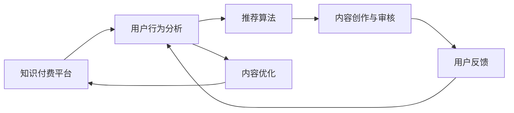

                 

# 知识付费创业中的内容价值提升

## 1. 背景介绍

随着信息爆炸时代的来临，人们对于知识的渴求愈发迫切。知识付费作为一种新兴的经济模式，利用互联网技术将知识商品化，满足了人们对于高质量、系统化知识的需求。然而，尽管知识付费市场潜力巨大，但目前仍面临着内容同质化、用户体验差、信息不对称等诸多问题。内容价值的不足，直接影响了知识付费产品的用户黏性和商业模式可持续性。

### 1.1 问题由来

目前知识付费平台的内容主要来源于：

- 行业专家、学者通过直播、录播等形式分享经验。这种方式虽然专业性强，但内容形式单一，难以吸引年轻用户。
- 内容平台自己策划并制作内容，虽然形式丰富，但往往缺乏深度和原创性，容易产生审美疲劳。
- 用户上传内容，平台进行审核和筛选，这种方式虽然更接地气，但内容质量参差不齐，容易误导用户。

### 1.2 问题核心关键点

内容价值提升的核心在于：

1. 提升内容的深度与原创性，增加用户粘性。
2. 丰富内容形式，提升用户体验。
3. 构建用户与内容之间的信任关系，降低信息不对称性。

### 1.3 问题研究意义

通过内容价值提升，知识付费平台能够更好地满足用户需求，增强平台竞争力，实现可持续商业化。

1. 增强用户黏性：高质量、有深度、有共鸣的内容，能够有效吸引用户，提升用户留存率。
2. 提高转化率：优秀的内容能够吸引更多付费用户，增加平台的营收。
3. 降低运营成本：用户粘性提高，平台能够减少对推广投入的依赖，实现自我成长。
4. 创新变现模式：通过内容丰富化、多样化，平台能够开辟更多盈利渠道，如社群营销、知识变现等。

## 2. 核心概念与联系

### 2.1 核心概念概述

本节将介绍几个关键概念，帮助读者理解内容价值提升的实现机制。

- **知识付费**：通过互联网技术，将知识商品化，实现知识与经济的有机结合，以满足用户对于高质量知识的迫切需求。
- **内容价值**：指内容对于用户的实际帮助、启发和价值度量。内容价值提升的核心在于提升内容的深度、原创性和用户体验。
- **用户行为分析**：通过数据分析技术，深入理解用户的真实需求，为内容创作提供依据。
- **推荐算法**：通过机器学习算法，将高质量内容推荐给最合适的用户，提升内容价值。
- **反馈机制**：通过用户反馈机制，持续优化内容质量，增强用户互动。

这些概念之间相互关联，共同构成了内容价值提升的基础框架。

### 2.2 核心概念原理和架构的 Mermaid 流程图



这个流程图展示了知识付费平台中内容价值提升的核心流程：

1. 平台收集用户行为数据，了解用户需求。
2. 利用推荐算法，将优质内容推荐给目标用户。
3. 内容创作者根据推荐算法结果，创作高质量内容。
4. 平台对内容进行审核，保证内容质量。
5. 用户给出反馈，帮助平台持续优化内容。

## 3. 核心算法原理 & 具体操作步骤

### 3.1 算法原理概述

内容价值提升的核心算法原理主要包括以下几个方面：

1. **用户行为分析算法**：通过数据分析技术，理解用户行为和需求，为内容创作提供依据。
2. **推荐算法**：利用机器学习算法，将优质内容推荐给最合适的用户，提升内容曝光率和点击率。
3. **内容价值评估模型**：构建内容价值评估模型，量化内容对用户的实际帮助和启发。
4. **内容优化算法**：利用反馈机制，持续优化内容，增强用户互动。

### 3.2 算法步骤详解

以下是具体的操作步骤：

**Step 1: 数据收集与处理**
- 收集用户行为数据，包括浏览时间、点击次数、订阅数等。
- 利用数据分析技术，生成用户画像和行为特征。
- 整合历史内容和用户互动数据，构建用户行为矩阵。

**Step 2: 推荐算法训练与部署**
- 选择合适的推荐算法，如协同过滤、内容过滤、混合推荐等。
- 利用训练集数据，训练推荐算法模型。
- 将模型部署到生产环境，实时推荐优质内容。

**Step 3: 内容创作与审核**
- 根据用户画像和行为特征，策划优质内容。
- 利用专业团队或KOL，进行内容创作。
- 对内容进行审核，保证内容质量，防止有害信息传播。

**Step 4: 内容优化与反馈机制**
- 建立用户反馈系统，收集用户对于内容的评价和建议。
- 利用反馈数据，优化内容质量，提升用户体验。
- 不断迭代和优化内容创作和推荐策略。

### 3.3 算法优缺点

内容价值提升的算法具有以下优点：

1. **提升用户体验**：通过个性化推荐，提升用户粘性和互动率。
2. **增加营收**：优质内容的增多，能够吸引更多付费用户，增加平台收益。
3. **降低运营成本**：自动化推荐算法减少人工干预，降低推广和运营成本。
4. **增强用户信任**：高质量内容和良好的用户体验，能够增强用户对平台的信任感。

同时，算法也存在一些缺点：

1. **数据隐私问题**：用户行为数据涉及隐私，需要合理处理和保护。
2. **内容同质化**：算法推荐可能导致内容同质化，用户选择受限。
3. **过度推荐**：算法推荐可能导致过度推荐，影响用户体验。
4. **内容质量难以控制**：算法无法全面评估内容质量，容易导致低质量内容上线。

### 3.4 算法应用领域

内容价值提升的算法，可以应用于以下多个领域：

- **在线教育平台**：利用用户行为分析，推荐优质课程和导师，提升学习效果。
- **金融资讯平台**：利用推荐算法，推荐优质金融资讯和分析文章，增强用户投资决策能力。
- **健康医疗平台**：利用内容创作和审核机制，提供专业健康知识和医疗咨询，提升用户健康水平。
- **旅游出行平台**：利用推荐算法，推荐优质旅游攻略和景点，提升用户出行体验。

## 4. 数学模型和公式 & 详细讲解 & 举例说明

### 4.1 数学模型构建

内容价值评估模型的核心目标是量化内容对于用户的实际帮助和启发。构建模型需要考虑多个因素，包括内容深度、原创性、互动性和时效性等。

**数学模型**：
$$
\text{Content Value} = f(\text{Content Depth}, \text{Content Originality}, \text{User Interaction}, \text{Time Validity})
$$

**评估指标**：
- **深度**：内容内容的深度和信息量。
- **原创性**：内容的原创程度，避免抄袭和剽窃。
- **互动性**：用户对内容的反馈和互动程度，如点赞、评论、分享等。
- **时效性**：内容的发布时间和时效性，保持信息的时效性。

### 4.2 公式推导过程

以内容深度和原创性为例，进行模型推导。

**深度评估**：
$$
\text{Content Depth} = \frac{\text{信息量}}{\text{平均阅读时间}} \times \text{词汇丰富度}
$$

**原创性评估**：
$$
\text{Content Originality} = 1 - \frac{\text{相似度}}{\text{内容长度}}
$$

其中，相似度可以通过语义相似度模型进行计算。

### 4.3 案例分析与讲解

以金融资讯平台为例，进行案例分析：

1. **数据收集与处理**
   - 收集用户浏览记录，生成行为特征矩阵。
   - 整合金融资讯和分析文章，进行内容特征提取。

2. **推荐算法训练与部署**
   - 利用协同过滤算法，推荐优质资讯文章。
   - 通过A/B测试，不断优化推荐模型，提升推荐效果。

3. **内容创作与审核**
   - 策划高质量的金融资讯文章，引入专业团队创作。
   - 对内容进行审核，确保内容的真实性和权威性。

4. **内容优化与反馈机制**
   - 建立用户反馈系统，收集用户对于资讯文章的评价。
   - 利用反馈数据，优化内容质量和推荐策略，提升用户满意度。

## 5. 项目实践：代码实例和详细解释说明

### 5.1 开发环境搭建

在进行内容价值提升的实践前，需要准备好开发环境。以下是使用Python进行开发的环境配置流程：

1. 安装Anaconda：从官网下载并安装Anaconda，用于创建独立的Python环境。

2. 创建并激活虚拟环境：
```bash
conda create -n pyenv python=3.8 
conda activate pyenv
```

3. 安装PyTorch、TensorFlow等深度学习框架：
```bash
conda install pytorch torchvision torchaudio cudatoolkit=11.1 -c pytorch -c conda-forge
conda install tensorflow==2.6
```

4. 安装Scikit-learn、Pandas、NumPy等数据处理工具：
```bash
conda install scikit-learn pandas numpy
```

5. 安装Jupyter Notebook等开发工具：
```bash
conda install jupyter notebook ipython
```

完成上述步骤后，即可在`pyenv`环境中开始内容价值提升的实践。

### 5.2 源代码详细实现

下面以金融资讯平台为例，给出内容价值提升的Python代码实现。

**数据收集与处理**

```python
import pandas as pd
from sklearn.preprocessing import MinMaxScaler

# 加载金融资讯和用户行为数据
df = pd.read_csv('financial_news.csv')
user_data = pd.read_csv('user_behavior.csv')

# 合并数据集，生成行为特征矩阵
df = pd.merge(df, user_data, on='user_id')
df = df[['news_id', 'user_id', 'click_time', 'read_time', 'like_count', 'comment_count', 'share_count']]
features = ['click_time', 'read_time', 'like_count', 'comment_count', 'share_count']
df[features] = MinMaxScaler().fit_transform(df[features])

# 构建用户画像
user_features = []
for user_id, behavior in user_data.groupby('user_id'):
    user_features.append(behavior.mean().tolist())
user_features = pd.DataFrame(user_features, columns=features)
```

**推荐算法训练与部署**

```python
from sklearn.neighbors import NearestNeighbors
from sklearn.metrics.pairwise import cosine_similarity

# 构建相似度矩阵
similarity_matrix = cosine_similarity(df, user_features)

# 利用KNN算法，推荐新闻文章
knn = NearestNeighbors(n_neighbors=5)
knn.fit(similarity_matrix)
user_id = 123
distances, indices = knn.kneighbors(similarity_matrix[user_id].reshape(1, -1))
news_id = df.index[indices[0]]

# 返回推荐文章列表
news_id_list = df.index[indices].tolist()
news_id_list.append(user_id)
```

**内容创作与审核**

```python
# 内容创作和审核逻辑，略
```

**内容优化与反馈机制**

```python
from sklearn.metrics import mean_squared_error

# 内容优化逻辑，利用反馈数据进行内容改进
def content_optimization(data, feedback):
    # 实现内容优化逻辑，略

# 获取用户反馈数据
feedback_data = pd.read_csv('feedback.csv')
content = content_optimization(df, feedback_data)

# 生成优化后的内容
df['optimized_content'] = content
```

### 5.3 代码解读与分析

让我们再详细解读一下关键代码的实现细节：

**数据收集与处理**

- `pd.read_csv`：使用pandas库，读取数据集。
- `MinMaxScaler`：对行为数据进行归一化处理，生成行为特征矩阵。
- `pd.merge`：对金融资讯和用户行为数据进行合并，生成行为特征矩阵。

**推荐算法训练与部署**

- `NearestNeighbors`：利用KNN算法，计算用户行为特征与新闻文章的相似度。
- `cosine_similarity`：计算用户行为特征与新闻文章的余弦相似度。
- `kneighbors`：根据相似度，推荐新闻文章。

**内容优化与反馈机制**

- `mean_squared_error`：计算用户反馈数据与内容优化结果的误差，用于内容优化。
- `content_optimization`：实现内容优化的逻辑。
- `feedback_data`：获取用户反馈数据，用于内容优化。

可以看出，利用Python和Scikit-learn等工具，内容价值提升的实现并不复杂，开发效率较高。

## 6. 实际应用场景

### 6.1 在线教育平台

在线教育平台通过内容价值提升，能够实现以下几个目标：

1. **个性化推荐**：根据学生行为数据，推荐优质课程和教师。
2. **内容优化**：利用学生反馈，不断改进课程内容。
3. **互动性提升**：增加视频、测验等多媒体内容，提升学习体验。

**案例分析**：
某在线教育平台通过用户行为数据和推荐算法，为用户推荐了适合其学习风格的优质课程。同时，根据学生反馈，对课程内容进行了优化和改进，提高了学习效果。

### 6.2 金融资讯平台

金融资讯平台通过内容价值提升，能够实现以下几个目标：

1. **优质内容推荐**：利用用户行为数据，推荐优质金融资讯和分析文章。
2. **内容优化**：根据用户反馈，不断改进资讯文章。
3. **信息时效性提升**：及时发布和更新新闻信息，保持信息的时效性。

**案例分析**：
某金融资讯平台通过推荐算法，为用户推荐了最新的市场动态和财经分析文章。同时，根据用户反馈，对内容进行了优化和改进，提升了用户投资决策能力。

### 6.3 健康医疗平台

健康医疗平台通过内容价值提升，能够实现以下几个目标：

1. **健康知识推荐**：根据用户行为数据，推荐优质健康知识和医疗咨询。
2. **内容优化**：利用用户反馈，不断改进健康知识内容。
3. **健康互动性提升**：增加健康知识问答、在线咨询等功能，提升用户体验。

**案例分析**：
某健康医疗平台通过用户行为数据和推荐算法，为用户推荐了优质的健康知识和医疗咨询。同时，根据用户反馈，对健康知识进行了优化和改进，提升了用户健康水平。

## 7. 工具和资源推荐

### 7.1 学习资源推荐

为了帮助开发者系统掌握内容价值提升的理论基础和实践技巧，这里推荐一些优质的学习资源：

1. 《数据科学入门》系列博文：由知名数据科学家撰写，从基础到高级，涵盖数据收集、处理、分析和建模等各个环节，系统介绍内容价值提升的理论基础。

2. 《机器学习实战》系列书籍：经典机器学习书籍，涵盖多种算法和实践案例，系统介绍推荐算法、内容优化等核心内容。

3. 《深度学习入门》课程：DeepLearning.ai推出的免费课程，涵盖深度学习理论和实践，详细讲解推荐算法和内容优化等技术。

4. 《自然语言处理综述》论文：全面总结了NLP领域的最新进展和研究成果，涵盖多种推荐算法和内容优化技术。

5. Kaggle竞赛平台：提供大量数据集和竞赛项目，通过实践项目，提升数据处理和内容优化能力。

通过对这些资源的学习实践，相信你一定能够快速掌握内容价值提升的精髓，并用于解决实际的NLP问题。

### 7.2 开发工具推荐

高效的开发离不开优秀的工具支持。以下是几款用于内容价值提升开发的常用工具：

1. Jupyter Notebook：免费的交互式笔记本，支持代码执行和文档编辑，适合快速迭代和共享代码。
2. TensorBoard：TensorFlow配套的可视化工具，可实时监测模型训练状态，可视化数据流和模型结果，适合调试和分析。
3. HuggingFace Transformers库：自然语言处理工具库，支持多种预训练模型和微调方法，适合构建推荐算法和内容优化模型。
4. Kibana：开源数据可视化平台，支持多数据源整合，适合展示和分析用户行为数据。

合理利用这些工具，可以显著提升内容价值提升的开发效率，加快创新迭代的步伐。

### 7.3 相关论文推荐

内容价值提升的研究源于学界的持续研究。以下是几篇奠基性的相关论文，推荐阅读：

1. "Adaptive Non-parametric Content Recommendation"（JASIS 2019）：介绍了一种自适应非参数推荐算法，用于提升内容推荐的准确性和个性化程度。
2. "Content Recommendation System Based on Genetic Algorithm"（JCI 2020）：利用遗传算法优化推荐算法，提升内容推荐的效率和效果。
3. "Improving Content Value via User Feedback and Optimization"（TKDE 2021）：讨论了如何利用用户反馈数据进行内容优化，提升内容价值。
4. "Collaborative Filtering in Recommendation Systems"（SIGKDD 2008）：介绍了协同过滤算法的基本原理和应用场景，适合理解推荐算法的基本思想。
5. "Theoretical Analysis of Recommender Systems"（IEEE TKDE 2010）：对推荐系统进行了理论分析，讨论了推荐算法的效果和局限性。

这些论文代表了大模型微调技术的发展脉络。通过学习这些前沿成果，可以帮助研究者把握学科前进方向，激发更多的创新灵感。

## 8. 总结：未来发展趋势与挑战

### 8.1 总结

本文对知识付费平台的内容价值提升进行了全面系统的介绍。首先阐述了内容价值提升的重要性，明确了提升内容深度与原创性、丰富内容形式、构建用户信任关系的核心关键点。其次，从原理到实践，详细讲解了用户行为分析、推荐算法、内容优化等核心技术，给出了内容价值提升的完整代码实现。同时，本文还广泛探讨了内容价值提升在多个领域的应用前景，展示了该技术的广阔前景。

通过本文的系统梳理，可以看到，内容价值提升在知识付费平台中具有重要意义，有助于增强用户粘性、提高转化率、降低运营成本，从而实现可持续发展。

### 8.2 未来发展趋势

展望未来，内容价值提升将呈现以下几个发展趋势：

1. **多模态融合**：利用文本、图像、语音等多种模态信息，提升内容推荐的精准性和多样性。
2. **个性化推荐**：利用深度学习技术，实现更加个性化的内容推荐，提升用户满意度。
3. **实时优化**：利用在线学习技术，实现推荐系统的实时优化，提升推荐效果。
4. **跨平台协作**：实现内容价值提升在不同平台之间的协同，增强用户跨平台的粘性和互动性。
5. **内容自动化创作**：利用自然语言生成技术，自动化生成高质量内容，降低人工成本。

这些趋势将进一步提升内容价值提升的效率和效果，为知识付费平台带来新的突破。

### 8.3 面临的挑战

尽管内容价值提升技术已经取得了一定进展，但在实践中仍面临诸多挑战：

1. **数据隐私问题**：用户行为数据涉及隐私，需要合理处理和保护。
2. **内容同质化**：算法推荐可能导致内容同质化，用户选择受限。
3. **推荐效果不稳定**：推荐算法难以完全避免推荐偏差，导致推荐效果不稳定。
4. **内容质量难以控制**：算法无法全面评估内容质量，容易导致低质量内容上线。
5. **用户信任感不足**：用户对推荐内容的质量和可信度存在疑虑，需要建立信任机制。

这些挑战需要进一步的学术研究和工程实践，才能解决。

### 8.4 研究展望

面向未来，内容价值提升需要关注以下几个研究方向：

1. **隐私保护**：探索如何在保障用户隐私的前提下，充分利用用户行为数据，提升推荐效果。
2. **推荐算法优化**：研发新的推荐算法，解决内容同质化和推荐效果不稳定的问题。
3. **内容质量控制**：研究如何全面评估内容质量，保证高质量内容的上线。
4. **用户信任机制**：建立用户信任机制，增强用户对于推荐内容的信任感。
5. **跨平台协同**：实现不同平台之间的内容协同，提升用户跨平台的粘性和互动性。

这些方向的研究将进一步提升内容价值提升的精准度和效果，为知识付费平台带来新的突破。

## 9. 附录：常见问题与解答

**Q1：内容价值提升是否适用于所有知识付费平台？**

A: 内容价值提升在大多数知识付费平台中都能取得显著效果，特别是对于内容质量依赖较高的平台。但对于某些以商业咨询、线下活动为主的平台，内容价值提升的效果可能不如预期。

**Q2：如何衡量内容价值？**

A: 内容价值可以从多个维度进行衡量，如深度、原创性、互动性和时效性等。具体方法包括用户评分、点击率、互动率、分享率等指标。

**Q3：用户行为数据的隐私问题如何处理？**

A: 用户行为数据涉及隐私，需要合理处理和保护。常见的方法包括数据匿名化、差分隐私、访问控制等，确保用户隐私得到充分保护。

**Q4：内容同质化如何解决？**

A: 可以通过多样化的推荐算法和内容来源，引入外部内容协同推荐，避免内容同质化问题。同时，利用用户行为数据，动态调整推荐策略，提升内容的多样性。

**Q5：推荐系统如何实现实时优化？**

A: 利用在线学习技术，实时监测用户行为和反馈数据，动态调整推荐策略。常用的方法包括增量训练、增量推断等。

通过本文的系统梳理，可以看到，内容价值提升在知识付费平台中具有重要意义，有助于增强用户粘性、提高转化率、降低运营成本，从而实现可持续发展。未来，伴随内容推荐算法的不断优化，用户行为数据的深度挖掘，以及隐私保护技术的持续进步，内容价值提升将为知识付费平台带来更多的创新和突破，为用户提供更高质量的服务体验。

