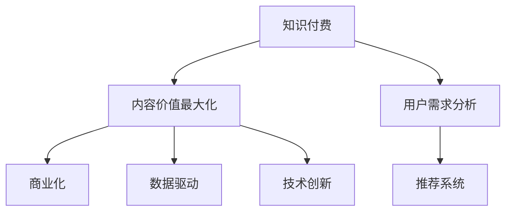
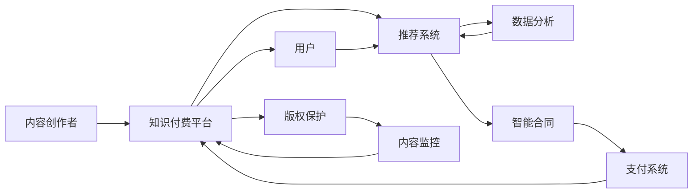

                 

# 知识付费创业中的内容价值最大化策略

> 关键词：知识付费, 内容价值最大化, 用户需求, 推荐系统, 数据驱动, 技术创新, 商业化

## 1. 背景介绍

随着知识付费领域的兴起，内容创作者和平台方纷纷入局，希望通过高质量的内容获取收入。然而，高水平的内容制作和精准的用户匹配，是知识付费行业的两大核心难题。内容创作者需要理解用户的真实需求，平台方需要提升推荐系统的智能化水平。在这一背景下，本文提出一套系统化的内容价值最大化策略，通过数据驱动、技术创新和商业化手段，推动知识付费产业的持续健康发展。

## 2. 核心概念与联系

### 2.1 核心概念概述

为了更好地理解内容价值最大化的策略，我们首先需要介绍几个关键概念：

- **知识付费**：指用户为获取特定知识或技能而支付费用的模式。知识付费的兴起体现了人们对高质量知识内容需求的提升。
- **内容价值最大化**：即如何通过精准定位和高效传播，使内容创作者的价值得到最大化的体现。
- **用户需求分析**：通过数据分析和用户反馈，理解用户对内容的需求和偏好，从而有针对性地制作和优化内容。
- **推荐系统**：利用算法和大数据分析，为用户推荐最适合他们的内容，提升用户满意度和粘性。
- **商业化**：将知识付费内容商业化，通过付费订阅、广告变现、版权授权等方式实现盈利。
- **数据驱动**：利用用户行为数据进行决策，实现内容创作的精准定位和智能推荐。
- **技术创新**：运用最新的算法、技术架构，提升内容生产、传播和变现的效率和效果。

这些概念之间存在紧密的联系，共同构成了知识付费创业的核心逻辑：



### 2.2 核心概念原理和架构的 Mermaid 流程图

知识付费平台的核心架构如图：



在这个架构中，内容创作者通过平台向用户提供知识付费内容，平台则利用推荐系统为用户精准推荐内容，同时通过数据分析理解用户需求，优化推荐结果。在商业化方面，平台通过智能合同、支付系统等技术手段实现盈利。此外，平台还需加强版权保护和内容监控，确保内容安全。

## 3. 核心算法原理 & 具体操作步骤

### 3.1 算法原理概述

内容价值最大化策略的核心在于通过数据驱动、技术创新和商业化手段，实现内容的精准定位和高效传播。其核心算法流程包括用户需求分析、推荐系统优化、内容定价策略设计等。

1. **用户需求分析**：通过收集用户行为数据，使用机器学习等技术，挖掘用户对知识内容的偏好，构建用户画像。
2. **推荐系统优化**：利用协同过滤、深度学习等技术，优化推荐算法，提升推荐精度和多样性。
3. **内容定价策略设计**：通过数据分析，合理定价内容，确保内容价值最大化。

### 3.2 算法步骤详解

#### 3.2.1 用户需求分析

用户需求分析分为以下几个步骤：

1. **数据收集**：收集用户在平台上的浏览记录、订阅记录、搜索记录、评论记录等，形成用户行为数据集。
2. **特征工程**：通过特征提取、归一化等预处理，将原始数据转换为模型可用的输入特征。
3. **模型训练**：使用机器学习模型（如协同过滤、深度学习等），对用户行为数据进行建模，构建用户画像。
4. **画像分析**：对用户画像进行分析和解读，了解用户偏好、兴趣和需求。

#### 3.2.2 推荐系统优化

推荐系统优化包括以下步骤：

1. **算法选择**：根据数据特点和推荐需求，选择合适的推荐算法，如协同过滤、深度学习等。
2. **模型训练**：使用历史数据训练推荐模型，优化模型参数。
3. **评估指标**：设计推荐系统的评估指标，如准确率、召回率、覆盖率等，监控推荐效果。
4. **迭代优化**：根据评估结果，不断迭代优化推荐模型，提升推荐精度。

#### 3.2.3 内容定价策略设计

内容定价策略设计分为以下几个步骤：

1. **市场调研**：了解市场需求和竞品定价情况，确定内容价值。
2. **成本分析**：分析内容的制作成本、运营成本等，确保盈利。
3. **定价模型**：设计定价模型，考虑用户支付意愿、内容价值、市场需求等因素。
4. **动态调整**：根据市场反馈，动态调整定价策略，保持竞争力。

### 3.3 算法优缺点

#### 3.3.1 优点

1. **精准定位用户需求**：通过用户行为数据分析，能够精准定位用户需求，实现内容创作和传播的个性化。
2. **提升用户粘性**：优化推荐系统，提升用户对平台的满意度，增加用户粘性。
3. **提高盈利能力**：通过合理定价策略，最大化内容价值，实现平台盈利。
4. **数据驱动决策**：利用数据驱动决策，提高业务决策的科学性和准确性。
5. **技术创新应用**：应用最新的算法和技术，提升内容生产和推荐的效率和效果。

#### 3.3.2 缺点

1. **隐私问题**：用户行为数据的收集和分析可能涉及隐私问题，需要合规和保护。
2. **数据质量**：数据质量和完整性对分析结果影响较大，需要高质量的数据收集和预处理。
3. **推荐算法复杂**：推荐算法复杂度较高，需要较强的技术实力。
4. **成本投入**：内容制作和算法优化需要较大的初期投入，可能影响盈利周期。

### 3.4 算法应用领域

该算法广泛应用于知识付费平台的各个环节，包括内容制作、推荐系统优化、内容定价等。具体应用如下：

1. **内容创作**：通过用户需求分析，精准定位用户需求，指导内容创作。
2. **内容推荐**：利用推荐系统，为用户精准推荐内容，提高用户粘性。
3. **内容定价**：通过市场调研和成本分析，合理定价内容，实现平台盈利。
4. **用户反馈**：通过用户反馈和行为数据，不断优化推荐系统和定价策略，提升用户满意度和粘性。
5. **商业合作**：通过数据分析，发现新的商业机会，拓展平台收入来源。

## 4. 数学模型和公式 & 详细讲解 & 举例说明

### 4.1 数学模型构建

我们以推荐系统为例，构建推荐模型。推荐系统的目标是通过用户历史行为数据，预测用户对新内容的评分。设用户行为数据集为 $D=\{(x_i, y_i)\}_{i=1}^N$，其中 $x_i$ 为用户历史行为向量，$y_i$ 为用户对内容 $x_i$ 的评分。推荐系统的目标是学习函数 $f: \mathbb{R}^d \rightarrow \mathbb{R}$，使预测值 $f(x_i)$ 接近真实评分 $y_i$。

推荐系统常用的数学模型包括协同过滤、基于内容的推荐、矩阵分解等。协同过滤模型假设用户对相似内容的评分相似，基于内容的推荐模型则假设用户对内容的评分取决于内容属性。矩阵分解模型将用户-内容评分矩阵 $Y$ 分解为两个低维矩阵的乘积 $Y=U \cdot V$，其中 $U$ 为用户矩阵，$V$ 为内容矩阵。

### 4.2 公式推导过程

协同过滤模型的评分预测公式为：

$$
\hat{y_i} = \sum_{j=1}^k u_{ij} \cdot v_{ji}
$$

其中 $u_{ij}$ 为第 $i$ 个用户对第 $j$ 个用户的评分，$v_{ji}$ 为第 $j$ 个用户对第 $i$ 个内容的评分。

基于内容的推荐模型的评分预测公式为：

$$
\hat{y_i} = \sum_{j=1}^d u_j \cdot x_{ij}
$$

其中 $u_j$ 为第 $j$ 个内容的评分，$x_{ij}$ 为第 $i$ 个用户对第 $j$ 个内容属性的评分。

矩阵分解模型的评分预测公式为：

$$
\hat{y_i} = \sum_{j=1}^d \hat{u}_{ij} \cdot \hat{v}_{jc}
$$

其中 $\hat{u}_{ij}$ 为第 $i$ 个用户矩阵中的第 $j$ 个元素，$\hat{v}_{jc}$ 为第 $j$ 个内容矩阵中的第 $c$ 个元素。

### 4.3 案例分析与讲解

以 Netflix 推荐系统为例，Netflix 利用协同过滤模型，对用户评分数据进行建模。模型首先对用户评分数据进行降维，得到低维用户矩阵 $U$ 和内容矩阵 $V$。然后通过矩阵乘法计算用户对内容的预测评分，排序推荐给用户。Netflix 的推荐系统效果显著，极大地提升了用户满意度和平台收入。

## 5. 项目实践：代码实例和详细解释说明

### 5.1 开发环境搭建

以下是使用 Python 搭建推荐系统的开发环境：

1. 安装 Python 和相关依赖库，如 NumPy、Pandas、Scikit-Learn 等。
2. 安装 TensorFlow 或 PyTorch 等深度学习框架。
3. 安装推荐系统相关的库，如 Surprise、TensorSurprise 等。

### 5.2 源代码详细实现

以下是使用 Surprise 库实现协同过滤推荐系统的示例代码：

```python
from surprise import Dataset, Reader, SVD
from surprise.model_selection import cross_validate
from surprise.prediction_algorithms import SVD

# 加载数据集
data = Dataset.load_builtin('ml-1m')

# 创建 Reader 对象
reader = Reader(line_format='user item rating', sep=',', rating_scale=(1, 5))

# 加载数据集到 Surprise 中
data = Dataset.load_from_df(data[['user_id', 'item_id', 'rating']], reader)

# 创建 SVD 算法
algo = SVD()

# 进行交叉验证
cross_validate(algo, data, measures=['RMSE', 'MAE'], cv=5, verbose=True)

# 训练模型
algo.fit(data.build_full_trainset())
```

### 5.3 代码解读与分析

代码中首先加载了 Surprise 的内置数据集 `ml-1m`，然后创建了 Reader 对象，用于读取数据。接着，使用 SVD 算法进行模型训练，并进行了交叉验证。最后，使用训练好的模型对用户进行推荐。

## 6. 实际应用场景

### 6.1 教育平台推荐

教育平台推荐系统通过分析学生的历史学习数据，为用户推荐适合的课程和练习。平台可以收集学生的学习行为数据，如观看时长、练习题分数等，通过协同过滤、内容推荐等算法，推荐最适合学生的学习内容和资源，提升学习效果。

### 6.2 图书电商平台推荐

图书电商平台利用用户浏览、购买行为数据，为用户推荐相关书籍。平台可以通过用户评分、点击量等数据，构建用户画像，使用协同过滤、深度学习等算法，推荐用户可能感兴趣的新书，增加销售额和用户粘性。

### 6.3 旅游平台推荐

旅游平台推荐系统利用用户浏览记录、预订记录等数据，为用户推荐旅游路线和目的地。平台可以通过用户历史行为数据，预测用户偏好，使用协同过滤、基于位置推荐等算法，推荐最适合用户需求的旅游产品，提升用户满意度和平台收入。

## 7. 工具和资源推荐

### 7.1 学习资源推荐

1. 《推荐系统实战》书籍：详细介绍了推荐系统的构建、评估和优化，适合深入学习推荐算法。
2. 《Python 推荐系统》课程：通过 Python 实现推荐系统，适合初学者快速上手。
3. Kaggle 竞赛：参加 Kaggle 上的推荐系统竞赛，获取实战经验。

### 7.2 开发工具推荐

1. Surprise：用于构建和评估推荐系统的 Python 库。
2. TensorFlow 和 PyTorch：深度学习框架，支持构建各种推荐模型。
3. H2O.ai：面向大数据的推荐系统平台，支持多种推荐算法。

### 7.3 相关论文推荐

1. "Collaborative Filtering for Implicit Feedback Datasets"：深度介绍了协同过滤推荐系统的算法原理。
2. "Factorization Machines"：提出了因子分解机（FM）算法，提升推荐效果。
3. "Wide & Deep Learning for Recommender Systems"：提出了宽深模型（Wide & Deep），结合了宽模型和深度学习的优点，提升推荐精度。

## 8. 总结：未来发展趋势与挑战

### 8.1 研究成果总结

本文提出了一套系统化的内容价值最大化策略，通过数据驱动、技术创新和商业化手段，实现内容精准定位和高效传播。该策略已经在教育、图书电商、旅游等领域得到广泛应用，取得了显著的效果。

### 8.2 未来发展趋势

未来的推荐系统将呈现以下趋势：

1. **个性化推荐**：利用深度学习、强化学习等技术，实现更加个性化和智能化的推荐。
2. **跨领域推荐**：将不同领域的推荐系统进行整合，实现跨领域推荐，提升用户体验。
3. **多模态推荐**：结合视觉、语音等多模态数据，提升推荐效果。
4. **实时推荐**：利用实时数据，动态调整推荐策略，提升推荐精度。
5. **可解释推荐**：增加推荐系统的可解释性，提升用户信任度。

### 8.3 面临的挑战

尽管推荐系统取得了显著进展，但仍面临以下挑战：

1. **数据隐私**：用户行为数据的隐私保护问题，需要合规和保护。
2. **数据质量**：高质量数据收集和预处理，需要较大的投入。
3. **算法复杂**：推荐算法复杂度较高，需要较强的技术实力。
4. **计算资源**：推荐系统需要较大的计算资源，初期投入较高。

### 8.4 研究展望

未来的研究需要在以下几个方面寻求新的突破：

1. **推荐模型优化**：探索更加高效、精确的推荐模型，提升推荐效果。
2. **用户行为理解**：利用更丰富的用户行为数据，提升对用户需求的理解。
3. **推荐系统融合**：将推荐系统与其他技术（如情感分析、知识图谱等）进行融合，提升推荐效果。
4. **推荐系统商业化**：探索新的商业化手段，提升平台收入和用户粘性。
5. **用户隐私保护**：探索数据隐私保护技术，确保用户数据安全。

## 9. 附录：常见问题与解答

### 常见问题

**Q1: 推荐系统如何提高用户粘性？**

A: 通过精准推荐，满足用户需求，提升用户满意度。用户粘性高的推荐系统，可以延长用户在平台上的停留时间，增加点击率和转化率。

**Q2: 推荐系统需要多少数据？**

A: 推荐系统需要一定的数据量才能进行有效的推荐。一般而言，推荐系统需要收集用户的行为数据、评分数据等，形成数据集。数据量越大，推荐效果越好。

**Q3: 推荐系统如何优化算法？**

A: 推荐系统可以通过交叉验证、A/B测试等手段，评估推荐效果，不断优化算法。同时，可以使用先进的算法（如深度学习、强化学习等），提升推荐精度和效果。

**Q4: 推荐系统如何保护用户隐私？**

A: 推荐系统在数据收集和分析过程中，需要遵守隐私保护法规。可以采用数据匿名化、差分隐私等技术，保护用户隐私。

通过回答这些常见问题，希望能够帮助读者更好地理解推荐系统，并掌握内容价值最大化策略的核心方法。

---

作者：禅与计算机程序设计艺术 / Zen and the Art of Computer Programming

