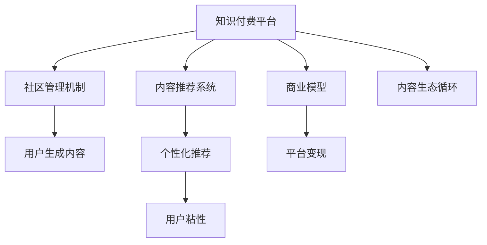

                 

# 知识付费创业中的内容协同效应

> 关键词：知识付费,内容协同,社区生态,用户互动,内容推荐,商业模型

## 1. 背景介绍

### 1.1 问题由来
随着互联网和移动通信技术的飞速发展，知识付费赛道迎来了爆炸性增长。从传统的图文内容付费到直播、音频、视频等多种形式的付费内容，知识付费市场已经成为互联网产业的一支重要力量。特别是在疫情背景下，“宅”生活让人们更多地依赖在线教育和娱乐内容，知识付费成为一种流行的信息消费模式。

然而，尽管知识付费领域竞争激烈，但许多平台还是面临内容同质化、用户粘性不足、难以有效变现等问题。如何构建内容生态系统，提升内容质量和用户互动水平，增强社区粘性，构建有效的商业模式，是知识付费创业的重要课题。

### 1.2 问题核心关键点
针对上述问题，本文提出“内容协同效应”的概念。该概念认为，知识付费创业的核心在于通过内容生态系统的协同作用，构建一个良性互动、高效传播、价值转换的社区环境。这需要平台不断优化内容推荐算法，提升内容质量和推荐精准度，同时建立完善的社区管理机制，营造积极的社区氛围，激励用户生成有价值的内容，从而形成良性循环，实现平台自身的可持续发展。

## 2. 核心概念与联系

### 2.1 核心概念概述

为更好地理解“内容协同效应”，本文将介绍几个密切相关的核心概念：

- **知识付费平台(Knowledge-based e-learning Platforms)**：以知识为核心内容的付费平台，提供各种形式的知识产品和服务，如在线课程、文章、直播、音频、视频等。

- **内容推荐系统(Content Recommendation System)**：使用协同过滤、基于内容的推荐、深度学习等算法，为每个用户推荐个性化的内容，提升用户满意度。

- **社区管理机制(Community Management Mechanism)**：通过用户画像、行为数据分析、社群互动等手段，管理用户行为，营造积极的社区氛围。

- **商业模型(Business Model)**：知识付费平台通过订阅、广告、付费内容等手段，实现商业变现，构建盈利模式。

- **内容协同效应(Content Synergy Effect)**：通过优化内容推荐算法、完善社区管理机制和商业模型，形成良性互动、高效传播、价值转换的生态系统，提升平台的整体价值。

这些概念之间的逻辑关系可以通过以下Mermaid流程图来展示：



这个流程图展示了一些核心概念及其之间的关系：

1. 知识付费平台通过内容推荐系统和社区管理机制，提升内容质量和用户互动水平。
2. 用户生成内容通过社区管理机制的引导，形成有价值的信息资源。
3. 内容推荐系统利用社区数据，实现个性化推荐，增强用户粘性。
4. 商业模型通过平台变现，为内容生产提供经济激励。
5. 内容协同效应通过优化各个环节，形成良性互动、高效传播、价值转换的生态系统。

## 3. 核心算法原理 & 具体操作步骤
### 3.1 算法原理概述

“内容协同效应”的核心在于通过优化内容推荐算法、完善社区管理机制和商业模型，构建一个良性互动、高效传播、价值转换的社区环境。其核心思想是：利用机器学习和数据分析技术，提升内容质量和推荐精准度，同时建立完善的社区管理机制，营造积极的社区氛围，激励用户生成有价值的内容，从而形成良性循环，实现平台自身的可持续发展。

在具体实践中，平台应从以下几个方面进行优化：

- **内容推荐算法优化**：通过协同过滤、基于内容的推荐、深度学习等算法，提升个性化推荐效果，增强用户粘性。
- **社区管理机制完善**：通过用户画像、行为数据分析、社群互动等手段，管理用户行为，营造积极的社区氛围。
- **商业模型创新**：通过订阅、广告、付费内容等手段，实现商业变现，构建盈利模式。

### 3.2 算法步骤详解

以下是“内容协同效应”的详细步骤：

**Step 1: 数据收集与预处理**

- 收集平台上的用户行为数据，如浏览、点击、订阅、评论、点赞、分享等行为。
- 收集内容属性数据，如文章标题、作者、标签、分类、时间戳等。
- 使用数据清洗和预处理技术，去除噪声数据，填补缺失值，生成可用于分析的数据集。

**Step 2: 内容推荐算法设计**

- 选择合适的推荐算法，如协同过滤、基于内容的推荐、深度学习等。
- 设计用户画像模型，捕捉用户偏好和行为模式。
- 设计内容特征提取模型，提取内容的关键词、情感、主题等信息。
- 结合用户画像和内容特征，进行推荐算法训练和测试。
- 使用A/B测试等方法，对比不同算法的效果，选取最优推荐策略。

**Step 3: 社区管理机制优化**

- 设计用户行为分析模型，挖掘用户兴趣、需求和行为特征。
- 设计社群互动模型，分析用户之间的互动关系，识别有影响力的用户。
- 设计内容质量评估模型，评估内容的深度、广度和价值。
- 结合用户行为分析和内容质量评估结果，优化社区管理机制，营造积极氛围。

**Step 4: 商业模型优化**

- 分析平台收入来源，如订阅、广告、付费内容等。
- 设计商业模型优化策略，如调整订阅价格、推出特权服务、优化广告投放策略等。
- 通过A/B测试等方法，对比不同商业模型的效果，选择最优方案。

**Step 5: 内容生态循环维护**

- 通过内容推荐算法和社区管理机制，提升内容质量和用户互动水平。
- 通过商业模型，实现平台变现，为内容生产提供经济激励。
- 不断收集用户反馈，优化算法和机制，形成良性循环，提升平台整体价值。

### 3.3 算法优缺点

“内容协同效应”方法具有以下优点：

1. **提高用户粘性**：通过个性化推荐，满足用户需求，提升用户满意度，增加用户粘性。
2. **优化社区氛围**：通过社区管理机制，营造积极的社区氛围，增强用户互动，提升平台活跃度。
3. **提升内容质量**：通过内容质量评估和优化，引导内容生产，提升平台整体内容质量。
4. **实现商业变现**：通过优化商业模型，实现平台变现，为内容生产提供经济激励。

同时，该方法也存在一些局限性：

1. **算法复杂度高**：内容推荐和社区管理的算法模型复杂，需要大量的数据和计算资源。
2. **用户隐私问题**：平台需收集和分析用户行为数据，涉及用户隐私保护问题，需严格遵守法律法规。
3. **数据质量依赖**：算法的准确性依赖于数据的完整性和质量，需进行严格的数据清洗和预处理。
4. **用户行为变化**：用户行为和偏好随时间变化，算法需要不断优化调整，以适应新的变化。

尽管存在这些局限性，但就目前而言，“内容协同效应”仍是大数据时代知识付费平台的重要优化方向。

### 3.4 算法应用领域

“内容协同效应”在知识付费创业中的应用领域广泛，包括但不限于以下方面：

- **在线教育平台**：通过个性化推荐和社区互动，提升课程质量和学生互动，增加学生粘性。
- **知识社区**：通过社区管理机制，营造积极互动氛围，提升平台活跃度和用户粘性。
- **视频平台**：通过内容推荐和社区管理，提升视频质量和用户互动，增加用户粘性和订阅率。
- **音频平台**：通过个性化推荐和社区互动，提升音频内容和用户粘性。
- **图书推荐平台**：通过内容推荐和社区管理，提升图书推荐精准度和用户粘性。

## 4. 数学模型和公式 & 详细讲解  
### 4.1 数学模型构建

本节将使用数学语言对“内容协同效应”进行更加严格的刻画。

记知识付费平台上的用户集合为 $U$，内容集合为 $C$。设 $r_{ui}$ 表示用户 $u$ 对内容 $c_i$ 的互动评分，如浏览、点赞、评论等。设 $a_{ui}$ 表示用户 $u$ 对内容 $c_i$ 的情感评分，如正面、负面、中性等。

定义用户 $u$ 对内容 $c_i$ 的综合评分 $s_{ui}$ 为：

$$
s_{ui} = \alpha r_{ui} + \beta a_{ui}
$$

其中 $\alpha, \beta$ 为权重系数。

定义内容 $c_i$ 的综合评分 $s_{ic}$ 为：

$$
s_{ic} = \gamma r_{ic} + \delta a_{ic}
$$

其中 $\gamma, \delta$ 为权重系数。

**内容推荐模型**：

设 $f(u,i)$ 为内容 $c_i$ 对用户 $u$ 的综合推荐得分，则有：

$$
f(u,i) = \sum_{j=1}^n s_{uj} w_{ij}
$$

其中 $w_{ij}$ 为权重矩阵，需通过训练得到。

**社区管理模型**：

设 $g(u)$ 为社区管理机制下用户 $u$ 的综合行为得分，则有：

$$
g(u) = \sum_{j=1}^n s_{uj} v_{j}
$$

其中 $v_{j}$ 为行为得分向量，需通过分析得到。

**商业模型**：

设 $p_i$ 为内容 $c_i$ 的付费系数，则有：

$$
p_i = f(i) \cdot g(i)
$$

其中 $f(i)$ 和 $g(i)$ 分别表示内容 $c_i$ 的推荐得分和行为得分。

**内容生态循环**：

设 $l_{ui}$ 为用户 $u$ 对内容 $c_i$ 的反馈评分，则有：

$$
l_{ui} = \sum_{j=1}^n f(j) w_{ji}
$$

**内容质量评估模型**：

设 $q_i$ 为内容 $c_i$ 的质量得分，则有：

$$
q_i = \sum_{j=1}^n l_{uj} m_{ij}
$$

其中 $m_{ij}$ 为质量评估矩阵，需通过专家打分或用户评价得到。

## 5. 项目实践：代码实例和详细解释说明
### 5.1 开发环境搭建

在进行“内容协同效应”实践前，我们需要准备好开发环境。以下是使用Python进行PyTorch开发的环境配置流程：

1. 安装Anaconda：从官网下载并安装Anaconda，用于创建独立的Python环境。

2. 创建并激活虚拟环境：
```bash
conda create -n pytorch-env python=3.8 
conda activate pytorch-env
```

3. 安装PyTorch：根据CUDA版本，从官网获取对应的安装命令。例如：
```bash
conda install pytorch torchvision torchaudio cudatoolkit=11.1 -c pytorch -c conda-forge
```

4. 安装TensorFlow：由Google主导开发的开源深度学习框架，生产部署方便，适合大规模工程应用。同样有丰富的预训练语言模型资源。

5. 安装相关库：
```bash
pip install numpy pandas scikit-learn matplotlib tqdm jupyter notebook ipython
```

完成上述步骤后，即可在`pytorch-env`环境中开始项目实践。

### 5.2 源代码详细实现

这里我们以在线教育平台为例，给出使用PyTorch进行内容推荐和社区管理的代码实现。

首先，定义内容推荐模型：

```python
import torch
from torch import nn
from torch.nn import functional as F

class Recommender(nn.Module):
    def __init__(self, input_dim, hidden_dim):
        super(Recommender, self).__init__()
        self.fc1 = nn.Linear(input_dim, hidden_dim)
        self.fc2 = nn.Linear(hidden_dim, 1)
        
    def forward(self, x):
        x = F.relu(self.fc1(x))
        x = self.fc2(x)
        return torch.sigmoid(x)

# 训练函数
def train_recommender(model, optimizer, train_data, device, epochs=1, batch_size=32):
    model.train()
    criterion = nn.BCELoss()
    for epoch in range(epochs):
        for batch in train_data:
            inputs, labels = batch.to(device), labels.to(device)
            optimizer.zero_grad()
            outputs = model(inputs)
            loss = criterion(outputs, labels)
            loss.backward()
            optimizer.step()
        print(f"Epoch {epoch+1}, Loss: {loss:.4f}")
```

接着，定义社区管理模型：

```python
import torch
from torch import nn
from torch.nn import functional as F

class CommunityManager(nn.Module):
    def __init__(self, input_dim, hidden_dim):
        super(CommunityManager, self).__init__()
        self.fc1 = nn.Linear(input_dim, hidden_dim)
        self.fc2 = nn.Linear(hidden_dim, 1)
        
    def forward(self, x):
        x = F.relu(self.fc1(x))
        x = self.fc2(x)
        return torch.sigmoid(x)

# 训练函数
def train_community_manager(model, optimizer, train_data, device, epochs=1, batch_size=32):
    model.train()
    criterion = nn.BCELoss()
    for epoch in range(epochs):
        for batch in train_data:
            inputs, labels = batch.to(device), labels.to(device)
            optimizer.zero_grad()
            outputs = model(inputs)
            loss = criterion(outputs, labels)
            loss.backward()
            optimizer.step()
        print(f"Epoch {epoch+1}, Loss: {loss:.4f}")
```

最后，启动内容推荐和社区管理的训练流程：

```python
from torch.utils.data import DataLoader

# 假设已经将用户行为和内容属性数据加载到DataLoader中
train_data = DataLoader(train_data, batch_size=32)

# 定义模型和优化器
input_dim = 50 # 假设内容属性维度为50
hidden_dim = 64
optimizer = torch.optim.Adam([{'params': model.parameters()}], lr=0.001)

# 训练模型
model = Recommender(input_dim, hidden_dim).to(device)
train_recommender(model, optimizer, train_data, device)

# 测试模型
test_data = DataLoader(test_data, batch_size=32)
model.eval()
with torch.no_grad():
    for batch in test_data:
        inputs, labels = batch.to(device), labels.to(device)
        outputs = model(inputs)
        print(f"Test Loss: {criterion(outputs, labels).item():.4f}")
```

以上就是使用PyTorch进行内容推荐和社区管理的代码实现。可以看到，借助PyTorch的强大封装能力，可以高效地训练和测试推荐和社区管理模型。

### 5.3 代码解读与分析

让我们再详细解读一下关键代码的实现细节：

**Recommender类**：
- `__init__`方法：定义了模型的网络结构，包括两个全连接层。
- `forward`方法：对输入数据进行前向传播，返回推荐得分。

**train_recommender函数**：
- 将模型置为训练模式，定义损失函数为二元交叉熵损失。
- 在每个epoch中，对训练数据进行迭代，计算损失并进行反向传播，更新模型参数。
- 输出每个epoch的损失值。

**CommunityManager类**：
- 定义和Recommender类相似的模型结构，用于社区管理。

**train_community_manager函数**：
- 与train_recommender函数类似，用于训练社区管理模型。

**训练流程**：
- 定义模型的输入维度和隐藏维度。
- 定义优化器，使用Adam优化器。
- 训练推荐模型和社区管理模型。
- 在测试集上评估推荐模型的性能。

这些代码实例展示了如何利用机器学习和数据分析技术，构建内容推荐和社区管理模型，以提升知识付费平台的用户体验和粘性。

## 6. 实际应用场景

### 6.1 在线教育平台

在线教育平台可以借助“内容协同效应”，提升课程质量和用户互动水平。通过个性化推荐，推荐用户感兴趣的内容，提升课程完成率。同时，通过社区互动，让用户参与讨论，分享学习心得，增加用户粘性。

具体而言，在线教育平台可以收集用户的学习行为数据，如课程浏览、点击、观看、测试等行为。同时收集课程的描述、标签、教师等信息。使用内容推荐算法，为每个用户推荐个性化的课程内容。通过社区管理机制，鼓励用户互动，分享学习成果，营造积极的社区氛围。

### 6.2 知识社区

知识社区可以通过“内容协同效应”，提升社区活跃度和用户粘性。通过内容推荐和社区互动，提升用户参与度。同时，通过社区管理机制，营造积极的社区氛围，增加社区粘性。

具体而言，知识社区可以收集用户的内容生成和互动数据，如评论、点赞、分享等行为。同时收集内容的深度、广度和价值等信息。使用内容推荐算法，为每个用户推荐有价值的内容。通过社区管理机制，分析用户行为，识别有影响力的用户，引导用户生成有价值的内容，增加社区互动。

### 6.3 视频平台

视频平台可以通过“内容协同效应”，提升视频质量和用户粘性。通过内容推荐和社区互动，提升用户观看体验。同时，通过社区管理机制，营造积极的社区氛围，增加用户粘性。

具体而言，视频平台可以收集用户的观看行为数据，如视频播放、点赞、评论等行为。同时收集视频的描述、分类、时间等信息。使用内容推荐算法，为每个用户推荐个性化的视频内容。通过社区管理机制，鼓励用户互动，分享观看体验，增加用户粘性。

### 6.4 未来应用展望

随着“内容协同效应”技术的不断发展，未来的知识付费平台将迎来更多的创新应用，如：

1. **智能导师系统**：通过内容推荐和社区互动，提升个性化导师推荐效果，增加用户互动，提升学习效果。
2. **内容众筹平台**：通过社区管理机制，引导用户参与内容创作，激励优质内容生产，增加用户粘性。
3. **个性化学习路径**：通过内容推荐和社区互动，生成个性化的学习路径，提升学习效率。
4. **虚拟教室系统**：通过社区管理机制，营造积极的虚拟教室氛围，增加用户互动，提升学习体验。
5. **AI辅助创作**：通过内容推荐和社区互动，辅助用户创作高质量内容，增加社区互动。

这些创新应用将进一步拓展“内容协同效应”的边界，推动知识付费平台向更加智能化、个性化的方向发展。

## 7. 工具和资源推荐

### 7.1 学习资源推荐

为了帮助开发者系统掌握“内容协同效应”的理论基础和实践技巧，这里推荐一些优质的学习资源：

1. **《深度学习》课程**：斯坦福大学开设的深度学习课程，全面介绍深度学习理论和实践，适合入门和进阶学习。

2. **《推荐系统》书籍**：详细讲解推荐系统的算法和模型，适合深入了解推荐技术。

3. **《社区管理》书籍**：系统介绍社区管理机制的理论和实践，适合开发社区类应用。

4. **Kaggle竞赛**：参加Kaggle上的推荐系统和社区管理竞赛，实践机器学习算法，提升实战能力。

5. **GitHub项目**：GitHub上的推荐系统和社区管理开源项目，提供丰富的代码示例和资源。

通过这些资源的学习实践，相信你一定能够快速掌握“内容协同效应”的精髓，并用于解决实际的NLP问题。

### 7.2 开发工具推荐

高效的开发离不开优秀的工具支持。以下是几款用于“内容协同效应”开发的常用工具：

1. **PyTorch**：基于Python的开源深度学习框架，灵活动态的计算图，适合快速迭代研究。大部分预训练语言模型都有PyTorch版本的实现。

2. **TensorFlow**：由Google主导开发的开源深度学习框架，生产部署方便，适合大规模工程应用。同样有丰富的预训练语言模型资源。

3. **Recommenderlib**：社区开源的推荐系统库，提供简单易用的推荐算法实现，适合快速开发推荐系统。

4. **PyTorch Social**：社区开源的社交网络分析库，提供社交网络的数据分析和可视化工具，适合社交网络应用。

5. **Jupyter Notebook**：交互式的Python开发环境，支持代码编写、数据处理和结果展示，适合深度学习和数据分析。

合理利用这些工具，可以显著提升“内容协同效应”的开发效率，加快创新迭代的步伐。

### 7.3 相关论文推荐

“内容协同效应”的研究源于学界的持续研究。以下是几篇奠基性的相关论文，推荐阅读：

1. **《推荐系统》**：介绍了推荐系统的基本理论和算法，适合入门学习。

2. **《社区管理》**：系统介绍社区管理机制的理论和实践，适合开发社区类应用。

3. **《社交网络分析》**：介绍了社交网络分析和可视化的方法，适合社交网络应用。

4. **《内容推荐与社区管理》**：综述了内容推荐和社区管理的最新进展，适合深入了解前沿技术。

5. **《知识付费平台的用户行为分析》**：分析了知识付费平台的用户行为，探讨了用户粘性和互动的方法。

这些论文代表了大数据时代知识付费平台的研究脉络。通过学习这些前沿成果，可以帮助研究者把握学科前进方向，激发更多的创新灵感。

## 8. 总结：未来发展趋势与挑战

### 8.1 总结

本文对“内容协同效应”进行了全面系统的介绍。首先阐述了“内容协同效应”的概念及其在知识付费创业中的重要性，明确了其在大数据时代的应用价值。其次，从原理到实践，详细讲解了内容推荐算法、社区管理机制和商业模型的设计思路和优化方法，给出了代码实现示例。同时，本文还广泛探讨了“内容协同效应”在多个行业领域的应用前景，展示了其巨大的潜力。此外，本文精选了“内容协同效应”技术的各类学习资源，力求为读者提供全方位的技术指引。

通过本文的系统梳理，可以看到，“内容协同效应”在知识付费创业中具有广泛的应用前景，有望通过内容推荐和社区管理机制，构建一个良性互动、高效传播、价值转换的生态系统，提升平台的整体价值。未来，伴随技术的发展和应用的拓展，“内容协同效应”必将引领知识付费平台向更加智能化、个性化的方向发展，推动人工智能技术在垂直行业的规模化落地。

### 8.2 未来发展趋势

展望未来，“内容协同效应”将呈现以下几个发展趋势：

1. **算法模型多样化**：未来的推荐算法和社区管理模型将更加多样化，如深度学习、协同过滤、混合推荐等。同时，新的算法模型也将不断涌现，提升推荐的准确性和社区互动的效率。

2. **用户数据细粒化**：未来的推荐系统将更加注重用户数据的细粒化，如点击路径、观看轨迹、评论情感等，提升推荐精准度。

3. **社区管理智能化**：未来的社区管理机制将更加智能化，如情感分析、用户画像、社群互动等，提升社区管理的效果。

4. **数据安全和隐私保护**：未来的知识付费平台将更加注重用户数据的安全和隐私保护，采用数据加密、匿名化等手段，保障用户权益。

5. **跨平台协同**：未来的知识付费平台将实现跨平台协同，如内容推荐、社区互动、商业变现等，提升平台整体价值。

以上趋势凸显了“内容协同效应”技术的广阔前景。这些方向的探索发展，必将进一步提升知识付费平台的性能和应用范围，为传统行业数字化转型升级提供新的技术路径。

### 8.3 面临的挑战

尽管“内容协同效应”技术已经取得了显著的成果，但在迈向更加智能化、普适化应用的过程中，它仍面临着诸多挑战：

1. **数据质量和多样性**：推荐和社区管理模型依赖大量的高质量数据，数据的缺失、噪声、不平衡等问题，可能导致算法效果下降。

2. **算法模型复杂性**：深度学习等高级算法模型的训练复杂度高，对计算资源和训练时间要求较高。

3. **用户隐私保护**：推荐和社区管理模型需收集和分析用户行为数据，涉及用户隐私保护问题，需严格遵守法律法规。

4. **内容生态管理**：知识付费平台需平衡内容质量、用户粘性、商业变现等目标，管理复杂，难度较大。

5. **社区管理难度**：社区管理涉及大量用户互动，需及时处理用户反馈和投诉，维护社区秩序，工作量较大。

尽管存在这些挑战，但通过不断优化算法、完善机制、加强监管，相信“内容协同效应”技术将逐步克服困难，成为知识付费平台的重要优化方向。

### 8.4 研究展望

面对“内容协同效应”面临的挑战，未来的研究需要在以下几个方面寻求新的突破：

1. **算法模型的简化和优化**：开发更加高效、轻量级的推荐和社区管理算法，提升算法模型的训练和推理效率。

2. **数据质量的提升**：通过数据增强、数据清洗、数据合成等技术，提升数据质量和多样性，提高算法的精准度。

3. **用户隐私保护的创新**：结合数据匿名化、差分隐私等技术，保护用户隐私，同时提升数据利用率。

4. **社区管理的智能化**：引入自然语言处理、情感分析等技术，提升社区管理的效果，降低管理难度。

5. **跨平台协同的探索**：探索跨平台协同机制，如跨平台推荐、跨平台互动等，提升平台整体价值。

这些研究方向的探索，必将引领“内容协同效应”技术迈向更高的台阶，为知识付费平台的发展提供新的技术路径。

## 9. 附录：常见问题与解答

**Q1：内容推荐算法和社区管理算法如何设计？**

A: 内容推荐算法和社区管理算法的设计需要根据具体应用场景进行优化。一般来说，推荐算法可以使用协同过滤、基于内容的推荐、深度学习等方法，社区管理算法可以使用用户画像、行为分析、情感分析等技术。具体实现时，需根据数据特点选择合适的算法模型，并在实际应用中进行调整和优化。

**Q2：推荐系统在知识付费平台上的作用是什么？**

A: 推荐系统在知识付费平台上的作用是提升内容质量和用户粘性。通过个性化推荐，满足用户需求，提升用户满意度，增加用户粘性。同时，通过社区互动，让用户参与讨论，分享学习心得，增加用户互动。

**Q3：社区管理机制如何设计？**

A: 社区管理机制的设计需要关注用户行为分析、社区互动、内容质量评估等方面。通过用户行为分析，挖掘用户兴趣、需求和行为特征。通过社区互动，分析用户之间的互动关系，识别有影响力的用户，引导用户生成有价值的内容。通过内容质量评估，评估内容的深度、广度和价值，提升平台整体内容质量。

**Q4：如何在知识付费平台上实现商业变现？**

A: 知识付费平台可以通过订阅、广告、付费内容等手段实现商业变现。具体而言，可以设计不同的付费内容，如视频课程、在线讲座、专业咨询等，通过订阅模式变现。同时，也可以在平台上引入广告，增加平台的收入来源。

**Q5：内容推荐和社区管理算法如何优化？**

A: 内容推荐和社区管理算法的优化需要根据具体应用场景进行，常见的方法包括：
1. 数据增强：通过回译、近义替换等方式扩充训练集。
2. 正则化：使用L2正则、Dropout等技术，防止过拟合。
3. 对抗训练：引入对抗样本，提高模型鲁棒性。
4. 参数高效微调：只调整少量参数，减小过拟合风险。
5. 模型压缩：通过量化、剪枝等技术，减小模型大小，提升推理效率。

这些优化方法可以提高推荐和社区管理算法的性能，提升用户粘性和平台价值。

---

作者：禅与计算机程序设计艺术 / Zen and the Art of Computer Programming

