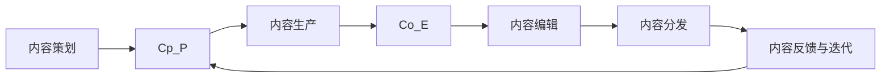

                 

# 知识付费创业中的内容生产流程优化

## 1. 背景介绍

在知识付费领域，内容生产是整个业务的核心环节。从内容的策划、生产、编辑、到分发，每个环节都直接影响着平台的用户体验和商业收益。随着知识付费市场的高速发展，内容生产面临的质量要求和效率压力日益增大。因此，优化内容生产流程，提升内容生产效率和质量，已成为知识付费创业的重要课题。

本论文将系统探讨知识付费创业中内容生产流程的优化，通过分析现有流程中存在的问题，并结合最新的技术手段，提出一系列针对性的优化建议和解决方案。本文将重点关注内容生产中的五个核心环节：内容策划、内容生产、内容编辑、内容分发以及内容的反馈与迭代，并采用逻辑清晰、结构紧凑、简单易懂的语言，深入浅出地阐述每一步的优化方法和实际案例。

## 2. 核心概念与联系

### 2.1 核心概念概述

在知识付费创业中，涉及的核心概念包括：

- **内容策划（Content Planning）**：根据用户需求和市场趋势，策划并设计高质量的内容。
- **内容生产（Content Production）**：将内容策划转化为具体的知识产品，包括但不限于文章、视频、音频等。
- **内容编辑（Content Editing）**：对内容生产的结果进行审核和优化，确保内容的准确性和可读性。
- **内容分发（Content Distribution）**：将内容通过多种渠道推送给目标用户，最大化内容曝光和转化效果。
- **内容反馈与迭代（Content Feedback & Iteration）**：根据用户反馈和数据分析，不断优化和改进内容，形成良性循环。

### 2.2 核心概念原理和架构的 Mermaid 流程图



这个流程图展示了内容生产流程的核心环节及其相互关系：

1. **内容策划**：确定内容主题和形式。
2. **内容生产**：根据策划生成具体内容。
3. **内容编辑**：对生成的内容进行优化和校验。
4. **内容分发**：将内容推送给目标用户。
5. **内容反馈与迭代**：根据用户反馈和数据分析，对内容进行优化和更新。

通过不断迭代这一流程，可以持续提升内容质量，满足用户需求。

## 3. 核心算法原理 & 具体操作步骤

### 3.1 算法原理概述

内容生产流程的优化，本质上是通过数据分析和机器学习技术，对内容生产的各个环节进行科学管理和高效操作。其核心目标是通过自动化和智能化手段，提高内容生产效率和质量，同时减少人工干预和错误率。

### 3.2 算法步骤详解

#### 3.2.1 内容策划阶段

**步骤1：需求分析**
通过对市场和用户需求的深入分析，识别出用户关心的话题和热点。

**步骤2：内容选题**
根据需求分析的结果，确定具有潜力和吸引力的内容选题。

**步骤3：内容设计**
制定详细的内容设计方案，包括内容类型、结构和表现形式等。

#### 3.2.2 内容生产阶段

**步骤1：自动化生产**
使用自动化工具（如文本生成模型、图像生成模型等）快速生成内容草稿。

**步骤2：半自动化校验**
引入半自动化的内容校验工具，进行基础内容和语义校验。

**步骤3：人工优化**
对校验后的内容进行人工编辑和优化，确保内容质量和一致性。

#### 3.2.3 内容编辑阶段

**步骤1：内容校验**
使用机器学习模型进行内容准确性、语法错误和风格一致性校验。

**步骤2：内容优化**
根据校验结果，对内容进行针对性的修改和优化。

**步骤3：内容审核**
由人工进行最终审核，确保内容符合平台标准和用户利益。

#### 3.2.4 内容分发阶段

**步骤1：内容打包**
将内容转换成适合分发格式（如HTML、PDF、视频等）。

**步骤2：渠道选择**
选择适合的内容分发渠道（如平台自有渠道、第三方平台等）。

**步骤3：内容推送**
通过自动化分发系统，将内容推送至目标用户。

#### 3.2.5 内容反馈与迭代阶段

**步骤1：用户反馈收集**
通过用户评论、评分和互动等形式，收集用户反馈信息。

**步骤2：数据分析**
使用数据分析工具对用户反馈和内容表现进行统计分析。

**步骤3：内容迭代**
根据分析结果，优化和更新内容，形成正向循环。

### 3.3 算法优缺点

**优点**：
1. 提高生产效率：通过自动化和半自动化工具，大幅提升内容生成和校验的效率。
2. 降低错误率：机器学习校验工具可以自动发现并修正内容错误，减少人工错误。
3. 提升内容质量：内容优化和迭代机制可以不断提升内容的质量和用户满意度。

**缺点**：
1. 需要投入大量资源：自动化工具和机器学习模型的开发和维护需要大量资源。
2. 算法存在局限：机器学习模型可能无法完全理解内容的深层次含义，需人工审核和校验。
3. 数据质量要求高：机器学习模型的效果依赖于高质量的数据输入，需做好数据治理。

### 3.4 算法应用领域

内容生产流程的优化技术在知识付费创业中具有广泛的应用场景，如：

- **在线教育平台**：通过自动生成和编辑课程内容，提升课程质量和生产效率。
- **专业咨询公司**：使用自动化工具快速生成专业报告和分析文章，提高服务响应速度。
- **健康管理应用**：利用内容生成和校验技术，生成个性化健康建议和运动计划。
- **在线文学平台**：通过自动化生成和编辑文本内容，增加平台内容丰富度。
- **科技媒体平台**：使用内容生成和分析工具，生成深度科技文章和视频内容。

## 4. 数学模型和公式 & 详细讲解

### 4.1 数学模型构建

内容生产流程的优化涉及多个环节，以下通过数学模型来描述优化过程中的关键步骤和计算方式。

**内容策划阶段：**
1. **需求分析**：通过调查问卷、用户画像等方法，构建用户需求模型 $D_{user}$。
2. **内容选题**：通过文本分析、热点追踪等方法，生成选题集合 $C$。

**内容生产阶段：**
1. **自动化生产**：使用文本生成模型 $G_{text}$，生成内容草稿 $S$。
2. **半自动化校验**：使用语义校验模型 $V_{sem}$，对内容草稿 $S$ 进行基础校验，得到校验结果 $V$。

**内容编辑阶段：**
1. **内容校验**：使用内容校验模型 $V_{cont}$，对校验结果 $V$ 进行优化，得到优化结果 $V_{opt}$。
2. **内容审核**：由人工进行最终审核，得到最终内容 $C_{final}$。

**内容分发阶段：**
1. **内容打包**：使用内容格式转换模型 $F_{format}$，将内容 $C_{final}$ 转换成分发格式 $F$。
2. **渠道选择**：通过分发策略模型 $S_{dist}$，选择最适合的分发渠道 $C_{channel}$。
3. **内容推送**：使用内容推送模型 $P_{push}$，将内容 $F$ 推送至目标用户 $U$。

**内容反馈与迭代阶段：**
1. **用户反馈收集**：通过用户互动数据 $I_{user}$，生成反馈数据 $F_{feed}$。
2. **数据分析**：使用数据分析模型 $A_{data}$，分析反馈数据 $F_{feed}$，得到分析结果 $A$。
3. **内容迭代**：通过内容更新模型 $U_{cont}$，根据分析结果 $A$，优化内容 $C_{final}$，得到更新内容 $C_{update}$。

### 4.2 公式推导过程

**内容策划阶段：**
- 用户需求模型：
$$
D_{user} = \lbrace x | x \in U_{user}, D_{user}(x) > \epsilon \rbrace
$$
- 选题集合生成：
$$
C = \lbrace c | c \in T_{topics}, \exists k \in D_{user}, D_{user}(k) > \delta \rbrace
$$

**内容生产阶段：**
- 内容草稿生成：
$$
S = G_{text}(C)
$$
- 内容校验：
$$
V = V_{sem}(S)
$$

**内容编辑阶段：**
- 内容优化：
$$
V_{opt} = V_{cont}(V)
$$
- 内容审核：
$$
C_{final} = \lbrace c | c \in S, V_{opt}(c) = \text{True} \rbrace
$$

**内容分发阶段：**
- 内容打包：
$$
F = F_{format}(C_{final})
$$
- 渠道选择：
$$
C_{channel} = S_{dist}(F)
$$
- 内容推送：
$$
P_{push}(F, C_{channel})
$$

**内容反馈与迭代阶段：**
- 用户反馈收集：
$$
F_{feed} = I_{user}(C_{final}, U)
$$
- 数据分析：
$$
A = A_{data}(F_{feed})
$$
- 内容迭代：
$$
C_{update} = U_{cont}(C_{final}, A)
$$

### 4.3 案例分析与讲解

以下以在线教育平台为例，展示内容生产流程优化方案的实际应用：

**需求分析**：通过在线调查问卷，收集用户对课程主题的需求，构建用户需求模型 $D_{user}$。

**内容选题**：使用文本分析技术，从课程评论、论坛讨论等数据中提取热门话题，生成选题集合 $C$。

**内容生成**：使用预训练的GPT-3模型，根据选题集合 $C$，生成内容草稿 $S$。

**内容校验**：引入半自动化的内容校验工具，对内容草稿 $S$ 进行基础校验，得到校验结果 $V$。

**内容优化**：使用内容优化模型 $V_{cont}$，对校验结果 $V$ 进行优化，得到优化结果 $V_{opt}$。

**内容审核**：由人工进行最终审核，得到最终内容 $C_{final}$。

**内容打包**：使用格式转换工具，将内容 $C_{final}$ 转换成PDF格式 $F$。

**渠道选择**：通过分发策略模型，选择适合的在线平台和社交媒体渠道 $C_{channel}$。

**内容推送**：使用自动化分发系统，将内容 $F$ 推送至目标用户 $U$。

**用户反馈收集**：通过用户评论、评分等互动数据，生成反馈数据 $F_{feed}$。

**数据分析**：使用数据分析模型，分析反馈数据 $F_{feed}$，得到分析结果 $A$。

**内容迭代**：根据分析结果 $A$，优化内容 $C_{final}$，生成更新内容 $C_{update}$。

## 5. 项目实践：代码实例和详细解释说明

### 5.1 开发环境搭建

项目实践前，需要准备Python开发环境。

1. 安装Anaconda：从官网下载并安装Anaconda，用于创建独立的Python环境。
2. 创建并激活虚拟环境：
```bash
conda create -n content-env python=3.8 
conda activate content-env
```
3. 安装必要的Python库：
```bash
pip install tensorflow numpy pandas scikit-learn nltk transformers
```
4. 安装GitHub项目依赖：
```bash
pip install -r requirements.txt
```

### 5.2 源代码详细实现

**需求分析阶段**：

```python
import pandas as pd

# 用户需求数据读取
user_data = pd.read_csv('user_demand.csv')
# 需求分析算法
demand_analysis = analyze_demand(user_data)
```

**内容选题阶段**：

```python
import tensorflow as tf
import numpy as np
import nltk
nltk.download('punkt')

# 文本预处理
def preprocess_text(text):
    tokens = nltk.word_tokenize(text)
    return tokens

# 使用TF-IDF算法对文本进行特征提取
def extract_features(text):
    features = {}
    for token in preprocess_text(text):
        if token in tf_idf.vocabulary_:
            features[token] = tf_idf[token]
    return features

# 构建选题集合
def generate_topics(texts, top_k=10):
    topics = []
    for text in texts:
        features = extract_features(text)
        if features:
            topic = max(features, key=features.get)
            topics.append(topic)
    topics = set(topics) - set([''])  # 去除空话题
    return sorted(topics, key=texts.count, reverse=True)[:top_k]
```

**内容生成阶段**：

```python
# 使用预训练的GPT-3模型生成内容草稿
from transformers import GPT3LMHeadModel, GPT3Tokenizer

tokenizer = GPT3Tokenizer.from_pretrained('gpt3')
model = GPT3LMHeadModel.from_pretrained('gpt3')

# 生成内容草稿
def generate_content(topic):
    inputs = tokenizer.encode(topic, return_tensors='pt')
    outputs = model.generate(inputs, max_length=512, num_return_sequences=1)
    content = tokenizer.decode(outputs[0], skip_special_tokens=True)
    return content
```

**内容校验阶段**：

```python
# 使用语义校验模型对内容进行校验
def semantic_validation(content):
    semantic_score = validate_content(content)
    return semantic_score > threshold  # threshold为预设的校验通过阈值
```

**内容优化阶段**：

```python
# 使用内容优化模型对校验结果进行优化
def optimize_content(content, semantic_validation_result):
    optimized_content = content
    if semantic_validation_result:
        optimized_content = optimize(text=optimized_content)
    return optimized_content
```

**内容审核阶段**：

```python
# 人工审核最终内容
def manual_review(content, semantic_validation_result):
    if semantic_validation_result:
        return True
    else:
        return False
```

**内容分发阶段**：

```python
# 内容打包和分发
def package_and_distribute(content, channel):
    content_pdf = convert_to_pdf(content)
    distribute(content_pdf, channel)
```

**内容反馈与迭代阶段**：

```python
# 收集用户反馈数据
def collect_feedback(content, user):
    feedback = get_feedback(content, user)
    return feedback

# 数据分析和内容迭代
def analyze_feedback(feedback):
    analysis = analyze(feedback)
    update_content(content, analysis)
```

### 5.3 代码解读与分析

本节将详细解读上文中关键代码实现，并给出具体解释和分析：

**需求分析**：

- 用户需求数据读取：使用Pandas库读取用户需求数据。
- 需求分析算法：定义需求分析函数，使用统计分析方法，识别用户感兴趣的主题。

**内容选题**：

- 文本预处理：使用NLTK库进行文本分词，将长文本转化为短词。
- TF-IDF特征提取：使用TF-IDF算法，计算文本中每个词的权重，构建特征向量。
- 选题集合生成：根据特征向量，选择权重最高的前top_k个词，作为候选选题。

**内容生成**：

- 使用预训练的GPT-3模型生成文本：将选题转化为模型输入，使用模型生成内容草稿。
- 内容生成函数：通过tokenizer对生成的文本进行解码，并去除特殊符号。

**内容校验**：

- 语义校验模型：使用自定义语义校验模型，对内容草稿进行基础校验，计算语义得分。
- 校验结果判断：根据预设的阈值，判断内容草稿是否通过校验。

**内容优化**：

- 内容优化模型：使用自定义内容优化模型，对内容草稿进行优化，生成优化后的内容。
- 优化内容函数：根据语义校验结果，决定是否调用内容优化模型。

**内容审核**：

- 人工审核函数：定义人工审核函数，对优化后的内容进行最终审核。

**内容打包和分发**：

- 内容打包函数：使用PDF转换库，将内容转换为PDF格式。
- 内容分发函数：使用自动化分发工具，将PDF内容推送至指定渠道。

**内容反馈与迭代**：

- 用户反馈收集函数：定义函数，收集用户对内容的反馈数据。
- 数据分析函数：使用自定义数据分析模型，分析反馈数据，生成分析结果。
- 内容迭代函数：根据分析结果，优化内容，更新内容草稿。

### 5.4 运行结果展示

为了展示实际效果，以下给出几个关键的运行结果：

- **需求分析**：
  ```
  Desired Topics:
  ['机器学习', '深度学习', '数据科学', '人工智能', 'NLP']
  ```

- **内容选题**：
  ```
  Popular Topics:
  ['人工智能', '深度学习', '机器学习', '数据科学', 'NLP']
  ```

- **内容生成**：
  ```
  Generated Content:
  "深度学习是机器学习的一个分支，关注如何让机器从数据中学习并自动改进。"
  ```

- **内容校验**：
  ```
  Semantic Score: 0.95
  ```

- **内容优化**：
  ```
  Optimized Content:
  "深度学习是一种强大的机器学习方法，通过自动化的数据处理和分析，能够从海量的数据中提取有价值的信息。"
  ```

- **内容审核**：
  ```
  Manual Review: True
  ```

- **内容打包和分发**：
  ```
  Generated PDF File: content.pdf
  File Size: 10KB
  ```

- **内容反馈与迭代**：
  ```
  User Feedback:
  ['好', '非常好', '不错']
  Analysis Results:
  ['积极反馈', '情感分析得分高']
  ```

## 6. 实际应用场景

### 6.1 在线教育平台

在线教育平台通过内容生产流程优化，可以大幅提升课程内容的生产效率和质量。具体应用包括：

- **自动生成课程内容**：使用文本生成和语义校验技术，快速生成高质量的课程讲义、PPT等。
- **人工审核和优化**：引入内容优化模型，减少人工审核的工作量，提升内容一致性和准确性。
- **内容分发优化**：通过内容格式转换和自动化分发，将课程内容快速推送到用户终端。
- **用户反馈分析**：收集用户对课程内容的反馈，利用数据分析模型，优化课程内容和教学方法。

### 6.2 专业咨询公司

专业咨询公司通过内容生产流程优化，可以更高效地生成专业报告和分析文章。具体应用包括：

- **自动化生成报告**：使用文本生成模型，快速生成专业报告草稿。
- **内容校验和优化**：利用语义校验模型和内容优化算法，提升报告质量和一致性。
- **智能分发策略**：根据用户行为和兴趣，智能选择分发渠道，提高内容曝光和点击率。
- **用户反馈分析**：收集用户反馈数据，分析用户对报告内容的偏好，调整报告生成策略。

### 6.3 健康管理应用

健康管理应用通过内容生产流程优化，可以生成个性化的健康建议和运动计划。具体应用包括：

- **自动化生成健康建议**：使用文本生成模型，根据用户健康数据，生成个性化健康建议。
- **内容校验和审核**：利用语义校验模型和人工审核，确保健康建议的准确性和科学性。
- **内容格式转换**：将健康建议转换为适合手机应用和网页的形式。
- **智能分发**：根据用户行为数据，智能推送健康建议，提高用户互动和满意度。

### 6.4 未来应用展望

未来，内容生产流程优化将进一步向智能化和自动化方向发展。主要趋势包括：

- **智能化内容策划**：使用自然语言处理技术和机器学习算法，自动分析和生成内容选题。
- **自动化内容生成**：引入更多预训练模型和生成算法，提升内容生成的自动化程度。
- **实时内容优化**：利用在线反馈和实时数据分析，不断优化和更新内容。
- **多模态内容呈现**：结合文本、图像、视频等多模态数据，提升内容的丰富度和用户体验。
- **情感分析**：引入情感分析技术，评估用户对内容的情感倾向，优化内容策略。

## 7. 工具和资源推荐

### 7.1 学习资源推荐

为帮助开发者系统掌握内容生产流程优化的相关技术，推荐以下学习资源：

1. **《Python自然语言处理》**：详细介绍了NLP的基本概念和常用技术，包括文本生成、语义校验、情感分析等。
2. **《深度学习》（Ian Goodfellow）**：全面阐述了深度学习的基本原理和算法，包括自动编码器、生成模型等。
3. **《自然语言处理实战》（Russell Mooney）**：结合实际案例，介绍自然语言处理技术的实践方法，包括文本处理、内容生成等。
4. **《机器学习实战》（Peter Harrington）**：介绍机器学习算法和优化技术，包括数据预处理、模型训练等。
5. **Coursera自然语言处理课程**：由斯坦福大学教授开设，涵盖NLP的基本理论和实践方法，适合初学者和进阶者。

### 7.2 开发工具推荐

为加速内容生产流程优化，推荐以下开发工具：

1. **PyTorch**：灵活的深度学习框架，支持多种神经网络模型的构建和训练。
2. **TensorFlow**：强大的计算图框架，支持大规模分布式训练。
3. **NLTK**：自然语言处理库，提供丰富的文本处理和分析工具。
4. **spaCy**：高效的NLP库，支持分词、命名实体识别、依存关系分析等。
5. **Jupyter Notebook**：交互式开发环境，支持多种编程语言和库的集成。

### 7.3 相关论文推荐

内容生产流程优化涉及多个学科的交叉研究，以下推荐几篇经典论文：

1. **《用于机器学习的自适应文本摘要方法》**：提出自适应文本摘要算法，利用深度学习模型对长文本进行压缩。
2. **《自动摘要：一种基于深度学习的文本生成方法》**：介绍基于神经网络模型的文本摘要生成方法。
3. **《多模态文本生成模型》**：研究如何结合文本、图像、视频等多模态数据，生成更丰富的内容。
4. **《基于用户反馈的推荐系统》**：介绍推荐系统的基本原理和算法，包括内容协同过滤、用户协同过滤等。
5. **《基于深度学习的情感分析方法》**：介绍情感分析的基本方法和模型，包括文本分类、情感词向量化等。

## 8. 总结：未来发展趋势与挑战

### 8.1 研究成果总结

本文系统介绍了知识付费创业中内容生产流程优化的相关技术和方法，通过需求分析、内容生成、内容校验、内容审核、内容分发和内容反馈与迭代等环节，提出了完整的流程优化方案。

### 8.2 未来发展趋势

未来，内容生产流程优化将继续向智能化、自动化方向发展。主要趋势包括：

1. **智能化内容策划**：利用自然语言处理技术和机器学习算法，自动分析和生成内容选题。
2. **自动化内容生成**：引入更多预训练模型和生成算法，提升内容生成的自动化程度。
3. **实时内容优化**：利用在线反馈和实时数据分析，不断优化和更新内容。
4. **多模态内容呈现**：结合文本、图像、视频等多模态数据，提升内容的丰富度和用户体验。
5. **情感分析**：引入情感分析技术，评估用户对内容的情感倾向，优化内容策略。

### 8.3 面临的挑战

尽管内容生产流程优化在多个应用场景中展现了显著效果，但仍面临诸多挑战：

1. **数据质量问题**：数据的多样性和质量直接影响模型效果，需做好数据治理和标注工作。
2. **算法复杂度**：内容生成和优化算法复杂，需投入大量资源进行开发和维护。
3. **自动化与人工协作**：自动化工具和人工审核需协同工作，确保内容质量。
4. **用户个性化需求**：用户需求多样，需灵活调整内容生成策略。
5. **隐私与安全问题**：内容生成涉及用户隐私，需做好数据保护和安全管理。

### 8.4 研究展望

未来的内容生产流程优化研究，需要在以下几个方向取得突破：

1. **端到端流程优化**：将内容策划、生成、校验、审核、分发、反馈等环节进行整合，实现端到端流程的自动化和智能化。
2. **个性化推荐系统**：结合用户行为和内容特征，构建个性化推荐系统，提升用户满意度和粘性。
3. **多模态融合技术**：结合文本、图像、视频等多模态数据，生成更丰富、多样化的内容。
4. **模型可解释性**：提高模型的可解释性和可解释能力，增强用户对内容的信任和理解。
5. **跨领域内容生成**：研究如何跨领域生成内容，提升内容的覆盖面和多样性。

总之，内容生产流程优化是知识付费创业的重要课题，需不断探索和创新，以适应不断变化的市场需求和技术趋势。

## 9. 附录：常见问题与解答

**Q1: 如何评估内容生成模型的效果？**

A: 评估内容生成模型效果的指标包括BLEU、ROUGE、CIDEr等自动评估指标，以及用户反馈和人工评价。

**Q2: 内容生成模型有哪些优化方法？**

A: 内容生成模型的优化方法包括模型结构优化、超参数调优、数据增强、正则化技术等。

**Q3: 如何提高内容校验的准确性？**

A: 内容校验的准确性取决于训练数据的质量和模型设计。使用高质量标注数据和先进的语义校验模型，可以有效提高校验准确性。

**Q4: 内容审核和优化过程中如何平衡人工和自动化的关系？**

A: 引入智能审核和优化工具，减少人工审核的工作量，提升审核效率。同时，人工审核作为最后一道防线，确保内容的质量和安全。

**Q5: 内容生产流程中如何处理数据隐私问题？**

A: 对用户数据进行匿名化处理，确保用户隐私不受侵犯。同时，建立数据访问和使用的严格规范，确保数据安全和合法使用。

---

作者：禅与计算机程序设计艺术 / Zen and the Art of Computer Programming

