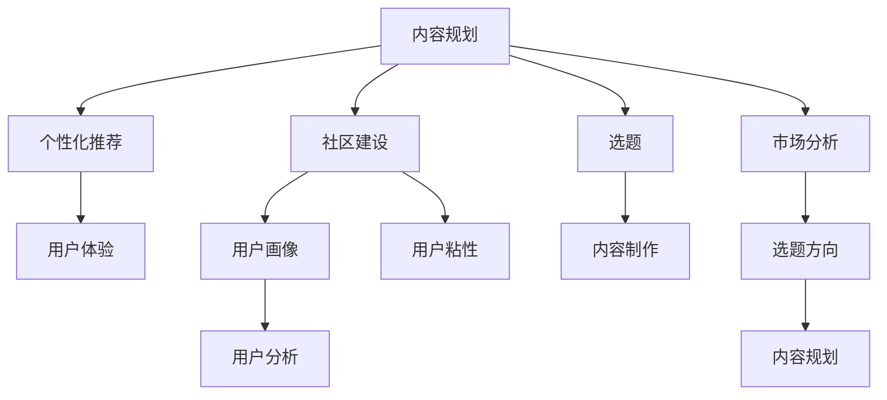

                 

# 知识付费创业中的内容规划策略

## 1. 背景介绍

随着互联网的普及和人们生活节奏的加快，知识付费作为一种新兴的商业模式迅速崛起。根据中国版权协会的报告，2021年中国知识付费市场规模已超过300亿元，用户数量接近5亿，其中泛知识付费市场规模达259亿元，用户数量达3.7亿。知识付费的兴起不仅改变了人们的获取知识的方式，还为创业者开辟了广阔的市场机会。

然而，知识付费行业的发展并非一帆风顺。根据艾瑞咨询的数据，2021年中国知识付费市场的增长率已经从2019年的67.9%下降到23.3%。用户流失率也持续上升，从2020年的38.4%上升至2021年的43.1%。这表明，单纯的知识付费模式已经难以满足用户的需求，未来的成功关键在于内容的深度、广度、精度和趣味性。

在这种背景下，如何制定合理的知识付费内容规划策略，成为每一个知识付费创业者的核心任务。本文将从内容规划的角度，探讨知识付费创业中的关键问题，提出实用的策略，帮助创业者在激烈的市场竞争中脱颖而出。

## 2. 核心概念与联系

### 2.1 核心概念概述

为更好地理解知识付费创业中的内容规划策略，本节将介绍几个核心概念：

- **知识付费**：指用户为获取专业知识和经验而支付费用的模式，包括在线课程、电子书、音频播客等多种形式。
- **内容规划**：指对知识付费产品的内容进行系统性规划，包括选题、内容制作、推广等环节，旨在提升产品价值和用户满意度。
- **个性化推荐**：指通过数据分析和算法模型，将合适的内容推荐给用户，提升用户体验和粘性。
- **社区建设**：指在知识付费产品中构建用户社区，促进用户交流、分享和互动，增加用户粘性和忠诚度。
- **用户画像**：指对目标用户的基本特征、兴趣偏好、行为习惯等进行详细的分析和画像，为内容定制提供依据。

这些核心概念之间存在紧密的联系。内容规划是知识付费产品的核心，个性化推荐和社区建设是提升用户体验的重要手段，而用户画像则是对这些手段的底层支撑。通过合理规划内容，结合个性推荐和社区建设，并深刻理解用户画像，可以构建一个具备强大吸引力和粘性的知识付费产品。

### 2.2 核心概念原理和架构的 Mermaid 流程图



这个流程图展示了核心概念之间的逻辑关系：

1. **内容规划**：从市场分析出发，确定选题方向，规划具体内容。
2. **选题**：基于市场分析，确定内容的主题和类型。
3. **内容制作**：根据选题，进行内容创作和制作。
4. **个性化推荐**：利用用户画像和算法模型，将内容推荐给用户，提升用户体验。
5. **社区建设**：通过用户互动和社区活动，增加用户粘性。
6. **用户画像**：基于用户行为数据，分析用户特征和兴趣。
7. **用户分析**：根据用户画像和行为数据，优化内容和推荐策略。
8. **市场分析**：从市场角度分析用户需求，调整内容策略。

## 3. 核心算法原理 & 具体操作步骤

### 3.1 算法原理概述

知识付费创业中的内容规划策略，本质上是一个多目标优化问题。目标包括提升内容质量和用户体验、增加用户粘性和忠诚度、实现商业模式的可持续性。通过科学的算法原理和具体操作步骤，可以实现这些目标的平衡和优化。

## 3.2 算法步骤详解

**Step 1: 市场分析与用户画像**

- **市场分析**：通过调研、数据分析等方式，了解目标市场的需求和竞争态势。关注热门话题、行业趋势、用户反馈等，为选题方向提供依据。
- **用户画像**：收集用户行为数据，包括阅读习惯、购买行为、兴趣偏好等，建立详细的用户画像。可以通过问卷调查、数据分析工具等方式获取这些数据。

**Step 2: 选题与内容制作**

- **选题**：根据市场分析和用户画像，确定具有潜力的选题方向。选题应具备时效性、专业性、趣味性和创新性。
- **内容制作**：制作高质量的内容，包括文本、音频、视频等多种形式。内容应具备深度、广度和趣味性，能够满足用户的需求。

**Step 3: 个性化推荐与社区建设**

- **个性化推荐**：利用推荐算法，根据用户画像和行为数据，将合适的内容推荐给用户。推荐算法可以基于协同过滤、内容推荐、混合推荐等技术。
- **社区建设**：构建用户社区，促进用户互动、交流和分享。社区可以提供论坛、讨论区、用户评论等功能，增加用户粘性。

**Step 4: 用户分析与内容优化**

- **用户分析**：根据用户行为数据和社区反馈，分析用户特征和兴趣变化，优化内容和推荐策略。
- **内容优化**：根据用户分析结果，调整内容和推荐策略，提升用户体验和满意度。

**Step 5: 持续迭代与市场验证**

- **持续迭代**：不断优化内容和推荐策略，保持内容的新鲜和多样性。
- **市场验证**：通过市场反馈和用户反馈，验证内容规划策略的有效性，进行必要的调整和改进。

## 3.3 算法优缺点

知识付费创业中的内容规划策略具有以下优点：

1. **提升用户体验**：通过个性化推荐和社区建设，提高用户满意度和粘性。
2. **增加用户粘性**：社区建设可以增强用户互动，提升用户忠诚度。
3. **实现商业可持续**：内容质量提升和用户粘性增加，有助于提高用户订阅率和复购率。

同时，该策略也存在一些局限性：

1. **内容制作成本高**：高质量内容的创作需要时间和资源投入。
2. **算法复杂度高**：推荐算法需要复杂的数据处理和模型训练。
3. **用户需求多样性**：不同用户有不同的需求和兴趣，难以满足所有用户的需求。
4. **市场变化快**：市场趋势和用户需求变化迅速，需要持续的调整和优化。

尽管存在这些局限性，但通过合理规划和科学运营，知识付费创业中的内容规划策略仍然具备强大的市场竞争力。

## 3.4 算法应用领域

知识付费创业中的内容规划策略，适用于多种知识付费产品的开发和运营，包括但不限于：

- **在线课程**：根据用户需求和市场趋势，规划课程内容，并进行个性化推荐。
- **电子书**：通过内容推荐和社区建设，提升用户阅读体验和粘性。
- **音频播客**：结合用户画像和行为数据，优化推荐策略，增加用户订阅率。
- **知识图谱**：构建用户兴趣图谱，推荐相关知识和内容，提升用户价值。
- **问答社区**：通过社区建设，促进用户互动和内容生成，增加用户粘性。

## 4. 数学模型和公式 & 详细讲解

### 4.1 数学模型构建

知识付费创业中的内容规划策略，可以抽象为一个多目标优化问题。假设目标函数为 $f(x) = (u_1(x) + u_2(x) + \ldots + u_n(x))$，其中 $u_i(x)$ 表示第 $i$ 个目标函数，$x$ 表示内容规划的策略参数。

## 4.2 公式推导过程

以下是一个简单的推荐算法公式推导过程：

$$
f(x) = \min \left( \sum_{i=1}^{n} w_i \cdot u_i(x) \right)
$$

其中，$w_i$ 表示第 $i$ 个目标的权重。

### 4.3 案例分析与讲解

以在线课程内容规划为例，可以通过以下步骤进行：

1. 市场分析：通过调研和数据分析，了解当前市场的热门话题和用户需求。
2. 用户画像：收集用户行为数据，建立用户画像。
3. 选题：根据市场分析和用户画像，确定课程主题。
4. 内容制作：制作高质量的课程内容。
5. 个性化推荐：利用推荐算法，将课程推荐给用户。
6. 社区建设：构建用户社区，促进用户互动和反馈。
7. 用户分析：根据用户反馈和行为数据，优化课程内容和推荐策略。

## 5. 项目实践：代码实例和详细解释说明

### 5.1 开发环境搭建

在进行知识付费内容规划策略的实践前，我们需要准备好开发环境。以下是使用Python进行Flask开发的环境配置流程：

1. 安装Anaconda：从官网下载并安装Anaconda，用于创建独立的Python环境。
2. 创建并激活虚拟环境：
```bash
conda create -n flask-env python=3.8 
conda activate flask-env
```

3. 安装Flask：使用pip安装Flask框架。
```bash
pip install flask
```

4. 安装SQLite数据库：用于存储用户数据和课程信息。
```bash
pip install pysqlite3
```

5. 安装用户行为分析工具：用于收集和分析用户行为数据。
```bash
pip install flask-sqlalchemy
```

完成上述步骤后，即可在`flask-env`环境中开始内容规划策略的开发实践。

### 5.2 源代码详细实现

以下是一个简单的Flask应用示例，展示了知识付费内容规划的基本流程：

```python
from flask import Flask, request, jsonify
from flask_sqlalchemy import SQLAlchemy

app = Flask(__name__)
app.config['SQLALCHEMY_DATABASE_URI'] = 'sqlite:///users.db'
db = SQLAlchemy(app)

class User(db.Model):
    id = db.Column(db.Integer, primary_key=True)
    username = db.Column(db.String(80), unique=True, nullable=False)
    email = db.Column(db.String(120), unique=True, nullable=False)

class Course(db.Model):
    id = db.Column(db.Integer, primary_key=True)
    title = db.Column(db.String(120), nullable=False)
    description = db.Column(db.Text, nullable=False)
    tags = db.Column(db.String(120), nullable=False)

@app.route('/users', methods=['POST'])
def add_user():
    username = request.json['username']
    email = request.json['email']
    new_user = User(username=username, email=email)
    db.session.add(new_user)
    db.session.commit()
    return jsonify({'id': new_user.id}), 201

@app.route('/courses', methods=['POST'])
def add_course():
    title = request.json['title']
    description = request.json['description']
    tags = request.json['tags']
    new_course = Course(title=title, description=description, tags=tags)
    db.session.add(new_course)
    db.session.commit()
    return jsonify({'id': new_course.id}), 201

@app.route('/recommendations', methods=['GET'])
def get_recommendations():
    user_id = request.args.get('user_id')
    user = User.query.get(user_id)
    courses = Course.query.filter_by(tags=user.tags).all()
    return jsonify([{'id': course.id, 'title': course.title, 'description': course.description}])

if __name__ == '__main__':
    app.run(debug=True)
```

### 5.3 代码解读与分析

让我们再详细解读一下关键代码的实现细节：

**Flask应用**：
- `Flask`类：创建Flask应用实例。
- `SQLAlchemy`类：用于数据库操作。
- `User`类和`Course`类：定义用户和课程的数据模型。
- `add_user`函数：添加新用户。
- `add_course`函数：添加新课程。
- `get_recommendations`函数：根据用户标签，推荐相关课程。

**代码实现细节**：
- 用户数据和课程数据分别存储在`User`和`Course`表中，并通过`SQLAlchemy`类进行数据库操作。
- `add_user`和`add_course`函数接收JSON格式的请求参数，进行用户和课程的添加操作。
- `get_recommendations`函数根据用户标签，从数据库中查询相关课程，返回课程ID、标题和描述。

### 5.4 运行结果展示

启动应用后，可以通过以下步骤进行测试：

1. 启动应用：
```bash
python app.py
```

2. 添加新用户：
```bash
POST /users {"username": "Alice", "email": "alice@example.com"}
```

3. 添加新课程：
```bash
POST /courses {"title": "Python编程基础", "description": "本课程将介绍Python基础语法和编程技巧", "tags": ["Python", "编程"]}
```

4. 获取课程推荐：
```bash
GET /recommendations?user_id=1
```

以上是使用Flask进行知识付费内容规划策略的完整代码实现。可以看到，通过Flask框架和SQLite数据库，可以快速搭建一个知识付费应用的基本功能。

## 6. 实际应用场景

### 6.1 在线教育平台

在线教育平台通过知识付费内容规划策略，可以提供高质量的课程内容和个性化推荐，吸引用户订阅。例如，Coursera和edX等在线教育平台，通过内容规划和推荐算法，提升了用户满意度和课程订阅率。

### 6.2 企业培训

企业培训领域，通过知识付费内容规划策略，可以定制化培训课程，满足不同岗位和层级的需求。例如，阿里巴巴和华为等大型企业，通过内部知识付费平台，实现了大规模的员工培训和知识传播。

### 6.3 专业认证

专业认证领域，通过知识付费内容规划策略，可以提供权威和专业的认证课程，提升用户的专业能力和职业素养。例如，PMP和CFA等认证机构，通过内容规划和推荐算法，提高了认证课程的通过率和用户满意度。

### 6.4 未来应用展望

未来，知识付费内容规划策略将在更多领域得到应用，为传统行业带来变革性影响。

在智慧教育领域，通过内容规划和推荐算法，可以构建更加灵活和个性化的在线教育系统，满足不同用户的学习需求。在智慧医疗领域，通过内容规划和推荐算法，可以为医生提供专业化的继续教育和培训。在智慧金融领域，通过内容规划和推荐算法，可以提供定制化的金融知识和技能培训。

总之，知识付费内容规划策略的广泛应用，将推动教育、医疗、金融等行业的数字化转型，提升社会整体的智能水平。

## 7. 工具和资源推荐

### 7.1 学习资源推荐

为了帮助开发者系统掌握知识付费内容规划的理论基础和实践技巧，这里推荐一些优质的学习资源：

1. **《知识付费实战指南》**：介绍知识付费商业模式和内容规划策略的书籍，包含实际案例和实用技巧。
2. **《深度学习基础》**：介绍深度学习在知识付费中的应用的书籍，涵盖推荐算法、用户画像等内容。
3. **Coursera和edX课程**：提供知识付费相关的课程和实践项目，涵盖市场分析、内容规划、推荐算法等。
4. **Kaggle竞赛**：通过参加知识付费相关的Kaggle竞赛，提升数据分析和算法模型能力。
5. **Flask官方文档**：提供Flask框架的详细文档和教程，快速上手知识付费应用的开发。

通过对这些资源的学习实践，相信你一定能够快速掌握知识付费内容规划的精髓，并用于解决实际的商业问题。

### 7.2 开发工具推荐

高效的开发离不开优秀的工具支持。以下是几款用于知识付费内容规划开发的常用工具：

1. **Flask**：基于Python的开源Web框架，灵活易用，适合快速迭代研究。
2. **SQLite**：轻量级关系型数据库，快速安装部署，适合小型应用。
3. **SQLAlchemy**：Python的ORM框架，提供便捷的数据库操作。
4. **Jupyter Notebook**：交互式编程环境，支持Python、R、SQL等多种语言。
5. **TensorBoard**：可视化工具，实时监测模型训练状态，提供丰富的图表。
6. **Weights & Biases**：模型训练的实验跟踪工具，记录和可视化模型训练过程中的各项指标。

合理利用这些工具，可以显著提升知识付费内容规划的开发效率，加快创新迭代的步伐。

### 7.3 相关论文推荐

知识付费内容规划策略的发展源于学界的持续研究。以下是几篇奠基性的相关论文，推荐阅读：

1. **《知识付费市场现状与趋势研究》**：分析知识付费市场的发展现状和未来趋势，提出内容规划的策略和建议。
2. **《基于协同过滤的推荐算法研究》**：介绍协同过滤算法的原理和实现，提升个性化推荐的准确性。
3. **《用户画像构建与分析》**：介绍用户画像的构建方法和应用场景，提升内容规划的个性化和精准度。
4. **《智慧教育中的个性化推荐》**：介绍个性化推荐在智慧教育中的应用，提升用户体验和学习效果。
5. **《在线教育平台的内容规划策略》**：分析在线教育平台的内容规划策略，提升平台的用户满意度和订阅率。

这些论文代表了大语言模型微调技术的发展脉络。通过学习这些前沿成果，可以帮助研究者把握学科前进方向，激发更多的创新灵感。

## 8. 总结：未来发展趋势与挑战

### 8.1 总结

本文对知识付费创业中的内容规划策略进行了全面系统的介绍。首先阐述了知识付费的市场现状和用户需求，明确了内容规划在知识付费创业中的核心作用。其次，从内容规划的角度，详细讲解了知识付费创业中的关键问题，提出实用的策略，帮助创业者在激烈的市场竞争中脱颖而出。最后，本文还探讨了知识付费内容规划的实际应用场景，展望了未来的发展趋势和面临的挑战。

通过本文的系统梳理，可以看到，知识付费内容规划策略已经在大规模应用中取得了显著效果，为知识付费创业提供了有力的支持。未来，伴随技术的不断进步，内容规划策略将更加智能、灵活和个性化，为知识付费行业带来更多突破。

### 8.2 未来发展趋势

展望未来，知识付费内容规划策略将呈现以下几个发展趋势：

1. **AI技术的应用**：借助AI技术，实现更加智能化的内容推荐和个性化定制。
2. **用户反馈的融入**：通过用户反馈，实时调整内容规划策略，提升用户满意度。
3. **多模态数据的融合**：结合文本、图像、视频等多模态数据，提升内容的丰富性和多样性。
4. **社区文化的构建**：通过社区建设，营造活跃的社区文化和用户生态。
5. **内容价值的提升**：提升内容的专业性和实用性，满足用户的实际需求。

以上趋势凸显了知识付费内容规划技术的广阔前景。这些方向的探索发展，必将进一步提升知识付费产品的内容价值和用户体验，为知识付费行业带来更多的机会和挑战。

### 8.3 面临的挑战

尽管知识付费内容规划策略已经取得了显著成效，但在迈向更加智能化、普适化应用的过程中，它仍面临着诸多挑战：

1. **内容创作的瓶颈**：高质量内容创作需要高成本和长周期，难以满足用户对快速更新和多样性的需求。
2. **推荐算法的复杂性**：推荐算法需要复杂的数据处理和模型训练，容易出错且难以解释。
3. **用户需求的多样性**：不同用户有不同的需求和兴趣，难以满足所有用户的需求。
4. **市场竞争的激烈**：知识付费市场竞争激烈，用户选择多样化，需要不断创新和优化。

尽管存在这些挑战，但通过不断优化内容规划策略，提高内容创作效率和推荐算法精度，知识付费内容规划策略仍然具备强大的市场竞争力。

### 8.4 研究展望

未来的知识付费内容规划研究，需要在以下几个方面寻求新的突破：

1. **用户需求的深度理解**：通过大数据分析和机器学习技术，深入理解用户需求和行为，实现更加精准的内容规划。
2. **内容创作的智能化**：借助自然语言生成、图像识别等技术，实现自动化的内容创作和推荐，提升内容生产效率。
3. **用户参与的增强**：通过用户反馈和社区建设，增强用户参与度和满意度，提升用户忠诚度。
4. **跨领域的融合**：结合其他领域的知识和技术，提升内容的广度和深度，实现跨领域的融合创新。
5. **可持续发展**：通过知识付费模式和内容规划策略的创新，实现可持续发展，满足用户长期需求。

这些研究方向将引领知识付费内容规划技术的不断进步，为知识付费行业带来更多创新和机遇。

## 9. 附录：常见问题与解答

**Q1: 知识付费内容规划策略适用于所有类型的知识付费平台吗？**

A: 知识付费内容规划策略适用于多种类型的知识付费平台，包括在线教育、企业培训、专业认证等。不同平台的运营模式和用户需求有所不同，但都可以通过内容规划策略提升用户体验和粘性。

**Q2: 如何确定选题方向？**

A: 确定选题方向需要结合市场分析和用户画像，了解目标用户的基本特征和兴趣偏好。通过调研、数据分析等方式，获取热门话题和行业趋势，确定具有潜力的选题方向。

**Q3: 如何进行个性化推荐？**

A: 个性化推荐需要构建用户画像，利用推荐算法，根据用户画像和行为数据，将合适的内容推荐给用户。推荐算法可以基于协同过滤、内容推荐、混合推荐等技术。

**Q4: 如何构建用户社区？**

A: 通过构建论坛、讨论区、用户评论等功能，促进用户互动和分享，增加用户粘性。社区建设可以借助社交媒体、邮件列表等方式，提升用户参与度和活跃度。

**Q5: 如何优化内容和推荐策略？**

A: 根据用户行为数据和社区反馈，分析用户特征和兴趣变化，优化内容和推荐策略。通过A/B测试等方式，不断迭代和优化，提升用户体验和满意度。

**Q6: 如何应对市场变化？**

A: 持续关注市场趋势和用户需求，及时调整和优化内容规划策略。通过数据分析和用户反馈，了解市场变化，快速响应和调整。

通过这些问题的解答，相信你一定能够更好地理解和应用知识付费内容规划策略，为知识付费创业提供有力支持。

---

作者：禅与计算机程序设计艺术 / Zen and the Art of Computer Programming

