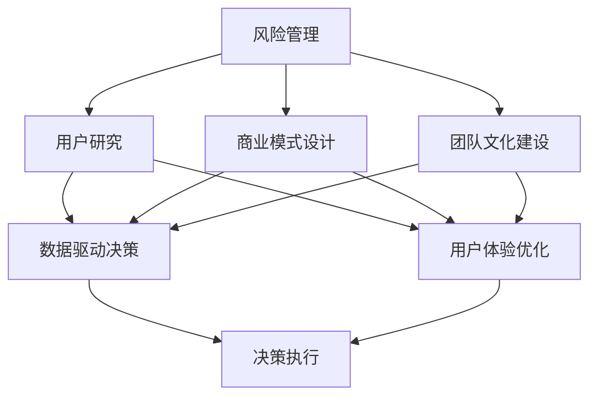

                 

# 知识付费创业中的心态调整

## 1. 背景介绍

### 1.1 问题由来
随着互联网的普及和信息技术的快速发展，知识付费已经成为了互联网行业的一个热门领域。越来越多的用户开始愿意为获取有价值的信息、知识、技能付费，这为知识付费创业提供了巨大的市场机遇。然而，知识付费创业并非易事，需要具备相应的行业认知、产品设计、运营能力以及商业模式的构建能力。在这个过程中，心态的调整至关重要，它将影响创业者的决策、执行以及团队士气，从而直接影响到项目的成功率。

### 1.2 问题核心关键点
心态调整的核心关键点主要包括以下几个方面：

1. **风险意识**：在创业过程中，如何正确评估风险、合理规避风险。
2. **用户需求理解**：深入了解目标用户需求，明确产品定位和价值主张。
3. **商业模式创新**：创新构建适应市场需求的商业模式，寻求可持续盈利模式。
4. **团队管理与协作**：有效管理团队，促进团队之间的协作和创新。
5. **数据驱动决策**：利用数据驱动产品迭代和市场决策，提高决策的准确性。
6. **用户反馈与改进**：重视用户反馈，持续改进产品和服务，提升用户满意度。

### 1.3 问题研究意义
心态调整在知识付费创业中具有重要的意义：

1. **降低风险**：正确的风险意识和应对策略可以有效降低创业过程中的风险。
2. **提升用户体验**：深入理解用户需求，有助于提供更符合用户期望的产品和服务。
3. **提高市场竞争力**：创新商业模式和高效团队管理可以提升企业的市场竞争力。
4. **增强决策科学性**：数据驱动决策能显著提高决策的科学性和准确性。

## 2. 核心概念与联系

### 2.1 核心概念概述

在进行心态调整时，需要理解以下核心概念：

- **风险管理**：评估、识别和规避创业过程中可能遇到的各种风险。
- **用户研究**：通过调研、访谈、问卷等方式，深入了解目标用户群体的需求、习惯和心理。
- **商业模式设计**：设计合理的收入模式、市场定位和价值主张，以实现盈利和市场渗透。
- **团队文化建设**：通过共同的愿景、价值观和行为准则，营造积极的团队氛围和合作精神。
- **数据驱动决策**：利用数据分析和模型预测，指导产品开发、市场策略和运营管理。
- **用户体验优化**：通过用户反馈和数据分析，持续改进产品和服务，提升用户体验。

这些概念之间的逻辑关系可以通过以下Mermaid流程图来展示：



这个流程图展示了几大关键概念之间的联系：

1. **风险管理**和**用户研究**是决策的基础，直接影响商业模式设计和团队文化建设。
2. **商业模式设计**和**用户体验优化**直接关系到产品的市场竞争力和用户满意度。
3. **数据驱动决策**贯穿整个决策过程，确保决策的科学性和准确性。

## 3. 核心算法原理 & 具体操作步骤

### 3.1 算法原理概述

在知识付费创业中，心态调整涉及多方面的算法和策略，这里将重点介绍风险评估、用户需求分析和数据驱动决策的原理。

- **风险评估算法**：通过量化分析方法，评估创业项目的潜在风险，如市场风险、技术风险、财务风险等。
- **用户需求分析算法**：通过调研、访谈、问卷等手段，分析目标用户群体的需求、偏好和行为模式。
- **数据驱动决策算法**：利用数据分析和机器学习模型，基于历史数据和实时反馈，指导产品迭代和市场策略。

### 3.2 算法步骤详解

#### 3.2.1 风险评估算法

1. **风险识别**：对创业项目涉及的市场、技术、财务等方面进行全面分析，识别出潜在的风险因素。
2. **风险量化**：将风险因素进行量化，评估其对项目的影响程度。
3. **风险规避策略**：制定针对不同风险的规避策略，如市场调研、技术预研、资金储备等。

#### 3.2.2 用户需求分析算法

1. **用户调研**：设计问卷、访谈、焦点小组等调研工具，收集目标用户群体的基本信息和需求。
2. **数据分析**：利用统计分析和数据挖掘技术，分析用户反馈和行为数据，挖掘用户需求。
3. **需求验证**：通过原型测试、A/B测试等方式，验证用户需求的真实性和可行性。

#### 3.2.3 数据驱动决策算法

1. **数据收集**：收集用户行为数据、市场数据、业务数据等，建立数据仓库。
2. **数据处理**：对数据进行清洗、归一化、特征工程等处理，确保数据质量。
3. **数据分析**：利用统计分析、数据挖掘、机器学习等技术，分析数据中的规律和趋势。
4. **决策制定**：基于分析结果，制定产品开发、市场策略和运营管理决策。

### 3.3 算法优缺点

#### 3.3.1 风险评估算法

**优点**：
- 提供定量分析，帮助决策者更科学地评估风险。
- 规避风险策略更具针对性和可操作性。

**缺点**：
- 风险评估依赖于准确的数据和模型，数据不足或模型误差可能导致评估结果偏差。
- 定量分析可能忽视用户的主观感受和情感因素。

#### 3.3.2 用户需求分析算法

**优点**：
- 深入了解用户需求，确保产品开发方向符合市场需求。
- 数据驱动的用户需求分析更具客观性和科学性。

**缺点**：
- 用户调研和分析工作量大，成本高。
- 用户需求可能随时间变化，需求分析需持续进行。

#### 3.3.3 数据驱动决策算法

**优点**：
- 基于数据和模型，决策更加科学和精准。
- 实时数据反馈，能迅速调整策略，提高市场响应速度。

**缺点**：
- 数据质量和模型复杂度直接影响决策结果。
- 数据驱动决策需要较高的技术门槛和资源投入。

### 3.4 算法应用领域

心态调整中的算法和策略在知识付费创业中有广泛应用，例如：

- **产品设计与优化**：利用用户需求分析，设计符合用户需求的产品功能，通过数据驱动决策不断优化产品。
- **市场策略制定**：根据市场数据和用户行为，制定有针对性的营销策略和促销活动。
- **团队管理与激励**：通过风险评估和团队文化建设，营造积极的团队氛围，提升团队士气和协作效率。
- **财务管理**：基于财务数据和市场预测，制定合理的资金使用和盈利策略。

## 4. 数学模型和公式 & 详细讲解 & 举例说明

### 4.1 数学模型构建

在知识付费创业中，心态调整的数学模型通常包括风险评估模型、用户需求分析模型和数据驱动决策模型。这里以用户需求分析模型为例，介绍数学模型的构建。

假设用户需求可以用特征向量$x$表示，用户满意程度可以用目标函数$f(x)$表示。目标函数$f(x)$可以是一个线性函数、二次函数或者更复杂的非线性函数。

### 4.2 公式推导过程

1. **用户调研数据收集**：假设我们通过问卷调查收集到了$N$个用户的特征数据和满意程度数据，构建特征矩阵$X$和满意度向量$Y$。
2. **数据预处理**：对特征数据进行归一化处理，得到归一化特征矩阵$X'$。
3. **模型构建**：选择适当的模型，如线性回归模型、逻辑回归模型、决策树模型等，建立用户满意度的预测模型$f(x)$。
4. **模型训练**：利用$X'$和$Y$训练模型，得到模型参数$\theta$。
5. **模型评估**：使用验证集对模型进行评估，选择最优的模型。
6. **模型应用**：将模型应用到新的用户特征数据上，预测其满意程度。

### 4.3 案例分析与讲解

以在线教育平台的用户满意度预测为例，通过调研收集用户的年龄、性别、学习时长、课程评价等特征，构建用户满意度的预测模型。具体步骤如下：

1. **数据收集**：通过问卷调查收集1000名用户的特征数据和满意度数据。
2. **数据预处理**：对特征数据进行归一化处理，得到归一化特征矩阵$X'$。
3. **模型选择**：选择线性回归模型，建立用户满意度的预测模型$f(x)$。
4. **模型训练**：利用$X'$和$Y$训练模型，得到模型参数$\theta$。
5. **模型评估**：使用验证集对模型进行评估，选择最优的模型。
6. **模型应用**：将模型应用到新的用户特征数据上，预测其满意程度。

## 5. 项目实践：代码实例和详细解释说明

### 5.1 开发环境搭建

在知识付费创业中，心态调整的实践通常涉及数据分析、机器学习、产品设计等多个领域。以下是开发环境搭建的详细步骤：

1. **安装Python**：在Linux或Windows系统上安装Python，并确保版本为3.7及以上。
2. **安装Jupyter Notebook**：使用pip安装Jupyter Notebook，通过Jupyter Notebook进行数据分析和模型开发。
3. **安装Pandas和NumPy**：使用pip安装Pandas和NumPy，用于数据处理和分析。
4. **安装Scikit-Learn和TensorFlow**：使用pip安装Scikit-Learn和TensorFlow，用于机器学习和深度学习模型的开发。
5. **安装Flask**：使用pip安装Flask，用于构建Web应用程序，实现知识付费产品的在线化。

### 5.2 源代码详细实现

以下是用户满意度预测模型的Python代码实现，包含数据预处理、模型训练和模型应用三部分：

```python
import pandas as pd
import numpy as np
from sklearn.linear_model import LinearRegression
from sklearn.model_selection import train_test_split
from sklearn.metrics import mean_squared_error

# 数据预处理
df = pd.read_csv('user_data.csv')
X = df[['age', 'gender', 'learning_hours', 'course_rank']]
y = df['satisfaction']
X = (X - X.mean()) / X.std()
X_train, X_test, y_train, y_test = train_test_split(X, y, test_size=0.2, random_state=42)

# 模型训练
model = LinearRegression()
model.fit(X_train, y_train)

# 模型应用
new_user_data = np.array([[25, 1, 50, 4.0]])
new_user_data = (new_user_data - new_user_data.mean()) / new_user_data.std()
predicted_satisfaction = model.predict(new_user_data)
print(f'Predicted satisfaction: {predicted_satisfaction[0]}')
```

### 5.3 代码解读与分析

**数据预处理**：
- `pd.read_csv`：从CSV文件中读取数据。
- `X.mean()`和`X.std()`：计算特征数据的均值和标准差。
- `(X - X.mean()) / X.std()`：对特征数据进行归一化处理。
- `train_test_split`：将数据集划分为训练集和测试集。

**模型训练**：
- `LinearRegression`：创建线性回归模型。
- `model.fit`：训练模型。

**模型应用**：
- `new_user_data`：输入新的用户特征数据。
- `model.predict`：使用训练好的模型进行预测。

## 6. 实际应用场景

### 6.1 在线教育平台

在线教育平台可以通过心态调整，提升用户体验和满意度，从而提高平台的留存率和用户转化率。具体应用场景包括：

1. **个性化推荐**：利用用户需求分析算法，推荐符合用户兴趣和需求的学习内容，提高学习效率和用户满意度。
2. **用户反馈分析**：通过用户调研和数据分析，了解用户对平台的意见和建议，及时进行产品优化和改进。
3. **市场策略制定**：根据用户行为数据和满意度分析，制定有针对性的市场推广策略，吸引新用户和保留老用户。

### 6.2 在线医疗平台

在线医疗平台可以通过心态调整，提升用户体验和医疗服务质量，从而提高平台的信任度和用户粘性。具体应用场景包括：

1. **用户需求分析**：通过调研和数据分析，了解用户对在线医疗的需求和痛点，设计符合用户需求的服务和功能。
2. **风险评估**：评估在线医疗平台可能面临的医疗风险和技术风险，制定相应的风险规避策略。
3. **数据驱动决策**：利用用户行为数据和健康数据，指导医疗服务的优化和个性化推荐，提升用户体验和满意度。

### 6.3 在线课程平台

在线课程平台可以通过心态调整，提升课程质量和用户学习体验，从而提高平台的市场竞争力和用户口碑。具体应用场景包括：

1. **课程设计优化**：利用用户需求分析算法，设计符合用户需求和兴趣的课程内容和形式，提高课程吸引力和用户满意度。
2. **数据驱动课程改进**：根据用户行为数据和满意度反馈，实时调整课程内容和教学方法，提升用户学习效果。
3. **市场策略制定**：通过用户调研和市场数据分析，制定有针对性的市场推广策略，吸引新用户和提升用户转化率。

## 7. 工具和资源推荐

### 7.1 学习资源推荐

1. **《数据科学导论》**：John Wiley & Sons出版社，介绍数据科学基础和应用。
2. **Coursera**：提供数据分析、机器学习等领域的在线课程，适合初学者和进阶学习者。
3. **Kaggle**：提供丰富的数据集和竞赛平台，有助于提高数据分析和机器学习技能。

### 7.2 开发工具推荐

1. **Jupyter Notebook**：Python数据分析和机器学习开发的必备工具，支持多种语言和库。
2. **Flask**：轻量级的Web框架，用于构建知识付费产品的在线化。
3. **TensorFlow**：强大的深度学习框架，支持多种深度学习模型的开发和训练。

### 7.3 相关论文推荐

1. **《机器学习》**：Tom M. Mitchell著，经典机器学习入门书籍。
2. **《深度学习》**：Ian Goodfellow、Yoshua Bengio和Aaron Courville著，深度学习领域权威著作。
3. **《Python数据科学手册》**：Jake VanderPlas著，介绍Python在数据科学中的应用。

## 8. 总结：未来发展趋势与挑战

### 8.1 总结

心态调整在知识付费创业中扮演着至关重要的角色。通过风险评估、用户需求分析和数据驱动决策等算法和策略，创业者可以更好地把握市场机会，提升用户体验，构建可持续发展的商业模式。本文系统地介绍了心态调整的核心概念、算法原理和具体操作步骤，提供了完整的代码实例和详细解释，并对未来的发展趋势和挑战进行了展望。

### 8.2 未来发展趋势

未来，知识付费创业中心态调整将呈现以下几个发展趋势：

1. **数据驱动决策的普及**：基于数据驱动决策的算法和工具将更加成熟和普及，帮助创业者做出更科学和精准的决策。
2. **AI技术的应用**：利用AI技术，如自然语言处理、机器学习和深度学习，提升用户需求分析和产品推荐的精度和效率。
3. **用户反馈的实时化**：通过实时数据收集和分析，快速响应用户需求和市场变化，提升用户满意度和平台竞争力。
4. **跨领域融合**：知识付费创业将更多地与其他领域融合，如医疗、教育、金融等，拓展新的应用场景和市场机会。

### 8.3 面临的挑战

尽管心态调整在知识付费创业中具有重要意义，但同时也面临以下挑战：

1. **数据隐私和安全**：如何在数据收集和分析过程中保障用户隐私和数据安全，是一个亟待解决的问题。
2. **用户需求的多样性**：用户需求复杂多样，如何精准捕捉和满足不同用户群体的需求，是一个挑战。
3. **市场竞争的激烈**：知识付费市场竞争激烈，如何构建独特的价值主张和商业模式，获得用户信任和认可，是一个难题。
4. **团队协作与创新**：如何构建高效的团队文化，促进团队之间的协作和创新，是一个需要持续关注的课题。
5. **技术变革的快速**：技术发展日新月异，如何持续跟进技术前沿，保持产品的竞争力和用户满意度，是一个长期挑战。

### 8.4 研究展望

未来的研究可以从以下几个方面进行：

1. **跨领域用户需求分析**：研究如何将跨领域数据和知识整合，提升用户需求分析的全面性和准确性。
2. **多模态数据融合**：研究如何结合文本、图像、语音等多种模态数据，提升用户需求分析和产品推荐的精度。
3. **动态风险评估**：研究如何在动态变化的市场环境中，实时评估和规避风险，保障项目的可持续发展。
4. **用户行为建模**：研究如何利用用户行为数据，建立用户行为模型，预测用户行为变化和需求趋势。
5. **智能推荐系统**：研究如何构建智能推荐系统，提高产品推荐的个性化和精准度，提升用户满意度和转化率。

## 9. 附录：常见问题与解答

### 9.1 Q1：心态调整的核心是什么？

**A1**：心态调整的核心在于正确评估风险、深入理解用户需求、制定合理的商业模式和运营策略。这需要具备风险意识、用户研究、数据分析和决策执行等多方面的能力。

### 9.2 Q2：心态调整中的风险评估如何做到定量分析？

**A2**：风险评估中的定量分析通常涉及对市场、技术、财务等各方面的数据收集和分析，如市场调研数据、技术预研报告、财务预算等。通过建立数学模型和计算指标，对风险进行量化和评估。

### 9.3 Q3：心态调整中的用户需求分析如何结合数据分析？

**A3**：用户需求分析中，数据分析主要通过调研数据、行为数据、反馈数据等进行统计分析和数据挖掘，发现用户需求和痛点。结合数据分析结果，设计符合用户需求的产品和服务。

### 9.4 Q4：心态调整中的数据驱动决策如何处理数据隐私和安全问题？

**A4**：在数据驱动决策中，处理数据隐私和安全问题的方法包括数据匿名化、加密存储、访问控制等。同时，需要制定数据隐私保护政策，确保数据使用符合法律法规。

### 9.5 Q5：心态调整中的团队管理与协作如何提升团队士气？

**A5**：提升团队士气的方法包括设定共同目标、建立良好的团队文化、提供合理的激励机制、加强沟通和协作等。通过团队建设和激励措施，营造积极向上的工作氛围，激发团队成员的积极性和创造力。

作者：禅与计算机程序设计艺术 / Zen and the Art of Computer Programming

