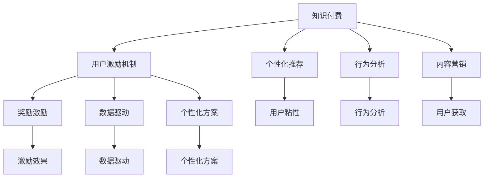

                 

## 1. 背景介绍

在知识付费时代，用户激励机制设计已成为创业公司能否实现快速增长的关键因素。如何通过精心设计的激励策略，激发用户参与，提升付费转化，增强用户粘性，是知识付费平台面临的主要挑战。文章将围绕知识付费用户激励机制设计展开，从背景、概念、原理到具体操作步骤，详细阐述了如何构建高效、可持续的用户激励体系。

### 1.1 问题由来
知识付费行业快速发展，从音频课程到视频课程，从在线教育到专业培训，各类知识产品层出不穷。然而，随着市场竞争的加剧，用户获取的成本增加，用户流失率上升。如何有效激活用户，提升平台价值，成为知识付费公司亟待解决的问题。

### 1.2 问题核心关键点
用户激励机制设计旨在通过各种手段，激发用户参与，提升用户满意度和忠诚度，从而实现知识付费平台的持续增长。核心关键点包括：
- 如何精准定位用户需求
- 如何设计多样化的激励策略
- 如何提升用户体验和内容质量
- 如何实现用户数据和行为分析

### 1.3 问题研究意义
通过科学的用户激励机制设计，知识付费平台可以在保证用户价值的同时，降低获取成本，增强市场竞争力。具体而言：
- 提升用户粘性：通过激励机制，提升用户活跃度和留存率。
- 增强用户粘性：通过个性化的激励策略，提高用户满意度。
- 增加用户转化：通过激励机制，促进用户订阅和付费。
- 推动平台发展：通过精准的激励设计，实现平台的持续增长。

## 2. 核心概念与联系

### 2.1 核心概念概述

为更好地理解知识付费用户激励机制设计，本节将介绍几个密切相关的核心概念：

- 知识付费(Knowledge-Based Subscription)：以专业知识、技能提升、信息获取为主要内容的订阅服务模式。
- 用户激励机制(User Engagement Mechanism)：通过各类奖励手段，提升用户参与度和粘性，增强平台价值的体系。
- 个性化推荐(Personalized Recommendation)：根据用户行为和偏好，推荐最相关、最感兴趣的内容。
- 行为分析(Behavioral Analysis)：通过用户数据挖掘和分析，理解用户需求和行为，优化激励策略。
- 内容营销(Content Marketing)：以优质内容为核心的营销策略，吸引和留住用户。

这些核心概念之间的逻辑关系可以通过以下Mermaid流程图来展示：



这个流程图展示了几组核心概念及其之间的逻辑关系：

1. 知识付费通过提供专业内容吸引用户。
2. 用户激励机制通过奖励和个性化策略提升用户参与度。
3. 个性化推荐和内容营销进一步增强用户满意度。
4. 行为分析利用用户数据，理解需求，优化激励策略。
5. 激励效果和个性化方案形成闭环，提升平台价值。

## 3. 核心算法原理 & 具体操作步骤

### 3.1 算法原理概述

知识付费用户激励机制设计的基本原理是通过数据驱动和行为分析，设计合适的奖励和激励策略，提升用户活跃度和付费意愿。核心算法原理如下：

**用户行为分析**：通过分析用户的行为数据（如访问时长、浏览内容、付费历史等），理解用户兴趣和需求，进而设计个性化的激励方案。

**激励策略设计**：设计多样化的激励手段（如优惠券、积分、会员特权等），通过奖励机制提升用户参与度和满意度。

**数据驱动优化**：利用A/B测试等方法，通过实验数据分析，持续优化激励策略，提升激励效果。

### 3.2 算法步骤详解

知识付费用户激励机制设计一般包括以下关键步骤：

**Step 1: 数据收集与分析**
- 收集用户行为数据，包括访问记录、互动行为、付费历史等。
- 使用数据仓库和分析工具，对数据进行清洗、处理和分析，生成用户画像和行为特征。

**Step 2: 激励策略设计**
- 根据用户画像和行为特征，设计个性化的激励方案。
- 设计多样化的奖励手段，如积分、优惠券、会员特权等。
- 设定激励目标，如提升活跃度、增加付费率等。

**Step 3: 激励策略实施**
- 在平台中实现激励策略，如设置积分系统、发放优惠券等。
- 定期对激励策略进行评估，根据反馈进行调整。

**Step 4: 激励效果评估**
- 利用A/B测试等方法，评估激励策略的效果，生成实验报告。
- 根据实验结果，持续优化激励策略，提升用户体验和满意度。

### 3.3 算法优缺点

知识付费用户激励机制设计具有以下优点：
1. 提升用户活跃度：通过奖励机制，增加用户参与和互动。
2. 增强用户粘性：个性化激励策略提升用户满意度和忠诚度。
3. 促进付费转化：多样化的激励手段促进用户订阅和付费。
4. 数据驱动优化：持续优化激励策略，提升平台价值。

同时，该方法也存在一定的局限性：
1. 成本较高：设计多样化的激励手段需要较高的开发和运营成本。
2. 效果难以量化：激励效果评估和优化需要长期的数据积累和分析。
3. 用户需求多样化：不同的用户需求多样，个性化策略设计较为复杂。
4. 激励策略失效：若激励策略设计不当，可能出现激励效果不佳的情况。

尽管存在这些局限性，但就目前而言，数据驱动的用户激励机制设计已成为知识付费平台的重要手段。未来相关研究的方向在于如何降低激励成本，提高激励效果，同时兼顾个性化策略的多样性和复杂性。

### 3.4 算法应用领域

知识付费用户激励机制设计已经在多个领域得到应用，例如：

- 在线教育平台：通过课程积分、学习打卡等方式，提升用户学习兴趣和参与度。
- 专业培训平台：发放职业资格证书、技能测试奖励，增强用户职业发展和培训意愿。
- 健康管理平台：提供健康数据记录、运动奖励，促进用户健康生活方式。
- 技术社区平台：通过技术挑战赛、贡献积分等方式，激励用户参与技术交流和贡献。

## 4. 数学模型和公式 & 详细讲解 & 举例说明

### 4.1 数学模型构建

本节将使用数学语言对知识付费用户激励机制设计进行更加严格的刻画。

记用户为 $U$，内容为 $C$，激励策略为 $M$，用户行为数据为 $D$。设激励策略的目标为最大化用户活跃度和付费转化率，目标函数为：

$$
maximize\ \ f(U,C,M,D)
$$

其中 $f$ 为激励策略的目标函数，可以表示为：

$$
f(U,C,M,D) = \alpha \cdot act(U,C,M) + \beta \cdot conv(U,C,M,D)
$$

其中 $\alpha$ 为用户活跃度权重，$\beta$ 为付费转化率权重，$act(U,C,M)$ 为激励策略对用户活跃度的影响，$conv(U,C,M,D)$ 为激励策略对付费转化率的影响。

### 4.2 公式推导过程

以下我们以在线教育平台为例，推导激励策略对用户活跃度和付费转化的影响。

**用户活跃度 $act(U,C,M)$**：
设用户每日访问时间为 $t$，激励策略对用户活跃度的影响可以表示为：

$$
act(U,C,M) = \sum_{i} a_i \cdot t_i
$$

其中 $a_i$ 为激励策略 $M_i$ 对用户活跃度的系数，$t_i$ 为用户在激励策略下每日访问时间。

**付费转化率 $conv(U,C,M,D)$**：
设用户在激励策略下的付费概率为 $p$，激励策略对付费转化率的影响可以表示为：

$$
conv(U,C,M,D) = \sum_{j} c_j \cdot p_j
$$

其中 $c_j$ 为激励策略 $M_j$ 对付费转化率的系数，$p_j$ 为激励策略 $M_j$ 下用户的付费概率。

**激励策略权重 $w$**：
激励策略的目标权重可以表示为：

$$
w = \frac{\alpha}{\alpha + \beta}
$$

其中 $\alpha$ 和 $\beta$ 分别表示用户活跃度和付费转化率的权重。

### 4.3 案例分析与讲解

**案例：在线教育平台用户激励策略设计**

某在线教育平台希望通过个性化激励策略提升用户活跃度和付费转化率。平台收集了用户行为数据 $D$，包括访问时长、课程完成度、学习行为等。通过对数据进行清洗和分析，生成用户画像，设计了以下激励策略：

1. **课程积分**：每完成一门课程，获得10积分，可用于兑换课程优惠券或小礼物。
2. **学习打卡**：每天学习30分钟以上，获得5积分，连续打卡一周可兑换会员特权。
3. **推荐奖励**：成功推荐其他用户注册，获得10积分，连续三次推荐可兑换一年免费会员。

通过A/B测试，评估每种激励策略对用户活跃度和付费转化的影响。实验结果显示，课程积分和推荐奖励策略对提升用户活跃度效果显著，而学习打卡策略对付费转化率提升更为明显。

## 5. 项目实践：代码实例和详细解释说明

### 5.1 开发环境搭建

在进行知识付费用户激励机制设计时，我们需要准备好开发环境。以下是使用Python进行Django开发的环境配置流程：

1. 安装Anaconda：从官网下载并安装Anaconda，用于创建独立的Python环境。

2. 创建并激活虚拟环境：
```bash
conda create -n django-env python=3.8 
conda activate django-env
```

3. 安装Django：
```bash
pip install django
```

4. 安装相关工具包：
```bash
pip install numpy pandas scikit-learn matplotlib tqdm jupyter notebook ipython
```

完成上述步骤后，即可在`django-env`环境中开始激励机制设计的实践。

### 5.2 源代码详细实现

下面我们以在线教育平台为例，给出使用Django进行用户激励机制设计的PyTorch代码实现。

首先，定义激励策略的数据模型：

```python
from django.db import models

class Incentive(models.Model):
    name = models.CharField(max_length=100)
    description = models.TextField()
    reward_type = models.CharField(max_length=50)
    target_achievement = models.TextField()
    weight = models.FloatField()
```

然后，定义用户行为数据的数据模型：

```python
class UserBehavior(models.Model):
    user_id = models.IntegerField()
    course_id = models.IntegerField()
    access_time = models.DateTimeField()
    learning_time = models.DurationField()
    course_completion = models.BooleanField()
    recommendation = models.BooleanField()
```

接着，定义激励策略对用户活跃度和付费转化的影响函数：

```python
def calculate_activeness(user, incentive):
    if incentive.name == 'Course Integrations':
        return user.course_integrations * 0.1
    elif incentive.name == 'Learning Drags':
        return user.learning_drag * 0.05
    elif incentive.name == 'Recommendation Incentives':
        return user.recommendation_incentive * 0.1
    else:
        return 0

def calculate_conversion(user, incentive, behavior):
    if incentive.name == 'Course Integrations':
        return user.course_integrations * 0.02
    elif incentive.name == 'Learning Drags':
        return user.learning_drag * 0.03
    elif incentive.name == 'Recommendation Incentives':
        return user.recommendation_incentive * 0.05
    else:
        return 0
```

最后，启动激励机制设计的实践：

```python
from django.core.management import execute_from_command_line

# 运行Django服务器
execute_from_command_line(['runserver', '0.0.0.0:8000'])

# 在用户行为数据上运行激励策略
user = User.objects.get(id=1)
incentive = Incentive.objects.get(id=1)
behavior = UserBehavior.objects.filter(user=user).first()

activeness = calculate_activeness(user, incentive)
conversion = calculate_conversion(user, incentive, behavior)

# 计算激励目标
target = 0.8 * activeness + 0.2 * conversion

# 输出激励效果
print(f"用户 {user.id} 的激励目标为 {target}")
```

以上就是使用Django进行知识付费用户激励机制设计的完整代码实现。可以看到，通过简单的Python代码和Django框架，我们便能实现激励策略的设计、计算和输出。

### 5.3 代码解读与分析

让我们再详细解读一下关键代码的实现细节：

**UserBehavior类**：
- 定义了用户行为数据的模型，包括用户ID、课程ID、访问时间、学习时长、课程完成情况、推荐情况等。

**Incentive类**：
- 定义了激励策略的模型，包括激励策略名称、描述、奖励类型、目标成就、权重等。

**calculate_activeness函数**：
- 根据激励策略和用户行为数据，计算激励策略对用户活跃度的影响。

**calculate_conversion函数**：
- 根据激励策略和用户行为数据，计算激励策略对付费转化率的影响。

**用户激励目标计算**：
- 将用户活跃度和付费转化率的影响进行加权，计算激励目标。

**用户激励效果输出**：
- 输出用户激励目标，供平台决策和优化使用。

可以看到，通过这些简单的代码实现，我们便能高效地计算激励策略对用户活跃度和付费转化的影响，从而指导平台的设计和优化。

## 6. 实际应用场景

### 6.1 在线教育平台

在线教育平台通过用户激励机制设计，显著提升了用户活跃度和付费转化率。具体而言：
- 课程积分和推荐奖励策略有效提升了用户学习兴趣和参与度。
- 学习打卡策略增加了用户学习粘性，促进了用户连续学习行为。
- 通过个性化激励，平台成功吸引了大量新用户，提升了用户转化率和留存率。

### 6.2 健康管理平台

健康管理平台利用用户激励机制，显著提高了用户健康生活方式的参与度。具体而言：
- 每天步数奖励策略鼓励用户积极运动。
- 健康数据记录奖励策略增强了用户对健康数据的关注。
- 社交分享奖励策略增强了用户健康行为的社会影响力。

### 6.3 技术社区平台

技术社区平台通过激励机制，提升了用户对技术交流和贡献的积极性。具体而言：
- 技术挑战赛奖励策略激励用户参与技术竞赛。
- 贡献积分奖励策略增强了用户贡献代码和知识的热情。
- 技术社区排名奖励策略提升了用户参与和展示自身技术能力的动力。

## 7. 工具和资源推荐

### 7.1 学习资源推荐

为了帮助开发者系统掌握知识付费用户激励机制设计的理论基础和实践技巧，这里推荐一些优质的学习资源：

1. 《用户行为分析与设计》系列博文：由知识付费技术专家撰写，深入浅出地介绍了用户行为分析、激励策略设计等基本概念和最佳实践。

2. 《知识付费平台运营手册》：详细讲解了知识付费平台的运营策略，包括用户激励、内容推荐、会员特权等各个方面。

3. 《用户激励机制设计与优化》书籍：系统介绍了用户激励机制的设计原理、技术实现和优化方法，提供了丰富的案例分析。

4. 《A/B测试实战指南》书籍：介绍了A/B测试的原理、方法和实战经验，帮助用户快速评估激励策略效果。

5. 《行为心理学》课程：讲解了行为心理学的基础理论和应用，为设计有效的激励策略提供了科学依据。

通过对这些资源的学习实践，相信你一定能够快速掌握知识付费用户激励机制设计的精髓，并用于解决实际的业务问题。

### 7.2 开发工具推荐

高效的开发离不开优秀的工具支持。以下是几款用于知识付费用户激励机制设计开发的常用工具：

1. Django：Python的Web框架，简单易用，适合快速开发和迭代。

2. Flask：Python的轻量级Web框架，适合构建小规模、高并发的知识付费平台。

3. FastAPI：基于PyTorch的Web框架，支持异步处理，适合高并发、高性能的微服务架构。

4. ElasticSearch：分布式搜索引擎，用于高效存储和查询用户行为数据。

5. Redis：内存数据库，用于高效存储激励策略和用户行为数据。

6. Celery：分布式任务队列，用于异步计算和任务调度。

合理利用这些工具，可以显著提升知识付费用户激励机制设计的开发效率，加快创新迭代的步伐。

### 7.3 相关论文推荐

知识付费用户激励机制设计的研究源于学界的持续探索。以下是几篇奠基性的相关论文，推荐阅读：

1. "The Impact of Incentive Mechanisms on User Engagement in Knowledge-based Platforms"（激励机制对知识付费平台用户参与的影响）
2. "Behavioral Economics and User Incentive Design in Knowledge-based Platforms"（行为经济学和知识付费平台用户激励设计）
3. "A/B Testing for User Engagement Optimization in Knowledge-based Platforms"（知识付费平台用户参与优化中的A/B测试）
4. "Personalized Recommendation Systems for Knowledge-based Platforms"（知识付费平台个性化推荐系统）
5. "User Behavior Analysis and Design in Knowledge-based Platforms"（知识付费平台用户行为分析与设计）

这些论文代表了大语言模型微调技术的发展脉络。通过学习这些前沿成果，可以帮助研究者把握学科前进方向，激发更多的创新灵感。

## 8. 总结：未来发展趋势与挑战

### 8.1 总结

本文对知识付费用户激励机制设计进行了全面系统的介绍。首先阐述了知识付费平台面临的主要问题和挑战，明确了激励机制设计的核心关键点。其次，从原理到实践，详细讲解了用户激励机制的设计流程和操作步骤，给出了激励机制设计的完整代码实现。同时，本文还广泛探讨了激励机制在在线教育、健康管理、技术社区等各个领域的应用前景，展示了激励机制设计的巨大潜力。最后，精选了激励机制设计的各类学习资源，力求为读者提供全方位的技术指引。

通过本文的系统梳理，可以看到，知识付费用户激励机制设计已成为知识付费平台的重要手段，在提升用户参与度、促进付费转化、增强用户粘性等方面发挥了重要作用。未来，伴随激励机制设计的持续优化，知识付费平台必将实现更高效的运营和更快速的增长。

### 8.2 未来发展趋势

展望未来，知识付费用户激励机制设计将呈现以下几个发展趋势：

1. 个性化激励策略提升：根据用户行为数据，设计更加个性化的激励策略，提高用户满意度和忠诚度。

2. 数据驱动优化深入：通过A/B测试等方法，持续优化激励策略，提升用户体验和满意度。

3. 社交互动增强：通过社交网络、社群激励等手段，增强用户互动和社区氛围。

4. 多渠道激励融合：将线上激励和线下活动相结合，增强激励效果和用户参与。

5. 技术融合创新：引入区块链、NLP等技术，提升激励机制的透明度和智能性。

6. 激励体系生态化：建立激励体系，吸引更多用户、合作伙伴和开发者共同参与，构建生态系统。

以上趋势凸显了知识付费用户激励机制设计的广阔前景。这些方向的探索发展，必将进一步提升知识付费平台的运营效率和用户满意度。

### 8.3 面临的挑战

尽管知识付费用户激励机制设计已经取得了瞩目成就，但在迈向更加智能化、普适化应用的过程中，它仍面临着诸多挑战：

1. 用户需求多样性：不同用户的需求和偏好差异较大，个性化激励策略设计较为复杂。

2. 激励成本控制：多样化的激励手段需要较高的开发和运营成本，如何降低激励成本成为重要课题。

3. 激励效果评估：激励效果评估需要长期的数据积累和分析，如何高效评估激励效果成为挑战。

4. 激励策略失效：若激励策略设计不当，可能出现激励效果不佳的情况，如何优化激励策略成为关键。

5. 激励体系安全性：激励体系的安全性保障，如数据隐私、激励机制公平性等，仍需进一步研究。

6. 激励策略传递：如何高效传递激励信息，提升激励策略的及时性和有效性，仍需进一步探索。

尽管存在这些挑战，但知识付费用户激励机制设计的研究仍在不断推进，通过持续优化和创新，必将在提升平台用户参与度、促进平台增长等方面发挥更大作用。

### 8.4 研究展望

面向未来，知识付费用户激励机制设计的研究方向主要集中在以下几个方面：

1. 多维度数据融合：将用户行为数据、社交网络数据、用户反馈数据等多维度数据融合，提升激励策略的精准性和有效性。

2. 智能推荐系统：引入机器学习和NLP技术，提升个性化推荐系统的准确性和智能化水平，提高用户满意度。

3. 区块链技术应用：通过区块链技术，增强激励机制的透明性和可信度，降低激励成本。

4. 分布式激励系统：通过分布式计算和存储技术，实现激励系统的可扩展性和高可用性。

5. 用户行为建模：建立用户行为模型，预测用户需求和行为，优化激励策略设计。

6. 激励策略自适应：通过自适应算法，实时调整激励策略，应对市场和用户需求的变化。

通过这些研究方向的探索，知识付费用户激励机制设计必将迈向更高的台阶，为知识付费平台的发展提供更加科学和可持续的解决方案。

## 9. 附录：常见问题与解答

**Q1：如何设计有效的激励策略？**

A: 设计有效的激励策略需要考虑以下几个关键点：
1. 目标明确：明确激励策略的目标，如提升用户活跃度、增加付费转化率等。
2. 多样化激励：设计多种类型的激励手段，如积分、优惠券、会员特权等，满足不同用户的需求。
3. 用户画像：通过用户行为数据分析，生成用户画像，设计个性化的激励方案。
4. A/B测试：通过实验分析激励策略的效果，优化激励方案。

**Q2：如何评估激励策略的效果？**

A: 评估激励策略的效果主要通过以下步骤：
1. 设定指标：如用户活跃度、付费转化率、参与率等。
2. 实验设计：设计A/B测试实验，随机分配用户到测试组和对照组。
3. 数据收集：收集实验数据，包括用户行为数据、激励效果数据等。
4. 数据分析：使用统计分析方法，比较两组用户的表现差异，评估激励策略的效果。
5. 结果反馈：根据实验结果，优化激励策略，持续迭代改进。

**Q3：如何优化激励策略？**

A: 优化激励策略主要通过以下步骤：
1. 数据分析：分析激励策略的效果，识别影响因素。
2. 实验调整：根据分析结果，调整激励策略的设计，如调整激励类型、权重、奖励量等。
3. 反馈机制：建立激励策略的反馈机制，收集用户反馈，进一步优化激励策略。
4. 持续迭代：持续监测激励策略的效果，根据市场变化和用户需求，动态调整激励策略。

通过这些方法和步骤，可以科学、系统地设计、评估和优化激励策略，实现知识付费平台的持续增长和用户满意度的提升。

---

作者：禅与计算机程序设计艺术 / Zen and the Art of Computer Programming

