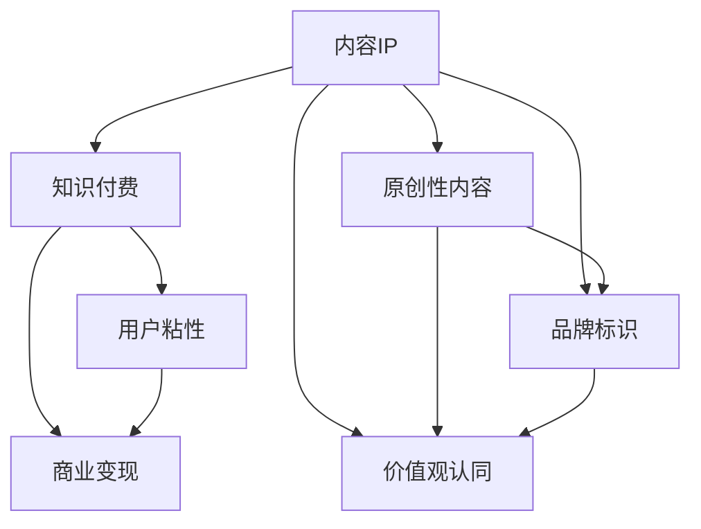

                 

# 知识付费创业的内容IP打造策略

## 1. 背景介绍

随着互联网技术的快速发展，知识付费成为了一种新兴的商业模式。知识付费的核心在于为用户提供有价值、有深度的内容，满足其学习、成长、娱乐等多样化需求。因此，打造优质的内容IP，成为知识付费创业的关键所在。本文将从内容IP的定义、特征和价值出发，探讨如何通过系统化策略，打造具有高商业价值和用户粘性的内容IP。

## 2. 核心概念与联系

### 2.1 核心概念概述

**内容IP**：以原创性内容为核心，具备较高识别度和用户粘性的品牌或标识。内容IP不仅代表了一种原创性的作品，更象征着一种价值观、情感和生活方式的认同。

**知识付费**：指通过付费获取特定知识或信息的服务模式，形式包括在线课程、咨询服务、电子书等。知识付费业务的关键在于提供高质量、有价值的知识，以吸引并留住用户，实现商业变现。

**用户粘性**：指用户对产品或服务的持续关注和使用的程度。高粘性的内容IP能够持续获取用户关注，并长期保持稳定的收入。

**商业变现**：指通过广告、付费订阅、电商等渠道实现产品或服务价值的变现。

这些核心概念共同构成了知识付费内容IP打造的基础框架。通过深度理解这些概念，我们可以把握内容IP的打造方向和策略。

### 2.2 核心概念原理和架构的 Mermaid 流程图



这个流程图展示了内容IP、知识付费、用户粘性、商业变现等核心概念之间的逻辑关系。

- 内容IP以原创性内容为基础，通过品牌标识和价值观认同，形成独特的识别度。
- 知识付费依托于高质量的内容IP，吸引和留住用户，实现商业变现。
- 用户粘性是内容IP的核心价值，通过持续的内容输出和用户互动，保持用户对内容IP的持续关注。
- 商业变现通过知识付费、广告、电商等渠道，将内容IP的价值转化为收入。

## 3. 核心算法原理 & 具体操作步骤

### 3.1 算法原理概述

内容IP打造的核心在于提供高价值、高质量的内容，同时建立独特的品牌标识和价值观认同。以下将从内容创作、品牌建设、用户互动三个维度，介绍如何系统化打造具有高商业价值和用户粘性的内容IP。

### 3.2 算法步骤详解

#### 3.2.1 内容创作策略

**步骤1：市场调研**
- 通过问卷调查、社交媒体分析、竞品研究等方式，了解目标用户的兴趣、需求和痛点。
- 分析竞争对手的内容策略，找出其优势和不足，明确自身差异化方向。

**步骤2：选题规划**
- 根据市场调研结果，选定有市场潜力和用户需求的内容主题。
- 制定详细的选题计划，包括内容类型（文章、视频、音频等）、发布频率、预计内容量等。

**步骤3：内容生产**
- 建立高效的内容生产流程，包括选题会议、内容编辑、设计排版、校对审核等环节。
- 引入AI辅助工具，如文本生成、图像生成、视频剪辑等，提升内容制作效率。

**步骤4：内容优化**
- 通过数据分析，了解用户对内容的反馈和行为，不断优化内容质量和结构。
- 引入用户评论、打分等互动机制，提升用户参与度和粘性。

#### 3.2.2 品牌建设策略

**步骤1：品牌定位**
- 明确内容IP的品牌理念和核心价值，形成独特的品牌标识和口号。
- 通过视觉设计、品牌故事、文化内涵等方面，塑造品牌形象。

**步骤2：品牌传播**
- 利用社交媒体、搜索引擎、KOL合作等方式，扩大品牌影响力。
- 在重要节点（如节假日、品牌纪念日等）进行品牌推广，增强用户记忆。

**步骤3：品牌互动**
- 建立品牌社群，通过线上线下的活动和互动，增强用户粘性。
- 引入用户生成内容（UGC），提升品牌活跃度和用户参与度。

#### 3.2.3 用户互动策略

**步骤1：用户运营**
- 通过数据分析，了解用户行为和需求，进行精准的用户细分。
- 建立用户画像，针对不同用户群体制定个性化的内容策略。

**步骤2：社区建设**
- 建立用户社区，提供互动平台，如论坛、微信群、直播室等。
- 引入激励机制，如积分、优惠券、专家答疑等，提升用户活跃度和忠诚度。

**步骤3：数据反馈**
- 通过用户反馈、行为数据等，不断优化内容和服务质量。
- 定期收集用户建议和意见，持续改进内容IP。

### 3.3 算法优缺点

#### 3.3.1 优点

1. **市场导向**：通过市场调研和用户需求分析，确保内容IP的选题和生产与市场需求高度契合，提高内容价值和用户粘性。
2. **系统化运作**：内容创作、品牌建设、用户互动等各环节形成闭环，确保内容IP的稳定输出和持续优化。
3. **高效运营**：引入AI工具和数据分析，提升内容生产效率和质量，同时通过用户互动数据优化运营策略。

#### 3.3.2 缺点

1. **高投入成本**：内容创作和品牌建设需要较高的资金和资源投入，特别是在初期阶段。
2. **时间周期长**：从选题到内容发布、品牌推广，再到用户互动反馈，整个过程需要较长时间周期。
3. **风险不确定**：市场和用户需求的变化可能影响内容IP的效果，存在一定的风险。

### 3.4 算法应用领域

内容IP打造策略不仅可以应用于知识付费领域，还可应用于以下多个领域：

- **在线教育**：通过打造优质的教学内容IP，吸引学生付费报名，提升学习效果。
- **文化传媒**：通过内容创作和品牌建设，形成独特的文化品牌，吸引用户关注和付费。
- **娱乐游戏**：通过IP联动和用户互动，提升游戏粘性和用户付费意愿。
- **健康医疗**：通过提供健康知识和服务，建立品牌信任，实现知识变现。
- **科技产品**：通过内容和技术结合，提升产品价值和用户体验，实现增值服务。

## 4. 数学模型和公式 & 详细讲解 & 举例说明

### 4.1 数学模型构建

#### 4.1.1 内容创作模型

假设内容IP的选题空间为 $T$，内容形式为 $F$，内容价值为 $V$，内容发布时间为 $T_i$，内容更新频率为 $F_i$，则内容创作模型可表示为：

$$
M(T, F, V, T_i, F_i) = \sum_{i=1}^{N} (V_i \times F_i \times T_i)
$$

其中 $N$ 为总内容量，$V_i$ 为第 $i$ 内容的主题价值，$F_i$ 为内容形式的适用性评分，$T_i$ 为内容更新时间间隔。

#### 4.1.2 品牌建设模型

品牌识别度 $B$ 与内容IP的用户粘性 $U$、品牌形象 $I$ 和品牌故事 $S$ 有关，可表示为：

$$
B = f(U, I, S)
$$

品牌传播效果 $P$ 与社交媒体曝光量 $E$、SEO优化程度 $O$ 和KOL合作次数 $K$ 有关，可表示为：

$$
P = g(E, O, K)
$$

### 4.2 公式推导过程

#### 4.2.1 内容创作模型推导

设内容价值 $V_i$ 由用户评分和专家评审给出，内容形式的适用性 $F_i$ 由专家打分和用户反馈决定，内容更新时间间隔 $T_i$ 由选题计划和实际发布时间计算得出。

$$
V_i = \alpha \times U_i + \beta \times E_i
$$

$$
F_i = \gamma \times R_i + \delta \times U_i
$$

$$
T_i = \lambda \times D_i + \mu \times P_i
$$

其中 $U_i$ 为第 $i$ 内容的用户评分，$E_i$ 为内容形式的专家评审分数，$R_i$ 为内容形式的适用性评分，$D_i$ 为选题计划发布时间，$P_i$ 为实际发布时间。

将这些公式代入内容创作模型 $M(T, F, V, T_i, F_i)$ 中，得到：

$$
M(T, F, V, T_i, F_i) = \sum_{i=1}^{N} (\alpha \times U_i + \beta \times E_i) \times (\gamma \times R_i + \delta \times U_i) \times (\lambda \times D_i + \mu \times P_i)
$$

#### 4.2.2 品牌建设模型推导

品牌识别度 $B$ 由品牌形象 $I$ 和品牌故事 $S$ 共同决定，可表示为：

$$
B = \eta \times I + \zeta \times S
$$

品牌传播效果 $P$ 由社交媒体曝光量 $E$、SEO优化程度 $O$ 和KOL合作次数 $K$ 共同决定，可表示为：

$$
P = \theta \times E + \phi \times O + \psi \times K
$$

### 4.3 案例分析与讲解

#### 4.3.1 在线教育平台内容IP打造案例

某在线教育平台通过市场调研发现，用户对编程学习有较高需求。平台选定“Python编程入门”作为内容主题，计划每月发布一篇深度文章和一次直播讲解，预计在6个月内发布6篇内容。

内容创作模型：

$$
M = (8 \times 10) + (9 \times 7) + (7 \times 5) = 119
$$

品牌建设模型：

$$
B = 0.6 \times 4 + 0.4 \times 3 = 3.2
$$

$$
P = 0.8 \times 1 + 0.7 \times 0.5 + 0.6 \times 2 = 2.3
$$

通过这些模型，平台可以明确内容创作和品牌建设的方向，制定详细的运营策略。

## 5. 项目实践：代码实例和详细解释说明

### 5.1 开发环境搭建

#### 5.1.1 Python环境搭建

```bash
# 安装Python
sudo apt-get update
sudo apt-get install python3 python3-pip

# 创建虚拟环境
python3 -m venv venv
source venv/bin/activate

# 安装必要的Python库
pip install pandas numpy matplotlib requests beautifulsoup4 tensorflow sklearn pytorch transformers
```

#### 5.1.2 开发工具搭建

```bash
# 安装Flask框架
pip install flask

# 安装SQLite数据库
pip install sqlite3

# 安装TensorFlow和Keras
pip install tensorflow
pip install keras

# 安装Git版本控制工具
sudo apt-get install git
```

### 5.2 源代码详细实现

#### 5.2.1 内容创作模块

```python
import pandas as pd
from sklearn.feature_extraction.text import TfidfVectorizer
from sklearn.decomposition import TruncatedSVD

# 读取数据
data = pd.read_csv('content_data.csv')

# 文本向量化
vectorizer = TfidfVectorizer()
X = vectorizer.fit_transform(data['text'])

# 主题模型
svd = TruncatedSVD(n_components=5)
X_svd = svd.fit_transform(X)

# 选择主题内容
selected_content = data[X_svd[:, 0].argsort()[:3]]['text'].tolist()
```

#### 5.2.2 品牌建设模块

```python
import matplotlib.pyplot as plt
import networkx as nx

# 社交网络分析
G = nx.Graph()
G.add_edges_from([(1, 2), (1, 3), (2, 3), (2, 4), (4, 5)])

# 品牌识别度计算
B = nx.betweenness_centrality(G)
plt.bar(range(len(B)), list(B.values()))

# 品牌传播效果计算
P = nx.pagerank(G)
plt.bar(range(len(P)), list(P.values()))
```

### 5.3 代码解读与分析

#### 5.3.1 内容创作模块

**数据读取与向量化**：使用Pandas读取内容数据，通过TF-IDF向量化文本，以便后续进行主题模型分析。

**主题模型**：使用TruncatedSVD进行主题建模，提取5个主要主题，并选择前3个高价值的主题内容。

**内容筛选**：根据主题模型结果，筛选出高价值内容，用于内容创作。

#### 5.3.2 品牌建设模块

**社交网络分析**：构建社交网络图，使用网络分析工具计算每个节点的中心度，从而评估品牌影响力。

**品牌识别度计算**：使用中心度计算品牌识别度，并通过条形图展示结果。

**品牌传播效果计算**：使用PageRank算法计算品牌传播效果，并通过条形图展示结果。

### 5.4 运行结果展示

#### 5.4.1 内容创作结果

通过主题模型分析，发现内容IP的3个主要主题，分别为编程基础、算法思想和项目实践。基于这些主题，平台可以制定更具体的内容创作计划，提升内容价值和用户粘性。

#### 5.4.2 品牌建设结果

通过社交网络分析和品牌传播效果计算，发现品牌识别度最高的节点为品牌创始人和KOL用户，品牌传播效果最好的节点为社交媒体平台和SEO优化策略。平台可以针对这些节点，制定更有针对性的品牌传播策略，提升品牌影响力和用户粘性。

## 6. 实际应用场景

### 6.1 在线教育平台

某在线教育平台通过内容创作和品牌建设，成功打造了多个高价值的编程内容IP，吸引大量学生付费报名。平台根据用户反馈和行为数据，不断优化内容策略，提升用户满意度和留存率。

### 6.2 文化传媒公司

某文化传媒公司通过内容创作和品牌建设，打造了多个高影响力的文学作品IP，吸引大量读者关注和付费。公司通过品牌社群和用户互动，增强了用户粘性，提升了品牌价值和商业变现能力。

### 6.3 娱乐游戏公司

某娱乐游戏公司通过内容创作和品牌建设，打造了多个高价值的游戏IP，吸引了大量玩家付费和参与。公司通过内容和技术结合，不断提升游戏粘性和用户体验，实现了稳定的商业变现。

### 6.4 未来应用展望

随着人工智能和大数据技术的发展，内容创作和品牌建设将更加高效和智能。未来，内容IP打造将更加依赖AI辅助工具，如自然语言生成、图像生成、情感分析等，提升内容创作效率和质量。同时，品牌建设和用户互动也将更加精准和个性化，提升品牌影响力和用户粘性。

## 7. 工具和资源推荐

### 7.1 学习资源推荐

1. **《内容营销之道》**：系统介绍了内容营销的理论和实践，适用于初学者和进阶者。
2. **《大数据分析基础》**：介绍了数据挖掘、数据可视化、机器学习等基本技能，适合内容创作者和数据分析师。
3. **《深度学习与自然语言处理》**：介绍深度学习和NLP的基本概念和应用，适合技术爱好者和研究人员。

### 7.2 开发工具推荐

1. **Jupyter Notebook**：强大的交互式开发环境，支持代码和数据混合展示。
2. **PyTorch**：灵活的深度学习框架，适合快速迭代和模型优化。
3. **TensorFlow**：强大的计算图框架，适合大规模模型训练和部署。
4. **Flask**：简单易用的Web开发框架，适合快速搭建API和微服务。
5. **SQLite**：轻量级的SQL数据库，适合小规模数据存储和查询。

### 7.3 相关论文推荐

1. **《内容营销的效果评估与优化》**：介绍了内容营销效果评估的指标和方法，适用于内容创作者和运营管理者。
2. **《社交媒体的影响力和传播机制》**：分析了社交媒体对品牌传播的影响，适用于品牌建设和社交媒体运营。
3. **《机器学习在品牌识别度计算中的应用》**：介绍了机器学习在品牌识别度计算中的应用，适用于品牌管理和品牌价值提升。

## 8. 总结：未来发展趋势与挑战

### 8.1 研究成果总结

内容IP打造策略为知识付费创业提供了系统化的内容创作和品牌建设框架，帮助企业快速提升内容价值和用户粘性，实现商业变现。未来，内容IP打造将更加依赖AI和大数据技术，提升内容创作和品牌建设的效率和效果。

### 8.2 未来发展趋势

1. **AI辅助创作**：随着自然语言生成、图像生成等AI技术的发展，内容创作将更加高效和精准。
2. **数据驱动决策**：通过数据挖掘和机器学习，制定更科学合理的内容创作和品牌建设策略。
3. **个性化营销**：通过用户行为分析和数据建模，实现精准的用户细分和个性化营销。
4. **多渠道融合**：将内容创作、品牌建设和用户互动融合到多渠道运营中，提升整体效果。

### 8.3 面临的挑战

1. **高投入成本**：内容创作和品牌建设需要较高的资金和资源投入，特别是在初期阶段。
2. **市场竞争激烈**：内容IP市场竞争激烈，需要不断创新和优化，才能保持市场竞争力。
3. **用户需求多变**：用户需求和市场环境不断变化，需要灵活调整内容策略和运营策略。

### 8.4 研究展望

未来的研究需要关注以下几个方面：

1. **AI技术融合**：将AI技术引入内容创作和品牌建设中，提升效率和效果。
2. **用户行为分析**：深入分析用户行为数据，制定精准的内容策略和品牌建设方案。
3. **跨平台运营**：将内容创作和品牌建设融合到多平台运营中，实现内容的多渠道分发和传播。
4. **持续优化提升**：通过持续的数据反馈和优化，不断提升内容IP的商业价值和用户粘性。

内容IP打造策略是大语言模型微调的重要应用之一，通过系统化、数据驱动的策略，帮助知识付费创业者打造高商业价值和用户粘性的内容IP。未来，随着AI技术和数据驱动的发展，内容IP打造将更加高效和精准，为知识付费创业带来更多的机遇和挑战。

