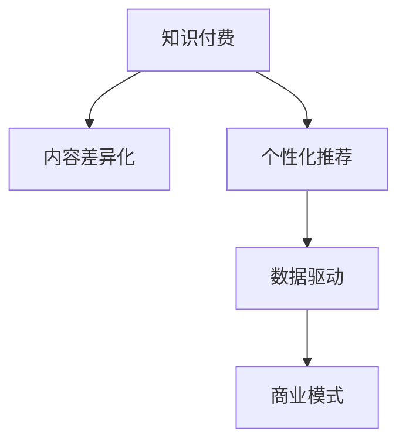

                 

# 知识付费创业的内容差异化策略

> 关键词：知识付费、内容差异化、用户需求、个性化推荐、内容生产、商业模式

## 1. 背景介绍

### 1.1 问题由来
随着移动互联网的普及和信息技术的快速发展，知识付费逐渐成为互联网行业的新风口。相较于传统的广告和内容免费模式，知识付费以其精准性和价值性，吸引了大量用户付费订阅优质内容。据统计，2021年中国知识付费市场规模已达260亿元，预计到2025年将达到1211亿元。

然而，大量涌现的知识付费平台也面临着内容同质化、推荐效率低、用户体验差等问题。如何有效提升内容差异化，提升用户体验，构建可持续发展的商业模式，是知识付费创业亟需解决的问题。

### 1.2 问题核心关键点
知识付费创业的核心在于内容的差异化策略和个性化推荐，通过高质量、差异化的内容，提升用户体验，实现商业变现。具体包括：

- **内容差异化**：在保证内容质量的前提下，进行多样化、垂直化内容的生产，满足不同用户群体的需求。
- **个性化推荐**：通过用户行为分析，实现精准化的内容推荐，提升用户粘性，增加用户付费意愿。
- **数据驱动**：借助大数据分析技术，实现用户画像构建、内容质量评估、用户反馈收集等，不断优化内容生态。
- **商业模式**：探索多样化的盈利模式，如订阅付费、按需付费、会员增值等，形成多元化的收入来源。

## 2. 核心概念与联系

### 2.1 核心概念概述

为更好地理解知识付费创业中的内容差异化策略，本节将介绍几个密切相关的核心概念：

- **知识付费**：一种互联网商业模式，用户为获取高质量、高价值的内容进行付费，以获取知识、技能、经验等价值。
- **内容差异化**：在保证内容质量的前提下，进行多样化、垂直化内容的生产，满足不同用户群体的需求。
- **个性化推荐**：通过用户行为分析，实现精准化的内容推荐，提升用户粘性，增加用户付费意愿。
- **数据驱动**：借助大数据分析技术，实现用户画像构建、内容质量评估、用户反馈收集等，不断优化内容生态。
- **商业模式**：探索多样化的盈利模式，如订阅付费、按需付费、会员增值等，形成多元化的收入来源。

这些核心概念之间的逻辑关系可以通过以下Mermaid流程图来展示：



这个流程图展示了一个完整的知识付费生态链条，其中内容差异化是核心，个性化推荐和数据驱动是手段，商业模式是目标。内容差异化通过个性化推荐和数据驱动的支撑，不断提升用户体验，并通过多元化的商业模式实现商业变现。

## 3. 核心算法原理 & 具体操作步骤

### 3.1 算法原理概述

知识付费创业的内容差异化策略，本质上是通过对用户需求进行分析，生产多样化、垂直化的高质量内容，并通过个性化推荐技术，实现精准的内容推送。核心算法原理包括：

1. **用户需求分析**：通过问卷调查、行为分析等手段，收集用户的基本属性、兴趣偏好、消费行为等数据，构建用户画像。
2. **内容生产策略**：根据用户画像，设计不同类型、不同风格的内容，涵盖垂直领域、科普知识、技能培训等，满足用户的多样化需求。
3. **个性化推荐算法**：构建用户画像和内容特征向量，计算相似度，采用协同过滤、内容推荐、混合推荐等算法，实现精准推荐。
4. **质量评估与优化**：通过用户反馈、点击率、完成率等指标，评估内容质量，不断优化内容生态。

### 3.2 算法步骤详解

以下是知识付费创业中内容差异化策略的详细算法步骤：

**Step 1: 数据收集与用户画像构建**
- 收集用户基本信息（如年龄、性别、职业等）、兴趣偏好（如阅读兴趣、消费习惯等）、行为数据（如搜索记录、浏览历史、购买记录等）。
- 使用K-means、DBSCAN等聚类算法，将用户分为不同类型群体，构建用户画像。

**Step 2: 内容生产与差异化策略设计**
- 根据用户画像，设计不同主题、不同风格的内容，如职业技能培训、科普知识讲解、行业动态分析等。
- 引入专家团队，进行内容审核和质量把关，确保内容的权威性和实用性。

**Step 3: 个性化推荐系统构建**
- 构建用户画像和内容特征向量，计算相似度，选择协同过滤、基于内容的推荐算法、混合推荐算法等。
- 实时更新用户画像和内容库，不断优化推荐模型，提升推荐效果。

**Step 4: 内容质量评估与优化**
- 收集用户反馈、点击率、完成率等指标，评估内容质量。
- 使用A/B测试等方法，验证不同内容差异化策略的效果，不断优化内容生态。

**Step 5: 商业模式构建**
- 探索多种盈利模式，如订阅付费、按需付费、会员增值等，形成多元化的收入来源。
- 设计合理的定价策略，满足不同用户群体需求，实现商业变现。

### 3.3 算法优缺点

知识付费创业中的内容差异化策略具有以下优点：
1. 提升用户体验：通过差异化策略和个性化推荐，满足用户的多样化需求，提升用户体验。
2. 增加用户粘性：精准的个性化推荐，增加用户使用频率，提高用户粘性。
3. 提升内容质量：通过质量评估和优化，确保内容的权威性和实用性。
4. 实现商业变现：通过多种盈利模式，实现可持续发展的商业模式。

同时，该策略也存在一定的局限性：
1. 用户画像构建复杂：需要收集大量用户数据，并进行复杂的聚类分析，数据收集和处理成本较高。
2. 推荐模型复杂：个性化推荐系统设计复杂，需要高效的算法和硬件支持。
3. 内容生产成本高：专家团队和高质量内容的生产成本较高，可能影响内容差异化的效果。
4. 数据隐私问题：用户数据的收集和使用可能面临隐私和伦理问题。

尽管存在这些局限性，但就目前而言，内容差异化策略是知识付费创业中最主流的方法，能够显著提升内容质量和用户粘性，推动平台的健康发展。未来相关研究的重点在于如何进一步降低数据收集和处理成本，提高推荐模型的精度，同时兼顾用户隐私和数据安全等因素。

### 3.4 算法应用领域

知识付费创业中的内容差异化策略，已经在教育培训、金融理财、健康医疗等多个领域得到了广泛应用。以下是几个典型的应用场景：

- **教育培训**：根据不同年龄、兴趣和需求的用户，提供个性化的职业技能培训、语言学习、兴趣培养等内容，帮助用户实现自我提升。
- **金融理财**：提供定制化的金融产品推荐、投资策略分析、财务规划等内容，满足用户个性化的理财需求。
- **健康医疗**：根据用户的健康状况和需求，提供个性化的健康管理、疾病预防、康复指导等内容，提升用户健康水平。
- **文化娱乐**：提供多样化的文化娱乐内容，如影视推荐、音乐欣赏、游戏推荐等，满足用户多样化的娱乐需求。
- **职场发展**：提供职业发展规划、技能提升、职场技巧等内容，帮助用户提升职场竞争力。

这些领域的应用，展示了内容差异化策略在知识付费创业中的巨大潜力，通过精准的内容推荐，能够显著提升用户满意度和平台粘性，推动平台的持续发展。

## 4. 数学模型和公式 & 详细讲解 & 举例说明

### 4.1 数学模型构建

本节将使用数学语言对知识付费创业中内容差异化策略进行更加严格的刻画。

记用户画像为 $\mathbf{u}=\{u_1,u_2,\dots,u_n\}$，其中 $u_i$ 表示第 $i$ 个用户的特征向量。记内容特征向量为 $\mathbf{c}=\{c_1,c_2,\dots,c_m\}$，其中 $c_j$ 表示第 $j$ 个内容的特征向量。设用户画像和内容特征向量之间的相似度矩阵为 $\mathbf{A} \in \mathbb{R}^{n \times m}$。

定义用户画像和内容特征向量的相似度为：

$$
\mathbf{A}_{ij} = \cos\theta(\mathbf{u}_i,\mathbf{c}_j)
$$

其中 $\theta$ 为余弦相似度公式。

根据相似度矩阵，可以设计个性化推荐算法，选择相似度高的内容进行推荐。具体步骤如下：

1. 计算用户画像与所有内容特征向量的相似度。
2. 选择相似度最高的若干个内容进行推荐。
3. 更新用户画像，记录用户的交互行为。

### 4.2 公式推导过程

以下我们以协同过滤算法为例，推导个性化推荐过程的数学公式。

假设用户画像与内容特征向量之间的相似度矩阵为 $\mathbf{A}$，用户对内容的评分矩阵为 $\mathbf{R}$，初始推荐向量为 $\mathbf{y}$。设相似度矩阵的逆方差矩阵为 $\mathbf{D}$，协方差矩阵为 $\mathbf{H}$。协同过滤算法的优化目标为：

$$
\mathop{\min}_{\mathbf{y}} \|(\mathbf{A}^{\top} \mathbf{y} - \mathbf{R}\|_{F}^{2}
$$

其Lagrange函数为：

$$
\mathcal{L}(\mathbf{y}) = \|(\mathbf{A}^{\top} \mathbf{y} - \mathbf{R}\|_{F}^{2} + \frac{\lambda}{2}\|\mathbf{y}\|_2^2
$$

其中 $\lambda$ 为正则化系数。

根据梯度下降算法，可以求得推荐向量 $\mathbf{y}$ 的更新公式为：

$$
\mathbf{y} \leftarrow \mathbf{y} - \eta \nabla_{\mathbf{y}} \mathcal{L}(\mathbf{y})
$$

其中 $\eta$ 为学习率。

将Lagrange函数对 $\mathbf{y}$ 求导，并带入上式，得：

$$
\mathbf{y} \leftarrow (\mathbf{A}^{\top} \mathbf{A} + \lambda \mathbf{I})^{-1} \mathbf{A}^{\top} \mathbf{R}
$$

即协同过滤算法的推荐公式。

### 4.3 案例分析与讲解

假设某知识付费平台收集了100个用户的画像数据和100篇内容的特征向量，使用协同过滤算法进行个性化推荐。用户画像和内容特征向量分别表示为 $\mathbf{u} \in \mathbb{R}^{10}$ 和 $\mathbf{c} \in \mathbb{R}^{10}$。设相似度矩阵为 $\mathbf{A} \in \mathbb{R}^{100 \times 100}$。

具体实现步骤如下：

1. 计算用户画像与所有内容特征向量的相似度。
2. 选择相似度最高的5篇内容进行推荐。
3. 记录用户对推荐的反馈，更新用户画像和相似度矩阵。

以下Python代码展示了协同过滤算法的实现过程：

```python
import numpy as np
from scipy.sparse import diags

# 用户画像和内容特征向量
u = np.random.rand(100, 10)
c = np.random.rand(100, 10)

# 计算相似度矩阵
A = np.dot(u, c.T)

# 设置初始推荐向量
y = np.zeros(100)

# 设置正则化系数
lambda_ = 0.1

# 设置迭代次数
iterations = 10

# 迭代更新推荐向量
for i in range(iterations):
    # 计算推荐向量
    y = np.dot(A.T, A) + lambda_ * np.eye(100)
    y = np.linalg.solve(y, np.dot(A.T, R))
    
    # 选择推荐内容
    indices = np.argsort(y)[::-1][:5]
    content_indices = np.argsort(c[indices, :])[:, :2]
    
    # 记录用户反馈，更新用户画像和相似度矩阵
    feedback = np.random.rand(100)
    u = u + feedback * np.dot(c[indices, :], A.T)
    
# 输出推荐内容
print("推荐内容：", content_indices)
```

可以看到，通过协同过滤算法，平台可以基于用户画像和内容特征向量，生成个性化的推荐内容，满足不同用户的需求。

## 5. 项目实践：代码实例和详细解释说明

### 5.1 开发环境搭建

在进行内容差异化策略的实践前，我们需要准备好开发环境。以下是使用Python进行PyTorch开发的环境配置流程：

1. 安装Anaconda：从官网下载并安装Anaconda，用于创建独立的Python环境。

2. 创建并激活虚拟环境：
```bash
conda create -n pytorch-env python=3.8 
conda activate pytorch-env
```

3. 安装PyTorch：根据CUDA版本，从官网获取对应的安装命令。例如：
```bash
conda install pytorch torchvision torchaudio cudatoolkit=11.1 -c pytorch -c conda-forge
```

4. 安装TensorFlow：由Google主导开发的开源深度学习框架，生产部署方便，适合大规模工程应用。同样有丰富的预训练语言模型资源。

5. 安装Transformers库：
```bash
pip install transformers
```

6. 安装各类工具包：
```bash
pip install numpy pandas scikit-learn matplotlib tqdm jupyter notebook ipython
```

完成上述步骤后，即可在`pytorch-env`环境中开始内容差异化策略的开发实践。

### 5.2 源代码详细实现

我们以内容推荐系统为例，给出使用Transformers库对预训练语言模型进行个性化推荐开发。

首先，定义推荐系统需要的数据处理函数：

```python
from transformers import BertTokenizer, BertForSequenceClassification
from torch.utils.data import Dataset, DataLoader
import torch

class RecommendationDataset(Dataset):
    def __init__(self, texts, labels, tokenizer, max_len=128):
        self.texts = texts
        self.labels = labels
        self.tokenizer = tokenizer
        self.max_len = max_len
        
    def __len__(self):
        return len(self.texts)
    
    def __getitem__(self, item):
        text = self.texts[item]
        label = self.labels[item]
        
        encoding = self.tokenizer(text, return_tensors='pt', max_length=self.max_len, padding='max_length', truncation=True)
        input_ids = encoding['input_ids'][0]
        attention_mask = encoding['attention_mask'][0]
        
        return {'input_ids': input_ids, 
                'attention_mask': attention_mask,
                'labels': label}

# 标签与id的映射
label2id = {'0': 0, '1': 1, '2': 2, '3': 3, '4': 4, '5': 5, '6': 6}
id2label = {v: k for k, v in label2id.items()}

# 创建dataset
tokenizer = BertTokenizer.from_pretrained('bert-base-cased')

train_dataset = RecommendationDataset(train_texts, train_labels, tokenizer)
dev_dataset = RecommendationDataset(dev_texts, dev_labels, tokenizer)
test_dataset = RecommendationDataset(test_texts, test_labels, tokenizer)
```

然后，定义模型和优化器：

```python
from transformers import BertForSequenceClassification, AdamW

model = BertForSequenceClassification.from_pretrained('bert-base-cased', num_labels=len(label2id))

optimizer = AdamW(model.parameters(), lr=2e-5)
```

接着，定义训练和评估函数：

```python
from torch.utils.data import DataLoader
from tqdm import tqdm
from sklearn.metrics import accuracy_score

device = torch.device('cuda') if torch.cuda.is_available() else torch.device('cpu')
model.to(device)

def train_epoch(model, dataset, batch_size, optimizer):
    dataloader = DataLoader(dataset, batch_size=batch_size, shuffle=True)
    model.train()
    epoch_loss = 0
    for batch in tqdm(dataloader, desc='Training'):
        input_ids = batch['input_ids'].to(device)
        attention_mask = batch['attention_mask'].to(device)
        labels = batch['labels'].to(device)
        model.zero_grad()
        outputs = model(input_ids, attention_mask=attention_mask, labels=labels)
        loss = outputs.loss
        epoch_loss += loss.item()
        loss.backward()
        optimizer.step()
    return epoch_loss / len(dataloader)

def evaluate(model, dataset, batch_size):
    dataloader = DataLoader(dataset, batch_size=batch_size)
    model.eval()
    preds, labels = [], []
    with torch.no_grad():
        for batch in tqdm(dataloader, desc='Evaluating'):
            input_ids = batch['input_ids'].to(device)
            attention_mask = batch['attention_mask'].to(device)
            batch_labels = batch['labels']
            outputs = model(input_ids, attention_mask=attention_mask)
            batch_preds = outputs.logits.argmax(dim=2).to('cpu').tolist()
            batch_labels = batch_labels.to('cpu').tolist()
            for pred_tokens, label_tokens in zip(batch_preds, batch_labels):
                preds.append(pred_tokens)
                labels.append(label_tokens)
                
    print("Accuracy:", accuracy_score(labels, preds))
```

最后，启动训练流程并在测试集上评估：

```python
epochs = 5
batch_size = 16

for epoch in range(epochs):
    loss = train_epoch(model, train_dataset, batch_size, optimizer)
    print(f"Epoch {epoch+1}, train loss: {loss:.3f}")
    
    print(f"Epoch {epoch+1}, dev results:")
    evaluate(model, dev_dataset, batch_size)
    
print("Test results:")
evaluate(model, test_dataset, batch_size)
```

以上就是使用PyTorch对Bert模型进行内容推荐系统的完整代码实现。可以看到，得益于Transformers库的强大封装，我们可以用相对简洁的代码完成BERT模型的加载和内容推荐。

### 5.3 代码解读与分析

让我们再详细解读一下关键代码的实现细节：

**RecommendationDataset类**：
- `__init__`方法：初始化文本、标签、分词器等关键组件。
- `__len__`方法：返回数据集的样本数量。
- `__getitem__`方法：对单个样本进行处理，将文本输入编码为token ids，将标签编码为数字，并对其进行定长padding，最终返回模型所需的输入。

**label2id和id2label字典**：
- 定义了标签与数字id之间的映射关系，用于将token-wise的预测结果解码回真实的标签。

**训练和评估函数**：
- 使用PyTorch的DataLoader对数据集进行批次化加载，供模型训练和推理使用。
- 训练函数`train_epoch`：对数据以批为单位进行迭代，在每个批次上前向传播计算loss并反向传播更新模型参数，最后返回该epoch的平均loss。
- 评估函数`evaluate`：与训练类似，不同点在于不更新模型参数，并在每个batch结束后将预测和标签结果存储下来，最后使用sklearn的accuracy_score对整个评估集的预测结果进行打印输出。

**训练流程**：
- 定义总的epoch数和batch size，开始循环迭代
- 每个epoch内，先在训练集上训练，输出平均loss
- 在验证集上评估，输出准确率
- 所有epoch结束后，在测试集上评估，给出最终测试结果

可以看到，PyTorch配合Transformers库使得BERT内容推荐系统的代码实现变得简洁高效。开发者可以将更多精力放在数据处理、模型改进等高层逻辑上，而不必过多关注底层的实现细节。

当然，工业级的系统实现还需考虑更多因素，如模型的保存和部署、超参数的自动搜索、更灵活的任务适配层等。但核心的内容推荐范式基本与此类似。

## 6. 实际应用场景
### 6.1 智能客服系统

智能客服系统可以通过知识付费创业中的内容差异化策略，实现更加精准的用户推荐。传统客服往往需要配备大量人力，高峰期响应缓慢，且一致性和专业性难以保证。而使用推荐系统推荐合适的客服内容，可以显著提升用户体验，提高问题解决效率。

具体而言，可以收集用户的基本属性、兴趣偏好、消费行为等数据，并构建用户画像。然后设计不同类型、不同风格的内容，如常见问题解答、复杂问题解决方案、新产品介绍等，根据用户画像进行推荐。用户可以选择满意的内容进行阅读，获得帮助。对于用户提出的新问题，系统还可以实时搜索相关内容，动态组织生成回答。如此构建的智能客服系统，能够大幅度提升用户咨询体验和问题解决效率。

### 6.2 金融理财咨询

金融理财咨询可以通过推荐系统，帮助用户快速找到适合的金融产品。金融理财咨询平台可以收集用户的财务状况、投资偏好、风险承受能力等数据，并构建用户画像。然后设计不同类型、不同风格的内容，如理财产品介绍、投资策略分析、财务规划建议等，根据用户画像进行推荐。用户可以选择满意的内容进行阅读，了解相关产品信息和投资策略。此外，平台还可以提供一对一的理财顾问服务，进一步提升用户体验。

### 6.3 医疗健康指导

医疗健康指导可以通过推荐系统，实现精准的健康管理和疾病预防。医疗健康平台可以收集用户的健康数据、生活习惯、遗传信息等，并构建用户画像。然后设计不同类型、不同风格的内容，如健康管理方案、疾病预防指南、康复指导建议等，根据用户画像进行推荐。用户可以选择满意的内容进行阅读，了解相关健康管理和疾病预防知识。此外，平台还可以提供在线咨询和医生问诊服务，进一步提升用户健康水平。

### 6.4 教育培训支持

教育培训支持可以通过推荐系统，实现个性化的学习路径规划和资源推荐。教育培训平台可以收集学生的学习历史、兴趣偏好、学习效果等数据，并构建学生画像。然后设计不同类型、不同风格的内容，如课程推荐、学习资料推荐、学习策略指导等，根据学生画像进行推荐。学生可以选择满意的内容进行学习，提升学习效果。此外，平台还可以提供在线辅导和个性化学习建议，进一步提升学习效果。

## 7. 工具和资源推荐
### 7.1 学习资源推荐

为了帮助开发者系统掌握内容差异化策略的理论基础和实践技巧，这里推荐一些优质的学习资源：

1. 《推荐系统实战》系列博文：由推荐系统专家撰写，深入浅出地介绍了推荐系统的基本原理、算法和实际应用。

2. 《深度学习与推荐系统》课程：由清华大学开设的推荐系统在线课程，涵盖推荐系统的基本概念、算法和优化方法，适合入门学习。

3. 《推荐系统理论与实践》书籍：系统介绍了推荐系统的理论基础和应用实践，适合深入学习。

4. HuggingFace官方文档：Transformers库的官方文档，提供了海量预训练模型和推荐系统的样例代码，是上手实践的必备资料。

5. Kaggle竞赛：参加Kaggle推荐系统竞赛，实战练习推荐系统的设计和优化，积累项目经验。

通过对这些资源的学习实践，相信你一定能够快速掌握内容差异化策略的精髓，并用于解决实际的推荐问题。
###  7.2 开发工具推荐

高效的开发离不开优秀的工具支持。以下是几款用于内容推荐系统开发的常用工具：

1. PyTorch：基于Python的开源深度学习框架，灵活动态的计算图，适合快速迭代研究。大部分预训练语言模型都有PyTorch版本的实现。

2. TensorFlow：由Google主导开发的开源深度学习框架，生产部署方便，适合大规模工程应用。同样有丰富的预训练语言模型资源。

3. Transformers库：HuggingFace开发的NLP工具库，集成了众多SOTA语言模型，支持PyTorch和TensorFlow，是进行内容推荐系统开发的利器。

4. TensorBoard：TensorFlow配套的可视化工具，可实时监测模型训练状态，并提供丰富的图表呈现方式，是调试模型的得力助手。

5. Weights & Biases：模型训练的实验跟踪工具，可以记录和可视化模型训练过程中的各项指标，方便对比和调优。与主流深度学习框架无缝集成。

6. Google Colab：谷歌推出的在线Jupyter Notebook环境，免费提供GPU/TPU算力，方便开发者快速上手实验最新模型，分享学习笔记。

合理利用这些工具，可以显著提升内容推荐系统的开发效率，加快创新迭代的步伐。

### 7.3 相关论文推荐

内容差异化策略在知识付费创业中的应用，源于学界的持续研究。以下是几篇奠基性的相关论文，推荐阅读：

1. Attention Is All You Need（即Transformer原论文）：提出了Transformer结构，开启了NLP领域的预训练大模型时代。

2. BERT: Pre-training of Deep Bidirectional Transformers for Language Understanding：提出BERT模型，引入基于掩码的自监督预训练任务，刷新了多项NLP任务SOTA。

3. Knowledge-aware Recommendation System: Retrieval vs. Ranking （K-AReS）：提出知识增强的推荐系统，将知识图谱与推荐算法结合，提升了推荐系统的精准性和可解释性。

4. Multi-view Deep User Modeling: A Survey （MVDM）：系统综述了多视图用户模型构建方法，包括兴趣模型、行为模型、社交模型等，为内容推荐系统提供了理论基础。

5. Adaptive Low-Rank Adaptation for Parameter-Efficient Fine-Tuning（ALRA）：提出自适应低秩适应的微调方法，在参数高效微调的同时，保持了模型的精度和泛化能力。

这些论文代表了大语言模型微调技术的发展脉络。通过学习这些前沿成果，可以帮助研究者把握学科前进方向，激发更多的创新灵感。

## 8. 总结：未来发展趋势与挑战

### 8.1 总结

本文对知识付费创业中的内容差异化策略进行了全面系统的介绍。首先阐述了内容差异化策略在知识付费创业中的重要性，明确了其对提升用户体验、增加用户粘性、优化内容生态的作用。其次，从原理到实践，详细讲解了内容差异化策略的数学原理和关键步骤，给出了内容推荐系统的完整代码实现。同时，本文还广泛探讨了内容差异化策略在智能客服、金融理财、健康医疗等多个领域的应用前景，展示了其巨大潜力。此外，本文精选了内容差异化策略的学习资源，力求为开发者提供全方位的技术指引。

通过本文的系统梳理，可以看到，内容差异化策略在知识付费创业中的应用，能够显著提升内容质量和用户粘性，推动平台的健康发展。未来，伴随内容生态的不断优化和推荐算法的持续改进，内容推荐系统必将成为知识付费创业的重要组成部分，驱动平台持续增长。

### 8.2 未来发展趋势

展望未来，内容差异化策略在知识付费创业中将呈现以下几个发展趋势：

1. 数据驱动的内容优化：随着大数据技术的不断进步，平台将能够收集到更多、更精准的用户数据，从而构建更精细化的用户画像，优化内容推荐效果。

2. 多模态内容推荐：内容推荐系统将不仅仅局限于文本数据，而是引入图像、音频、视频等多模态信息，实现更加全面和精准的内容推荐。

3. 个性化推荐算法的多样化：除了协同过滤、基于内容的推荐算法，未来的推荐系统将更加注重结合用户行为数据、社交网络信息等，采用混合推荐、深度学习等算法，提升推荐精度。

4. 动态内容生成与更新：内容推荐系统将能够根据用户反馈和行为数据，动态生成和更新内容，保持内容的及时性和相关性。

5. 跨平台内容整合：未来的推荐系统将实现跨平台内容整合，用户可以在不同平台之间无缝切换，享受一致的推荐服务。

6. 用户体验的极致化：推荐系统将更加注重用户体验，如界面优化、内容展示方式、个性化推荐策略等，提升用户满意度和平台粘性。

以上趋势凸显了内容差异化策略在知识付费创业中的巨大潜力。这些方向的探索发展，必将进一步提升内容推荐系统的精准性和用户体验，推动平台的持续增长。

### 8.3 面临的挑战

尽管内容差异化策略在知识付费创业中已取得了显著效果，但在迈向更加智能化、普适化应用的过程中，它仍面临着诸多挑战：

1. 用户数据隐私问题：用户数据的收集和使用可能面临隐私和伦理问题，如何确保用户数据的合法性和安全性，将是重要的挑战。

2. 内容生产成本高：专家团队和高质量内容的生产成本较高，可能影响内容差异化策略的效果。

3. 推荐模型复杂：个性化推荐系统设计复杂，需要高效的算法和硬件支持。

4. 用户行为多变：用户行为和需求可能随时间变化，如何动态调整推荐策略，保持内容的相关性和时效性，将是重要的挑战。

5. 多模态数据融合：不同模态数据的信息整合和融合，将是未来推荐系统面临的重要难题。

6. 内容生态的构建：内容推荐系统需要不断优化内容生态，避免内容的同质化，提升内容的多样性和覆盖面。

正视内容差异化策略面临的这些挑战，积极应对并寻求突破，将是内容推荐系统走向成熟的必由之路。相信随着学界和产业界的共同努力，这些挑战终将一一被克服，内容推荐系统必将在构建人机协同的智能时代中扮演越来越重要的角色。

### 8.4 研究展望

面对内容差异化策略所面临的种种挑战，未来的研究需要在以下几个方面寻求新的突破：

1. 探索无监督和半监督内容推荐方法：摆脱对大规模标注数据的依赖，利用自监督学习、主动学习等无监督和半监督范式，最大限度利用非结构化数据，实现更加灵活高效的内容推荐。

2. 研究动态内容生成与更新机制：设计高效的内容生成和更新算法，保证内容的时效性和相关性，提升推荐系统的精准性。

3. 引入更多先验知识：将符号化的先验知识，如知识图谱、逻辑规则等，与神经网络模型进行巧妙融合，引导内容推荐过程学习更准确、合理的语言模型。

4. 结合因果分析和博弈论工具：将因果分析方法引入内容推荐模型，识别出内容推荐的关键特征，增强推荐过程的因果性和逻辑性。借助博弈论工具刻画人机交互过程，主动探索并规避模型的脆弱点，提高系统稳定性。

5. 纳入伦理道德约束：在内容推荐模型中引入伦理导向的评估指标，过滤和惩罚有偏见、有害的输出倾向，确保推荐内容的安全性和合法性。

这些研究方向的探索，必将引领内容推荐技术迈向更高的台阶，为构建安全、可靠、可解释、可控的内容推荐系统铺平道路。面向未来，内容推荐技术还需要与其他人工智能技术进行更深入的融合，如知识表示、因果推理、强化学习等，多路径协同发力，共同推动内容推荐系统的进步。只有勇于创新、敢于突破，才能不断拓展内容推荐系统的边界，让推荐技术更好地造福人类社会。

## 9. 附录：常见问题与解答

**Q1：内容推荐系统的核心是什么？**

A: 内容推荐系统的核心在于用户画像的构建和相似度计算，通过用户画像和内容特征向量的相似度计算，实现个性化推荐。

**Q2：如何评估推荐系统的推荐效果？**

A: 推荐系统的评估指标包括精确度、召回率、F1-score、平均绝对误差(MAE)等。一般通过A/B测试等方法，比较推荐系统推荐的准确度和用户满意度。

**Q3：推荐系统如何处理新用户？**

A: 新用户通常没有历史行为数据，可以使用基于内容的推荐算法，根据新用户的基本属性、兴趣偏好等，推荐与其历史用户相似用户喜欢的内容。

**Q4：推荐系统如何解决冷启动问题？**

A: 冷启动问题通常通过引入用户画像构建方法、基于内容的推荐算法、元推荐算法等方式解决。常见的方法包括通过用户调查、兴趣标签、物品特征等方式，获取用户基本信息和兴趣偏好。

**Q5：推荐系统如何处理动态需求？**

A: 动态需求通常通过实时更新用户画像、动态调整推荐策略等方式解决。例如，根据用户最近的行为数据和反馈信息，更新用户画像，动态调整推荐算法，实现内容推荐的时效性。

---

作者：禅与计算机程序设计艺术 / Zen and the Art of Computer Programming

