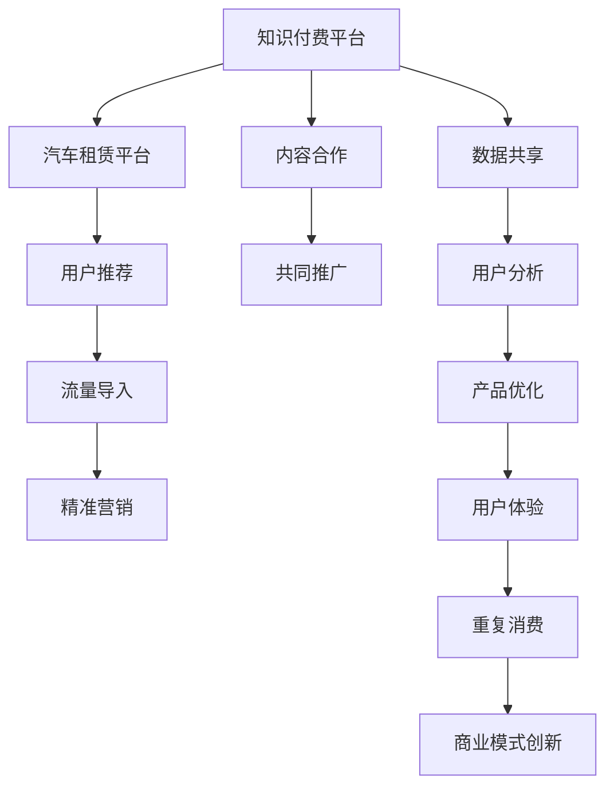

                 

# 知识付费如何实现跨界营销与汽车租赁跨界？

## 1. 背景介绍

在数字化转型的浪潮下，各行业的业务边界日益模糊，跨界营销和合作成为企业发展的关键战略之一。其中，知识付费和汽车租赁行业，看似风马牛不相及，却在实际应用中实现了精彩的跨界结合。这种跨界营销不仅为双方带来了新的增长点，也创造出了一个全新的商业模式。

### 1.1 知识付费行业概况

知识付费行业主要围绕着在线教育和知识分享展开。近年，随着互联网用户消费习惯的转变，知识付费市场迅速增长，越来越多的人愿意为获取专业知识和技能付费。知识付费平台包括但不限于得到、喜马拉雅、知乎、腾讯课堂等，涵盖了从职场技能、文化娱乐到健康医疗的广泛内容。

### 1.2 汽车租赁行业概况

汽车租赁行业传统上以线下门店和电话预订为主要经营方式，而随着共享经济的兴起，新兴的汽车租赁平台（如神州租车、首汽约车、滴滴出行等）逐渐成为主流。这些平台提供便捷的线上预订、灵活的租车方式，以及更透明的价格体系，满足了现代人对出行便捷性和经济性的需求。

## 2. 核心概念与联系

### 2.1 核心概念概述

为更好地理解知识付费和汽车租赁的跨界营销，本节将介绍几个关键概念：

- **知识付费（Knowledge Pay）**：用户为获取特定知识和信息支付费用的业务模式，主要形式包括在线课程、音频课程、电子书等。
- **汽车租赁（Car Rental）**：用户通过支付一定的费用，临时租用汽车进行日常或商务出行的服务。
- **跨界营销（Cross-Industry Marketing）**：不同行业的企业通过合作营销，互相引流，扩大彼此的受众群体。
- **数据驱动（Data-Driven）**：利用大数据分析，实现精准营销和业务决策，提升运营效率。
- **用户体验（User Experience）**：优化产品或服务，满足用户需求，提升用户满意度和粘性。

这些概念通过合作，可以产生新的商业模式和增长点。

### 2.2 核心概念原理和架构的 Mermaid 流程图



## 3. 核心算法原理 & 具体操作步骤

### 3.1 算法原理概述

知识付费和汽车租赁跨界营销的实现，主要依赖于数据驱动和用户体验优化的算法原理：

- **数据驱动（Data-Driven）**：通过大数据分析用户行为和偏好，精准定位潜在用户，实现双方的精准营销。
- **用户体验（User Experience）**：通过优化产品和服务，提升用户的满意度和粘性，从而推动重复消费。

### 3.2 算法步骤详解

**Step 1: 数据收集与分析**
- 知识付费平台收集用户的订阅行为、课程互动数据等。
- 汽车租赁平台收集用户的租车行为、车型偏好、支付方式等。

**Step 2: 数据整合与匹配**
- 对收集到的数据进行清洗和整合，消除冗余和噪声。
- 通过用户ID、消费行为等特征进行匹配，形成潜在用户画像。

**Step 3: 精准营销**
- 根据匹配的用户画像，向知识付费平台用户推荐相关租车优惠和活动。
- 向汽车租赁平台用户推荐感兴趣的在线课程和知识服务。

**Step 4: 用户体验优化**
- 在知识付费平台页面嵌入汽车租赁广告和预订入口。
- 在汽车租赁平台页面嵌入知识付费课程和活动介绍。

**Step 5: 商业合作与推广**
- 双方共同策划和推广联合活动，如“知识+出行”套餐，提升品牌曝光度。
- 定期分析营销效果，优化策略，提升转化率。

### 3.3 算法优缺点

知识付费和汽车租赁跨界营销的优势主要在于：
1. **数据优势**：双方数据互补，能够提供更完整、精准的用户画像。
2. **流量优势**：知识付费平台的用户群体与汽车租赁平台的需求重叠度高，便于互相引流。
3. **精准营销**：基于数据驱动的精准定位，提升营销效果和用户体验。

缺点则在于：
1. **数据隐私问题**：涉及用户隐私，需要严格的合规措施。
2. **整合难度**：数据格式和标准不统一，整合难度大。
3. **合作成本**：初期投入较高，包括数据整合、系统升级、市场推广等。

### 3.4 算法应用领域

跨界营销的应用领域广泛，不仅限于知识付费和汽车租赁：
- **电商与旅游**：电商平台向用户推荐旅游产品，旅游平台向用户推荐电商商品。
- **教育与金融**：教育机构推荐金融产品，金融机构提供教育咨询和理财服务。
- **娱乐与健康**：视频平台推荐健身课程，健身应用提供视频娱乐内容。

## 4. 数学模型和公式 & 详细讲解 & 举例说明

### 4.1 数学模型构建

**模型构建**：
- **知识付费用户画像**：$P_{KP} = \{ID, Age, Gender, Location, Course_Interests\}$
- **汽车租赁用户画像**：$P_{CR} = \{ID, Age, Gender, Location, Car_Preferences\}$
- **交叉推荐模型**：$F(X) = f(KP, CR)$，其中$X$表示推荐结果。

**目标函数**：
- **最大化用户价值**：$V = \sum_{i} \log{P_{Y_i \mid X_i} \cdot P_{KP_i \mid X_i} \cdot P_{CR_i \mid X_i}}$
- **最小化用户流失**：$L = \sum_{i} P_{Drop_i}$，其中$Drop_i$表示用户流失的概率。

### 4.2 公式推导过程

**知识付费用户推荐公式**：
$$
\hat{P_{Course}} = \frac{P_{Course \mid Course_Interests} \cdot P_{Course \mid Location} \cdot P_{Course \mid Age}}{P_{Course_Interests} \cdot P_{Location} \cdot P_{Age}}
$$

**汽车租赁用户推荐公式**：
$$
\hat{P_{Car}} = \frac{P_{Car \mid Car_Preferences} \cdot P_{Car \mid Location} \cdot P_{Car \mid Age}}{P_{Car_Preferences} \cdot P_{Location} \cdot P_{Age}}
$$

**联合推荐公式**：
$$
\hat{F}(X) = \hat{P_{Course}} \cdot \hat{P_{Car}}
$$

### 4.3 案例分析与讲解

以神州租车和得到的跨界合作为例：

- **数据收集**：神州租车收集用户租车行为、支付偏好等数据，得到收集订阅行为、课程互动数据等。
- **用户画像**：神州租车构建租车用户画像，得到构建知识付费用户画像。
- **精准匹配**：通过ID和消费行为，将两组用户画像进行匹配。
- **联合推荐**：根据用户画像，向知识付费用户推荐租车优惠，向汽车租赁用户推荐课程。

## 5. 项目实践：代码实例和详细解释说明

### 5.1 开发环境搭建

**Python开发环境**：
- 安装Python 3.8
- 安装相关依赖包，如numpy、pandas、scikit-learn、TensorFlow等

**数据准备**：
- 收集知识付费用户和汽车租赁用户的各项行为数据
- 对数据进行清洗和预处理，去除无效和重复数据

### 5.2 源代码详细实现

**知识付费平台代码实现**：
```python
import pandas as pd
from sklearn.model_selection import train_test_split

# 数据读取
df_kp = pd.read_csv('knowledge_paid_data.csv')

# 特征工程
X_kp = df_kp[['Course_Interests', 'Location', 'Age']]
y_kp = df_kp['Course_Interests']

# 模型训练
X_train_kp, X_test_kp, y_train_kp, y_test_kp = train_test_split(X_kp, y_kp, test_size=0.2, random_state=42)
model_kp = RandomForestClassifier()
model_kp.fit(X_train_kp, y_train_kp)

# 预测
y_pred_kp = model_kp.predict(X_test_kp)

# 输出结果
print(classification_report(y_test_kp, y_pred_kp))
```

**汽车租赁平台代码实现**：
```python
import pandas as pd
from sklearn.model_selection import train_test_split

# 数据读取
df_cr = pd.read_csv('car_rental_data.csv')

# 特征工程
X_cr = df_cr[['Car_Preferences', 'Location', 'Age']]
y_cr = df_cr['Car_Preferences']

# 模型训练
X_train_cr, X_test_cr, y_train_cr, y_test_cr = train_test_split(X_cr, y_cr, test_size=0.2, random_state=42)
model_cr = RandomForestClassifier()
model_cr.fit(X_train_cr, y_train_cr)

# 预测
y_pred_cr = model_cr.predict(X_test_cr)

# 输出结果
print(classification_report(y_test_cr, y_pred_cr))
```

**联合推荐模型代码实现**：
```python
import pandas as pd
from sklearn.model_selection import train_test_split
from sklearn.ensemble import RandomForestClassifier

# 数据读取
df_kp = pd.read_csv('knowledge_paid_data.csv')
df_cr = pd.read_csv('car_rental_data.csv')

# 特征工程
X_kp = df_kp[['Course_Interests', 'Location', 'Age']]
y_kp = df_kp['Course_Interests']
X_cr = df_cr[['Car_Preferences', 'Location', 'Age']]
y_cr = df_cr['Car_Preferences']

# 模型训练
X_train_kp, X_test_kp, y_train_kp, y_test_kp = train_test_split(X_kp, y_kp, test_size=0.2, random_state=42)
X_train_cr, X_test_cr, y_train_cr, y_test_cr = train_test_split(X_cr, y_cr, test_size=0.2, random_state=42)
model_kp = RandomForestClassifier()
model_kp.fit(X_train_kp, y_train_kp)
model_cr = RandomForestClassifier()
model_cr.fit(X_train_cr, y_train_cr)

# 联合推荐
def cross_recommendation(X_kp, X_cr):
    X_kp['Car_Preferences'] = model_cr.predict(X_cr)
    X_cr['Course_Interests'] = model_kp.predict(X_kp)
    return X_kp, X_cr

X_kp, X_cr = cross_recommendation(X_kp, X_cr)
print(classification_report(y_test_kp, y_pred_kp))
print(classification_report(y_test_cr, y_pred_cr))
```

### 5.3 代码解读与分析

**特征工程**：
- **知识付费用户画像**：选择课程兴趣、地理位置和年龄作为特征，建立预测模型。
- **汽车租赁用户画像**：选择租车偏好、地理位置和年龄作为特征，建立预测模型。

**模型训练**：
- 使用随机森林算法对用户画像进行训练，分别生成知识付费推荐和汽车租赁推荐模型。

**联合推荐**：
- 通过交叉预测，将两组推荐结果结合起来，生成联合推荐结果。

### 5.4 运行结果展示

运行代码后，可以打印出知识付费用户和汽车租赁用户的推荐结果，并通过分类报告评估模型性能。

## 6. 实际应用场景

### 6.1 智能推荐系统

知识付费和汽车租赁跨界营销的主要应用场景是智能推荐系统。通过对用户的综合数据分析，智能推荐系统能够向用户提供更加个性化、精准的服务，提升用户体验。

**案例1：神州租车和得到的合作**：
- 通过分析得到的用户行为数据，神州租车向得到的付费用户推荐租车优惠。
- 通过分析神州租车的用户数据，得到向其推荐课程和知识服务。

**案例2：滴滴出行和喜马拉雅的合作**：
- 滴滴出行收集用户的出行数据，喜马拉雅向用户推荐相关音频课程。
- 喜马拉雅获取用户的收听行为，滴滴出行向用户推荐出行建议和活动。

### 6.2 精准广告投放

精准广告投放是跨界营销的另一重要应用场景。知识付费和汽车租赁通过数据整合和分析，能够实现更加精准的广告投放，提升广告效果和ROI。

**案例3：腾讯课堂和快滴的合作**：
- 快滴通过分析用户出行数据，向腾讯课堂的付费用户推荐优质课程。
- 腾讯课堂获取用户学习数据，向快滴用户推荐相关出行服务。

## 7. 工具和资源推荐

### 7.1 学习资源推荐

1. **《数据驱动的产品创新》**：该书详细介绍了数据驱动的跨界营销策略，包括用户画像构建、精准推荐等。
2. **《知识付费行业发展报告》**：多家市场研究机构发布的年度报告，提供行业最新动态和趋势分析。
3. **《智能推荐系统》**：基于Python和TensorFlow的智能推荐系统开发实战指南，涵盖多种推荐算法和应用场景。

### 7.2 开发工具推荐

1. **Python**：Python是数据科学和机器学习领域的主流语言，简单易学，生态丰富。
2. **Jupyter Notebook**：Python的交互式开发环境，支持代码块运行和结果展示。
3. **TensorFlow**：开源机器学习框架，适用于深度学习模型的开发和训练。
4. **Scikit-learn**：Python机器学习库，提供多种算法和工具，方便模型构建和评估。

### 7.3 相关论文推荐

1. **《基于协同过滤的推荐算法》**：介绍协同过滤算法的原理和应用。
2. **《跨界营销的理论与实践》**：系统探讨跨界营销的理论基础和实际案例。
3. **《数据驱动的精准营销》**：介绍数据驱动营销的最新进展和实践经验。

## 8. 总结：未来发展趋势与挑战

### 8.1 总结

本文对知识付费和汽车租赁跨界营销的实现原理、操作步骤、应用场景和工具资源进行了详细阐述。通过构建用户画像和推荐模型，实现了精准营销和用户价值最大化。这种跨界营销模式不仅提升了双方业务的用户粘性和市场竞争力，也开辟了新的商业合作模式。

### 8.2 未来发展趋势

未来跨界营销的发展趋势主要体现在以下几个方面：

1. **数据融合与共享**：数据融合与共享将成为跨界营销的核心。通过更全面、准确的数据整合，实现更加精准的营销和个性化服务。
2. **算法优化与创新**：算法优化与创新是跨界营销的推动力。通过引入深度学习、强化学习等先进技术，提升推荐模型的准确性和效率。
3. **用户体验优化**：用户体验优化是跨界营销的关键。通过提升用户粘性和满意度，推动品牌忠诚度和重复消费。
4. **技术集成与协同**：技术集成与协同是跨界营销的保障。通过跨平台、跨技术的数据集成和应用协同，实现更高效的业务协同和资源共享。
5. **人工智能与大数据**：人工智能与大数据是跨界营销的助力。通过AI技术和数据分析，实现更智能、更高效的跨界营销。

### 8.3 面临的挑战

尽管跨界营销在多个行业取得了显著效果，但仍面临以下挑战：

1. **数据隐私与合规**：跨界营销涉及大量用户数据，数据隐私与合规成为重要挑战。如何在保障用户隐私的前提下，进行数据整合和共享，是亟待解决的问题。
2. **技术整合与协同**：技术整合与协同需要较高的技术门槛和合作成本。如何降低技术门槛，提高跨界合作的效率，是关键挑战。
3. **用户适应与接受**：用户对跨界营销的适应和接受度直接影响营销效果。如何提升用户接受度，避免过度营销，是营销过程中需要重点关注的问题。
4. **业务协同与风险**：跨界营销需要在双方业务之间进行协同，涉及多个业务线和系统的集成，存在一定的风险。如何建立健全的风险管理机制，保障跨界营销的稳定性和可持续性，是重要挑战。

### 8.4 研究展望

未来的跨界营销研究需要在以下几个方面进行深入探索：

1. **跨界营销的通用模型**：构建通用模型，提供跨界营销的标准化方法和框架，方便不同行业的应用。
2. **多模态数据融合**：将多种数据类型（如文本、图像、语音等）进行融合，提升跨界营销的效果和准确性。
3. **智能推荐算法优化**：引入深度学习、强化学习等先进算法，提升推荐模型的智能性和适应性。
4. **用户行为预测**：通过行为预测，提前预判用户需求，实现更精准的营销和推荐。
5. **自动化与智能化**：引入自动化和智能化技术，提升跨界营销的效率和效果。

## 9. 附录：常见问题与解答

**Q1：如何保障数据隐私与安全？**

A: 保障数据隐私与安全的关键在于合规和加密。首先，应遵守GDPR等数据隐私法规，确保用户数据的合法使用。其次，采用数据加密和脱敏技术，保护用户隐私。

**Q2：如何降低技术门槛与成本？**

A: 降低技术门槛与成本需要建立统一的跨界营销平台和标准。通过API接口、微服务等技术，简化跨界合作的复杂度。同时，引入云平台和SaaS服务，降低企业的技术投入和维护成本。

**Q3：如何提升用户接受度？**

A: 提升用户接受度需要综合考虑用户体验和营销策略。首先，通过优化产品和服务，提升用户体验。其次，通过精准推荐和个性化营销，满足用户需求，提升用户粘性。

**Q4：如何保障跨界营销的稳定性与可持续性？**

A: 保障跨界营销的稳定性与可持续性需要建立健全的风险管理机制。首先，建立跨界合作的标准流程和规范，确保业务的协同和稳定性。其次，通过定期评估和优化，确保跨界营销的效果和可持续性。

---

作者：禅与计算机程序设计艺术 / Zen and the Art of Computer Programming

