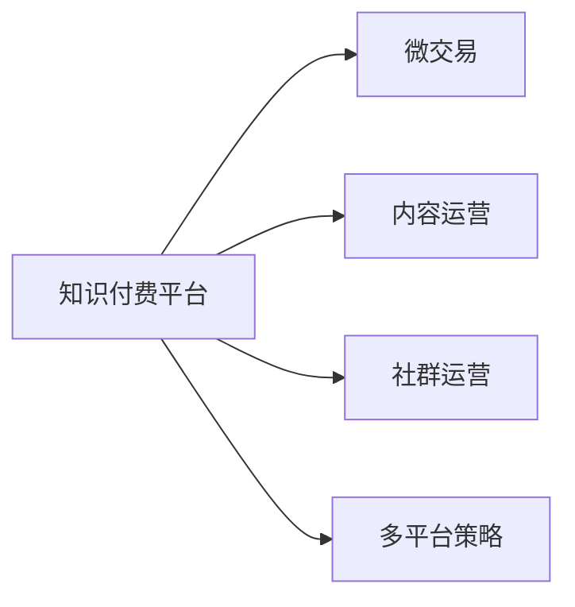

                 

## 1. 背景介绍

随着互联网与科技的迅猛发展，知识付费领域迎来了前所未有的机遇与挑战。近几年来，知识付费市场迅速扩增，知识付费平台的数量也在不断增长，涌现出一批优秀的知识付费品牌。本文以程序员创业成功案例为例，深入分析了知识付费平台的运营模式与运营策略，为创业者和知识付费平台提供了宝贵的经验与借鉴。

## 2. 核心概念与联系

### 2.1 核心概念概述

- **知识付费平台**：以订阅制、单次付费、免费试用等方式，提供有价值知识内容的平台，如得到、知乎live、樊登读书会等。
- **微交易**：用户无需付费即可获取部分免费内容，通过小额付费获取更优质内容的运营策略。
- **内容运营**：以内容为核心，通过精选、定制、推荐等手段，提升用户粘性与留存率。
- **社群运营**：以社群为载体，通过用户互动、内容分享、推荐系统等手段，增强用户参与度与社区氛围。
- **多平台策略**：在多个平台（如微信、微博、抖音等）同时发布内容，扩大用户覆盖面。

### 2.2 核心概念联系（备注：必须给出核心概念原理和架构的 Mermaid 流程图(Mermaid 流程节点中不要有括号、逗号等特殊字符)



## 3. 核心算法原理 & 具体操作步骤

### 3.1 算法原理概述

知识付费平台的运营，核心在于构建一个高粘性、高转换率的生态系统。算法原理可以分为以下几个部分：

- **用户行为分析**：通过收集用户的访问记录、点击行为、付费行为等数据，进行用户画像与行为分析，理解用户需求与兴趣。
- **推荐算法**：基于用户画像与行为数据，采用协同过滤、深度学习等算法，为用户推荐个性化内容。
- **运营策略优化**：根据推荐算法的效果，不断优化内容与活动策略，提升用户粘性与留存率。
- **广告与收益转化**：利用算法进行精准投放，提高广告与付费内容的收益转化率。

### 3.2 算法步骤详解

1. **用户画像构建**：
   - 收集用户数据，包括注册信息、浏览历史、购买记录等。
   - 通过用户行为数据，利用K-means、LDA等聚类算法，将用户分为不同的群体。
   - 对每个群体，建立用户画像，描述其兴趣偏好与需求。

2. **推荐系统构建**：
   - 选择合适的推荐算法，如协同过滤、基于内容的推荐、深度学习等。
   - 基于用户画像，对推荐模型进行训练，生成个性化推荐结果。
   - 对推荐结果进行评估与迭代优化，提升推荐效果。

3. **运营策略优化**：
   - 根据推荐效果，进行A/B测试，优化活动与内容策略。
   - 利用多臂老虎机算法等方法，动态调整内容与活动发布策略。
   - 结合用户反馈，实时调整推荐系统参数。

4. **广告与收益转化**：
   - 利用用户画像与推荐系统，精准投放广告内容。
   - 对付费内容进行细分，针对不同用户群体，设计差异化的付费方案。
   - 利用算法进行付费转化预测，优化用户转化率。

### 3.3 算法优缺点

**优点**：
- 能够高效构建用户画像与个性化推荐，提升用户粘性与留存率。
- 精准投放广告与内容，提高转化率与收益。
- 持续优化推荐与运营策略，保持生态系统的健康与活力。

**缺点**：
- 数据隐私与安全问题：用户数据的收集与分析可能引起隐私泄露。
- 算法模型复杂度高：需要投入大量资源进行模型训练与优化。
- 算法解释性不足：用户难以理解推荐系统与运营策略的决策依据。

### 3.4 算法应用领域

算法应用领域包括但不限于：
- **内容推荐**：如课程推荐、文章推荐等。
- **活动运营**：如直播活动、专题课程等。
- **广告投放**：如KOL推广、精准广告等。
- **用户转化**：如付费课程、专题报告等。

## 4. 数学模型和公式 & 详细讲解

### 4.1 数学模型构建

知识付费平台的运营，涉及众多数学模型与算法。这里重点介绍协同过滤推荐算法与多臂老虎机算法。

协同过滤推荐算法基于用户与物品的相似度，进行个性化推荐。推荐模型可以表示为：

$$ R_{ui} = \alpha u_i + \beta i_u $$

其中，$R_{ui}$ 为用户 $u$ 对物品 $i$ 的评分，$u_i$ 为用户 $u$ 对物品 $i$ 的评分向量，$i_u$ 为物品 $i$ 对用户 $u$ 的评分向量，$\alpha$ 和 $\beta$ 为模型参数。

多臂老虎机算法用于优化活动发布策略，将内容与活动分为多个“手臂”，选择最优的手臂进行发布。算法模型可以表示为：

$$ Q(t,a) = \sum_{i=1}^n Q_i(t,a) $$

其中，$Q(t,a)$ 为时间 $t$ 选择动作 $a$ 的期望收益，$Q_i(t,a)$ 为选择动作 $a$ 在物品 $i$ 上的期望收益，$n$ 为物品总数。

### 4.2 公式推导过程

1. **协同过滤推荐算法**：
   - 根据用户 $u$ 对物品 $i$ 的评分向量 $u_i$ 和物品 $i$ 对用户 $u$ 的评分向量 $i_u$，利用矩阵分解算法（如奇异值分解SVD），得到低维嵌入向量 $\alpha$ 和 $\beta$。
   - 利用嵌入向量，计算用户 $u$ 对物品 $i$ 的预测评分 $R_{ui}$，利用预测评分进行推荐排序。

2. **多臂老虎机算法**：
   - 选择某个物品 $i$ 进行发布，并记录用户对该物品的点击率、转化率等数据。
   - 根据历史数据，计算每个物品的平均收益 $Q_i$，选取平均收益最大的物品进行发布。
   - 利用探索-利用策略（如$\epsilon$-greedy），平衡探索与利用，优化活动发布策略。

### 4.3 案例分析与讲解

以知乎live为例，其知识付费平台的推荐系统基于协同过滤算法，利用用户行为数据进行个性化推荐。具体流程如下：
1. 收集用户注册信息、浏览历史、课程评分等数据。
2. 通过K-means算法对用户进行聚类，建立用户画像。
3. 利用协同过滤算法，对用户进行个性化推荐。
4. 根据推荐效果，进行A/B测试，优化推荐策略。

## 5. 项目实践：代码实例和详细解释说明

### 5.1 开发环境搭建

**环境配置**：
- **Python**：版本3.7以上，安装pip、numpy、pandas、scikit-learn等依赖。
- **数据库**：MySQL或MongoDB。
- **Web框架**：Flask或Django。
- **推荐算法库**：scikit-learn、tensorflow等。

### 5.2 源代码详细实现

以Flask框架为例，具体代码如下：

```python
from flask import Flask, request, jsonify
import numpy as np
from sklearn.neighbors import NearestNeighbors

app = Flask(__name__)

# 构建推荐系统
def build_recommender(data, n_neighbors=5):
    X = data['user_survey'].to_numpy()
    user_to_id = {k: v for k, v in enumerate(data['user_id'])}
    neighbor_matrix = NearestNeighbors(n_neighbors=n_neighbors).fit(X)
    return user_to_id, neighbor_matrix

# 获取推荐结果
@app.route('/recommend', methods=['POST'])
def get_recommendation():
    user_id = request.json['user_id']
    user_to_id, neighbor_matrix = build_recommender(train_data)
    distances, indices = neighbor_matrix.kneighbors(np.array([train_data[user_id].to_numpy()]))
    recommends = []
    for i in indices[0]:
        recommends.append(user_to_id[i])
    return jsonify(recommends)

if __name__ == '__main__':
    app.run(debug=True)
```

### 5.3 代码解读与分析

**代码结构说明**：
- **Flask应用**：通过Flask框架搭建Web服务，处理HTTP请求。
- **推荐系统构建**：使用scikit-learn的NearestNeighbors算法，构建推荐模型。
- **推荐结果获取**：根据用户ID，获取推荐结果，并返回JSON格式数据。

**代码功能实现**：
- **build_recommender函数**：构建推荐系统，返回用户ID与邻居矩阵。
- **get_recommendation函数**：根据用户ID，获取推荐结果，返回推荐物品ID。
- **Flask路由**：通过Flask路由，处理推荐请求，返回推荐结果。

**运行结果展示**：
- 在命令行中运行代码，启动Flask应用。
- 通过接口请求，获取推荐结果，格式为JSON数组。

## 6. 实际应用场景

### 6.1 知识付费平台案例

以得到为例，得到平台采用订阅制与单次付费结合的模式，通过推荐系统与社群运营，提升用户粘性与留存率。

**推荐系统**：
- 基于用户行为数据，利用协同过滤算法，进行个性化推荐。
- 定期更新用户画像与评分数据，优化推荐结果。

**社群运营**：
- 通过Q&A功能、圈子功能，建立用户社区。
- 定期举办活动、课程，增强用户参与度与社区氛围。

### 6.2 内容付费平台案例

以小鹅通为例，小鹅通平台采用内容付费与广告变现结合的模式，通过精准广告投放与运营策略优化，提升用户付费转化率。

**精准广告投放**：
- 利用用户画像与推荐系统，精准投放广告内容。
- 对广告效果进行评估与优化，提高广告转化率。

**运营策略优化**：
- 根据用户行为数据，进行A/B测试，优化课程设计。
- 利用多臂老虎机算法，动态调整课程发布策略。

## 7. 工具和资源推荐

### 7.1 学习资源推荐

**书籍推荐**：
1. 《知识付费：运营的艺术与策略》
2. 《用户行为分析与推荐算法》

**课程推荐**：
1. 《Python推荐系统实战》
2. 《知识付费平台的运营策略》

**在线资源**：
1. Coursera：推荐系统、用户行为分析等课程。
2. Udacity：数据科学与人工智能相关课程。

### 7.2 开发工具推荐

**开发工具**：
1. PyCharm：Python开发环境，支持代码高亮、调试等功能。
2. Jupyter Notebook：数据处理、模型训练与调试的利器。

**数据处理工具**：
1. Pandas：数据处理与分析，支持SQL查询与数据清洗。
2. NumPy：科学计算与数值处理。

### 7.3 相关论文推荐

**推荐系统相关论文**：
1. 《协同过滤推荐系统》
2. 《深度学习推荐系统》

**用户行为分析相关论文**：
1. 《多臂老虎机算法》
2. 《探索-利用策略》

## 8. 总结：未来发展趋势与挑战

### 8.1 研究成果总结

本文从知识付费平台的运营模式与运营策略入手，分析了微交易、内容运营、社群运营与多平台策略的核心算法原理与具体操作步骤。通过具体案例与代码实例，阐述了知识付费平台运营的实现细节。

### 8.2 未来发展趋势

知识付费平台的未来发展趋势包括以下几个方向：
- **算法模型创新**：引入深度学习、强化学习等先进算法，提升推荐效果。
- **个性化推荐**：引入更多特征与信息，进行更精细的用户画像构建。
- **用户交互升级**：利用聊天机器人、语音交互等技术，提升用户体验。
- **广告与变现**：利用数据与算法，进行精准广告投放与收益转化。

### 8.3 面临的挑战

知识付费平台在运营过程中，面临以下挑战：
- **数据隐私与安全**：用户数据的收集与分析可能引起隐私泄露。
- **算法复杂度**：算法模型复杂度高，需要投入大量资源进行训练与优化。
- **用户转化率**：部分用户对付费内容接受度不高，转化率较低。

### 8.4 研究展望

未来的研究应在以下方向进行突破：
- **推荐系统优化**：结合多维特征与多种算法，提升推荐效果与多样性。
- **广告与变现策略**：探索更多精准投放与收益转化的新方法。
- **用户行为研究**：深入分析用户行为，进行更加精细的用户画像构建。

## 9. 附录：常见问题与解答

**Q1：什么是知识付费平台？**

A: 知识付费平台是以订阅制、单次付费、免费试用等方式，提供有价值知识内容的平台，如得到、知乎live、樊登读书会等。

**Q2：知识付费平台如何提升用户粘性与留存率？**

A: 知识付费平台通过以下方式提升用户粘性与留存率：
1. 个性化推荐：利用协同过滤推荐算法，进行个性化内容推荐。
2. 社群运营：通过Q&A功能、圈子功能，建立用户社区。
3. 精准广告投放：利用用户画像与推荐系统，精准投放广告内容。
4. 活动运营：定期举办活动、课程，增强用户参与度与社区氛围。

**Q3：推荐系统中的协同过滤算法原理是什么？**

A: 协同过滤推荐算法基于用户与物品的相似度，进行个性化推荐。具体流程如下：
1. 收集用户数据，包括注册信息、浏览历史、课程评分等。
2. 通过K-means算法对用户进行聚类，建立用户画像。
3. 利用协同过滤算法，对用户进行个性化推荐。
4. 根据推荐效果，进行A/B测试，优化推荐策略。

**Q4：知识付费平台的运营策略优化有哪些方法？**

A: 知识付费平台的运营策略优化方法包括：
1. A/B测试：通过多臂老虎机算法，进行精准投放与收益转化。
2. 动态调整：根据用户行为数据，动态调整内容与活动发布策略。
3. 实时优化：结合用户反馈，实时调整推荐系统参数。

**Q5：如何利用算法进行精准广告投放？**

A: 利用算法进行精准广告投放的方法包括：
1. 用户画像构建：通过收集用户数据，利用聚类算法构建用户画像。
2. 推荐系统构建：利用协同过滤算法，进行个性化推荐。
3. 广告效果评估：对广告效果进行评估与优化，提高广告转化率。
4. 精准投放：利用用户画像与推荐系统，精准投放广告内容。

**Q6：知识付费平台的数据隐私与安全问题如何解决？**

A: 知识付费平台的数据隐私与安全问题解决方法包括：
1. 数据匿名化：对用户数据进行匿名化处理，保护用户隐私。
2. 数据加密：对敏感数据进行加密，防止数据泄露。
3. 用户同意：在数据收集与使用过程中，获取用户同意。
4. 安全审计：定期进行安全审计，确保数据安全。

---

作者：禅与计算机程序设计艺术 / Zen and the Art of Computer Programming

