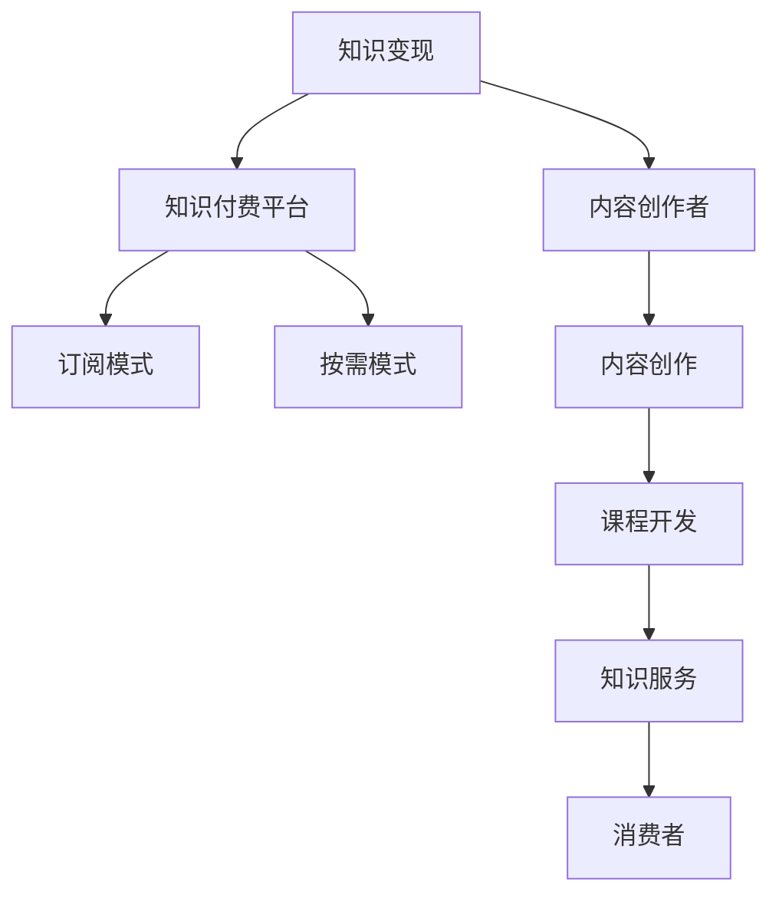

                 

# 知识付费时代来临：如何从知识变现中获利？

> 关键词：知识变现, 知识付费, 在线教育, 人工智能, 大数据, 区块链, 知识图谱

## 1. 背景介绍

在数字化、信息化的浪潮中，知识和信息已经成为了稀缺资源，如何高效地获取和利用这些资源，成为了企业和个人的重要课题。尤其是随着互联网和智能技术的不断成熟，知识的传播和获取方式发生了根本性的改变，知识付费逐渐成为一种新型的商业模式。本文将从知识付费的兴起背景、主要参与者和现状入手，探讨如何从知识变现中获利。

### 1.1 知识付费的兴起背景

1.1.1 信息过载与筛选困难
现代社会信息爆炸，每天都有大量信息产生，无论是专业领域还是日常生活中，都面临信息过载的问题。用户在如此大量的信息中寻找有用的内容，常常感到困难和困惑。

1.1.2 知识和技能提升需求
在知识更新迭代加速的今天，个人和企业为了保持竞争力，需要不断学习和更新知识。然而，传统的教育和培训模式已经无法满足快速变化的需求。

1.1.3 消费者支付意愿提升
随着经济水平的提升，人们的消费能力和意愿也在增强，愿意为优质、有价值的内容付费，从而提高了知识付费的市场潜力。

### 1.2 主要参与者

1.2.1 内容创作者
知识付费的崛起为内容创作者提供了新的收入来源。无论是专业领域的专家、学者，还是普通爱好者，都可以通过撰写文章、制作视频、开设课程等方式，将自己的知识和技能变现。

1.2.2 平台提供商
知识付费平台是连接内容创作者和消费者的中介，如网易云课堂、得到、知乎live等，通过提供平台和技术支持，实现了知识的交易。

1.2.3 消费者
消费者是知识付费市场的最终用户，愿意为有价值的内容支付费用，并享受优质的知识服务。

## 2. 核心概念与联系

### 2.1 核心概念概述

为更好地理解知识付费的商业模式，本节将介绍几个关键概念：

- **知识变现**：指将知识和技能转化为经济收益的过程，包括内容创作、课程开发、知识服务等多种形式。

- **知识付费平台**：提供知识服务交易的中间平台，连接内容创作者和消费者，提供课程管理、付费机制、用户互动等功能。

- **内容创作者**：通过提供有价值的知识和信息，获取消费者的付费，实现知识变现。

- **消费者**：愿意为有价值的内容付费，享受知识服务的个人或企业。

- **订阅模式**：用户定期支付固定费用，获取平台提供的持续知识服务。

- **按需模式**：用户根据具体需求，按次付费购买单次服务或课程。

这些核心概念之间的逻辑关系可以通过以下Mermaid流程图来展示：



这个流程图展示了知识变现过程的主要参与者和相关活动：

1. 知识变现通过内容创作者创作有价值的内容，并将其转化为经济收益。
2. 知识付费平台为内容创作者和消费者提供交易平台，实现知识服务的交易。
3. 订阅模式和按需模式是知识付费平台的主要盈利模式。
4. 内容创作者通过提供课程、文章等服务获取收入。
5. 消费者通过订阅或购买服务，获取知识服务。

## 3. 核心算法原理 & 具体操作步骤

### 3.1 算法原理概述

知识付费的变现算法主要基于供需关系和市场机制。具体而言，平台通过收集用户需求、分析市场趋势，匹配合适的知识服务，从而实现知识的交易和变现。

1. **需求分析**：平台通过数据分析和算法推荐，了解用户的兴趣和需求，为用户提供个性化的知识服务推荐。

2. **匹配算法**：平台使用匹配算法，将内容创作者和消费者进行精准匹配，提高交易效率和用户满意度。

3. **定价策略**：平台根据内容价值和市场供需情况，设定合理的课程价格，同时提供优惠活动和奖励机制，吸引更多用户。

4. **反馈机制**：平台通过用户反馈，不断优化推荐和匹配算法，提高服务质量和用户满意度。

### 3.2 算法步骤详解

以下详细介绍知识付费变现的核心算法步骤：

1. **用户需求分析**：平台通过用户行为数据和调研问卷，了解用户的知识需求和兴趣。

2. **内容匹配**：平台根据用户需求，使用推荐算法匹配合适的知识服务，如相关课程、文章等。

3. **内容推荐**：平台向用户推荐匹配结果，并提供免费试听、试读等功能，让用户预览内容质量。

4. **购买决策**：用户根据推荐结果和自己的需求，决定是否购买知识服务。

5. **支付与消费**：用户完成购买后，平台提供课程观看、阅读等服务，并记录消费数据。

6. **反馈与优化**：平台根据用户的反馈和评价，不断优化推荐和匹配算法，提高服务质量。

### 3.3 算法优缺点

知识付费变现算法具有以下优点：

1. **高效匹配**：通过算法推荐，能够快速将合适的知识服务匹配给用户，提高交易效率。

2. **个性化服务**：根据用户需求和偏好，提供个性化的知识服务推荐，满足不同用户的需求。

3. **市场敏感度**：能够及时响应市场变化和用户需求，灵活调整课程和价格策略。

然而，该算法也存在以下缺点：

1. **数据依赖**：算法的推荐效果依赖于用户数据的充分性和准确性，数据质量不足可能导致推荐结果偏差。

2. **市场风险**：市场需求和趋势的变化可能导致课程匹配偏差，影响用户满意度。

3. **算法偏见**：推荐算法可能存在偏见，导致某些类型的知识和技能无法被有效推广。

4. **隐私问题**：平台收集用户数据进行分析，可能涉及隐私保护问题。

### 3.4 算法应用领域

知识付费变现算法已经在多个领域得到广泛应用，包括：

1. **在线教育**：通过平台推荐，用户能够获取到合适的课程和培训，提升自身技能和知识水平。

2. **专业咨询**：专家和学者通过平台提供咨询服务，帮助企业和个人解决专业问题。

3. **技能培训**：通过课程开发，用户能够掌握各种实用技能，如编程、外语、市场营销等。

4. **健康管理**：通过健康知识服务，用户能够获取科学的健康知识和指导，提高生活质量。

5. **旅游文化**：通过旅游知识服务，用户能够获取旅游攻略、文化历史等知识，提升旅游体验。

## 4. 数学模型和公式 & 详细讲解 & 举例说明

### 4.1 数学模型构建

知识付费变现的数学模型主要包括用户需求模型、内容匹配模型和定价模型。

- **用户需求模型**：通过用户行为数据和调研数据，构建用户兴趣和需求模型，用于个性化推荐。

- **内容匹配模型**：使用匹配算法，将用户需求与内容创作者进行匹配，选择合适的知识服务。

- **定价模型**：根据内容价值和市场需求，设定合理的课程价格，并根据用户反馈进行动态调整。

### 4.2 公式推导过程

1. **用户需求模型**

假设用户需求可以用向量 $\mathbf{u}$ 表示，其中 $\mathbf{u} = (u_1, u_2, ..., u_n)$，每个维度 $u_i$ 表示用户对知识领域 $i$ 的兴趣度。

根据用户历史行为数据，可以构建用户需求模型：

$$
\mathbf{u} = \mathbf{w}^T \mathbf{x} + b
$$

其中 $\mathbf{w}$ 为权重向量，$\mathbf{x}$ 为用户行为数据，$b$ 为偏置项。

2. **内容匹配模型**

内容创作者的知识服务可以用向量 $\mathbf{c}$ 表示，其中 $\mathbf{c} = (c_1, c_2, ..., c_n)$，每个维度 $c_i$ 表示创作者在知识领域 $i$ 的专业度。

匹配算法可以使用余弦相似度来衡量用户和创作者之间的匹配程度：

$$
\text{similarity} = \frac{\mathbf{u} \cdot \mathbf{c}}{\|\mathbf{u}\| \cdot \|\mathbf{c}\|}
$$

3. **定价模型**

课程价格可以通过价值函数 $P(u, c)$ 来计算，其中 $u$ 为用户需求，$c$ 为创作者知识服务的质量。

定价模型可以是线性函数：

$$
P(u, c) = k \cdot u \cdot c
$$

其中 $k$ 为价格系数。

### 4.3 案例分析与讲解

以在线教育平台为例，平台根据用户的学习历史和行为数据，构建用户需求模型：

假设用户历史行为数据为：

$$
\mathbf{x} = \begin{bmatrix} x_{1,1} & x_{1,2} & \cdots & x_{1,n} \end{bmatrix}^T
$$

其中 $x_{1,i}$ 表示用户对知识领域 $i$ 的兴趣度。

通过线性回归模型，可以计算出用户需求向量 $\mathbf{u}$：

$$
\mathbf{u} = \mathbf{w}^T \mathbf{x} + b
$$

假设内容创作者的课程质量向量为：

$$
\mathbf{c} = \begin{bmatrix} c_{1,1} & c_{1,2} & \cdots & c_{1,n} \end{bmatrix}^T
$$

其中 $c_{1,i}$ 表示创作者在知识领域 $i$ 的专业度。

使用余弦相似度计算匹配程度：

$$
\text{similarity} = \frac{\mathbf{u} \cdot \mathbf{c}}{\|\mathbf{u}\| \cdot \|\mathbf{c}\|}
$$

假设课程价格函数为：

$$
P(u, c) = k \cdot u \cdot c
$$

其中 $k$ 为价格系数。

根据匹配结果和定价模型，平台可以为用户推荐合适的课程，并根据用户反馈进行动态调整。

## 5. 项目实践：代码实例和详细解释说明

### 5.1 开发环境搭建

在进行知识付费平台开发前，我们需要准备好开发环境。以下是使用Python进行Django开发的环境配置流程：

1. 安装Anaconda：从官网下载并安装Anaconda，用于创建独立的Python环境。

2. 创建并激活虚拟环境：
```bash
conda create -n django-env python=3.8 
conda activate django-env
```

3. 安装Django：使用pip安装Django框架，并创建项目和应用：
```bash
pip install django
django-admin startproject project_name
cd project_name
python manage.py startapp app_name
```

4. 安装必要的第三方库：
```bash
pip install Pillow psycopg2 django-cors-headers django-simple-course
```

完成上述步骤后，即可在`django-env`环境中开始项目开发。

### 5.2 源代码详细实现

以下是一个简单的知识付费平台课程推荐系统的代码实现。

**用户需求模型**

```python
from sklearn.linear_model import LinearRegression

class UserProfile:
    def __init__(self, user_id):
        self.user_id = user_id
        self.x_train = None
        self.x_test = None
        self.u_train = None
        self.u_test = None

    def train(self, x_train):
        self.x_train = x_train
        self.u_train = LinearRegression().fit(x_train, self.y_train)

    def predict(self, x_test):
        self.x_test = x_test
        self.u_test = self.u_train.predict(self.x_test)
        return self.u_test

    def save(self):
        with open('user_profile.pickle', 'wb') as f:
            pickle.dump(self, f)
```

**内容匹配模型**

```python
from sklearn.metrics.pairwise import cosine_similarity

class ContentProvider:
    def __init__(self, content_id):
        self.content_id = content_id
        self.c_train = None
        self.c_test = None

    def train(self, c_train):
        self.c_train = c_train

    def predict(self, u_test):
        self.c_test = self.c_train
        similarity = cosine_similarity(u_test.reshape(1, -1), self.c_test)
        return similarity[0]
```

**定价模型**

```python
from sklearn.linear_model import LinearRegression

class PricingModel:
    def __init__(self, k):
        self.k = k
        self.c_train = None
        self.c_test = None

    def train(self, c_train, u_train):
        self.c_train = c_train
        self.u_train = u_train
        self.p_train = LinearRegression().fit(u_train.reshape(-1, 1), self.c_train)

    def predict(self, u_test):
        self.u_test = u_test.reshape(-1, 1)
        self.p_test = self.p_train.predict(self.u_test)
        return self.p_test * self.c_train
```

**推荐系统**

```python
class RecommendationSystem:
    def __init__(self, user_profiles, content_providers, pricing_models):
        self.user_profiles = user_profiles
        self.content_providers = content_providers
        self.pricing_models = pricing_models

    def recommend(self, user_id):
        user_profile = self.user_profiles[user_id]
        user_demand = user_profile.predict(user_profile.x_test)
        content_similarity = self.content_providers[user_profile.x_test].predict(user_demand)
        pricing_model = self.pricing_models[user_profile.x_test]
        pricing = pricing_model.predict(user_demand)
        return pricing * content_similarity
```

**测试**

```python
# 假设用户行为数据为x_train和x_test，课程质量数据为c_train和c_test
user_profile = UserProfile(user_id)
user_profile.train(x_train)
user_profile.predict(x_test)

content_provider = ContentProvider(content_id)
content_provider.train(c_train)
content_provider.predict(u_test)

pricing_model = PricingModel(k)
pricing_model.train(c_train, u_train)
pricing_model.predict(u_test)

recommendation_system = RecommendationSystem(user_profiles, content_providers, pricing_models)
recommendation_system.recommend(user_id)
```

### 5.3 代码解读与分析

让我们再详细解读一下关键代码的实现细节：

**UserProfile类**

- `train`方法：训练用户需求模型。
- `predict`方法：预测用户需求向量。
- `save`方法：将用户需求模型保存到本地文件。

**ContentProvider类**

- `train`方法：训练内容匹配模型。
- `predict`方法：计算用户和内容之间的匹配程度。

**PricingModel类**

- `train`方法：训练定价模型。
- `predict`方法：根据用户需求和课程质量计算价格。

**RecommendationSystem类**

- `recommend`方法：综合用户需求、内容匹配和定价模型，生成推荐结果。

这些类和方法通过协同工作，实现了课程推荐系统的核心功能，包括用户需求分析、内容匹配和定价计算。

## 6. 实际应用场景

### 6.1 在线教育

在线教育平台通过知识付费变现算法，提供个性化的课程推荐，提高用户学习效率和满意度。用户可以根据自己的兴趣和学习进度，选择适合的课程，并获得相应的知识服务。

**应用案例**：Coursera、edX、Udacity等在线教育平台，通过精准的课程推荐，实现了大规模用户增长和课程销售。

### 6.2 专业咨询

专业咨询机构通过知识付费变现算法，为用户提供个性化的专业咨询服务，帮助企业和个人解决实际问题。通过平台推荐和付费机制，咨询机构能够获得稳定的收入来源。

**应用案例**：LinkedIn Learning、咨询公司等，通过平台推荐和付费机制，实现了专业知识和技能的市场化。

### 6.3 技能培训

技能培训平台通过知识付费变现算法，提供多样化的技能培训课程，满足不同用户的学习需求。通过个性化推荐和付费机制，平台能够提供高效的知识服务。

**应用案例**：网易云课堂、Udemy等，通过个性化的课程推荐，实现了大规模用户增长和课程销售。

### 6.4 健康管理

健康管理平台通过知识付费变现算法，提供科学的健康知识和指导，提高用户生活质量。通过平台推荐和付费机制，平台能够获得稳定的收入来源。

**应用案例**：Fitbit、MyFitnessPal等，通过个性化健康知识推荐，实现了用户健康管理的商业化。

### 6.5 旅游文化

旅游文化平台通过知识付费变现算法，提供旅游攻略、文化历史等知识服务，提升用户旅游体验。通过平台推荐和付费机制，平台能够提供有价值的知识服务。

**应用案例**：TripAdvisor、Lonely Planet等，通过个性化旅游知识推荐，实现了用户旅游体验的提升。

## 7. 工具和资源推荐

### 7.1 学习资源推荐

为了帮助开发者系统掌握知识付费变现的理论基础和实践技巧，这里推荐一些优质的学习资源：

1. **《知识变现的艺术》系列博文**：由知识变现专家撰写，深入浅出地介绍了知识变现的商业模式、技术实现和市场策略。

2. **Coursera《在线教育设计与开发》课程**：由斯坦福大学开设的在线教育课程，涵盖课程设计、平台开发和市场推广等方面，适合开发者深入学习。

3. **《知识付费变现手册》书籍**：全面介绍了知识付费变现的商业模式、技术实现和市场策略，适合开发者全面掌握。

4. **Coursera官方文档**：Coursera平台的官方文档，提供了详细的平台开发指南和技术支持，适合开发者实践。

5. **Django官方文档**：Django框架的官方文档，提供了详细的框架使用指南和代码示例，适合开发者学习。

通过对这些资源的学习实践，相信你一定能够快速掌握知识付费变现的精髓，并用于解决实际的业务问题。

### 7.2 开发工具推荐

高效的开发离不开优秀的工具支持。以下是几款用于知识付费平台开发的常用工具：

1. **Django框架**：Python的开源Web框架，提供高效的Web开发功能和模板系统，适合快速开发。

2. **MySQL数据库**：流行的关系型数据库，适合存储和管理结构化数据。

3. **Redis缓存**：高性能的内存数据库，适合处理高并发请求。

4. **Django Rest Framework**：Django的RESTful API框架，适合开发API接口。

5. **Django-Simple-Course**：Django的应用，提供了完整的课程管理功能，适合快速搭建在线教育平台。

6. **Django-Cors-Headers**：Django的应用，提供了跨域资源共享功能，适合处理跨域请求。

7. **Django-Pillow**：Django的应用，提供了图片处理功能，适合处理课程图片和用户头像。

合理利用这些工具，可以显著提升知识付费平台开发的效率，加快创新迭代的步伐。

### 7.3 相关论文推荐

知识付费变现的研究源于学界的持续研究。以下是几篇奠基性的相关论文，推荐阅读：

1. **《在线教育平台的推荐系统研究》**：分析了在线教育平台的推荐系统设计和实现，探讨了个性化推荐算法的应用。

2. **《知识付费平台的用户行为分析》**：研究了知识付费平台的用户行为，提出了基于用户行为分析的推荐算法。

3. **《知识付费平台的定价策略研究》**：分析了知识付费平台的定价策略，提出了基于价值和市场需求的定价模型。

4. **《知识付费平台的智能推荐算法》**：研究了知识付费平台的智能推荐算法，提出了基于深度学习和大数据的推荐模型。

5. **《知识付费平台的隐私保护研究》**：研究了知识付费平台的隐私保护问题，提出了隐私保护策略和算法。

这些论文代表了大规模知识付费变现的技术发展脉络。通过学习这些前沿成果，可以帮助研究者把握学科前进方向，激发更多的创新灵感。

## 8. 总结：未来发展趋势与挑战

### 8.1 研究成果总结

本文对知识付费变现的算法和实践进行了全面系统的介绍。首先阐述了知识付费的兴起背景和主要参与者，明确了知识付费变现的核心概念和逻辑关系。其次，从算法原理到具体操作步骤，详细讲解了知识付费变现的数学模型和实现步骤，给出了知识付费平台开发的完整代码实例。同时，本文还探讨了知识付费变现在多个领域的应用场景，展示了知识付费变现的广阔前景。最后，本文精选了知识付费变现的学习资源、开发工具和相关论文，力求为开发者提供全方位的技术指引。

通过本文的系统梳理，可以看到，知识付费变现技术已经在教育、咨询、培训等多个领域得到广泛应用，为知识创作者提供了新的收入来源，也为消费者提供了更优质的知识服务。未来，伴随技术的不断演进，知识付费变现必将在更多领域得到应用，为知识变现带来新的机遇和挑战。

### 8.2 未来发展趋势

展望未来，知识付费变现技术将呈现以下几个发展趋势：

1. **个性化推荐**：个性化推荐算法将不断优化，提高推荐结果的准确性和用户满意度。

2. **多渠道变现**：知识付费变现将不再局限于平台，而是通过多种渠道，如APP、社交媒体、直播等，实现全方位的变现。

3. **跨平台互通**：不同平台之间的知识服务将实现互通互认，用户可以在多个平台之间无缝切换。

4. **智能客服**：通过智能客服系统，提高用户服务体验和平台运营效率。

5. **区块链技术**：利用区块链技术，实现知识付费的透明化和可信化，保护用户权益和平台利益。

6. **大数据分析**：通过大数据分析，挖掘用户需求和市场趋势，提供更精准的知识服务。

以上趋势凸显了知识付费变现技术的广阔前景。这些方向的探索发展，必将进一步提升知识付费平台的性能和应用范围，为知识变现带来更多的商业价值。

### 8.3 面临的挑战

尽管知识付费变现技术已经取得了瞩目成就，但在迈向更加智能化、普适化应用的过程中，它仍面临诸多挑战：

1. **数据隐私问题**：用户数据的收集和处理涉及隐私保护问题，如何确保用户数据安全是一个重要课题。

2. **平台竞争激烈**：知识付费平台众多，竞争激烈，如何保持竞争优势是一个挑战。

3. **用户需求多样**：用户需求和兴趣不断变化，如何满足多样化的需求是一个难题。

4. **内容质量控制**：内容创作者的水平参差不齐，如何保证内容质量是一个挑战。

5. **技术演进快速**：知识付费变现技术不断演进，如何持续跟进和创新是一个难题。

6. **市场环境复杂**：市场环境复杂多变，如何适应市场变化是一个挑战。

面对这些挑战，知识付费变现技术的未来发展需要更多的创新和实践，不断优化推荐算法，提高平台运营效率，保护用户权益，才能真正实现知识变现的可持续发展。

### 8.4 研究展望

面对知识付费变现所面临的种种挑战，未来的研究需要在以下几个方面寻求新的突破：

1. **隐私保护技术**：研究隐私保护算法和技术，确保用户数据安全。

2. **智能客服系统**：开发智能客服系统，提高用户服务体验和平台运营效率。

3. **内容质量控制**：建立内容质量控制机制，筛选和推荐高质量内容。

4. **推荐算法优化**：不断优化推荐算法，提高推荐结果的准确性和用户满意度。

5. **跨平台互通**：实现不同平台之间的知识服务互通互认，提供更便捷的知识服务。

6. **大数据分析**：利用大数据分析，挖掘用户需求和市场趋势，提供更精准的知识服务。

这些研究方向将为知识付费变现技术的未来发展提供新的思路和方法，推动知识变现技术迈向更高的台阶。

## 9. 附录：常见问题与解答

**Q1：知识付费变现的主要盈利模式是什么？**

A: 知识付费变现的主要盈利模式包括订阅模式和按需模式。

1. **订阅模式**：用户支付固定费用，定期获取平台提供的持续知识服务，如在线课程、咨询服务等。

2. **按需模式**：用户根据具体需求，按次购买单次服务或课程，如单次购买、单次咨询等。

**Q2：如何设计个性化推荐算法？**

A: 个性化推荐算法的设计通常包括以下步骤：

1. **用户行为分析**：收集用户行为数据，如浏览历史、搜索记录等，构建用户兴趣模型。

2. **内容特征提取**：提取课程、文章等知识服务的关键特征，如关键词、标签等，构建内容特征模型。

3. **相似度计算**：使用相似度计算算法，如余弦相似度、Jaccard相似度等，计算用户和内容之间的匹配程度。

4. **推荐结果排序**：根据相似度计算结果，对知识服务进行排序，选择排名靠前的推荐结果。

5. **反馈机制优化**：根据用户反馈和评价，不断优化推荐算法，提高推荐结果的准确性。

**Q3：如何设计定价模型？**

A: 定价模型的设计通常包括以下步骤：

1. **价值评估**：评估知识服务的价值，如课程内容的专业度、教师的知名度等，构建价值评估模型。

2. **市场价格分析**：分析市场需求和竞争情况，设定合理的课程价格，构建市场价格模型。

3. **用户支付意愿分析**：分析用户对课程价格的支付意愿，构建支付意愿模型。

4. **动态定价策略**：根据市场变化和用户反馈，动态调整课程价格，如促销活动、折扣等。

**Q4：知识付费平台需要考虑哪些因素？**

A: 知识付费平台需要考虑以下因素：

1. **平台功能设计**：平台功能设计应满足用户需求，如课程管理、用户管理、支付系统等。

2. **内容质量控制**：平台应建立内容质量控制机制，筛选和推荐高质量内容。

3. **用户体验优化**：平台应优化用户体验，提高用户满意度和黏性。

4. **市场推广策略**：平台应制定合理的市场推广策略，吸引更多用户。

5. **平台技术架构**：平台技术架构应支持高并发请求和大数据处理，保障系统稳定性和效率。

6. **隐私保护措施**：平台应采取隐私保护措施，确保用户数据安全。

**Q5：知识付费变现技术的前景如何？**

A: 知识付费变现技术的前景非常广阔。随着信息技术和知识经济的不断发展，知识付费市场将不断扩大，知识付费变现技术将发挥更大的作用。未来，伴随技术的不断演进，知识付费变现必将在更多领域得到应用，为知识创作者提供新的收入来源，为用户提供更优质的知识服务。

---

作者：禅与计算机程序设计艺术 / Zen and the Art of Computer Programming

