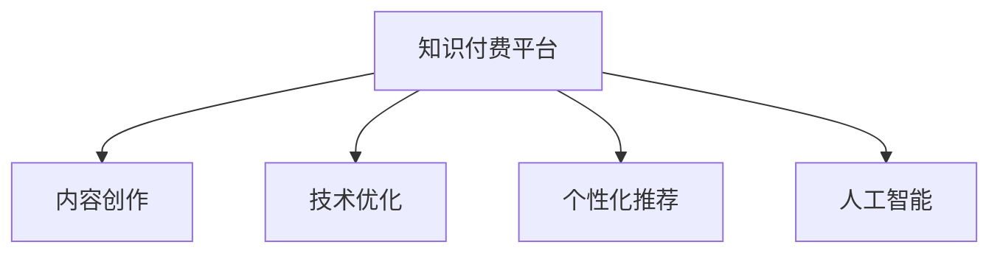

                 

# 知识付费时代程序员的创业机会

## 1. 背景介绍

### 1.1 问题由来
随着互联网技术的快速发展和智能设备的普及，人们的获取知识的方式正在发生翻天覆地的变化。知识付费平台的兴起，正是这一趋势的产物。从传统的书籍、期刊、报纸等纸媒载体，到近年兴起的音频、视频、直播等新型媒介，人们对于优质内容的需求正变得越来越多元化。然而，内容创造和传播的过程中，存在着知识创作者被边缘化、优质内容匮乏、付费体系不健全等问题。如何为知识创作者提供更好的激励和平台，为消费者提供更多优质的付费内容，成为亟待解决的问题。

### 1.2 问题核心关键点
知识付费平台的成功离不开技术支持。在这个时代，程序员的角色不仅仅是软件开发者和架构师，更应该是创业者、创新者和引领者。程序员可以通过多种方式介入知识付费领域，寻找创业机会。以下是几个关键点：

- 内容平台：开发和运营知识付费平台，连接知识创作者和消费者。
- 内容创作：利用编程技能创作高质量的编程课程、编程书籍、博客等。
- 技术优化：提升知识付费平台的技术性能，包括网站稳定性、响应速度、安全性等。
- 个性化推荐：利用算法推荐系统，为消费者提供更精准的内容推荐。
- 人工智能：应用人工智能技术，如机器学习、自然语言处理等，提升内容创作和平台运营的效率。

### 1.3 问题研究意义
程序员在知识付费领域的创业，具有重要意义：

1. **助力知识传播**：通过技术手段，使知识创作者能够更好地将专业知识传播给需要的人，解决知识传播不均的问题。
2. **提升经济效益**：知识付费能够创造巨大的商业价值，程序员通过技术手段为知识创作者提供平台，共享这一经济红利。
3. **推动行业创新**：程序员在技术上的创新，可以推动知识付费行业不断向前发展，提升用户体验。
4. **提升个人品牌**：成为某一领域的专家，拥有独特的技术解决方案，能够提升个人的品牌价值和市场影响力。

## 2. 核心概念与联系

### 2.1 核心概念概述

为了更好地理解程序员在知识付费领域的创业机会，本节将介绍几个密切相关的核心概念：

- **知识付费平台**：在线平台，提供各种付费内容，如编程课程、技术文章、视频讲解等。
- **内容创作**：程序员可以编写高质量的技术教程、博客、编程书籍等，供消费者购买。
- **技术优化**：包括网站稳定性、响应速度、安全性等方面的技术支持。
- **个性化推荐**：通过算法推荐系统，为消费者提供更精准的内容推荐。
- **人工智能**：包括机器学习、自然语言处理等，提升内容创作和平台运营的效率。

这些核心概念之间的逻辑关系可以通过以下Mermaid流程图来展示：



这个流程图展示了几类核心概念及其之间的关系：

1. 知识付费平台是连接知识创作者和消费者的桥梁。
2. 内容创作是平台的基础，高质量的内容可以吸引更多消费者。
3. 技术优化保障平台的稳定性和用户体验。
4. 个性化推荐提升用户的粘性，增加消费频次。
5. 人工智能技术的应用，可以提升内容创作和平台运营的效率。

这些概念共同构成了知识付费平台的运营框架，程序员可以通过技术手段在这些方面提供支持，发掘创业机会。

## 3. 核心算法原理 & 具体操作步骤
### 3.1 算法原理概述

知识付费平台的核心算法包括内容推荐算法、个性化学习路径算法、广告投放算法等。这些算法的原理和操作步骤如下：

### 3.2 算法步骤详解

#### 3.2.1 内容推荐算法

内容推荐算法旨在为消费者提供最相关、最感兴趣的内容。其步骤如下：

1. **数据采集**：收集用户的行为数据，如浏览、购买、评论等。
2. **特征提取**：从数据中提取用户兴趣特征，如历史浏览记录、购买记录等。
3. **模型训练**：训练推荐模型，如协同过滤、矩阵分解、深度学习等。
4. **预测推荐**：根据用户的特征，预测并推荐相关内容。
5. **更新模型**：根据用户的新行为数据，不断更新模型，提升推荐效果。

#### 3.2.2 个性化学习路径算法

个性化学习路径算法旨在为消费者提供个性化的学习路径，帮助其高效地掌握知识。其步骤如下：

1. **路径设计**：设计初步的学习路径，如基础课程、进阶课程、实战项目等。
2. **用户分析**：分析用户的学习行为，如学习时长、掌握程度等。
3. **路径优化**：根据用户的学习进度，动态调整学习路径，如推荐相关课程、提示学习技巧等。
4. **路径反馈**：收集用户对学习路径的反馈，优化路径设计。

#### 3.2.3 广告投放算法

广告投放算法旨在为平台和内容创作者提供精准的广告投放服务。其步骤如下：

1. **广告选择**：根据内容的特点，选择适合的广告。
2. **用户匹配**：根据用户的行为数据，匹配合适的用户。
3. **投放策略**：确定广告的投放时间、频率、渠道等。
4. **效果评估**：评估广告的效果，优化投放策略。

### 3.3 算法优缺点

#### 3.3.1 内容推荐算法

优点：
- 个性化程度高，能够根据用户的行为和偏好推荐相关内容。
- 能够提升用户体验，增加用户粘性。

缺点：
- 需要大量的用户行为数据，数据收集难度大。
- 推荐效果可能受到数据质量的影响，如数据噪声、用户隐私等。

#### 3.3.2 个性化学习路径算法

优点：
- 能够根据用户的个性化需求，提供量身定制的学习路径。
- 能够提升学习效率，减少用户的学习成本。

缺点：
- 需要大量的用户学习数据，数据采集和分析难度大。
- 学习路径设计需要充分考虑用户的学习目标和习惯，设计复杂。

#### 3.3.3 广告投放算法

优点：
- 能够为内容创作者提供精准的广告投放服务，提升其曝光率和收益。
- 能够为平台带来更多的用户流量，提升平台的商业价值。

缺点：
- 需要大量的广告数据和用户行为数据，数据采集难度大。
- 广告投放策略需要根据市场和用户变化进行调整，调整难度大。

### 3.4 算法应用领域

内容推荐算法和个性化学习路径算法主要应用于知识付费平台的运营，提升用户体验和平台粘性。广告投放算法则广泛应用于平台和内容创作者的收益提升。

## 4. 数学模型和公式 & 详细讲解 & 举例说明

### 4.1 数学模型构建

内容推荐算法的数学模型构建如下：

设 $U$ 为用户集合，$C$ 为内容集合。用户 $u$ 对内容 $c$ 的评分 $r_{uc}$ 可以表示为：

$$
r_{uc} = \sum_{i=1}^n w_ir_{uc}^i
$$

其中 $w_i$ 为权重，$r_{uc}^i$ 为基于第 $i$ 个特征的内容评分，如用户行为数据、内容属性数据等。推荐模型的目标为最大化用户的满意度和平台收益，可以表示为：

$$
\max_{\theta} \sum_{u \in U} \sum_{c \in C} r_{uc} \log p_{uc} + \lambda \log \sum_{c \in C} p_{uc}
$$

其中 $p_{uc}$ 为内容 $c$ 被用户 $u$ 推荐的概率，$\lambda$ 为正则化系数，控制平台的收益最大化和模型的稀疏性。

### 4.2 公式推导过程

内容推荐算法的公式推导过程如下：

1. **数据预处理**：将用户行为数据和内容属性数据进行标准化、归一化处理，得到特征向量。
2. **特征表示**：将用户和内容特征向量表示为低维向量，方便模型训练。
3. **模型训练**：使用矩阵分解、协同过滤等算法，训练推荐模型。
4. **预测推荐**：使用训练好的模型，根据用户特征向量，预测并推荐相关内容。
5. **效果评估**：使用精确度、召回率、平均准确率等指标评估推荐效果，不断优化模型。

### 4.3 案例分析与讲解

以协同过滤推荐算法为例，其公式推导过程如下：

设 $U$ 为用户集合，$C$ 为内容集合，$R_{uc}$ 为用户 $u$ 对内容 $c$ 的评分，$A_{uc}$ 为内容 $c$ 对用户 $u$ 的评分。协同过滤算法的目标为最大化用户满意度，可以表示为：

$$
\max_{\theta} \sum_{u \in U} \sum_{c \in C} r_{uc} \log p_{uc}
$$

其中 $p_{uc}$ 为内容 $c$ 被用户 $u$ 推荐的概率。根据协同过滤算法，$A_{uc}$ 可以表示为：

$$
A_{uc} = \sum_{v \in U} \frac{r_{uv} r_{vc}}{\sqrt{\sum_{j=1}^n r_{uj}^2} \sqrt{\sum_{j=1}^n r_{vj}^2}}
$$

其中 $r_{uv}$ 为用户 $u$ 对内容 $v$ 的评分，$j$ 为内容特征向量中的维度。$A_{uc}$ 表示内容 $c$ 对用户 $u$ 的评分。根据协同过滤算法，$R_{uc}$ 可以表示为：

$$
R_{uc} = \sum_{v \in U} \frac{p_{uv} A_{vc}}{\sqrt{\sum_{j=1}^n A_{uj}^2}}
$$

其中 $p_{uv}$ 为内容 $v$ 对用户 $u$ 的评分。$R_{uc}$ 表示内容 $c$ 被用户 $u$ 推荐的概率。

## 5. 项目实践：代码实例和详细解释说明

### 5.1 开发环境搭建

在进行知识付费平台的开发前，我们需要准备好开发环境。以下是使用Python进行Flask开发的环境配置流程：

1. 安装Anaconda：从官网下载并安装Anaconda，用于创建独立的Python环境。

2. 创建并激活虚拟环境：
```bash
conda create -n flask-env python=3.8 
conda activate flask-env
```

3. 安装Flask：
```bash
pip install flask
```

4. 安装Flask扩展：
```bash
pip install flask-cors flask-login flask-migrate flask-sqlalchemy
```

5. 安装数据库：
```bash
pip install flask-sqlalchemy
```

6. 安装数据模型：
```bash
pip install flask-model-storage
```

完成上述步骤后，即可在`flask-env`环境中开始知识付费平台的开发。

### 5.2 源代码详细实现

这里我们以开发一个简单的知识付费平台为例，给出Flask的代码实现。

首先，定义模型的数据库表：

```python
from flask_sqlalchemy import SQLAlchemy
from flask_model_storage import ModelStorage

db = SQLAlchemy()
storage = ModelStorage(db)

class User(db.Model, storage.ModelMixin):
    id = db.Column(db.Integer, primary_key=True)
    username = db.Column(db.String(100), unique=True)
    email = db.Column(db.String(100), unique=True)
    password = db.Column(db.String(100))

class Content(db.Model, storage.ModelMixin):
    id = db.Column(db.Integer, primary_key=True)
    title = db.Column(db.String(100))
    description = db.Column(db.Text)
    category = db.Column(db.String(100))
    price = db.Column(db.Float)
```

然后，定义用户和内容的路由：

```python
from flask import Flask, render_template, request

app = Flask(__name__)
app.config['SQLALCHEMY_DATABASE_URI'] = 'sqlite:////tmp/test.db'
app.config['SQLALCHEMY_TRACK_MODIFICATIONS'] = False
db.init_app(app)
storage.init_app(app)

@app.route('/')
def index():
    users = User.query.all()
    contents = Content.query.all()
    return render_template('index.html', users=users, contents=contents)

@app.route('/login', methods=['GET', 'POST'])
def login():
    if request.method == 'POST':
        user = User.query.filter_by(username=request.form['username']).first()
        if user and user.password == request.form['password']:
            session['user_id'] = user.id
            return redirect('/')
        else:
            return render_template('login.html', message='Invalid credentials.')
    else:
        return render_template('login.html')
```

最后，启动Flask服务器：

```python
if __name__ == '__main__':
    app.run(debug=True)
```

以上就是使用Flask进行知识付费平台开发的完整代码实现。可以看到，Flask的Flask-SQLAlchemy和Flask-Model-Storage等扩展使得数据库管理和模型存储变得简单高效。开发者可以将更多精力放在业务逻辑的实现上，而不必过多关注底层的实现细节。

### 5.3 代码解读与分析

让我们再详细解读一下关键代码的实现细节：

**User类**：
- `__init__`方法：初始化用户的基本信息，包括用户名、邮箱和密码。
- `__repr__`方法：返回用户对象的字符串表示，方便调试。

**Content类**：
- `__init__`方法：初始化内容的基本信息，包括标题、描述、类别和价格。
- `__repr__`方法：返回内容对象的字符串表示，方便调试。

**index方法**：
- 从数据库中查询用户和内容，并在模板中渲染显示。

**login方法**：
- 处理用户登录请求，包括检查用户名和密码，并保存用户ID到Session中。

通过以上代码，可以看出Flask的简洁高效和易用性。开发者可以在此基础上进一步扩展和优化，构建更为复杂的功能模块。

## 6. 实际应用场景

### 6.1 在线教育平台

在线教育平台是知识付费领域的重要应用场景之一。程序员可以通过开发和运营知识付费平台，为广大学习者提供优质的在线课程和互动服务。

在技术实现上，可以收集教师的教学视频、PPT、讲义等资源，通过知识付费平台进行销售和分发。同时，利用推荐算法和个性化学习路径算法，为学生提供个性化的学习建议和资源推荐。

### 6.2 企业培训平台

企业培训平台是知识付费领域的另一个重要应用场景。程序员可以通过开发和运营知识付费平台，为企业提供员工培训课程和专业技能提升服务。

在技术实现上，可以收集企业的培训课程和讲师资源，通过知识付费平台进行销售和分发。同时，利用推荐算法和个性化学习路径算法，为员工提供个性化的培训建议和资源推荐。

### 6.3 专业社区平台

专业社区平台是知识付费领域的创新应用场景之一。程序员可以通过开发和运营知识付费平台，为特定领域的专家和爱好者提供交流和学习平台。

在技术实现上，可以收集专家和爱好者上传的论文、博客、课程等资源，通过知识付费平台进行销售和分发。同时，利用推荐算法和个性化学习路径算法，为用户推荐感兴趣的资源和专家，提升社区活跃度。

### 6.4 未来应用展望

随着知识付费领域的不断发展，未来还将涌现更多创新应用场景。例如：

- 智能内容创作平台：利用人工智能技术，为创作者提供自动生成内容的辅助工具。
- 知识图谱平台：利用知识图谱技术，为学习者提供结构化的知识体系和关联关系。
- 在线协作平台：利用协作工具，为学习者和创作者提供实时交流和协作功能。

这些创新应用将进一步提升知识付费平台的价值和用户体验，为程序员提供更多的创业机会。

## 7. 工具和资源推荐

### 7.1 学习资源推荐

为了帮助程序员系统掌握知识付费平台的开发技术，这里推荐一些优质的学习资源：

1. **Flask官方文档**：Flask的官方文档，提供了完整的API参考和实例代码，是学习Flask的最佳资源。
2. **SQLAlchemy官方文档**：SQLAlchemy的官方文档，提供了详细的SQLAlchemy ORM和数据库迁移功能的使用说明。
3. **Flask-SQLAlchemy文档**：Flask-SQLAlchemy的官方文档，提供了Flask与SQLAlchemy的集成使用说明。
4. **Flask-Model-Storage文档**：Flask-Model-Storage的官方文档，提供了模型数据存储和迁移的功能。
5. **Flask-Cors文档**：Flask-Cors的官方文档，提供了跨域请求的解决方案。
6. **Flask-Login文档**：Flask-Login的官方文档，提供了用户认证和权限管理的解决方案。

通过对这些资源的学习实践，相信程序员可以迅速掌握知识付费平台的开发技术，提升自身竞争力。

### 7.2 开发工具推荐

高效的开发离不开优秀的工具支持。以下是几款用于知识付费平台开发的常用工具：

1. **Jupyter Notebook**：Jupyter Notebook是一个交互式的数据科学平台，可以用于编写、执行、分享和协作Python代码。
2. **Git**：Git是一个版本控制系统，可以用于版本管理、协作开发和代码审计。
3. **Docker**：Docker是一个容器化平台，可以用于打包、部署和管理应用。
4. **Kubernetes**：Kubernetes是一个容器编排平台，可以用于自动化部署、扩展和管理容器应用。
5. **AWS**：AWS是亚马逊提供的云服务平台，可以用于开发、测试和部署知识付费平台。

合理利用这些工具，可以显著提升知识付费平台开发的效率和质量，加速产品迭代和市场推广。

### 7.3 相关论文推荐

知识付费平台的成功离不开技术支持。以下是几篇奠基性的相关论文，推荐阅读：

1. **《A Survey of Online Learning Platforms》**：综述了在线学习平台的现状、趋势和技术。
2. **《Machine Learning Applications in Online Learning Platforms》**：介绍了机器学习在在线学习平台中的应用，包括推荐系统、个性化学习等。
3. **《Knowledge Graphs and Online Learning》**：探讨了知识图谱在在线学习平台中的应用，包括结构化知识体系、知识推理等。
4. **《Collaborative Filtering for Recommendation Systems》**：介绍了协同过滤算法在推荐系统中的应用，包括用户行为数据、模型训练等。
5. **《Deep Learning for Recommendation Systems》**：介绍了深度学习在推荐系统中的应用，包括神经网络模型、特征提取等。

这些论文代表了大数据、人工智能在知识付费平台中的应用方向，程序员可以通过学习这些前沿成果，掌握知识付费平台的核心技术，提升自身竞争力。

## 8. 总结：未来发展趋势与挑战

### 8.1 研究成果总结

本文对程序员在知识付费领域的创业机会进行了全面系统的介绍。首先阐述了知识付费平台的成功离不开技术支持，程序员可以通过开发和运营知识付费平台，为知识创作者和消费者提供更好的服务。其次，从原理到实践，详细讲解了知识付费平台的推荐算法和个性化学习路径算法，给出了知识付费平台开发的完整代码实现。同时，本文还广泛探讨了知识付费平台在在线教育、企业培训、专业社区等多个领域的应用前景，展示了知识付费平台的广阔应用场景。最后，本文精选了知识付费平台的各类学习资源，力求为程序员提供全方位的技术指引。

通过本文的系统梳理，可以看到，知识付费平台的成功离不开技术支持，程序员可以通过技术手段在这些领域提供支持，发掘创业机会。知识付费平台在多个领域的应用前景广阔，未来还将涌现更多创新应用场景。相信随着技术的不断进步和市场的发展，知识付费平台将迎来更多的发展机遇。

### 8.2 未来发展趋势

展望未来，知识付费平台的成功离不开技术支持。程序员可以在知识付费领域发挥重要的作用，推动行业的创新和进步。

1. **技术进步**：随着深度学习、自然语言处理、知识图谱等技术的不断进步，知识付费平台的功能和性能将不断提升，用户体验将得到进一步改善。
2. **行业创新**：知识付费平台将与教育、医疗、金融等垂直行业深度融合，提供更加精准和个性化的服务，推动这些行业的发展。
3. **市场拓展**：知识付费平台将向全球市场拓展，为更多地区和用户提供优质内容，提升全球知识传播和共享水平。
4. **应用多样化**：知识付费平台将不仅仅局限于视频课程、音频讲解等传统形式，还将包括电子书、文档、代码库等多样化的内容形式。
5. **平台生态**：知识付费平台将形成一个完整的生态系统，包括内容创作者、消费者、平台运营商等，形成良性互动和合作。

这些趋势将推动知识付费平台不断向前发展，为程序员提供更多的创业机会和职业发展空间。

### 8.3 面临的挑战

尽管知识付费平台在快速发展中，仍面临诸多挑战：

1. **市场竞争激烈**：知识付费平台数量众多，市场竞争激烈，如何保持平台竞争力是一个重要挑战。
2. **内容质量参差不齐**：内容创作者质量参差不齐，如何保证平台内容的质量和专业性是一个关键问题。
3. **用户需求多样**：用户需求和偏好不断变化，如何满足用户多样化需求是一个重要挑战。
4. **技术难题**：推荐算法、个性化学习路径算法等技术难题需要进一步解决，以提升平台的用户体验和性能。
5. **法律法规**：知识付费平台需要遵守相关法律法规，如版权保护、用户隐私保护等，如何平衡商业利益和法律责任是一个重要挑战。

程序员需要在这些方面不断优化和改进，才能在知识付费领域取得成功。

### 8.4 研究展望

未来，知识付费领域还将涌现更多创新技术和应用场景，程序员需要在以下几个方面寻求新的突破：

1. **内容智能创作**：利用人工智能技术，如自然语言处理、知识图谱等，提升内容的创作效率和质量。
2. **个性化学习路径**：利用机器学习、深度学习等技术，提升个性化学习路径的精度和准确性。
3. **推荐算法优化**：优化推荐算法，提升推荐效果，减少推荐偏差和错误。
4. **用户交互优化**：提升用户交互体验，增加用户粘性，促进用户参与和反馈。
5. **平台安全保障**：加强平台安全保障，保护用户隐私和平台数据安全。

这些研究方向将推动知识付费平台的不断发展和优化，为程序员提供更多的创业机会和职业发展空间。

## 9. 附录：常见问题与解答

**Q1：知识付费平台需要哪些核心技术？**

A: 知识付费平台的核心技术包括内容推荐算法、个性化学习路径算法、广告投放算法等。其中，推荐算法是最为核心的技术之一，能够为平台和用户提供精准的内容推荐。

**Q2：开发知识付费平台需要哪些工具和资源？**

A: 开发知识付费平台需要Flask、SQLAlchemy、Flask-Model-Storage等工具和资源。同时，还需要Git、Docker、AWS等工具来支持版本管理、容器化部署、云服务部署等。

**Q3：知识付费平台的主要应用场景有哪些？**

A: 知识付费平台的主要应用场景包括在线教育平台、企业培训平台、专业社区平台等。这些平台能够为知识创作者和消费者提供优质的在线课程、专业技能提升、知识交流和协作等服务。

**Q4：如何提升知识付费平台的用户体验？**

A: 提升用户体验需要从多个方面入手，包括内容质量、推荐算法、个性化学习路径、用户交互等。具体措施包括加强内容审核和质量控制、优化推荐算法和个性化路径设计、提升用户交互体验等。

**Q5：知识付费平台的未来发展方向有哪些？**

A: 知识付费平台的未来发展方向包括技术进步、行业创新、市场拓展、应用多样化、平台生态等。这些方向将推动知识付费平台的不断发展和优化，为程序员提供更多的创业机会和职业发展空间。

通过本文的系统梳理，可以看到，知识付费平台在多个领域的应用前景广阔，未来还将涌现更多创新应用场景。程序员可以在知识付费领域发挥重要的作用，推动行业的创新和进步。

---

作者：禅与计算机程序设计艺术 / Zen and the Art of Computer Programming

