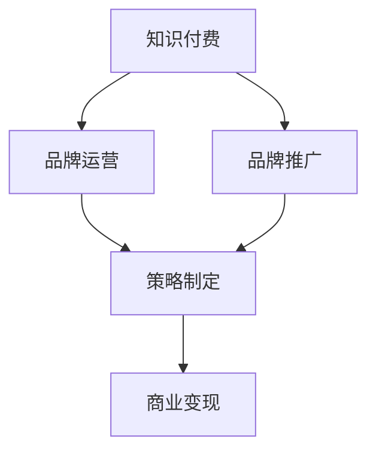

                 

# 知识付费赚钱的品牌品牌运营与品牌推广策略

> 关键词：知识付费,品牌运营,品牌推广,策略,数字化转型

## 1. 背景介绍

### 1.1 问题由来
近年来，知识付费市场经历了飞速发展，成为互联网行业的一大热门领域。知识付费平台如知乎、得到、喜马拉雅等，通过提供有价值的课程、文章、音频等内容，帮助用户快速获取知识和技能，实现了内容的商业化变现。

然而，随着用户对知识付费内容的质量要求不断提高，平台之间的竞争也日益加剧。如何在激烈的市场竞争中，打造一个具有竞争力和影响力的知识付费品牌，成为众多平台和内容创作者共同关注的问题。

### 1.2 问题核心关键点
知识付费品牌的运营与推广，关键在于如何在内容质量和用户体验上不断优化，建立和维护用户信任，同时实现商业化盈利。以下是该问题的核心关键点：

- 品牌定位：明确品牌的定位，确定目标用户群体。
- 内容策略：制定高质量、有价值的内容策略，吸引并留存用户。
- 用户体验：提升用户的使用体验，增加用户粘性。
- 品牌推广：采用有效的品牌推广策略，扩大品牌影响力。
- 商业变现：探索和实现商业化盈利模式。

## 2. 核心概念与联系

### 2.1 核心概念概述

为更好地理解品牌运营与推广策略，本节将介绍几个密切相关的核心概念：

- 知识付费：指通过付费获取知识和技能的服务模式，主要依赖高质量、有价值的内容进行变现。
- 品牌运营：指对品牌进行持续的策略制定、执行和管理，以提升品牌知名度、用户信任度和商业价值。
- 品牌推广：指采用多种营销手段，通过市场传播和用户口碑，提升品牌知名度和市场份额。
- 策略制定：指在品牌运营与推广过程中，根据目标和实际情况，制定有效的运营和推广策略。
- 商业变现：指通过品牌运营与推广，实现内容的商业化变现，包括广告、会员订阅、课程销售等。

这些概念之间的逻辑关系可以通过以下Mermaid流程图来展示：



这个流程图展示了几大核心概念之间的关系：

1. 知识付费为品牌运营与推广提供基础内容。
2. 品牌运营通过策略制定，提升品牌知名度和用户信任度。
3. 品牌推广通过市场传播，扩大品牌影响力。
4. 商业变现通过品牌运营与推广，实现内容的商业化变现。

这些概念共同构成了知识付费品牌运营与推广的框架，使得品牌能够实现内容的高质量变现。通过理解这些核心概念，我们可以更好地把握品牌运营与推广策略的核心要点。

## 3. 核心算法原理 & 具体操作步骤
### 3.1 算法原理概述

品牌运营与推广的核心在于内容质量和用户体验的持续优化。通过高效的用户数据分析，制定针对性的运营策略，并在品牌推广中采用多样化的营销手段，最终实现品牌价值的最大化。

基于此，品牌运营与推广的算法原理可以总结如下：

1. 用户行为分析：通过数据挖掘和机器学习技术，分析用户行为数据，识别用户兴趣和需求。
2. 内容匹配推荐：根据用户行为分析结果，推荐高质量、相关性高的内容。
3. 用户反馈优化：收集用户反馈数据，不断调整和优化内容质量。
4. 市场传播推广：通过社交媒体、SEO优化、KOL合作等多种方式，提升品牌知名度。
5. 数据驱动决策：基于用户数据和市场反馈，制定有效的运营和推广策略。

### 3.2 算法步骤详解

基于上述算法原理，品牌运营与推广的一般操作步骤如下：

**Step 1: 用户行为数据分析**

1. 数据采集：收集用户在知识付费平台上的行为数据，包括浏览记录、学习进度、购买记录等。
2. 数据清洗：对采集数据进行清洗，去除噪音和异常值，确保数据的准确性。
3. 特征工程：对数据进行特征提取，生成用户画像和行为标签。
4. 模型训练：使用机器学习模型，如聚类、分类、回归等，分析用户兴趣和需求。

**Step 2: 内容匹配推荐**

1. 内容标签化：对平台上的课程、文章、音频等内容进行标签化处理。
2. 用户兴趣建模：根据用户画像和行为标签，建立用户兴趣模型。
3. 内容推荐算法：使用协同过滤、深度学习等算法，推荐相关性高的内容给用户。
4. 实时调整：根据用户反馈和行为数据，实时调整推荐算法。

**Step 3: 用户反馈优化**

1. 收集反馈：通过问卷调查、评论、评分等方式，收集用户对内容和体验的反馈。
2. 分析反馈：对收集到的反馈数据进行分析和整理，识别用户问题和需求。
3. 优化改进：根据分析结果，优化课程内容、用户体验和推荐算法。
4. 用户回访：通过邮件、短信等方式，鼓励用户回访平台，提升用户粘性。

**Step 4: 市场传播推广**

1. 品牌定位：明确品牌的定位和核心价值，制定品牌传播策略。
2. 多渠道推广：在社交媒体、搜索引擎、博客等渠道进行品牌推广，提升品牌知名度。
3. KOL合作：与知名博主、专家、意见领袖合作，提升品牌影响力。
4. SEO优化：优化网站内容和结构，提升搜索引擎排名。

**Step 5: 数据驱动决策**

1. 数据分析：对运营和推广数据进行深度分析，识别问题和机会。
2. 策略制定：根据分析结果，制定有效的运营和推广策略。
3. 持续迭代：基于数据分析和市场反馈，持续迭代优化运营策略。

### 3.3 算法优缺点

品牌运营与推广算法的主要优点包括：

1. 用户画像精准：通过数据分析，准确把握用户兴趣和需求，提高内容推荐精度。
2. 市场传播高效：利用多样化的推广渠道，快速提升品牌知名度。
3. 运营决策科学：基于数据驱动，制定科学有效的运营策略。

同时，该算法也存在一定的局限性：

1. 数据质量依赖：算法的有效性和精度，高度依赖于数据的质量和全面性。
2. 用户隐私问题：在数据分析和推荐过程中，需要注意保护用户隐私。
3. 策略制定复杂：需要综合考虑多种因素，制定复杂的策略方案。

尽管存在这些局限性，但品牌运营与推广算法仍是大规模知识付费品牌运营的有效工具。未来相关研究的重点在于如何进一步优化数据收集和处理方式，提升算法精度和效率，同时兼顾用户隐私和策略制定的复杂性。

### 3.4 算法应用领域

品牌运营与推广算法在知识付费领域得到了广泛的应用，覆盖了几乎所有常见场景，例如：

- 课程推荐系统：根据用户兴趣，推荐相关性高的课程，提高用户转化率。
- 内容生成系统：利用用户行为数据，自动生成高质量的课程大纲和文章。
- 用户行为分析：分析用户行为数据，识别用户流失原因，优化用户体验。
- 市场传播推广：通过多样化的推广渠道，提升品牌知名度和市场份额。
- 商业变现模式：探索和实现课程销售、会员订阅、广告等商业化盈利模式。

除了上述这些经典应用外，品牌运营与推广算法还被创新性地应用到更多场景中，如用户画像分析、数据驱动营销、知识图谱构建等，为知识付费品牌的发展提供了全新的思路。

## 4. 数学模型和公式 & 详细讲解 & 举例说明

### 4.1 数学模型构建

本节将使用数学语言对品牌运营与推广策略进行更加严格的刻画。

记用户行为数据为 $D=\{(x_i,y_i)\}_{i=1}^N$，其中 $x_i$ 为行为特征，$y_i$ 为行为标签。定义用户兴趣模型为 $M_{\theta}(x_i)$，其中 $\theta$ 为模型参数。品牌推广的目标是最小化用户流失概率，即找到最优参数：

$$
\theta^* = \mathop{\arg\min}_{\theta} P(\text{流失} | M_{\theta})
$$

在实践中，我们通常使用分类算法，如逻辑回归、支持向量机等，来近似求解上述最优化问题。设 $\eta$ 为学习率，$\lambda$ 为正则化系数，则参数的更新公式为：

$$
\theta \leftarrow \theta - \eta \nabla_{\theta}\mathcal{L}(\theta) - \eta\lambda\theta
$$

其中 $\nabla_{\theta}\mathcal{L}(\theta)$ 为损失函数对参数 $\theta$ 的梯度，可通过反向传播算法高效计算。

### 4.2 公式推导过程

以下我们以逻辑回归模型为例，推导用户流失概率的计算公式。

假设用户流失与否与用户兴趣 $M_{\theta}(x_i)$ 有关，则用户流失概率 $P(\text{流失} | M_{\theta})$ 可以表示为：

$$
P(\text{流失} | M_{\theta}) = \frac{1}{1+e^{-M_{\theta}(x_i)}}
$$

在样本上，用户流失概率的概率为：

$$
\hat{y}_i = \text{sigmoid}(M_{\theta}(x_i))
$$

将其代入经验风险公式，得：

$$
\mathcal{L}(\theta) = -\frac{1}{N}\sum_{i=1}^N [y_i\log \hat{y}_i+(1-y_i)\log(1-\hat{y}_i)]
$$

根据链式法则，损失函数对参数 $\theta_k$ 的梯度为：

$$
\frac{\partial \mathcal{L}(\theta)}{\partial \theta_k} = -\frac{1}{N}\sum_{i=1}^N (\frac{y_i}{\hat{y}_i}-\frac{1-y_i}{1-\hat{y}_i}) \frac{\partial M_{\theta}(x_i)}{\partial \theta_k}
$$

其中 $\frac{\partial M_{\theta}(x_i)}{\partial \theta_k}$ 可进一步递归展开，利用自动微分技术完成计算。

### 4.3 案例分析与讲解

假设某知识付费平台的用户流失概率与其在平台上停留时间 $x_i$ 有关。通过历史数据，构建逻辑回归模型，预测用户流失概率。具体步骤如下：

1. 数据采集：收集用户在平台上的浏览记录、学习进度、购买记录等行为数据。
2. 数据清洗：对采集数据进行清洗，去除噪音和异常值。
3. 特征工程：对数据进行特征提取，生成用户画像和行为标签。
4. 模型训练：使用逻辑回归模型，训练用户流失概率预测模型。
5. 用户流失预测：根据用户画像，预测其在未来一段时间内流失的概率。
6. 风险预警：对流失概率较高的用户，进行风险预警和干预。

通过用户流失概率的预测，平台可以提前识别流失用户，采取措施提高用户留存率，提升用户体验。

## 5. 项目实践：代码实例和详细解释说明
### 5.1 开发环境搭建

在进行品牌运营与推广的实践前，我们需要准备好开发环境。以下是使用Python进行Pandas和Scikit-learn开发的环境配置流程：

1. 安装Anaconda：从官网下载并安装Anaconda，用于创建独立的Python环境。

2. 创建并激活虚拟环境：
```bash
conda create -n brand-op-env python=3.8 
conda activate brand-op-env
```

3. 安装Pandas和Scikit-learn：
```bash
conda install pandas scikit-learn
```

4. 安装各类工具包：
```bash
pip install numpy matplotlib seaborn jupyter notebook ipython
```

完成上述步骤后，即可在`brand-op-env`环境中开始品牌运营与推广的实践。

### 5.2 源代码详细实现

下面我以用户流失预测为例，给出使用Pandas和Scikit-learn进行品牌运营与推广的PyTorch代码实现。

首先，定义用户流失预测的训练集和测试集：

```python
import pandas as pd
from sklearn.model_selection import train_test_split
from sklearn.preprocessing import StandardScaler
from sklearn.linear_model import LogisticRegression

# 数据读取和处理
data = pd.read_csv('user_data.csv')
data = data.dropna()

# 特征工程
features = ['stay_time', 'purchase_frequency', 'read_time']
labels = 'churn'

# 数据标准化
scaler = StandardScaler()
data[features] = scaler.fit_transform(data[features])

# 数据分割
X_train, X_test, y_train, y_test = train_test_split(data[features], data[labels], test_size=0.2, random_state=42)
```

然后，定义逻辑回归模型和优化器：

```python
from sklearn.linear_model import LogisticRegression

model = LogisticRegression(solver='lbfgs')
```

接着，定义训练和评估函数：

```python
from sklearn.metrics import classification_report

def train_model(model, X_train, y_train, epochs=100, batch_size=32):
    model.fit(X_train, y_train, batch_size=batch_size, epochs=epochs, verbose=0)

    X_pred = model.predict(X_test)
    print(classification_report(y_test, X_pred))

def evaluate_model(model, X_test, y_test):
    X_pred = model.predict(X_test)
    print(classification_report(y_test, X_pred))
```

最后，启动训练流程并在测试集上评估：

```python
epochs = 10
batch_size = 32

train_model(model, X_train, y_train, epochs=epochs, batch_size=batch_size)
evaluate_model(model, X_test, y_test)
```

以上就是使用Pandas和Scikit-learn进行用户流失预测的品牌运营与推广的完整代码实现。可以看到，得益于Pandas和Scikit-learn的强大封装，我们可以用相对简洁的代码完成数据处理和模型训练。

### 5.3 代码解读与分析

让我们再详细解读一下关键代码的实现细节：

**数据处理**：
- 使用Pandas读取数据文件，并进行数据清洗。
- 定义训练集和测试集的特征和标签，进行特征标准化处理。
- 使用train_test_split函数对数据进行分割，保证训练集和测试集的独立性。

**模型定义**：
- 使用Scikit-learn中的LogisticRegression模型，选择L-BFGS优化算法。
- 模型训练时，设置迭代次数和批大小，进行模型拟合。

**评估函数**：
- 使用classification_report函数，对模型预测结果进行分类指标评估。

**训练流程**：
- 设置迭代次数和批大小，进行模型训练。
- 在训练集上训练模型，并在测试集上进行评估。

可以看到，Pandas和Scikit-learn在数据处理和模型训练中提供了强大的工具支持，使得品牌运营与推广的代码实现变得简洁高效。开发者可以将更多精力放在数据处理、模型改进等高层逻辑上，而不必过多关注底层的实现细节。

当然，工业级的系统实现还需考虑更多因素，如模型的保存和部署、超参数的自动搜索、更灵活的任务适配层等。但核心的品牌运营与推广流程基本与此类似。

## 6. 实际应用场景
### 6.1 智能客服系统

基于用户行为分析的智能客服系统，可以广泛应用于知识付费平台的客户服务。通过用户行为数据，构建用户画像，预测用户流失概率，智能客服系统能够及时识别并解决用户问题，提高用户满意度。

在技术实现上，可以构建用户流失概率预测模型，实时监控用户行为数据，当预测到用户流失概率较高时，自动触发服务升级，或提供个性化推荐，挽回用户流失。

### 6.2 个性化推荐系统

个性化推荐系统是知识付费平台的核心应用之一。通过用户行为数据分析，构建用户兴趣模型，生成高质量的课程推荐列表，提高用户转化率和留存率。

在推荐算法中，可以结合协同过滤、深度学习等方法，对用户行为数据进行分析和建模，生成相关性高的课程推荐。同时，通过用户回访和反馈数据，实时调整和优化推荐算法，提高推荐精度。

### 6.3 内容生成系统

内容生成系统可以自动生成高质量的课程大纲和文章，提升平台内容质量。通过用户行为数据分析，了解用户兴趣和需求，结合知识图谱等技术，生成具有吸引力和价值的内容。

在内容生成中，可以结合自然语言处理、图像生成等技术，自动生成文本、图片等内容，提升平台内容的多样性和吸引力。同时，通过用户反馈和行为数据，优化生成模型，生成更加精准和符合用户期望的内容。

### 6.4 未来应用展望

随着用户数据量的不断增加和算法技术的不断进步，品牌运营与推广将呈现出以下发展趋势：

1. 数据质量提升：通过更全面、更准确的数据采集和处理，提升品牌运营与推广的精度和效果。
2. 算法优化升级：结合深度学习、强化学习等先进算法，提升品牌运营与推广的自动化和智能化水平。
3. 用户画像精准：通过更深入的用户行为分析和画像建模，提升用户精准度，提高转化率和留存率。
4. 品牌推广多样化：结合社交媒体、搜索引擎、KOL合作等多种推广手段，提升品牌知名度和市场份额。
5. 商业变现多元化：探索和实现更多元化的商业变现模式，如课程销售、会员订阅、广告等。

这些趋势将进一步推动知识付费品牌的数字化转型和智能化升级，提升品牌竞争力和市场价值。未来，知识付费品牌将在数据驱动、算法优化、用户导向等方面不断创新，构建更加精准、高效、智能的运营体系。

## 7. 工具和资源推荐
### 7.1 学习资源推荐

为了帮助开发者系统掌握品牌运营与推广的理论基础和实践技巧，这里推荐一些优质的学习资源：

1. 《数据挖掘与统计学习》系列博文：由知名数据科学家撰写，深入浅出地介绍了数据挖掘、机器学习、品牌运营等核心概念和实际应用。

2. Coursera《商业数据分析》课程：由斯坦福大学等名校开设的商业数据分析课程，涵盖品牌运营、市场营销等热门内容。

3. 《Python数据科学手册》书籍：全面介绍了使用Python进行数据科学实践的各个方面，包括品牌运营、数据可视化等。

4. Kaggle竞赛平台：通过参与Kaggle竞赛，学习数据分析和品牌运营的实际案例，积累实战经验。

5. Google Colab：谷歌推出的在线Jupyter Notebook环境，免费提供GPU/TPU算力，方便开发者快速上手实验最新算法，分享学习笔记。

通过对这些资源的学习实践，相信你一定能够快速掌握品牌运营与推广的精髓，并用于解决实际的商业问题。

### 7.2 开发工具推荐

高效的开发离不开优秀的工具支持。以下是几款用于品牌运营与推广开发的常用工具：

1. Pandas：用于数据处理和分析，支持高效的数据清洗、特征工程等。
2. Scikit-learn：用于机器学习和模型训练，支持多种算法的实现。
3. TensorFlow和PyTorch：用于深度学习模型的训练和优化，支持复杂的算法实现。
4. Jupyter Notebook：用于编写和执行代码，支持代码块的高效编写和运行。
5. TensorBoard：用于模型训练的实验跟踪，可以记录和可视化模型训练过程中的各项指标。

合理利用这些工具，可以显著提升品牌运营与推广任务的开发效率，加快创新迭代的步伐。

### 7.3 相关论文推荐

品牌运营与推广技术的发展源于学界的持续研究。以下是几篇奠基性的相关论文，推荐阅读：

1. Guo, H., Jiang, H., & Jauhar, A. (2018). "Data Mining and Statistical Learning". Springer.
2. Coursera《商业数据分析》课程讲义。
3. 《Python数据科学手册》书籍。
4. Kaggle竞赛平台：通过参与Kaggle竞赛，学习数据分析和品牌运营的实际案例，积累实战经验。
5. Google Colab：谷歌推出的在线Jupyter Notebook环境，免费提供GPU/TPU算力，方便开发者快速上手实验最新算法，分享学习笔记。

这些论文代表了大规模品牌运营与推广技术的发展脉络。通过学习这些前沿成果，可以帮助研究者把握学科前进方向，激发更多的创新灵感。

## 8. 总结：未来发展趋势与挑战
### 8.1 总结

本文对品牌运营与推广方法进行了全面系统的介绍。首先阐述了品牌运营与推广的研究背景和意义，明确了品牌运营与推广在知识付费品牌发展中的重要地位。其次，从原理到实践，详细讲解了品牌运营与推广的数学模型和操作步骤，给出了品牌运营与推广任务开发的完整代码实例。同时，本文还广泛探讨了品牌运营与推广在智能客服、个性化推荐、内容生成等多个应用场景中的应用前景，展示了品牌运营与推广范式的巨大潜力。此外，本文精选了品牌运营与推广的学习资源，力求为读者提供全方位的技术指引。

通过本文的系统梳理，可以看到，品牌运营与推广技术在知识付费领域得到了广泛的应用，为品牌提供了有效的运营和推广手段。品牌运营与推广通过精准的用户行为分析，提升了用户转化率和留存率，同时通过多样化的推广手段，提升了品牌知名度和市场份额。未来，品牌运营与推广技术将与大数据、人工智能等先进技术进一步融合，构建更加智能、高效、精准的运营体系，助力知识付费品牌实现数字化转型和智能化升级。

### 8.2 未来发展趋势

展望未来，品牌运营与推广技术将呈现以下几个发展趋势：

1. 数据驱动：通过更全面、更准确的数据采集和处理，提升品牌运营与推广的精度和效果。
2. 算法优化：结合深度学习、强化学习等先进算法，提升品牌运营与推广的自动化和智能化水平。
3. 用户画像：通过更深入的用户行为分析和画像建模，提升用户精准度，提高转化率和留存率。
4. 品牌推广：结合社交媒体、搜索引擎、KOL合作等多种推广手段，提升品牌知名度和市场份额。
5. 商业变现：探索和实现更多元化的商业变现模式，如课程销售、会员订阅、广告等。

这些趋势将进一步推动品牌运营与推广技术的数字化转型和智能化升级，提升品牌的竞争力和市场价值。未来，品牌运营与推广将在数据驱动、算法优化、用户导向等方面不断创新，构建更加精准、高效、智能的运营体系。

### 8.3 面临的挑战

尽管品牌运营与推广技术已经取得了瞩目成就，但在迈向更加智能化、普适化应用的过程中，它仍面临着诸多挑战：

1. 数据质量瓶颈：品牌运营与推广的效果很大程度上依赖于数据的质量和全面性。如何获取和处理更全面、更准确的用户行为数据，将是一大难题。
2. 算法复杂性：品牌运营与推广涉及多种算法的组合使用，算法调优复杂，需要多轮迭代优化。
3. 用户隐私问题：在数据分析和推广过程中，需要注意保护用户隐私，避免数据泄露和滥用。
4. 策略制定复杂：品牌运营与推广涉及多种策略的制定和执行，策略制定复杂，需要综合考虑多种因素。
5. 品牌影响难以衡量：品牌运营与推广的效果难以量化衡量，需要多维度评估品牌知名度、用户粘性等指标。

尽管存在这些挑战，但品牌运营与推广技术仍是大规模品牌运营的有效工具。未来相关研究的重点在于如何进一步优化数据收集和处理方式，提升算法精度和效率，同时兼顾用户隐私和策略制定的复杂性。

### 8.4 研究展望

面对品牌运营与推广面临的种种挑战，未来的研究需要在以下几个方面寻求新的突破：

1. 探索无监督和半监督品牌运营与推广方法。摆脱对大规模标注数据的依赖，利用自监督学习、主动学习等无监督和半监督范式，最大限度利用非结构化数据，实现更加灵活高效的推广。
2. 研究参数高效和计算高效的推广范式。开发更加参数高效的推广方法，在固定大部分预训练参数的同时，只更新极少量的任务相关参数。同时优化推广模型的计算图，减少前向传播和反向传播的资源消耗，实现更加轻量级、实时性的部署。
3. 融合因果和对比学习范式。通过引入因果推断和对比学习思想，增强推广模型建立稳定因果关系的能力，学习更加普适、鲁棒的品牌特征，从而提升推广模型的泛化性和抗干扰能力。
4. 引入更多先验知识。将符号化的先验知识，如知识图谱、逻辑规则等，与神经网络模型进行巧妙融合，引导品牌推广过程学习更准确、合理的品牌特征。同时加强不同模态数据的整合，实现视觉、语音等多模态信息与文本信息的协同建模。
5. 结合因果分析和博弈论工具。将因果分析方法引入品牌推广模型，识别出推广决策的关键特征，增强推广输出的因果性和逻辑性。借助博弈论工具刻画人机交互过程，主动探索并规避推广模型的脆弱点，提高系统稳定性。
6. 纳入伦理道德约束。在品牌推广目标中引入伦理导向的评估指标，过滤和惩罚有害的推广内容，确保推广内容符合人类价值观和伦理道德。

这些研究方向的探索，必将引领品牌运营与推广技术迈向更高的台阶，为构建安全、可靠、可解释、可控的智能系统铺平道路。面向未来，品牌运营与推广技术还需要与其他人工智能技术进行更深入的融合，如知识表示、因果推理、强化学习等，多路径协同发力，共同推动品牌运营与推广技术的进步。只有勇于创新、敢于突破，才能不断拓展品牌运营与推广的边界，让智能技术更好地造福人类社会。

## 9. 附录：常见问题与解答
**Q1：如何评估品牌运营与推广的效果？**

A: 品牌运营与推广的效果评估需要从多个维度进行，以下是常用的评估指标：

1. 用户转化率：衡量推广活动带来的用户数量和质量。
2. 用户留存率：衡量推广活动带来的用户留存情况，反映用户对品牌的忠诚度。
3. 品牌知名度：通过品牌调查、搜索引擎排名等方式，衡量品牌在目标市场中的知名度和曝光度。
4. 用户满意度：通过用户反馈、问卷调查等方式，衡量用户对品牌推广内容的满意度和认可度。
5. ROI（投资回报率）：衡量推广活动带来的商业价值，计算推广成本与收益之比。

通过对这些指标的综合评估，可以全面了解品牌运营与推广的效果，及时调整和优化推广策略。

**Q2：在品牌推广中，如何选择合适的推广渠道？**

A: 品牌推广渠道的选择需要考虑多个因素，以下是一些关键考量：

1. 目标用户群体：了解目标用户群体的行为习惯和偏好，选择适合的推广渠道。
2. 推广预算：根据推广预算，选择性价比高的推广渠道。
3. 推广目标：明确推广目标，选择能够达到目标的推广渠道。
4. 数据反馈：根据推广数据的反馈，及时调整推广策略。
5. 品牌特性：根据品牌特性，选择适合的品牌传播方式。

常见的推广渠道包括社交媒体、搜索引擎、KOL合作、邮件营销、SEO优化等。选择推广渠道时，需要综合考虑以上因素，制定科学的推广计划。

**Q3：在品牌运营中，如何优化用户体验？**

A: 用户体验优化是品牌运营的核心之一，以下是一些关键策略：

1. 产品设计：优化产品界面和功能，提升用户使用体验。
2. 用户反馈：收集用户反馈，及时调整和优化产品功能。
3. 个性化推荐：根据用户行为和兴趣，生成个性化推荐内容，提升用户粘性。
4. 用户互动：增加用户互动环节，提升用户参与感和满意度。
5. 持续改进：持续改进产品和服务，不断提升用户满意度。

通过以上策略，可以有效提升用户体验，增加用户粘性，提高用户转化率和留存率。

**Q4：在品牌运营中，如何处理用户隐私问题？**

A: 用户隐私保护是品牌运营中必须重视的问题，以下是一些关键策略：

1. 数据匿名化：对用户数据进行匿名化处理，保护用户隐私。
2. 数据加密：对用户数据进行加密存储和传输，防止数据泄露。
3. 用户同意：在收集用户数据前，明确告知用户数据用途，并取得用户同意。
4. 数据安全：建立严格的数据安全制度，防止数据被非法访问和滥用。
5. 法规遵守：遵守相关法律法规，保护用户隐私权利。

通过以上策略，可以有效保护用户隐私，建立用户信任，提升品牌形象。

**Q5：在品牌运营中，如何构建用户画像？**

A: 用户画像的构建是品牌运营的重要基础，以下是一些关键步骤：

1. 数据收集：通过用户行为数据、问卷调查等方式，收集用户信息。
2. 特征提取：对用户信息进行特征提取，生成用户画像。
3. 画像建模：利用机器学习算法，对用户画像进行建模和分析。
4. 画像应用：根据用户画像，制定精准的运营和推广策略。

通过构建精准的用户画像，可以更好地理解用户需求和行为，制定有效的运营和推广策略，提升品牌运营效果。

---

作者：禅与计算机程序设计艺术 / Zen and the Art of Computer Programming

