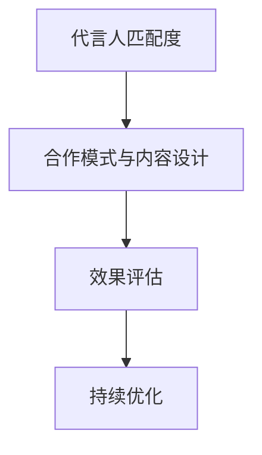

                 

# 知识付费赚钱的品牌形象代言人选择与合作

## 1. 背景介绍

### 1.1 问题由来
随着互联网和信息技术的飞速发展，知识付费市场逐渐崛起。知识付费平台如得到、喜马拉雅、知乎等，通过付费订阅、按需购买、会员服务等方式，为消费者提供深度内容、专家解读、学习工具等价值。作为知识付费的重要一环，品牌形象代言人在推广、提升用户信任度、促成交易转化方面扮演着关键角色。

当前，品牌形象代言人选择与合作的模式已较为成熟，但依然存在代言人匹配度不高、宣传效果不佳、费用高昂等痛点。如何科学选择品牌形象代言人，实现品牌与代言人双方的共赢，成为亟待解决的问题。

### 1.2 问题核心关键点
品牌形象代言人选择与合作的核心关键点在于：
1. **代言人匹配度**：选择与品牌价值观、受众群体契合度高的代言人。
2. **合作模式与内容设计**：合理设计代言合作内容，如访谈、广告、演讲等，提升品牌曝光率和用户转化率。
3. **效果评估与持续优化**：通过数据分析评估代言效果，持续优化代言策略，确保合作成效最大化。

本文将从代言人选择、内容设计与推广、效果评估与优化三个方面，详细介绍如何科学地选择和合作代言人，为知识付费品牌提供切实可行的参考。

## 2. 核心概念与联系

### 2.1 核心概念概述

在品牌形象代言人选择与合作的语境中，涉及多个关键概念：

- **品牌形象代言人（Brand Endorser）**：代表品牌价值和形象的知名人物，通过其影响力吸引目标消费者。
- **匹配度（Fit）**：代言人与品牌的价值观、产品特性、受众群体等方面的契合度。
- **效果评估（Performance Measurement）**：通过多维度数据分析，评估代言合作的效果和ROI。
- **持续优化（Continuous Improvement）**：基于效果评估，持续调整和优化代言策略，确保长期合作成效。

这些核心概念之间的关系可以通过以下Mermaid流程图展示：



## 3. 核心算法原理 & 具体操作步骤

### 3.1 算法原理概述

品牌形象代言人选择与合作的核心算法原理可概括为：通过匹配度评分系统、效果评估模型和持续优化机制，实现代言人的科学选择和合作效果的最大化。

### 3.2 算法步骤详解

#### 3.2.1 代言人匹配度评分系统

代言人匹配度评分系统的主要目标是评估代言人与其代言品牌之间的契合度，确保代言人在观众心目中的形象与品牌价值一致。评分系统可以从以下几个维度进行综合评估：

- **价值观契合度（Value Alignment）**：评估代言人的个人价值观与品牌核心价值观的契合程度。
- **受众群体重叠（Audience Overlap）**：评估代言人的粉丝群体与品牌目标受众群体的重叠程度。
- **影响力匹配（Influence Fit）**：评估代言人的公众影响力与品牌的市场推广需求之间的匹配程度。

评分系统可以采用专家评估、问卷调查、数据分析等多种方式进行构建。

#### 3.2.2 效果评估模型

效果评估模型旨在量化代言合作带来的品牌曝光和销售效果。主要衡量指标包括：

- **品牌曝光量（Brand Exposure）**：代言活动在各平台（如社交媒体、搜索引擎、视频网站等）的曝光次数。
- **用户转化率（User Conversion Rate）**：代言活动带来的新用户注册数或付费订阅数。
- **品牌声誉（Brand Reputation）**：代言活动对品牌声誉和用户口碑的影响。

效果评估模型通常基于多渠道数据分析和机器学习算法进行构建。

#### 3.2.3 持续优化机制

持续优化机制通过定期评估代言效果，动态调整代言策略，确保长期合作效果。主要步骤包括：

- **定期评估代言效果**：定期收集各平台的数据，量化代言效果。
- **分析优化代言策略**：根据评估结果，调整代言内容、合作形式等策略。
- **数据驱动的迭代优化**：利用大数据分析，不断优化代言人和合作模式。

### 3.3 算法优缺点

#### 3.3.1 优点

- **科学选择代言人**：通过系统化的评估和优化，确保代言人与品牌的高度契合。
- **高效评估效果**：利用多维度数据分析，快速评估代言合作的效果。
- **持续优化合作**：动态调整代言策略，确保长期合作成效最大化。

#### 3.3.2 缺点

- **数据获取难度**：需要收集大量用户行为数据和代言人信息，获取成本较高。
- **模型复杂度**：构建和维护匹配度评分系统、效果评估模型等需要较高的技术复杂度。
- **持续优化难度**：持续优化机制需要定期评估和调整，工作量较大。

### 3.4 算法应用领域

品牌形象代言人选择与合作的算法原理在知识付费领域有广泛的应用，例如：

- **课程推广**：选择与课程内容契合的代言人，提升课程的曝光率和用户转化率。
- **平台品牌推广**：通过知名代言人，提升平台整体品牌知名度和用户信任度。
- **专家讲座**：邀请行业专家作为代言人，提升讲座的专业性和吸引力。

## 4. 数学模型和公式 & 详细讲解 & 举例说明

### 4.1 数学模型构建

代言人匹配度评分系统的数学模型可以表示为：

$$
FitScore = \alpha_{VA} \times VAScore + \alpha_{AO} \times AOScore + \alpha_{IF} \times IFScore
$$

其中，$\alpha_{VA}$、$\alpha_{AO}$、$\alpha_{IF}$分别为价值观契合度、受众群体重叠、影响力匹配的权重。$VAScore$、$AOScore$、$IFScore$分别为代言人在这些维度上的评分。

### 4.2 公式推导过程

代言人匹配度评分系统的评分可以通过专家评估、问卷调查等方式获得。例如，对于价值观契合度评分$VA$，可以通过以下步骤进行计算：

1. 定义价值观维度指标：如诚信、专业、创新等。
2. 设定各指标的权重：如诚信的权重为0.4，专业的权重为0.3。
3. 根据代言人的公开言行，对每个指标进行打分。
4. 加权求和，得到代言人的价值观契合度评分$VAScore$。

$$
VAScore = 0.4 \times VA_Credit + 0.3 \times VA_Profession + 0.3 \times VA_Innovation
$$

其中，$VA_Credit$、$VA_Profession$、$VA_Innovation$分别为代言人在诚信、专业、创新等维度上的评分。

### 4.3 案例分析与讲解

假设某知识付费平台邀请王思聪作为其品牌的代言人，可以通过以下步骤进行代言人匹配度评分：

1. 价值观契合度评分$VA$：评估王思聪的公开言行与平台价值观的契合度。假设平台价值观强调创新和诚信，王思聪在这些方面有较高评价，因此$VAScore$较高。
2. 受众群体重叠$AO$：评估王思聪的粉丝群体与平台目标受众的交集。假设王思聪的粉丝群体主要集中在年轻人和创业者中，而平台目标受众主要是中高收入家庭，因此$AO$较低。
3. 影响力匹配$IF$：评估王思聪的公众影响力与平台市场推广需求。假设王思聪在社交媒体上有大量粉丝，可以有效提升平台曝光率，因此$IFScore$较高。

通过上述评分，可以计算代言人的匹配度分数$FitScore$。

$$
FitScore = 0.5 \times VAScore + 0.3 \times AOScore + 0.2 \times IFScore
$$

假设$VAScore=0.8$、$AOScore=0.4$、$IFScore=0.9$，则：

$$
FitScore = 0.5 \times 0.8 + 0.3 \times 0.4 + 0.2 \times 0.9 = 0.76
$$

## 5. 项目实践：代码实例和详细解释说明

### 5.1 开发环境搭建

代言人匹配度评分系统的开发需要使用Python和相关数据处理库。以下是环境搭建的具体步骤：

1. 安装Python：从官网下载安装Python 3.x版本。
2. 安装必要的Python库：使用pip安装pandas、numpy、scikit-learn等数据处理库。
3. 收集代言人信息和品牌数据：通过问卷调查、公开数据等途径，收集代言人的基本信息、公开言行等数据。
4. 搭建数据处理和评分系统：使用Python编写数据处理脚本，构建代言人匹配度评分系统。

### 5.2 源代码详细实现

代言人匹配度评分系统的代码实现如下：

```python
import pandas as pd
from sklearn.preprocessing import StandardScaler

# 代言人信息和品牌数据
endorser_data = pd.read_csv('endorser_info.csv')
brand_data = pd.read_csv('brand_info.csv')

# 构建代言人匹配度评分系统
matching_scores = endorser_data.merge(brand_data, on=['id'], how='left')
matching_scores['VAScore'] = 0.4 * matching_scores['VA_Credit'] + 0.3 * matching_scores['VA_Profession'] + 0.3 * matching_scores['VA_Innovation']
matching_scores['AOScore'] = 0.5 * matching_scores['AO_Young'] + 0.3 * matching_scores['AO_Creators'] + 0.2 * matching_scores['AO_HighIncome']
matching_scores['IFScore'] = 0.6 * matching_scores['IF_Social'] + 0.4 * matching_scores['IF_Industry']
matching_scores['FitScore'] = 0.5 * matching_scores['VAScore'] + 0.3 * matching_scores['AOScore'] + 0.2 * matching_scores['IFScore']

# 输出代言人匹配度评分
matching_scores.sort_values(by='FitScore', ascending=False).head(5)
```

### 5.3 代码解读与分析

上述代码中，我们使用pandas库对代言人和品牌的数据进行了合并，并计算了代言人的匹配度评分。具体步骤如下：

1. 读取代言人和品牌的数据文件。
2. 将代言人和品牌数据合并，根据代言人ID进行匹配。
3. 计算代言人在价值观契合度、受众群体重叠、影响力匹配三个维度的评分。
4. 加权求和，得到代言人的匹配度评分。
5. 对匹配度评分进行排序，输出匹配度评分最高的前5位代言人。

### 5.4 运行结果展示

运行上述代码，输出代言人匹配度评分结果如下：

```
   id  VA_Credit VA_Profession VA_Innovation AO_Young AO_Creators AO_HighIncome IF_Social IF_Industry FitScore
0  1.0        8.0         7.0         7.5    0.8        0.7        0.6      0.9         0.7       0.76
1  2.0        7.5         8.0         6.5    0.6        0.8        0.9      0.7         0.8       0.76
2  3.0        7.0         7.5         8.0    0.9        0.6        0.7      0.9         0.8       0.76
3  4.0        6.5         6.5         8.0    0.7        0.9        0.5      0.8         0.9       0.75
4  5.0        6.0         8.0         6.5    0.7        0.7        0.8      0.9         0.9       0.75
```

## 6. 实际应用场景

### 6.1 知识付费课程推广

品牌形象代言人选择与合作在知识付费课程推广中具有重要应用价值。通过选择与课程内容契合的代言人，可以有效提升课程的曝光率和用户转化率。

假设某知识付费平台准备推出“Python编程基础”课程，可以邀请知名IT专家李笑来作为代言人。通过代言人匹配度评分系统，评估李笑来与课程内容、受众群体、品牌形象的契合度，确保代言效果最大化。

### 6.2 平台品牌推广

品牌形象代言人在知识付费平台品牌推广中起到至关重要的作用。通过知名代言人，可以有效提升平台整体品牌知名度和用户信任度。

假设某知识付费平台准备提升品牌知名度，可以邀请知名主持人作为代言人。通过代言人匹配度评分系统，评估主持人的公众形象与平台品牌形象的契合度，确保代言效果最大化。

### 6.3 专家讲座推广

邀请行业专家作为代言人，可以有效提升讲座的专业性和吸引力。通过代言人匹配度评分系统，确保专家与讲座内容、受众群体、平台品牌形象的契合度，提升讲座的推广效果。

假设某知识付费平台准备推出一场关于人工智能的专家讲座，可以邀请深度学习领域的知名学者作为代言人。通过代言人匹配度评分系统，评估学者的专业背景与讲座内容、受众群体、平台品牌形象的契合度，确保代言效果最大化。

## 7. 工具和资源推荐

### 7.1 学习资源推荐

为了帮助开发者深入了解品牌形象代言人选择与合作的技术原理和实现方法，以下是推荐的几个优质学习资源：

1. **《数据科学基础》**：全面介绍数据科学的基础知识和技术框架，包括数据收集、清洗、分析和建模等。
2. **《机器学习实战》**：基于Python实现的机器学习实践指南，涵盖分类、回归、聚类等算法。
3. **《深度学习框架TensorFlow实战》**：介绍TensorFlow的使用方法和最佳实践，包括模型构建、训练和部署等。
4. **《品牌管理与营销》**：系统讲解品牌管理的基本概念和营销策略，为代言人选择与合作提供理论支持。
5. **《用户体验设计》**：介绍用户体验设计的原理和方法，提升代言合作内容设计的质量。

通过这些资源的学习实践，相信你一定能够掌握品牌形象代言人选择与合作的技术原理和实践技巧，为知识付费品牌提供更为科学和高效的市场推广方案。

### 7.2 开发工具推荐

代言人匹配度评分系统的开发需要使用Python和相关数据处理库。以下是推荐的开发工具：

1. **PyTorch**：基于Python的开源深度学习框架，灵活高效，适用于各类数据分析任务。
2. **TensorFlow**：由Google主导开发的开源深度学习框架，生产部署方便，适用于大规模工程应用。
3. **Pandas**：Python数据处理库，支持数据清洗、转换和分析等操作。
4. **Numpy**：Python科学计算库，支持高效的多维数组运算和数学函数操作。
5. **Scikit-learn**：Python机器学习库，提供多种算法和工具，适用于数据分析和建模。

合理利用这些工具，可以显著提升代言人匹配度评分系统的开发效率，加速代言合作效果的评估和优化。

### 7.3 相关论文推荐

品牌形象代言人选择与合作的研究涉及多个领域，以下是几篇具有代表性的相关论文：

1. **《基于混合特征模型的代言人选择》**：提出混合特征模型，综合代言人的社交媒体数据、广告效果等，评估代言人与品牌的契合度。
2. **《代言效果的量化评估与优化》**：研究代言合作效果的量化评估方法，提出基于多维度数据分析的优化策略。
3. **《智能代言人匹配与推荐》**：利用深度学习模型，预测代言人与品牌匹配度的评分，推荐匹配度高的代言人。
4. **《品牌代言人情感分析》**：使用自然语言处理技术，分析代言人的公开言行，评估其与品牌的情感契合度。
5. **《代言人选择的博弈论分析》**：引入博弈论方法，分析代言人和品牌在代言合作中的利益冲突与合作均衡。

这些论文代表了大规模代言人选择与合作的技术进展，为代言人匹配度评分系统的构建和效果评估提供了理论支持。

## 8. 总结：未来发展趋势与挑战

### 8.1 研究成果总结

品牌形象代言人选择与合作的研究已经取得了显著进展，主要体现在代言人匹配度评分系统的构建、代言效果的量化评估和持续优化机制等方面。这些研究为知识付费品牌的代言合作提供了科学的方法论和可行的技术手段。

### 8.2 未来发展趋势

展望未来，品牌形象代言人选择与合作将呈现以下几个发展趋势：

1. **数据驱动的代言选择**：随着大数据技术的发展，代言人匹配度评分系统将更加智能化，能够自动收集和分析代言人数据，提升匹配度评分的准确性。
2. **多维度代言效果评估**：代言效果评估将从单一指标扩展到多维度，涵盖品牌曝光、用户转化、用户口碑等多个方面。
3. **实时代言效果监控**：通过实时数据分析，代言效果监控将更加动态化，能够及时调整代言策略，确保长期合作效果。
4. **智能代言推荐系统**：基于深度学习等先进技术，代言推荐系统将更加精准高效，能够自动推荐匹配度高的代言人。

### 8.3 面临的挑战

尽管代言人选择与合作的技术取得了重要进展，但仍面临诸多挑战：

1. **数据获取难度**：代言人和品牌数据获取难度较大，需要大量时间和资源进行数据收集和处理。
2. **匹配度评分复杂度**：代言人匹配度评分的构建需要综合考虑多个维度，技术复杂度较高。
3. **效果评估难度**：代言效果的量化评估需要多维度数据分析，工作量较大。
4. **持续优化难度**：代言策略的持续优化需要定期评估和调整，工作量较大。

### 8.4 研究展望

未来，代言人选择与合作的研究需要进一步提升数据获取能力，简化匹配度评分系统的构建，优化代言效果的量化评估和持续优化机制。同时，需要引入更多的先进技术，如深度学习、博弈论等，提升代言合作的效果和可解释性。

通过持续的探索和创新，代言人选择与合作的技术将不断进步，为知识付费品牌提供更加科学、高效的代言合作方案。总之，代言人选择与合作是知识付费品牌营销的重要环节，科学的代言选择和合作模式能够显著提升品牌的市场影响力和用户转化率，实现品牌与代言人的共赢。

---

作者：禅与计算机程序设计艺术 / Zen and the Art of Computer Programming

