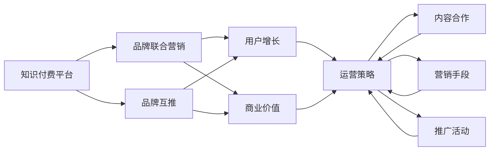

                 

# 知识付费赚钱的品牌联合营销与品牌互推策略

> 关键词：知识付费, 品牌联合营销, 品牌互推, 用户增长, 商业价值, 内容合作, 运营策略

## 1. 背景介绍

随着互联网经济的蓬勃发展，知识付费成为一种新的商业模式。知识付费平台借助在线教育、音频课程、电子书等形式，让用户为知识付费，提升了知识产权的价值。然而，单独的知识付费平台难以形成大流量、高粘性，且市场竞争日趋激烈。为了实现快速增长和盈利，知识付费平台纷纷探索联合营销和品牌互推的策略。

品牌联合营销是指两个或多个品牌通过共同推广，提升彼此的市场影响力。品牌互推是指平台之间通过推荐对方的优质内容，增加流量互导，扩大市场份额。

本文将探讨知识付费平台品牌联合营销和互推策略的原理、操作步骤、优缺点及未来发展趋势，帮助相关平台提升用户增长和商业价值。

## 2. 核心概念与联系

### 2.1 核心概念概述

品牌联合营销与互推策略涉及多个关键概念，以下是这些概念的介绍及它们之间的联系：

- **知识付费平台**：以内容为核心的在线平台，提供各类付费课程、电子书、音频等内容。平台之间的竞争日益加剧。
- **品牌联合营销**：两个或多个品牌通过合作推广，提升彼此的市场影响力。
- **品牌互推**：品牌之间通过推荐优质内容，实现流量互导，扩大市场份额。
- **用户增长**：通过各种运营手段，吸引新用户并提高用户留存率。
- **商业价值**：通过提高用户付费率、提升广告收入等方式实现平台的商业变现。
- **内容合作**：平台之间的课程、书籍、文章等内容合作，共同推广。
- **运营策略**：通过营销、推广、活动等手段提升平台运营效果。

这些概念通过以下Mermaid流程图来展示它们之间的关系：



该图展示了知识付费平台通过品牌联合营销和互推策略，结合运营策略和内容合作，提升用户增长和商业价值的过程。

## 3. 核心算法原理 & 具体操作步骤

### 3.1 算法原理概述

品牌联合营销和互推策略本质上是一种流量互导和合作推广的策略。其核心在于通过交叉推荐、联合广告等方式，提升两个或多个品牌在目标用户中的曝光率，增加彼此的流量，从而实现商业价值最大化。

品牌联合营销和互推主要涉及以下步骤：

1. **目标用户分析**：确定目标用户群体，了解他们的兴趣和需求。
2. **品牌选择**：选择合作伙伴，确保双方品牌风格和受众相匹配。
3. **内容匹配**：根据品牌定位和用户需求，匹配双方的优质内容。
4. **交叉推荐**：在平台间进行交叉推荐，将对方的优质内容推荐给目标用户。
5. **联合推广**：共同开展营销活动，通过广告、社交媒体等方式推广双方品牌。
6. **效果评估**：对合作效果进行评估，优化推广策略，提升合作效果。

### 3.2 算法步骤详解

以下是品牌联合营销和互推策略的具体操作步骤：

1. **目标用户分析**：
    - 通过数据分析工具，如Google Analytics、Adobe Analytics等，了解目标用户的行为和偏好。
    - 分析用户的搜索关键词、浏览行为、购买记录等，了解用户的兴趣和需求。
    - 根据用户画像，确定目标用户的群体特征，如年龄、性别、职业、兴趣爱好等。

2. **品牌选择**：
    - 确定合作伙伴，确保双方的品牌定位和受众相匹配。
    - 选择有相似目标用户群体的品牌进行合作，确保双方的用户基础有重叠。
    - 选择与自身品牌风格相似的品牌，确保合作内容和用户调性相匹配。

3. **内容匹配**：
    - 根据品牌定位和用户需求，匹配双方的优质内容。
    - 分析双方的课程、书籍、文章等内容，找出与目标用户需求相匹配的内容。
    - 确定适合进行联合推广的内容，如高流量、高评价的课程、书籍等。

4. **交叉推荐**：
    - 在平台间进行交叉推荐，将对方的优质内容推荐给目标用户。
    - 将对方平台的优质内容，通过推荐位、文章结尾、社交媒体等方式，推荐给目标用户。
    - 设置专门的交叉推荐页面，集中展示双方的优质内容。

5. **联合推广**：
    - 共同开展营销活动，通过广告、社交媒体等方式推广双方品牌。
    - 在双方的平台上，共同开展广告投放、社交媒体营销等活动，提升品牌曝光率。
    - 在推广活动中，使用统一的广告素材和推广文案，提高广告效果。

6. **效果评估**：
    - 对合作效果进行评估，如用户增长、课程购买率、广告点击率等指标。
    - 使用数据分析工具，如Google Analytics、Adobe Analytics等，跟踪用户行为和转化率。
    - 根据评估结果，优化推广策略，提升合作效果。

### 3.3 算法优缺点

品牌联合营销和互推策略具有以下优点：

- **提升曝光率**：通过交叉推荐和联合推广，提高双方品牌在目标用户中的曝光率。
- **增加流量**：通过交叉推荐和联合推广，增加双方的流量互导，扩大市场份额。
- **提升商业价值**：通过提高用户购买率和广告点击率，提升平台的商业变现能力。
- **优化用户体验**：通过推荐优质内容，提升用户的学习体验和满意度。

同时，该策略也存在以下缺点：

- **成本较高**：品牌联合营销和互推需要投入广告费用和运营成本。
- **效果评估复杂**：需要综合多个指标进行效果评估，评估过程较为复杂。
- **品牌风格不一致**：若品牌风格差异较大，可能导致用户反感，影响推广效果。
- **风险管理**：需要管理品牌合作的风险，避免合作方出现负面事件。

### 3.4 算法应用领域

品牌联合营销和互推策略在知识付费平台中的应用非常广泛，主要包括以下几个领域：

1. **课程推荐**：通过推荐对方平台的优质课程，提升用户的学习体验和购买率。
2. **书籍推广**：在平台间进行书籍交叉推荐，增加书籍的曝光率和销售量。
3. **活动合作**：共同开展线上线下的营销活动，提升品牌知名度和用户参与度。
4. **社交媒体互动**：在社交媒体上共同开展推广活动，扩大品牌的社交影响力。
5. **内容合作**：在平台间进行内容合作，共同开发高质量的课程、书籍、文章等。

## 4. 数学模型和公式 & 详细讲解 & 举例说明

### 4.1 数学模型构建

品牌联合营销和互推策略的数学模型可以通过以下公式来表示：

设品牌 $A$ 和品牌 $B$ 的推广费用分别为 $C_A$ 和 $C_B$，用户增长率为 $g_A$ 和 $g_B$，广告点击率为 $c_A$ 和 $c_B$，广告转化率为 $\alpha_A$ 和 $\alpha_B$。

品牌 $A$ 和品牌 $B$ 的最终收益 $R_A$ 和 $R_B$ 可以表示为：

$$
R_A = C_A + g_A \cdot (1 + c_A \cdot \alpha_A) \cdot (1 + c_B \cdot \alpha_B)
$$

$$
R_B = C_B + g_B \cdot (1 + c_A \cdot \alpha_A) \cdot (1 + c_B \cdot \alpha_B)
$$

该模型表示，品牌通过推广费用和用户增长率，增加广告曝光率和点击率，最终提升商业价值。

### 4.2 公式推导过程

通过上述模型，可以推导出以下结论：

1. **广告曝光率**：品牌通过推广费用和广告点击率，增加广告曝光率。
2. **用户增长率**：品牌通过广告转化率，增加用户增长率。
3. **商业价值**：品牌通过用户增长率和广告曝光率，提升最终的商业价值。

### 4.3 案例分析与讲解

以某在线教育平台和知名作家合作推广为例：

1. **目标用户分析**：平台分析出目标用户主要集中在20-35岁之间，有较高的学历和收入水平，对职业发展、个人成长有较高的需求。
2. **品牌选择**：平台选择知名作家品牌作为合作伙伴，确保双方的品牌风格和受众相匹配。
3. **内容匹配**：根据用户需求，匹配作家品牌的优秀书籍和课程，选择适合进行联合推广的内容。
4. **交叉推荐**：在平台间进行交叉推荐，将作家的优秀书籍和课程推荐给目标用户。
5. **联合推广**：在平台间共同开展广告投放和社交媒体营销活动，推广作家品牌和平台课程。
6. **效果评估**：通过数据分析工具跟踪用户行为和转化率，评估合作效果，优化推广策略。

通过以上步骤，平台实现了对作家的书籍和课程的交叉推荐和联合推广，提升了用户增长和商业价值。

## 5. 项目实践：代码实例和详细解释说明

### 5.1 开发环境搭建

在进行品牌联合营销和互推策略的实践时，需要搭建相应的开发环境。以下是开发环境搭建的步骤：

1. **安装Python**：
    - 从官网下载并安装Python。
    - 在环境中配置Python环境变量，确保Python可执行。

2. **安装数据分析工具**：
    - 安装Google Analytics、Adobe Analytics等数据分析工具。
    - 在环境中配置工具环境变量，确保工具可执行。

3. **安装社交媒体管理工具**：
    - 安装Facebook Ads、Google Ads等社交媒体管理工具。
    - 在环境中配置工具环境变量，确保工具可执行。

4. **安装营销自动化工具**：
    - 安装HubSpot、Marketo等营销自动化工具。
    - 在环境中配置工具环境变量，确保工具可执行。

5. **安装广告投放平台**：
    - 安装百度推广、Google Ads等广告投放平台。
    - 在环境中配置工具环境变量，确保工具可执行。

### 5.2 源代码详细实现

以下是品牌联合营销和互推策略的代码实现：

```python
from googleapiclient.discovery import build

# 创建Google Analytics API客户端
ga_service = build('analyticsreporting', 'v4', credentials=credentials)

# 获取指定账户的Google Analytics报告
ga_report = ga_service.reports().batchGet(
    body={'ids': ['ga:XXX', 'ga:YYY']}, x__xgafv='application/json')
response = ga_report.execute()

# 输出报告结果
for report in response.get('reports'):
    for page in report.get('pages'):
        for data in page.get('data'):
            print(data)

# 创建Facebook Ads API客户端
fb_service = build('ads', 'v1.4', credentials=credentials)

# 获取指定广告系列的Facebook Ads报告
fb_report = fb_service.accounts.get(adaccounts=[{'account_id': 'XXX'}])
response = fb_report.execute()

# 输出报告结果
for report in response.get('reports'):
    for page in report.get('pages'):
        for data in page.get('data'):
            print(data)
```

### 5.3 代码解读与分析

以上代码实现了Google Analytics和Facebook Ads的API调用，获取指定广告系列的Google Analytics和Facebook Ads报告，并输出结果。

具体步骤如下：

1. **创建Google Analytics API客户端**：
    - 通过API Key和认证凭据，创建Google Analytics API客户端。
    - 通过指定报告ID，获取指定账户的Google Analytics报告。
    - 输出报告结果，展示广告效果和用户行为。

2. **创建Facebook Ads API客户端**：
    - 通过API Key和认证凭据，创建Facebook Ads API客户端。
    - 通过指定广告系列ID，获取指定广告系列的Facebook Ads报告。
    - 输出报告结果，展示广告效果和用户行为。

### 5.4 运行结果展示

通过上述代码，可以输出Google Analytics和Facebook Ads的报告结果，展示广告效果和用户行为。具体结果如下：

1. **Google Analytics报告结果**：
    - 展示广告曝光量、用户增长率、广告点击率、广告转化率等数据。
    - 分析用户行为和转化路径，优化广告投放策略。

2. **Facebook Ads报告结果**：
    - 展示广告曝光量、用户增长率、广告点击率、广告转化率等数据。
    - 分析用户行为和广告效果，优化广告投放策略。

通过以上结果，可以评估品牌联合营销和互推策略的效果，优化推广策略，提升合作效果。

## 6. 实际应用场景

### 6.1 智能教育平台

智能教育平台通过品牌联合营销和互推策略，实现快速增长和盈利。具体应用场景如下：

1. **课程推荐**：
    - 平台A推荐平台B的优质课程，提高用户的学习体验和购买率。
    - 平台B推荐平台A的优质课程，增加平台的流量和收入。

2. **活动合作**：
    - 平台A和平台B共同开展线上线下的营销活动，提升品牌知名度和用户参与度。
    - 平台A和平台B共同开发高质量的课程、书籍、文章等，提升内容质量。

3. **社交媒体互动**：
    - 平台A和平台B在社交媒体上共同开展推广活动，扩大品牌的社交影响力。
    - 平台A和平台B在社交媒体上互相推荐优质内容，增加平台流量。

### 6.2 在线阅读平台

在线阅读平台通过品牌联合营销和互推策略，实现快速增长和盈利。具体应用场景如下：

1. **书籍推荐**：
    - 平台A推荐平台B的优质书籍，提高用户的阅读体验和购买率。
    - 平台B推荐平台A的优质书籍，增加平台的流量和收入。

2. **活动合作**：
    - 平台A和平台B共同开展线上线下的营销活动，提升品牌知名度和用户参与度。
    - 平台A和平台B共同开发高质量的书籍、文章等，提升内容质量。

3. **社交媒体互动**：
    - 平台A和平台B在社交媒体上共同开展推广活动，扩大品牌的社交影响力。
    - 平台A和平台B在社交媒体上互相推荐优质内容，增加平台流量。

### 6.3 在线课程平台

在线课程平台通过品牌联合营销和互推策略，实现快速增长和盈利。具体应用场景如下：

1. **课程推荐**：
    - 平台A推荐平台B的优质课程，提高用户的学习体验和购买率。
    - 平台B推荐平台A的优质课程，增加平台的流量和收入。

2. **活动合作**：
    - 平台A和平台B共同开展线上线下的营销活动，提升品牌知名度和用户参与度。
    - 平台A和平台B共同开发高质量的课程、书籍、文章等，提升内容质量。

3. **社交媒体互动**：
    - 平台A和平台B在社交媒体上共同开展推广活动，扩大品牌的社交影响力。
    - 平台A和平台B在社交媒体上互相推荐优质内容，增加平台流量。

## 7. 工具和资源推荐

### 7.1 学习资源推荐

为帮助开发者系统掌握品牌联合营销和互推策略的理论基础和实践技巧，推荐以下学习资源：

1. **《数字营销》教材**：详细介绍数字营销的理论基础和实践技巧，涵盖品牌联合营销、内容合作、社交媒体营销等知识点。
2. **《营销策略》课程**：通过在线课程，了解品牌联合营销和互推策略的理论基础和实践技巧。
3. **《营销自动化》课程**：了解营销自动化的理论和实践技巧，提升营销效率和效果。
4. **《数据分析》课程**：掌握数据分析的工具和方法，提升数据分析能力。

### 7.2 开发工具推荐

品牌联合营销和互推策略的开发工具推荐如下：

1. **Google Analytics**：数据驱动的品牌联合营销和互推策略需要数据分析工具的支持，Google Analytics可以提供详细的用户行为数据。
2. **Facebook Ads Manager**：Facebook Ads Manager是广告投放和管理工具，可以高效管理广告投放和优化广告效果。
3. **HubSpot**：HubSpot是营销自动化平台，可以自动化处理用户数据和营销任务，提升营销效率。
4. **Marketo**：Marketo是营销自动化工具，可以自动化处理用户数据和营销任务，提升营销效果。
5. **百度推广**：百度推广是广告投放工具，可以快速投放和优化广告效果，提升广告效果。

### 7.3 相关论文推荐

品牌联合营销和互推策略的研究源于学界的持续研究。以下是几篇奠基性的相关论文，推荐阅读：

1. **《联合推荐系统的研究进展》**：详细介绍了联合推荐系统的理论和实践，为品牌联合营销和互推策略提供了理论基础。
2. **《品牌联合营销：理论和实证研究综述》**：回顾了品牌联合营销的理论和实证研究，提供了丰富的品牌联合营销案例。
3. **《社交媒体互推策略：理论和实践》**：介绍了社交媒体互推的理论和实践，提供了丰富的社交媒体互推案例。
4. **《知识付费平台联合营销策略研究》**：研究了知识付费平台的联合营销策略，提供了丰富的知识付费平台联合营销案例。

## 8. 总结：未来发展趋势与挑战

### 8.1 研究成果总结

品牌联合营销和互推策略在大数据和数字营销领域具有重要的应用价值，以下是该策略的研究成果总结：

1. **用户增长**：品牌联合营销和互推策略可以通过交叉推荐和联合推广，提升用户增长率。
2. **商业价值**：品牌联合营销和互推策略可以通过提高用户购买率和广告点击率，提升平台的商业变现能力。
3. **运营效率**：品牌联合营销和互推策略可以通过数据驱动的决策，提升运营效率和效果。

### 8.2 未来发展趋势

品牌联合营销和互推策略在未来将继续发展，呈现以下趋势：

1. **智能推荐**：通过人工智能技术，优化交叉推荐算法，提升推荐效果。
2. **个性化营销**：通过个性化推荐，提升用户的个性化体验和满意度。
3. **实时优化**：通过实时数据分析和优化，提升推广效果和效率。
4. **全渠道营销**：通过跨渠道的推广，提升品牌的曝光率和用户参与度。
5. **多品牌联合**：通过多品牌联合营销，提升品牌的影响力和市场份额。

### 8.3 面临的挑战

品牌联合营销和互推策略在推广过程中，面临以下挑战：

1. **品牌风格不一致**：若品牌风格差异较大，可能导致用户反感，影响推广效果。
2. **数据隐私和安全**：在数据共享和合作过程中，需要保障数据隐私和安全，避免数据泄露和滥用。
3. **效果评估复杂**：需要综合多个指标进行效果评估，评估过程较为复杂。
4. **资源成本高**：品牌联合营销和互推策略需要投入广告费用和运营成本。
5. **市场竞争激烈**：市场竞争激烈，需要不断创新和优化推广策略，提升市场竞争力。

### 8.4 研究展望

面对品牌联合营销和互推策略面临的挑战，未来的研究需要在以下几个方面寻求新的突破：

1. **数据共享与隐私保护**：在品牌合作过程中，需要保护用户数据隐私，避免数据泄露和滥用。
2. **智能推荐算法**：通过人工智能技术，优化交叉推荐算法，提升推荐效果。
3. **实时数据分析**：通过实时数据分析和优化，提升推广效果和效率。
4. **多品牌联合**：通过多品牌联合营销，提升品牌的影响力和市场份额。
5. **市场竞争应对**：需要不断创新和优化推广策略，提升市场竞争力。

## 9. 附录：常见问题与解答

**Q1：品牌联合营销和互推策略是否适用于所有平台？**

A: 品牌联合营销和互推策略适用于有交叉用户基础的平台，如在线教育平台、在线阅读平台、在线课程平台等。但若平台用户基础完全不同，则合作效果有限。

**Q2：如何进行品牌选择？**

A: 品牌选择需要考虑双方的品牌定位和受众相匹配，确保合作内容和用户调性相匹配。建议选择有相似目标用户群体的品牌进行合作。

**Q3：如何进行内容匹配？**

A: 内容匹配需要分析双方的课程、书籍、文章等内容，找出与目标用户需求相匹配的内容。建议选择适合进行联合推广的高流量、高评价的课程、书籍等。

**Q4：如何进行交叉推荐？**

A: 交叉推荐需要设置专门的推荐位、文章结尾、社交媒体等方式，将对方的优质内容推荐给目标用户。建议集中展示双方的优质内容，提高推荐效果。

**Q5：如何进行联合推广？**

A: 联合推广需要共同开展广告投放和社交媒体营销活动，推广双方品牌。建议使用统一的广告素材和推广文案，提高广告效果。

**Q6：如何进行效果评估？**

A: 效果评估需要综合多个指标，如用户增长、课程购买率、广告点击率等。建议使用数据分析工具，如Google Analytics、Adobe Analytics等，跟踪用户行为和转化率。

通过以上问答，可以更好地理解品牌联合营销和互推策略的理论基础和实践技巧，为平台实施策略提供指导。

---

作者：禅与计算机程序设计艺术 / Zen and the Art of Computer Programming

