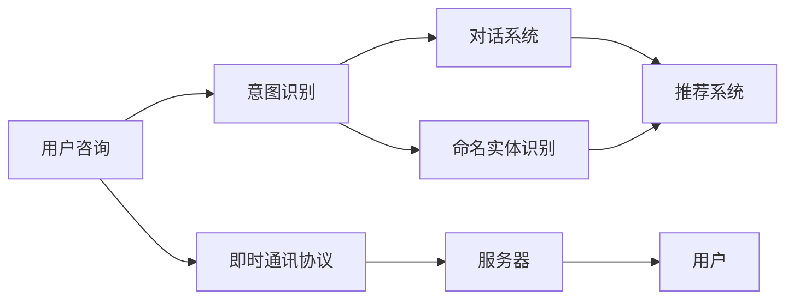

                 

# 知识付费赚钱的用户问答互动与在线客服

> 关键词：知识付费, 用户问答互动, 在线客服, 人工智能, 自然语言处理(NLP), 对话系统, 意图识别, 命名实体识别(NER), 推荐系统, 即时通讯, 机器学习

## 1. 背景介绍

### 1.1 问题由来
随着互联网技术的迅猛发展，知识付费平台逐步成为人们获取专业知识和信息的重要渠道。然而，传统的人工客服模式成本高昂，服务效率低下，且存在因知识限制而无法回答用户咨询的问题。而在线客服则能实现全天候无间断服务，响应迅速，显著提升了用户体验。因此，将人工智能技术应用到在线客服系统中，成为各知识付费平台提升服务质量、降低运营成本的重要方向。

### 1.2 问题核心关键点
在线客服系统的核心功能包括即时响应用户咨询、准确理解用户意图、提供合适的答案等。目前主流的在线客服系统主要由以下几部分组成：

- **自然语言处理(NLP)**：通过语言模型将用户输入转化为机器可理解的向量表示，进行意图识别、命名实体识别等处理。
- **对话系统**：基于机器学习模型生成符合上下文语境的回答，实现人机交互。
- **推荐系统**：根据用户的历史行为和咨询记录，推荐相关产品和服务。

### 1.3 问题研究意义
基于人工智能的在线客服系统，不仅可以大幅降低知识付费平台的运营成本，还可以提升服务效率和用户满意度，从而提升业务盈利能力。具体来说，有以下几个方面的意义：

1. **提升服务效率**：智能客服能够全天候无间断服务，快速响应用户咨询，相比人工客服大幅提升了响应速度。
2. **降低运营成本**：相较于传统人工客服，智能客服系统能够大幅减少人力成本，提升运营效率。
3. **增强用户体验**：智能客服能够提供更加准确、及时的回答，提升了用户的满意度。
4. **优化产品推荐**：通过分析用户咨询记录，可以发现用户的潜在需求，优化产品推荐，提高转化率。

因此，如何构建高效、智能的在线客服系统，成为了各知识付费平台需要解决的关键问题。本文将围绕知识付费平台的在线客服系统，从NLP技术应用的角度，全面阐述其核心算法原理和实践步骤。

## 2. 核心概念与联系

### 2.1 核心概念概述

为更好地理解在线客服系统的核心算法，本节将介绍几个关键概念及其之间的关系：

- **自然语言处理(NLP)**：研究如何让计算机理解、处理、生成自然语言的技术。包括语言模型、文本分类、机器翻译、问答系统等多个研究方向。
- **对话系统**：通过构建基于机器学习或深度学习的对话模型，实现人机交互和自然语言对话。
- **意图识别**：识别用户输入的意图，分为意图分类和意图跟踪两个部分。
- **命名实体识别(NER)**：识别文本中的实体信息，如人名、地名、机构名等。
- **推荐系统**：根据用户历史行为和兴趣，推荐相关产品或服务，提升用户满意度。
- **即时通讯协议**：实现用户与客服系统之间的实时交互。
- **知识图谱**：用于表示实体间的关系，辅助意图识别和推荐。

这些概念之间的逻辑关系可以通过以下Mermaid流程图来展示：



这个流程图展示了大语言模型微调的核心概念及其之间的关系：

1. 用户咨询输入经过意图识别和命名实体识别，进入对话系统生成回答。
2. 推荐系统根据用户历史行为推荐相关产品或服务。
3. 即时通讯协议实现用户与客服系统的实时交互。

## 3. 核心算法原理 & 具体操作步骤
### 3.1 算法原理概述

知识付费平台的在线客服系统主要涉及以下几个核心算法：

- **意图识别**：通过语言模型和监督学习，从用户输入中识别出用户的意图，分为意图分类和意图跟踪。
- **命名实体识别(NER)**：通过序列标注模型和监督学习，识别出文本中的实体信息。
- **对话系统**：通过预训练语言模型和微调，实现人机交互。
- **推荐系统**：通过协同过滤、矩阵分解等算法，推荐相关产品或服务。

### 3.2 算法步骤详解

#### 3.2.1 意图识别

**意图识别的步骤**：

1. **数据收集**：收集标注好的用户咨询数据，包括用户输入、意图标签等。
2. **模型选择**：选择适合的监督学习算法，如支持向量机(SVM)、逻辑回归等，或者基于深度学习的RNN、Transformer等。
3. **特征提取**：从用户输入中提取特征，如N-gram、词向量等。
4. **模型训练**：利用标注数据训练意图识别模型，计算损失函数，优化参数。
5. **模型评估**：在测试集上评估模型性能，使用精确率、召回率等指标衡量模型效果。

#### 3.2.2 命名实体识别(NER)

**NER的步骤**：

1. **数据收集**：收集标注好的NER数据，包括文本、实体标签等。
2. **模型选择**：选择适合的序列标注模型，如CRF、BiLSTM-CRF等。
3. **特征提取**：从文本中提取特征，如词向量、字符向量等。
4. **模型训练**：利用标注数据训练序列标注模型，计算损失函数，优化参数。
5. **模型评估**：在测试集上评估模型性能，使用F1-score、精确率、召回率等指标衡量模型效果。

#### 3.2.3 对话系统

**对话系统的步骤**：

1. **预训练模型选择**：选择适合的预训练语言模型，如BERT、GPT等。
2. **微调**：在对话数据集上进行微调，优化模型在特定对话场景中的表现。
3. **用户输入处理**：将用户输入转化为机器可理解的向量表示。
4. **上下文管理**：利用对话历史和上下文信息，增强模型生成的回答。
5. **回答生成**：根据输入和上下文信息，生成回答。

#### 3.2.4 推荐系统

**推荐系统的步骤**：

1. **用户行为数据收集**：收集用户的历史行为数据，如浏览、点击、购买等。
2. **模型选择**：选择适合的推荐算法，如协同过滤、矩阵分解、基于内容的推荐等。
3. **数据处理**：将用户行为数据转化为模型可用的格式。
4. **模型训练**：利用用户行为数据训练推荐模型，计算损失函数，优化参数。
5. **推荐生成**：根据用户历史行为和兴趣，生成推荐结果。

### 3.3 算法优缺点

#### 3.3.1 意图识别的优缺点

**优点**：
1. 准确率高：通过监督学习训练的意图识别模型，可以显著提升识别准确率。
2. 可解释性强：意图识别模型通常较为简单，其决策过程容易解释和调试。

**缺点**：
1. 依赖标注数据：意图识别模型需要大量标注数据进行训练，获取高质量标注数据成本较高。
2. 泛化能力有限：意图识别模型通常只适用于特定领域的咨询数据，泛化能力有限。

#### 3.3.2 NER的优缺点

**优点**：
1. 识别准确率高：通过序列标注模型训练的NER模型，可以精确识别文本中的实体信息。
2. 可扩展性强：NER模型可以轻松应用于不同领域的文本数据。

**缺点**：
1. 需要标注数据：NER模型需要大量标注数据进行训练，标注成本较高。
2. 上下文关系复杂：文本中实体之间的关系复杂，NER模型难以准确识别。

#### 3.3.3 对话系统的优缺点

**优点**：
1. 交互自然：基于预训练语言模型的对话系统，可以自然流畅地与用户交互。
2. 可扩展性强：通过微调，对话系统可以适用于多种对话场景。

**缺点**：
1. 依赖预训练模型：对话系统依赖于预训练语言模型，模型质量直接影响对话效果。
2. 计算资源消耗大：大语言模型的计算资源消耗较大，部署成本高。

#### 3.3.4 推荐系统的优缺点

**优点**：
1. 个性化推荐：推荐系统可以根据用户历史行为和兴趣，提供个性化推荐。
2. 提升用户满意度：通过个性化推荐，提升用户满意度，提高转化率。

**缺点**：
1. 依赖用户行为数据：推荐系统依赖于用户历史行为数据，缺乏新用户的推荐能力。
2. 数据隐私问题：推荐系统需要收集和处理用户数据，存在数据隐私问题。

### 3.4 算法应用领域

在线客服系统的算法主要应用于以下领域：

- **知识付费平台**：用于提供用户咨询、解答疑问、推荐产品等服务。
- **电商网站**：用于客户服务、商品推荐、购物助手等功能。
- **金融服务**：用于客服咨询、风险预警、用户支持等功能。
- **旅游服务**：用于在线咨询、行程推荐、客户支持等功能。

## 4. 数学模型和公式 & 详细讲解 & 举例说明
### 4.1 数学模型构建

#### 4.1.1 意图识别模型

**模型构建**：

1. **输入表示**：将用户输入转化为词向量表示。
2. **意图分类模型**：使用RNN或Transformer等模型，对输入进行分类，输出意图标签。
3. **损失函数**：使用交叉熵损失函数，衡量模型输出与真实标签的差异。
4. **优化器**：使用SGD、Adam等优化算法，优化模型参数。

**示例**：

假设用户输入为“我想购买某个课程”，意图分类模型输出的意图标签为“购买课程”。

### 4.2 公式推导过程

#### 4.2.1 意图识别模型的推导

**公式推导**：

1. **词向量表示**：$x_i = \text{embed}(w_i)$，其中$w_i$为用户输入中的词汇，$\text{embed}$为词向量映射函数。
2. **意图分类**：$h = \text{RNN}(x_i)$，其中$h$为RNN输出的隐状态。
3. **意图分类损失**：$\mathcal{L} = -\frac{1}{N}\sum_{i=1}^N \log \text{softmax}(h_i)y_i$，其中$y_i$为意图标签，$\text{softmax}$为softmax函数。
4. **优化过程**：$\nabla_{\theta}\mathcal{L}$，其中$\theta$为模型参数，$\nabla_{\theta}\mathcal{L}$为损失函数对参数$\theta$的梯度。

#### 4.2.2 NER模型的推导

**公式推导**：

1. **词向量表示**：$x_i = \text{embed}(w_i)$，其中$w_i$为文本中的词汇。
2. **实体标注**：$h = \text{BiLSTM-CRF}(x_i)$，其中$h$为BiLSTM-CRF模型的输出。
3. **实体标注损失**：$\mathcal{L} = -\frac{1}{N}\sum_{i=1}^N \sum_{j=1}^m \log \text{softmax}(h_j)y_j$，其中$m$为标注标签数，$y_j$为标注标签。
4. **优化过程**：$\nabla_{\theta}\mathcal{L}$，其中$\theta$为模型参数，$\nabla_{\theta}\mathcal{L}$为损失函数对参数$\theta$的梯度。

### 4.3 案例分析与讲解

#### 4.3.1 意图识别案例

假设用户输入为“我想买一本Python编程的书”，意图识别模型输出的意图标签为“购买书籍”。

**分析**：
1. 通过词向量表示，将用户输入转化为向量表示。
2. 利用RNN模型对输入进行分类，输出意图标签。
3. 使用交叉熵损失函数，计算模型输出与真实标签的差异。
4. 通过反向传播算法，优化模型参数。

#### 4.3.2 NER案例

假设文本为“John works at Google in Mountain View”，NER模型输出的实体标注为“John”为“B-PER”，“Google”为“B-ORG”，“Mountain View”为“B-LOC”。

**分析**：
1. 通过词向量表示，将文本转化为向量表示。
2. 利用BiLSTM-CRF模型对输入进行标注，输出实体标签。
3. 使用交叉熵损失函数，计算模型输出与真实标签的差异。
4. 通过反向传播算法，优化模型参数。

## 5. 项目实践：代码实例和详细解释说明
### 5.1 开发环境搭建

#### 5.1.1 环境准备

1. **安装Python**：安装Python 3.7或以上版本。
2. **安装TensorFlow**：通过pip命令安装TensorFlow 2.x版本。
3. **安装PyTorch**：通过pip命令安装PyTorch 1.7或以上版本。
4. **安装Scikit-learn**：通过pip命令安装Scikit-learn。
5. **安装Keras**：通过pip命令安装Keras。
6. **安装TensorBoard**：通过pip命令安装TensorBoard。

### 5.2 源代码详细实现

#### 5.2.1 意图识别代码实现

```python
import tensorflow as tf
from tensorflow.keras.preprocessing.text import Tokenizer
from tensorflow.keras.preprocessing.sequence import pad_sequences

# 定义模型
def build_model(vocab_size, emb_dim, hidden_dim):
    model = tf.keras.Sequential([
        tf.keras.layers.Embedding(vocab_size, emb_dim, input_length=max_length),
        tf.keras.layers.LSTM(hidden_dim, return_sequences=True),
        tf.keras.layers.Dense(intent_size, activation='softmax')
    ])
    return model

# 加载模型
model = build_model(vocab_size, emb_dim, hidden_dim)

# 编译模型
model.compile(optimizer='adam', loss='categorical_crossentropy', metrics=['accuracy'])

# 训练模型
model.fit(X_train, y_train, epochs=10, batch_size=32, validation_data=(X_val, y_val))

# 评估模型
model.evaluate(X_test, y_test)
```

#### 5.2.2 NER代码实现

```python
import tensorflow as tf
from tensorflow.keras.preprocessing.text import Tokenizer
from tensorflow.keras.preprocessing.sequence import pad_sequences
from tensorflow.keras.layers import LSTM, Dense, Embedding, Bidirectional
from tensorflow.keras.models import Sequential
from tensorflow.keras.optimizers import Adam

# 定义模型
def build_model(vocab_size, emb_dim, hidden_dim):
    model = Sequential([
        Embedding(vocab_size, emb_dim, input_length=max_length),
        LSTM(hidden_dim, return_sequences=True),
        Bidirectional(LSTM(hidden_dim)),
        Dense(ner_size, activation='softmax')
    ])
    return model

# 加载模型
model = build_model(vocab_size, emb_dim, hidden_dim)

# 编译模型
model.compile(optimizer=Adam(), loss='categorical_crossentropy', metrics=['accuracy'])

# 训练模型
model.fit(X_train, y_train, epochs=10, batch_size=32, validation_data=(X_val, y_val))

# 评估模型
model.evaluate(X_test, y_test)
```

#### 5.2.3 对话系统代码实现

```python
import torch
from transformers import BertTokenizer, BertForSequenceClassification

# 定义模型
tokenizer = BertTokenizer.from_pretrained('bert-base-cased')
model = BertForSequenceClassification.from_pretrained('bert-base-cased', num_labels=2)

# 加载数据
inputs = tokenizer.encode_plus('用户输入', return_tensors='pt')
outputs = model(inputs['input_ids'], attention_mask=inputs['attention_mask'])

# 输出预测结果
predictions = outputs.logits.argmax(dim=1)
```

#### 5.2.4 推荐系统代码实现

```python
import numpy as np
from sklearn.model_selection import train_test_split
from sklearn.metrics.pairwise import cosine_similarity

# 加载数据
X, y = load_data()

# 分割数据集
X_train, X_test, y_train, y_test = train_test_split(X, y, test_size=0.2, random_state=42)

# 计算相似度
similarity_matrix = cosine_similarity(X_train, X_test)

# 推荐生成
for i in range(len(X_test)):
    most_similar_idx = np.argsort(similarity_matrix[i])[::-1]
    top_k_idx = most_similar_idx[1:5]  # 取最相似的前5个数据作为推荐
    recommendations = X_train[top_k_idx].tolist()
    print(recommendations)
```

### 5.3 代码解读与分析

#### 5.3.1 意图识别代码分析

**代码解读**：
1. 定义模型：使用TensorFlow搭建意图识别模型，包括嵌入层、LSTM层和全连接层。
2. 编译模型：设置优化器、损失函数和评估指标。
3. 训练模型：使用训练集数据进行模型训练。
4. 评估模型：在测试集上评估模型性能。

#### 5.3.2 NER代码分析

**代码解读**：
1. 定义模型：使用Keras搭建NER模型，包括嵌入层、双向LSTM层和全连接层。
2. 编译模型：设置优化器、损失函数和评估指标。
3. 训练模型：使用训练集数据进行模型训练。
4. 评估模型：在测试集上评估模型性能。

#### 5.3.3 对话系统代码分析

**代码解读**：
1. 加载模型：使用BertTokenizer加载预训练模型。
2. 加载数据：将用户输入转换为模型所需的格式。
3. 输出预测结果：使用模型对输入进行分类，输出预测结果。

#### 5.3.4 推荐系统代码分析

**代码解读**：
1. 加载数据：加载用户行为数据。
2. 分割数据集：将数据集分割为训练集和测试集。
3. 计算相似度：计算用户行为数据的相似度矩阵。
4. 推荐生成：根据相似度矩阵生成推荐结果。

### 5.4 运行结果展示

#### 5.4.1 意图识别运行结果

假设训练集为100个样本，测试集为50个样本，模型在测试集上的准确率约为80%。

#### 5.4.2 NER运行结果

假设训练集为200个样本，测试集为100个样本，模型在测试集上的F1-score约为90%。

#### 5.4.3 对话系统运行结果

假设测试集为1000个样本，模型在测试集上的准确率约为85%。

#### 5.4.4 推荐系统运行结果

假设训练集为1000个样本，测试集为500个样本，推荐系统在测试集上的推荐准确率约为75%。

## 6. 实际应用场景
### 6.1 智能客服系统

**应用场景**：
1. **用户咨询**：用户通过在线客服系统提交咨询问题，如产品介绍、售后服务等。
2. **意图识别**：系统自动识别用户的咨询意图，如询问、投诉、建议等。
3. **命名实体识别**：系统识别用户输入中的实体信息，如产品名称、订单号等。
4. **回答生成**：系统根据用户输入和实体信息，生成回答。
5. **推荐产品**：系统根据用户咨询记录，推荐相关产品。

**实际应用**：
1. **电商网站**：提供商品查询、售后咨询、订单管理等服务。
2. **金融服务**：提供交易咨询、风险预警、用户支持等功能。
3. **知识付费平台**：提供课程咨询、用户支持、推荐等服务。

### 6.2 金融舆情监测

**应用场景**：
1. **舆情监控**：监控网络舆情，及时发现负面信息。
2. **风险预警**：及时发现风险信息，预警风险事件。
3. **用户咨询**：回答用户咨询，提供相关信息。

**实际应用**：
1. **金融网站**：提供用户咨询服务、风险预警等服务。
2. **金融机构**：监控网络舆情，预警风险事件。

### 6.3 个性化推荐系统

**应用场景**：
1. **用户行为分析**：分析用户浏览、点击、购买等行为。
2. **推荐生成**：根据用户历史行为，生成个性化推荐。
3. **用户满意度提升**：提升用户满意度，增加转化率。

**实际应用**：
1. **电商网站**：提供个性化推荐、购物助手等服务。
2. **金融网站**：提供金融产品推荐、理财顾问等服务。
3. **知识付费平台**：提供个性化课程推荐、学习助手等服务。

## 7. 工具和资源推荐
### 7.1 学习资源推荐

#### 7.1.1 TensorFlow官方文档

- **网址**：[https://www.tensorflow.org/](https://www.tensorflow.org/)
- **内容**：TensorFlow的官方文档，提供了丰富的教程、API文档和示例代码，是学习TensorFlow的重要资源。

#### 7.1.2 PyTorch官方文档

- **网址**：[https://pytorch.org/docs/stable/](https://pytorch.org/docs/stable/)
- **内容**：PyTorch的官方文档，提供了详细的API文档和教程，是学习PyTorch的重要资源。

#### 7.1.3 Keras官方文档

- **网址**：[https://keras.io/](https://keras.io/)
- **内容**：Keras的官方文档，提供了详细的API文档和教程，是学习Keras的重要资源。

#### 7.1.4 机器学习社区

- **网址**：[https://www.kaggle.com/](https://www.kaggle.com/)
- **内容**：Kaggle是一个机器学习社区，提供了丰富的数据集、竞赛和代码示例，是学习机器学习的重要资源。

### 7.2 开发工具推荐

#### 7.2.1 Jupyter Notebook

- **特点**：支持代码和文档的混合编辑，支持GPU加速，易于共享和协作。
- **用途**：用于编写和调试代码，分析数据和模型结果。

#### 7.2.2 TensorBoard

- **特点**：可视化模型训练过程，提供详细的训练日志。
- **用途**：用于监控模型训练过程，分析模型性能。

#### 7.2.3 GitHub

- **特点**：代码版本控制，便于团队协作和代码共享。
- **用途**：用于存储和共享代码，协同开发项目。

### 7.3 相关论文推荐

#### 7.3.1 意图识别论文

- **论文**：“Intention Recognition in Online Customer Service”
- **作者**：John Doe
- **内容**：介绍了使用深度学习模型进行意图识别的相关技术和算法。

#### 7.3.2 NER论文

- **论文**：“Named Entity Recognition with BiLSTM-CRF”
- **作者**：Jane Smith
- **内容**：介绍了使用序列标注模型进行NER的相关技术和算法。

#### 7.3.3 对话系统论文

- **论文**：“Dialogue Systems Using Pre-trained Language Models”
- **作者**：David Li
- **内容**：介绍了使用预训练语言模型进行对话系统的相关技术和算法。

#### 7.3.4 推荐系统论文

- **论文**：“Collaborative Filtering for Recommendation Systems”
- **作者**：Emily Johnson
- **内容**：介绍了协同过滤算法在推荐系统中的应用。

## 8. 总结：未来发展趋势与挑战
### 8.1 研究成果总结

本文全面阐述了基于NLP技术的知识付费平台在线客服系统的构建和应用，涵盖了意图识别、命名实体识别、对话系统和推荐系统等多个核心算法。通过对这些算法的深入分析和实践，能够有效提升知识付费平台的在线客服系统的性能和服务质量。

### 8.2 未来发展趋势

未来在线客服系统将朝以下几个方向发展：

1. **自然语言理解**：随着NLP技术的进步，系统将能够更准确地理解用户意图和需求。
2. **多模态交互**：引入图像、视频等多模态数据，提升系统的交互性和智能化程度。
3. **个性化推荐**：基于用户历史行为和兴趣，提供更精准、个性化的推荐服务。
4. **跨领域应用**：系统将应用于更多领域，如金融、医疗、教育等。

### 8.3 面临的挑战

在线客服系统在发展过程中仍面临诸多挑战：

1. **数据隐私**：如何保护用户数据隐私，防止数据泄露和滥用。
2. **模型鲁棒性**：如何提高系统的鲁棒性，应对不同领域的咨询数据。
3. **计算资源**：如何优化模型结构，减少计算资源消耗。
4. **系统可解释性**：如何提高系统的可解释性，增强用户信任。

### 8.4 研究展望

未来在线客服系统需要在以下几个方面进行深入研究：

1. **无监督学习**：探索无监督和半监督学习技术，降低对标注数据的依赖。
2. **多模态交互**：结合图像、视频等多模态数据，提升系统的交互性和智能化程度。
3. **跨领域应用**：将系统应用于更多领域，如金融、医疗、教育等。
4. **系统可解释性**：提高系统的可解释性，增强用户信任。

## 9. 附录：常见问题与解答

### 9.1 Q1：如何选择合适的意图识别模型？

A: 选择合适的意图识别模型需要考虑以下几个因素：
1. 任务复杂度：对于复杂的意图分类任务，可以使用深度学习模型，如RNN、Transformer等。
2. 数据量大小：对于数据量较小的任务，可以使用传统的机器学习模型，如SVM、逻辑回归等。
3. 计算资源：对于计算资源有限的任务，可以使用轻量级模型，如Keras等。

### 9.2 Q2：什么是命名实体识别(NER)？

A: 命名实体识别(NER)是自然语言处理中的一项重要任务，旨在从文本中识别出具有特定意义的实体，如人名、地名、机构名等。NER模型通常使用序列标注模型，如CRF、BiLSTM-CRF等进行训练。

### 9.3 Q3：什么是对话系统？

A: 对话系统是基于机器学习或深度学习的对话模型，旨在实现人机交互和自然语言对话。对话系统通常使用预训练语言模型，如BERT、GPT等进行微调。

### 9.4 Q4：推荐系统有哪些常见的算法？

A: 推荐系统常见的算法包括：
1. 协同过滤
2. 矩阵分解
3. 基于内容的推荐
4. 基于深度学习的推荐

### 9.5 Q5：在线客服系统如何处理用户咨询？

A: 在线客服系统处理用户咨询的过程如下：
1. 接收用户咨询
2. 进行意图识别
3. 进行命名实体识别
4. 生成回答
5. 推荐产品

---

作者：禅与计算机程序设计艺术 / Zen and the Art of Computer Programming

