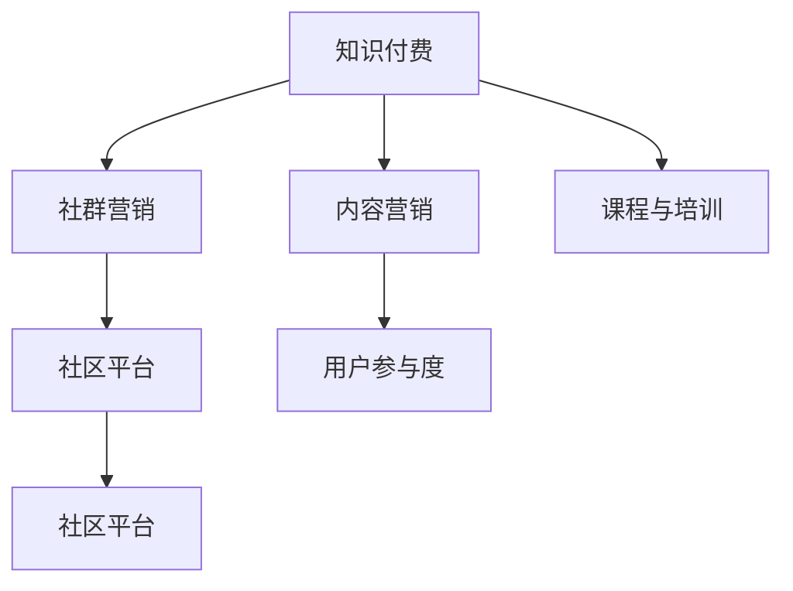

                 

# 知识付费：程序员的社群营销

## 1. 背景介绍

### 1.1 问题由来
随着互联网的发展，知识付费成为了一种新兴的商业模式。特别是在技术领域，编程、算法、架构等专业知识的需求日益增长，使得知识付费市场快速膨胀。程序员作为技术知识的主要产出者和需求者，也逐渐意识到社群营销的巨大潜力。

### 1.2 问题核心关键点
知识付费的本质是专业知识的买卖，其核心在于知识的生产和消费。在程序员社群中，知识生产者通常包括但不限于技术博主、开源项目贡献者、技术讲师等。知识消费者则包括各类开发者、学生、企业等。如何通过有效的营销手段，最大化知识的价值，同时满足消费者需求，成为社群营销的关键。

### 1.3 问题研究意义
对于程序员来说，社群营销不仅能带来直接的收入，还能提升个人品牌影响力，吸引更多同行和关注者，进一步拓展职业发展的空间。同时，知识付费也促进了技术知识的传播和应用，有助于推动整个技术行业的进步。因此，掌握知识付费和社群营销的策略，对于程序员而言具有重要意义。

## 2. 核心概念与联系

### 2.1 核心概念概述

为更好地理解知识付费和社群营销，本节将介绍几个密切相关的核心概念：

- **知识付费**：指用户为获取专业知识和技能而支付费用的行为，包括订阅、单次购买、会员制等形式。

- **社群营销**：指通过建立和维护一个社群，利用社群成员之间的互动和信任，推广产品或服务，实现商业目标的策略。

- **内容营销**：通过发布有价值的内容，吸引用户关注和互动，从而获得商业价值的一种营销方式。

- **社区平台**：指以内容分享、交流、讨论为主体的在线平台，如知乎、GitHub、Stack Overflow等。

- **用户参与度**：指用户对内容或产品的参与程度，包括点赞、评论、分享等行为，是衡量社群营销效果的关键指标。

- **课程与培训**：指针对特定技能或知识的系统性教学活动，可以是线上或线下的形式。

这些概念之间的逻辑关系可以通过以下Mermaid流程图来展示：



这个流程图展示了这个框架中各概念之间的关系：

1. 知识付费通过内容营销和课程与培训，生产有价值的内容和知识。
2. 社群营销以社区平台为媒介，通过用户参与度，吸引和维护社群成员。
3. 知识付费和社群营销相辅相成，知识付费提供内容，社群营销提供平台和互动。

## 3. 核心算法原理 & 具体操作步骤
### 3.1 算法原理概述

知识付费和社群营销的算法原理，可以通过以下步骤来概述：

1. **内容生成与分发**：生产高质量的内容，并通过社交媒体、社区平台等渠道进行分发，吸引潜在用户。
2. **社群构建与维护**：建立和维护一个活跃的社群，通过线上线下活动、互动、讨论等方式，提升用户参与度。
3. **商业化策略**：根据社群的特点和需求，设计合理的商业化策略，如订阅制、付费问答、课程销售等。

### 3.2 算法步骤详解

以下是知识付费和社群营销的具体操作步骤：

**Step 1: 内容生产与分发**
- **内容定位**：确定目标用户群体，明确内容主题和方向，如编程语言、框架、算法等。
- **内容制作**：撰写技术博客、制作视频教程、开发开源项目等，生产有价值的内容。
- **分发渠道**：选择合适的平台进行分发，如知乎、GitHub、YouTube等，利用SEO、社交媒体等手段增加曝光。

**Step 2: 社群构建与维护**
- **平台选择**：选择合适的社区平台，如知乎、GitHub、Stack Overflow等，创建个人或团队账号。
- **内容发布**：定期在平台上发布内容，与用户进行互动，回答问题。
- **社区活动**：组织线上线下技术交流会、项目讨论、开源贡献等活动，提升社群活跃度。
- **用户反馈**：及时回应用户评论和提问，定期收集用户反馈，优化内容和服务。

**Step 3: 商业化策略**
- **定价模型**：根据内容价值和用户需求，设计合理的订阅制、单次购买、会员制等定价模型。
- **付费模式**：引入付费问答、专属内容、课程销售等付费模式，满足用户多样化的需求。
- **会员体系**：建立会员体系，提供更多特权和服务，如专属群、线上课程等，提升用户粘性。

### 3.3 算法优缺点

知识付费和社群营销的算法具有以下优点：
1. 精准定位用户需求，生产有价值的内容。
2. 利用社区平台，建立品牌影响力和信任度。
3. 通过用户参与，提升内容的传播效果。
4. 多样化的商业化策略，满足不同用户需求。

同时，这些算法也存在一定的局限性：
1. 对内容质量要求高，需要持续投入时间和精力。
2. 用户群体和需求分散，难以实现精准推广。
3. 社区平台依赖性强，需要维护和管理。
4. 付费模式复杂，用户接受度可能较低。
5. 商业化策略容易影响用户体验，过度营销可能导致反感。

尽管存在这些局限性，但就目前而言，知识付费和社群营销仍是技术社群营销的重要手段。未来相关研究的重点在于如何进一步降低内容生产的成本，提高用户参与度，同时兼顾商业化的可持续性，避免过度商业化影响用户体验。

### 3.4 算法应用领域

知识付费和社群营销已经在技术领域得到了广泛的应用，覆盖了几乎所有常见任务，例如：

- 编程教程：如Python、Java、前端开发等。通过博客、视频教程、开源项目等方式，生产高质量的教学内容。
- 算法设计与优化：如机器学习、深度学习、数据结构等。通过线上课程、论文分享、项目实践等方式，引导用户学习和实践。
- 技术博客与文章：通过撰写高质量的技术博客，分享技术经验和心得，建立技术声誉。
- 开源项目与贡献：通过参与开源项目，提供代码贡献、文档撰写、社区维护等，积累开源贡献和影响力。
- 技术讲座与分享：通过线上线下技术讲座、分享会等方式，传播技术知识和经验，提升社群凝聚力。

除了上述这些经典任务外，知识付费和社群营销也被创新性地应用到更多场景中，如社区电商、技术咨询服务、技术培训等，为技术社群提供了更多的可能性。

## 4. 数学模型和公式 & 详细讲解  
### 4.1 数学模型构建

本节将使用数学语言对知识付费和社群营销的理论基础进行更加严格的刻画。

记知识付费内容集为 $C$，社群用户集为 $U$，内容与用户之间的互动关系为 $I$。定义内容 $c \in C$ 与用户 $u \in U$ 的交互强度为 $I_{cu}$。

假设知识付费内容 $c$ 的市场价值为 $V_c$，用户 $u$ 对内容 $c$ 的付费意愿为 $P_u$。社群营销的目标是最大化整体付费总额，即：

$$
\max_{I_{cu}} \sum_{c \in C} \sum_{u \in U} I_{cu} \cdot V_c \cdot P_u
$$

在实践中，我们通常使用用户满意度、用户留存率等指标来衡量社群营销效果，具体而言，可以通过以下公式计算：

$$
S = \sum_{c \in C} \sum_{u \in U} I_{cu} \cdot V_c \cdot P_u
$$

其中 $S$ 为社群满意度，反映了社群营销的效果。

### 4.2 公式推导过程

以下我们以知识付费内容为例，推导付费总额的计算公式。

假设内容 $c$ 的市场价值为 $V_c$，用户 $u$ 对内容 $c$ 的付费意愿为 $P_u$。则每个用户对内容的付费总额为：

$$
T_u = \sum_{c \in C} I_{cu} \cdot V_c \cdot P_u
$$

将所有用户的付费总额求和，得到整体付费总额 $T$：

$$
T = \sum_{u \in U} T_u = \sum_{u \in U} \sum_{c \in C} I_{cu} \cdot V_c \cdot P_u
$$

可以看到，付费总额 $T$ 与内容 $c$ 的市场价值 $V_c$、用户 $u$ 的付费意愿 $P_u$ 以及内容与用户之间的互动强度 $I_{cu}$ 有关。为了最大化付费总额，我们需要优化互动强度 $I_{cu}$。

在实践中，可以通过调整内容的质量、更新频率、推广力度等，提高互动强度 $I_{cu}$，从而增加整体付费总额 $T$。

### 4.3 案例分析与讲解

以GitHub为例，分析其知识付费和社群营销的实现。

GitHub是一个以代码托管和版本控制为主的社区平台。开发者在GitHub上发布开源项目，其他开发者可以免费使用、克隆、修改代码。开发者也可以通过GitHub Sponsors等机制，接受其他用户的资助。

GitHub的成功主要得益于以下几个方面：
1. **高质量内容**：GitHub上汇聚了大量高质量的开源项目，吸引了大量开发者和技术爱好者。
2. **社区互动**：开发者可以免费使用和贡献代码，形成活跃的社区氛围。
3. **付费机制**：通过GitHub Sponsors等付费机制，开发者可以接受资助，获得经济回报。
4. **技术分享**：GitHub上的技术文章、博客、讨论等，为用户提供了丰富的技术学习资源。

通过上述措施，GitHub成功地构建了一个技术知识共享和互惠的生态系统，实现了知识付费和社群营销的双赢。

## 5. 项目实践：代码实例和详细解释说明
### 5.1 开发环境搭建

在进行知识付费和社群营销的实践前，我们需要准备好开发环境。以下是使用Python进行Flask开发的Web应用环境配置流程：

1. 安装Anaconda：从官网下载并安装Anaconda，用于创建独立的Python环境。

2. 创建并激活虚拟环境：
```bash
conda create -n flask-env python=3.8 
conda activate flask-env
```

3. 安装Flask：
```bash
pip install Flask
```

4. 安装Flask扩展：
```bash
pip install Flask-WTF Flask-Login Flask-SQLAlchemy Flask-RESTful Flask-Mail
```

5. 安装各类工具包：
```bash
pip install numpy pandas scikit-learn matplotlib tqdm jupyter notebook ipython
```

完成上述步骤后，即可在`flask-env`环境中开始Web应用开发。

### 5.2 源代码详细实现

下面是使用Flask框架实现知识付费和社群营销的Web应用的代码实现。

```python
from flask import Flask, render_template, request
from flask_login import LoginManager, UserMixin, login_required, login_user, logout_user
from flask_sqlalchemy import SQLAlchemy
from flask_wtf import FlaskForm
from wtforms import StringField, PasswordField, SubmitField
from wtforms.validators import DataRequired, Email, EqualTo

app = Flask(__name__)
app.config['SECRET_KEY'] = 'secret key'
app.config['SQLALCHEMY_DATABASE_URI'] = 'sqlite:///site.db'
db = SQLAlchemy(app)
login_manager = LoginManager()
login_manager.init_app(app)

class User(db.Model, UserMixin):
    id = db.Column(db.Integer, primary_key=True)
    username = db.Column(db.String(64), unique=True)
    email = db.Column(db.String(64), unique=True)
    password_hash = db.Column(db.String(128))

@login_manager.user_loader
def load_user(user_id):
    return User.query.get(int(user_id))

class LoginForm(FlaskForm):
    username = StringField('Username', validators=[DataRequired()])
    password = PasswordField('Password', validators=[DataRequired()])
    submit = SubmitField('Log In')

@app.route('/')
@login_required
def home():
    return render_template('home.html')

@app.route('/login')
def login():
    form = LoginForm()
    if form.validate_on_submit():
        user = User.query.filter_by(username=form.username.data).first()
        if user and check_password_hash(user.password_hash, form.password.data):
            login_user(user)
            return redirect('/')
        else:
            flash('Invalid username or password')
    return render_template('login.html', form=form)

@app.route('/logout')
@login_required
def logout():
    logout_user()
    return redirect('/')

@app.route('/profile')
@login_required
def profile():
    user = User.query.get(current_user.id)
    return render_template('profile.html', user=user)

if __name__ == '__main__':
    app.run(debug=True)
```

### 5.3 代码解读与分析

让我们再详细解读一下关键代码的实现细节：

**User类**：
- 定义用户模型，包含用户名、邮箱和密码等属性。
- 使用Flask-SQLAlchemy进行数据库操作，实现了基本的CRUD操作。

**login_manager**：
- 使用Flask-Login进行用户登录和注销管理。
- 实现用户自动加载机制，通过user_loader回调函数获取用户对象。

**LoginForm类**：
- 使用Flask-WTF实现表单验证，包含用户名和密码的输入字段。
- 使用Flask-Validators进行数据验证，确保输入数据合法。

**路由处理**：
- 定义了登录、主页、用户个人资料等路由。
- 使用Flask-Login进行用户认证，确保只有登录用户才能访问部分页面。

**home、login、logout、profile路由**：
- 实现了用户主页、登录、注销和个人资料的展示和处理。
- 使用Flask-Template进行HTML页面渲染。

以上是使用Flask框架实现知识付费和社群营销Web应用的基本代码实现。可以看到，Flask框架提供了强大的路由和模板支持，方便开发者快速构建Web应用。

当然，工业级的系统实现还需考虑更多因素，如数据库设计、用户权限控制、接口API设计等。但核心的知识付费和社群营销逻辑基本与此类似。

## 6. 实际应用场景
### 6.1 技术社区

基于知识付费和社群营销的Web应用，可以广泛应用于技术社区的构建和运营。技术社区通常包括技术交流、项目分享、开源贡献等模块，是程序员交流技术、分享经验、合作开发的平台。

通过知识付费和社群营销，技术社区能够持续生产高质量的内容，吸引大量技术爱好者和开发者。同时，社区成员通过付费订阅、付费问答等方式获得收益，进一步提升了社区的活跃度和可持续性。

### 6.2 技术培训

知识付费和社群营销也可以应用于技术培训课程的推广。通过构建社群，聚集有共同兴趣和需求的用户，提供定制化的课程和培训服务，能够更好地满足用户需求，提升培训效果。

在技术培训中，可以采用免费试用、课程折扣、会员专属内容等策略，吸引用户参与。同时，还可以通过社群互动、在线讨论等方式，提升用户参与度和满意度，形成良好的口碑传播。

### 6.3 技术咨询服务

知识付费和社群营销还可以应用于技术咨询服务，为用户提供专业的技术支持和解决方案。通过建立专家社群，提供定制化的咨询服务，能够更好地满足用户需求，提升服务质量和效率。

在技术咨询中，可以采用一对一服务、在线问答、远程协作等方式，提供灵活、高效的解决方案。同时，还可以通过社群营销，提升服务品牌的知名度和影响力。

### 6.4 未来应用展望

随着知识付费和社群营销的不断发展，其在技术社群中的应用前景将更加广阔。未来，基于知识付费和社群营销的应用场景将包括但不限于以下方面：

1. **技术博客与文章**：通过知识付费和社群营销，为技术博客和文章提供更高的曝光和收益，激励更多高质量内容的生产。
2. **开源项目与贡献**：通过知识付费和社群营销，为开源项目提供更多的资金和资源支持，促进开源社区的繁荣。
3. **技术讲座与分享**：通过知识付费和社群营销，为技术讲座和分享提供更高的收益和曝光，提升技术传播的效果。
4. **技术培训与教育**：通过知识付费和社群营销，为技术培训和教育提供更多的资源和渠道，提升培训效果和用户体验。
5. **技术咨询与支持**：通过知识付费和社群营销，为技术咨询和支持提供更高的收益和口碑，提升服务质量和效率。

随着知识付费和社群营销的深入应用，相信技术社群将更加活跃、多元化，技术知识的传播和应用也将更加高效、便捷。

## 7. 工具和资源推荐
### 7.1 学习资源推荐

为了帮助开发者系统掌握知识付费和社群营销的理论基础和实践技巧，这里推荐一些优质的学习资源：

1. **Flask官方文档**：Flask的官方文档提供了全面的API文档、开发指南和示例代码，是Flask开发者的必备资料。
2. **Flask-WTF文档**：Flask-WTF的官方文档详细介绍了WTForms表单验证器的使用和配置，帮助开发者实现高质量的表单验证。
3. **Flask-Login文档**：Flask-Login的官方文档介绍了用户认证和登录管理的最佳实践，确保系统的安全性。
4. **Flask-SQLAlchemy文档**：Flask-SQLAlchemy的官方文档提供了数据库操作的全面指南，帮助开发者实现高效的数据库访问。
5. **Flask-Mail文档**：Flask-Mail的官方文档介绍了邮件发送的最佳实践，帮助开发者实现高效的邮件服务。
6. **Flask-RESTful文档**：Flask-RESTful的官方文档提供了RESTful API开发的指南和示例，帮助开发者实现灵活的API接口。

通过学习这些资源，相信你一定能够快速掌握知识付费和社群营销的精髓，并用于解决实际的NLP问题。

### 7.2 开发工具推荐

高效的开发离不开优秀的工具支持。以下是几款用于知识付费和社群营销开发的常用工具：

1. **Flask**：基于Python的开源Web框架，提供灵活的路由和模板机制，适合快速迭代开发。
2. **SQLAlchemy**：基于Python的ORM框架，支持多种数据库，提供高效的数据库访问和操作。
3. **WTForms**：基于Python的表单验证库，支持多种表单类型和验证器，帮助开发者实现高质量的表单验证。
4. **Flask-Login**：基于Python的用户认证和登录管理库，支持用户注册、登录、注销等操作，确保系统的安全性。
5. **Flask-Mail**：基于Python的邮件发送库，支持多种邮件服务，帮助开发者实现高效的邮件服务。
6. **Flask-RESTful**：基于Python的RESTful API开发库，支持API接口的灵活设计和实现。

合理利用这些工具，可以显著提升知识付费和社群营销的开发效率，加快创新迭代的步伐。

### 7.3 相关论文推荐

知识付费和社群营销的研究源于学界的持续研究。以下是几篇奠基性的相关论文，推荐阅读：

1. **《Knowledge Sharing and Collaboration in Online Communities》**：介绍了在线社区的知识共享和协作机制，探讨了社区互动对知识生产的影响。
2. **《Platforms as Markets》**：探讨了在线平台作为市场机制，如何通过匹配买卖双方实现资源优化。
3. **《Social Networks and Social Capital》**：分析了社交网络对个体行为的影响，探讨了社交资本在知识共享中的应用。
4. **《Crowdsourcing in Technology Development》**：探讨了众包技术在软件开发中的应用，如何通过众包提高软件开发效率。
5. **《Community-Based Content Creation》**：分析了社区驱动的内容创建机制，如何通过用户参与提升内容质量。

这些论文代表了大语言模型微调技术的发展脉络。通过学习这些前沿成果，可以帮助研究者把握学科前进方向，激发更多的创新灵感。

## 8. 总结：未来发展趋势与挑战

### 8.1 总结

本文对知识付费和社群营销进行了全面系统的介绍。首先阐述了知识付费和社群营销的研究背景和意义，明确了其在技术社群中的独特价值。其次，从原理到实践，详细讲解了知识付费和社群营销的数学原理和关键步骤，给出了知识付费和社群营销开发的完整代码实例。同时，本文还广泛探讨了知识付费和社群营销在技术领域的应用前景，展示了知识付费和社群营销的巨大潜力。最后，本文精选了知识付费和社群营销的相关学习资源，力求为读者提供全方位的技术指引。

通过本文的系统梳理，可以看到，知识付费和社群营销在技术社群中的应用前景广阔，极大地拓展了技术知识的传播和应用，促进了技术社群的繁荣。未来，随着知识付费和社群营销的不断演进，相信技术社群将更加活跃、多元化，技术知识的传播和应用也将更加高效、便捷。

### 8.2 未来发展趋势

展望未来，知识付费和社群营销将呈现以下几个发展趋势：

1. **平台多样化**：未来的知识付费和社群营销将不仅仅局限于传统的Web应用，还将拓展到移动应用、VR/AR、社交媒体等新平台。
2. **内容多媒体化**：未来的知识付费和社群营销将不仅仅局限于文本内容，还将拓展到视频、音频、直播等更多样化的内容形式。
3. **互动实时化**：未来的知识付费和社群营销将更加注重实时互动，通过聊天室、直播等方式，提升用户参与度和体验。
4. **个性化推荐**：未来的知识付费和社群营销将更加注重个性化推荐，根据用户兴趣和行为，推荐最合适的内容和课程。
5. **付费模式多样化**：未来的知识付费和社群营销将不再局限于传统的订阅制、单次购买等模式，还将引入会员制、众筹、捐赠等多种付费模式。
6. **社区开放化**：未来的知识付费和社群营销将更加开放，通过API接口、SDK等方式，与其他平台和服务无缝集成。

以上趋势凸显了知识付费和社群营销的广阔前景。这些方向的探索发展，必将进一步提升知识付费和社群营销的效果，为技术社群提供更优质的服务。

### 8.3 面临的挑战

尽管知识付费和社群营销已经取得了瞩目成就，但在迈向更加智能化、普适化应用的过程中，它仍面临着诸多挑战：

1. **内容质量保障**：知识付费和社群营销的核心在于内容质量，如何保证高质量内容的持续生产，是一个关键挑战。
2. **用户粘性提升**：社群营销需要持续的用户互动，如何提升用户粘性，防止用户流失，是一个重要问题。
3. **商业化平衡**：如何平衡商业化和用户体验，避免过度商业化导致用户反感，是一个重要挑战。
4. **技术迭代**：知识付费和社群营销需要不断迭代技术，提高系统性能和用户体验，是一个持续的挑战。
5. **安全与隐私**：知识付费和社群营销需要确保数据安全和用户隐私，避免数据泄露和滥用，是一个重要问题。
6. **国际化扩展**：知识付费和社群营销需要拓展到国际市场，需要考虑本地化适配和文化差异，是一个重要挑战。

正视知识付费和社群营销面临的这些挑战，积极应对并寻求突破，将是大语言模型微调走向成熟的必由之路。相信随着学界和产业界的共同努力，这些挑战终将一一被克服，知识付费和社群营销必将在构建人机协同的智能时代中扮演越来越重要的角色。

### 8.4 研究展望

面对知识付费和社群营销所面临的种种挑战，未来的研究需要在以下几个方面寻求新的突破：

1. **内容生产自动化**：通过机器学习等技术，自动生成高质量的内容，降低内容生产的成本。
2. **用户行为分析**：通过数据分析技术，深入理解用户行为和需求，实现精准的个性化推荐。
3. **社区治理机制**：建立社区治理机制，通过规则和激励，提升社区互动和内容质量。
4. **开放平台建设**：建设开放平台，通过API接口和SDK，实现知识付费和社群营销的跨平台互通。
5. **技术创新应用**：结合区块链、人工智能等技术，实现更加安全和高效的知识付费和社群营销。

这些研究方向的探索，必将引领知识付费和社群营销技术迈向更高的台阶，为构建安全、可靠、可解释、可控的智能系统铺平道路。面向未来，知识付费和社群营销还需要与其他人工智能技术进行更深入的融合，如知识表示、因果推理、强化学习等，多路径协同发力，共同推动自然语言理解和智能交互系统的进步。只有勇于创新、敢于突破，才能不断拓展知识付费和社群营销的边界，让智能技术更好地造福人类社会。

## 9. 附录：常见问题与解答

**Q1：知识付费和社群营销是否适用于所有技术社群？**

A: 知识付费和社群营销在大多数技术社群中都能取得不错的效果，特别是对于开发者和技术人员需求强烈的应用场景。但对于一些特定领域的社群，如医疗、金融等，仅仅依靠通用知识付费和社群营销可能难以很好地适应。此时需要在特定领域语料上进一步预训练，再进行微调，才能获得理想效果。此外，对于一些需要时效性、个性化很强的任务，如对话、推荐等，知识付费和社群营销方法也需要针对性的改进优化。

**Q2：如何进行内容质量和用户粘性的保障？**

A: 内容质量和用户粘性的保障需要从多个方面入手：
1. **内容质量控制**：通过编辑审核、专家评审等方式，确保内容的高质量。
2. **用户反馈机制**：及时回应用户评论和反馈，优化内容和互动。
3. **互动激励机制**：通过奖励机制、积分系统等方式，激励用户积极参与互动。
4. **内容多样化**：提供多种形式的内容，如视频、音频、文章等，满足不同用户的需求。
5. **用户参与度监控**：通过数据分析，监控用户参与度，及时调整策略。

这些措施需要综合运用，才能保障内容质量和用户粘性，提升社群的活跃度和满意度。

**Q3：如何平衡商业化和用户体验？**

A: 平衡商业化和用户体验是知识付费和社群营销的关键。以下是一些具体措施：
1. **合理定价**：根据内容价值和用户需求，设计合理的定价策略，避免过高的费用导致用户流失。
2. **多样化付费模式**：引入多种付费模式，如订阅制、单次购买、会员制等，满足不同用户的需求。
3. **用户激励机制**：通过积分、奖励等方式，激励用户参与互动，提升用户体验。
4. **透明化信息**：提供透明化的信息，如价格明细、服务内容等，增强用户信任。
5. **用户反馈机制**：及时回应用户反馈，优化服务和产品，提升用户满意度。

通过上述措施，可以在保障商业化的同时，提升用户体验，实现双赢。

**Q4：如何进行安全与隐私保护？**

A: 安全与隐私保护是知识付费和社群营销的重要环节。以下是一些具体措施：
1. **数据加密**：对用户数据进行加密处理，防止数据泄露。
2. **访问控制**：设置严格的访问控制，确保只有授权用户才能访问敏感信息。
3. **隐私政策**：制定明确的隐私政策，告知用户数据的使用范围和保护措施。
4. **安全审计**：定期进行安全审计，及时发现和修复安全漏洞。
5. **用户教育**：加强用户安全意识教育，提升用户自我保护能力。

通过上述措施，可以最大限度地保障用户数据和隐私安全，建立用户信任。

**Q5：如何进行国际化扩展？**

A: 进行国际化扩展需要考虑以下几个方面：
1. **本地化适配**：根据不同地区的语言和文化差异，进行本地化适配，确保内容的可读性和适用性。
2. **多语言支持**：支持多种语言，提供多语言内容和服务，满足全球用户的需求。
3. **国际化测试**：在发布前进行国际化测试，确保系统的稳定性和兼容性。
4. **国际化开发**：在开发过程中考虑国际化设计，使用国际化编码和工具，提升开发效率。
5. **国际化支持**：提供国际化的支持和文档，帮助用户解决国际化问题。

通过上述措施，可以实现知识付费和社群营销的国际化扩展，满足全球用户的需求。

综上所述，知识付费和社群营销在大语言模型微调中占据重要地位，对于程序员社群的构建和运营具有重要意义。未来，随着知识付费和社群营销技术的不断演进，相信知识付费和社群营销必将在构建人机协同的智能时代中扮演越来越重要的角色。

