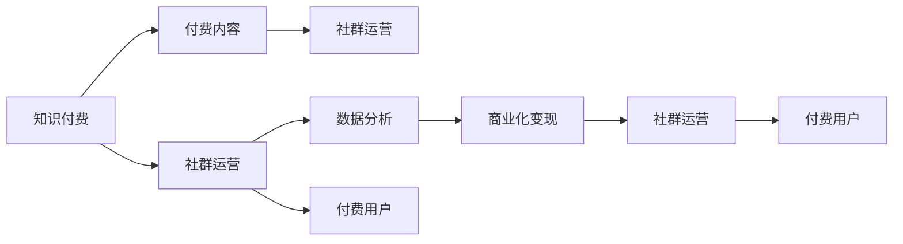

                 

# 知识付费：程序员的社群运营战术

> 关键词：知识付费、程序员、社群运营、战略规划、市场分析

## 1. 背景介绍

### 1.1 问题由来

在互联网快速发展的今天，知识付费已经成为一种流行的学习和获取知识的方式。随着知识服务的普及，越来越多的程序员通过订阅付费课程、加入付费社群、阅读付费书籍等方式获取专业知识，以保持自己的技术领先性。然而，如何构建一个高效的程序员社群运营模式，最大化知识付费的价值，却是一个亟需解决的问题。

### 1.2 问题核心关键点

本文将围绕程序员社群运营的多个关键点进行深入分析，包括：
- 如何构建高质量的付费内容
- 如何高效运营社群，吸引和留存付费用户
- 如何利用数据分析优化社群运营策略
- 如何实现商业化变现，创造长期可持续的盈利模式

### 1.3 问题研究意义

知识付费的兴起为程序员社群运营带来了新的机遇和挑战。高质量的付费内容能够吸引用户，而有效的运营策略则能够最大化其价值，从而实现商业化变现。本文旨在通过全面分析，提出实用的社群运营策略，帮助程序员社群创造出更大的价值。

## 2. 核心概念与联系

### 2.1 核心概念概述

为更好地理解程序员社群运营的核心概念，本节将介绍几个密切相关的核心概念：

- **知识付费**：基于互联网的知识付费模式，用户通过付费获取有价值的专业知识或服务。
- **程序员社群**：一群共同兴趣或职业目标的程序员组成的线上或线下组织，通常围绕某个技术主题或项目进行交流和协作。
- **付费内容**：具备较高专业性或独创性的知识产品，如技术教程、书籍、研究报告、案例分析等。
- **社群运营**：通过组织结构、规则制定、活动策划等手段，促进社群健康发展，提升社群价值的过程。
- **数据分析**：利用统计学、数据挖掘等方法，从大量数据中提取有用信息，指导社群运营决策。
- **商业化变现**：通过技术、广告、会员费等多种方式，将社群运营的价值转化为商业收入。

这些概念之间存在紧密的联系，共同构成了程序员社群运营的核心框架。

### 2.2 核心概念原理和架构的 Mermaid 流程图



这个流程图展示了知识付费、付费内容、社群运营、数据分析和商业化变现之间的联系，以及它们如何共同作用于付费用户，实现社群的价值提升和商业化。

## 3. 核心算法原理 & 具体操作步骤

### 3.1 算法原理概述

程序员社群运营的核心算法原理，主要集中在如何通过高质量的付费内容吸引用户，如何通过社群运营策略提高用户粘性，以及如何利用数据分析优化运营策略，最终实现商业化变现。

**付费内容吸引力**：高质量的付费内容能够吸引用户的关注和付费，因此社群需要持续产出具备高专业性和独创性的内容。

**社群运营策略**：通过组织结构、规则制定、活动策划等手段，营造积极健康、活跃互动的社群氛围，提升用户满意度和粘性。

**数据分析优化**：利用数据分析方法，从用户行为、互动数据、内容效果等角度，提取有用信息，指导社群运营决策，优化运营策略。

**商业化变现**：通过技术广告、会员费、定制服务等多种方式，将社群运营的价值转化为商业收入，实现长期可持续的盈利。

### 3.2 算法步骤详解

基于上述核心原理，程序员社群运营的算法步骤主要包括以下几个环节：

**Step 1: 内容构建**
- 确定社群的核心技术主题或项目。
- 通过调研和需求分析，确定目标用户群。
- 设计内容大纲，明确内容的深度和广度。
- 招募或培养内容创作者，产出高质量的付费内容。

**Step 2: 社群运营**
- 制定社群规则，明确用户行为规范。
- 设计社群结构，划分不同层级的角色和权限。
- 策划各类活动，如技术讨论、项目协作、线上线下聚会等。
- 设立反馈机制，持续改进社群运营策略。

**Step 3: 数据分析**
- 收集用户行为数据，包括访问记录、互动次数、反馈信息等。
- 使用数据挖掘和统计学方法，分析用户行为特征和内容效果。
- 根据分析结果，调整内容策略、运营策略，提高社群价值。

**Step 4: 商业化变现**
- 开发技术广告平台，展示社群内优质内容或产品。
- 设计会员费模型，提供不同等级会员服务。
- 提供定制服务，如企业培训、技术咨询等。
- 定期评估盈利情况，调整商业化策略，实现长期盈利。

### 3.3 算法优缺点

高质量的付费内容能够显著提升社群的吸引力和用户粘性，但内容构建和创作者招募是耗时且成本较高的过程。社群运营策略需要持续优化，以应对不同用户群体的需求变化。数据分析能够提供精准的运营指导，但数据收集和处理需要一定的技术支持。商业化变现能够实现长期盈利，但如何平衡商业需求和社群价值是一大挑战。

### 3.4 算法应用领域

程序员社群运营的算法不仅适用于技术类社群，也适用于各类兴趣或职业社群。通过合理利用上述算法步骤，能够构建出高效、有价值的社群，实现商业化变现，创造长期的盈利模式。

## 4. 数学模型和公式 & 详细讲解 & 举例说明

### 4.1 数学模型构建

在程序员社群运营中，我们可以构建以下数学模型：

- **内容吸引力模型**：
  $$
  A = f(X_1, X_2, X_3, \ldots)
  $$
  其中 $A$ 表示内容吸引力，$X_1$ 表示内容深度，$X_2$ 表示内容广度，$X_3$ 表示创作者知名度等。

- **用户粘性模型**：
  $$
  S = g(X_4, X_5, X_6, \ldots)
  $$
  其中 $S$ 表示用户粘性，$X_4$ 表示社群活跃度，$X_5$ 表示用户互动质量，$X_6$ 表示用户满意度等。

- **商业化变现模型**：
  $$
  P = h(X_7, X_8, X_9, \ldots)
  $$
  其中 $P$ 表示商业化变现收入，$X_7$ 表示广告收入，$X_8$ 表示会员费收入，$X_9$ 表示定制服务收入等。

### 4.2 公式推导过程

以用户粘性模型为例，我们假设社群的活跃度 $S$ 由以下几个因素决定：

- 社群活跃度：$S_{activity} = X_4$
- 用户互动质量：$S_{interaction} = X_5$
- 用户满意度：$S_{satisfaction} = X_6$

那么，用户粘性 $S$ 的表达式可以表示为：
$$
S = \alpha_1 S_{activity} + \alpha_2 S_{interaction} + \alpha_3 S_{satisfaction}
$$

其中 $\alpha_1$、$\alpha_2$、$\alpha_3$ 是相应的权重系数。

### 4.3 案例分析与讲解

假设一个程序员社群通过数据分析发现，社群活跃度对用户粘性的影响系数为0.6，用户互动质量的影响系数为0.3，用户满意度的影响系数为0.1。此时，我们可以通过以下公式计算用户粘性：

$$
S = 0.6 \times S_{activity} + 0.3 \times S_{interaction} + 0.1 \times S_{satisfaction}
$$

通过不断优化社群运营策略，如增加高质量互动环节、提升用户满意度等，可以逐步提升用户粘性，从而提高社群的价值。

## 5. 项目实践：代码实例和详细解释说明

### 5.1 开发环境搭建

在进行社群运营实践前，我们需要准备好开发环境。以下是使用Python进行Django开发的环境配置流程：

1. 安装Anaconda：从官网下载并安装Anaconda，用于创建独立的Python环境。

2. 创建并激活虚拟环境：
```bash
conda create -n django-env python=3.8 
conda activate django-env
```

3. 安装Django：
```bash
pip install django
```

4. 安装其他必要的工具包：
```bash
pip install pandas numpy requests django-allauth django-crispy-forms
```

完成上述步骤后，即可在`django-env`环境中开始社群运营项目的开发。

### 5.2 源代码详细实现

下面我们以一个简单的技术问答社群为例，给出使用Django进行社群运营的Python代码实现。

首先，定义模型和视图：

```python
from django.db import models
from django.contrib.auth.models import User
from django.urls import reverse

class Topic(models.Model):
    name = models.CharField(max_length=200)
    def __str__(self):
        return self.name

class Comment(models.Model):
    user = models.ForeignKey(User, on_delete=models.CASCADE)
    topic = models.ForeignKey(Topic, on_delete=models.CASCADE)
    body = models.TextField()
    created_at = models.DateTimeField(auto_now_add=True)
    def __str__(self):
        return f"{self.user.username}: {self.body[:20]}"

    class Meta:
        ordering = ['created_at']
```

接着，定义URL配置和视图函数：

```python
from django.urls import path
from . import views

urlpatterns = [
    path('topics/<int:topic_id>/comments/', views.comment_list, name='comment_list'),
    path('topics/<int:topic_id>/comments/<int:comment_id>/create/', views.comment_create, name='comment_create'),
]

def comment_list(request, topic_id):
    topic = Topic.objects.get(id=topic_id)
    comments = topic.comment_set.all().order_by('-created_at')
    return render(request, 'comments/list.html', {'comments': comments, 'topic': topic})

def comment_create(request, topic_id):
    topic = Topic.objects.get(id=topic_id)
    if request.method == 'POST':
        form = CommentForm(request.POST)
        if form.is_valid():
            form.save(commit=False)
            form.comment.topic = topic
            form.save()
            return redirect(reverse('comments:comment_list', args=(topic_id,)))
    else:
        form = CommentForm()
    return render(request, 'comments/create.html', {'form': form, 'topic': topic})
```

最后，启动Django服务并测试：

```bash
python manage.py runserver
```

运行上述代码，即可创建一个简单的技术问答社群，用户可以在其中提问和回答问题。通过Django的强大框架，开发者可以灵活实现各类功能，如权限管理、消息推送、搜索推荐等。

### 5.3 代码解读与分析

让我们再详细解读一下关键代码的实现细节：

**模型定义**：
- `Topic` 模型代表社群内的讨论主题，包括名称和相关评论。
- `Comment` 模型代表用户的评论内容，包括用户、主题、评论内容、创建时间等。

**URL配置和视图函数**：
- 定义了两条URL路径，分别对应评论列表和评论创建。
- `comment_list` 函数查询指定主题下的所有评论，并按时间顺序排序。
- `comment_create` 函数允许用户在指定主题下创建评论，如果创建成功，则重定向到评论列表页。

**Django框架特性**：
- 使用Django的ORM框架，方便数据模型的定义和管理。
- 利用Django的URL配置系统，自动生成URL路径。
- 使用模板引擎，方便页面渲染和展示。
- 提供表单和验证功能，保障用户输入数据的安全性和完整性。

以上代码实现了基本的社群运营功能，开发者可以根据实际需求，添加更多功能模块，如用户认证、消息推送、数据分析等，进一步完善社群运营系统。

## 6. 实际应用场景

### 6.1 知识付费社群

知识付费社群为程序员提供了一个高质量学习和交流的平台。用户可以通过订阅付费课程、加入付费社群，获取技术知识、项目经验、职业发展指导等。

以一个名为“Python技术交流群”的社群为例，该社群定期举办技术讲座、项目分享、代码互评等活动，吸引了大量Python开发者加入。通过高质量的内容和活跃的互动，社群成员获得了宝贵的技术知识和职业发展经验。此外，社群还开发了技术广告平台，展示成员分享的实战项目，增加了社群的商业化变现能力。

### 6.2 项目协作社群

项目协作社群旨在为开发者提供一个共享项目资源、讨论技术问题的平台。用户可以发布项目需求、分享代码片段、讨论技术问题，高效协作完成任务。

例如，“GitHub开源项目交流群”通过整合GitHub代码仓库，为开发者提供了一个平台，方便共享代码、讨论项目问题、发布招聘信息。社群内设置了项目管理工具、任务分配机制、进度跟踪等功能，提升了协作效率和项目成功率。同时，社群还通过付费会员制，提供优先参与项目评审、免费技术支持等服务，增强了社群的凝聚力和商业化价值。

### 6.3 技术咨询社群

技术咨询社群为开发者提供了一个专业的技术支持和问题解答平台。用户可以提出技术问题，获得专家解答，甚至预约一对一的技术咨询。

例如，“Mentor技术咨询服务群”通过邀请业界专家入驻社群，为开发者提供技术指导和咨询服务。用户可以在线提问，专家及时解答，甚至提供项目建议和职业规划。通过优质的咨询服务，社群成员获得了宝贵的技术指导和职业发展建议。同时，社群还通过付费咨询和定制化服务，实现了商业化变现。

## 7. 工具和资源推荐

### 7.1 学习资源推荐

为了帮助开发者系统掌握程序员社群运营的理论基础和实践技巧，这里推荐一些优质的学习资源：

1. **《程序员社群运营的艺术》**：深入分析了程序员社群运营的核心概念和实际案例，帮助开发者系统掌握社群运营技巧。
2. **《Django实战》**：一本实用的Django教程，介绍了Django框架的核心功能和开发技巧，适合开发人员快速上手。
3. **《数据分析实战》**：介绍了数据分析的常用方法和工具，帮助开发者通过数据驱动社群运营决策。
4. **《知识付费商业化模型》**：系统讲解了知识付费的商业模式和运营策略，帮助开发者设计商业化变现方案。

通过这些资源的学习实践，相信你一定能够快速掌握程序员社群运营的精髓，并用于解决实际的社群问题。

### 7.2 开发工具推荐

高效的开发离不开优秀的工具支持。以下是几款用于程序员社群运营开发的常用工具：

1. **Django**：基于Python的开源Web框架，提供了强大的ORM、模板引擎和表单处理功能，适合快速开发Web应用。
2. **GitHub**：一个流行的代码托管平台，提供了版本控制、代码协作、项目管理等功能，适合开发者共享代码和资源。
3. **Django-allauth**：用于用户认证和社交登录的插件，方便实现用户登录、注册、社交媒体登录等功能。
4. **Django-crispy-forms**：用于美化表单设计，提供了丰富的UI组件和表单验证功能。
5. **Django-allcomments**：用于评论管理的插件，支持多种评论格式和排序方式。
6. **WeChat Work**：微信企业版的开发平台，提供了企业内部通信、任务管理、应用集成等功能，适合构建内部社群。

合理利用这些工具，可以显著提升程序员社群运营的开发效率，加快创新迭代的步伐。

### 7.3 相关论文推荐

程序员社群运营领域的研究方兴未艾，以下是几篇具有代表性的相关论文，推荐阅读：

1. **《程序员社群行为分析与策略优化》**：通过数据分析，揭示了社群行为模式，提出优化策略。
2. **《知识付费用户行为研究》**：分析了知识付费用户的心理特征和行为模式，提出提升用户留存的策略。
3. **《社群运营中的数据驱动决策》**：介绍了数据驱动决策的方法，帮助社群运营者优化运营策略。
4. **《社交媒体中的技术传播》**：研究了社交媒体中技术传播的规律和影响因素，提出社群运营的优化建议。

这些论文代表了大社群运营技术的发展脉络。通过学习这些前沿成果，可以帮助研究者把握学科前进方向，激发更多的创新灵感。

## 8. 总结：未来发展趋势与挑战

### 8.1 总结

本文对程序员社群运营的多个关键点进行了深入分析，包括高质量付费内容的构建、社群运营策略的设计、数据分析的运用以及商业化变现的实现。通过案例分析和代码实例，展示了程序员社群运营的可行性和实用性。

通过本文的系统梳理，可以看到，高质量的付费内容、高效的社群运营策略、数据驱动的决策优化以及商业化的变现能力，共同构成了程序员社群运营的核心框架。这些技术的综合应用，能够最大化社群的价值，为程序员社区创造更大的发展潜力。

### 8.2 未来发展趋势

展望未来，程序员社群运营技术将呈现以下几个发展趋势：

1. **内容个性化**：根据用户行为数据，推荐个性化的内容，提升用户粘性。
2. **互动社交化**：通过互动社交功能，增强用户之间的连接和协作，提升社群活跃度。
3. **运营智能化**：利用AI技术，自动化社群运营决策，提高运营效率。
4. **商业多样化**：通过多样化的商业化模式，如知识服务、广告、定制化服务等，实现长期盈利。
5. **生态化合作**：构建社群生态，与其他技术平台合作，提升社群价值。

以上趋势凸显了程序员社群运营技术的广阔前景。这些方向的探索发展，必将进一步提升程序员社群的价值，推动技术社区的快速成长。

### 8.3 面临的挑战

尽管程序员社群运营技术已经取得了一定进展，但在迈向更加智能化、普适化应用的过程中，仍面临诸多挑战：

1. **用户粘性不足**：社群内用户流失率高，难以维持长期活跃。
2. **内容质量控制**：内容质量参差不齐，缺乏高质量专业知识的产出。
3. **数据隐私保护**：用户数据隐私保护问题，需防止数据泄露和滥用。
4. **商业化平衡**：如何平衡商业需求和社群价值，避免过度商业化。
5. **运营成本高**：社群运营需要持续投入，需控制好运营成本。

这些挑战需要通过技术创新和管理优化，才能逐步克服。唯有不断优化社群运营策略，才能确保社群的长期健康发展。

### 8.4 研究展望

面对程序员社群运营所面临的种种挑战，未来的研究需要在以下几个方面寻求新的突破：

1. **内容推荐算法**：开发个性化内容推荐算法，根据用户行为数据，推荐高质量内容，提升用户粘性。
2. **互动社交优化**：研究高效的互动社交策略，增强用户之间的连接和协作，提升社群活跃度。
3. **智能化运营工具**：开发智能化运营工具，利用AI技术自动化社群运营决策，提高运营效率。
4. **商业化变现模式**：探索多样化的商业化模式，如知识服务、广告、定制化服务等，实现长期盈利。
5. **生态化合作机制**：构建社群生态，与其他技术平台合作，提升社群价值。

这些研究方向的探索，必将引领程序员社群运营技术迈向更高的台阶，为技术社区创造更大的发展潜力。面向未来，程序员社群运营需要结合技术创新和管理优化，共同推动技术社区的快速成长。

## 9. 附录：常见问题与解答

**Q1：如何提高社群的用户粘性？**

A: 提高用户粘性需要从多个方面入手：
- 提供高质量的付费内容，满足用户的学习需求。
- 设计丰富的互动活动，增强用户之间的连接和协作。
- 优化用户体验，提供友好的界面和流畅的操作体验。
- 建立社区文化和规则，营造积极的社群氛围。

**Q2：如何构建高质量的付费内容？**

A: 构建高质量的付费内容需要：
- 确定社群的核心技术主题或项目，明确内容的方向。
- 招募或培养专业的内容创作者，产出高质量的付费内容。
- 定期更新内容，保持内容的时效性和深度。
- 用户反馈机制，及时收集用户意见，改进内容质量。

**Q3：社群运营中如何平衡商业需求和社群价值？**

A: 平衡商业需求和社群价值的关键在于：
- 明确社群的运营目标和商业需求，制定合理的商业化策略。
- 设计多样化的商业化模式，如知识服务、广告、定制化服务等。
- 保护用户隐私，建立数据安全和隐私保护机制。
- 持续优化运营策略，保障社群的长期健康发展。

**Q4：社群运营中的数据隐私保护有哪些措施？**

A: 数据隐私保护需要：
- 明确实施数据隐私保护的政策和法规，制定数据使用规范。
- 采用数据匿名化、去标识化等技术，保护用户隐私。
- 加强数据安全管理，防止数据泄露和滥用。
- 建立用户知情权和选择权，保障用户数据权利。

**Q5：社群运营中如何利用数据驱动决策？**

A: 利用数据驱动决策的关键在于：
- 收集和分析用户行为数据，了解用户需求和行为模式。
- 使用数据挖掘和统计学方法，提取有用的信息和规律。
- 根据数据分析结果，调整内容和运营策略，优化社群运营。
- 建立数据监控和反馈机制，持续改进社群运营效果。

这些问题的解答，希望能够为程序员社群运营提供实用的指导和帮助。

