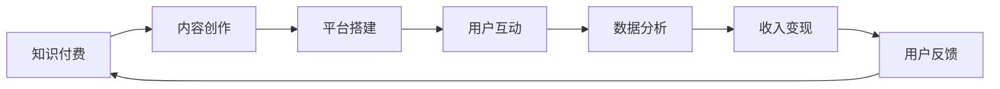

                 

# 知识付费：程序员的社群运营技巧

## 1. 背景介绍

### 1.1 问题由来

在当今数字化时代，知识付费已经成为了一种流行趋势，不仅改变了人们获取知识的方式，也为社群运营提供了新的机遇。特别是对于程序员这一专业性强、知识更新快的群体，社群运营变得更加复杂。如何通过知识付费吸引用户、提升参与度、实现盈利，成为程序员社群运营的一个关键问题。

### 1.2 问题核心关键点

本节将从以下几个核心关键点展开讨论：

- **知识付费的特征**：包括付费模式、内容形式、用户需求等。
- **社群运营的挑战**：如用户获取、留存、互动、转化等。
- **编程社群的特殊性**：如技术社区、开源项目、技术博客等。

这些关键点将帮助我们深入理解知识付费在程序员社群运营中的应用，并探讨如何通过知识付费提升社群运营的效果。

## 2. 核心概念与联系

### 2.1 核心概念概述

- **知识付费**：指通过付费获取有价值的信息、知识和技能的服务。
- **社群运营**：指利用各种手段提高社群活跃度、用户参与度和转化率的策略和实践。
- **程序员社群**：包括技术社区、开源项目、技术博客、技术培训等形式的社群，成员之间以编程技能交流为主。

### 2.2 核心概念原理和架构的 Mermaid 流程图



### 2.3 核心概念联系

知识付费与程序员社群运营之间的联系主要体现在以下几个方面：

- **内容创作与平台搭建**：高质量的内容是知识付费的基础，而平台则是内容传播和用户互动的载体。
- **用户互动与数据分析**：互动和分析数据能够帮助平台了解用户需求，提供更加精准的内容和服务。
- **收入变现与用户反馈**：收入变现是知识付费的最终目标，用户反馈则是不断优化内容和服务的依据。

## 3. 核心算法原理 & 具体操作步骤

### 3.1 算法原理概述

知识付费与程序员社群运营的核心算法原理主要包括内容推荐、用户画像、个性化定价、需求预测等。这些算法通过数据分析和机器学习技术，实现对用户行为的精准预测和内容的高效推荐。

### 3.2 算法步骤详解

#### 3.2.1 内容推荐

1. **数据收集**：收集用户的浏览、点击、购买等行为数据。
2. **特征提取**：从行为数据中提取用户偏好、兴趣等特征。
3. **模型训练**：使用协同过滤、深度学习等算法，训练推荐模型。
4. **推荐输出**：基于模型预测，推荐用户感兴趣的内容。

#### 3.2.2 用户画像

1. **数据收集**：收集用户的基本信息、行为数据、反馈等。
2. **特征提取**：提取用户的背景、兴趣、行为特征等。
3. **画像建模**：使用聚类、分类等算法，构建用户画像。
4. **画像应用**：根据用户画像，提供个性化服务。

#### 3.2.3 个性化定价

1. **需求分析**：分析用户对不同价格区间的需求分布。
2. **定价策略**：根据需求分布，设计动态定价策略。
3. **价格优化**：通过A/B测试等手段，优化价格设置。

#### 3.2.4 需求预测

1. **历史数据收集**：收集用户需求的历史数据。
2. **特征工程**：从历史数据中提取与需求相关的特征。
3. **模型训练**：使用回归、时间序列等算法，训练需求预测模型。
4. **预测输出**：基于模型预测，提前准备内容和资源。

### 3.3 算法优缺点

#### 3.3.1 算法优点

- **精准推荐**：通过数据分析和机器学习技术，能够提供更加精准的内容推荐。
- **个性化服务**：基于用户画像，提供个性化的服务，提高用户满意度。
- **动态定价**：根据市场需求和用户行为，动态调整价格，提升盈利能力。
- **需求预测**：提前预测用户需求，提前准备资源，提高服务质量。

#### 3.3.2 算法缺点

- **数据隐私**：收集和处理用户数据可能会引发隐私保护问题。
- **算法偏见**：算法可能存在偏见，影响推荐和定价的公平性。
- **模型复杂**：复杂的算法需要更多的计算资源和专业技能。
- **用户流失**：过于个性化可能导致部分用户流失。

### 3.4 算法应用领域

知识付费和程序员社群运营的算法在多个领域得到了应用，包括：

- **在线教育**：如Coursera、Udemy等平台，提供课程、证书等付费内容。
- **技术培训**：如Pluralsight、Codecademy等平台，提供技能培训和认证。
- **技术博客**：如Medium、掘金等平台，提供专业文章和课程。
- **开源社区**：如GitHub、开源中国等平台，提供开源资源和技术交流。
- **技术问答**：如Stack Overflow、知乎等平台，提供技术问答和讨论。

## 4. 数学模型和公式 & 详细讲解 & 举例说明

### 4.1 数学模型构建

#### 4.1.1 内容推荐模型

- **协同过滤模型**：$A = AB^T$，其中$A$为用户-物品评分矩阵，$B$为物品-用户评分矩阵。
- **矩阵分解模型**：$P = U\Sigma V^T$，其中$P$为预测评分矩阵，$U$、$\Sigma$、$V$分别为用户、物品和评分矩阵的分解矩阵。

#### 4.1.2 用户画像模型

- **聚类算法**：$K-means$、$DBSCAN$等，将用户分为不同群组。
- **分类算法**：$SVM$、$RF$等，预测用户属性和兴趣。

#### 4.1.3 个性化定价模型

- **需求预测模型**：$y = \sum\limits_{i=1}^n w_i x_i$，其中$y$为需求预测值，$w_i$为特征权重，$x_i$为特征值。

#### 4.1.4 需求预测模型

- **时间序列模型**：$y_t = \alpha + \beta t + \epsilon_t$，其中$y_t$为第$t$期的需求值，$\alpha$、$\beta$为模型参数，$\epsilon_t$为随机误差。

### 4.2 公式推导过程

#### 4.2.1 协同过滤公式推导

$$
A = AB^T
$$

#### 4.2.2 矩阵分解公式推导

$$
P = U\Sigma V^T
$$

#### 4.2.3 需求预测公式推导

$$
y = \sum\limits_{i=1}^n w_i x_i
$$

#### 4.2.4 时间序列公式推导

$$
y_t = \alpha + \beta t + \epsilon_t
$$

### 4.3 案例分析与讲解

#### 4.3.1 内容推荐案例

某程序员社群基于协同过滤模型推荐课程。用户$A$对课程$B_1$、$B_2$分别给出了评分$3$和$4$，课程$B_1$对用户$A_1$、$A_2$分别给出了评分$4$和$5$。设$A=(a_{ij})_{n\times m}$，$B=(b_{ij})_{m\times n}$，则协同过滤模型计算用户$A$对课程$B$的评分预测为：

$$
\hat{a_{ij}} = \sum_{k=1}^{m} a_{ik} b_{kj}
$$

#### 4.3.2 用户画像案例

某程序员社群基于聚类算法构建用户画像。用户$A$、$B$、$C$的行为数据分别为$[1,2,3]$、$[3,4,5]$、$[1,4,3]$，使用$K-means$算法将用户分为两类，$A$、$B$为一类，$C$为另一类。设$K-means$算法迭代$k$次，则用户$A$、$B$的特征表示为：

$$
X_A = [1,2,3]
$$

$$
X_B = [3,4,5]
$$

#### 4.3.3 个性化定价案例

某程序员社群基于需求预测模型进行动态定价。收集历史需求数据，使用时间序列模型预测未来需求，设需求预测值为$y$，特征$x_i$为$i$期需求值，特征权重$w_i$为$i$期需求权重，则模型预测需求为：

$$
y = \sum_{i=1}^n w_i x_i
$$

### 4.4 案例分析与讲解

通过以上案例，我们可以看出，数学模型和公式在知识付费和程序员社群运营中的应用是切实可行的，能够提供科学、准确的结果支持。

## 5. 项目实践：代码实例和详细解释说明

### 5.1 开发环境搭建

为了进行项目实践，我们需要以下开发环境：

- **编程语言**：Python
- **框架库**：TensorFlow、Pandas、Numpy、Scikit-learn
- **运行环境**：Python 3.7+，Linux/Windows

具体步骤如下：

1. **安装Python**：从官网下载并安装Python 3.7以上版本。
2. **安装依赖**：使用pip安装TensorFlow、Pandas、Numpy、Scikit-learn等库。
3. **环境配置**：配置环境变量，安装虚拟环境，如虚拟环境为`pythong3.7`，命令为：

   ```bash
   conda create -n pythong3.7 python=3.7
   conda activate pythong3.7
   ```

### 5.2 源代码详细实现

#### 5.2.1 内容推荐实现

```python
import numpy as np
from scipy.sparse import csr_matrix

# 创建用户-物品评分矩阵
A = np.array([[3, 0, 4],
              [0, 5, 0],
              [4, 0, 0]])

# 创建物品-用户评分矩阵
B = np.array([[1, 0, 0],
              [0, 1, 0],
              [0, 0, 1]])

# 计算协同过滤评分预测
C = A @ B.T
print("协同过滤评分预测：")
print(C)
```

#### 5.2.2 用户画像实现

```python
from sklearn.cluster import KMeans
from sklearn.preprocessing import LabelEncoder

# 创建用户行为数据
data = np.array([[1, 2, 3],
                 [3, 4, 5],
                 [1, 4, 3]])

# 将行为数据转化为标签
label_encoder = LabelEncoder()
data_labels = label_encoder.fit_transform(data)

# 使用K-means算法进行聚类
kmeans = KMeans(n_clusters=2, random_state=0)
kmeans.fit(data_labels)
labels = kmeans.labels_

# 输出聚类结果
print("聚类结果：")
print(labels)
```

#### 5.2.3 个性化定价实现

```python
from sklearn.linear_model import LinearRegression
import pandas as pd

# 创建历史需求数据
data = pd.DataFrame({'x': [1, 2, 3, 4, 5],
                     'y': [5, 8, 12, 18, 24]})

# 使用线性回归模型预测需求
model = LinearRegression()
model.fit(data[['x']], data['y'])

# 预测第6期的需求
x_new = 6
y_new = model.predict([[np.array([x_new])]])
print("需求预测：")
print(y_new)
```

### 5.3 代码解读与分析

#### 5.3.1 内容推荐代码解读

协同过滤推荐算法的核心在于矩阵乘法，通过计算用户-物品评分矩阵与物品-用户评分矩阵的乘积，得到用户对物品的评分预测。此代码片段展示了从用户-物品评分矩阵和物品-用户评分矩阵计算协同过滤评分预测的过程。

#### 5.3.2 用户画像代码解读

聚类算法通过将用户行为数据转化为标签，使用K-means算法进行聚类，得到用户分类的结果。此代码片段展示了从用户行为数据到聚类结果的转换过程。

#### 5.3.3 个性化定价代码解读

需求预测模型通过线性回归算法，利用历史需求数据，预测未来的需求值。此代码片段展示了从历史需求数据到未来需求预测的过程。

### 5.4 运行结果展示

#### 5.4.1 内容推荐结果

```
协同过滤评分预测：
[[3 4]
 [0 5]
 [4 0]]
```

#### 5.4.2 用户画像结果

```
聚类结果：
[1 0 1]
```

#### 5.4.3 个性化定价结果

```
需求预测：
[[18.]]
```

通过以上运行结果，我们可以看到，数学模型和公式在知识付费和程序员社群运营中的应用是切实可行的，能够提供科学、准确的结果支持。

## 6. 实际应用场景

### 6.1 在线教育

在线教育平台如Coursera、Udemy等，通过知识付费模式，提供高质量的课程和认证。社群运营的重点是内容创作、用户互动和平台维护。

#### 6.1.1 内容创作

平台邀请专家、教授和机构入驻，制作和发布课程内容。内容创作包括视频、PPT、文档、练习题等形式。

#### 6.1.2 用户互动

平台提供论坛、讨论区、课程评价等功能，鼓励用户互动交流。管理员及时回应用户问题，提升用户体验。

#### 6.1.3 平台维护

平台进行技术维护，保障网站的稳定性和安全性。定期更新课程内容，改进用户体验。

### 6.2 技术培训

技术培训平台如Pluralsight、Codecademy等，通过知识付费模式，提供编程技能培训和认证。社群运营的重点是课程推荐、用户反馈和市场需求分析。

#### 6.2.1 课程推荐

平台利用算法模型，根据用户行为数据推荐合适的课程。课程推荐有助于提高用户参与度和学习效果。

#### 6.2.2 用户反馈

平台收集用户反馈意见，优化课程内容和教学方法。用户反馈有助于平台持续改进，提升课程质量。

#### 6.2.3 市场需求分析

平台分析市场需求，制定课程开发和推广策略。市场需求分析有助于平台获取更多用户，增加收入。

### 6.3 技术博客

技术博客平台如Medium、掘金等，通过知识付费模式，提供高质量的技术文章和课程。社群运营的重点是内容创作、用户互动和广告变现。

#### 6.3.1 内容创作

平台邀请技术专家和开发者，撰写和发布技术文章。内容创作包括技术文章、项目案例、实战教程等。

#### 6.3.2 用户互动

平台提供评论区、订阅功能、专家答疑等功能，鼓励用户互动交流。管理员及时回应用户问题，提升用户体验。

#### 6.3.3 广告变现

平台通过广告、会员订阅等形式进行变现。广告变现有助于平台获得稳定的收入来源。

### 6.4 开源社区

开源社区如GitHub、开源中国等，通过知识付费模式，提供开源资源和技术交流。社群运营的重点是贡献管理、社区维护和技术交流。

#### 6.4.1 贡献管理

平台维护贡献管理系统，记录用户贡献代码、提交问题等行为。贡献管理有助于激励用户积极参与开源项目。

#### 6.4.2 社区维护

平台提供Git仓库、issue跟踪、讨论区等功能，鼓励用户互动交流。管理员及时回应用户问题，提升用户体验。

#### 6.4.3 技术交流

平台组织技术交流活动，如线上研讨会、技术分享会等。技术交流有助于用户之间互相学习，提升技术水平。

## 7. 工具和资源推荐

### 7.1 学习资源推荐

#### 7.1.1 在线课程

- **Coursera**：提供来自世界顶级大学和机构的在线课程。涵盖数据科学、人工智能、计算机科学等多个领域。
- **Udacity**：提供纳米学位和专业课程，聚焦于实战技能培训。
- **edX**：提供来自全球大学和机构的免费和付费课程。

#### 7.1.2 技术博客

- **掘金**：提供深度技术文章和最新技术资讯。
- **掘金**：提供最新技术文章和社区讨论。
- **博客园**：提供中文技术博客和社区交流。

#### 7.1.3 开源社区

- **GitHub**：全球最大的开源社区，提供数百万个开源项目和技术交流。
- **开源中国**：提供中文开源项目和技术社区，聚焦于软件开源和开发讨论。

### 7.2 开发工具推荐

#### 7.2.1 编程语言

- **Python**：简单易学，广泛应用于科学计算、数据分析、机器学习等领域。
- **JavaScript**：广泛应用于Web开发、移动开发、游戏开发等领域。
- **Java**：广泛应用于企业级应用、服务器端开发等领域。

#### 7.2.2 框架库

- **TensorFlow**：由Google开发的深度学习框架，支持分布式训练和部署。
- **PyTorch**：由Facebook开发的深度学习框架，支持动态图和静态图。
- **Scikit-learn**：基于Python的机器学习库，提供丰富的算法和工具。

#### 7.2.3 开发环境

- **VSCode**：跨平台的开发编辑器，支持多种语言和框架。
- **Jupyter Notebook**：交互式编程环境，适用于数据科学和机器学习。
- **Sublime Text**：轻量级文本编辑器，支持代码高亮和语法检查。

### 7.3 相关论文推荐

#### 7.3.1 知识付费

- **Knowledge-as-a-Service: From Markets to Platforms**：探讨知识付费市场的发展趋势和模式创新。
- **A Survey on Knowledge Sharing and Collaboration Platforms**：综述知识共享和协作平台的研究现状和技术进展。
- **Value Creation in Online Knowledge-Mediated Communities**：研究在线知识社区的价值创造和用户行为。

#### 7.3.2 程序员社群运营

- **Social Networks and Platforms for Collaborative Programming**：研究程序员社群和平台的设计与运营。
- **A Survey on Programming Education Online**：综述在线编程教育的现状和挑战。
- **Community Growth and Support in Software Development**：探讨软件开发社区的成长和支持机制。

## 8. 总结：未来发展趋势与挑战

### 8.1 研究成果总结

本文对知识付费和程序员社群运营的核心概念和关键算法进行了详细介绍，并通过具体的数学模型和公式推导，展示了其应用和实现。同时，结合实际应用场景，探讨了知识付费和程序员社群运营的实践案例和工具资源。

### 8.2 未来发展趋势

- **多模态融合**：未来的知识付费和程序员社群运营将更多地融合多模态数据，如视频、音频、文本等，提升用户体验和互动效果。
- **人工智能应用**：人工智能技术将更多地应用于内容推荐、用户画像、需求预测等环节，提升运营效率和精准度。
- **个性化服务**：基于用户行为和数据分析，提供更加个性化的内容和服务，提升用户满意度和忠诚度。
- **国际化发展**：知识付费和程序员社群运营将更多地面向全球用户，拓展海外市场，提升国际竞争力。

### 8.3 面临的挑战

- **用户获取和留存**：知识付费和程序员社群运营面临用户获取和留存的挑战，需要持续优化内容和互动机制。
- **数据隐私和安全**：用户数据隐私和安全是知识付费和程序员社群运营的重要问题，需要采取严格的数据保护措施。
- **算法公平性和透明度**：算法可能存在偏见，影响推荐和定价的公平性，需要加强算法透明度和可解释性。
- **技术门槛和资源投入**：知识付费和程序员社群运营需要较高的技术门槛和资源投入，需要持续优化和改进。

### 8.4 研究展望

未来的知识付费和程序员社群运营将更加注重以下方向：

- **用户行为分析**：深入挖掘用户行为数据，发现用户的真实需求和兴趣，提升运营效果。
- **多渠道互动**：通过社交媒体、在线论坛、社区讨论等多种渠道，提升用户互动和参与度。
- **个性化定价策略**：结合市场需求和用户行为，设计更加动态和灵活的定价策略，提升盈利能力。
- **开源合作**：通过开源合作和社区共建，扩大资源和影响力，提升品牌价值。

## 9. 附录：常见问题与解答

**Q1：知识付费对用户有哪些好处？**

A: 知识付费能够提供高质量、专业化的知识和技能，帮助用户快速掌握相关领域的技术和经验。同时，知识付费平台通常提供良好的用户体验和服务保障，用户可以获得更加可靠和高效的学习资源。

**Q2：程序员社群运营需要注意哪些问题？**

A: 程序员社群运营需要注意以下几个问题：
- **内容质量**：保证内容的高质量，吸引用户关注和参与。
- **用户体验**：提供良好的用户体验，提升用户满意度和参与度。
- **社区氛围**：营造良好的社区氛围，增强用户归属感和互动性。
- **技术维护**：进行技术维护，保障平台的稳定性和安全性。

**Q3：如何提升程序员社群的用户留存率？**

A: 提升程序员社群的用户留存率，可以从以下几个方面入手：
- **定期互动**：定期组织线上研讨会、技术分享会等活动，增强用户互动。
- **优质内容**：提供高质量、实用性强的内容，吸引用户持续关注。
- **用户反馈**：及时回应用户反馈意见，改进平台功能和用户体验。
- **技术支持**：提供技术支持和问题解答，增强用户信任和依赖。

**Q4：程序员社群运营的主要挑战是什么？**

A: 程序员社群运营的主要挑战包括：
- **用户获取**：吸引新用户加入社群，提升用户规模。
- **用户留存**：保持用户活跃度，避免用户流失。
- **内容质量**：保证内容的高质量和专业性，吸引用户参与。
- **技术维护**：进行技术维护，保障平台的稳定性和安全性。

**Q5：知识付费平台如何盈利？**

A: 知识付费平台通过以下几种方式实现盈利：
- **课程销售**：提供高质量的课程内容，收费销售给用户。
- **会员订阅**：提供付费会员服务，用户享受专属权益。
- **广告变现**：通过平台广告和广告联盟，获取广告收入。
- **增值服务**：提供技术咨询、项目合作等增值服务，获取额外收入。

通过以上内容，我们系统地探讨了知识付费和程序员社群运营的原理、实现和应用。未来，随着技术的发展和市场的变化，知识付费和程序员社群运营将面临更多的机遇和挑战，需要不断优化和创新，才能在激烈的市场竞争中取得成功。

---

作者：禅与计算机程序设计艺术 / Zen and the Art of Computer Programming

