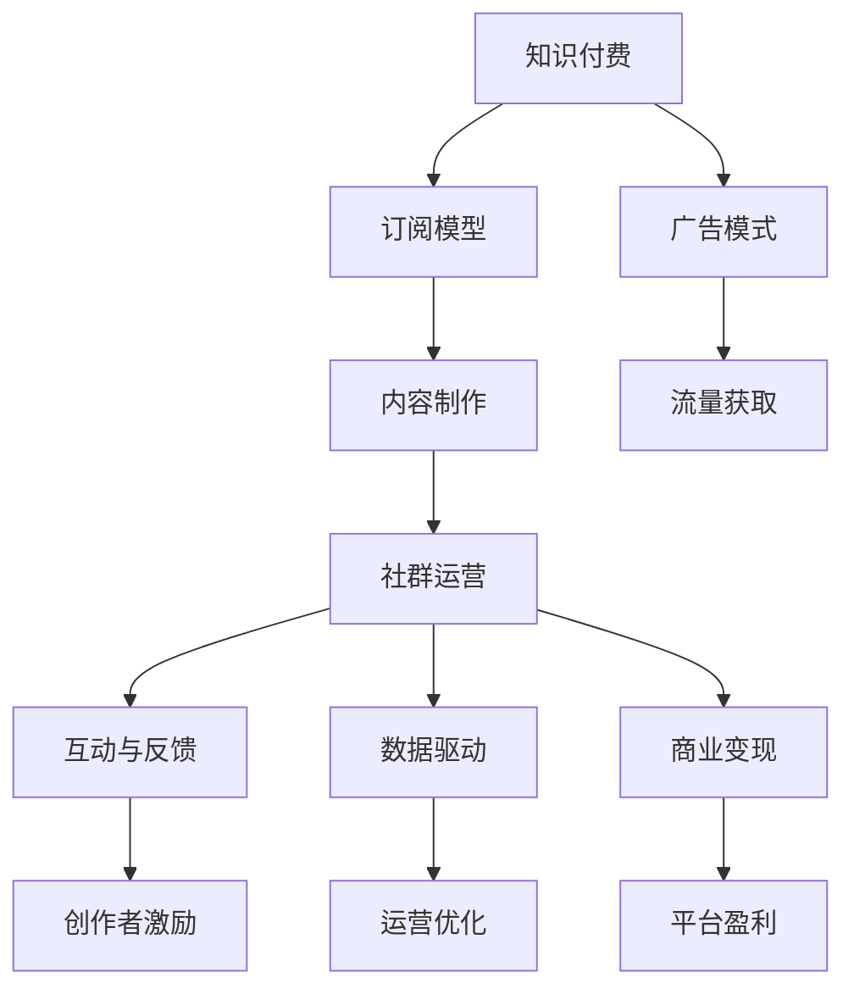

                 

# 知识付费：程序员的社群运营指南

> 关键词：知识付费, 程序员, 社群运营, 技术社区, 订阅模型, 广告模式, 知识分享, 平台搭建, 社交网络分析

## 1. 背景介绍

### 1.1 问题由来

在数字化快速发展的今天，信息爆炸已经成了常态。面对如此庞大的信息流，如何高效地筛选、整理和共享知识，成为许多行业内人士面临的共同难题。特别对于程序员这一职业，技术的迭代更新速度之快，让他们时刻处于不断学习和适应的状态。知识付费因此应运而生，通过付费订阅、定制内容、咨询问答等方式，为知识提供者与消费者建立了一个双向互动的生态系统。

但知识付费市场也在面临一些挑战，如何构建一个有效的、可持续的知识共享平台，如何让更多高质量的内容创作者参与进来，如何让知识付费的商业模式得到更广泛的认可，成为了社群运营的关键。本文将从核心概念、算法原理、操作步骤、实际应用等角度，系统阐述如何构建和运营一个成功的程序员知识付费社群。

### 1.2 问题核心关键点

知识付费社群运营的核心关键点在于如何吸引、激励高质量内容的创作者，以及如何利用技术手段，提高知识付费平台的用户粘性和满意度。具体来说，包括以下几个关键要素：

- 高质量内容的制作与分发：内容是知识付费社群的核心，如何吸引优秀的创作者，如何分发内容，如何呈现内容，都是运营的关键。
- 高效的社群互动与反馈：社群互动可以提升用户满意度，而及时有效的反馈，可以帮助创作者优化内容，满足用户需求。
- 有效的商业变现机制：通过多样化的商业模式，实现平台的可持续运营，并回馈内容创作者。
- 数据驱动的决策支持：通过数据来分析和优化运营策略，提升社群运营效果。
- 符合行业规则与法律要求的规范运营：确保社群运营符合相关法律与行业规范，建立平台信任度。

## 2. 核心概念与联系

### 2.1 核心概念概述

为更好地理解知识付费社群的运营，本节将介绍几个密切相关的核心概念：

- 知识付费(Knowledge Pricing)：指通过付费方式获取高质量知识或服务的一种模式。在这个模式下，内容创作者根据其知识或技能获取收入，而消费者通过付费得到更深入、专业的知识服务。

- 社群运营(Community Operation)：指通过组织和管理线上或线下的社群，提升社群成员的参与度和活跃度，同时实现社群的目标和价值的过程。

- 订阅模型(Subscription Model)：指用户通过定期付费订阅获得内容或服务的一种商业模式，用户按月或按年付费，持续获取更新。

- 广告模式(Ad-based Model)：指通过在平台上发布广告，吸引流量，并通过广告收入实现盈利的一种模式。

- 知识分享(Knowledge Sharing)：指将个人或集体掌握的知识，以各种形式在社群内分享和交流，增进社群成员的知识水平和合作能力。

- 平台搭建(Platform Development)：指搭建和维护知识付费平台的技术支撑和运营环境，确保平台稳定、高效地运行。

- 社交网络分析(Social Network Analysis)：指通过分析社群成员之间的互动关系和网络结构，来优化社群运营策略和提升社群效果。

这些概念之间的关系可以通过以下Mermaid流程图来展示：



这个流程图展示的知识付费社群的核心概念及其之间的关系：

1. 知识付费的实现依赖于订阅和广告两种主要商业模式。
2. 内容是知识付费的基础，通过高质量内容吸引用户。
3. 内容的制作与分发需要社群运营的支持。
4. 社群运营通过互动与反馈提升用户满意度，同时为创作者提供数据支持。
5. 创作者通过商业变现获得收益，实现平台盈利。
6. 商业变现的盈利模式又进一步激励更多创作者加入。

这些概念共同构成了知识付费社群的运营框架，使得社群能够持续、高效地提供优质内容，并实现商业价值的最大化。

## 3. 核心算法原理 & 具体操作步骤
### 3.1 算法原理概述

知识付费社群的运营，涉及到内容推荐、用户行为分析、社群互动等多个方面。其中，内容推荐算法是最为核心的一环。通过推荐算法，将高质量的内容推荐给感兴趣的受众，可以提高内容的使用效率，增强用户粘性，提升社群的整体活跃度。

在实践中，通常会采用协同过滤、基于内容的推荐、混合推荐等算法进行内容推荐。这些算法的基本原理是通过用户行为数据，构建用户和内容之间的相似度矩阵，从而找到最匹配的推荐结果。

协同过滤算法基于用户之间的相似性，通过用户历史行为数据，找到与目标用户相似的其他用户，并推荐这些用户喜欢的内容。基于内容的推荐算法则侧重于分析内容的属性和特征，将相似内容推荐给目标用户。混合推荐算法则综合以上两种方法，实现更加精准和全面的内容推荐。

### 3.2 算法步骤详解

知识付费社群的内容推荐算法通常包括以下几个关键步骤：

**Step 1: 数据采集与处理**

- 收集用户行为数据，包括浏览、点赞、评论、购买等行为。
- 收集内容属性数据，如标题、摘要、标签等。
- 进行数据清洗和标准化处理，构建用户行为向量。

**Step 2: 相似度计算**

- 计算用户之间的相似度。通常使用余弦相似度、皮尔逊相关系数等方法。
- 计算内容之间的相似度。通常使用TF-IDF、词向量等方法。
- 构建用户-内容相似度矩阵。

**Step 3: 推荐计算**

- 使用协同过滤算法或基于内容的推荐算法，进行用户-内容的相似度匹配。
- 综合多个推荐结果，通过加权或融合方法，得出最终推荐列表。
- 根据预测结果进行内容展示，让用户选择是否查看或购买。

**Step 4: 反馈收集与优化**

- 收集用户对推荐的反馈，如点击率、购买率、满意度等。
- 利用反馈数据进行模型优化，不断提升推荐效果。
- 定期评估推荐系统的效果，确保推荐质量。

### 3.3 算法优缺点

知识付费社群推荐算法具有以下优点：

- 高效精准：通过分析用户行为和内容属性，能够实现高效且精准的内容推荐。
- 个性化强：能够根据用户个性化需求，提供定制化的内容推荐，提高用户满意度。
- 可扩展性强：推荐系统可以根据不同规模的数据集进行扩展，适应大规模知识付费社群的需求。

同时，也存在一些局限：

- 冷启动问题：新用户和内容缺乏历史数据，推荐效果可能较差。
- 数据隐私问题：需要处理大量用户行为数据，涉及隐私保护和数据安全问题。
- 推荐偏差问题：用户偏好和内容质量评估可能存在偏差，影响推荐质量。
- 模型复杂性：推荐算法通常较为复杂，需要大量的计算资源和时间。

### 3.4 算法应用领域

知识付费社群推荐算法广泛应用于各个领域，如电商、新闻、音乐、视频等。

- 电商推荐：电商平台通过用户行为数据，推荐商品和广告，提高销售转化率。
- 新闻推荐：新闻网站通过用户阅读历史和兴趣标签，推荐相关新闻，增加用户停留时间。
- 音乐推荐：音乐平台通过用户听歌历史和歌曲属性，推荐新歌和专辑，提高用户粘性。
- 视频推荐：视频网站通过用户观看历史和视频标签，推荐新视频和节目，提升用户观看体验。

以上推荐系统都采用相似的技术原理和算法步骤，但具体实现需要根据不同场景和需求进行优化和调整。

## 4. 数学模型和公式 & 详细讲解  
### 4.1 数学模型构建

知识付费社群推荐算法可以抽象为一个优化问题。记用户集合为 $U$，内容集合为 $V$，用户对内容的评分矩阵为 $R$，用户的特征向量为 $X$，内容的特征向量为 $Y$，推荐算法目标为最小化预测评分与实际评分的差异，即：

$$
\min_{\theta} \sum_{u \in U} \sum_{v \in V} (r_{uv} - \hat{r}_{uv})^2
$$

其中 $\theta$ 为模型的参数，$\hat{r}_{uv}$ 为模型的预测评分。

常见的推荐算法包括基于协同过滤的矩阵分解法、基于内容的TF-IDF算法、基于深度学习的神经网络模型等。

### 4.2 公式推导过程

以矩阵分解法为例，基本思路是将用户-内容评分矩阵 $R$ 分解为用户特征向量 $X$ 和内容特征向量 $Y$ 的乘积，即：

$$
R = X\Theta Y^T
$$

其中 $\Theta$ 为用户对内容的评分向量，通过最小化 $L2$ 损失函数进行优化，得到：

$$
\min_{\Theta} ||R - X\Theta Y^T||_F^2
$$

通过SVD分解，可以得到 $\Theta$ 的近似解。具体计算过程如下：

1. 对 $R$ 进行奇异值分解，得到三个矩阵 $U, S, V^T$：
   $$
   R = U \Sigma V^T
   $$
   其中 $U$ 为左奇异矩阵，$S$ 为奇异值矩阵，$V^T$ 为右奇异矩阵。
2. 取前 $k$ 个奇异值和对应的特征向量，得到近似矩阵 $\hat{U}_k, \hat{S}_k, \hat{V}_k^T$：
   $$
   \hat{R} = \hat{U}_k \hat{S}_k \hat{V}_k^T
   $$
3. 计算 $\Theta$ 矩阵，使得 $R \approx X\Theta Y^T$：
   $$
   \Theta = V^T_k \hat{S}_k
   $$

通过上述步骤，矩阵分解法可以对大规模知识付费社群进行高效推荐。

### 4.3 案例分析与讲解

以下以一个简单的知识付费社群为例，说明如何使用矩阵分解法进行内容推荐：

假设一个社群有100个用户和1000篇文章，用户对每篇文章的评分矩阵为 $R$。通过SVD分解，得到前10个奇异值和对应的特征向量。将特征向量分别作为用户特征 $X$ 和文章特征 $Y$，即可进行内容推荐计算：

$$
\hat{R} = \hat{U}_{10} \hat{S}_{10} \hat{V}^T_{10}
$$

假设某个新用户 $u$ 的特征向量为 $X_u$，则可以计算其对每篇文章的预测评分，并根据评分结果推荐文章：

$$
\hat{R}_{u:v} = X_u \Theta Y^T_v
$$

其中 $\Theta$ 为通过SVD分解得到的评分向量。

## 5. 项目实践：代码实例和详细解释说明
### 5.1 开发环境搭建

在进行推荐算法实践前，我们需要准备好开发环境。以下是使用Python进行Scikit-Learn和PyTorch开发的环境配置流程：

1. 安装Anaconda：从官网下载并安装Anaconda，用于创建独立的Python环境。

2. 创建并激活虚拟环境：
```bash
conda create -n pytorch-env python=3.8 
conda activate pytorch-env
```

3. 安装Scikit-Learn和PyTorch：根据CUDA版本，从官网获取对应的安装命令。例如：
```bash
conda install scikit-learn pytorch torchvision torchaudio cudatoolkit=11.1 -c pytorch -c conda-forge
```

4. 安装各类工具包：
```bash
pip install numpy pandas scikit-learn matplotlib tqdm jupyter notebook ipython
```

完成上述步骤后，即可在`pytorch-env`环境中开始推荐算法实践。

### 5.2 源代码详细实现

这里我们以一个简单的知识付费社群推荐系统为例，给出使用Scikit-Learn进行矩阵分解法的Python代码实现。

首先，导入必要的库：

```python
from sklearn.decomposition import TruncatedSVD
from sklearn.metrics.pairwise import cosine_similarity
```

然后，定义数据集和评分矩阵：

```python
# 定义数据集
users = ['user1', 'user2', 'user3']
items = ['item1', 'item2', 'item3']
scores = {'user1': {'item1': 3, 'item2': 5, 'item3': 4}, 'user2': {'item1': 4, 'item2': 3, 'item3': 2}, 'user3': {'item1': 2, 'item2': 5, 'item3': 3}}

# 构建评分矩阵
R = pd.DataFrame(scores).transpose()
```

接着，进行奇异值分解和特征向量计算：

```python
# 进行奇异值分解
svd = TruncatedSVD(n_components=2, random_state=42)
U, S, Vt = svd.fit_transform(R)

# 计算特征向量
X = U
Y = Vt
```

最后，进行推荐计算：

```python
# 新用户评分
new_user = {'item1': 5, 'item2': 3, 'item3': 4}
new_user_score = pd.DataFrame(new_user).transpose()

# 计算预测评分
pred_scores = new_user_score @ X @ S @ Y

# 推荐文章
recommended_items = pred_scores.to_dict().keys()
```

以上就是使用Scikit-Learn进行矩阵分解法的代码实现。可以看到，通过上述步骤，可以简单地对知识付费社群进行推荐。

### 5.3 代码解读与分析

让我们再详细解读一下关键代码的实现细节：

**数据集定义**：
- 通过字典定义用户和物品的评分矩阵 $R$。

**奇异值分解**：
- 使用TruncatedSVD进行奇异值分解，得到左奇异矩阵 $U$、奇异值矩阵 $S$ 和右奇异矩阵 $V^T$。

**特征向量计算**：
- 将奇异值矩阵 $S$ 和右奇异矩阵 $V^T$ 作为用户特征 $X$ 和物品特征 $Y$。

**推荐计算**：
- 对新用户评分进行矩阵乘法运算，得到预测评分矩阵 $\hat{R}$。
- 提取预测评分矩阵的键，即可得到推荐的物品列表。

可以看到，矩阵分解法通过简单的数学运算，实现了高效且精准的推荐。在实际应用中，可以根据不同场景和需求，对算法进行优化和调整。

## 6. 实际应用场景
### 6.1 智能推荐系统

知识付费社群的推荐系统可以广泛应用于智能推荐系统，如电商、新闻、音乐、视频等。通过分析用户行为和内容属性，可以实现精准的内容推荐，提升用户体验和满意度。

- 电商推荐：电商平台通过用户购买历史和评价数据，推荐相关商品和促销信息，提高销售转化率。
- 新闻推荐：新闻网站通过用户阅读历史和兴趣标签，推荐相关新闻和专题，增加用户停留时间。
- 音乐推荐：音乐平台通过用户听歌历史和歌曲属性，推荐新歌和专辑，提高用户粘性。
- 视频推荐：视频网站通过用户观看历史和视频标签，推荐新视频和节目，提升用户观看体验。

### 6.2 个性化推荐广告

推荐算法不仅用于内容推荐，还可以用于个性化推荐广告。通过分析用户行为和兴趣，可以更精准地推送广告，提高广告效果和用户满意度。

- 广告位推荐：通过分析用户浏览行为，推荐广告位，提升广告展示效果。
- 广告内容推荐：通过分析用户兴趣标签，推荐相关广告内容，提高广告点击率。

### 6.3 用户行为分析

推荐算法还可以用于用户行为分析，帮助运营团队更好地了解用户需求和行为模式，优化产品设计和运营策略。

- 用户兴趣分析：通过分析用户行为数据，了解用户兴趣偏好，制定更有针对性的运营策略。
- 用户流失分析：通过分析用户流失数据，发现问题，提升用户留存率。

### 6.4 未来应用展望

随着知识付费社群的不断发展，推荐算法的应用场景将更加广泛，技术也将更加成熟。未来，推荐算法将与更多人工智能技术进行融合，实现更加智能化、精准化的推荐服务。

- 多模态推荐：结合文本、图片、视频等多模态数据，提升推荐效果。
- 个性化推荐引擎：利用深度学习等技术，实现更加精准的个性化推荐。
- 实时推荐系统：通过实时数据处理和机器学习，实现动态推荐，满足用户即时需求。

## 7. 工具和资源推荐
### 7.1 学习资源推荐

为了帮助开发者系统掌握知识付费社群推荐算法的理论基础和实践技巧，这里推荐一些优质的学习资源：

1. 《推荐系统实战》系列博文：由知识付费社群技术专家撰写，深入浅出地介绍了推荐系统原理、算法和优化技巧。

2. CS390《数据挖掘与统计学习》课程：斯坦福大学开设的推荐系统经典课程，涵盖推荐系统基础、协同过滤、基于内容的推荐等多种算法。

3. 《推荐系统》书籍：书中全面介绍了推荐系统的理论基础、算法实现和应用实践，是推荐系统学习的经典教材。

4. KDD Cup竞赛：通过参加KDD Cup等推荐系统竞赛，可以学习和实践最新推荐算法，并验证推荐效果。

5. PyCon推荐系统会议：每年举行的PyCon推荐系统会议，聚集了全球推荐系统领域的专家学者，分享最新研究成果和技术实践。

通过对这些资源的学习实践，相信你一定能够快速掌握知识付费社群推荐算法的精髓，并用于解决实际的推荐问题。

### 7.2 开发工具推荐

高效的开发离不开优秀的工具支持。以下是几款用于知识付费社群推荐算法开发的常用工具：

1. Python：Python是推荐系统开发的主流语言，拥有丰富的推荐系统库和工具。

2. Scikit-Learn：用于快速搭建和优化推荐系统的Python库，提供多种推荐算法实现和评估工具。

3. PyTorch：用于深度学习和神经网络模型的Python库，支持多种深度学习模型，可用于推荐系统优化。

4. TensorBoard：TensorFlow配套的可视化工具，可实时监测推荐系统训练状态，提供丰富的图表呈现方式。

5. Weights & Biases：模型训练的实验跟踪工具，记录和可视化推荐系统训练过程中的各项指标，方便对比和调优。

6. Elasticsearch：用于构建推荐系统数据存储和搜索的分布式搜索引擎，支持高效的查询和推荐。

合理利用这些工具，可以显著提升知识付费社群推荐算法的开发效率，加快创新迭代的步伐。

### 7.3 相关论文推荐

知识付费社群推荐技术的发展源于学界的持续研究。以下是几篇奠基性的相关论文，推荐阅读：

1. "Collaborative Filtering for Implicit Feedback Datasets"：提出协同过滤算法，为推荐系统奠定了基础。

2. "Trustworthy Matrix Factorization Techniques"：提出矩阵分解法，通过SVD分解实现推荐。

3. "Factorization Meets the Neighborhood: A Multifaceted Collaborative Filtering Model"：提出基于用户和物品相似度的推荐算法，提升推荐效果。

4. "The BellKor 2010 KDD Cup Machine Learning Challenge"：KDD Cup竞赛数据集，可用于推荐系统评估和优化。

5. "Deep Personalized Ranking with Implicit Feedback"：提出深度学习推荐算法，利用隐式反馈提升推荐精度。

这些论文代表了大数据推荐系统的研究方向，通过学习这些前沿成果，可以帮助研究者把握学科前进方向，激发更多的创新灵感。

## 8. 总结：未来发展趋势与挑战
### 8.1 总结

本文对知识付费社群推荐算法进行了全面系统的介绍。首先阐述了知识付费社群推荐算法的背景和意义，明确了推荐算法在知识付费社群中的核心地位。其次，从原理到实践，详细讲解了推荐算法的数学原理和关键步骤，给出了推荐算法任务开发的完整代码实例。同时，本文还广泛探讨了推荐算法在知识付费社群、个性化推荐广告、用户行为分析等多个领域的应用前景，展示了推荐算法的广泛应用价值。

通过本文的系统梳理，可以看到，知识付费社群推荐算法正在成为知识付费生态系统的重要支撑，极大地提升了内容创作者和用户的体验和满意度。未来，伴随推荐算法的不断演进，知识付费社群将更加高效、智能化，为知识付费市场带来更加广阔的发展空间。

### 8.2 未来发展趋势

展望未来，知识付费社群推荐算法将呈现以下几个发展趋势：

1. 深度学习在推荐算法中的占比将越来越大。深度学习技术可以更全面地捕捉用户行为和内容特征，提升推荐精度。

2. 推荐系统将实现更多样化的场景应用。推荐算法不仅用于内容推荐，还可以用于广告推荐、用户行为分析等多种场景。

3. 推荐系统将更加个性化和多样化。通过更丰富的用户画像和内容标签，实现更精准的个性化推荐。

4. 推荐系统将引入更多外部数据源。通过引入外部数据，如社交网络、用户评论、专家知识等，提升推荐效果。

5. 推荐系统将实现实时化、动态化。通过实时数据处理和机器学习，实现动态推荐，满足用户即时需求。

6. 推荐系统将实现更高的自动化和智能化。通过自动化推荐模型训练和优化，实现推荐系统的高效、精准。

以上趋势凸显了知识付费社群推荐算法的广阔前景。这些方向的探索发展，必将进一步提升推荐系统的效果和应用范围，为知识付费市场带来更加丰富的用户体验和商业价值。

### 8.3 面临的挑战

尽管知识付费社群推荐算法已经取得了显著成就，但在迈向更加智能化、普适化应用的过程中，它仍面临着诸多挑战：

1. 数据隐私问题：推荐系统需要处理大量用户行为数据，涉及隐私保护和数据安全问题。如何保护用户隐私，确保数据安全，将是推荐系统的重要挑战。

2. 冷启动问题：新用户和内容缺乏历史数据，推荐效果可能较差。如何快速解决冷启动问题，提升推荐效果，将是推荐系统的关键。

3. 推荐系统算法复杂度：推荐算法通常较为复杂，需要大量的计算资源和时间。如何优化推荐算法，提升推荐效率，将是推荐系统的另一个重要挑战。

4. 用户行为多样性：用户行为和兴趣复杂多变，如何捕捉用户真实需求，实现精准推荐，将是推荐系统的难点。

5. 推荐效果评估问题：推荐系统评估标准多样，如何构建全面、客观的评估体系，将是推荐系统的挑战。

6. 推荐系统公平性问题：推荐系统可能存在推荐偏见，如何提升推荐公平性，避免推荐歧视，将是推荐系统的关键。

7. 推荐系统透明性和可解释性：推荐系统通常被视为“黑盒”系统，如何增强推荐系统的透明性和可解释性，将是推荐系统的未来方向。

这些挑战凸显了知识付费社群推荐系统的复杂性和多样性，需要各方共同努力，不断优化和提升推荐系统的效果和体验。

### 8.4 研究展望

面对知识付费社群推荐系统所面临的挑战，未来的研究需要在以下几个方面寻求新的突破：

1. 探索基于深度学习的推荐算法。深度学习可以更好地捕捉用户行为和内容特征，提升推荐精度。

2. 引入更多外部数据源。通过引入社交网络、用户评论、专家知识等外部数据，提升推荐效果。

3. 实现推荐系统的自动化和智能化。通过自动化推荐模型训练和优化，实现推荐系统的高效、精准。

4. 优化推荐系统算法复杂度。通过优化算法结构和计算图，提升推荐效率。

5. 提升推荐系统透明性和可解释性。通过引入可解释性工具和方法，增强推荐系统的透明性和可解释性。

6. 构建全面、客观的推荐效果评估体系。通过多种评估标准和指标，全面评估推荐系统的性能。

7. 提升推荐系统公平性。通过公平性分析和算法改进，避免推荐歧视。

8. 解决冷启动问题。通过冷启动策略和多模态数据融合，快速解决新用户和内容推荐问题。

这些研究方向将推动知识付费社群推荐系统向更高层次发展，为知识付费市场带来更丰富的用户体验和商业价值。总之，知识付费社群推荐系统需要在数据、算法、工程、业务等多个维度协同发力，才能真正实现人工智能技术在知识付费市场的广泛应用。

## 9. 附录：常见问题与解答

**Q1：推荐算法需要多少数据？**

A: 推荐算法需要足够的历史数据来训练模型。通常来说，数据量越大，模型效果越好。对于知识付费社群推荐系统，建议至少有几千条用户行为数据，以确保模型能够捕捉到真实的用户偏好和行为模式。

**Q2：如何选择推荐算法？**

A: 推荐算法的选择需要考虑多个因素，包括数据量、数据类型、推荐场景等。常见的推荐算法包括协同过滤、基于内容的推荐、深度学习等。一般来说，数据量较大、数据结构复杂时，深度学习算法更为适合。数据量较小、数据结构简单时，基于内容的推荐算法更为适合。

**Q3：如何评估推荐效果？**

A: 推荐效果的评估可以采用多种指标，如准确率、召回率、F1值、NDCG等。常用的评估方法包括交叉验证、A/B测试等。在实际应用中，建议结合多种评估指标，综合评估推荐效果。

**Q4：推荐算法如何避免推荐偏差？**

A: 推荐算法中的推荐偏差可以通过多种方法避免，包括特征工程、模型优化、数据预处理等。一般来说，特征工程可以提升模型的泛化能力，避免过拟合。模型优化可以通过引入正则化、权重衰减等方法，避免推荐偏差。数据预处理可以通过数据清洗、归一化等方法，提升数据质量。

**Q5：推荐系统如何应对用户兴趣变化？**

A: 推荐系统可以引入多种技术手段，应对用户兴趣变化。例如，可以通过用户行为数据分析，实时调整推荐策略。引入反馈机制，动态优化推荐结果。引入多模态数据，提升推荐效果。

这些问题的回答，希望能为知识付费社群推荐算法的实践提供一些指导和参考。总之，推荐算法是知识付费社群的核心技术，需要不断优化和提升，才能满足用户的不断变化的需求。

---

作者：禅与计算机程序设计艺术 / Zen and the Art of Computer Programming

