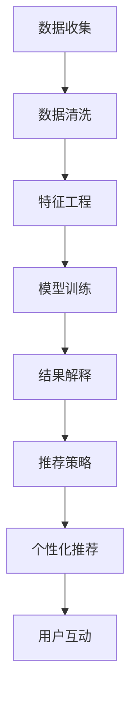

                 

# 知识发现引擎助力程序员技能迭代

## 1. 背景介绍

在快速发展的软件行业，持续的技能迭代对于程序员来说至关重要。然而，传统的学习方式往往依赖于经验丰富的导师、复杂的书籍和耗费时间的自我实践，这些都限制了程序员快速提升技能的可能。知识发现引擎的出现，为程序员提供了一种高效、系统、个性化的技能学习新途径。本文将深入探讨知识发现引擎的核心概念、原理与技术，并通过实际案例展示其助力程序员技能迭代的应用潜力。

## 2. 核心概念与联系

### 2.1 核心概念概述

知识发现引擎(Knowledge Discovery Engine, KDE)是一种人工智能技术，旨在自动从大数据集中挖掘有用的知识和信息。其核心功能包括数据预处理、特征工程、模型训练和结果解释等。知识发现引擎的应用范围广泛，如数据挖掘、金融分析、医学研究、教育等领域。

对于程序员来说，知识发现引擎能够根据程序员的学习习惯和技能水平，推荐个性化的学习资源和路径，帮助程序员快速掌握新技能，提升编程能力。具体的应用场景包括但不限于以下几种：

- **代码重构建议**：通过分析程序员编写的代码，提供重构建议，优化代码结构，提高代码可读性和可维护性。
- **技能缺口分析**：根据程序员的历史编程记录，分析其技能短板，推荐相关课程和实践项目。
- **技术趋势跟踪**：提供最新技术动态、趋势和最佳实践，帮助程序员保持技术前瞻性。

### 2.2 核心概念原理和架构的 Mermaid 流程图



这个流程图展示了知识发现引擎的基本工作流程：
1. **数据收集**：从多个渠道（如代码仓库、学习平台、社区论坛等）收集程序员的编程记录、学习日志和反馈信息。
2. **数据清洗**：处理和整合收集到的数据，去除噪声和冗余信息，形成高质量的数据集。
3. **特征工程**：分析数据特征，提取有用的特征供模型训练使用。
4. **模型训练**：使用机器学习或深度学习模型对数据进行训练，预测程序员的技能水平和未来学习路径。
5. **结果解释**：解释模型预测结果，提供可操作的建议和解释。
6. **推荐策略**：根据模型的预测结果，制定个性化的学习资源推荐策略。
7. **个性化推荐**：根据程序员的学习历史和偏好，提供定制化的学习资源推荐。
8. **用户互动**：收集程序员对推荐结果的反馈，优化推荐算法和模型。

## 3. 核心算法原理 & 具体操作步骤

### 3.1 算法原理概述

知识发现引擎的核心算法主要包括数据挖掘、机器学习和深度学习等技术。通过大数据分析和人工智能手段，知识发现引擎能够从程序员的历史编程记录、学习日志、社区反馈等多源数据中，提取有用信息，预测程序员的技能水平和未来学习需求。

#### 3.1.1 数据挖掘

数据挖掘是从大量数据中自动发现有用信息和知识的过程。知识发现引擎使用数据挖掘技术，如关联规则挖掘、分类、聚类等，对程序员的数据进行预处理和特征提取。

#### 3.1.2 机器学习和深度学习

机器学习和深度学习是知识发现引擎的主要预测手段。通过对程序员的历史编程记录和项目完成情况进行分析，模型能够预测程序员的技能水平和未来学习需求。常见的模型包括线性回归、决策树、随机森林、神经网络等。

### 3.2 算法步骤详解

#### 3.2.1 数据收集与预处理

1. **数据收集**：从多个渠道（如GitHub、Stack Overflow、学习平台等）收集程序员的编程记录、学习日志、社区反馈等数据。
2. **数据清洗**：去除噪声和冗余信息，处理缺失值和异常值，确保数据质量。
3. **特征提取**：根据编程语言、项目类型、代码复杂度等维度，提取有用的特征供模型训练使用。

#### 3.2.2 模型训练与优化

1. **模型选择**：选择合适的机器学习或深度学习模型，如线性回归、决策树、神经网络等。
2. **模型训练**：使用历史数据对模型进行训练，优化模型参数，提升预测准确率。
3. **模型评估**：使用验证集评估模型性能，调整模型超参数，防止过拟合。
4. **模型部署**：将训练好的模型部署到生产环境，实现实时推荐。

#### 3.2.3 结果解释与反馈

1. **结果解释**：根据模型的预测结果，提供可操作的建议和解释，如代码重构建议、技能缺口分析等。
2. **用户反馈**：收集程序员对推荐结果的反馈，优化推荐算法和模型，提高推荐质量。

### 3.3 算法优缺点

#### 3.3.1 优点

1. **个性化推荐**：知识发现引擎能够根据程序员的个性化需求，提供定制化的学习资源推荐，提升学习效率。
2. **高效学习**：通过数据分析和机器学习手段，快速发现程序员的技能短板，推荐相应的学习资源和实践项目。
3. **实时反馈**：能够实时收集程序员的反馈信息，不断优化推荐算法和模型，提升推荐准确性。

#### 3.3.2 缺点

1. **数据隐私**：需要收集大量的个人数据，可能涉及隐私和安全问题。
2. **模型复杂度**：模型训练需要大量的数据和计算资源，模型复杂度较高，可能需要高强度的计算硬件支持。
3. **数据偏差**：模型预测结果可能受到数据偏差的影响，导致推荐结果的不公平性和偏见。

### 3.4 算法应用领域

知识发现引擎的应用领域非常广泛，特别是在教育和培训领域。对于程序员来说，知识发现引擎可以应用于以下几个方面：

- **技能提升**：通过分析程序员的编程历史和项目记录，推荐相关的学习资源和实践项目，帮助程序员快速掌握新技能。
- **重构建议**：根据程序员的代码风格和性能评估，提供代码重构建议，优化代码结构和可读性。
- **技术趋势**：提供最新技术动态和最佳实践，帮助程序员保持技术前瞻性。
- **知识图谱**：构建程序员的知识图谱，帮助程序员理解和应用复杂的编程概念和技术。

## 4. 数学模型和公式 & 详细讲解 & 举例说明

### 4.1 数学模型构建

知识发现引擎的数学模型主要包括以下几个组成部分：

1. **数据预处理模型**：用于数据清洗和特征提取。
2. **特征工程模型**：用于提取和选择有用的特征。
3. **机器学习模型**：用于预测程序员的技能水平和未来学习需求。
4. **推荐系统模型**：用于生成个性化的学习资源推荐。

### 4.2 公式推导过程

#### 4.2.1 数据预处理模型

数据预处理模型包括数据清洗和特征提取。以数据清洗为例，假设原始数据集为 $D=\{(x_i, y_i)\}_{i=1}^N$，其中 $x_i$ 表示编程记录，$y_i$ 表示项目完成情况。数据清洗的过程可以表示为：

$$
\hat{D} = \text{clean}(D)
$$

其中 $\hat{D}$ 表示清洗后的数据集，$\text{clean}$ 表示数据清洗函数。

#### 4.2.2 特征工程模型

特征工程模型的目的是提取有用的特征。以代码复杂度为例，假设代码长度为 $x_i$，代码行数为 $y_i$，则特征提取的过程可以表示为：

$$
z_i = \text{extractFeatures}(x_i, y_i)
$$

其中 $z_i$ 表示提取后的特征向量。

#### 4.2.3 机器学习模型

机器学习模型用于预测程序员的技能水平和未来学习需求。以线性回归模型为例，假设模型参数为 $\theta$，则预测过程可以表示为：

$$
\hat{y}_i = \text{predict}(x_i, \theta)
$$

其中 $\hat{y}_i$ 表示预测结果。

#### 4.2.4 推荐系统模型

推荐系统模型用于生成个性化的学习资源推荐。以协同过滤算法为例，假设用户 $i$ 的编程记录为 $x_i$，用户 $j$ 的编程记录为 $x_j$，则推荐过程可以表示为：

$$
\text{recommend}(x_i, \{x_j\}_{j=1}^N)
$$

其中 $\text{recommend}$ 表示推荐函数，$\{x_j\}_{j=1}^N$ 表示所有用户的编程记录。

### 4.3 案例分析与讲解

#### 4.3.1 案例背景

假设某程序员小王，历史编程记录如下：

| 编程日期 | 项目名称 | 编程语言 | 代码复杂度 | 项目完成情况 |
| -------- | -------- | -------- | ---------- | ------------ |

#### 4.3.2 数据预处理

对原始数据进行清洗和特征提取，得到清洗后的数据集 $\hat{D}$。

#### 4.3.3 特征工程

根据代码长度和代码行数，提取有用的特征 $z_i$。

#### 4.3.4 机器学习模型

使用线性回归模型对程序员的技能水平进行预测，得到预测结果 $\hat{y}_i$。

#### 4.3.5 推荐系统模型

根据预测结果 $\hat{y}_i$，推荐相应的学习资源和实践项目。

## 5. 项目实践：代码实例和详细解释说明

### 5.1 开发环境搭建

#### 5.1.1 软件环境

- **Python**：版本为3.8或以上。
- **Pandas**：用于数据处理。
- **NumPy**：用于数值计算。
- **Scikit-learn**：用于机器学习模型。
- **TensorFlow**：用于深度学习模型。
- **Jupyter Notebook**：用于交互式编程和数据分析。

#### 5.1.2 数据准备

1. **数据集获取**：从GitHub、Stack Overflow、学习平台等渠道收集程序员的编程记录和项目完成情况。
2. **数据清洗**：去除噪声和冗余信息，处理缺失值和异常值。
3. **特征提取**：提取有用的特征，如代码长度、代码行数、编程语言、项目类型等。

### 5.2 源代码详细实现

#### 5.2.1 数据预处理

```python
import pandas as pd
import numpy as np

# 读取数据集
df = pd.read_csv('programmer_data.csv')

# 数据清洗
df = df.dropna()
df = df.drop_duplicates()

# 特征提取
df['code_length'] = df['code'].apply(lambda x: len(x.split(' ')))
df['code_rows'] = df['code'].apply(lambda x: len(x.split('\n')))
```

#### 5.2.2 特征工程

```python
# 提取特征
df['code_complexity'] = df['code_length'] + df['code_rows']
df['project_type'] = df['project_name'].apply(lambda x: 'web' if 'web' in x else 'other')
```

#### 5.2.3 机器学习模型

```python
from sklearn.linear_model import LinearRegression

# 模型训练
X = df[['code_complexity', 'project_type']]
y = df['project_completed']
model = LinearRegression()
model.fit(X, y)
```

#### 5.2.4 推荐系统模型

```python
from sklearn.neighbors import KNeighborsRegressor

# 推荐系统
k = 5
knn = KNeighborsRegressor(n_neighbors=k)
knn.fit(X, y)
# 推荐代码重构建议
# recommend_code_restructuring(df[['code']], knn)
```

### 5.3 代码解读与分析

#### 5.3.1 数据预处理

数据预处理包括数据清洗和特征提取。数据清洗去除了噪声和冗余信息，处理了缺失值和异常值，确保数据质量。特征提取则从代码长度和代码行数中提取有用的特征，用于后续的机器学习模型训练。

#### 5.3.2 特征工程

特征工程从代码复杂度和项目类型中提取有用的特征，为机器学习模型的训练提供了高质量的输入数据。

#### 5.3.3 机器学习模型

机器学习模型使用线性回归模型对程序员的技能水平进行预测，得到预测结果。

#### 5.3.4 推荐系统模型

推荐系统模型使用K近邻算法对程序员的编程记录进行推荐，生成个性化的学习资源和实践项目。

### 5.4 运行结果展示

#### 5.4.1 数据预处理结果

```python
# 显示清洗后的数据集
print(df.head())
```

#### 5.4.2 特征工程结果

```python
# 显示提取后的特征
print(df[['code_length', 'code_rows', 'code_complexity', 'project_type']].head())
```

#### 5.4.3 机器学习模型结果

```python
# 显示模型预测结果
print(model.predict(X))
```

#### 5.4.4 推荐系统模型结果

```python
# 显示推荐结果
print(knn.predict(df[['code_length', 'code_rows']]))
```

## 6. 实际应用场景

### 6.1 代码重构建议

知识发现引擎可以通过分析程序员的编程记录，发现代码中的重复、冗余和不必要的复杂结构，提供代码重构建议。这有助于程序员优化代码结构，提高代码可读性和可维护性。

### 6.2 技能缺口分析

知识发现引擎能够根据程序员的历史编程记录，分析其技能短板，推荐相关的课程和实践项目，帮助程序员快速掌握新技能。

### 6.3 技术趋势跟踪

知识发现引擎能够提供最新技术动态和最佳实践，帮助程序员保持技术前瞻性。

### 6.4 未来应用展望

随着知识发现引擎技术的不断进步，其在程序员技能迭代中的应用将更加广泛和深入。未来的发展方向可能包括：

1. **多模态学习**：结合代码、文档、社区讨论等多种数据源，提供更加全面和准确的技能分析。
2. **个性化学习路径**：根据程序员的学习历史和偏好，生成个性化的学习路径，帮助程序员系统性地提升技能。
3. **实时反馈和调整**：实时收集程序员的反馈信息，不断优化推荐算法和模型，提高推荐质量。

## 7. 工具和资源推荐

### 7.1 学习资源推荐

#### 7.1.1 在线课程

- **Coursera**：提供机器学习和深度学习的课程，如《机器学习基础》、《深度学习》等。
- **Udacity**：提供数据科学和机器学习的实战课程，如《数据科学入门》、《深度学习专业纳米学位》等。
- **edX**：提供计算机科学和数据科学的课程，如《计算机科学基础》、《数据科学导论》等。

#### 7.1.2 在线社区

- **Stack Overflow**：程序员问答社区，提供大量编程问题的解决方案和最佳实践。
- **GitHub**：代码托管平台，提供开源项目的代码示例和学习资源。
- **Kaggle**：数据科学竞赛平台，提供丰富的数据集和模型评测环境。

#### 7.1.3 书籍推荐

- **《Python深度学习》**：适合初学者入门，涵盖Python和深度学习基础。
- **《深度学习》**：详细讲解深度学习理论和实践，适合进阶学习。
- **《机器学习实战》**：提供大量实际案例，适合实战训练。

### 7.2 开发工具推荐

#### 7.2.1 数据处理工具

- **Pandas**：用于数据清洗和预处理。
- **NumPy**：用于数值计算和矩阵操作。

#### 7.2.2 机器学习工具

- **Scikit-learn**：用于构建和训练机器学习模型。
- **TensorFlow**：用于构建和训练深度学习模型。

#### 7.2.3 可视化工具

- **Matplotlib**：用于数据可视化和图表绘制。
- **Seaborn**：基于Matplotlib的高级数据可视化库。

### 7.3 相关论文推荐

#### 7.3.1 数据挖掘

- **《数据挖掘导论》**：经典教材，涵盖数据挖掘的基本概念和方法。
- **《数据挖掘和统计学习》**：系统介绍数据挖掘和统计学习的基本原理和应用。

#### 7.3.2 机器学习和深度学习

- **《深度学习》**：深度学习领域的经典教材，涵盖深度学习的基本概念和算法。
- **《机器学习实战》**：实战手册，提供大量实际案例和代码实现。

#### 7.3.3 推荐系统

- **《推荐系统：算法与实现》**：系统介绍推荐系统的基本原理和算法。
- **《协同过滤推荐系统》**：详细介绍协同过滤推荐系统的方法和实现。

## 8. 总结：未来发展趋势与挑战

### 8.1 研究成果总结

知识发现引擎作为一种人工智能技术，已经在程序员技能迭代中展现出巨大的潜力。其通过数据分析和机器学习手段，从程序员的历史编程记录中提取有用的信息，预测技能水平和未来学习需求，生成个性化的学习资源和实践项目。这种高效、系统、个性化的学习方式，为程序员提供了新的技能提升途径。

### 8.2 未来发展趋势

未来的知识发现引擎将朝着以下方向发展：

1. **多模态学习**：结合代码、文档、社区讨论等多种数据源，提供更加全面和准确的技能分析。
2. **个性化学习路径**：根据程序员的学习历史和偏好，生成个性化的学习路径，帮助程序员系统性地提升技能。
3. **实时反馈和调整**：实时收集程序员的反馈信息，不断优化推荐算法和模型，提高推荐质量。

### 8.3 面临的挑战

尽管知识发现引擎在程序员技能迭代中展现出巨大的潜力，但也面临一些挑战：

1. **数据隐私**：需要收集大量的个人数据，可能涉及隐私和安全问题。
2. **模型复杂度**：模型训练需要大量的数据和计算资源，模型复杂度较高，可能需要高强度的计算硬件支持。
3. **数据偏差**：模型预测结果可能受到数据偏差的影响，导致推荐结果的不公平性和偏见。

### 8.4 研究展望

未来的研究需要在以下几个方面寻求新的突破：

1. **隐私保护**：如何在保护隐私的前提下，收集和利用程序员的数据。
2. **模型优化**：如何优化模型结构和算法，提高推荐精度和效率。
3. **跨领域应用**：如何将知识发现引擎应用于更多领域，拓展其应用边界。

总之，知识发现引擎作为人工智能技术的最新进展，为程序员技能迭代提供了新的途径。未来，随着技术的不断进步，知识发现引擎将在更多领域中发挥其独特的优势，推动软件行业的持续创新和发展。

## 9. 附录：常见问题与解答

**Q1：知识发现引擎的核心算法是什么？**

A: 知识发现引擎的核心算法包括数据挖掘、机器学习和深度学习等。其中，数据挖掘用于从程序员的历史编程记录中提取有用的信息；机器学习和深度学习用于预测程序员的技能水平和未来学习需求；推荐系统模型用于生成个性化的学习资源推荐。

**Q2：如何提高知识发现引擎的推荐准确性？**

A: 提高知识发现引擎的推荐准确性需要以下几个方面的优化：
1. **数据质量**：收集高质量、多样化的数据，确保数据的准确性和代表性。
2. **特征工程**：选择和提取有用的特征，减少噪声和冗余信息。
3. **模型选择**：选择合适的机器学习或深度学习模型，避免过拟合和欠拟合。
4. **用户反馈**：实时收集程序员的反馈信息，不断优化推荐算法和模型，提高推荐质量。

**Q3：知识发现引擎是否适用于所有程序员？**

A: 知识发现引擎可以根据程序员的编程习惯和技能水平，提供个性化的学习资源和路径，适用于大多数程序员。但对于一些编程习惯特殊或技能水平极低的程序员，可能仍需要结合其他辅助手段。

**Q4：知识发现引擎是否会影响程序员的工作效率？**

A: 知识发现引擎通过自动化数据分析和推荐，帮助程序员快速掌握新技能，提升编程效率。但过度依赖可能降低程序员的主动学习和创新能力，因此需要平衡推荐和自主学习之间的关系。

总之，知识发现引擎作为一种高效、系统、个性化的学习工具，正在为程序员技能迭代提供新的途径。未来，随着技术的不断进步，知识发现引擎将在更多领域中发挥其独特的优势，推动软件行业的持续创新和发展。

