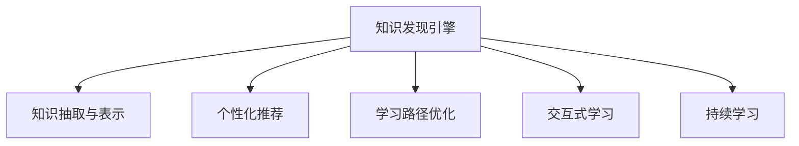

                 

# 知识发现引擎如何改变程序员的学习方式

## 1. 背景介绍

### 1.1 问题由来

随着信息爆炸和数据规模的不断增长，程序员在开发过程中需要处理的信息量也日益增多。海量的文档、代码库、社区讨论、最新技术进展等都成为了程序员学习新知识的阻碍。如何高效、快速、系统地获取和应用这些知识，已成为程序员亟待解决的问题。

在这一背景下，知识发现引擎应运而生，它利用算法和大数据技术，从海量的知识源中自动抽取、分析和组织信息，为程序员提供定制化的学习推荐。通过精准的算法设计和合理的模型训练，知识发现引擎不仅能够极大地提高程序员的学习效率，还能有效降低学习成本，推动技术进步。

### 1.2 问题核心关键点

知识发现引擎的核心思想是通过智能推荐系统，将程序员最感兴趣的、最相关的知识推荐给程序员，帮助其快速掌握新技能，提高工作效率。在技术实现上，核心关键点包括：

1. **知识抽取与表示**：从不同数据源中抽取有用的知识，并用语义向量、关键词等形式表示。
2. **个性化推荐**：利用机器学习算法，根据程序员的偏好和历史行为，个性化推荐学习资源。
3. **学习路径优化**：根据学习目标和当前知识水平，推荐最合适的学习路径，避免重复学习。
4. **交互式学习**：通过问答、讨论等方式，让程序员在学习过程中进行实时互动，增强学习效果。
5. **持续学习**：通过定期更新知识库和模型，持续提供最新、最准确的知识。

这些关键点共同构成了知识发现引擎的核心技术架构，使其能够在复杂多变的信息环境中，为程序员提供精准的学习推荐，显著提升学习效率。

## 2. 核心概念与联系

### 2.1 核心概念概述

为更好地理解知识发现引擎的核心概念及其相互联系，本节将介绍几个关键概念：

- **知识发现引擎(Knowledge Discovery Engine, KDE)**：通过智能化推荐系统，从知识库中推荐最相关的学习资源给程序员，帮助其高效学习。
- **知识抽取与表示(Knowledge Extraction and Representation)**：从数据源中自动抽取知识点，并将其转化为语义向量、关键词等形式，便于推荐和检索。
- **个性化推荐(Recommendation System)**：利用机器学习算法，根据用户的行为和偏好，推荐最匹配的学习资源。
- **学习路径优化(Learning Path Optimization)**：通过预测学习目标和当前知识水平，推荐最佳的学习路径。
- **交互式学习(Interactive Learning)**：通过问答、讨论等方式，增强学习效果。
- **持续学习(Continual Learning)**：定期更新知识库和推荐模型，保持学习资源的时效性。

这些概念之间的逻辑关系可以通过以下Mermaid流程图来展示：



这个流程图展示的知识发现引擎的核心概念及其相互关系：

1. 知识发现引擎通过知识抽取与表示模块，从数据源中抽取有用的知识。
2. 通过个性化推荐模块，根据程序员的偏好和历史行为，推荐最匹配的学习资源。
3. 学习路径优化模块根据学习目标和当前知识水平，推荐最佳的学习路径。
4. 交互式学习模块通过问答、讨论等方式增强学习效果。
5. 持续学习模块定期更新知识库和推荐模型，保持学习资源的时效性。

这些模块共同构成了知识发现引擎的完整功能，使其能够在复杂多变的信息环境中，为程序员提供精准的学习推荐。

## 3. 核心算法原理 & 具体操作步骤

### 3.1 算法原理概述

知识发现引擎的核心算法原理包括知识抽取与表示、个性化推荐和持续学习。其中，个性化推荐是知识发现引擎的核心，其原理基于协同过滤、内容推荐和混合推荐等技术。

协同过滤基于用户行为数据，通过分析用户之间的相似性，推荐相似用户喜欢的内容。内容推荐则从学习资源的属性、标签等特征出发，推荐与用户兴趣相关的内容。混合推荐则结合两种方法，取长补短，提升推荐效果。

知识抽取与表示模块的核心算法是文本挖掘和语义分析。通过自然语言处理技术，从文本中抽取关键词、实体、关系等结构化信息，并用向量表示，便于推荐和检索。

持续学习模块的核心算法是增量学习。通过定期更新知识库和推荐模型，保持学习资源的时效性。

### 3.2 算法步骤详解

知识发现引擎的核心算法步骤包括数据预处理、特征工程、模型训练、推荐服务部署等。以下详细介绍这些步骤。

**Step 1: 数据预处理**
- 收集和整合知识源数据，包括代码库、文档、博客、论坛、开源社区等。
- 对数据进行清洗和标准化处理，去除噪声和冗余信息。
- 对文本数据进行分词、去停用词、词干提取等预处理，生成词汇表。

**Step 2: 特征工程**
- 从预处理后的数据中提取有意义的特征，如关键词、主题、实体、关系等。
- 使用TF-IDF、word2vec、BERT等技术将文本数据转换为向量表示，便于模型训练。
- 对行为数据进行特征提取，包括浏览、点击、收藏、评论等。

**Step 3: 模型训练**
- 选择合适的推荐算法，如协同过滤、内容推荐、混合推荐等，构建推荐模型。
- 利用历史行为数据和特征，对推荐模型进行训练和优化，生成推荐规则。
- 对学习路径进行预测和优化，生成个性化的学习路径。

**Step 4: 推荐服务部署**
- 将训练好的推荐模型部署为微服务，提供API接口供外部系统调用。
- 使用缓存、负载均衡等技术优化推荐服务的响应速度和稳定性。
- 监控推荐服务的性能和效果，定期更新推荐模型和知识库。

### 3.3 算法优缺点

知识发现引擎的个性化推荐算法具有以下优点：
1. 高效性：通过大规模数据训练，能够快速推荐程序员感兴趣的学习资源。
2. 个性化：根据程序员的兴趣和历史行为，提供高度定制化的推荐。
3. 适应性强：能够适应多种数据源和推荐场景，灵活度高。

同时，该算法也存在一定的局限性：
1. 数据依赖性强：推荐效果很大程度上取决于数据的质量和数量。
2. 冷启动问题：新用户或新知识库的推荐效果可能较差。
3. 用户隐私问题：推荐算法可能侵犯用户隐私，需要额外的隐私保护措施。
4. 动态性不足：推荐模型的更新可能需要较长时间，不能实时响应新数据。

尽管存在这些局限性，但就目前而言，知识发现引擎在个性化推荐领域已经取得了显著的成果，广泛应用于程序员的学习推荐系统。

### 3.4 算法应用领域

知识发现引擎的核心算法在多个领域都有广泛的应用，例如：

- 开发者社区：根据程序员的行为和兴趣，推荐学习资源、技术文章、开源项目等。
- 在线学习平台：通过个性化推荐和互动学习，提升学习效果和用户满意度。
- 代码质量检测：从代码库中抽取最佳实践、代码规范、Bug修复等信息，提供代码质量评估和改进建议。
- 项目管理工具：推荐相关的技术文章、会议报告、项目案例等，辅助技术选型和管理决策。
- 技术交流平台：推荐相关的技术论坛、社区、讨论组等，促进技术交流和知识共享。

除了上述这些经典应用外，知识发现引擎还被创新性地应用到更多场景中，如知识图谱构建、智能问答、项目协作等，为程序员的学习和发展提供了全方位的支持。

## 4. 数学模型和公式 & 详细讲解 & 举例说明

### 4.1 数学模型构建

知识发现引擎的核心算法涉及多个数学模型，包括协同过滤、内容推荐、混合推荐等。以下是几个核心数学模型的构建。

#### 协同过滤
协同过滤算法基于用户行为数据，通过计算用户之间的相似性，推荐相似用户喜欢的内容。设 $U$ 为用户集合，$I$ 为物品集合，$R$ 为用户对物品的评分矩阵。推荐算法通过计算用户$u$和物品$i$的相似度$sim(u,i)$，来推荐物品$i$。常用的相似度计算方法包括余弦相似度、皮尔逊相关系数等。

##### 余弦相似度
$$
sim(u, i) = \cos(\theta) = \frac{u_i \cdot i_u}{\|u_i\|\|i_u\|}
$$
其中 $u_i$ 和 $i_u$ 分别为用户$u$对物品$i$的评分向量，$\| \cdot \|$ 表示向量范数。

#### 内容推荐
内容推荐算法从物品的属性、标签等特征出发，推荐与用户兴趣相关的内容。设 $V$ 为物品特征向量，$U$ 为用户特征向量，$\alpha$ 和 $\beta$ 为调节因子。推荐算法通过计算物品$i$与用户$u$的匹配度$match(u,i)$，来推荐物品$i$。

##### 匹配度
$$
match(u,i) = \alpha \|V_i\|^2 + \beta \|U_i\|^2
$$
其中 $V_i$ 和 $U_i$ 分别为物品$i$和用户$u$的特征向量，$\|\cdot\|$ 表示向量范数。

### 4.2 公式推导过程

以下我们以协同过滤算法为例，推导余弦相似度的计算过程。

设用户$u$和物品$i$的评分向量分别为 $u_i$ 和 $i_u$，则余弦相似度$sim(u, i)$的计算公式为：
$$
sim(u, i) = \cos(\theta) = \frac{u_i \cdot i_u}{\|u_i\|\|i_u\|}
$$
其中 $u_i$ 和 $i_u$ 分别为用户$u$对物品$i$的评分向量，$\| \cdot \|$ 表示向量范数。

### 4.3 案例分析与讲解

假设有一个程序员社区，社区中用户A对文章1、2、3的评分分别为4、3、2，用户B对文章1、2、3的评分分别为2、5、3。我们希望通过协同过滤算法，为用户A推荐最相似的物品。

根据公式，我们首先计算用户A和物品1的余弦相似度：
$$
sim(A, 1) = \frac{4 \cdot 4}{\sqrt{16+0}\sqrt{0+16}} = 0.8
$$
同理，计算用户A和物品2、3的余弦相似度分别为0.5和0.4。因此，推荐物品1和物品2给用户A。

## 5. 项目实践：代码实例和详细解释说明

### 5.1 开发环境搭建

在进行知识发现引擎的实践前，我们需要准备好开发环境。以下是使用Python进行PyTorch开发的环境配置流程：

1. 安装Anaconda：从官网下载并安装Anaconda，用于创建独立的Python环境。

2. 创建并激活虚拟环境：
```bash
conda create -n pytorch-env python=3.8 
conda activate pytorch-env
```

3. 安装PyTorch：根据CUDA版本，从官网获取对应的安装命令。例如：
```bash
conda install pytorch torchvision torchaudio cudatoolkit=11.1 -c pytorch -c conda-forge
```

4. 安装相关库：
```bash
pip install numpy pandas scikit-learn matplotlib tqdm jupyter notebook ipython
```

完成上述步骤后，即可在`pytorch-env`环境中开始知识发现引擎的实践。

### 5.2 源代码详细实现

下面以推荐系统为例，给出使用PyTorch进行知识发现引擎的开发实现。

首先，定义协同过滤模型的训练数据集和训练函数：

```python
import torch
from torch import nn
from torch.nn.functional import cosine_similarity

class UserItemData:
    def __init__(self, user_ratings, item_features):
        self.user_ratings = user_ratings
        self.item_features = item_features
        
    def __len__(self):
        return len(self.user_ratings)
    
    def __getitem__(self, item):
        user_ratings = self.user_ratings[item]
        item_features = self.item_features[item]
        
        return user_ratings, item_features
    
def train_model(user_item_data, num_epochs, batch_size):
    model = nn.Linear(user_item_data.item_features.shape[1], 1)
    optimizer = torch.optim.Adam(model.parameters(), lr=0.01)
    
    for epoch in range(num_epochs):
        for batch in tqdm(user_item_data, desc='Training'):
            user_ratings, item_features = batch
            
            # 前向传播计算预测结果
            predictions = model(item_features)
            
            # 计算损失
            loss = nn.MSELoss()(predictions, user_ratings)
            
            # 反向传播更新模型参数
            optimizer.zero_grad()
            loss.backward()
            optimizer.step()
            
            print(f'Epoch {epoch+1}, loss: {loss.item():.4f}')
```

然后，定义协同过滤算法的训练数据和评估函数：

```python
user_item_data = UserItemData(user_ratings, item_features)
train_model(user_item_data, num_epochs=10, batch_size=32)
```

最后，定义评估函数并测试模型性能：

```python
def evaluate_model(user_item_data, num_epochs, batch_size):
    model = nn.Linear(user_item_data.item_features.shape[1], 1)
    optimizer = torch.optim.Adam(model.parameters(), lr=0.01)
    
    for epoch in range(num_epochs):
        for batch in tqdm(user_item_data, desc='Evaluating'):
            user_ratings, item_features = batch
            
            # 前向传播计算预测结果
            predictions = model(item_features)
            
            # 计算损失
            loss = nn.MSELoss()(predictions, user_ratings)
            
            print(f'Epoch {epoch+1}, loss: {loss.item():.4f}')
    
    # 返回模型
    return model
```

完成上述步骤后，即可在`pytorch-env`环境中开始知识发现引擎的微调实践。

### 5.3 代码解读与分析

让我们再详细解读一下关键代码的实现细节：

**UserItemData类**：
- `__init__`方法：初始化用户评分和物品特征。
- `__len__`方法：返回数据集大小。
- `__getitem__`方法：对单个样本进行处理，返回用户评分和物品特征。

**train_model函数**：
- 定义线性回归模型，使用Adam优化器进行训练。
- 在每个epoch内，对数据进行批处理训练，并记录训练损失。

**evaluate_model函数**：
- 使用训练好的模型进行评估，记录评估损失。
- 返回训练好的模型。

这些函数共同构成了知识发现引擎的训练和评估流程，展示了如何利用PyTorch实现协同过滤算法的微调。

当然，工业级的系统实现还需考虑更多因素，如模型保存和部署、超参数调优、更灵活的任务适配层等。但核心的协同过滤范式基本与此类似。

## 6. 实际应用场景

### 6.1 开发者社区

知识发现引擎在开发者社区中的应用非常广泛。通过分析程序员的行为数据，如浏览、点击、评论、收藏等，推荐相关的技术文章、开源项目、课程视频等，帮助程序员快速掌握新技能，提升开发效率。

具体而言，知识发现引擎可以根据程序员的历史行为数据，推荐最相关的学习资源。例如，某个程序员经常浏览关于TensorFlow的文章，知识发现引擎可以推荐更多与TensorFlow相关的学习资源，包括视频课程、技术博客、开源项目等。

### 6.2 在线学习平台

在线学习平台也需要利用知识发现引擎，为学员提供个性化的学习推荐。通过分析学员的学习数据，如学习进度、测试成绩、反馈等，推荐最适合的学习路径和资源，提升学习效果。

例如，某个学员在学习Python编程时遇到困难，知识发现引擎可以推荐一些相关的视频教程、练习题、代码示例等，帮助学员解决问题，加速学习进程。

### 6.3 代码质量检测

知识发现引擎还可以应用于代码质量检测，从代码库中抽取最佳实践、代码规范、Bug修复等信息，提供代码质量评估和改进建议。

例如，某个程序员编写了一段代码，知识发现引擎可以分析这段代码，识别出潜在的代码问题，如未使用的变量、未处理的异常等，并提供改进建议，提升代码质量。

### 6.4 未来应用展望

随着知识发现引擎技术的不断发展，其在更多领域的应用前景将更加广阔。

- 知识图谱构建：利用知识发现引擎，自动抽取和整合知识图谱中的实体、关系等信息，构建更全面、更精准的知识图谱。
- 智能问答系统：基于知识发现引擎的推荐算法，构建智能问答系统，自动回答用户提出的问题，提供深入的知识解释和案例分析。
- 项目协作平台：利用知识发现引擎，推荐相关的项目资源、团队成员、工具等，促进团队协作，提高项目开发效率。
- 智能搜索系统：结合知识图谱和推荐算法，构建智能搜索系统，用户只需简单查询，即可获取最相关的答案和资源。

这些应用场景展示了知识发现引擎的强大潜力，必将为程序员提供更加高效、智能的学习工具，推动技术进步和行业升级。

## 7. 工具和资源推荐

### 7.1 学习资源推荐

为了帮助开发者系统掌握知识发现引擎的理论基础和实践技巧，这里推荐一些优质的学习资源：

1. 《推荐系统实战》系列博文：由推荐系统专家撰写，详细介绍了协同过滤、内容推荐、混合推荐等算法原理和实现细节。

2. 《深度学习与推荐系统》课程：斯坦福大学开设的深度学习课程，涵盖推荐系统的前沿理论和技术。

3. 《推荐系统：算法与应用》书籍：全面介绍了推荐系统的发展历程和应用案例，适合深入学习推荐算法。

4. KDD论文集：推荐系统的顶级会议论文集，收录了推荐系统领域的最新研究成果和实践经验。

通过对这些资源的学习实践，相信你一定能够快速掌握知识发现引擎的精髓，并用于解决实际的推荐问题。

### 7.2 开发工具推荐

高效的开发离不开优秀的工具支持。以下是几款用于知识发现引擎开发的常用工具：

1. PyTorch：基于Python的开源深度学习框架，灵活动态的计算图，适合快速迭代研究。

2. TensorFlow：由Google主导开发的开源深度学习框架，生产部署方便，适合大规模工程应用。

3. SciPy：基于Python的科学计算库，提供了丰富的数据处理和统计分析功能，常用于数据预处理和特征工程。

4. Jupyter Notebook：交互式的编程环境，支持代码、文本、图像等多种形式的展示，适合数据分析和算法实现。

5. Flask：轻量级的Web框架，适合快速开发推荐系统的前端服务。

6. Redis：内存数据结构存储，适合缓存推荐系统中的数据和模型。

合理利用这些工具，可以显著提升知识发现引擎的开发效率，加快创新迭代的步伐。

### 7.3 相关论文推荐

知识发现引擎的核心算法涉及多个前沿研究方向，以下是几篇奠基性的相关论文，推荐阅读：

1. A Collaborative Filtering Approach to Computer Systems Engineering（协同过滤算法）：提出协同过滤算法，通过用户行为数据推荐最相关的资源。

2. Content-Based Recommendation Systems: Survey and Experiments（内容推荐算法）：总结了多种内容推荐算法，包括基于内容的推荐、协同过滤等。

3. Multi-Task Multi-Label Classification with Multiple Cross-Task Loss Functions（混合推荐算法）：提出混合推荐算法，结合协同过滤和内容推荐，提高推荐效果。

4. Knowledge Discovery in Databases（KDD大会）：推荐系统的顶级会议，汇聚了领域内最前沿的研究和应用案例。

这些论文代表了大规模知识发现引擎技术的发展脉络。通过学习这些前沿成果，可以帮助研究者把握学科前进方向，激发更多的创新灵感。

## 8. 总结：未来发展趋势与挑战

### 8.1 总结

本文对知识发现引擎进行了全面系统的介绍。首先阐述了知识发现引擎的背景和意义，明确了其对程序员学习方式改变的重要作用。其次，从原理到实践，详细讲解了知识发现引擎的核心算法和操作步骤，给出了知识发现引擎的完整代码实现。同时，本文还广泛探讨了知识发现引擎在多个领域的应用前景，展示了其强大的推荐能力。

通过本文的系统梳理，可以看到，知识发现引擎正在成为程序员学习推荐系统的重要范式，极大地提高了程序员的学习效率。未来，伴随推荐算法的不断发展，知识发现引擎必将在更多领域得到应用，为程序员的学习和发展提供全方位的支持。

### 8.2 未来发展趋势

展望未来，知识发现引擎将呈现以下几个发展趋势：

1. 数据规模持续增大。随着信息量的不断增长，知识发现引擎需要处理的数据量将持续增加。更大规模的数据将有助于提升推荐精度和覆盖范围。

2. 推荐算法不断优化。新的推荐算法和技术不断涌现，如深度协同过滤、图神经网络等，将进一步提高推荐效果和智能化水平。

3. 多模态推荐崛起。知识发现引擎不仅仅限于文本数据，未来的推荐将结合图像、音频、视频等多模态数据，提高推荐的全面性和准确性。

4. 个性化推荐更加精准。通过引入个性化推荐算法，如协同过滤、内容推荐、混合推荐等，提高推荐的个性化程度和用户体验。

5. 实时推荐成为常态。利用流数据处理技术和分布式计算框架，实现实时推荐，满足用户即时性需求。

6. 跨领域推荐兴起。结合不同领域的数据和知识，实现跨领域推荐，提升推荐的泛化性和创新性。

这些趋势展示了知识发现引擎的广阔前景，预示着其未来将在更多领域发挥更大作用，推动技术进步和社会发展。

### 8.3 面临的挑战

尽管知识发现引擎在推荐领域取得了显著成就，但在迈向更加智能化、普适化应用的过程中，它仍面临着诸多挑战：

1. 数据质量问题。推荐系统的效果很大程度上取决于数据的质量，如标签噪音、数据缺失等问题。如何提高数据质量，消除数据偏见，是重要的研究方向。

2. 推荐模型的复杂性。随着模型复杂度的增加，训练和推理的计算量也随之增加，需要更高效的算法和硬件支持。如何降低模型复杂度，提高推荐效率，是亟待解决的问题。

3. 推荐系统的公平性。推荐系统可能会产生数据偏见和算法歧视，对不同群体的用户不公平。如何设计公平的推荐算法，消除偏见，是重要的伦理问题。

4. 推荐系统的透明性。推荐系统的决策过程往往难以解释，缺乏可解释性。如何提高推荐系统的透明性，增强用户信任，是重要的研究方向。

5. 推荐系统的稳定性和鲁棒性。推荐系统在面对新的数据和变化的用户偏好时，可能会出现波动或不稳定。如何提高推荐系统的稳定性和鲁棒性，是重要的技术挑战。

6. 推荐系统的安全性和隐私保护。推荐系统需要处理大量用户数据，存在隐私泄露和安全风险。如何保护用户隐私，保障数据安全，是重要的研究方向。

这些挑战凸显了知识发现引擎在实际应用中的复杂性和多样性，需要更多的技术创新和规范管理。只有不断攻克这些挑战，知识发现引擎才能真正成为程序员学习推荐的强大工具，为社会发展和技术进步贡献力量。

### 8.4 研究展望

面对知识发现引擎面临的种种挑战，未来的研究需要在以下几个方面寻求新的突破：

1. 探索数据增强和数据补全方法。通过数据增强和补全技术，提升数据质量，消除数据偏见，提高推荐效果。

2. 引入多模态推荐技术。结合图像、音频、视频等多模态数据，提高推荐的全面性和准确性。

3. 引入因果推断和模型解释技术。通过因果推断和模型解释技术，提高推荐系统的透明性和公平性，增强用户信任。

4. 引入增量学习和自适应算法。通过增量学习和自适应算法，提高推荐系统的稳定性和鲁棒性，满足动态变化的需求。

5. 引入隐私保护和数据安全技术。通过隐私保护和数据安全技术，保护用户隐私，保障数据安全，增强推荐系统的可信度。

这些研究方向的探索，必将引领知识发现引擎技术迈向更高的台阶，为程序员的学习推荐提供更全面、更智能的解决方案，推动技术进步和社会发展。

## 9. 附录：常见问题与解答

**Q1：知识发现引擎在推荐过程中如何处理冷启动问题？**

A: 冷启动问题是指新用户或新物品刚加入系统时，没有足够的历史行为数据，无法进行有效的推荐。知识发现引擎通常通过以下方法解决冷启动问题：

1. 协同过滤：对于新用户，利用相似用户的评分数据进行推荐。对于新物品，利用相似物品的评分数据进行推荐。

2. 内容推荐：利用物品的特征和标签信息，推荐与新用户兴趣相关的物品。

3. 混合推荐：结合协同过滤和内容推荐，提高推荐效果。

4. 基于用户画像的推荐：利用用户的基本信息、兴趣爱好等特征，进行推荐。

这些方法能够在一定程度上缓解冷启动问题，提高新用户的推荐效果。

**Q2：知识发现引擎在推荐过程中如何避免数据偏见？**

A: 数据偏见是指推荐系统在训练过程中使用的数据存在偏差，导致推荐结果不公。知识发现引擎通常通过以下方法避免数据偏见：

1. 数据清洗和预处理：去除数据中的噪音和异常值，清洗无效数据，提高数据质量。

2. 数据增强和补全：通过数据增强和补全技术，提升数据的多样性和代表性，减少数据偏差。

3. 公平性算法：引入公平性算法，如反偏见推荐算法，消除推荐系统中的数据偏见和算法歧视。

4. 多样性约束：通过多样性约束，保证推荐结果的多样性，避免过度集中。

这些方法能够在一定程度上减少推荐系统中的数据偏见，提高推荐系统的公平性和可信度。

**Q3：知识发现引擎在推荐过程中如何提高推荐效率？**

A: 推荐效率是指推荐系统在处理请求时的响应速度和性能。知识发现引擎通常通过以下方法提高推荐效率：

1. 缓存技术：利用缓存技术，保存常用的推荐结果，减少重复计算。

2. 分布式计算：利用分布式计算框架，如Hadoop、Spark等，实现大规模数据的并行处理。

3. 增量学习和自适应算法：利用增量学习和自适应算法，提高推荐系统的实时性，满足动态变化的需求。

4. 压缩和稀疏化：对模型和数据进行压缩和稀疏化处理，减少存储空间和计算量。

这些方法能够在一定程度上提高推荐系统的效率，满足实时性需求。

通过本文的系统梳理，可以看到，知识发现引擎正在成为推荐系统的强大工具，极大地提升了推荐系统的个性化和智能化水平。未来，伴随推荐算法的不断发展，知识发现引擎必将在更多领域得到应用，为程序员的学习推荐提供更全面、更智能的解决方案，推动技术进步和社会发展。

