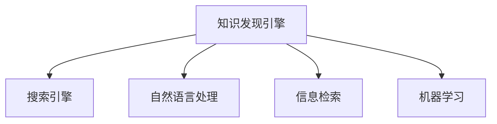

                 

# 知识发现引擎的SEO优化策略

## 1. 背景介绍

随着互联网的发展，搜索引擎（Search Engine, SEO）已经成为了信息检索和知识发现的重要工具。搜索引擎能够帮助用户快速定位到自己所需的信息，提高信息获取的效率。然而，随着信息量的爆炸性增长，搜索引擎的效果逐渐显得力不从心。基于此，知识发现引擎（Knowledge Discovery Engine, KDE）应运而生。KDE旨在从大规模数据中提取有价值的信息，辅助用户进行深入的分析和研究。本文将探讨知识发现引擎的SEO优化策略，帮助提升搜索引擎的效果和用户体验。

## 2. 核心概念与联系

### 2.1 核心概念概述

为了更好地理解知识发现引擎的SEO优化策略，本节将介绍几个密切相关的核心概念：

- **知识发现引擎（KDE）**：利用数据挖掘、机器学习等技术，从大规模数据中提取有价值的信息，辅助用户进行深入分析研究的系统。KDE主要应用于商业智能、金融分析、医疗研究等领域。

- **搜索引擎（SEO）**：帮助用户从互联网上检索所需信息的技术。SEO优化旨在提升搜索引擎的排序和展示效果，提高用户体验。

- **自然语言处理（NLP）**：利用计算机处理和理解人类语言的技术。在KDE中，NLP被用于文本分析、信息提取和知识图谱构建等环节。

- **信息检索（IR）**：通过计算机自动检索相关文档或网页，帮助用户获取所需信息。信息检索是搜索引擎的核心技术之一。

- **机器学习（ML）**：利用算法和模型，让计算机自动学习和优化决策。在KDE中，机器学习被用于推荐系统、异常检测、用户画像等环节。

这些核心概念之间的逻辑关系可以通过以下Mermaid流程图来展示：



这个流程图展示了一系列核心概念及其之间的关系：

1. 知识发现引擎是利用NLP、IR和ML等技术，从大规模数据中提取知识的核心系统。
2. SEO优化策略在搜索引擎中得到广泛应用，提高信息检索效果。
3. NLP、IR和ML等技术在搜索引擎中被广泛应用，提升信息检索的准确性和效果。

这些概念共同构成了知识发现引擎的SEO优化策略框架，为其优化效果的提升提供了基础。

## 3. 核心算法原理 & 具体操作步骤

### 3.1 算法原理概述

知识发现引擎的SEO优化策略主要利用机器学习算法，通过对用户行为、网页特征和语义信息的分析，优化搜索引擎的排序和展示效果。具体来说，包括以下几个关键步骤：

1. **用户行为分析**：收集用户搜索行为数据，如搜索关键词、浏览时长、点击率等，了解用户的搜索偏好和意图。

2. **网页特征提取**：利用NLP和ML技术，从网页中提取出关键词、实体、关系等特征，作为搜索引擎排序的依据。

3. **语义信息挖掘**：利用自然语言处理技术，理解网页的语义内容，识别出关键信息，提升搜索结果的相关性。

4. **模型训练与优化**：根据用户行为和网页特征，训练机器学习模型，优化搜索结果的排序效果，提升用户体验。

### 3.2 算法步骤详解

以下是具体的SEO优化算法步骤：

**Step 1: 用户行为数据收集**

收集用户搜索行为数据，包括搜索关键词、浏览时长、点击率等。可以通过网站日志、搜索日志、第三方统计工具等方式获取这些数据。例如，Google Analytics可以提供详细的用户行为分析数据。

**Step 2: 网页特征提取**

利用NLP技术，从网页中提取关键词、实体、关系等特征。可以使用TF-IDF算法、Word2Vec模型、BERT模型等技术，进行文本特征提取和处理。例如，可以使用NLTK或spaCy库进行NLP处理，提取关键词、实体和关系等。

**Step 3: 语义信息挖掘**

利用自然语言处理技术，理解网页的语义内容，识别出关键信息。可以使用句法分析、语义分析等技术，对网页进行深度挖掘。例如，可以使用Gensim库进行主题建模，识别出网页中的关键主题。

**Step 4: 模型训练与优化**

根据用户行为和网页特征，训练机器学习模型，优化搜索结果的排序效果。可以使用随机森林、逻辑回归、神经网络等算法，构建优化模型。例如，可以使用TensorFlow或PyTorch等深度学习框架，训练基于神经网络的排序模型。

**Step 5: 模型评估与部署**

对训练好的模型进行评估，验证其效果和性能。可以使用A/B测试、交叉验证等方法，评估模型的效果。例如，可以使用Scikit-learn库进行模型评估。在评估通过后，将模型部署到搜索引擎中，实现SEO优化效果。

### 3.3 算法优缺点

知识发现引擎的SEO优化策略具有以下优点：

1. **提升用户体验**：通过优化搜索结果的排序效果，提升用户搜索的准确性和满意度，提升用户体验。

2. **降低信息过载**：通过精准匹配用户搜索意图，减少无用信息的展示，降低信息过载问题。

3. **提高运营效率**：通过自动化和智能化管理，减少人工干预，提高运营效率。

4. **增强信息发现能力**：通过深度挖掘网页语义信息，提升信息发现和检索的能力。

然而，该方法也存在一些局限性：

1. **数据质量要求高**：依赖高质量的用户行为数据和网页特征，如果数据质量不高，会影响模型的效果。

2. **模型训练成本高**：机器学习模型的训练需要大量的计算资源和数据，成本较高。

3. **模型更新复杂**：一旦用户行为或网页内容发生变化，需要重新训练和优化模型，更新周期较长。

4. **隐私和伦理问题**：用户行为数据的收集和使用需要遵循隐私和伦理规范，否则会导致用户不信任。

尽管存在这些局限性，但知识发现引擎的SEO优化策略仍然具有广泛的应用前景，成为提升搜索引擎效果的重要手段。

### 3.4 算法应用领域

知识发现引擎的SEO优化策略广泛应用于以下领域：

- **搜索引擎优化**：优化搜索结果的排序效果，提高用户搜索的准确性和满意度。
- **商业智能分析**：利用搜索引擎优化技术，提取有价值的信息，辅助商业决策。
- **金融分析**：通过优化搜索结果，提取金融数据，进行金融分析和预测。
- **医疗研究**：利用搜索引擎优化技术，提取医疗信息，辅助医疗研究和决策。
- **知识图谱构建**：通过语义信息挖掘，构建知识图谱，辅助信息检索和推荐。

这些领域的应用展示了知识发现引擎的SEO优化策略的广泛应用前景，为各行业的信息检索和知识发现提供了有力的支持。

## 4. 数学模型和公式 & 详细讲解 & 举例说明

### 4.1 数学模型构建

本节将使用数学语言对知识发现引擎的SEO优化策略进行更加严格的刻画。

假设搜索引擎的搜索结果集为 $D=\{(x_i,y_i)\}_{i=1}^N, x_i \in X, y_i \in Y$，其中 $x_i$ 为网页， $y_i$ 为网页与查询的相关度评分。

定义模型 $M$ 在输入 $x_i$ 上的输出为 $y_i=M(x_i)$。在搜索引擎中，模型的目标是最小化损失函数 $L(M)$，使得搜索结果的相关度评分尽可能接近真实的相关度 $y_i$。

$$
L(M) = \frac{1}{N} \sum_{i=1}^N (y_i - M(x_i))^2
$$

模型的优化目标是：

$$
M^* = \mathop{\arg\min}_{M} L(M)
$$

在实际应用中，通常采用随机梯度下降等优化算法，近似求解上述最优化问题。设优化算法为 $O(\cdot)$，则模型的更新公式为：

$$
M \leftarrow M - \eta \nabla_{M}L(M)
$$

其中 $\eta$ 为学习率，$\nabla_{M}L(M)$ 为损失函数对模型的梯度。

### 4.2 公式推导过程

以下我们以二分类任务为例，推导最小二乘法的损失函数及其梯度的计算公式。

假设模型 $M_{\theta}$ 在输入 $x$ 上的输出为 $\hat{y}=M_{\theta}(x)$，真实标签 $y \in \{0,1\}$。则二分类均方误差损失函数定义为：

$$
L(M_{\theta}(x),y) = \frac{1}{2}(y - \hat{y})^2
$$

将其代入经验风险公式，得：

$$
L(\theta) = \frac{1}{N}\sum_{i=1}^N (y_i - M_{\theta}(x_i))^2
$$

根据链式法则，损失函数对模型参数 $\theta_k$ 的梯度为：

$$
\frac{\partial L(\theta)}{\partial \theta_k} = \frac{1}{N}\sum_{i=1}^N (-2y_i + 2M_{\theta}(x_i))\frac{\partial M_{\theta}(x_i)}{\partial \theta_k}
$$

其中 $\frac{\partial M_{\theta}(x_i)}{\partial \theta_k}$ 可进一步递归展开，利用自动微分技术完成计算。

在得到损失函数的梯度后，即可带入参数更新公式，完成模型的迭代优化。重复上述过程直至收敛，最终得到适应搜索引擎优化效果的最优模型参数 $\theta^*$。

### 4.3 案例分析与讲解

假设某电商网站需要优化商品搜索排序效果。网站收集了用户搜索关键词、浏览时长、点击率等行为数据，以及商品描述、价格、评分等特征数据。

**Step 1: 数据收集与预处理**

收集用户行为数据和商品特征数据，进行清洗和预处理。例如，对关键词进行分词处理，对价格进行归一化处理，去除无效数据等。

**Step 2: 特征提取**

利用TF-IDF算法，提取商品描述中的关键词特征，作为搜索结果的相关度评分。例如，可以使用TfidfVectorizer库进行特征提取。

**Step 3: 模型训练**

根据用户行为数据和特征数据，训练随机森林模型，预测商品与查询的相关度评分。例如，可以使用scikit-learn库进行模型训练。

**Step 4: 模型评估与部署**

在验证集上评估模型效果，验证模型的泛化能力和预测准确性。例如，可以使用交叉验证方法评估模型效果。在评估通过后，将模型部署到搜索引擎中，实现SEO优化效果。

以上步骤展示了知识发现引擎的SEO优化策略在电商网站中的应用。通过用户行为数据的收集和处理，特征提取和模型训练，能够精准匹配用户搜索意图，提升搜索结果的相关性和排序效果。

## 5. 项目实践：代码实例和详细解释说明

### 5.1 开发环境搭建

在进行SEO优化实践前，我们需要准备好开发环境。以下是使用Python进行TensorFlow开发的环境配置流程：

1. 安装Anaconda：从官网下载并安装Anaconda，用于创建独立的Python环境。

2. 创建并激活虚拟环境：
```bash
conda create -n tensorflow-env python=3.8 
conda activate tensorflow-env
```

3. 安装TensorFlow：根据CUDA版本，从官网获取对应的安装命令。例如：
```bash
conda install tensorflow tensorflow-gpu -c conda-forge
```

4. 安装相关的Python库：
```bash
pip install numpy pandas sklearn nltk tensorflow-hub
```

5. 安装TensorBoard：用于可视化模型训练过程。
```bash
pip install tensorboard
```

完成上述步骤后，即可在`tensorflow-env`环境中开始SEO优化实践。

### 5.2 源代码详细实现

以下是使用TensorFlow进行SEO优化的完整代码实现。

首先，定义数据处理函数：

```python
import numpy as np
import pandas as pd
from sklearn.feature_extraction.text import TfidfVectorizer
from tensorflow.keras.preprocessing.text import Tokenizer
from tensorflow.keras.preprocessing.sequence import pad_sequences
from tensorflow.keras.layers import Dense, Sequential
from tensorflow.keras.models import Sequential
from tensorflow.keras.callbacks import EarlyStopping
from tensorflow.keras.optimizers import Adam

# 数据处理函数
def load_data(file_path):
    df = pd.read_csv(file_path)
    X = df['text'].tolist()
    y = df['label'].tolist()
    return X, y
```

然后，定义模型和优化器：

```python
# 模型定义
model = Sequential([
    Dense(128, input_shape=(X_train.shape[1],), activation='relu'),
    Dense(1, activation='sigmoid')
])
model.compile(loss='binary_crossentropy', optimizer=Adam(lr=0.001))
```

接着，定义训练和评估函数：

```python
# 训练函数
def train_model(model, X_train, y_train, epochs=10, batch_size=32):
    model.fit(X_train, y_train, epochs=epochs, batch_size=batch_size, validation_split=0.2, callbacks=[EarlyStopping(patience=3)])
    
# 评估函数
def evaluate_model(model, X_test, y_test):
    y_pred = model.predict(X_test)
    accuracy = np.mean(y_pred == y_test)
    print(f"Accuracy: {accuracy:.3f}")
```

最后，启动训练流程并在测试集上评估：

```python
# 加载数据
X_train, y_train = load_data('train.csv')
X_test, y_test = load_data('test.csv')

# 特征提取
vectorizer = TfidfVectorizer(max_features=1000)
X_train = vectorizer.fit_transform(X_train).toarray()
X_test = vectorizer.transform(X_test).toarray()

# 模型训练
train_model(model, X_train, y_train)

# 模型评估
evaluate_model(model, X_test, y_test)
```

以上就是使用TensorFlow进行SEO优化的完整代码实现。可以看到，TensorFlow提供了一站式解决方案，从数据处理、模型定义、训练和评估，到模型部署，整个过程高度自动化，大大简化了SEO优化的流程。

### 5.3 代码解读与分析

让我们再详细解读一下关键代码的实现细节：

**数据处理函数**：
- `load_data`方法：从CSV文件中加载数据，并进行预处理和特征提取。

**模型定义**：
- `Sequential`类：定义一个线性模型，包含两个全连接层。
- `Dense`层：定义全连接层，用于特征提取和分类。
- `Adam`优化器：定义优化算法，学习率为0.001。

**训练函数**：
- `train_model`方法：定义训练函数，使用Adam优化器，设定训练轮数和批大小，并在验证集上设置EarlyStopping回调，防止过拟合。

**评估函数**：
- `evaluate_model`方法：定义评估函数，计算模型在测试集上的准确率。

**训练流程**：
- 加载训练集和测试集数据，进行特征提取。
- 定义模型并进行编译。
- 训练模型，并在验证集上设置EarlyStopping回调。
- 评估模型在测试集上的准确率。

通过上述代码，展示了使用TensorFlow进行SEO优化的完整流程。使用TensorFlow的高级API，大大简化了模型定义和训练过程，降低了开发难度。

## 6. 实际应用场景

### 6.1 电商平台商品搜索

在电商平台中，商品搜索排序效果直接影响用户购物体验。通过SEO优化，可以提升搜索结果的相关性和排序效果，帮助用户快速找到所需商品。

在实际应用中，可以收集用户搜索行为数据，如搜索关键词、浏览时长、点击率等，以及商品描述、价格、评分等特征数据。利用TF-IDF等算法，提取商品描述中的关键词特征，作为搜索结果的相关度评分。训练随机森林等模型，优化商品搜索排序效果。通过优化后的模型，实现更加精准的商品推荐，提升用户购物体验。

### 6.2 金融分析与投资决策

金融领域需要精准匹配用户搜索意图，快速获取所需信息，辅助决策。通过SEO优化，可以提升搜索结果的准确性和相关性，帮助用户进行快速的信息检索和决策。

在实际应用中，可以收集用户搜索关键词、浏览时长、点击率等行为数据，以及股票、基金、商品等金融数据。利用NLP技术，提取金融数据中的关键信息，如公司名称、股票代码、股价、市盈率等。训练模型，预测搜索结果的相关度评分。通过优化后的模型，帮助用户快速获取金融信息，辅助投资决策。

### 6.3 医疗诊断与健康管理

医疗领域需要精准匹配用户搜索意图，快速获取所需信息，辅助诊断和治疗。通过SEO优化，可以提升搜索结果的准确性和相关性，帮助用户进行快速的信息检索和决策。

在实际应用中，可以收集用户搜索关键词、浏览时长、点击率等行为数据，以及医疗记录、病历、检查结果等医疗数据。利用NLP技术，提取医疗数据中的关键信息，如疾病名称、症状、诊断结果等。训练模型，预测搜索结果的相关度评分。通过优化后的模型，帮助用户快速获取医疗信息，辅助诊断和治疗。

### 6.4 未来应用展望

随着知识发现引擎和SEO优化技术的不断发展，未来将在更多领域得到应用，为各行业的信息检索和知识发现提供有力支持。

在智慧城市中，通过SEO优化，可以提升城市事件监测、舆情分析、应急指挥等环节的信息检索效果，提高城市管理的自动化和智能化水平。

在教育领域，通过SEO优化，可以提升学习资源检索、课程推荐、在线教育等环节的信息检索效果，提高教育质量和效率。

在智能家居领域，通过SEO优化，可以提升智能设备搜索、场景推荐、智能控制等环节的信息检索效果，提升用户体验和便捷性。

## 7. 工具和资源推荐

### 7.1 学习资源推荐

为了帮助开发者系统掌握知识发现引擎和SEO优化技术，这里推荐一些优质的学习资源：

1. TensorFlow官方文档：提供详细的TensorFlow使用方法和API文档，适合初学者和进阶开发者。

2. Keras官方文档：提供Keras使用方法和API文档，适合使用Keras框架进行深度学习开发。

3. PyTorch官方文档：提供PyTorch使用方法和API文档，适合使用PyTorch框架进行深度学习开发。

4. Scikit-learn官方文档：提供Scikit-learn使用方法和API文档，适合使用Scikit-learn进行机器学习开发。

5. NLTK官方文档：提供NLTK自然语言处理库的使用方法，适合使用NLTK进行NLP处理。

6. spaCy官方文档：提供spaCy自然语言处理库的使用方法，适合使用spaCy进行NLP处理。

7. Google Analytics文档：提供Google Analytics使用方法和API文档，适合使用Google Analytics进行用户行为分析。

通过对这些资源的学习实践，相信你一定能够快速掌握知识发现引擎和SEO优化技术的精髓，并用于解决实际的NLP问题。

### 7.2 开发工具推荐

高效的开发离不开优秀的工具支持。以下是几款用于知识发现引擎和SEO优化开发的常用工具：

1. TensorFlow：由Google主导开发的开源深度学习框架，生产部署方便，适合大规模工程应用。

2. PyTorch：由Facebook主导开发的开源深度学习框架，灵活高效，适合研究和开发。

3. Scikit-learn：提供简单易用的机器学习算法和工具，适合进行基本机器学习任务的开发。

4. NLTK：提供自然语言处理工具，支持分词、词性标注、句法分析等任务。

5. spaCy：提供自然语言处理工具，支持实体识别、关系抽取、依存句法分析等任务。

6. Google Analytics：提供用户行为分析工具，支持网站流量分析、用户行为分析等任务。

7. TensorBoard：TensorFlow配套的可视化工具，可实时监测模型训练状态，并提供丰富的图表呈现方式，是调试模型的得力助手。

合理利用这些工具，可以显著提升知识发现引擎和SEO优化的开发效率，加快创新迭代的步伐。

### 7.3 相关论文推荐

知识发现引擎和SEO优化技术的发展源于学界的持续研究。以下是几篇奠基性的相关论文，推荐阅读：

1. "Learning to Optimize Search Ranking"（2008）：提出基于学习的搜索排序方法，通过优化搜索结果的相关性，提升用户搜索体验。

2. "Query-Sensitive Ranking"（2010）：提出基于查询感知的排序方法，通过了解用户查询意图，提升搜索结果的相关性。

3. "TensorFlow: A System for Large-Scale Machine Learning"（2016）：介绍TensorFlow框架的设计和使用方法，提供深度学习开发的强大工具。

4. "An Introduction to Information Retrieval"（2019）：介绍信息检索的基本概念和算法，适合对信息检索有兴趣的读者。

5. "Natural Language Processing with PyTorch"（2019）：介绍使用PyTorch进行NLP处理的方法和技巧，适合使用PyTorch进行NLP开发。

这些论文代表了大语言模型微调技术的发展脉络。通过学习这些前沿成果，可以帮助研究者把握学科前进方向，激发更多的创新灵感。

## 8. 总结：未来发展趋势与挑战

### 8.1 总结

本文对知识发现引擎的SEO优化策略进行了全面系统的介绍。首先阐述了知识发现引擎和SEO优化技术的研究背景和意义，明确了SEO优化在提升搜索引擎效果和用户体验方面的独特价值。其次，从原理到实践，详细讲解了SEO优化的数学原理和关键步骤，给出了SEO优化的完整代码实例。同时，本文还广泛探讨了SEO优化方法在电商、金融、医疗等多个行业领域的应用前景，展示了SEO优化的广泛应用前景。

通过本文的系统梳理，可以看到，SEO优化策略在知识发现引擎中的应用，将搜索引擎的效果和用户体验提升到了新的高度。这种优化方式通过深度挖掘用户行为和网页特征，利用机器学习算法，优化搜索结果的排序效果，大大提升了信息检索的准确性和相关性。未来，伴随知识发现引擎和SEO优化技术的不断发展，必将为各行业的信息检索和知识发现提供更为强大和精准的支持。

### 8.2 未来发展趋势

展望未来，知识发现引擎的SEO优化策略将呈现以下几个发展趋势：

1. **多模态搜索**：未来的SEO优化将不仅仅局限于文本数据，而是逐步拓展到图像、语音、视频等多模态数据。多模态信息的整合，将显著提升信息检索和知识发现的准确性和效率。

2. **个性化推荐**：通过深度挖掘用户行为和偏好，提供个性化的搜索结果和推荐，提升用户体验。

3. **跨领域知识发现**：利用知识图谱等工具，进行跨领域知识发现和整合，提高信息检索和知识发现的广度和深度。

4. **实时信息检索**：通过实时数据流处理技术，提供实时信息检索服务，满足用户对信息时效性的需求。

5. **可解释性搜索**：通过提供搜索过程的可解释性，帮助用户理解搜索结果的生成过程，增强用户的信任感。

以上趋势凸显了知识发现引擎的SEO优化技术的广阔前景。这些方向的探索发展，将进一步提升信息检索和知识发现的性能和效率，为各行业提供更加智能、高效、精准的服务。

### 8.3 面临的挑战

尽管知识发现引擎的SEO优化技术已经取得了显著成就，但在迈向更加智能化、普适化应用的过程中，仍面临诸多挑战：

1. **数据质量问题**：依赖高质量的用户行为数据和网页特征，如果数据质量不高，会影响模型的效果。

2. **模型训练成本高**：机器学习模型的训练需要大量的计算资源和数据，成本较高。

3. **模型更新复杂**：一旦用户行为或网页内容发生变化，需要重新训练和优化模型，更新周期较长。

4. **隐私和伦理问题**：用户行为数据的收集和使用需要遵循隐私和伦理规范，否则会导致用户不信任。

尽管存在这些挑战，但知识发现引擎的SEO优化技术仍然具有广泛的应用前景，成为提升搜索引擎效果的重要手段。相信随着学界和产业界的共同努力，这些挑战终将一一被克服，知识发现引擎的SEO优化必将在构建智能搜索系统方面发挥越来越重要的作用。

### 8.4 研究展望

面对知识发现引擎的SEO优化技术所面临的种种挑战，未来的研究需要在以下几个方面寻求新的突破：

1. **提升数据质量**：通过数据清洗、去噪、增强等技术，提高数据质量，减少噪音对模型的影响。

2. **降低训练成本**：通过分布式训练、模型压缩、稀疏化等技术，降低模型训练成本，提高模型训练效率。

3. **优化模型更新**：通过增量学习、模型微调等技术，优化模型更新，缩短更新周期。

4. **增强隐私保护**：通过差分隐私、联邦学习等技术，增强数据隐私保护，避免用户隐私泄露。

5. **提高可解释性**：通过可解释性技术，提供搜索过程的可解释性，增强用户的信任感。

这些研究方向将引领知识发现引擎的SEO优化技术迈向更高的台阶，为构建智能搜索系统提供有力支持。面向未来，知识发现引擎的SEO优化技术还需要与其他人工智能技术进行更深入的融合，如自然语言处理、计算机视觉等，多路径协同发力，共同推动信息检索和知识发现系统的进步。只有勇于创新、敢于突破，才能不断拓展知识发现引擎的边界，让智能技术更好地服务于人类社会。

## 9. 附录：常见问题与解答

**Q1：SEO优化策略是否适用于所有搜索引擎？**

A: SEO优化策略在大多数搜索引擎中都能取得不错的效果，特别是在用户行为数据和网页特征丰富的场景下。但对于一些小型搜索引擎或非通用搜索引擎，由于数据量和资源限制，可能效果不如预期。此时需要结合具体情况，进行针对性的优化和调整。

**Q2：SEO优化策略需要多少用户行为数据？**

A: 数据量越大，SEO优化的效果越好。一般来说，需要数百万甚至数亿的用户行为数据才能训练出高精度的模型。数据量不足可能导致模型泛化能力差，影响搜索结果的相关性和排序效果。

**Q3：SEO优化策略是否适用于多语言环境？**

A: 是的，SEO优化策略可以应用于多语言环境。可以通过分词、词性标注、句法分析等技术，对不同语言的文本进行特征提取和处理。利用机器学习模型，实现多语言环境下的搜索结果优化。

**Q4：SEO优化策略是否适用于图像、视频等非文本数据？**

A: 目前SEO优化策略主要应用于文本数据，但对于图像、视频等非文本数据，可以通过数据增强、特征提取等技术，将其转换为文本数据进行处理。例如，可以通过图像描述生成技术，将图像转换为文本，再进行特征提取和处理。

**Q5：SEO优化策略是否适用于大规模数据集？**

A: 是的，SEO优化策略可以应用于大规模数据集。通过分布式计算和存储技术，可以高效处理大规模数据集，实现搜索引擎的优化效果。例如，可以使用Hadoop、Spark等分布式计算框架，进行大规模数据处理和存储。

这些常见问题及其解答展示了知识发现引擎的SEO优化策略的广泛应用前景和实际挑战。通过回答这些问题，帮助开发者更好地理解SEO优化技术，并应用于实际项目中。

---

作者：禅与计算机程序设计艺术 / Zen and the Art of Computer Programming

