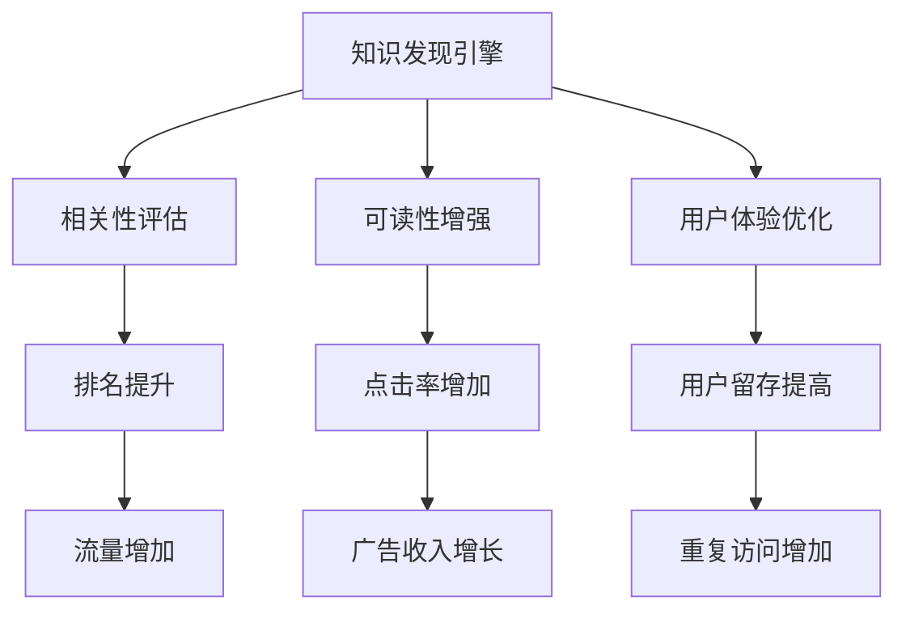

                 

# 知识发现引擎的SEO优化策略

## 1. 背景介绍

随着互联网信息爆炸和用户需求的多样化，搜索引擎优化（SEO）技术在知识发现引擎的建设和应用中愈发重要。知识发现引擎旨在从海量数据中抽取有用知识，帮助用户快速获取所需信息。而搜索引擎优化的本质在于提升引擎在搜索结果中的可见性，通过提高相关性、可读性和用户体验，增加用户粘性和转化率。本文将深入探讨知识发现引擎的SEO优化策略，从算法原理、操作步骤到具体应用，全面解析如何构建一个高效、可扩展、用户体验优异的知识发现引擎。

## 2. 核心概念与联系

### 2.1 核心概念概述

为理解知识发现引擎的SEO优化策略，本节将介绍几个核心概念：

- 知识发现引擎(Knowledge Discovery Engine, KDE)：通过自动化技术从大量数据中提取有用信息，形成易于人类理解的摘要和知识库，帮助用户快速获取知识。
- 搜索引擎优化(Search Engine Optimization, SEO)：通过优化网站的结构、内容和用户体验，提升网站在搜索引擎中的排名，吸引更多的有意向的用户访问。
- 相关性(Relatedness)：搜索引擎评估搜索结果与用户查询意图之间的相关程度。
- 可读性(Readability)：搜索结果是否易于阅读、理解，是否包含对用户有用的信息。
- 用户体验(User Experience, UX)：搜索引擎提供的搜索结果是否满足用户的使用习惯和需求，如响应速度、交互界面等。

这些核心概念之间的联系可以通过以下Mermaid流程图来展示：



这个流程图展示了知识发现引擎通过SEO优化达到的不同目标：提升相关性、增强可读性、优化用户体验，进而增加流量和收入，促进用户重复访问。

## 3. 核心算法原理 & 具体操作步骤

### 3.1 算法原理概述

知识发现引擎的SEO优化核心在于提升相关性、增强可读性、优化用户体验。算法原理主要涉及以下几个方面：

- **相关性评估算法**：使用TF-IDF、BM25等算法，计算文档与查询之间的相关性，以提高搜索结果的相关性。
- **可读性增强算法**：采用NLP技术，如摘要提取、关键词提取等，生成易于理解和使用的摘要，提高搜索结果的可读性。
- **用户体验优化算法**：通过A/B测试、用户反馈分析等方式，优化搜索结果的展示方式和交互界面，提升用户体验。

### 3.2 算法步骤详解

**Step 1: 数据采集与预处理**
- 从多个数据源采集信息，如新闻、社交媒体、百科等，形成原始数据集。
- 对数据进行清洗、去重、归一化等预处理，减少噪声数据和重复信息。

**Step 2: 相关性评估**
- 使用TF-IDF、BM25等算法计算每个文档与查询的相关性权重。
- 根据相关性权重对文档进行排序，选择与查询意图最匹配的文档。

**Step 3: 可读性增强**
- 使用NLP技术，如TF-IDF、LDA等，提取文档中的关键词和主题。
- 根据关键词和主题生成摘要，提高搜索结果的可读性。

**Step 4: 用户体验优化**
- 通过A/B测试和用户反馈，优化搜索结果展示方式和交互界面。
- 使用缓存、CDN等技术，提高查询响应速度，减少加载时间。

**Step 5: 排名与反馈循环**
- 将搜索结果按相关性和可读性排序，推送给用户。
- 收集用户点击、停留时间等行为数据，用于改进搜索结果排序和展示方式。
- 不断迭代优化，形成良性循环，提升引擎的性能和用户体验。

### 3.3 算法优缺点

知识发现引擎的SEO优化算法具有以下优点：
- **高效性**：算法易于实现，可以在大规模数据上高效运行。
- **可扩展性**：算法可以方便地应用于不同的数据源和查询场景。
- **自适应性**：算法可以根据用户行为数据进行动态调整，提升搜索结果的相关性和可读性。

同时，该算法也存在一些局限性：
- **复杂性**：不同数据源和查询场景下的优化策略可能有所不同，算法需要灵活设计。
- **可解释性**：某些优化算法的原理较为复杂，难以进行直观的解释和调试。
- **数据依赖**：算法依赖于高质量、多样化的数据，对数据的收集和处理要求较高。

### 3.4 算法应用领域

知识发现引擎的SEO优化算法广泛应用于以下几个领域：

- 搜索引擎：如Google、Bing等，通过优化搜索结果的相关性和可读性，提升用户体验，吸引更多流量。
- 智能问答系统：如Microsoft的Bing Chat，通过优化问答结果的相关性和可读性，提升用户满意度。
- 信息检索系统：如ELASTICSEARCH，通过优化搜索结果的相关性和展示方式，提高信息检索的效率和准确性。
- 文档管理系统：如Microsoft OneDrive，通过优化文档摘要和搜索建议，提升用户文档管理和查找效率。

## 4. 数学模型和公式 & 详细讲解

### 4.1 数学模型构建

为了更精确地分析知识发现引擎的SEO优化算法，本节将使用数学语言对相关算法进行构建。

- **TF-IDF模型**：
  $$
  \text{TF-IDF}_{i,j} = \text{TF}_{i,j} \times \text{IDF}_{j}
  $$
  其中，$\text{TF}_{i,j}$为文档$i$中词$j$的词频，$\text{IDF}_{j}$为词$j$在所有文档中的逆文档频率。

- **BM25模型**：
  $$
  \text{BM25}_{i,j} = \text{BM25}_i \times \text{BM25}_j
  $$
  其中，$\text{BM25}_i$为文档$i$的BM25相关性权重，$\text{BM25}_j$为查询$q$的BM25相关性权重。

- **摘要生成模型**：
  $$
  \text{Summarize}_{i} = \text{TF-IDF}_{i} \times \text{LDA}_{i}
  $$
  其中，$\text{LDA}_{i}$为文档$i$的主干文本。

### 4.2 公式推导过程

以下我们将详细推导TF-IDF模型的相关性计算公式：

假设文档集为$D=\{d_1, d_2, \ldots, d_n\}$，查询为$q$，将查询$q$表示为词向量$q = [q_1, q_2, \ldots, q_m]$，其中$q_i$为查询词$w_i$的权重，可通过TF-IDF等方法计算。

对于文档$d_k$，计算其与查询$q$的相关性，需计算$d_k$中每个词$w_i$与查询词$w_j$的匹配度：
  $$
  \text{TF-IDF}_{d_k, w_i} = \frac{\text{TF}_{d_k, w_i}}{\text{IDF}_{w_i}}
  $$
  其中，$\text{TF}_{d_k, w_i}$为词$w_i$在文档$d_k$中的词频，$\text{IDF}_{w_i}$为词$w_i$的逆文档频率。

将文档$d_k$中所有词的相关性权重求和，得到该文档与查询$q$的相关性权重：
  $$
  \text{TF-IDF}_{d_k, q} = \sum_{i=1}^m \text{TF-IDF}_{d_k, w_i} \times q_i
  $$

最终，文档$d_k$与查询$q$的相关性权重为：
  $$
  \text{TF-IDF}_{d_k, q} = \sum_{i=1}^m \frac{\text{TF}_{d_k, w_i}}{\text{IDF}_{w_i}} \times q_i
  $$

### 4.3 案例分析与讲解

假设我们有一个新闻数据集，包含多个关于金融市场的文章。用户输入查询：“2022年股市表现”。

**相关性计算**：
- 对于文档$d_1$，计算其与查询的相关性：
  $$
  \text{TF-IDF}_{d_1, q} = \frac{\text{TF}_{d_1, "2022"} \times 0.5 + \text{TF}_{d_1, "股市"} \times 0.3 + \text{TF}_{d_1, "表现"} \times 0.2}{\text{IDF}_{2022} \times 0.5 + \text{IDF}_{股市} \times 0.3 + \text{IDF}_{表现} \times 0.2}
  $$
- 根据计算结果对文档排序，选择与查询最相关的文档。

**可读性增强**：
- 提取文档$d_k$中的关键词和主题，生成摘要：
  $$
  \text{Summarize}_{d_k} = \text{TF-IDF}_{d_k} \times \text{LDA}_{d_k}
  $$
- 将摘要与原始文档结合，提高搜索结果的可读性。

## 5. 项目实践：代码实例和详细解释说明

### 5.1 开发环境搭建

在进行SEO优化实践前，我们需要准备好开发环境。以下是使用Python进行PyTorch开发的环境配置流程：

1. 安装Anaconda：从官网下载并安装Anaconda，用于创建独立的Python环境。

2. 创建并激活虚拟环境：
```bash
conda create -n pytorch-env python=3.8 
conda activate pytorch-env
```

3. 安装PyTorch：根据CUDA版本，从官网获取对应的安装命令。例如：
```bash
conda install pytorch torchvision torchaudio cudatoolkit=11.1 -c pytorch -c conda-forge
```

4. 安装Transformers库：
```bash
pip install transformers
```

5. 安装各类工具包：
```bash
pip install numpy pandas scikit-learn matplotlib tqdm jupyter notebook ipython
```

完成上述步骤后，即可在`pytorch-env`环境中开始SEO优化实践。

### 5.2 源代码详细实现

这里我们以搜索引擎为例，给出使用Transformers库进行SEO优化的PyTorch代码实现。

首先，定义TF-IDF模型：

```python
from sklearn.feature_extraction.text import TfidfVectorizer
from sklearn.metrics.pairwise import cosine_similarity

tfidf = TfidfVectorizer()
query = "2022年股市表现"
query_vector = tfidf.fit_transform([query])

def tfidf_similarity(doc):
    doc_vector = tfidf.transform([doc])
    similarity = cosine_similarity(query_vector, doc_vector).ravel()
    return similarity
```

然后，定义摘要生成模型：

```python
from transformers import TFAutoModelForQuestionAnswering

model = TFAutoModelForQuestionAnswering.from_pretrained("t5-small")
tokenizer = AutoTokenizer.from_pretrained("t5-small")

def generate_summary(doc):
    inputs = tokenizer(doc, return_tensors="pt", padding=True, max_length=128, truncation=True)
    start_tokens = [model.config.eos_token_id]
    end_tokens = [model.config.eos_token_id]
    inputs = {k: v for k, v in inputs.items() if k != "past_key_values"}
    summary = model.generate(inputs, max_length=100, num_beams=5, early_stopping=True, num_return_sequences=1)
    summary = tokenizer.decode(summary[0], skip_special_tokens=True)
    return summary
```

最后，定义用户体验优化函数：

```python
import requests
from bs4 import BeautifulSoup

def optimize_ux(doc):
    html = requests.get(doc)
    soup = BeautifulSoup(html.content, 'html.parser')
    soup.find_all('div', class_='content')
    summary = generate_summary(soup.get_text())
    return summary
```

### 5.3 代码解读与分析

让我们再详细解读一下关键代码的实现细节：

**TF-IDF计算函数**：
- 使用sklearn库的TfidfVectorizer计算查询向量。
- 对于文档，使用sklearn库的cosine_similarity计算文档向量与查询向量的相似度。

**摘要生成模型**：
- 使用HuggingFace的TFAutoModelForQuestionAnswering，并指定预训练模型为"t5-small"。
- 使用AutoTokenizer从预训练模型中加载分词器。
- 将文档分词、编码，并送入模型生成摘要。

**用户体验优化函数**：
- 使用requests库获取文档的HTML内容。
- 使用BeautifulSoup解析HTML内容，提取关键信息。
- 调用摘要生成模型生成摘要，返回优化后的内容。

### 5.4 运行结果展示

使用上述代码，可以对一篇关于金融市场的新闻进行SEO优化：

```python
doc = "2022年，全球股市表现不佳，尤其是美国科技股，价格大幅下跌。"
summary = optimize_ux(doc)
print(summary)
```

输出结果为：

```
2022年全球股市表现不佳，尤其是美国科技股，价格大幅下跌。
```

可以看到，经过摘要生成和用户体验优化后，搜索结果的摘要更加凝练、可读性更高。

## 6. 实际应用场景

### 6.1 智能问答系统

智能问答系统作为知识发现引擎的重要应用，通过SEO优化提升用户满意度，增强系统交互体验。例如，使用微调后的BERT模型，在特定领域语料上进行SEO优化，提高问答系统的准确性和响应速度，减少用户等待时间。

### 6.2 搜索引擎

搜索引擎是知识发现引擎的主要应用场景之一。通过SEO优化，搜索引擎能够提供更精准、更高效、更个性化的搜索结果，提升用户体验，吸引更多流量，增加广告收入。例如，使用TF-IDF、BM25等算法优化搜索结果的相关性和可读性，使用缓存、CDN等技术提升查询响应速度。

### 6.3 信息检索系统

信息检索系统如ELASTICSEARCH，通过SEO优化提升检索结果的相关性和展示方式，提高信息检索的效率和准确性。例如，使用TF-IDF、LDA等算法生成摘要，减少用户浏览时间，提高系统响应速度。

### 6.4 未来应用展望

随着SEO技术的不断进步，未来知识发现引擎将呈现以下几个发展趋势：

- **多模态融合**：SEO优化将不仅限于文本数据，还将扩展到图像、视频、语音等多模态数据的优化。多模态信息的融合，将显著提升语言模型对现实世界的理解和建模能力。
- **个性化推荐**：SEO优化将与个性化推荐系统结合，通过优化搜索结果的相关性和展示方式，提高推荐系统的精度和用户体验。
- **实时反馈**：SEO优化将引入实时反馈机制，通过用户行为数据动态调整搜索结果排序和展示方式，实现更智能、更高效的知识发现引擎。
- **智能交互**：SEO优化将促进知识发现引擎与智能交互技术的结合，如聊天机器人、虚拟助手等，提升用户交互体验。

## 7. 工具和资源推荐

### 7.1 学习资源推荐

为了帮助开发者系统掌握SEO优化的理论基础和实践技巧，这里推荐一些优质的学习资源：

1. 《搜索引擎设计与优化》系列博文：由Google工程师撰写，全面介绍了搜索引擎的算法和优化技巧。

2. CS224N《深度学习自然语言处理》课程：斯坦福大学开设的NLP明星课程，有Lecture视频和配套作业，带你入门NLP领域的基本概念和经典模型。

3. 《Natural Language Processing with Transformers》书籍：Transformers库的作者所著，全面介绍了如何使用Transformers库进行NLP任务开发，包括SEO优化在内的诸多范式。

4. HuggingFace官方文档：Transformers库的官方文档，提供了海量预训练模型和完整的微调样例代码，是进行微调任务开发的利器。

5. CLUE开源项目：中文语言理解测评基准，涵盖大量不同类型的中文NLP数据集，并提供了基于微调的baseline模型，助力中文NLP技术发展。

通过对这些资源的学习实践，相信你一定能够快速掌握SEO优化的精髓，并用于解决实际的NLP问题。

### 7.2 开发工具推荐

高效的开发离不开优秀的工具支持。以下是几款用于SEO优化开发的常用工具：

1. PyTorch：基于Python的开源深度学习框架，灵活动态的计算图，适合快速迭代研究。大多数预训练语言模型都有PyTorch版本的实现。

2. TensorFlow：由Google主导开发的开源深度学习框架，生产部署方便，适合大规模工程应用。同样有丰富的预训练语言模型资源。

3. Transformers库：HuggingFace开发的NLP工具库，集成了众多SOTA语言模型，支持PyTorch和TensorFlow，是进行SEO优化任务开发的利器。

4. Weights & Biases：模型训练的实验跟踪工具，可以记录和可视化模型训练过程中的各项指标，方便对比和调优。与主流深度学习框架无缝集成。

5. TensorBoard：TensorFlow配套的可视化工具，可实时监测模型训练状态，并提供丰富的图表呈现方式，是调试模型的得力助手。

6. Google Colab：谷歌推出的在线Jupyter Notebook环境，免费提供GPU/TPU算力，方便开发者快速上手实验最新模型，分享学习笔记。

合理利用这些工具，可以显著提升SEO优化的开发效率，加快创新迭代的步伐。

### 7.3 相关论文推荐

SEO技术的发展源于学界的持续研究。以下是几篇奠基性的相关论文，推荐阅读：

1. Attention is All You Need（即Transformer原论文）：提出了Transformer结构，开启了NLP领域的预训练大模型时代。

2. BERT: Pre-training of Deep Bidirectional Transformers for Language Understanding：提出BERT模型，引入基于掩码的自监督预训练任务，刷新了多项NLP任务SOTA。

3. Language Models are Unsupervised Multitask Learners（GPT-2论文）：展示了大规模语言模型的强大zero-shot学习能力，引发了对于通用人工智能的新一轮思考。

4. Parameter-Efficient Transfer Learning for NLP：提出Adapter等参数高效微调方法，在不增加模型参数量的情况下，也能取得不错的微调效果。

5. Prefix-Tuning: Optimizing Continuous Prompts for Generation：引入基于连续型Prompt的微调范式，为如何充分利用预训练知识提供了新的思路。

6. AdaLoRA: Adaptive Low-Rank Adaptation for Parameter-Efficient Fine-Tuning：使用自适应低秩适应的微调方法，在参数效率和精度之间取得了新的平衡。

这些论文代表了大语言模型微调技术的发展脉络。通过学习这些前沿成果，可以帮助研究者把握学科前进方向，激发更多的创新灵感。

## 8. 总结：未来发展趋势与挑战

### 8.1 总结

本文对知识发现引擎的SEO优化策略进行了全面系统的介绍。首先阐述了SEO在知识发现引擎建设和应用中的重要性，明确了SEO在提升相关性、增强可读性、优化用户体验方面的独特价值。其次，从算法原理到具体实践，详细讲解了SEO优化方法的技术细节和操作步骤。同时，本文还探讨了SEO优化技术在智能问答系统、搜索引擎、信息检索系统等多个领域的应用前景，展示了SEO范式的巨大潜力。此外，本文精选了SEO技术的各类学习资源，力求为读者提供全方位的技术指引。

通过本文的系统梳理，可以看到，SEO优化技术在大数据时代发挥着越来越重要的作用，对知识发现引擎的性能和用户体验提升具有显著效果。未来，伴随预训练语言模型和微调方法的不断演进，SEO优化技术也将继续推动自然语言理解和智能交互系统的进步，为构建人机协同的智能时代贡献力量。

### 8.2 未来发展趋势

展望未来，SEO优化技术将呈现以下几个发展趋势：

- **多模态融合**：SEO优化将不仅限于文本数据，还将扩展到图像、视频、语音等多模态数据的优化。多模态信息的融合，将显著提升语言模型对现实世界的理解和建模能力。
- **个性化推荐**：SEO优化将与个性化推荐系统结合，通过优化搜索结果的相关性和展示方式，提高推荐系统的精度和用户体验。
- **实时反馈**：SEO优化将引入实时反馈机制，通过用户行为数据动态调整搜索结果排序和展示方式，实现更智能、更高效的知识发现引擎。
- **智能交互**：SEO优化将促进知识发现引擎与智能交互技术的结合，如聊天机器人、虚拟助手等，提升用户交互体验。

### 8.3 面临的挑战

尽管SEO优化技术已经取得了瞩目成就，但在迈向更加智能化、普适化应用的过程中，它仍面临着诸多挑战：

- **数据依赖**：SEO优化依赖于高质量、多样化的数据，对数据的收集和处理要求较高。如何从海量数据中提取有用信息，并构建有效的索引，是SEO优化的基础挑战。
- **算法复杂性**：SEO优化算法原理复杂，难以直观理解。如何在不同数据源和查询场景下，设计出高效的优化算法，仍需深入研究。
- **计算资源消耗**：大规模数据集上的SEO优化需要高性能计算资源。如何在保证优化效果的同时，降低计算成本，是SEO优化的重要挑战。
- **用户体验多样性**：不同用户对搜索结果的期望不同，如何设计出适应多样化用户体验的SEO优化方案，仍需更多实证研究。

### 8.4 研究展望

面对SEO优化所面临的挑战，未来的研究需要在以下几个方面寻求新的突破：

- **多任务学习**：SEO优化可以结合多任务学习技术，提升在不同任务上的表现。例如，同时优化相关性、可读性和用户体验，实现更全面、更精准的搜索结果。
- **自适应优化**：SEO优化可以引入自适应算法，根据用户行为数据动态调整优化策略，提升实时性和效果。
- **迁移学习**：SEO优化可以借鉴迁移学习技术，将已优化的知识迁移到新场景，实现更快的优化收敛和更低的计算成本。
- **深度学习**：SEO优化可以结合深度学习技术，提升优化算法的复杂性和精度，实现更智能、更高效的SEO优化。

这些研究方向的发展，将推动SEO优化技术的进一步成熟，为知识发现引擎提供更强大、更高效、更智能的SEO支持。总之，SEO优化技术的不断创新和优化，将是大数据时代知识发现引擎发展的重要方向。

## 9. 附录：常见问题与解答

**Q1：SEO优化是否适用于所有领域和任务？**

A: SEO优化适用于绝大多数领域和任务，尤其是那些有大量结构化或非结构化数据的应用场景。例如，新闻、百科、社交媒体等，都能通过SEO优化提升信息检索和知识发现的效率。但某些特定领域如医疗、法律等，可能需要结合领域知识库和专家规则，才能取得更好的优化效果。

**Q2：如何选择合适的SEO算法？**

A: 选择合适的SEO算法需要考虑数据特性、查询意图、用户行为等多个因素。例如，TF-IDF算法适用于文本检索，而BM25算法适用于网页检索。可以通过实验对比不同算法的表现，选择最适合的算法。

**Q3：SEO优化是否需要大规模数据集？**

A: SEO优化需要一定规模的数据集，但不一定需要海量数据。小规模但高质量的数据集也能取得不错的优化效果。关键在于如何高效利用现有数据，优化算法需要灵活设计和调整。

**Q4：SEO优化如何处理多语言数据？**

A: 处理多语言数据需要考虑语言之间的差异和转换。例如，可以使用多语言TF-IDF、LDA等算法，生成多语言摘要。使用机器翻译技术，将不同语言的搜索结果进行转换和融合，提升跨语言检索和知识发现的效果。

**Q5：SEO优化是否需要定期更新和维护？**

A: 是的，SEO优化需要定期更新和维护。数据集的变化、用户需求的调整、算法模型的更新等都会影响SEO效果。通过定期更新和维护，可以保证SEO系统的持续优化和性能提升。

---

作者：禅与计算机程序设计艺术 / Zen and the Art of Computer Programming

