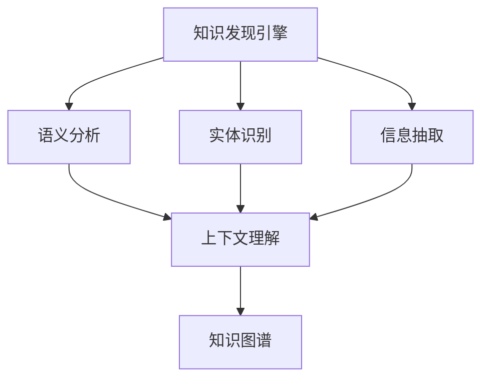

                 

# 知识发现引擎的自然语言处理应用

> 关键词：知识发现引擎, 自然语言处理, 语义分析, 实体识别, 信息抽取, 知识图谱, 上下文理解, 人工智能, 数据挖掘

## 1. 背景介绍

### 1.1 问题由来

随着大数据时代的到来，数据量的激增带来了知识的迅速积累。如何在海量的数据中快速发现和提取有价值的知识，成为了当前知识工程领域的重要课题。知识发现引擎(Knowledge Discovery Engine, KDE)作为数据挖掘技术的重要组成部分，旨在从大规模数据集中挖掘出隐含的知识、规律和关系，提供智能化的知识服务。

在KDE的构建和应用过程中，自然语言处理(Natural Language Processing, NLP)技术扮演着关键角色。传统的基于规则或手工提取的KDE方法已经难以适应复杂多变的语言数据。而自然语言处理技术，尤其是语义分析、实体识别、信息抽取等子领域，可以自动理解和处理自然语言数据，从大规模文本数据中挖掘出隐含的知识和关系，为KDE的构建提供了强有力的支持。

### 1.2 问题核心关键点

知识发现引擎的构建主要依赖于两个核心步骤：
1. 知识抽取(Information Extraction, IE)：从文本中自动抽取实体、关系等结构化信息，形成知识单元。
2. 知识整合(Knowledge Integration, KI)：将抽取的知识单元整合到知识图谱(Knowledge Graph)中，形成整体的知识体系。

NLP技术在这两个步骤中均有广泛应用：
- 在知识抽取阶段，NLP可以自动识别文本中的实体、关系和属性，构建知识单元，生成知识库。
- 在知识整合阶段，NLP可以通过上下文理解、实体消歧等技术，提高知识单元的准确性和完整性，构建更合理、一致的知识图谱。

## 2. 核心概念与联系

### 2.1 核心概念概述

为更好地理解NLP在知识发现引擎中的应用，本节将介绍几个关键概念：

- 知识发现引擎(KDE)：通过数据挖掘技术，自动从大规模数据中发现和提取知识、规律和关系，提供智能化的知识服务。
- 自然语言处理(NLP)：使用计算机科学和人工智能技术，自动处理和理解自然语言数据，支持语义分析、实体识别、信息抽取等子领域。
- 语义分析(Semantic Analysis)：通过词汇、语法和语境，理解文本的意义和语义关系，支持问答、文本分类等任务。
- 实体识别(Entity Recognition)：识别文本中的命名实体，如人名、地名、机构名等，支持实体抽取、关系识别等任务。
- 信息抽取(Information Extraction, IE)：从文本中自动抽取实体、关系等结构化信息，构建知识库。
- 知识图谱(Knowledge Graph)：将知识单元组织成结构化的图形，表示实体和关系之间的网络，支持知识推理、查询等应用。

这些概念之间的逻辑关系可以通过以下Mermaid流程图来展示：



这个流程图展示出NLP在KDE构建中的核心作用：

1. 知识发现引擎从文本数据中自动抽取和整合知识。
2. 语义分析和实体识别是知识抽取的两个主要任务。
3. 信息抽取将抽取的知识单元整合到知识图谱中。
4. 上下文理解进一步提高抽取和整合的质量。

## 3. 核心算法原理 & 具体操作步骤
### 3.1 算法原理概述

知识发现引擎的自然语言处理应用主要分为知识抽取和知识整合两个步骤。以下分别介绍这两个步骤的算法原理。

### 3.2 算法步骤详解

#### 3.2.1 知识抽取

知识抽取的算法步骤主要包括以下几个步骤：

1. 文本预处理：包括分词、去停用词、词性标注等。
2. 实体识别：识别文本中的命名实体，如人名、地名、机构名等。
3. 关系抽取：从文本中抽取实体之间的语义关系，如主谓宾结构。
4. 属性抽取：从文本中抽取实体的属性，如日期、地点等。
5. 知识单元生成：将抽取的实体、关系和属性整合成知识单元，生成知识库。

#### 3.2.2 知识整合

知识整合的算法步骤主要包括以下几个步骤：

1. 知识库构建：将抽取的知识单元整合到知识图谱中，形成整体的知识体系。
2. 实体消歧：在知识图谱中消除同名的实体，确保实体的唯一性。
3. 知识推理：通过逻辑推理规则，进一步推导出新的知识和关系。
4. 知识更新：定期更新知识图谱，确保知识的准确性和时效性。

### 3.3 算法优缺点

知识发现引擎的自然语言处理应用具有以下优点：

1. 自动化程度高：NLP技术能够自动处理和理解自然语言数据，提高知识抽取和整合的效率。
2. 适用范围广：适用于多种语言和领域的知识发现任务，如医疗、金融、电商等。
3. 可扩展性强：随着NLP技术的不断进步，知识抽取和整合的精度和质量会不断提升。

同时，该方法也存在一定的局限性：

1. 依赖数据质量：知识抽取和整合的效果很大程度上取决于数据的质量，如数据噪声、实体命名不规范等。
2. 需要大量标注数据：部分任务如实体识别和关系抽取，需要大量的标注数据进行训练和优化。
3. 复杂度高：知识图谱的构建和更新是一个复杂的过程，需要综合考虑实体、关系和属性的准确性和一致性。
4. 模型可解释性差：深度学习模型在处理复杂语义时往往缺乏可解释性，难以解释模型的推理过程。

尽管存在这些局限性，但NLP技术在知识发现引擎中的应用已经成为当前研究的热点，其高效性和广泛适用性得到了广泛认可。

### 3.4 算法应用领域

知识发现引擎的自然语言处理应用在多个领域都有广泛应用，例如：

1. 医疗领域：通过自然语言处理技术，自动提取病历记录、医学文献中的实体和关系，构建医疗知识图谱，辅助临床决策和研究。
2. 金融领域：从新闻、报告中抽取金融数据，构建金融知识图谱，支持风险评估、投资分析等应用。
3. 电商领域：从产品描述、用户评论中抽取实体和关系，构建电商知识图谱，提供智能推荐和产品分析。
4. 社交媒体：从微博、论坛中抽取实体和关系，构建社交知识图谱，支持舆情分析、热点事件挖掘等应用。
5. 法律领域：从法律文档、案例中抽取实体和关系，构建法律知识图谱，支持法律研究、智能辅助等应用。

这些应用场景展示了NLP技术在知识发现引擎中的强大潜力，能够从多模态数据中挖掘出有价值的知识，为各个领域提供智能化的知识服务。

## 4. 数学模型和公式 & 详细讲解 & 举例说明

### 4.1 数学模型构建

知识发现引擎的自然语言处理应用涉及多种数学模型，以下以信息抽取(IE)为例进行详细讲解。

#### 4.1.1 实体识别模型

实体识别模型一般采用序列标注方法，将文本中的每个单词标注为实体、非实体或其他类别。常见的实体识别模型包括：

- 基于规则的方法：通过定义实体规则，手动编写正则表达式或词典，识别文本中的实体。
- 基于统计的方法：通过训练统计模型，如CRF、HMM等，自动学习实体标注规则。
- 基于深度学习的方法：通过训练神经网络模型，如BiLSTM-CRF、BERT等，自动学习实体标注规则。

#### 4.1.2 关系抽取模型

关系抽取模型一般采用基于图结构的方法，将实体和关系表示成图节点和边，通过图结构学习方法抽取关系。常见的关系抽取模型包括：

- 基于模板的方法：通过定义抽取模板，自动抽取文本中的关系。
- 基于规则的方法：通过定义规则，手动编写抽取规则，识别实体之间的关系。
- 基于深度学习的方法：通过训练神经网络模型，如CNN、RNN、Transformer等，自动学习实体之间的关系。

#### 4.1.3 知识库生成模型

知识库生成模型一般采用基于知识图谱的方法，将抽取的实体和关系组织成图结构，生成知识库。常见的知识库生成模型包括：

- 基于图结构的方法：通过定义图结构，自动构建知识图谱。
- 基于符号推理的方法：通过符号推理规则，自动推导出新的关系和实体。
- 基于知识图谱演化的模型：通过知识图谱的演化算法，自动更新和扩展知识图谱。

### 4.2 公式推导过程

#### 4.2.1 实体识别模型的公式推导

实体识别模型一般采用序列标注方法，其基本公式为：

$$
P(y_i|x) = \frac{P(y_i|x, y_{i-1})P(y_{i-1}|x)}{P(y_{i-1}|x)}
$$

其中 $y_i$ 表示第 $i$ 个单词的实体标注，$x$ 表示文本序列，$P(y_i|x)$ 表示给定文本 $x$ 的情况下，单词 $i$ 被标注为 $y_i$ 的概率。

#### 4.2.2 关系抽取模型的公式推导

关系抽取模型一般采用基于图结构的方法，其基本公式为：

$$
P(r|e_1, e_2) = \frac{P(r|e_1, e_2, r')P(r'|e_1, e_2)}{\sum_{r'}P(r'|e_1, e_2)}
$$

其中 $r$ 表示实体之间的关系，$e_1$ 和 $e_2$ 表示关系涉及的两个实体，$r'$ 表示候选关系，$P(r|e_1, e_2)$ 表示给定实体 $e_1$ 和 $e_2$ 的情况下，关系 $r$ 成立的概率。

#### 4.2.3 知识库生成模型的公式推导

知识库生成模型一般采用基于知识图谱的方法，其基本公式为：

$$
P(G|D) = \frac{P(D|G)P(G)}{P(D)}
$$

其中 $G$ 表示知识图谱，$D$ 表示数据集，$P(D|G)$ 表示给定知识图谱 $G$ 的情况下，数据集 $D$ 成立的概率，$P(G)$ 表示知识图谱 $G$ 的概率。

### 4.3 案例分析与讲解

#### 4.3.1 医疗知识图谱

在医疗领域，自然语言处理技术可以从病历记录、医学文献中自动抽取实体和关系，构建医疗知识图谱。以下以乳腺癌诊断为例，展示NLP在知识发现引擎中的应用：

1. 实体识别：从病历记录中识别出患者信息、病理特征、诊断结果等实体。
2. 关系抽取：抽取实体之间的关系，如诊断结果和病理特征之间的关系。
3. 知识库生成：将抽取的实体和关系组织成知识图谱，支持智能辅助诊断和知识查询。

#### 4.3.2 金融知识图谱

在金融领域，自然语言处理技术可以从新闻、报告中抽取金融数据，构建金融知识图谱。以下以股票投资分析为例，展示NLP在知识发现引擎中的应用：

1. 实体识别：从新闻报道中识别出股票名称、公司名称、财务数据等实体。
2. 关系抽取：抽取实体之间的关系，如股票与公司之间的关系，公司与财务数据之间的关系。
3. 知识库生成：将抽取的实体和关系组织成知识图谱，支持风险评估、投资分析等应用。

## 5. 项目实践：代码实例和详细解释说明
### 5.1 开发环境搭建

在进行项目实践前，我们需要准备好开发环境。以下是使用Python进行PyTorch开发的环境配置流程：

1. 安装Anaconda：从官网下载并安装Anaconda，用于创建独立的Python环境。

2. 创建并激活虚拟环境：
```bash
conda create -n pytorch-env python=3.8 
conda activate pytorch-env
```

3. 安装PyTorch：根据CUDA版本，从官网获取对应的安装命令。例如：
```bash
conda install pytorch torchvision torchaudio cudatoolkit=11.1 -c pytorch -c conda-forge
```

4. 安装相关依赖包：
```bash
pip install torchtext spacy
```

完成上述步骤后，即可在`pytorch-env`环境中开始项目实践。

### 5.2 源代码详细实现

以下是一个简单的实体识别模型的代码实现，以BERT为基础，采用序列标注方法：

```python
import torch
import torch.nn as nn
import torchtext
import torchtext.data as dt
from transformers import BertForTokenClassification, BertTokenizer

# 加载预训练模型和分词器
model = BertForTokenClassification.from_pretrained('bert-base-cased', num_labels=3)
tokenizer = BertTokenizer.from_pretrained('bert-base-cased')

# 定义数据集和标签映射
train_data, test_data = dt.TextClassificationDataset.splits(
    train='texts.txt', test='texts_test.txt', text_field=dt.Field(tokenize='spacy'),
    label_field=dt.Field(tokenize=None, labels=['B-PER', 'I-PER', 'O'], bos_token=None, eos_token=None)
)
train_iterator, test_iterator = dt.BucketIterator.splits(
    (train_data, test_data), 
    batch_size=8,
    device=torch.device('cuda') if torch.cuda.is_available() else torch.device('cpu')
)

# 定义模型和优化器
optimizer = torch.optim.Adam(model.parameters(), lr=2e-5)
criterion = nn.CrossEntropyLoss()

# 训练模型
model.train()
for epoch in range(10):
    for batch in train_iterator:
        optimizer.zero_grad()
        texts, labels = batch.text, batch.label
        outputs = model(texts)
        loss = criterion(outputs, labels)
        loss.backward()
        optimizer.step()
        if (epoch+1) % 2 == 0:
            print(f'Epoch {epoch+1}, loss: {loss.item()}')

# 测试模型
model.eval()
with torch.no_grad():
    correct = 0
    total = 0
    for batch in test_iterator:
        texts, labels = batch.text, batch.label
        outputs = model(texts)
        _, predicted = torch.max(outputs.data, 1)
        total += labels.size(0)
        correct += (predicted == labels).sum().item()
    print(f'Accuracy: {100 * correct / total:.2f}%')
```

### 5.3 代码解读与分析

#### 5.3.1 数据集定义

在上述代码中，我们首先定义了训练集和测试集的文本数据，使用`torchtext`库将其封装成`TextClassificationDataset`类型的数据集。定义了文本字段和标签字段，使用`spacy`分词器对文本进行分词，并将标签映射为`B-PER`、`I-PER`和`O`三种类型，分别表示人名实体、人名实体内部和非实体。

#### 5.3.2 模型定义

使用`BertForTokenClassification`模型作为实体识别模型，加载预训练的BERT模型，设置标签数量为3，表示人名实体、人名实体内部和非实体。在训练过程中，将模型设置为训练模式，并在测试过程中设置为评估模式。

#### 5.3.3 训练和测试

在训练过程中，使用`Adam`优化器更新模型参数，使用交叉熵损失函数计算损失。在每个epoch结束时，打印训练损失，并在每隔一个epoch输出测试精度。

通过上述代码实例，我们可以看出，使用自然语言处理技术进行实体识别是可行的，且能够在训练过程中逐步提高模型精度。

## 6. 实际应用场景

### 6.1 智能医疗

在智能医疗领域，自然语言处理技术可以自动提取病历记录、医学文献中的实体和关系，构建医疗知识图谱。以下是一个简单的医疗知识图谱构建案例：

1. 病历记录抽取：从病历记录中抽取实体，如患者信息、病理特征、诊断结果等。
2. 实体关系抽取：抽取实体之间的关系，如诊断结果和病理特征之间的关系。
3. 知识图谱构建：将抽取的实体和关系组织成知识图谱，支持智能辅助诊断和知识查询。

#### 6.1.1 示例代码

以下是一个简单的医疗知识图谱构建代码示例：

```python
import spacy
import networkx as nx

# 加载分词器
nlp = spacy.load('en_core_web_sm')

# 定义实体和关系
entities = {'Patient': ['Alice', 'Bob', 'Charlie'], 'Diagnosis': ['Cancer', 'Heart Disease', 'Diabetes'], 'Treatment': ['Surgery', 'Chemotherapy', 'Medication']}
relations = {('Patient', 'HasDiagnosis', 'Diagnosis'): [('Alice', 'Cancer'), ('Bob', 'Heart Disease'), ('Charlie', 'Diabetes')], ('Diagnosis', 'HasTreatment', 'Treatment'): [('Cancer', 'Surgery'), ('Heart Disease', 'Chemotherapy'), ('Diabetes', 'Medication')]}
graph = nx.DiGraph()

# 构建知识图谱
for (s, r, o) in relations:
    graph.add_edge(s, o, label=r)

# 输出知识图谱
print(graph.edges())
```

在上述代码中，我们使用`spacy`分词器定义了实体和关系，然后使用`networkx`库构建知识图谱。通过简单的实体关系抽取和图结构构建，我们可以得到医疗知识图谱的基本结构。

### 6.2 金融分析

在金融领域，自然语言处理技术可以从新闻、报告中抽取金融数据，构建金融知识图谱。以下是一个简单的金融知识图谱构建案例：

1. 新闻报道抽取：从新闻报道中抽取股票名称、公司名称、财务数据等实体。
2. 实体关系抽取：抽取实体之间的关系，如股票与公司之间的关系，公司与财务数据之间的关系。
3. 知识图谱构建：将抽取的实体和关系组织成知识图谱，支持风险评估、投资分析等应用。

#### 6.2.1 示例代码

以下是一个简单的金融知识图谱构建代码示例：

```python
import spacy
import networkx as nx

# 加载分词器
nlp = spacy.load('en_core_web_sm')

# 定义实体和关系
entities = {'Company': ['Apple', 'Microsoft', 'Google'], 'Stock': ['AAPL', 'MSFT', 'GOOG'], 'FinancialData': ['Revenue', 'Profit', 'MarketCap']}
relations = {('Company', 'IssuesStock', 'Stock'): [('Apple', 'AAPL'), ('Microsoft', 'MSFT'), ('Google', 'GOOG')], ('Company', 'HasFinancialData', 'FinancialData'): [('Apple', 'Revenue'), ('Microsoft', 'Profit'), ('Google', 'MarketCap')]}
graph = nx.DiGraph()

# 构建知识图谱
for (s, r, o) in relations:
    graph.add_edge(s, o, label=r)

# 输出知识图谱
print(graph.edges())
```

在上述代码中，我们使用`spacy`分词器定义了实体和关系，然后使用`networkx`库构建知识图谱。通过简单的实体关系抽取和图结构构建，我们可以得到金融知识图谱的基本结构。

## 7. 工具和资源推荐
### 7.1 学习资源推荐

为了帮助开发者系统掌握NLP在知识发现引擎中的应用，这里推荐一些优质的学习资源：

1. 《自然语言处理综论》（Introduction to Natural Language Processing with Python）：由NLP专家撰写，系统讲解了NLP的基本概念和常用技术，包括实体识别、关系抽取等。

2. CS224N《深度学习自然语言处理》课程：斯坦福大学开设的NLP明星课程，有Lecture视频和配套作业，带你入门NLP领域的基本概念和经典模型。

3. 《深度学习与自然语言处理》（Deep Learning and Natural Language Processing）：从深度学习的基础到NLP的高级技术，全面介绍了NLP的最新进展。

4. Kaggle平台：通过参加NLP相关的Kaggle竞赛，可以实践NLP技术，学习最新的NLP应用方法和数据处理技巧。

5. HuggingFace官方文档：提供了丰富的预训练语言模型和NLP库，支持实体识别、关系抽取等任务，是进行NLP实践的必备资料。

通过对这些资源的学习实践，相信你一定能够快速掌握NLP在知识发现引擎中的应用，并用于解决实际的NLP问题。

### 7.2 开发工具推荐

高效的开发离不开优秀的工具支持。以下是几款用于NLP项目开发的常用工具：

1. PyTorch：基于Python的开源深度学习框架，灵活动态的计算图，适合快速迭代研究。

2. TensorFlow：由Google主导开发的开源深度学习框架，生产部署方便，适合大规模工程应用。

3. spaCy：一个开源的Python自然语言处理库，提供了分词、命名实体识别、句法分析等功能，是进行NLP项目开发的利器。

4. NLTK：一个Python自然语言处理库，提供了丰富的NLP工具和语料库，支持文本分类、情感分析等任务。

5. Gensim：一个Python自然语言处理库，提供了主题建模、文本相似度计算等功能，支持知识图谱构建。

6. NetworkX：一个Python网络分析库，支持图结构构建、网络分析等功能，是进行知识图谱构建的工具。

合理利用这些工具，可以显著提升NLP项目的开发效率，加快创新迭代的步伐。

### 7.3 相关论文推荐

NLP技术的发展离不开学界的持续研究。以下是几篇奠基性的相关论文，推荐阅读：

1. Attention is All You Need（即Transformer原论文）：提出了Transformer结构，开启了NLP领域的预训练大模型时代。

2. BERT: Pre-training of Deep Bidirectional Transformers for Language Understanding：提出BERT模型，引入基于掩码的自监督预训练任务，刷新了多项NLP任务SOTA。

3. Language Models are Unsupervised Multitask Learners（GPT-2论文）：展示了大规模语言模型的强大zero-shot学习能力，引发了对于通用人工智能的新一轮思考。

4. NER: Named Entity Recognition with BiLSTM-CRF（BERT论文）：提出BiLSTM-CRF模型，在命名实体识别任务上取得SOTA。

5. Knowledge Graphs: Semantic Networks of Usage and Reasoning（Google知识图谱）：介绍了Google知识图谱的构建方法和应用，展示了知识图谱在实际应用中的强大能力。

这些论文代表了大语言模型在知识发现引擎中的应用的发展脉络。通过学习这些前沿成果，可以帮助研究者把握学科前进方向，激发更多的创新灵感。

## 8. 总结：未来发展趋势与挑战

### 8.1 总结

本文对NLP在知识发现引擎中的应用进行了全面系统的介绍。首先阐述了知识发现引擎和NLP技术的研究背景和意义，明确了NLP技术在知识抽取和整合过程中的关键作用。其次，从原理到实践，详细讲解了NLP技术在知识发现引擎中的应用流程，给出了代码实例和详细解释说明。最后，探讨了NLP技术在实际应用中的前景和面临的挑战，提出了未来的发展方向。

通过本文的系统梳理，可以看到，NLP技术在知识发现引擎中的应用已经成为当前研究的热点，其高效性和广泛适用性得到了广泛认可。未来，NLP技术将结合更多前沿技术，如知识图谱、逻辑推理、符号化表示等，进一步提升知识发现引擎的性能和应用范围。

### 8.2 未来发展趋势

展望未来，NLP技术在知识发现引擎中的应用将呈现以下几个发展趋势：

1. 模型规模持续增大。随着算力成本的下降和数据规模的扩张，预训练语言模型的参数量还将持续增长。超大规模语言模型蕴含的丰富语言知识，有望支撑更加复杂多变的知识抽取和整合任务。

2. 知识抽取和整合精度提升。随着NLP技术的不断进步，知识抽取和整合的精度和质量将不断提升，支持更加精细化、准确化的知识图谱构建。

3. 跨领域知识抽取和整合。知识抽取和整合技术将进一步拓展到不同领域，如医疗、金融、电商等，支持更多领域的知识发现和应用。

4. 多模态知识抽取和整合。NLP技术将结合视觉、听觉等多模态数据，支持更加全面、准确的知识发现和应用。

5. 端到端知识发现引擎。将NLP技术与其他数据挖掘技术结合，构建端到端知识发现引擎，实现从数据采集、预处理、知识抽取到知识整合的全流程自动化。

以上趋势展示了NLP技术在知识发现引擎中的应用前景，未来NLP技术将结合更多前沿技术，进一步拓展知识发现引擎的应用边界，提升知识抽取和整合的精度和质量。

### 8.3 面临的挑战

尽管NLP技术在知识发现引擎中的应用取得了一定进展，但在迈向更加智能化、普适化应用的过程中，仍面临诸多挑战：

1. 数据质量瓶颈。知识抽取和整合的效果很大程度上取决于数据的质量，如数据噪声、实体命名不规范等。如何提高数据质量和标注数据数量，是当前亟待解决的问题。

2. 知识图谱构建复杂度高。知识图谱的构建和更新是一个复杂的过程，需要综合考虑实体、关系和属性的准确性和一致性。如何简化知识图谱构建过程，提高构建效率，是未来研究的重要方向。

3. 可解释性不足。深度学习模型在处理复杂语义时往往缺乏可解释性，难以解释模型的推理过程。如何提高模型的可解释性，增强用户的信任和接受度，是未来研究的重要课题。

4. 资源消耗大。超大规模语言模型和高性能计算资源的需求，使得知识发现引擎的应用成本较高。如何降低计算和存储成本，提高系统效率，是未来研究的重要方向。

5. 跨领域知识抽取和整合难度大。不同领域具有不同的知识结构和方法论，如何构建通用的知识抽取和整合方法，支持跨领域的知识发现，是未来研究的重要方向。

6. 知识抽取和整合的泛化能力不足。NLP模型在面对复杂和模糊的语义时，往往表现不佳。如何提升模型的泛化能力，支持更加复杂和多样化的知识抽取和整合任务，是未来研究的重要方向。

正视这些挑战，积极应对并寻求突破，将使NLP技术在知识发现引擎中的应用更加成熟，为构建安全、可靠、可解释、可控的智能系统铺平道路。

### 8.4 研究展望

面对NLP技术在知识发现引擎中的应用所面临的挑战，未来的研究需要在以下几个方面寻求新的突破：

1. 探索无监督和半监督知识抽取方法。摆脱对大规模标注数据的依赖，利用自监督学习、主动学习等无监督和半监督范式，最大限度利用非结构化数据，实现更加灵活高效的NLP应用。

2. 研究知识图谱构建和演化算法。探索知识图谱的构建和更新算法，简化构建过程，提高构建效率和质量。

3. 融合因果分析和知识推理技术。通过引入因果分析和知识推理技术，增强NLP模型建立稳定因果关系的能力，学习更加普适、鲁棒的语言表征。

4. 结合符号化知识和逻辑推理。将符号化的知识表示与NLP技术结合，引导NLP模型学习更准确、合理的语言模型。

5. 引入多模态数据和信息。将视觉、听觉等多模态数据与文本数据结合，支持更加全面、准确的知识发现和应用。

6. 开发高效可解释的知识发现引擎。开发高效可解释的知识发现引擎，提高系统的可信度和可靠性，支持更多领域的知识发现和应用。

这些研究方向展示了NLP技术在知识发现引擎中的应用前景，相信随着NLP技术的不断进步，知识发现引擎将在更多领域得到应用，为社会带来深远的影响。

## 9. 附录：常见问题与解答

**Q1: 如何提高NLP模型的泛化能力？**

A: 提高NLP模型的泛化能力可以从以下几个方面入手：

1. 增加数据多样性。通过增加训练数据的多样性，使得模型能够学习到更加丰富的语言特征。

2. 引入数据增强技术。通过数据增强技术，如回译、近义替换等，生成更多训练数据，提高模型的泛化能力。

3. 使用预训练模型。通过使用预训练模型，如BERT、GPT等，提高模型的语言表示能力，从而提升模型的泛化能力。

4. 引入多模态数据。将视觉、听觉等多模态数据与文本数据结合，提供更多的语义信息，支持更加全面、准确的知识发现和应用。

5. 融合因果分析和知识推理技术。通过引入因果分析和知识推理技术，增强NLP模型建立稳定因果关系的能力，学习更加普适、鲁棒的语言表征。

**Q2: 如何降低知识发现引擎的计算和存储成本？**

A: 降低知识发现引擎的计算和存储成本可以从以下几个方面入手：

1. 使用高效的模型和算法。选择合适的模型和算法，减少计算和存储的需求，提高系统的效率。

2. 采用分布式计算和存储。通过分布式计算和存储技术，分散计算和存储需求，提高系统的可扩展性。

3. 优化知识图谱的结构。优化知识图谱的结构，减少不必要的节点和边，提高存储效率。

4. 使用模型压缩和稀疏化技术。通过模型压缩和稀疏化技术，减小模型和知识图谱的存储空间，提高系统的效率。

5. 采用知识图谱演化算法。通过知识图谱的演化算法，动态更新和扩展知识图谱，减少静态存储的需求。

6. 引入边缘计算技术。通过引入边缘计算技术，将知识图谱部署在边缘设备上，减少数据传输和存储的需求。

**Q3: 如何提高NLP模型的可解释性？**

A: 提高NLP模型的可解释性可以从以下几个方面入手：

1. 引入可解释性技术。通过引入可解释性技术，如LIME、SHAP等，生成模型的解释，帮助用户理解模型的决策过程。

2. 使用符号化知识和逻辑推理。将符号化的知识表示与NLP技术结合，引导NLP模型学习更准确、合理的语言模型。

3. 引入因果分析和知识推理技术。通过引入因果分析和知识推理技术，增强NLP模型建立稳定因果关系的能力，学习更加普适、鲁棒的语言表征。

4. 开发高效可解释的知识发现引擎。开发高效可解释的知识发现引擎，提高系统的可信度和可靠性，支持更多领域的知识发现和应用。

通过这些方法，可以提高NLP模型的可解释性，增强用户的信任和接受度。

**Q4: 如何构建通用的知识发现引擎？**

A: 构建通用的知识发现引擎可以从以下几个方面入手：

1. 融合多领域知识。将不同领域的知识表示和技术方法融合，构建通用的知识发现引擎。

2. 引入多模态数据和信息。将视觉、听觉等多模态数据与文本数据结合，提供更多的语义信息，支持更加全面、准确的知识发现和应用。

3. 引入因果分析和知识推理技术。通过引入因果分析和知识推理技术，增强NLP模型建立稳定因果关系的能力，学习更加普适、鲁棒的语言表征。

4. 开发高效可解释的知识发现引擎。开发高效可解释的知识发现引擎，提高系统的可信度和可靠性，支持更多领域的知识发现和应用。

5. 融合符号化知识和逻辑推理。将符号化的知识表示与NLP技术结合，引导NLP模型学习更准确、合理的语言模型。

6. 引入无监督和半监督学习技术。通过引入无监督和半监督学习技术，最大限度利用非结构化数据，实现更加灵活高效的NLP应用。

通过这些方法，可以构建通用的知识发现引擎，支持更多领域的知识发现和应用。

---

作者：禅与计算机程序设计艺术 / Zen and the Art of Computer Programming

