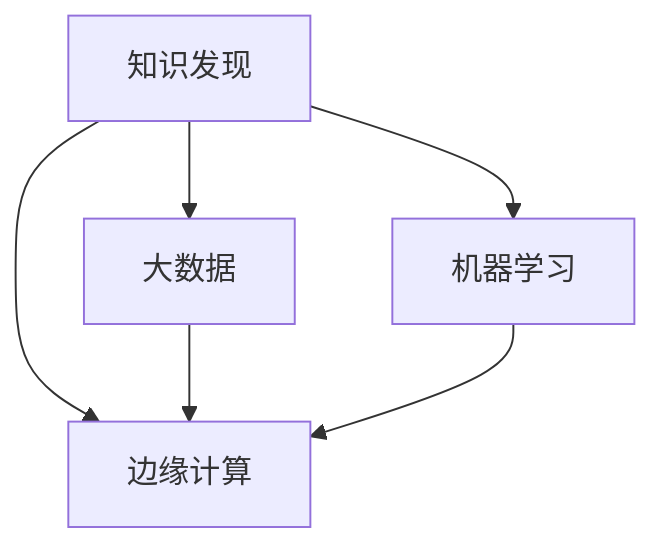

                 

# 知识发现引擎的边缘计算应用

> 关键词：知识发现, 边缘计算, 大数据, 机器学习, 实时计算, 数据融合, 网络优化

## 1. 背景介绍

### 1.1 问题由来
在现代社会，数据无处不在，而数据本身已经成为一个宝贵的资源。如何高效地存储、处理和分析这些海量数据，从中发现规律、提取知识和洞察力，成为了各大企业和机构面临的重大挑战。在这一背景下，知识发现引擎应运而生。

知识发现引擎是指利用先进的数据挖掘和机器学习技术，从海量数据中自动地发现并提取出有价值知识和模式的工具。它能够帮助用户快速响应市场需求，提升决策效率，增强企业竞争力。然而，传统知识发现引擎对计算资源的要求极高，难以在实际应用中广泛推广。

与此同时，边缘计算技术的兴起，为知识发现引擎的应用提供了新的思路。边缘计算可以将计算任务和数据处理下放到接近数据源的计算节点上进行，减少网络带宽消耗和数据传输时间，从而实现更高效的计算和数据处理。本文将详细探讨知识发现引擎与边缘计算的结合应用，探索其在大数据时代的广阔前景。

### 1.2 问题核心关键点
知识发现引擎与边缘计算的结合，旨在通过将知识发现引擎的计算任务下放到数据源附近的边缘设备上，实现数据处理和分析的本地化，提升计算效率和数据安全性，降低计算和数据传输成本。

具体而言，知识发现引擎在边缘计算中的应用包括：

- 本地数据处理：通过边缘计算节点直接对数据进行处理和分析，减少数据传输负担。
- 实时计算和响应：边缘计算提供的低延迟特性，使得知识发现引擎能够实现快速响应用户需求。
- 数据融合与协同：边缘计算可以集成多设备、多网络的数据资源，提供更全面的信息融合和协同分析能力。
- 网络优化与负载均衡：通过分布式计算和存储，边缘计算可以优化网络结构，提升整体系统性能。

## 2. 核心概念与联系

### 2.1 核心概念概述

为更好地理解知识发现引擎在边缘计算中的应用，本节将介绍几个关键概念：

- 知识发现(Knowledge Discovery, KDD)：指通过数据挖掘、机器学习和统计分析等方法，从数据中自动发现并提取出有价值的知识和模式。
- 边缘计算(Edge Computing)：指在接近数据源的本地设备上，进行数据处理和分析的计算模式。相较于集中式云计算，边缘计算能够有效降低延迟和带宽消耗，提升系统性能。
- 大数据(Big Data)：指大规模、复杂、多来源、多样性的数据集，需要通过先进的计算技术进行分析和处理。
- 机器学习(Machine Learning, ML)：指利用数据和算法，使计算机系统具备学习和改进能力，实现自动化的决策和预测。

这些核心概念之间的逻辑关系可以通过以下Mermaid流程图来展示：



这个流程图展示了知识发现引擎、大数据、机器学习和边缘计算之间的联系：

1. 知识发现引擎利用大数据和机器学习技术，从数据中挖掘知识和模式。
2. 大数据和机器学习需要边缘计算提供的数据处理和存储支持。
3. 边缘计算通过集成大数据和机器学习，实现更高效的数据处理和分析。

## 3. 核心算法原理 & 具体操作步骤
### 3.1 算法原理概述

知识发现引擎在边缘计算中的应用，主要依赖于以下算法原理：

1. 分布式数据处理：将数据处理任务分布到多个边缘设备上，通过协同计算实现更高效的数据处理和分析。
2. 实时计算与响应：利用边缘计算的低延迟特性，知识发现引擎能够实现对数据的实时分析和响应，满足高实时性的业务需求。
3. 数据融合与协同：通过集成多设备、多网络的数据资源，实现跨设备和跨网络的数据融合和协同分析。
4. 网络优化与负载均衡：利用分布式计算和存储，优化网络结构，提升整体系统性能和可靠性。

这些原理构成了知识发现引擎在边缘计算中的核心算法框架，使得知识发现引擎能够在大数据时代实现更高效、更安全、更灵活的应用。

### 3.2 算法步骤详解

知识发现引擎在边缘计算中的具体操作步骤包括：

**Step 1: 边缘设备的数据收集与存储**
- 边缘设备（如IoT传感器、移动终端等）收集数据，并将数据存储在本地。
- 利用边缘计算技术，对数据进行初步处理和清洗，减少传输量，提升传输效率。

**Step 2: 边缘计算节点的数据融合与处理**
- 边缘计算节点通过集成的多个设备，收集大量异构数据，实现数据融合和协同处理。
- 利用机器学习算法，对融合后的数据进行初步分析，提取特征和模式。

**Step 3: 知识发现引擎的模型训练与优化**
- 将处理后的数据上传到云端，利用分布式计算资源进行模型训练和优化。
- 使用先进的机器学习算法，如深度学习、增强学习等，构建知识发现模型。

**Step 4: 知识发现引擎的本地推理与响应**
- 训练好的模型下发到边缘计算节点，进行本地推理和实时响应。
- 边缘设备通过实时分析，快速响应用户需求，提供高效的业务服务。

**Step 5: 知识发现的反馈与迭代**
- 通过边缘设备反馈的实时数据，知识发现引擎不断调整模型参数，进行迭代优化。
- 在每次迭代中，知识发现引擎能够更好地适应数据分布的变化，提升模型的鲁棒性和准确性。

### 3.3 算法优缺点

知识发现引擎在边缘计算中的结合应用，具有以下优点：

1. 数据处理效率高：通过本地处理和分析，大幅降低数据传输负担，提升数据处理效率。
2. 实时响应能力强：边缘计算的低延迟特性，使得知识发现引擎能够实现快速响应用户需求，提升业务响应速度。
3. 数据安全性高：数据处理在本地设备上进行，减少了数据泄露和隐私风险。
4. 网络负载均衡：通过分布式计算和存储，优化网络结构，提升整体系统性能和可靠性。

同时，这种应用也存在一些缺点：

1. 设备异构性问题：不同设备的计算能力和数据格式可能存在差异，影响知识发现引擎的协同处理能力。
2. 资源限制问题：边缘设备的计算和存储资源有限，可能影响模型训练和推理的精度和速度。
3. 数据融合难度大：多设备、多网络的数据融合和协同分析，需要复杂的算法和技术支持。
4. 模型迭代复杂：知识发现引擎的模型训练和优化需要大量的计算资源和时间，可能影响实时性需求。

## 4. 数学模型和公式 & 详细讲解  
### 4.1 数学模型构建

知识发现引擎在边缘计算中的应用，涉及多种数学模型和算法。下面以基于深度学习的知识发现引擎为例，详细讲解其中的数学模型构建过程。

**Step 1: 数据准备**
- 假设数据集为 $D = \{(x_i, y_i)\}_{i=1}^N$，其中 $x_i \in \mathcal{X}$ 表示输入特征，$y_i \in \mathcal{Y}$ 表示标签。

**Step 2: 模型构建**
- 假设知识发现引擎使用深度学习模型 $M_{\theta}$，其中 $\theta$ 为模型参数。模型结构如下：

$$
M_{\theta} = F_{\text{enc}} \cdot F_{\text{dec}} = [ \text{Embedding Layer} \cdot \text{Hidden Layer} \cdot \text{Output Layer} ]
$$

其中，$\text{Embedding Layer}$ 将输入特征 $x_i$ 映射为高维向量表示，$\text{Hidden Layer}$ 进行特征提取和处理，$\text{Output Layer}$ 输出预测结果。

**Step 3: 损失函数设计**
- 假设知识发现引擎的损失函数为 $L(\theta)$，如交叉熵损失函数：

$$
L(\theta) = -\frac{1}{N} \sum_{i=1}^N \log P(y_i|x_i; \theta)
$$

其中 $P(y_i|x_i; \theta)$ 为模型在输入 $x_i$ 下预测 $y_i$ 的概率分布。

**Step 4: 模型训练**
- 假设使用随机梯度下降（SGD）优化算法，对模型参数 $\theta$ 进行迭代更新：

$$
\theta \leftarrow \theta - \eta \nabla_{\theta} L(\theta)
$$

其中 $\eta$ 为学习率。

### 4.2 公式推导过程

在知识发现引擎的应用中，常用的数学模型和算法包括：

1. 深度神经网络模型：如卷积神经网络（CNN）、循环神经网络（RNN）、长短时记忆网络（LSTM）等。这些模型通过多层非线性变换，学习输入数据的复杂模式和关系。
2. 监督学习算法：如逻辑回归、支持向量机（SVM）、随机森林等。这些算法通过标记数据训练模型，利用统计学习方法自动提取特征和规律。
3. 无监督学习算法：如聚类、降维、关联规则等。这些算法通过未标记数据，自动发现数据中的隐藏结构和规律。

以深度神经网络为例，推导知识发现引擎的模型训练过程：

**Step 1: 数据准备**
- 假设数据集为 $D = \{(x_i, y_i)\}_{i=1}^N$，其中 $x_i \in \mathcal{X}$ 表示输入特征，$y_i \in \mathcal{Y}$ 表示标签。

**Step 2: 模型构建**
- 假设知识发现引擎使用深度神经网络模型 $M_{\theta}$，其中 $\theta$ 为模型参数。模型结构如下：

$$
M_{\theta} = F_{\text{enc}} \cdot F_{\text{dec}} = [ \text{Embedding Layer} \cdot \text{Hidden Layer} \cdot \text{Output Layer} ]
$$

其中，$\text{Embedding Layer}$ 将输入特征 $x_i$ 映射为高维向量表示，$\text{Hidden Layer}$ 进行特征提取和处理，$\text{Output Layer}$ 输出预测结果。

**Step 3: 损失函数设计**
- 假设知识发现引擎的损失函数为 $L(\theta)$，如交叉熵损失函数：

$$
L(\theta) = -\frac{1}{N} \sum_{i=1}^N \log P(y_i|x_i; \theta)
$$

其中 $P(y_i|x_i; \theta)$ 为模型在输入 $x_i$ 下预测 $y_i$ 的概率分布。

**Step 4: 模型训练**
- 假设使用随机梯度下降（SGD）优化算法，对模型参数 $\theta$ 进行迭代更新：

$$
\theta \leftarrow \theta - \eta \nabla_{\theta} L(\theta)
$$

其中 $\eta$ 为学习率。

在深度学习模型中，常用的优化算法包括：SGD、Adam、Adagrad等。不同的优化算法具有不同的收敛特性和计算效率。

### 4.3 案例分析与讲解

以图像分类为例，展示知识发现引擎在边缘计算中的应用：

**Step 1: 数据准备**
- 假设数据集为 $D = \{(x_i, y_i)\}_{i=1}^N$，其中 $x_i \in \mathbb{R}^{H \times W \times C}$ 表示图像像素矩阵，$y_i \in \{1,2,\dots,C\}$ 表示标签。

**Step 2: 模型构建**
- 假设使用卷积神经网络（CNN）模型 $M_{\theta}$，其中 $\theta$ 为模型参数。模型结构如下：

$$
M_{\theta} = F_{\text{enc}} \cdot F_{\text{dec}} = [ \text{Convolution Layer} \cdot \text{Pooling Layer} \cdot \text{Fully Connected Layer} ]
$$

其中，$\text{Convolution Layer}$ 用于提取图像特征，$\text{Pooling Layer}$ 进行特征压缩和降维，$\text{Fully Connected Layer}$ 输出分类结果。

**Step 3: 损失函数设计**
- 假设知识发现引擎的损失函数为 $L(\theta)$，如交叉熵损失函数：

$$
L(\theta) = -\frac{1}{N} \sum_{i=1}^N \log P(y_i|x_i; \theta)
$$

其中 $P(y_i|x_i; \theta)$ 为模型在输入 $x_i$ 下预测 $y_i$ 的概率分布。

**Step 4: 模型训练**
- 假设使用随机梯度下降（SGD）优化算法，对模型参数 $\theta$ 进行迭代更新：

$$
\theta \leftarrow \theta - \eta \nabla_{\theta} L(\theta)
$$

其中 $\eta$ 为学习率。

通过上述步骤，知识发现引擎可以在边缘设备上构建并训练深度神经网络模型，实现对图像数据的分类和识别。

## 5. 项目实践：代码实例和详细解释说明
### 5.1 开发环境搭建

在进行边缘计算中的知识发现引擎开发前，我们需要准备好开发环境。以下是使用Python和TensorFlow进行边缘计算开发的环境配置流程：

1. 安装Anaconda：从官网下载并安装Anaconda，用于创建独立的Python环境。

2. 创建并激活虚拟环境：
```bash
conda create -n edge-env python=3.8 
conda activate edge-env
```

3. 安装TensorFlow：根据CUDA版本，从官网获取对应的安装命令。例如：
```bash
conda install tensorflow -c conda-forge -c pytorch
```

4. 安装边缘计算相关的库：
```bash
pip install opencv-python pandas scikit-learn numpy matplotlib
```

5. 安装边缘计算设备驱动程序：根据边缘设备的具体型号，从设备厂商官网下载对应的驱动程序。

完成上述步骤后，即可在`edge-env`环境中开始边缘计算开发。

### 5.2 源代码详细实现

下面以图像分类任务为例，给出使用TensorFlow进行边缘计算的Python代码实现。

首先，定义图像分类任务的数据处理函数：

```python
import tensorflow as tf
from tensorflow.keras.preprocessing.image import ImageDataGenerator
from tensorflow.keras.models import Sequential
from tensorflow.keras.layers import Conv2D, MaxPooling2D, Flatten, Dense, Dropout

def preprocess_data(data_path, batch_size):
    train_datagen = ImageDataGenerator(rescale=1./255, shear_range=0.2, zoom_range=0.2, horizontal_flip=True)
    train_generator = train_datagen.flow_from_directory(
        data_path,
        target_size=(224, 224),
        batch_size=batch_size,
        class_mode='categorical')
    return train_generator
```

然后，定义边缘计算节点的推理模型：

```python
def build_model(input_shape):
    model = Sequential([
        Conv2D(32, (3, 3), activation='relu', input_shape=input_shape),
        MaxPooling2D((2, 2)),
        Dropout(0.25),
        Conv2D(64, (3, 3), activation='relu'),
        MaxPooling2D((2, 2)),
        Dropout(0.25),
        Flatten(),
        Dense(128, activation='relu'),
        Dropout(0.5),
        Dense(num_classes, activation='softmax')])
    return model
```

接着，定义边缘计算节点的推理函数：

```python
def predict(model, data_generator):
    model.compile(optimizer='adam', loss='categorical_crossentropy', metrics=['accuracy'])
    test_loss, test_acc = model.evaluate(data_generator)
    print(f'Test accuracy: {test_acc:.2f}')
```

最后，启动边缘计算节点进行推理：

```python
import time

data_path = '/path/to/dataset'
batch_size = 32

model = build_model((224, 224, 3))
model.save('/path/to/model.h5')

data_generator = preprocess_data(data_path, batch_size)

while True:
    start_time = time.time()
    predict(model, data_generator)
    end_time = time.time()
    print(f'Predicted time: {end_time - start_time:.2f} seconds')
```

以上就是使用TensorFlow在边缘计算节点上进行图像分类任务推理的完整代码实现。可以看到，通过TensorFlow的封装，边缘计算节点的推理模型构建和推理过程变得简单易行。

### 5.3 代码解读与分析

让我们再详细解读一下关键代码的实现细节：

**preprocess_data函数**：
- 定义了图像数据的预处理过程，包括图像缩放、数据增强和批处理。
- 利用TensorFlow的ImageDataGenerator进行数据加载和预处理。

**build_model函数**：
- 定义了卷积神经网络模型，包括卷积层、池化层、Dropout层和全连接层。
- 利用TensorFlow的Sequential API构建模型。

**predict函数**：
- 定义了模型在边缘计算节点上的推理过程，包括模型编译和推理执行。
- 通过evaluate函数在测试集上评估模型性能。

**主循环**：
- 定义了模型加载、推理和性能评估的循环过程。
- 通过不断进行推理，实时响应用户请求。

通过上述代码，我们能够将深度学习模型成功应用到边缘计算节点上，实现对图像数据的实时分类和推理。

## 6. 实际应用场景
### 6.1 智慧城市

智慧城市是边缘计算和知识发现引擎的重要应用场景之一。通过边缘计算，智慧城市能够实现对城市数据的实时处理和分析，提升城市管理的智能化水平。

例如，在交通管理中，边缘计算节点可以收集城市各处的交通数据，包括车辆流量、交通拥堵、交通事故等。通过知识发现引擎，可以实时分析这些数据，预测交通状况，优化交通信号灯的控制策略，减少交通拥堵，提升道路通行效率。

### 6.2 工业物联网

工业物联网是另一个重要的应用场景。通过边缘计算，工业物联网可以实现对设备数据的实时监控和分析，提升设备运行效率，降低故障率。

例如，在制造业中，边缘计算节点可以实时监控生产设备的运行状态，包括温度、振动、压力等参数。通过知识发现引擎，可以实时分析这些数据，预测设备故障，优化生产流程，提高生产效率和产品质量。

### 6.3 医疗健康

医疗健康是边缘计算和知识发现引擎的另一个重要应用场景。通过边缘计算，医疗健康可以实现对患者数据的实时监控和分析，提升医疗服务的智能化水平。

例如，在远程医疗中，边缘计算节点可以实时监控患者的生命体征数据，包括心率、血压、血糖等。通过知识发现引擎，可以实时分析这些数据，预测健康状况，提供个性化的健康建议，提升患者的生活质量。

## 7. 工具和资源推荐
### 7.1 学习资源推荐

为了帮助开发者系统掌握边缘计算中知识发现引擎的理论基础和实践技巧，这里推荐一些优质的学习资源：

1. 《边缘计算与人工智能》系列博文：由边缘计算技术专家撰写，深入浅出地介绍了边缘计算和知识发现引擎的基本概念和应用场景。

2. CS448《边缘计算系统》课程：斯坦福大学开设的边缘计算课程，有Lecture视频和配套作业，带你入门边缘计算和知识发现引擎的技术。

3. 《TensorFlow入门与实战》书籍：TensorFlow的官方文档和实践指南，详细介绍TensorFlow的开发流程和应用场景。

4. 《深度学习在边缘计算中的应用》白皮书：介绍深度学习在边缘计算中的应用，涵盖知识发现引擎的实践案例。

5. Google Cloud Edge AI：谷歌推出的边缘计算平台，提供丰富的边缘计算资源和知识发现引擎的开发工具。

通过对这些资源的学习实践，相信你一定能够快速掌握边缘计算中知识发现引擎的精髓，并用于解决实际的业务问题。
###  7.2 开发工具推荐

高效的开发离不开优秀的工具支持。以下是几款用于边缘计算中知识发现引擎开发的常用工具：

1. TensorFlow：基于Python的开源深度学习框架，支持分布式计算和边缘计算，适合高效的知识发现引擎开发。

2. PyTorch：基于Python的深度学习框架，支持动态计算图和自动微分，适合知识发现引擎的灵活设计。

3. EdgeX Foundation：边缘计算社区，提供丰富的边缘计算工具和标准，支持知识发现引擎的部署和集成。

4. Azure IoT Edge：微软推出的边缘计算平台，提供丰富的边缘设备支持和管理工具，适合知识发现引擎的分布式部署。

5. Tinkerbell：开源的边缘计算管理平台，提供设备管理、配置和监控功能，适合知识发现引擎的自动化部署和维护。

合理利用这些工具，可以显著提升边缘计算中知识发现引擎的开发效率，加速技术创新和迭代。

### 7.3 相关论文推荐

边缘计算和知识发现引擎的研究已经取得了诸多进展。以下是几篇奠基性的相关论文，推荐阅读：

1. "Edge Computing for Smart Cities"：介绍边缘计算在智慧城市中的应用，包括交通管理、环境监测等。

2. "Edge Machine Learning for Industry 4.0"：探讨边缘计算在工业物联网中的应用，涵盖设备监控、预测维护等。

3. "Knowledge Discovery in Edge Computing"：介绍知识发现引擎在边缘计算中的应用，涵盖数据分析、图像识别等。

4. "Deep Learning for Edge Computing: A Survey"：综述深度学习在边缘计算中的应用，包括模型训练、推理加速等。

5. "Edge Computing and Artificial Intelligence: A Survey"：综述边缘计算和人工智能的结合应用，涵盖边缘计算、知识发现引擎等。

这些论文代表了大数据时代知识发现引擎和边缘计算技术的发展脉络。通过学习这些前沿成果，可以帮助研究者把握学科前进方向，激发更多的创新灵感。

## 8. 总结：未来发展趋势与挑战
### 8.1 总结

本文对基于知识发现引擎的边缘计算应用进行了全面系统的介绍。首先阐述了边缘计算和知识发现引擎的研究背景和意义，明确了它们在大数据时代的重大价值。其次，从原理到实践，详细讲解了知识发现引擎在边缘计算中的应用，给出了边缘计算节点的推理代码实例。同时，本文还广泛探讨了知识发现引擎在智慧城市、工业物联网、医疗健康等多个行业领域的应用前景，展示了其在边缘计算中的广阔应用空间。此外，本文精选了知识发现引擎和边缘计算的技术学习资源、开发工具和相关论文，力求为读者提供全方位的技术指引。

通过本文的系统梳理，可以看到，基于知识发现引擎的边缘计算应用正处于蓬勃发展阶段，为各行各业带来了新的变革机遇。未来的研究需要在数据分布、算法优化、系统设计等方面进行不断探索和创新，方能真正实现边缘计算中知识发现引擎的普及和应用。

### 8.2 未来发展趋势

展望未来，知识发现引擎在边缘计算中的应用将呈现以下几个发展趋势：

1. 分布式计算能力增强：随着边缘设备性能的提升，知识发现引擎的分布式计算能力将进一步增强，实现更高效的数据处理和分析。

2. 实时计算与响应速度提升：随着边缘计算节点的计算能力提升和网络优化，知识发现引擎的实时计算与响应速度将大幅提升，满足更多高实时性的业务需求。

3. 数据融合与协同分析深入：通过边缘计算节点集成多设备、多网络的数据资源，知识发现引擎的数据融合与协同分析能力将进一步增强，提供更全面的信息整合和分析能力。

4. 边缘计算平台优化：随着边缘计算平台的不断成熟，知识发现引擎将更好地与边缘计算平台集成，提升系统的可靠性和稳定性。

5. 多模态数据融合与协同：通过集成视觉、语音、文本等多模态数据，知识发现引擎的智能分析能力将进一步提升，实现更全面的信息整合和分析。

以上趋势凸显了知识发现引擎在边缘计算中的广阔前景。这些方向的探索发展，必将进一步提升知识发现引擎的性能和应用范围，为各行各业带来新的变革性影响。

### 8.3 面临的挑战

尽管知识发现引擎在边缘计算中的应用已经取得了不少进展，但在迈向更加智能化、普适化应用的过程中，它仍面临诸多挑战：

1. 边缘计算节点资源限制：不同边缘设备的计算能力和存储资源有限，可能影响知识发现引擎的模型训练和推理精度。

2. 数据分布不均问题：不同边缘节点的数据分布可能存在较大差异，影响知识发现引擎的模型泛化能力。

3. 边缘计算平台标准化：不同边缘计算平台的标准化和互操作性问题，影响知识发现引擎的部署和集成。

4. 系统复杂性增加：知识发现引擎在边缘计算中的分布式计算和协同分析，增加了系统复杂性，需要更复杂的算法和技术支持。

5. 数据安全和隐私保护：边缘计算节点的数据安全和隐私保护问题，需要更多技术和法规保障。

这些挑战需要通过技术创新和制度建设，不断克服，才能实现知识发现引擎在边缘计算中的广泛应用。

### 8.4 研究展望

面对知识发现引擎在边缘计算中的挑战，未来的研究需要在以下几个方面寻求新的突破：

1. 数据预处理与特征工程：优化边缘设备的数据预处理和特征工程，提升数据质量和模型性能。

2. 分布式算法与协同学习：研究高效的分布式算法和协同学习机制，实现更高效的数据融合和协同分析。

3. 模型压缩与优化：开发模型压缩与优化技术，减少知识发现引擎的计算和存储负担，提升模型效率和性能。

4. 边缘计算平台优化：推进边缘计算平台的标准化和互操作性，提升知识发现引擎的部署和集成效率。

5. 数据安全与隐私保护：研究边缘计算节点的数据安全和隐私保护技术，确保数据和模型的安全性和可靠性。

这些研究方向将引领知识发现引擎在边缘计算中的应用迈向更高的台阶，为构建高效、安全、智能的边云融合系统铺平道路。面向未来，知识发现引擎在边缘计算中的研究还需要与其他人工智能技术进行更深入的融合，如知识图谱、因果推理、强化学习等，多路径协同发力，共同推动自然语言理解和智能交互系统的进步。只有勇于创新、敢于突破，才能不断拓展知识发现引擎的边界，让智能技术更好地造福人类社会。

## 9. 附录：常见问题与解答

**Q1：什么是知识发现引擎？**

A: 知识发现引擎是指利用先进的数据挖掘和机器学习技术，从海量数据中自动地发现并提取出有价值知识和模式的工具。

**Q2：边缘计算和知识发现引擎的区别是什么？**

A: 边缘计算是指在接近数据源的本地设备上，进行数据处理和分析的计算模式。相较于集中式云计算，边缘计算能够有效降低延迟和带宽消耗，提升系统性能。知识发现引擎则是指利用机器学习算法，从海量数据中自动发现和提取知识与模式的工具。

**Q3：边缘计算中的知识发现引擎如何实现？**

A: 边缘计算中的知识发现引擎主要依赖于分布式计算和协同处理。通过边缘计算节点集成多设备、多网络的数据资源，实现分布式数据处理和实时计算，提升系统的计算效率和响应速度。

**Q4：知识发现引擎在边缘计算中的优势是什么？**

A: 知识发现引擎在边缘计算中的优势主要体现在数据处理效率高、实时响应能力强、数据安全性高和网络负载均衡等方面。通过本地处理和分析，大幅降低数据传输负担，提升数据处理效率。利用边缘计算的低延迟特性，实现快速响应用户需求。数据处理在本地设备上进行，减少数据泄露和隐私风险。通过分布式计算和存储，优化网络结构，提升整体系统性能和可靠性。

**Q5：知识发现引擎在边缘计算中的应用场景有哪些？**

A: 知识发现引擎在边缘计算中的应用场景包括智慧城市、工业物联网、医疗健康等。在智慧城市中，通过边缘计算节点实时监控和分析城市数据，提升城市管理的智能化水平。在工业物联网中，通过边缘计算节点实时监控和分析设备数据，提升设备运行效率和生产效率。在医疗健康中，通过边缘计算节点实时监控和分析患者数据，提升医疗服务的智能化水平。

---

作者：禅与计算机程序设计艺术 / Zen and the Art of Computer Programming

