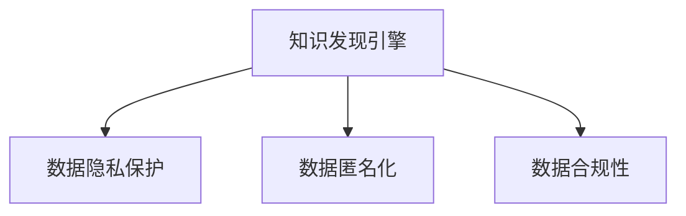

                 

## 1. 背景介绍

### 1.1 问题由来
随着大数据和人工智能技术的迅猛发展，知识发现引擎(Knowledge Discovery Engine, KDE)在各行各业得到了广泛应用。KDE通过在大量数据中挖掘知识，帮助人们快速获取信息、预测趋势、辅助决策等。然而，数据隐私和安全问题也随之而来。企业数据的敏感性、多样性和复杂性，使得数据隐私保护与合规性成为KDE系统设计和实施的重要挑战。

### 1.2 问题核心关键点
知识发现引擎的隐私保护与合规性主要涉及以下几个关键点：

- **数据隐私保护**：确保用户数据不被未授权访问和泄露，保障个人隐私权。
- **合规性要求**：遵循相关法律法规（如GDPR、CCPA等），确保数据处理活动的合法性和透明性。
- **数据匿名化**：通过数据脱敏和泛化等技术，使得数据在不暴露个人隐私的前提下，仍能用于知识发现和分析。
- **数据审计**：记录和监控数据处理过程，确保符合合规要求，并能对潜在违规行为进行追溯和纠正。

这些问题在实际应用中常常交织在一起，需要在技术和管理两方面进行综合考虑和处理。

### 1.3 问题研究意义
解决KDE的隐私保护与合规性问题，对于保障数据安全、提升用户信任、促进技术合法应用具有重要意义：

- **保障数据安全**：通过隐私保护技术，防止数据泄露和滥用，降低因数据泄露带来的法律风险和经济损失。
- **提升用户信任**：透明的数据处理流程和严格的隐私保护措施，能够增强用户对企业的信任，提高用户粘性。
- **促进技术合法应用**：合规性要求帮助企业规范数据处理行为，避免违法违规，确保技术应用在法律框架内进行。
- **推动行业标准化**：隐私保护与合规性研究有助于制定行业标准，引导企业遵循最佳实践，促进行业健康发展。

## 2. 核心概念与联系

### 2.1 核心概念概述

为更好地理解KDE的隐私保护与合规性，本节将介绍几个密切相关的核心概念：

- **知识发现引擎(KDE)**：基于统计、机器学习和数据挖掘等技术，从大规模数据中提取和发现有价值知识的工具和系统。
- **数据隐私保护**：通过技术手段，确保数据在处理和传输过程中不被未授权访问和泄露，保护个人隐私权。
- **数据匿名化**：通过数据脱敏和泛化等技术，使得数据在不暴露个人隐私的前提下，仍能用于分析和挖掘。
- **数据合规性**：遵循相关法律法规，确保数据处理活动的合法性和透明性，保障数据安全和个人隐私。

这些核心概念之间的逻辑关系可以通过以下Mermaid流程图来展示：



这个流程图展示了大数据系统中知识发现引擎、数据隐私保护、数据匿名化和数据合规性之间的内在联系。

## 3. 核心算法原理 & 具体操作步骤
### 3.1 算法原理概述

KDE的隐私保护与合规性，本质上是如何在知识发现过程中平衡数据利用与隐私保护、合规要求之间的矛盾。其核心思想是：采用隐私保护和合规性技术，确保知识发现过程符合法律法规要求，同时最大程度利用数据价值，提高知识发现的效率和质量。

### 3.2 算法步骤详解

KDE的隐私保护与合规性一般包括以下几个关键步骤：

**Step 1: 准备数据集**
- 收集和整理用于知识发现的原始数据，确保数据的完整性和一致性。
- 对数据进行初步的清洗和预处理，去除异常值和噪声。

**Step 2: 数据匿名化处理**
- 使用数据匿名化技术（如泛化、扰动、伪化等），将原始数据转换为匿名数据，以保护个人隐私。
- 确保匿名化后的数据仍能满足知识发现的需求，如保留数据的相关性和有用信息。

**Step 3: 合规性约束**
- 根据法律法规（如GDPR、CCPA等）的要求，设计合规性约束，限制数据的使用范围和访问权限。
- 对数据处理流程进行记录和监控，确保数据处理活动符合法律法规。

**Step 4: 隐私保护技术**
- 采用隐私保护技术（如差分隐私、同态加密、联邦学习等），确保知识发现过程中数据隐私不被泄露。
- 根据具体应用场景，选择适合的隐私保护技术，综合考虑隐私保护的强度和知识发现的效率。

**Step 5: 知识发现与分析**
- 在合规和隐私保护的框架下，进行知识发现和分析，发现数据中的有价值知识。
- 对发现的知识进行验证和评估，确保知识的质量和可靠性。

**Step 6: 结果反馈与改进**
- 将知识发现结果反馈给数据所有者和用户，确保其符合法律法规和隐私保护要求。
- 根据反馈信息，不断改进知识发现引擎的算法和参数，提高知识发现的准确性和效率。

以上是KDE隐私保护与合规性的一般流程。在实际应用中，还需要针对具体任务和数据特点，对各环节进行优化设计，如改进数据匿名化方法，引入更多隐私保护技术等，以进一步提升知识发现的隐私保护效果和合规性。

### 3.3 算法优缺点

KDE的隐私保护与合规性方法具有以下优点：
1. 提高数据利用率。通过匿名化和隐私保护技术，可以在保护隐私的前提下，充分利用数据进行知识发现。
2. 增强数据安全性。合规性约束和技术手段，确保数据处理活动的合法性和透明性，降低数据泄露风险。
3. 提升用户信任度。严格的隐私保护措施和透明的合规性处理流程，能够增强用户对企业的信任。
4. 推动合规应用。法律法规的遵循，有助于规范数据处理行为，避免法律风险，确保技术应用的合法性。

同时，该方法也存在一定的局限性：
1. 技术复杂度高。数据匿名化和隐私保护技术往往需要较高的技术门槛，难以实现低成本、高效能的保护。
2. 性能损失。隐私保护技术通常会导致数据损失，影响知识发现的准确性和效率。
3. 法律和标准差异。不同国家地区的法律法规和数据标准存在差异，需要针对性地处理，增加了复杂性。
4. 隐私与合规平衡难度大。如何平衡隐私保护和合规要求，同时满足知识发现的需求，是技术实施中的重要挑战。

尽管存在这些局限性，但就目前而言，KDE的隐私保护与合规性方法仍是大数据系统中知识发现的重要保障。未来相关研究的重点在于如何进一步降低技术实施的复杂度，提高隐私保护的效果，以及探索更高效、更透明的隐私保护与合规性实现手段。

### 3.4 算法应用领域

KDE的隐私保护与合规性方法，在多个行业领域得到了广泛应用，具体包括：

- **金融领域**：银行、保险公司等金融机构需要处理大量客户数据，进行信用评分、风险评估、反欺诈等。通过隐私保护和合规性技术，确保数据处理活动的合法性和透明性，保护客户隐私。
- **医疗健康**：医院、研究机构等需要处理患者数据，进行疾病预测、基因分析、药物研发等。通过隐私保护和合规性技术，确保数据处理活动的合法性和透明性，保护患者隐私。
- **零售电商**：电商平台需要处理用户行为数据，进行个性化推荐、市场分析、客户细分等。通过隐私保护和合规性技术，确保数据处理活动的合法性和透明性，保护用户隐私。
- **政府机构**：政府部门需要处理公民数据，进行公共服务、政策制定、社会治理等。通过隐私保护和合规性技术，确保数据处理活动的合法性和透明性，保护公民隐私。
- **教育领域**：学校、培训机构等需要处理学生数据，进行学术研究、教育评估、学生管理等。通过隐私保护和合规性技术，确保数据处理活动的合法性和透明性，保护学生隐私。

此外，KDE的隐私保护与合规性方法也在智能城市、智慧物流、能源管理等更多领域得到了应用，为大数据系统的安全、合规、高效运行提供了重要保障。

## 4. 数学模型和公式 & 详细讲解 & 举例说明
### 4.1 数学模型构建

KDE的隐私保护与合规性涉及多个数学模型，主要包括数据匿名化模型、隐私保护模型和合规性约束模型。

**数据匿名化模型**：
- 泛化模型：将原始数据转换为泛化数据，保留数据结构，但不暴露具体数值。
- 扰动模型：在原始数据上添加噪声，使得数据无法直接关联到原始数据。

**隐私保护模型**：
- 差分隐私模型：通过在数据查询中加入噪声，确保查询结果对单个数据点的影响很小，从而保护数据隐私。
- 同态加密模型：在加密数据上执行计算，计算结果解密后与在原始数据上执行相同计算结果相同，确保数据隐私不被泄露。

**合规性约束模型**：
- 访问控制模型：通过身份验证、权限控制等技术，限制数据访问权限，确保数据处理活动的合法性。
- 审计追踪模型：记录和监控数据处理过程，确保数据处理活动符合法律法规要求。

### 4.2 公式推导过程

以下我们以差分隐私为例，推导其数学公式和计算步骤。

设原始数据集为 $D=\{d_1,d_2,\dots,d_n\}$，其中 $d_i$ 表示第 $i$ 个数据点。差分隐私的目标是：在查询结果 $Q(D)$ 上加入噪声 $N$，使得查询结果对于单个数据点的加入或移除影响很小，从而保护数据隐私。

具体来说，差分隐私的数学定义如下：

$$
\forall d_i \in D, \Pr[Q(D) = q] \approx \Pr[Q(D - \{d_i\}) = q]
$$

其中 $\Pr$ 表示概率，$q$ 表示查询结果。差分隐私通常使用拉普拉斯机制来实现，其数学公式为：

$$
Q(D) = f(D) + N
$$

其中 $f$ 表示查询函数，$N$ 表示拉普拉斯噪声，其数学期望为0，方差为 $\sigma^2$。拉普拉斯噪声的数学公式为：

$$
N \sim \mathcal{L}(0,\sigma)
$$

在实际应用中，拉普拉斯噪声的参数 $\sigma$ 需要根据查询的敏感度和隐私保护需求来确定。一般来说，数据集越大，查询越敏感，$\sigma$ 应越大。

### 4.3 案例分析与讲解

假设我们有一个包含10000个学生成绩的数据集，需要查询班级平均成绩。使用差分隐私保护，可以按照以下步骤进行：

1. 计算班级原始平均成绩 $m_0$。
2. 计算拉普拉斯噪声 $N \sim \mathcal{L}(0,\sigma)$。
3. 计算差分隐私保护后的平均成绩 $m_1 = m_0 + N$。
4. 将 $m_1$ 作为查询结果返回。

为了确定 $\sigma$ 的取值，假设我们希望在0.1的误差范围内保护隐私，即 $\epsilon = 0.1$，则有：

$$
\epsilon = \ln(n) + \ln(2)/2 + \sigma
$$

其中 $n$ 表示数据集大小，$2$ 表示概率的上界。将 $n=10000$ 代入上式，得：

$$
\epsilon = \ln(10000) + \ln(2)/2 + \sigma \approx 10 + 0.7 + \sigma
$$

为了保护隐私，取 $\epsilon = 0.1$，得：

$$
0.1 = 10 + 0.7 + \sigma
$$

解得 $\sigma = 0.9$。因此，拉普拉斯噪声的参数应设置为 $\sigma = 0.9$。

## 5. 项目实践：代码实例和详细解释说明
### 5.1 开发环境搭建

在进行隐私保护与合规性实践前，我们需要准备好开发环境。以下是使用Python进行PyTorch开发的环境配置流程：

1. 安装Anaconda：从官网下载并安装Anaconda，用于创建独立的Python环境。

2. 创建并激活虚拟环境：
```bash
conda create -n pytorch-env python=3.8 
conda activate pytorch-env
```

3. 安装PyTorch：根据CUDA版本，从官网获取对应的安装命令。例如：
```bash
conda install pytorch torchvision torchaudio cudatoolkit=11.1 -c pytorch -c conda-forge
```

4. 安装TensorFlow：
```bash
conda install tensorflow -c conda-forge
```

5. 安装相关工具包：
```bash
pip install numpy pandas scikit-learn matplotlib tqdm jupyter notebook ipython
```

完成上述步骤后，即可在`pytorch-env`环境中开始实践。

### 5.2 源代码详细实现

这里我们以差分隐私为例，给出使用PyTorch进行数据查询的差分隐私保护代码实现。

首先，定义差分隐私保护函数：

```python
import torch
import torch.nn as nn
import numpy as np
from scipy.stats import laplace

def differential_privacy(f, x, epsilon, delta=1e-5):
    n = x.size(0)
    sigma = epsilon / (np.sqrt(2 * np.log(1 / delta)))
    y = f(x) + laplace.rvs(scale=1 / sigma, size=n)
    return y
```

其中，$f$ 表示查询函数，$x$ 表示输入数据，$epsilon$ 表示隐私保护参数，$delta$ 表示错误概率。

然后，定义查询函数，这里以计算均值为例：

```python
def mean(x):
    return torch.mean(x, dim=0)
```

接着，定义数据集和隐私保护参数：

```python
x = torch.randn(10000, 10)
epsilon = 0.1
delta = 1e-5
```

最后，调用差分隐私保护函数进行计算：

```python
y = differential_privacy(mean, x, epsilon, delta)
print(y)
```

以上就是使用PyTorch进行差分隐私保护的基本代码实现。可以看到，差分隐私保护的核心在于在查询结果上加入噪声，从而保护数据隐私。

### 5.3 代码解读与分析

让我们再详细解读一下关键代码的实现细节：

**差分隐私保护函数**：
- 计算拉普拉斯噪声的参数 $\sigma$。
- 在输入数据 $x$ 上执行查询函数 $f$，并在结果上加入拉普拉斯噪声。
- 返回差分隐私保护后的结果 $y$。

**查询函数**：
- 定义均值查询函数，计算输入数据的均值。
- 在计算过程中，使用差分隐私保护函数进行隐私保护。

**数据集和隐私保护参数**：
- 创建包含10000个样本的数据集 $x$，并指定隐私保护参数 $\epsilon$ 和错误概率 $\delta$。

通过上述代码，我们实现了在均值查询中应用差分隐私保护的基本流程。实际应用中，需要根据具体任务和隐私保护需求，选择合适的隐私保护技术和参数，进行更复杂的数据查询和分析。

## 6. 实际应用场景
### 6.1 金融领域

金融领域需要处理大量客户数据，进行信用评分、风险评估、反欺诈等。通过隐私保护和合规性技术，确保数据处理活动的合法性和透明性，保护客户隐私。

具体应用场景包括：
- **信用评分**：金融机构需要根据客户的历史交易记录、信用记录等数据，进行信用评分，以决定是否批准贷款。通过差分隐私保护，确保客户数据不被泄露，同时满足合规要求。
- **风险评估**：保险公司需要评估客户的风险水平，决定是否批准保险申请。通过隐私保护和合规性技术，确保客户数据的安全，同时符合法律法规。
- **反欺诈**：金融机构需要检测和预防欺诈行为。通过隐私保护和合规性技术，确保数据处理活动的合法性和透明性，保护客户隐私。

### 6.2 医疗健康

医疗健康领域需要处理患者数据，进行疾病预测、基因分析、药物研发等。通过隐私保护和合规性技术，确保数据处理活动的合法性和透明性，保护患者隐私。

具体应用场景包括：
- **疾病预测**：医疗机构需要预测患者患病的风险，以便提前采取预防措施。通过差分隐私保护，确保患者数据不被泄露，同时满足合规要求。
- **基因分析**：研究人员需要分析患者的基因数据，进行疾病诊断和治疗方案的制定。通过隐私保护和合规性技术，确保患者数据的安全，同时符合法律法规。
- **药物研发**：制药公司需要利用患者数据进行药物研发。通过隐私保护和合规性技术，确保数据处理活动的合法性和透明性，保护患者隐私。

### 6.3 零售电商

零售电商需要处理用户行为数据，进行个性化推荐、市场分析、客户细分等。通过隐私保护和合规性技术，确保数据处理活动的合法性和透明性，保护用户隐私。

具体应用场景包括：
- **个性化推荐**：电商平台需要根据用户的历史浏览和购买记录，进行个性化推荐。通过差分隐私保护，确保用户数据不被泄露，同时满足合规要求。
- **市场分析**：电商平台需要分析用户行为数据，进行市场趋势预测和用户细分。通过隐私保护和合规性技术，确保数据处理活动的合法性和透明性，保护用户隐私。
- **客户细分**：电商平台需要根据用户数据，进行客户细分，进行精准营销。通过隐私保护和合规性技术，确保数据处理活动的合法性和透明性，保护用户隐私。

### 6.4 未来应用展望

随着KDE技术的不断进步，隐私保护与合规性方法也将迎来新的突破。未来，在以下几个方面有望取得进一步进展：

1. **隐私保护技术**：开发更加高效、灵活的隐私保护技术，如同态加密、联邦学习、多方安全计算等，实现在数据处理过程中的隐私保护。
2. **合规性技术**：引入更多合规性技术，如区块链、智能合约等，确保数据处理活动的透明性和可追溯性。
3. **隐私与合规融合**：将隐私保护和合规性技术进行融合，实现更加全面、综合的隐私保护与合规性解决方案。
4. **隐私保护工具**：开发更多隐私保护工具和平台，帮助企业快速实现隐私保护与合规性要求，降低实施成本。
5. **隐私保护评估**：引入隐私保护评估方法，对隐私保护效果进行定量评估，确保隐私保护措施的有效性。

这些技术进步将进一步提升KDE的隐私保护与合规性效果，为大数据系统的安全、合法、高效运行提供坚实保障。

## 7. 工具和资源推荐
### 7.1 学习资源推荐

为了帮助开发者系统掌握KDE的隐私保护与合规性技术，这里推荐一些优质的学习资源：

1. **《隐私保护与合规性》课程**：斯坦福大学开设的隐私保护和合规性课程，涵盖隐私保护技术、法律法规、合规性框架等内容，适合初学者和进阶开发者。
2. **《大数据隐私保护》书籍**：系统介绍了大数据隐私保护的基本概念、技术和应用，包括差分隐私、同态加密、隐私保护技术等。
3. **《数据合规性框架》白皮书**：国际标准化组织（ISO）发布的数据合规性框架，介绍了数据合规性的基本要求、最佳实践和实施指南。
4. **Kaggle隐私保护竞赛**：Kaggle平台上举办的隐私保护竞赛，通过实践项目，帮助开发者掌握隐私保护和合规性技术。

通过对这些资源的学习实践，相信你一定能够快速掌握KDE的隐私保护与合规性技术的精髓，并用于解决实际问题。

### 7.2 开发工具推荐

高效的开发离不开优秀的工具支持。以下是几款用于KDE隐私保护与合规性开发的常用工具：

1. **PyTorch**：基于Python的开源深度学习框架，灵活动态的计算图，适合快速迭代研究。
2. **TensorFlow**：由Google主导开发的开源深度学习框架，生产部署方便，适合大规模工程应用。
3. **Scikit-learn**：Python机器学习库，提供了多种数据处理和分析工具，包括数据清洗、特征工程等。
4. **Apache Spark**：大数据处理框架，支持大规模数据处理和分析，适用于KDE中需要处理海量数据的场景。
5. **Aqua Security**：数据安全平台，提供了数据匿名化、数据加密、访问控制等功能，帮助企业实现数据隐私保护。

合理利用这些工具，可以显著提升KDE隐私保护与合规性任务的开发效率，加快创新迭代的步伐。

### 7.3 相关论文推荐

KDE的隐私保护与合规性研究源于学界的持续研究。以下是几篇奠基性的相关论文，推荐阅读：

1. **《差分隐私》论文**：提出差分隐私概念，并设计了差分隐私机制，奠定了差分隐私理论的基础。
2. **《同态加密》论文**：提出同态加密概念，并设计了同态加密算法，实现了在加密数据上执行计算。
3. **《隐私保护与合规性》论文**：全面综述了隐私保护与合规性技术，介绍了隐私保护技术、法律法规、合规性框架等内容。

这些论文代表了大数据隐私保护与合规性研究的发展脉络。通过学习这些前沿成果，可以帮助研究者把握学科前进方向，激发更多的创新灵感。

## 8. 总结：未来发展趋势与挑战
### 8.1 总结

本文对KDE的隐私保护与合规性方法进行了全面系统的介绍。首先阐述了KDE的隐私保护与合规性研究背景和意义，明确了隐私保护和合规性技术在知识发现过程中的重要作用。其次，从原理到实践，详细讲解了隐私保护和合规性技术的数学模型和实现步骤，给出了隐私保护与合规性任务开发的完整代码实例。同时，本文还广泛探讨了隐私保护与合规性方法在金融、医疗、电商等多个行业领域的应用前景，展示了隐私保护与合规性技术的广泛应用价值。

通过本文的系统梳理，可以看到，KDE的隐私保护与合规性技术在大数据系统中扮演着重要角色，极大地提升了数据处理的合法性和透明度，保障了用户隐私。未来，伴随隐私保护和合规性技术的不断演进，KDE必将在更广阔的应用领域发挥更大作用，进一步提升大数据系统的安全性和合法性。

### 8.2 未来发展趋势

展望未来，KDE的隐私保护与合规性技术将呈现以下几个发展趋势：

1. **隐私保护技术**：隐私保护技术将更加高效、灵活，如同态加密、联邦学习、多方安全计算等，实现在数据处理过程中的隐私保护。
2. **合规性技术**：引入更多合规性技术，如区块链、智能合约等，确保数据处理活动的透明性和可追溯性。
3. **隐私与合规融合**：将隐私保护和合规性技术进行融合，实现更加全面、综合的隐私保护与合规性解决方案。
4. **隐私保护工具**：开发更多隐私保护工具和平台，帮助企业快速实现隐私保护与合规性要求，降低实施成本。
5. **隐私保护评估**：引入隐私保护评估方法，对隐私保护效果进行定量评估，确保隐私保护措施的有效性。

这些趋势凸显了KDE隐私保护与合规性技术的广阔前景。这些方向的探索发展，必将进一步提升KDE系统的性能和应用范围，为大数据系统的安全、合规、高效运行提供坚实保障。

### 8.3 面临的挑战

尽管KDE隐私保护与合规性技术已经取得了瞩目成就，但在迈向更加智能化、普适化应用的过程中，它仍面临着诸多挑战：

1. **隐私保护与知识发现的平衡**：如何在隐私保护和数据利用之间找到最佳平衡，既保护数据隐私，又保证数据利用效率，是技术实施中的重要挑战。
2. **隐私保护技术的复杂性**：隐私保护技术往往需要较高的技术门槛，难以实现低成本、高效能的保护，需要进一步降低技术复杂度。
3. **法律法规的多样性**：不同国家地区的法律法规和数据标准存在差异，需要针对性地处理，增加了复杂性。
4. **隐私保护效果的评估**：如何评估隐私保护效果，确保隐私保护措施的有效性，仍然是一个难题。
5. **隐私保护与合规性融合**：如何将隐私保护和合规性技术进行融合，实现更加全面、综合的隐私保护与合规性解决方案，需要更多的研究和实践。

尽管存在这些挑战，但未来研究应在隐私保护技术、法律法规、评估方法等方面进行深入探索，逐步克服这些难题，推动KDE技术的持续发展和应用。

### 8.4 研究展望

面对KDE隐私保护与合规性技术面临的挑战，未来的研究需要在以下几个方面寻求新的突破：

1. **隐私保护技术的优化**：开发更加高效、灵活的隐私保护技术，如同态加密、联邦学习、多方安全计算等，实现在数据处理过程中的隐私保护。
2. **隐私保护与合规性融合**：将隐私保护和合规性技术进行融合，实现更加全面、综合的隐私保护与合规性解决方案。
3. **隐私保护效果的评估**：引入隐私保护评估方法，对隐私保护效果进行定量评估，确保隐私保护措施的有效性。
4. **隐私保护与合规性标准的制定**：推动隐私保护与合规性标准的制定，帮助企业遵循最佳实践，促进行业健康发展。

这些研究方向将进一步推动KDE技术的进步，为大数据系统的安全、合法、高效运行提供坚实的保障。

## 9. 附录：常见问题与解答
**Q1: KDE的隐私保护与合规性技术是否适用于所有应用场景？**

A: KDE的隐私保护与合规性技术可以适用于大多数应用场景，但需要根据具体任务和数据特点进行优化和调整。对于某些高风险或敏感数据的应用场景，如医疗健康、金融等，隐私保护与合规性要求更为严格，需要采用更为复杂和严格的隐私保护技术。

**Q2: KDE的隐私保护与合规性技术是否影响数据利用率？**

A: 隐私保护与合规性技术会对数据利用率产生一定的影响，特别是在隐私保护强度较高的场景下。例如，差分隐私保护需要在查询结果上加入噪声，可能导致查询结果的精度下降。因此，在实际应用中，需要在隐私保护和数据利用率之间找到最佳平衡。

**Q3: KDE的隐私保护与合规性技术是否需要高昂的实施成本？**

A: 实施KDE的隐私保护与合规性技术需要一定的技术门槛和资源投入，但随着隐私保护技术的不断发展和成熟，许多开源工具和平台已经降低了实施成本。企业可以根据自身需求选择合适的隐私保护技术和工具，进行快速部署和优化。

**Q4: KDE的隐私保护与合规性技术是否需要持续更新和维护？**

A: KDE的隐私保护与合规性技术需要持续更新和维护，以应对新的法律法规和技术挑战。隐私保护技术的演进和法律法规的更新都会影响技术实现方式和效果。因此，企业需要建立持续的技术评估和更新机制，确保隐私保护与合规性措施的有效性和合规性。

**Q5: KDE的隐私保护与合规性技术是否会限制数据创新和分析？**

A: 隐私保护与合规性技术可能会对数据创新和分析产生一定的限制，特别是在隐私保护强度较高的场景下。但是，通过合理的隐私保护策略和合规性约束，可以在保护数据隐私的前提下，最大限度地利用数据进行知识发现和分析。

通过这些常见问题的解答，相信你对KDE的隐私保护与合规性技术有了更全面的了解。隐私保护与合规性技术是大数据系统不可或缺的重要保障，需要在技术和管理两方面进行综合考虑和处理，才能确保数据的安全和合规。

---

作者：禅与计算机程序设计艺术 / Zen and the Art of Computer Programming

