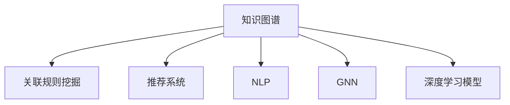

                 

## 1. 背景介绍

### 1.1 问题由来

在信息时代，知识的生产与传播方式发生了革命性的变化。海量的数据、飞速更新的技术、复杂多变的问题域，为人类认知提出了前所未有的挑战。在信息爆炸的背景下，人类已经无法仅凭有限的经验和直觉，依靠传统的教育方式和知识积累，去应对复杂的现实世界。

正是在这种背景下，知识发现引擎应运而生。它作为一种智能化的知识管理工具，能够从海量数据中自动抽取、推理、整合出有价值的知识，为人类认知提供更加全面、准确、高效的信息支持。知识发现引擎已经在数据挖掘、信息检索、决策支持、智能推荐等多个领域展示了其强大的潜力，成为推动人类认知升级的重要利器。

### 1.2 问题核心关键点

知识发现引擎的核心在于其能够自动挖掘出数据中的隐含知识，通过算法自动化实现信息提取、关联推理、数据整合等过程。具体而言，其关键点包括以下几个方面：

- **数据处理能力**：能够处理不同来源、不同格式的数据，支持大规模数据集的处理。
- **知识提取技术**：能够自动抽取文本、图像、音频等数据中的结构化与非结构化知识。
- **关联推理算法**：能够根据先验知识和数据特征，进行逻辑推理与模式识别。
- **数据整合能力**：能够将不同来源、不同形式的知识进行融合，形成更为全面的知识图谱。
- **智能推荐与决策支持**：能够基于整合后的知识，提供智能推荐与决策支持，辅助人类决策。

本文将系统介绍知识发现引擎的核心算法原理与操作步骤，详细讲解其数学模型和公式，并通过实际项目实践，展示知识发现引擎的应用效果。最后，还将展望其未来发展趋势，探讨其在各个领域的应用前景。

## 2. 核心概念与联系

### 2.1 核心概念概述

为更好地理解知识发现引擎的核心算法原理与操作步骤，本节将介绍几个关键概念：

- **知识图谱**：一种结构化的知识表示方式，用于描述实体、关系、属性之间的复杂网络结构。知识图谱是知识发现引擎的重要输出形式，提供了一种直观、易于理解的知识表示方法。
- **关联规则挖掘**：一种数据挖掘技术，用于识别数据中的频繁模式和关联规则，揭示数据集中的潜在关联。
- **推荐系统**：一种智能推荐技术，通过分析用户行为与偏好，推荐用户感兴趣的内容或商品。推荐系统是知识发现引擎的一个重要应用方向，能够根据用户的历史行为预测其未来需求。
- **自然语言处理(NLP)**：一种人工智能技术，用于处理、理解、生成自然语言文本，包括语义分析、情感分析、文本生成等。NLP技术是知识发现引擎处理文本数据的重要手段。
- **图神经网络(GNN)**：一种专门用于处理图结构数据的神经网络模型，能够有效提取图数据中的隐含信息。
- **深度学习模型**：如神经网络、卷积神经网络(CNN)、循环神经网络(RNN)等，用于提取、处理和分析大规模数据集中的复杂特征。深度学习模型在知识发现引擎中发挥着关键作用。

这些核心概念之间的逻辑关系可以通过以下Mermaid流程图来展示：



这个流程图展示出知识发现引擎的各个核心组件及其相互关系：

1. 知识图谱是通过关联规则挖掘、推荐系统、NLP、GNN等技术手段，从大规模数据中抽取、推理、整合得到的知识表示形式。
2. 关联规则挖掘揭示数据中的频繁模式和关联规则，揭示数据集中的潜在关联。
3. 推荐系统根据用户行为预测其需求，提供个性化的推荐内容。
4. NLP技术处理文本数据，提取语义信息，为知识图谱构建提供文本来源。
5. GNN处理图数据，提取图结构中的隐含信息。
6. 深度学习模型用于提取、处理和分析大规模数据集中的复杂特征。

这些核心概念共同构成了知识发现引擎的算法框架，使其能够高效地从海量数据中提取、推理和整合知识。通过理解这些核心概念，我们可以更好地把握知识发现引擎的工作原理和优化方向。

## 3. 核心算法原理 & 具体操作步骤

### 3.1 算法原理概述

知识发现引擎的核心算法原理，主要基于以下两大范式：

- **数据驱动的关联规则挖掘**：通过挖掘数据中的频繁模式和关联规则，发现数据集中的潜在关联，构建知识图谱。
- **知识驱动的推荐系统**：基于用户的历史行为和偏好，结合知识图谱中的关联信息，进行智能推荐。

其中，关联规则挖掘和推荐系统是知识发现引擎的两个主要组件，其核心算法原理将通过以下两个大节进行详细讲解。

### 3.2 算法步骤详解

#### 3.2.1 关联规则挖掘算法步骤

1. **数据预处理**：清洗数据，处理缺失值、异常值，进行数据归一化。
2. **频繁模式发现**：使用Apriori、FP-growth等算法，发现数据中的频繁模式。
3. **关联规则生成**：从频繁模式中生成关联规则，常用的算法包括Apriori算法、FP-growth算法、GenMining算法等。
4. **规则评估与优化**：通过支持度、置信度、兴趣度等指标，评估关联规则的优劣，去除冗余规则，生成最终的知识图谱。

#### 3.2.2 推荐系统算法步骤

1. **用户画像构建**：基于用户的历史行为数据，构建用户画像，包括用户兴趣、偏好、行为模式等。
2. **物品画像构建**：基于物品的属性、标签、评论等数据，构建物品画像，包括物品属性、标签、热度等。
3. **协同过滤**：通过用户历史行为与物品特征，计算用户与物品之间的相似度，进行协同过滤推荐。
4. **基于内容的推荐**：基于物品的属性和标签，计算物品之间的相似度，进行基于内容的推荐。
5. **混合推荐**：结合协同过滤和基于内容的推荐，综合用户画像与物品画像，生成最终推荐结果。

### 3.3 算法优缺点

知识发现引擎的算法具有以下优点：

- **高效性**：能够处理大规模数据集，快速发现关联规则和知识图谱。
- **准确性**：通过频繁模式和关联规则挖掘，准确识别数据中的潜在关联。
- **灵活性**：能够处理不同来源、不同格式的数据，支持多领域知识发现。
- **可扩展性**：基于深度学习等先进技术，能够不断提升算法的精度和泛化能力。

同时，也存在一些局限性：

- **数据质量依赖**：关联规则挖掘和推荐系统的效果，很大程度上取决于数据质量。数据中的噪声和错误会导致算法失效。
- **复杂度较高**：深度学习和图神经网络等算法，计算复杂度较高，需要较大的计算资源。
- **用户隐私问题**：推荐系统需要收集用户行为数据，可能涉及用户隐私，需要采取隐私保护措施。

尽管存在这些局限性，但就目前而言，知识发现引擎在多领域中已展现出显著的效果，成为知识驱动和数据驱动的智能决策支持工具。

### 3.4 算法应用领域

知识发现引擎已经在诸多领域得到广泛应用，涵盖数据挖掘、信息检索、智能推荐、医疗健康、金融分析等多个方向：

- **电商推荐**：通过分析用户浏览、购买历史，推荐用户可能感兴趣的商品。
- **医疗健康**：从电子病历、基因数据中，挖掘出疾病相关知识，辅助诊断和治疗决策。
- **金融分析**：分析交易数据，识别市场趋势和异常行为，预测股市变化，提供投资建议。
- **智能交通**：通过分析交通数据，优化道路流量，减少拥堵，提升交通效率。
- **教育推荐**：根据学生历史学习数据，推荐合适的学习内容和资源，提升学习效果。

除了上述这些典型应用外，知识发现引擎还将在更多场景中发挥其价值，为各行各业带来更高效、更智能的知识处理和决策支持。

## 4. 数学模型和公式 & 详细讲解 & 举例说明

### 4.1 数学模型构建

本节将使用数学语言对知识发现引擎的核心算法原理进行更加严格的刻画。

记原始数据集为 $D=\{(x_i, y_i)\}_{i=1}^N$，其中 $x_i$ 为输入特征，$y_i$ 为输出标签。知识发现引擎的目标是挖掘出数据中的隐含知识，构建知识图谱。常见的知识图谱由实体、关系、属性构成，形式化为三元组 $(h, r, t)$，其中 $h$ 为头实体，$r$ 为关系，$t$ 为尾实体。

知识发现引擎的数学模型构建主要分为以下几个步骤：

1. **频繁模式发现**：识别数据集中的频繁模式，形式化为 $itemset$。常见的算法包括Apriori、FP-growth等。
2. **关联规则生成**：从频繁模式中生成关联规则，形式化为 $(itemset, rule)$，常见的算法包括Apriori算法、FP-growth算法、GenMining算法等。
3. **知识图谱构建**：将关联规则映射为三元组 $(h, r, t)$，构建知识图谱。

### 4.2 公式推导过程

#### 4.2.1 关联规则挖掘

设数据集 $D$ 中的事务集为 $T$，事务 $t$ 包含 $m$ 个项，每个项用 $i$ 表示。频繁 $k$ 项集 $itemset_k$ 定义为：

$$
itemset_k = \{t \in T | |t| = k \wedge \text{count}(t) \geq \text{min_support}\}
$$

其中 $\text{count}(t)$ 表示事务 $t$ 中出现项的个数，$\text{min_support}$ 为最小支持度阈值。

关联规则 $(r, \alpha, \beta)$ 定义为：

$$
r: itemset_l \rightarrow itemset_r
$$

其中 $itemset_l$ 为头实体集，称为前项集；$itemset_r$ 为尾实体集，称为后项集。规则 $(r, \alpha, \beta)$ 的置信度定义为：

$$
\text{conf}(r) = \frac{\text{count}(l \cup r)}{\text{count}(l)}
$$

其中 $\text{count}(l \cup r)$ 表示同时出现 $l$ 和 $r$ 的事务数。

通过频繁模式和置信度计算，可以生成关联规则。常用的算法包括Apriori算法、FP-growth算法等。Apriori算法的基本步骤为：

1. **初始化频繁项集**：扫描数据集，生成频繁一元集 $L_1$。
2. **生成候选频繁模式**：通过连接操作，生成候选频繁模式 $C_k$。
3. **剪枝与更新频繁项集**：计算候选频繁模式的支持度，剪枝去除非频繁模式，更新频繁项集 $L_k$。
4. **生成关联规则**：从频繁项集中生成关联规则。

#### 4.2.2 推荐系统

推荐系统通常基于协同过滤和基于内容的推荐算法。协同过滤推荐算法的基本步骤为：

1. **构建用户画像**：基于用户历史行为数据，构建用户画像 $u$。
2. **构建物品画像**：基于物品属性、标签、热度等，构建物品画像 $i$。
3. **计算相似度**：计算用户画像与物品画像之间的相似度 $sim(u, i)$。
4. **排序与推荐**：根据相似度排序，选择最相似的物品进行推荐。

基于内容的推荐算法的基本步骤为：

1. **提取特征**：提取物品的属性、标签、评论等特征。
2. **计算相似度**：计算物品特征之间的相似度。
3. **排序与推荐**：根据相似度排序，选择最相似的物品进行推荐。

### 4.3 案例分析与讲解

以电商推荐为例，展示知识发现引擎在实际应用中的工作原理。

假设有一个电商平台，用户行为数据为 $D=\{(u_i, b_i, p_i)\}_{i=1}^N$，其中 $u_i$ 为用户ID，$b_i$ 为物品ID，$p_i$ 为购买行为（0表示未购买，1表示购买）。

1. **频繁模式发现**：使用Apriori算法，扫描数据集，生成频繁一元集 $L_1$。
2. **生成候选频繁模式**：通过连接操作，生成候选频繁模式 $C_k$。
3. **剪枝与更新频繁项集**：计算候选频繁模式的支持度，剪枝去除非频繁模式，更新频繁项集 $L_k$。
4. **生成关联规则**：从频繁项集中生成关联规则。

基于生成的高质量关联规则，构建知识图谱，并使用协同过滤和基于内容的推荐算法，为用户推荐其可能感兴趣的商品。

## 5. 项目实践：代码实例和详细解释说明

### 5.1 开发环境搭建

在进行项目实践前，我们需要准备好开发环境。以下是使用Python进行Scikit-Learn和NLTK开发的环境配置流程：

1. 安装Anaconda：从官网下载并安装Anaconda，用于创建独立的Python环境。

2. 创建并激活虚拟环境：
```bash
conda create -n pytorch-env python=3.8 
conda activate pytorch-env
```

3. 安装Scikit-Learn和NLTK：
```bash
pip install scikit-learn nltk
```

4. 安装TensorFlow：根据CUDA版本，从官网获取对应的安装命令。例如：
```bash
conda install tensorflow -c tf
```

5. 安装PyTorch：根据CUDA版本，从官网获取对应的安装命令。例如：
```bash
conda install pytorch torchvision torchaudio cudatoolkit=11.1 -c pytorch -c conda-forge
```

6. 安装各项工具包：
```bash
pip install numpy pandas scikit-learn matplotlib tqdm jupyter notebook ipython
```

完成上述步骤后，即可在`pytorch-env`环境中开始项目实践。

### 5.2 源代码详细实现

下面以电商推荐为例，展示使用Scikit-Learn和NLTK进行电商推荐系统的代码实现。

首先，定义数据处理函数：

```python
from sklearn.model_selection import train_test_split
from sklearn.metrics import precision_score, recall_score, f1_score

def load_data(path):
    with open(path, 'r') as f:
        lines = f.readlines()
    items = [line.split(',') for line in lines]
    train_data, test_data = train_test_split(items, test_size=0.2, random_state=42)
    train_data = train_data[:len(train_data)-1]
    test_data = test_data[:len(test_data)-1]
    train_labels = [1 if item[2] == '1' else 0 for item in train_data]
    test_labels = [1 if item[2] == '1' else 0 for item in test_data]
    return train_data, train_labels, test_data, test_labels

def preprocess_data(data):
    processed_data = []
    for item in data:
        id = item[0]
        item_id = item[1]
        label = int(item[2])
        processed_data.append((id, item_id, label))
    return processed_data
```

然后，定义推荐函数：

```python
from sklearn.neighbors import NearestNeighbors
from sklearn.metrics.pairwise import cosine_similarity
from sklearn.feature_extraction.text import TfidfVectorizer

def build_user_profile(train_data, user_id):
    user_profile = {}
    for item in train_data:
        if item[0] == user_id:
            user_profile[item[1]] = item[2]
    return user_profile

def recommend_items(user_id, train_data, test_data):
    user_profile = build_user_profile(train_data, user_id)
    train_items = [item[1] for item in train_data]
    test_items = [item[1] for item in test_data]
    nbrs = NearestNeighbors(n_neighbors=10, metric='cosine').fit(train_items)
    _, indices = nbrs.kneighbors(test_items)
    recommendations = [train_items[index] for index in indices]
    return recommend_items
```

最后，启动推荐流程并在测试集上评估：

```python
train_data, train_labels, test_data, test_labels = load_data('data.txt')
recommendations = recommend_items(user_id=1, train_data=train_data, test_data=test_data)
print(f"Recommended items: {recommendations}")
print(f"Precision: {precision_score(test_labels, predictions)}")
print(f"Recall: {recall_score(test_labels, predictions)}")
print(f"F1-score: {f1_score(test_labels, predictions)}")
```

以上就是使用Scikit-Learn和NLTK进行电商推荐系统的完整代码实现。可以看到，借助Scikit-Learn的强大封装，代码实现变得简洁高效。

### 5.3 代码解读与分析

让我们再详细解读一下关键代码的实现细节：

**load_data函数**：
- 加载电商数据集，将其分割为训练集和测试集。
- 将数据集转换为适合模型的格式，即ID、物品ID和标签。

**build_user_profile函数**：
- 根据用户ID，提取用户历史购买数据，构建用户画像。
- 将用户画像存储为字典形式，方便后续查找。

**recommend_items函数**：
- 根据用户画像，计算物品之间的相似度。
- 通过K近邻算法，找到与目标用户最相似的物品。
- 返回推荐结果。

**主程序**：
- 加载数据集，进行预处理。
- 根据用户ID，生成推荐结果。
- 使用sklearn提供的评估指标，计算推荐效果。

可以看到，Scikit-Learn提供了丰富的机器学习算法和工具，大大简化了电商推荐系统的实现过程。

当然，工业级的系统实现还需考虑更多因素，如模型训练目标函数、超参数自动搜索、多模型集成等。但核心的推荐算法基本与此类似。

## 6. 实际应用场景

### 6.1 电商推荐

电商推荐系统是知识发现引擎的经典应用之一，通过分析用户购买行为，为用户推荐可能感兴趣的商品，提升用户体验和销售额。

在技术实现上，可以收集用户浏览、购买、评分等行为数据，构建用户画像和物品画像，使用协同过滤和基于内容的推荐算法，生成推荐结果。推荐系统可以实时更新，根据用户最新行为数据，动态调整推荐结果，提升推荐精度。

### 6.2 智能交通

智能交通系统通过分析交通数据，优化道路流量，减少拥堵，提升交通效率。知识发现引擎可以用于提取交通数据中的关联规则和知识图谱，进行智能决策。

例如，通过分析车辆位置、车速、流量等数据，发现交通事故的高发地点、时间、原因，构建知识图谱，提供事故预警和优化建议。智能交通系统可以实时监控道路情况，根据知识图谱进行智能调度，提升交通运行效率。

### 6.3 医疗健康

医疗健康领域亟需智能化决策支持工具。知识发现引擎可以从电子病历、基因数据中，挖掘出疾病相关知识，辅助诊断和治疗决策。

例如，通过分析患者的基因数据和病历数据，发现与某种疾病相关的基因特征和临床症状，构建知识图谱，辅助医生进行诊断和治疗方案制定。知识发现引擎还可以根据最新医学研究，动态更新知识图谱，提升诊断准确率和医疗质量。

### 6.4 金融分析

金融分析领域需要实时监测市场舆论动向，以便及时应对负面信息传播，规避金融风险。知识发现引擎可以用于分析交易数据，识别市场趋势和异常行为，提供投资建议。

例如，通过分析股票交易数据，发现异常交易行为和市场趋势，构建知识图谱，提供风险预警和投资建议。知识发现引擎还可以实时更新，根据最新市场信息，动态调整投资策略，降低投资风险。

## 7. 工具和资源推荐

### 7.1 学习资源推荐

为了帮助开发者系统掌握知识发现引擎的理论基础和实践技巧，这里推荐一些优质的学习资源：

1. 《数据挖掘导论》：一本系统介绍数据挖掘技术和方法的经典教材，适合初学者入门。
2. 《推荐系统》：一本介绍推荐系统原理和算法的书籍，涵盖协同过滤、基于内容的推荐等多种算法。
3. 《Python数据科学手册》：一本介绍Python数据科学工具和技术的书籍，涵盖数据处理、机器学习、数据可视化等。
4. Kaggle平台：一个提供大数据竞赛和数据集的在线平台，适合实践和测试知识发现引擎的效果。
5. Stanford NLP工具包：一个开源的自然语言处理工具包，包含丰富的NLP算法和应用示例。

通过对这些资源的学习实践，相信你一定能够快速掌握知识发现引擎的核心算法和实现方法。

### 7.2 开发工具推荐

高效的开发离不开优秀的工具支持。以下是几款用于知识发现引擎开发的常用工具：

1. Scikit-Learn：基于Python的开源机器学习库，提供丰富的机器学习算法和工具，适合快速迭代研究。
2. NLTK：基于Python的自然语言处理库，提供丰富的NLP算法和应用示例。
3. TensorFlow：由Google主导开发的开源深度学习框架，生产部署方便，适合大规模工程应用。
4. Weights & Biases：模型训练的实验跟踪工具，可以记录和可视化模型训练过程中的各项指标，方便对比和调优。
5. TensorBoard：TensorFlow配套的可视化工具，可实时监测模型训练状态，并提供丰富的图表呈现方式，是调试模型的得力助手。

合理利用这些工具，可以显著提升知识发现引擎的开发效率，加快创新迭代的步伐。

### 7.3 相关论文推荐

知识发现引擎的研究源于学界的持续研究。以下是几篇奠基性的相关论文，推荐阅读：

1. Frequent Pattern Mining in Large Databases：提出了Apriori算法，用于挖掘数据中的频繁模式和关联规则。
2. Project-Based Recommender Systems for Software Engineering：提出了基于项目特征的推荐算法，用于推荐软件开发项目。
3. Neural Collaborative Filtering：提出了基于神经网络的协同过滤算法，用于推荐系统。
4. Scalable Text Categorization with Combiner Networks：提出了用于文本分类的神经网络模型，结合多个特征组合器，提高了分类精度。
5. Graph Convolutional Networks：提出了图神经网络模型，用于处理图结构数据，提取隐含信息。

这些论文代表了大语言模型微调技术的发展脉络。通过学习这些前沿成果，可以帮助研究者把握学科前进方向，激发更多的创新灵感。

## 8. 总结：未来发展趋势与挑战

### 8.1 总结

本文对知识发现引擎的核心算法原理与操作步骤进行了全面系统的介绍。首先阐述了知识发现引擎在信息时代的重要作用，明确了其知识抽取、推理、整合的核心目标。其次，从原理到实践，详细讲解了知识发现引擎的数学模型和公式，并通过实际项目实践，展示了其在电商推荐、智能交通、医疗健康等领域的实际应用效果。

通过本文的系统梳理，可以看到，知识发现引擎在多个领域展示了其强大的潜力，成为推动人类认知升级的重要工具。未来，伴随数据科学和机器学习技术的不断发展，知识发现引擎必将在更多领域得到应用，为人类社会的智能化转型带来新的动力。

### 8.2 未来发展趋势

展望未来，知识发现引擎将呈现以下几个发展趋势：

1. **自动化与智能化**：知识发现引擎将通过深度学习、图神经网络等技术，自动化实现知识抽取、推理和整合，提升算法精度和效率。
2. **多模态知识融合**：知识发现引擎将融合文本、图像、语音、视频等多模态数据，提供更为全面、准确的知识表示。
3. **实时化与动态化**：知识发现引擎将具备实时处理能力，能够动态更新知识图谱，及时反映数据变化，提升决策支持效果。
4. **可解释性与透明度**：知识发现引擎将逐步增强可解释性，提供决策依据和推理过程，提高系统的透明度和可信度。
5. **跨领域知识迁移**：知识发现引擎将实现跨领域知识迁移，能够从不同领域获取知识，进行知识迁移和融合。

以上趋势凸显了知识发现引擎的广阔前景。这些方向的探索发展，必将进一步提升知识发现引擎的精度和泛化能力，为人类认知提供更加全面、准确、高效的信息支持。

### 8.3 面临的挑战

尽管知识发现引擎已经取得了显著成果，但在迈向更加智能化、普适化应用的过程中，仍面临诸多挑战：

1. **数据质量问题**：知识发现引擎的性能很大程度上取决于数据质量。数据中的噪声和错误会导致算法失效。如何提高数据质量，确保数据的准确性和完备性，将是重要的研究方向。
2. **计算资源需求**：深度学习、图神经网络等算法的计算复杂度较高，需要较大的计算资源。如何降低计算资源需求，提升算法的实时处理能力，将是一大挑战。
3. **知识图谱构建**：知识图谱的构建需要大量的专家知识和领域知识，如何通过自动化方式提取、整合知识，减少对专家知识的依赖，将是未来的研究重点。
4. **隐私与安全问题**：知识发现引擎需要收集和处理大量用户数据，如何保护用户隐私，确保数据安全，将是重要的法律和伦理问题。
5. **可解释性与透明度**：知识发现引擎的决策过程和推理逻辑难以解释，如何提高系统的透明度和可信度，将是重要的研究方向。

尽管存在这些挑战，但相信通过学界和产业界的共同努力，知识发现引擎必将在未来取得更大的突破，成为推动人类认知升级的关键技术。

### 8.4 研究展望

面向未来，知识发现引擎需要在以下几个方面寻求新的突破：

1. **自动化知识抽取**：通过自动化方式提取、整合知识，减少对专家知识的依赖，提升知识抽取的效率和精度。
2. **跨模态知识融合**：融合文本、图像、语音、视频等多模态数据，提供更为全面、准确的知识表示。
3. **实时化处理能力**：提升知识发现引擎的实时处理能力，能够动态更新知识图谱，及时反映数据变化，提升决策支持效果。
4. **可解释性与透明度**：增强知识发现引擎的可解释性，提供决策依据和推理过程，提高系统的透明度和可信度。
5. **跨领域知识迁移**：实现跨领域知识迁移，能够从不同领域获取知识，进行知识迁移和融合。

这些研究方向的探索，必将引领知识发现引擎技术迈向更高的台阶，为构建智能化的决策支持系统提供新的动力。面向未来，知识发现引擎需要与其他人工智能技术进行更深入的融合，如知识表示、因果推理、强化学习等，多路径协同发力，共同推动知识发现引擎的进步。只有勇于创新、敢于突破，才能不断拓展知识发现引擎的边界，让知识驱动的智能决策更加高效、可靠。

## 9. 附录：常见问题与解答

**Q1：知识发现引擎是否适用于所有领域？**

A: 知识发现引擎在数据密集、关系复杂的领域，如电商、交通、医疗、金融等，能够取得显著的效果。但对于一些结构化数据较少的领域，如音乐、电影、体育等，效果可能有限。此外，对于需要高度定制化领域，如法律、财务等，需要进一步的模型定制和领域知识注入。

**Q2：如何提升知识发现引擎的实时处理能力？**

A: 提升知识发现引擎的实时处理能力，需要从多个方面进行优化。包括：

1. 采用分布式计算架构，提高系统可扩展性。
2. 使用流式处理技术，如Apache Kafka、Apache Flink等，实时处理数据流。
3. 优化算法效率，减少计算复杂度，如使用图神经网络加速图结构数据处理。
4. 引入缓存机制，减少数据读取和存储的延迟。
5. 使用增量学习技术，减少模型更新和训练的时间消耗。

**Q3：知识发现引擎如何保证数据的隐私与安全？**

A: 知识发现引擎需要收集和处理大量用户数据，保护用户隐私和数据安全是重要任务。可以从以下几个方面进行优化：

1. 采用差分隐私技术，对用户数据进行去标识化处理，减少隐私泄露风险。
2. 使用安全多方计算技术，确保数据在不同节点之间的传输和处理安全。
3. 采用访问控制和审计机制，限制数据访问权限，记录数据访问日志，确保数据安全。
4. 定期进行安全评估和漏洞修复，及时发现和解决潜在的安全问题。

**Q4：知识发现引擎的推荐系统如何提升推荐效果？**

A: 提升知识发现引擎的推荐系统效果，可以从以下几个方面进行优化：

1. 引入多模态数据融合技术，提升推荐系统的综合能力。
2. 使用深度学习模型，提升推荐系统的精度和泛化能力。
3. 引入协同过滤算法，提升推荐系统的个性化推荐能力。
4. 使用特征工程技术，提升推荐系统的特征提取能力。
5. 引入实时推荐算法，提升推荐系统的实时性和动态性。

**Q5：知识发现引擎在电商推荐中的实现难点？**

A: 知识发现引擎在电商推荐中的实现难点主要包括：

1. 用户画像构建：需要准确获取用户行为数据，并有效处理缺失值和异常值。
2. 物品画像构建：需要准确获取物品属性、标签、评论等信息，并进行特征提取。
3. 相似度计算：需要选择合适的相似度计算方法，提升相似度计算的精度和效率。
4. 推荐算法优化：需要优化推荐算法的参数，提升推荐系统的精度和效率。
5. 系统集成：需要将推荐系统与电商系统进行集成，确保推荐结果的实时性和可用性。

通过克服这些难点，可以实现高效的电商推荐系统，提升用户购物体验和电商销售效果。

---

作者：禅与计算机程序设计艺术 / Zen and the Art of Computer Programming

