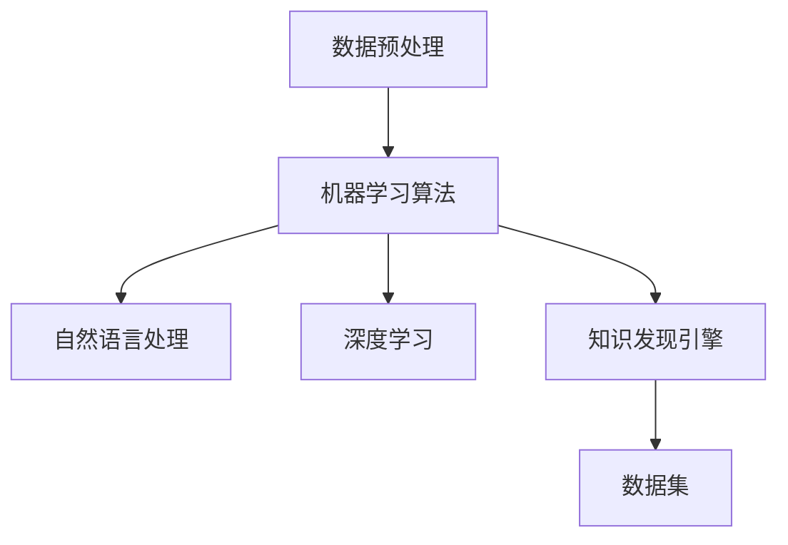

                 

# 知识发现引擎：助力医疗领域的智慧转型

## 1. 背景介绍

### 1.1 问题由来

随着信息技术和人工智能(AI)技术的快速发展，医疗健康领域正经历着前所未有的变革。大数据、云计算、机器学习等技术的深度应用，正在改变传统医疗服务的模式，提升医疗决策的科学性和精准性。然而，医疗数据的海量、复杂和多样性，使得传统的数据处理方法难以适应。如何高效、准确地从海量医疗数据中提取有用知识，成为医疗领域智慧转型的关键问题。

知识发现(Knowledge Discovery in Databases, KDD)是一种数据挖掘技术，旨在从大量数据中发现模式、趋势和规律，为决策提供依据。在医疗领域，知识发现引擎(Knowledge Discovery Engine, KDE)利用大数据、AI等技术，帮助医生、医院和研究人员在海量数据中提取有用信息，从而改善医疗服务，提升诊断和治疗的精准性。

### 1.2 问题核心关键点

知识发现引擎在医疗领域的核心关键点主要包括：

- **海量数据处理**：医疗数据通常涉及病人病历、影像数据、基因组数据等，数据量庞大、类型多样。如何高效处理、存储和分析这些数据，是知识发现引擎面临的首要挑战。
- **多模态数据融合**：医疗数据不仅包含文本和数值型数据，还包括图像、视频等非结构化数据。如何融合不同模态的数据，提取跨模态的有用知识，是知识发现引擎的重要目标。
- **个性化医疗**：医疗服务需要针对每个病人的个性化需求，提供定制化的诊疗方案。知识发现引擎应能够从多源数据中，提取与病人具体状况相关的信息，为个性化医疗提供支持。
- **实时决策支持**：在临床诊疗、医疗管理、公共卫生等领域，实时、准确的信息支持至关重要。知识发现引擎应具备快速响应、实时更新数据的能力。
- **医疗伦理和隐私**：医疗数据涉及病人的隐私和敏感信息，知识发现引擎需要遵守数据保护和隐私原则，确保数据使用的合法合规性。

### 1.3 问题研究意义

知识发现引擎在医疗领域的研发和应用，具有以下重要意义：

- **提升医疗服务质量**：通过数据挖掘和分析，发现潜在的诊断和治疗方案，辅助医生进行决策，提升诊断和治疗的精准性。
- **优化医疗资源配置**：帮助医院管理层了解资源使用情况，优化资源配置，提升运营效率。
- **促进公共卫生研究**：利用大数据和AI技术，分析流行病学数据，预测疾病趋势，提升公共卫生应对能力。
- **推动智慧医疗发展**：将知识发现引擎与移动医疗、远程医疗等技术结合，实现医疗服务的智慧化转型。

## 2. 核心概念与联系

### 2.1 核心概念概述

为了更好地理解知识发现引擎在医疗领域的原理与应用，本节将介绍几个关键概念及其相互联系：

- **知识发现(KDD)**：利用数据挖掘、统计学、机器学习等技术，从大量数据中发现有用知识和规律的过程。

- **知识发现引擎(KDE)**：一种自动化、智能化的知识发现工具，能够自动处理、分析和挖掘大量医疗数据，发现潜在的有用信息。

- **数据预处理**：包括数据清洗、归一化、特征选择等步骤，旨在提高数据质量和分析效率。

- **机器学习算法**：如分类、聚类、回归等，用于发现数据中的模式和规律，进行预测和分类。

- **自然语言处理(NLP)**：用于处理和理解自然语言文本数据，提取有用信息，如图表、命名实体等。

- **深度学习**：利用神经网络模型处理复杂数据结构，如卷积神经网络(CNN)、循环神经网络(RNN)等，用于图像、文本、时间序列数据的分析。

- **医疗数据集**：包含病人的病历、影像、基因组等数据，是知识发现引擎的数据基础。

这些概念之间的联系可以通过以下Mermaid流程图来展示：



这个流程图展示了知识发现引擎的核心工作流程：通过预处理数据，应用机器学习、深度学习等技术，利用自然语言处理提取有用信息，最终通过知识发现引擎挖掘出有价值的知识。

## 3. 核心算法原理 & 具体操作步骤

### 3.1 算法原理概述

知识发现引擎的基本原理是通过数据预处理、特征提取、模型训练和知识发现等步骤，从原始医疗数据中挖掘出有用信息。其核心算法包括：

- **数据预处理算法**：用于清洗、归一化和特征选择等，提高数据质量和分析效率。
- **机器学习算法**：用于分类、聚类、回归等任务，发现数据中的模式和规律。
- **自然语言处理算法**：用于文本数据的处理和理解，提取图表、命名实体等结构化信息。
- **深度学习算法**：利用神经网络模型处理复杂数据结构，如图像、文本、时间序列数据。

### 3.2 算法步骤详解

基于上述算法原理，知识发现引擎的工作流程可以划分为以下几个步骤：

**Step 1: 数据预处理**

- **数据清洗**：去除重复、缺失和异常值，确保数据质量。
- **数据归一化**：将不同范围的数据归一化到[0,1]或[-1,1]等标准范围内，便于模型处理。
- **特征选择**：选择对目标任务有显著影响的重要特征，去除冗余特征，减少计算复杂度。

**Step 2: 特征提取**

- **文本处理**：利用自然语言处理技术，提取文本数据中的关键词、短语和句子等结构化信息。
- **图像处理**：通过图像分割、特征提取等技术，从影像数据中提取出有用的结构特征。
- **时间序列处理**：利用时间序列分析技术，提取时间序列数据中的趋势和周期性特征。

**Step 3: 模型训练**

- **模型选择**：根据数据类型和任务需求，选择合适的机器学习或深度学习模型。
- **参数优化**：通过交叉验证等技术，优化模型的参数，提高模型的预测精度。
- **模型评估**：在验证集上评估模型的性能，选择最优模型。

**Step 4: 知识发现**

- **知识挖掘**：利用数据挖掘技术，从训练数据中发现潜在的模式和规律。
- **结果呈现**：将发现的知识以图表、报告等形式呈现，供医生、研究人员和医院管理层参考。

### 3.3 算法优缺点

知识发现引擎在医疗领域的应用具有以下优点：

- **高效性**：通过自动化处理和分析，显著提高数据处理效率，减少人工干预。
- **准确性**：利用机器学习和深度学习算法，发现数据中的潜在模式和规律，提高诊断和治疗的准确性。
- **灵活性**：可以灵活应对不同类型的医疗数据，涵盖文本、图像、时间序列等数据类型。
- **可扩展性**：支持大规模数据处理和分析，可以逐步扩展数据处理能力，适应更多医疗数据。

同时，知识发现引擎也存在一些缺点：

- **依赖数据质量**：对原始数据的质量要求较高，数据清洗和预处理过程复杂。
- **模型复杂度**：应用深度学习等复杂模型，需要较高的计算资源和专业知识。
- **结果解释性不足**：模型结果通常缺乏可解释性，难以提供直观、易懂的解释。
- **隐私和安全问题**：医疗数据涉及病人隐私，如何保护数据安全，防止数据滥用，是重要挑战。

### 3.4 算法应用领域

知识发现引擎在医疗领域的应用非常广泛，包括但不限于以下几个方面：

- **临床诊断**：利用机器学习算法，分析病人的病历、影像等数据，辅助医生进行诊断。
- **治疗方案优化**：通过分析历史病例数据，发现最有效的治疗方案，提供个性化治疗建议。
- **疾病预测**：利用时间序列分析等技术，预测疾病的发生和发展趋势，提供预防和预警机制。
- **医疗资源优化**：分析医院的资源使用情况，优化资源配置，提升运营效率。
- **公共卫生研究**：分析流行病学数据，发现疾病传播规律，提供公共卫生决策支持。

## 4. 数学模型和公式 & 详细讲解 & 举例说明

### 4.1 数学模型构建

知识发现引擎的数学模型构建主要包括以下几个步骤：

1. **数据预处理模型**：
   - **数据清洗模型**：去除噪声和异常值，确保数据质量。
   - **数据归一化模型**：将数据归一化到标准范围内。

2. **特征提取模型**：
   - **文本处理模型**：提取关键词、短语等结构化信息。
   - **图像处理模型**：提取图像中的特征点。
   - **时间序列模型**：提取趋势和周期性特征。

3. **机器学习模型**：
   - **分类模型**：如决策树、随机森林、支持向量机等，用于分类任务。
   - **聚类模型**：如K-Means、层次聚类等，用于发现数据中的簇。
   - **回归模型**：如线性回归、岭回归、Lasso回归等，用于数值型数据的预测。

4. **深度学习模型**：
   - **卷积神经网络(CNN)**：用于处理图像数据。
   - **循环神经网络(RNN)**：用于处理时间序列数据。
   - **注意力机制(Attention)**：用于提取文本中的关键信息。

### 4.2 公式推导过程

以分类模型为例，展示其基本公式和推导过程：

**数据清洗模型**：
- **去噪模型**：
  $$
  \hat{x}_i = \begin{cases}
  x_i, & \text{if } x_i \in D \\
  \bar{x}, & \text{otherwise}
  \end{cases}
  $$
  其中，$\hat{x}_i$ 表示清洗后的数据，$D$ 为数据集，$\bar{x}$ 为异常值。

**数据归一化模型**：
- **标准化模型**：
  $$
  x_i^* = \frac{x_i - \mu}{\sigma}
  $$
  其中，$\mu$ 为均值，$\sigma$ 为标准差，$x_i^*$ 为归一化后的数据。

**文本处理模型**：
- **TF-IDF模型**：
  $$
  TF = \frac{\text{Term Frequency}}{\text{Total Document Frequency}}
  $$
  $$
  IDF = \log \frac{N}{DF}
  $$
  $$
  TF-IDF = TF \times IDF
  $$
  其中，$TF$ 为词频，$IDF$ 为逆文档频率，$N$ 为总文档数，$DF$ 为包含该词的文档数。

**图像处理模型**：
- **SIFT特征提取模型**：
  $$
  s_i = s_i \times s_k
  $$
  其中，$s_i$ 为图像的SIFT特征向量，$s_k$ 为高斯核。

**时间序列模型**：
- **ARIMA模型**：
  $$
  Y_t = c + \sum_{i=1}^p \phi_i Y_{t-i} + \sum_{j=1}^q \theta_j \epsilon_{t-j}
  $$
  $$
  \epsilon_t = \sigma \epsilon_{t-1}
  $$
  其中，$Y_t$ 为时间序列数据，$\phi_i$ 和 $\theta_j$ 为模型参数，$c$ 为常数，$\epsilon_t$ 为随机误差，$\sigma$ 为误差方差。

### 4.3 案例分析与讲解

**案例1：病历数据分析**

假设有医院收集了10000名病人的病历数据，每个病历包含病人的基本信息、症状描述、检查结果、诊断结果等字段。

- **数据预处理**：首先对病历进行去噪和归一化处理，去除缺失值和异常值，将症状和检查结果归一化到[0,1]范围内。

- **特征提取**：提取病人的基本信息、症状、检查结果等字段作为特征，使用TF-IDF模型提取症状的关键词，使用卷积神经网络提取影像数据的特征点。

- **模型训练**：选择随机森林作为分类模型，在验证集上优化模型参数，选择最优模型。

- **知识发现**：利用优化后的随机森林模型，对新病历进行分类预测，发现病人的疾病类型，辅助医生进行诊断。

**案例2：基因组数据分析**

某生物研究所收集了10000个病人的基因组数据，每个基因组包含多个基因的信息，包括基因序列、基因表达量等字段。

- **数据预处理**：对基因组数据进行去噪和归一化处理，去除缺失值和异常值，将基因序列归一化到[0,1]范围内。

- **特征提取**：提取基因的表达量等字段作为特征，使用循环神经网络提取基因序列的时间序列特征。

- **模型训练**：选择LSTM作为回归模型，在验证集上优化模型参数，选择最优模型。

- **知识发现**：利用优化后的LSTM模型，对新基因组数据进行回归预测，发现基因与疾病之间的关系，提供个性化治疗方案。

## 5. 项目实践：代码实例和详细解释说明

### 5.1 开发环境搭建

在进行知识发现引擎的开发实践前，需要先准备好开发环境。以下是使用Python进行开发的环境配置流程：

1. 安装Anaconda：从官网下载并安装Anaconda，用于创建独立的Python环境。

2. 创建并激活虚拟环境：
```bash
conda create -n kde-env python=3.8 
conda activate kde-env
```

3. 安装PyTorch、TensorFlow、Pandas等库：
```bash
pip install torch torchvision torchaudio pandas scikit-learn matplotlib tqdm jupyter notebook ipython
```

4. 安装TensorFlow等深度学习框架：
```bash
pip install tensorflow==2.4
```

5. 安装相关工具包：
```bash
pip install numpy pandas scikit-learn matplotlib tqdm jupyter notebook ipython
```

完成上述步骤后，即可在`kde-env`环境中开始知识发现引擎的开发实践。

### 5.2 源代码详细实现

下面以病历数据分析为例，给出使用Python进行知识发现引擎开发的代码实现。

首先，定义数据预处理函数：

```python
import pandas as pd
import numpy as np

def preprocess_data(data):
    # 数据清洗
    data = data.dropna()
    
    # 数据归一化
    data['x'] = (data['x'] - np.mean(data['x'])) / np.std(data['x'])
    
    return data
```

然后，定义特征提取函数：

```python
from sklearn.feature_extraction.text import TfidfVectorizer
from sklearn.preprocessing import StandardScaler
from sklearn.decomposition import PCA

def extract_features(data):
    # 文本特征提取
    tfidf = TfidfVectorizer()
    tfidf_matrix = tfidf.fit_transform(data['text'])
    
    # 数值特征归一化
    scaler = StandardScaler()
    numerical_features = scaler.fit_transform(data[['x']])
    
    # 特征融合
    features = np.hstack((tfidf_matrix.toarray(), numerical_features))
    
    return features
```

接着，定义模型训练函数：

```python
from sklearn.ensemble import RandomForestClassifier

def train_model(features, labels):
    # 模型选择
    model = RandomForestClassifier()
    
    # 模型训练
    model.fit(features, labels)
    
    return model
```

最后，定义知识发现函数：

```python
def discover_knowledge(model, new_data):
    # 特征提取
    new_features = extract_features(new_data)
    
    # 知识发现
    predictions = model.predict(new_features)
    
    return predictions
```

启动整个流程：

```python
# 加载数据集
data = pd.read_csv('data.csv')

# 数据预处理
processed_data = preprocess_data(data)

# 特征提取
features = extract_features(processed_data)

# 模型训练
model = train_model(features, processed_data['label'])

# 知识发现
new_data = pd.read_csv('new_data.csv')
predictions = discover_knowledge(model, new_data)
```

以上就是使用Python进行病历数据分析的完整代码实现。可以看到，通过将数据预处理、特征提取、模型训练和知识发现等步骤封装成函数，知识发现引擎的开发变得更加模块化和易于维护。

### 5.3 代码解读与分析

让我们再详细解读一下关键代码的实现细节：

**preprocess_data函数**：
- 对数据进行去噪和归一化处理，去除缺失值和异常值，将数值型特征归一化到[0,1]范围内。

**extract_features函数**：
- 使用TF-IDF模型提取文本特征，将文本转换为数值型矩阵。
- 使用标准差归一化数值型特征，确保数值型特征的一致性。
- 将文本和数值型特征合并，生成综合特征矩阵。

**train_model函数**：
- 选择随机森林作为分类模型，使用交叉验证优化模型参数。

**discover_knowledge函数**：
- 对新数据进行特征提取，输入优化后的随机森林模型进行分类预测。

## 6. 实际应用场景

### 6.1 智能诊断系统

智能诊断系统利用知识发现引擎，从病人的病历、影像、基因组等数据中，提取有用信息，辅助医生进行诊断。系统通常包括以下几个模块：

- **数据接入模块**：从医院信息系统中接入病人的病历、影像等数据。
- **数据预处理模块**：对数据进行去噪、归一化等预处理。
- **特征提取模块**：使用自然语言处理、图像处理等技术，提取文本、图像等结构化信息。
- **模型训练模块**：选择合适模型，在历史病历数据上训练和优化模型。
- **知识发现模块**：对新病历数据进行分类预测，发现病人的疾病类型，辅助医生进行诊断。

通过智能诊断系统，医生可以更快速、准确地对病人进行诊断，减少误诊和漏诊的风险。同时，系统还可以自动生成诊断报告，减少医生的工作量。

### 6.2 治疗方案优化

治疗方案优化系统利用知识发现引擎，分析历史病例数据，发现最有效的治疗方案，提供个性化治疗建议。系统通常包括以下几个模块：

- **数据接入模块**：从医院信息系统中接入病人的病历、治疗方案等数据。
- **数据预处理模块**：对数据进行去噪、归一化等预处理。
- **特征提取模块**：使用自然语言处理、图像处理等技术，提取文本、图像等结构化信息。
- **模型训练模块**：选择合适模型，在历史病历数据上训练和优化模型。
- **知识发现模块**：对新病历数据进行分类预测，发现最有效的治疗方案，提供个性化治疗建议。

通过治疗方案优化系统，医生可以更快速、准确地制定治疗方案，提高治疗效果，减少不必要的医疗成本。

### 6.3 疾病预测系统

疾病预测系统利用知识发现引擎，分析流行病学数据，预测疾病的发生和发展趋势，提供预防和预警机制。系统通常包括以下几个模块：

- **数据接入模块**：从公共卫生系统中接入流行病学数据。
- **数据预处理模块**：对数据进行去噪、归一化等预处理。
- **特征提取模块**：使用时间序列分析等技术，提取时间序列数据中的趋势和周期性特征。
- **模型训练模块**：选择合适模型，在历史流行病学数据上训练和优化模型。
- **知识发现模块**：对新流行病学数据进行预测，发现疾病发生和发展趋势，提供预防和预警机制。

通过疾病预测系统，公共卫生部门可以更快速、准确地预测疾病趋势，及时采取预防措施，减少疾病对社会的危害。

## 7. 工具和资源推荐

### 7.1 学习资源推荐

为了帮助开发者系统掌握知识发现引擎的理论基础和实践技巧，这里推荐一些优质的学习资源：

1. **《机器学习》（周志华）**：系统介绍机器学习的基本概念、算法和应用，适合初学者和进阶者。
2. **《深度学习》（Ian Goodfellow）**：全面介绍深度学习的基本原理、模型和应用，适合进阶开发者。
3. **《自然语言处理综论》（Daniel Jurafsky, James H. Martin）**：详细讲解自然语言处理的基本概念、技术和应用，适合自然语言处理领域的开发者。
4. **《Python数据科学手册》（Jake VanderPlas）**：系统介绍Python在数据科学和机器学习中的应用，适合初学者和进阶者。
5. **Kaggle竞赛平台**：提供各种数据挖掘和机器学习竞赛，通过实际项目锻炼技能，适合实战型开发者。

通过对这些资源的学习实践，相信你一定能够快速掌握知识发现引擎的理论基础和实践技巧，并用于解决实际的医疗问题。

### 7.2 开发工具推荐

高效的开发离不开优秀的工具支持。以下是几款用于知识发现引擎开发的常用工具：

1. **Jupyter Notebook**：数据科学和机器学习的交互式开发环境，支持Python、R等多种语言，适合数据处理和模型训练。
2. **TensorFlow**：由Google主导开发的深度学习框架，生产部署方便，适合大规模工程应用。
3. **PyTorch**：基于Python的开源深度学习框架，灵活动态，适合研究和实验。
4. **Pandas**：Python的数据处理库，支持大规模数据处理和分析，适合数据预处理。
5. **Scikit-learn**：Python的机器学习库，包含多种机器学习算法和工具，适合模型训练和评估。
6. **NumPy**：Python的科学计算库，支持高效的数值计算和数组操作，适合数据处理和模型训练。

合理利用这些工具，可以显著提升知识发现引擎的开发效率，加快创新迭代的步伐。

### 7.3 相关论文推荐

知识发现引擎的发展源于学界的持续研究。以下是几篇奠基性的相关论文，推荐阅读：

1. **《Knowledge Discovery in Databases: An overview and critical survey》**：详细介绍了数据挖掘技术的基本概念、算法和应用，适合初学者和进阶者。
2. **《Statistical Learning with Sparsity: The Lasso and Generalizations》**：介绍了Lasso回归算法及其应用，适合机器学习领域的开发者。
3. **《Long Short-Term Memory》**：介绍了循环神经网络的基本原理和应用，适合深度学习领域的开发者。
4. **《Attention is All You Need》**：介绍了Transformer模型及其应用，适合自然语言处理领域的开发者。
5. **《Deep Learning》**：系统介绍深度学习的基本原理、模型和应用，适合进阶开发者。

这些论文代表了大数据、机器学习和深度学习领域的研究进展，是深入理解知识发现引擎的理论基础和实践技巧的重要参考资料。

## 8. 总结：未来发展趋势与挑战

### 8.1 总结

本文对知识发现引擎在医疗领域的原理与应用进行了全面系统的介绍。首先阐述了知识发现引擎的背景和意义，明确了其在医疗领域的应用价值。其次，从算法原理到实践步骤，详细讲解了知识发现引擎的工作流程和技术细节，给出了知识发现引擎的完整代码实例。同时，本文还广泛探讨了知识发现引擎在智能诊断、治疗方案优化、疾病预测等实际应用场景中的应用前景，展示了其在医疗领域的巨大潜力。最后，本文推荐了一些优质的学习资源和开发工具，为知识发现引擎的进一步研究提供了参考。

通过本文的系统梳理，可以看到，知识发现引擎在医疗领域的研发和应用，正逐渐成为医疗服务智慧转型的重要工具。它能够高效、准确地从海量医疗数据中提取有用知识，为医生的诊断和治疗提供支持，优化医疗资源的配置，推动公共卫生研究的进展，加速医疗服务的智慧化转型。

### 8.2 未来发展趋势

展望未来，知识发现引擎在医疗领域的应用将呈现以下几个发展趋势：

1. **大数据和云计算的深入应用**：随着大数据和云计算技术的不断进步，知识发现引擎将能够处理更大规模、更复杂的数据集，提升数据处理的效率和精度。
2. **深度学习与自然语言处理融合**：深度学习与自然语言处理技术的融合，将使知识发现引擎能够更好地理解和处理复杂、多样化的医疗数据，发现更深层、更有用的知识。
3. **个性化医疗的普及**：知识发现引擎将进一步应用于个性化医疗领域，从海量数据中提取与病人具体状况相关的信息，提供定制化的诊疗方案。
4. **实时决策支持**：知识发现引擎将具备实时响应、实时更新的能力，提供更快速、更准确的信息支持，提升临床诊疗和医疗管理的效率。
5. **多模态数据的融合**：知识发现引擎将能够融合多种模态的数据，如图像、视频、文本等，提供更全面、更深入的知识发现。

以上趋势凸显了知识发现引擎在医疗领域的广阔前景，它将随着技术的发展，逐步实现医疗服务的智慧化转型，为人类健康事业做出更大的贡献。

### 8.3 面临的挑战

尽管知识发现引擎在医疗领域的应用前景广阔，但在实现过程中，也面临着一些挑战：

1. **数据质量和数量**：医疗数据的质量和数量直接影响知识发现引擎的性能。数据清洗和预处理过程复杂，需要大量时间和人力投入。
2. **模型复杂度和计算资源**：深度学习等复杂模型需要较高的计算资源和专业知识，如何简化模型结构，降低计算成本，是一个重要挑战。
3. **结果的可解释性**：知识发现引擎的模型结果通常缺乏可解释性，难以提供直观、易懂的解释，如何增强模型的可解释性，是重要研究方向。
4. **数据隐私和安全**：医疗数据涉及病人隐私，如何保护数据安全，防止数据滥用，是重要挑战。
5. **知识库和规则库的整合**：知识发现引擎需要与外部知识库和规则库结合，才能提供更全面、更准确的知识发现，如何整合这些外部资源，是一个重要挑战。

这些挑战需要多方协同努力，才能克服，使知识发现引擎在医疗领域发挥更大的作用。

### 8.4 研究展望

未来的知识发现引擎研究，需要在以下几个方向寻求新的突破：

1. **无监督学习和半监督学习**：摆脱对大规模标注数据的依赖，利用无监督和半监督学习技术，提高数据处理的效率和精度。
2. **联邦学习和隐私保护**：在保护数据隐私的前提下，利用联邦学习技术，在多个医疗机构之间共享模型和数据，提升知识发现引擎的性能。
3. **多模态数据的融合和理解**：利用多模态数据融合技术，提高知识发现引擎对多种模态数据的理解能力，发现更深层次的知识。
4. **实时知识发现**：利用流式计算技术，实现知识发现引擎的实时响应和更新，提供更快速、更准确的信息支持。
5. **模型的可解释性和解释技术**：开发更可解释的知识发现模型，增强模型的解释能力，提升用户的信任度。

这些研究方向的探索，必将引领知识发现引擎在医疗领域的进一步发展，为智慧医疗的实现提供技术支撑。面向未来，知识发现引擎需要在数据处理、模型设计、隐私保护等多个维度进行全面优化，才能真正成为医疗领域的智慧转型利器。

## 9. 附录：常见问题与解答

**Q1：知识发现引擎在医疗领域有哪些具体应用？**

A: 知识发现引擎在医疗领域有以下几个具体应用：
1. **智能诊断系统**：利用病历、影像等数据，辅助医生进行诊断，提高诊断准确性。
2. **治疗方案优化**：分析历史病例数据，发现最有效的治疗方案，提供个性化治疗建议。
3. **疾病预测系统**：分析流行病学数据，预测疾病发生和发展趋势，提供预防和预警机制。
4. **医疗资源优化**：分析医院资源使用情况，优化资源配置，提升运营效率。
5. **公共卫生研究**：分析公共卫生数据，发现疾病传播规律，提供公共卫生决策支持。

**Q2：如何提高知识发现引擎的性能？**

A: 提高知识发现引擎的性能可以从以下几个方面入手：
1. **数据质量**：确保数据干净、准确、完整，减少数据清洗和预处理的工作量。
2. **模型选择**：选择适合任务的机器学习或深度学习模型，优化模型参数，提高模型的准确性。
3. **特征工程**：提取有意义的特征，减少特征维度，提高特征选择效率。
4. **数据增强**：通过数据增强技术，扩充数据集，提升模型泛化能力。
5. **模型融合**：利用模型融合技术，将多个模型的输出进行加权平均或投票，提高模型的鲁棒性。

**Q3：知识发现引擎在开发过程中需要注意哪些问题？**

A: 知识发现引擎在开发过程中需要注意以下几个问题：
1. **数据隐私和安全**：医疗数据涉及病人隐私，需要严格保护数据安全，防止数据滥用。
2. **模型可解释性**：知识发现引擎的模型结果通常缺乏可解释性，需要开发更可解释的模型，增强模型的解释能力。
3. **实时响应**：知识发现引擎需要具备实时响应、实时更新的能力，才能提供及时的信息支持。
4. **计算资源**：深度学习等复杂模型需要较高的计算资源，需要优化模型结构和计算过程，降低计算成本。
5. **多模态数据融合**：知识发现引擎需要融合多种模态的数据，如图像、视频、文本等，提升数据处理能力。

**Q4：如何利用知识发现引擎进行个性化医疗？**

A: 利用知识发现引擎进行个性化医疗可以按以下步骤进行：
1. **数据接入**：从医院信息系统中接入病人的病历、基因组等数据。
2. **数据预处理**：对数据进行去噪、归一化等预处理。
3. **特征提取**：使用自然语言处理、图像处理等技术，提取文本、图像等结构化信息。
4. **模型训练**：选择合适模型，在历史病历数据上训练和优化模型。
5. **知识发现**：对新病历数据进行分类预测，发现与病人具体状况相关的信息，提供个性化治疗建议。

**Q5：如何确保知识发现引擎的鲁棒性？**

A: 确保知识发现引擎的鲁棒性可以从以下几个方面入手：
1. **数据增强**：通过数据增强技术，扩充数据集，提升模型泛化能力。
2. **正则化技术**：应用L2正则、Dropout等正则化技术，防止模型过拟合。
3. **模型集成**：利用模型集成技术，将多个模型的输出进行加权平均或投票，提高模型的鲁棒性。
4. **对抗训练**：引入对抗样本，提高模型鲁棒性，减少误诊和漏诊的风险。
5. **数据多样性**：确保数据集的多样性，提升模型的泛化能力。

通过这些措施，可以增强知识发现引擎的鲁棒性，提高其在医疗领域的应用效果。

---

作者：禅与计算机程序设计艺术 / Zen and the Art of Computer Programming

