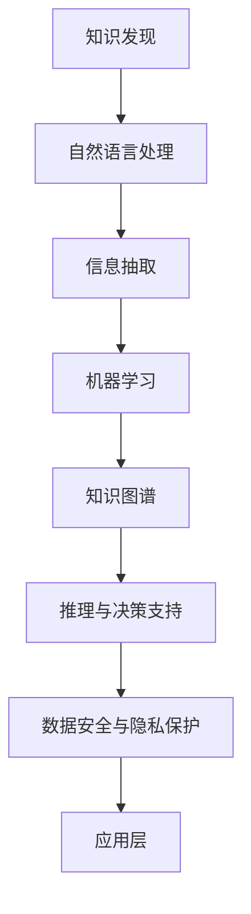

                 

## 1. 背景介绍

### 1.1 问题由来
在法律行业，传统的法律服务和咨询需要耗费大量的时间和资源。律师和法务团队通常需要处理大量的法律文本、案例、法规和合同，从中提取关键信息、分析事实、识别风险，并给出合理建议。这一过程既耗时又容易出错。法律问题常常涉及复杂的法律条文和先例，要求高度的精确度和准确性，任何遗漏或错误都可能带来严重的后果。

近年来，随着人工智能和大数据技术的迅猛发展，越来越多的法律从业者开始探索如何利用这些技术来提升工作效率和质量。知识发现引擎（Knowledge Discovery Engine, KDE）正是基于这一需求应运而生的一项技术创新。KDE是一种基于人工智能的智能分析工具，能够自动从海量法律文本中提取关键信息，识别模式和规律，从而辅助法律从业者快速做出决策。

### 1.2 问题核心关键点
KDE的核心关键点包括以下几个方面：

1. **数据采集与处理**：大规模法律数据的收集和预处理是KDE系统的基础。

2. **语义理解与分析**：KDE利用自然语言处理技术，理解文本中的法律语言和术语，提取关键信息。

3. **模式识别与建模**：通过机器学习算法，KDE识别出文本中的模式和规律，进行知识建模。

4. **推理与决策支持**：KDE能够基于已建模知识，自动进行推理和决策支持，辅助法律从业者做出精准的判断。

5. **可扩展性与可定制性**：KDE系统需要具备良好的可扩展性和可定制性，能够适应不同类型的法律问题和应用场景。

6. **安全与合规性**：法律行业对数据隐私和安全有严格要求，KDE系统需要满足相关的法律法规和行业标准。

### 1.3 问题研究意义
KDE技术的应用，对于推动法律行业的智能化转型具有重要意义：

1. **提升工作效率**：自动化提取、分析和推理过程，极大减少了人工操作，提升了工作效率。

2. **提高决策质量**：利用大数据和机器学习算法，KDE能够识别出复杂的法律关系和模式，提升决策的准确性和全面性。

3. **支持法规变迁**：法律条文和案例在不断变化，KDE能够持续更新知识库，保持与最新的法律法规一致。

4. **促进智能化服务**：KDE为律师和法务团队提供智能化工具，支持更高效、更专业的服务，从而提升客户满意度。

5. **支持法律研究与创新**：KDE能够辅助法律研究人员进行大数据分析，发现新的法律知识和创新点。

6. **增强风险管理**：通过自动分析，KDE可以识别潜在的法律风险，帮助企业提前规避风险。

## 2. 核心概念与联系

### 2.1 核心概念概述

为更好地理解知识发现引擎（KDE）的技术原理和应用，本节将介绍几个关键概念：

- **知识发现（Knowledge Discovery）**：从大量数据中识别出隐含的知识和模式，是KDE的核心任务。

- **自然语言处理（Natural Language Processing, NLP）**：KDE利用NLP技术，理解和分析文本中的法律语言和术语。

- **机器学习（Machine Learning, ML）**：KDE使用机器学习算法，识别文本中的模式和规律，进行知识建模和推理。

- **信息抽取（Information Extraction, IE）**：KDE从文本中抽取关键信息，如法律条款、案例、合同等。

- **知识图谱（Knowledge Graph）**：KDE利用知识图谱技术，将抽取的知识进行结构化存储和关联，形成丰富的知识网络。

- **推理与决策支持**：KDE能够基于已建模知识，进行推理和决策支持，辅助法律从业者做出精准判断。

- **数据安全与隐私保护**：KDE系统需要确保数据的安全性和隐私保护，满足行业法规和标准。

这些核心概念之间的逻辑关系可以通过以下Mermaid流程图来展示：



这个流程图展示了大语言模型的工作原理和应用框架：

1. 从大量法律文本中提取关键信息。
2. 利用NLP技术理解和分析文本。
3. 通过机器学习识别模式和规律，进行知识建模。
4. 利用知识图谱将知识结构化存储和关联。
5. 进行推理和决策支持，辅助法律从业者做出精准判断。
6. 确保数据安全和隐私保护，符合行业法规和标准。
7. 应用于法律咨询、合同审核、风险评估等具体场景。

## 3. 核心算法原理 & 具体操作步骤
### 3.1 算法原理概述

知识发现引擎（KDE）的核心原理是通过自然语言处理和机器学习技术，从大量法律文本中提取关键信息，识别模式和规律，进行知识建模和推理，最终提供决策支持。

KDE的核心流程包括以下几个关键步骤：

1. **数据采集与预处理**：收集和清洗大量的法律文本、案例、法规和合同数据，形成可用于分析的数据集。

2. **语义理解与信息抽取**：利用NLP技术，理解文本中的法律语言和术语，提取关键信息，如法律条款、案例摘要、合同细节等。

3. **模式识别与知识建模**：使用机器学习算法，识别文本中的模式和规律，进行知识建模，形成结构化的知识图谱。

4. **推理与决策支持**：基于已建模知识，进行推理和决策支持，辅助法律从业者快速做出精准判断。

### 3.2 算法步骤详解

以下是KDE的详细操作步骤：

**Step 1: 数据采集与预处理**
- 从法院判决书、法律条款、法规文档、合同协议等不同来源收集大量法律文本。
- 对文本进行去重、清洗和分词等预处理操作，去除噪音和无关信息。
- 对文本进行标注，如识别法律条款、案例摘要、合同细节等。

**Step 2: 语义理解与信息抽取**
- 使用预训练的NLP模型（如BERT、GPT等）进行文本嵌入，将法律文本转化为向量表示。
- 利用命名实体识别（NER）技术，从文本中识别出关键实体，如人名、地名、机构名、法律条款等。
- 通过关系抽取技术，识别实体之间的关系，形成知识图谱中的边。

**Step 3: 模式识别与知识建模**
- 使用监督学习算法（如逻辑回归、决策树、随机森林等），对标注数据进行训练，识别文本中的模式和规律。
- 将识别出的模式和规律，通过规则引擎或神经网络进行建模，形成结构化的知识图谱。
- 利用图神经网络（GNN）等技术，对知识图谱进行推理和分析，发现新的法律知识和规律。

**Step 4: 推理与决策支持**
- 根据法律从业者的需求，查询知识图谱中的相关信息，进行推理和分析。
- 将推理结果以自然语言的形式呈现，辅助法律从业者做出决策。
- 支持多轮问答，用户可以逐步深入了解法律问题，获取全面的法律意见。

### 3.3 算法优缺点

KDE技术在提高法律行业的智能化水平方面具有以下优点：

1. **自动化处理**：能够自动处理大量的法律文本，减少人工操作，提升工作效率。
2. **精准分析**：通过NLP和机器学习技术，能够精准识别法律问题和模式，减少遗漏和错误。
3. **快速推理**：基于知识图谱进行推理和分析，能够快速响应法律从业者的需求，提供精准的法律意见。
4. **支持多领域应用**：能够应用于不同类型的法律问题和应用场景，具备良好的可扩展性。
5. **持续更新**：能够随着法律法规的变化，持续更新知识库，保持与最新的法律法规一致。

然而，KDE技术也存在以下缺点：

1. **数据依赖**：KDE的效果很大程度上取决于数据的质量和数量，获取高质量法律数据成本较高。
2. **模型复杂度**：构建复杂知识图谱和进行推理分析需要较高的计算资源和算法复杂度。
3. **隐私安全**：法律数据涉及敏感信息，需要确保数据的安全性和隐私保护，符合行业法规和标准。
4. **人机交互**：尽管自动化程度高，但KDE仍然需要法律从业者进行干预和解释，确保决策的合理性和可控性。

尽管存在这些局限性，但就目前而言，KDE技术仍是大语言模型应用的最主流范式。未来相关研究的重点在于如何进一步降低数据依赖，提高少样本学习和跨领域迁移能力，同时兼顾可解释性和伦理安全性等因素。

### 3.4 算法应用领域

KDE技术已经在法律行业的多个领域得到了广泛的应用，例如：

- **合同审核**：KDE能够自动分析合同条款，识别关键信息和风险点，辅助律师进行合同审核。
- **案件分析**：KDE能够从大量案例中提取关键信息和模式，辅助律师进行案件分析和决策支持。
- **法律研究**：KDE能够辅助法律研究人员进行大数据分析，发现新的法律知识和创新点。
- **法律咨询**：KDE能够提供实时法律咨询，解答用户的问题，辅助法律从业者进行决策。
- **合规审查**：KDE能够自动分析企业的合规情况，识别潜在的法律风险，辅助企业进行合规审查。

除了上述这些经典应用外，KDE还被创新性地应用到更多场景中，如法务审计、法律教育、法律知识图谱等，为法律行业带来了全新的突破。随着KDE技术的不断进步，相信其在法律行业的智能化转型中将发挥更大的作用。

## 4. 数学模型和公式 & 详细讲解  
### 4.1 数学模型构建

本节将使用数学语言对知识发现引擎（KDE）的工作原理进行更加严格的刻画。

记法律文本为 $T$，其中每个文本由 $w_1, w_2, \ldots, w_n$ 组成。假设每个文本 $w_i$ 的语义表示为 $\mathbf{v}_i \in \mathbb{R}^d$，其中 $d$ 为向量维度。则知识图谱中的节点可以表示为 $\{w_i\}_{i=1}^N$，边可以表示为 $\{(w_i, w_j)\}_{i=1}^N$。

定义知识图谱的邻接矩阵为 $A \in \{0, 1\}^{N \times N}$，其中 $A_{ij} = 1$ 表示节点 $i$ 和节点 $j$ 之间存在边，否则 $A_{ij} = 0$。

### 4.2 公式推导过程

以下我们以合同审核任务为例，推导KDE系统中的关键公式。

假设合同文本 $T$ 中包含若干法律条款 $C_1, C_2, \ldots, C_m$，每条条款中包含若干子条款 $c_{ij}$。

定义合同审核的目标函数为：

$$
\mathcal{L}(T) = \sum_{k=1}^m \sum_{i=1}^{n_k} \sum_{j=1}^{n_k} \ell(C_k, c_{ij})
$$

其中，$\ell(C_k, c_{ij})$ 为合同条款 $C_k$ 和子条款 $c_{ij}$ 的损失函数。常见的损失函数包括交叉熵损失、均方误差损失等。

根据上述目标函数，可以构建优化算法，对合同文本进行审核，识别出关键的法律条款和子条款，辅助律师进行合同审核。

### 4.3 案例分析与讲解

假设有一份合同文本 $T$，包含若干法律条款 $C_1, C_2, \ldots, C_m$。KDE系统可以对每个条款进行审核，识别出其中的关键子条款 $c_{ij}$，并计算出每条条款的审核得分 $s(C_k)$。审核得分 $s(C_k)$ 可以根据具体业务场景，定义不同的计算方式。

例如，在合同审核中，可以定义审核得分为：

$$
s(C_k) = \sum_{i=1}^{n_k} \sum_{j=1}^{n_k} \ell(C_k, c_{ij})
$$

其中，$\ell(C_k, c_{ij})$ 可以定义为交叉熵损失：

$$
\ell(C_k, c_{ij}) = -[y_{ij}\log p_{ij} + (1-y_{ij})\log (1-p_{ij})]
$$

其中，$y_{ij}$ 为子条款 $c_{ij}$ 是否被审核通过的二元标签，$p_{ij}$ 为子条款 $c_{ij}$ 的审核概率。

在实际应用中，KDE系统可以通过训练数据集，学习出符合业务场景的审核模型，并在新合同文本上进行推理和评估。

## 5. 项目实践：代码实例和详细解释说明
### 5.1 开发环境搭建

在进行KDE项目实践前，我们需要准备好开发环境。以下是使用Python进行PyTorch开发的环境配置流程：

1. 安装Anaconda：从官网下载并安装Anaconda，用于创建独立的Python环境。

2. 创建并激活虚拟环境：
```bash
conda create -n kde-env python=3.8 
conda activate kde-env
```

3. 安装PyTorch：根据CUDA版本，从官网获取对应的安装命令。例如：
```bash
conda install pytorch torchvision torchaudio cudatoolkit=11.1 -c pytorch -c conda-forge
```

4. 安装自然语言处理工具包：
```bash
pip install spacy transformers
```

5. 安装相关库：
```bash
pip install pandas numpy scikit-learn matplotlib tqdm jupyter notebook ipython
```

完成上述步骤后，即可在`kde-env`环境中开始KDE系统的开发和测试。

### 5.2 源代码详细实现

下面我们以合同审核任务为例，给出使用Transformers库进行KDE开发的PyTorch代码实现。

首先，定义合同审核任务的数据处理函数：

```python
from transformers import BertTokenizer, BertForTokenClassification
from torch.utils.data import Dataset
import torch

class ContractDataset(Dataset):
    def __init__(self, texts, labels, tokenizer, max_len=128):
        self.texts = texts
        self.labels = labels
        self.tokenizer = tokenizer
        self.max_len = max_len
        
    def __len__(self):
        return len(self.texts)
    
    def __getitem__(self, item):
        text = self.texts[item]
        label = self.labels[item]
        
        encoding = self.tokenizer(text, return_tensors='pt', max_length=self.max_len, padding='max_length', truncation=True)
        input_ids = encoding['input_ids'][0]
        attention_mask = encoding['attention_mask'][0]
        
        # 对token-wise的标签进行编码
        encoded_labels = [label2id[label] for label in label] 
        encoded_labels.extend([label2id['O']] * (self.max_len - len(encoded_labels)))
        labels = torch.tensor(encoded_labels, dtype=torch.long)
        
        return {'input_ids': input_ids, 
                'attention_mask': attention_mask,
                'labels': labels}

# 标签与id的映射
label2id = {'O': 0, 'R1': 1, 'R2': 2, 'R3': 3, 'R4': 4, 'R5': 5}
id2label = {v: k for k, v in label2id.items()}

# 创建dataset
tokenizer = BertTokenizer.from_pretrained('bert-base-cased')

train_dataset = ContractDataset(train_texts, train_labels, tokenizer)
dev_dataset = ContractDataset(dev_texts, dev_labels, tokenizer)
test_dataset = ContractDataset(test_texts, test_labels, tokenizer)
```

然后，定义模型和优化器：

```python
from transformers import BertForTokenClassification, AdamW

model = BertForTokenClassification.from_pretrained('bert-base-cased', num_labels=len(label2id))

optimizer = AdamW(model.parameters(), lr=2e-5)
```

接着，定义训练和评估函数：

```python
from torch.utils.data import DataLoader
from tqdm import tqdm
from sklearn.metrics import classification_report

device = torch.device('cuda') if torch.cuda.is_available() else torch.device('cpu')
model.to(device)

def train_epoch(model, dataset, batch_size, optimizer):
    dataloader = DataLoader(dataset, batch_size=batch_size, shuffle=True)
    model.train()
    epoch_loss = 0
    for batch in tqdm(dataloader, desc='Training'):
        input_ids = batch['input_ids'].to(device)
        attention_mask = batch['attention_mask'].to(device)
        labels = batch['labels'].to(device)
        model.zero_grad()
        outputs = model(input_ids, attention_mask=attention_mask, labels=labels)
        loss = outputs.loss
        epoch_loss += loss.item()
        loss.backward()
        optimizer.step()
    return epoch_loss / len(dataloader)

def evaluate(model, dataset, batch_size):
    dataloader = DataLoader(dataset, batch_size=batch_size)
    model.eval()
    preds, labels = [], []
    with torch.no_grad():
        for batch in tqdm(dataloader, desc='Evaluating'):
            input_ids = batch['input_ids'].to(device)
            attention_mask = batch['attention_mask'].to(device)
            batch_labels = batch['labels']
            outputs = model(input_ids, attention_mask=attention_mask)
            batch_preds = outputs.logits.argmax(dim=2).to('cpu').tolist()
            batch_labels = batch_labels.to('cpu').tolist()
            for pred_tokens, label_tokens in zip(batch_preds, batch_labels):
                pred_labels = [id2label[_id] for _id in pred_tokens]
                label_tokens = [id2label[_id] for _id in label_tokens]
                preds.append(pred_labels[:len(label_tokens)])
                labels.append(label_tokens)
                
    print(classification_report(labels, preds))
```

最后，启动训练流程并在测试集上评估：

```python
epochs = 5
batch_size = 16

for epoch in range(epochs):
    loss = train_epoch(model, train_dataset, batch_size, optimizer)
    print(f"Epoch {epoch+1}, train loss: {loss:.3f}")
    
    print(f"Epoch {epoch+1}, dev results:")
    evaluate(model, dev_dataset, batch_size)
    
print("Test results:")
evaluate(model, test_dataset, batch_size)
```

以上就是使用PyTorch对BERT进行合同审核任务KDE开发的完整代码实现。可以看到，得益于Transformers库的强大封装，我们可以用相对简洁的代码完成BERT模型的加载和微调。

### 5.3 代码解读与分析

让我们再详细解读一下关键代码的实现细节：

**ContractDataset类**：
- `__init__`方法：初始化文本、标签、分词器等关键组件。
- `__len__`方法：返回数据集的样本数量。
- `__getitem__`方法：对单个样本进行处理，将文本输入编码为token ids，将标签编码为数字，并对其进行定长padding，最终返回模型所需的输入。

**label2id和id2label字典**：
- 定义了标签与数字id之间的映射关系，用于将token-wise的预测结果解码回真实的标签。

**训练和评估函数**：
- 使用PyTorch的DataLoader对数据集进行批次化加载，供模型训练和推理使用。
- 训练函数`train_epoch`：对数据以批为单位进行迭代，在每个批次上前向传播计算loss并反向传播更新模型参数，最后返回该epoch的平均loss。
- 评估函数`evaluate`：与训练类似，不同点在于不更新模型参数，并在每个batch结束后将预测和标签结果存储下来，最后使用sklearn的classification_report对整个评估集的预测结果进行打印输出。

**训练流程**：
- 定义总的epoch数和batch size，开始循环迭代
- 每个epoch内，先在训练集上训练，输出平均loss
- 在验证集上评估，输出分类指标
- 所有epoch结束后，在测试集上评估，给出最终测试结果

可以看到，PyTorch配合Transformers库使得BERT微调的代码实现变得简洁高效。开发者可以将更多精力放在数据处理、模型改进等高层逻辑上，而不必过多关注底层的实现细节。

当然，工业级的系统实现还需考虑更多因素，如模型的保存和部署、超参数的自动搜索、更灵活的任务适配层等。但核心的微调范式基本与此类似。

## 6. 实际应用场景
### 6.1 智能合约审核

KDE技术在智能合约审核中的应用非常广泛。智能合约是自动执行的法律合同，通常涉及复杂的法律条款和条款之间的嵌套关系。通过KDE技术，可以自动审核合同中的法律条款和子条款，识别关键信息和风险点，辅助律师进行合同审核。

例如，KDE可以自动识别合同中的关键条款，如支付条款、违约条款、争议解决条款等，并识别出每个条款的子条款和关键信息。通过比较合同中的条款和子条款，KDE可以识别出潜在的法律风险和漏洞，帮助律师及时发现问题，避免合同纠纷。

### 6.2 法律意见生成

KDE技术可以辅助律师生成法律意见，提升工作效率。律师通常需要大量的时间来阅读和分析合同文本，从中提取关键信息和法律条款。通过KDE技术，可以自动从合同文本中提取关键信息和法律条款，生成详细的法律意见。

例如，KDE可以从合同文本中识别出关键的支付条款、违约条款、争议解决条款等，并自动生成相应的法律意见。律师可以根据KDE提供的法律意见，快速了解合同中的关键条款和风险点，提高法律服务的质量和效率。

### 6.3 法律研究与创新

KDE技术可以辅助法律研究人员进行大数据分析，发现新的法律知识和创新点。法律研究涉及大量的案例和法规，需要从中提取关键信息，识别模式和规律。通过KDE技术，可以自动从大量的案例和法规中提取关键信息，识别模式和规律，发现新的法律知识和创新点。

例如，KDE可以自动分析大量的案例和法规，识别出常见的法律问题和模式，发现新的法律知识和创新点。这些新的法律知识和创新点，可以为法律研究和实践提供新的视角和思路，推动法律行业的发展。

### 6.4 未来应用展望

随着KDE技术的不断发展，其在法律行业的智能化转型中将发挥更大的作用。

1. **智能化审判支持**：KDE可以辅助法官进行审判，快速审核合同和法律文件，识别法律问题和模式，提供准确的法律意见，提高审判效率和质量。

2. **智能合约管理**：KDE可以实时监控智能合约的执行情况，识别潜在的法律风险和漏洞，提供及时的法律建议，帮助企业规避法律风险。

3. **法律知识图谱**：KDE可以构建法律知识图谱，将大量的法律知识和案例进行结构化存储和关联，形成丰富的知识网络，方便律师进行查询和分析。

4. **智能法律咨询**：KDE可以提供实时法律咨询，解答用户的问题，辅助法律从业者进行决策，提升客户满意度。

5. **多语言法律服务**：KDE可以支持多语言法律服务，利用多语言NLP技术，自动审核和分析不同语言的法律文件，提升法律服务的国际化水平。

6. **法律研究与创新**：KDE可以辅助法律研究人员进行大数据分析，发现新的法律知识和创新点，推动法律行业的发展。

以上趋势凸显了KDE技术的广阔前景。这些方向的探索发展，必将进一步提升法律行业的智能化水平，为经济社会发展提供新的动力。

## 7. 工具和资源推荐
### 7.1 学习资源推荐

为了帮助开发者系统掌握KDE技术的基础和实践技巧，这里推荐一些优质的学习资源：

1. **《深度学习与法律实践》**：介绍深度学习在法律行业中的应用，包括合同审核、法律意见生成、法律研究等，适合法律从业者学习。

2. **CS224L《深度学习自然语言处理》课程**：斯坦福大学开设的NLP明星课程，涵盖NLP的基本概念和经典模型，是了解KDE技术的入门必备。

3. **《知识发现与数据挖掘》**：介绍知识发现和数据挖掘技术的基本原理和应用，适合对KDE技术有深入兴趣的读者。

4. **Knowledge Discovery in the Law**：一本关于法律领域知识发现的书籍，详细介绍了KDE技术在法律行业中的应用，是了解KDE技术的重要参考资料。

5. **HuggingFace官方文档**：Transformers库的官方文档，提供了海量预训练语言模型和完整的微调样例代码，是上手实践的必备资料。

通过对这些资源的学习实践，相信你一定能够快速掌握KDE技术的精髓，并用于解决实际的法律问题。
###  7.2 开发工具推荐

高效的开发离不开优秀的工具支持。以下是几款用于KDE开发的常用工具：

1. **PyTorch**：基于Python的开源深度学习框架，灵活动态的计算图，适合快速迭代研究。大部分预训练语言模型都有PyTorch版本的实现。

2. **TensorFlow**：由Google主导开发的开源深度学习框架，生产部署方便，适合大规模工程应用。同样有丰富的预训练语言模型资源。

3. **Transformers库**：HuggingFace开发的NLP工具库，集成了众多SOTA语言模型，支持PyTorch和TensorFlow，是进行KDE任务开发的利器。

4. **Weights & Biases**：模型训练的实验跟踪工具，可以记录和可视化模型训练过程中的各项指标，方便对比和调优。与主流深度学习框架无缝集成。

5. **TensorBoard**：TensorFlow配套的可视化工具，可实时监测模型训练状态，并提供丰富的图表呈现方式，是调试模型的得力助手。

6. **Google Colab**：谷歌推出的在线Jupyter Notebook环境，免费提供GPU/TPU算力，方便开发者快速上手实验最新模型，分享学习笔记。

合理利用这些工具，可以显著提升KDE任务的开发效率，加快创新迭代的步伐。

### 7.3 相关论文推荐

KDE技术的发展源于学界的持续研究。以下是几篇奠基性的相关论文，推荐阅读：

1. **《Knowledge Discovery in Legal Practice》**：介绍了法律领域知识发现的原理和应用，是KDE技术的重要参考资料。

2. **《Using Knowledge Discovery to Enhance Contract Analysis》**：利用KDE技术进行合同审核，展示了其在合同文本分析中的应用效果。

3. **《Legal Document Summarization using Deep Learning》**：利用KDE技术进行法律文档摘要，展示了其在法律文档处理中的应用效果。

4. **《Knowledge Discovery and Expert Systems for Legal Research》**：介绍了利用KDE技术进行法律研究的方法和工具，展示了其在法律研究中的应用效果。

5. **《Knowledge Discovery in Law through Social Media》**：利用KDE技术进行法律知识发现，展示了其在社交媒体上的应用效果。

这些论文代表了大语言模型微调技术的发展脉络。通过学习这些前沿成果，可以帮助研究者把握学科前进方向，激发更多的创新灵感。

## 8. 总结：未来发展趋势与挑战
### 8.1 总结

本文对知识发现引擎（KDE）的工作原理和实际应用进行了全面系统的介绍。首先阐述了KDE技术在法律行业的背景和意义，明确了其在提升法律服务智能化水平方面的独特价值。其次，从原理到实践，详细讲解了KDE的数学模型和算法步骤，给出了KDE任务开发的完整代码实例。同时，本文还广泛探讨了KDE技术在智能合约审核、法律意见生成、法律研究等领域的实际应用前景，展示了KDE技术的巨大潜力。此外，本文精选了KDE技术的各类学习资源，力求为读者提供全方位的技术指引。

通过本文的系统梳理，可以看到，KDE技术在推动法律行业的智能化转型中发挥了重要作用，极大地提升了法律服务的效率和质量。未来，伴随KDE技术的不断进步，相信其在法律行业的智能化转型中将发挥更大的作用，为经济社会发展提供新的动力。

### 8.2 未来发展趋势

展望未来，KDE技术的发展趋势如下：

1. **自动化程度提升**：随着自然语言处理和机器学习技术的进步，KDE的自动化程度将进一步提升，能够更加精准地识别法律问题和模式。

2. **多语言支持**：KDE将支持多语言法律服务，利用多语言NLP技术，自动审核和分析不同语言的法律文件，提升法律服务的国际化水平。

3. **知识图谱扩展**：KDE将构建更加丰富和精准的法律知识图谱，将大量的法律知识和案例进行结构化存储和关联，形成丰富的知识网络。

4. **推理与决策支持**：KDE将提供更加智能和全面的推理与决策支持，辅助法律从业者进行决策，提升法律服务的质量和效率。

5. **持续学习与更新**：KDE将具备持续学习的能力，能够随着法律法规的变化，不断更新知识库，保持与最新的法律法规一致。

6. **多模态融合**：KDE将支持多模态数据融合，结合文本、图像、语音等多种数据源，提供更加全面和准确的法律分析服务。

以上趋势凸显了KDE技术的广阔前景。这些方向的探索发展，必将进一步提升法律行业的智能化水平，为经济社会发展提供新的动力。

### 8.3 面临的挑战

尽管KDE技术已经取得了瞩目成就，但在迈向更加智能化、普适化应用的过程中，它仍面临诸多挑战：

1. **数据依赖**：KDE的效果很大程度上取决于数据的质量和数量，获取高质量法律数据成本较高。如何进一步降低KDE对标注样本的依赖，将是一大难题。

2. **模型鲁棒性**：当前KDE模型面对域外数据时，泛化性能往往大打折扣。对于测试样本的微小扰动，KDE模型的预测也容易发生波动。如何提高KDE模型的鲁棒性，避免灾难性遗忘，还需要更多理论和实践的积累。

3. **隐私安全**：法律数据涉及敏感信息，需要确保数据的安全性和隐私保护，符合行业法规和标准。如何保护用户隐私，确保数据安全，将是一大挑战。

4. **人机交互**：尽管KDE的自动化程度高，但法律服务仍然需要法律从业者进行干预和解释，确保决策的合理性和可控性。如何平衡自动化与人机交互，提升用户体验，将是一大挑战。

5. **跨领域应用**：KDE技术的普适性还不够强，需要进一步提升其在不同法律领域的应用能力。如何设计通用化的算法和架构，适应不同类型的法律问题和应用场景，将是一大挑战。

6. **模型解释性**：KDE模型的决策过程缺乏可解释性，难以对其推理逻辑进行分析和调试。如何赋予KDE模型更强的可解释性，将是一大挑战。

尽管存在这些挑战，但KDE技术在推动法律行业智能化转型方面的价值不容忽视。相信随着学界和产业界的共同努力，这些挑战终将一一被克服，KDE技术必将在构建人机协同的智能法律服务中扮演越来越重要的角色。

### 8.4 未来突破

面对KDE面临的种种挑战，未来的研究需要在以下几个方面寻求新的突破：

1. **探索无监督和半监督学习**：摆脱对大规模标注数据的依赖，利用自监督学习、主动学习等无监督和半监督范式，最大限度利用非结构化数据，实现更加灵活高效的KDE。

2. **研究参数高效和计算高效的KDE方法**：开发更加参数高效的KDE方法，在固定大部分预训练参数的同时，只更新极少量的任务相关参数。同时优化KDE模型的计算图，减少前向传播和反向传播的资源消耗，实现更加轻量级、实时性的部署。

3. **融合因果和对比学习范式**：通过引入因果推断和对比学习思想，增强KDE建立稳定因果关系的能力，学习更加普适、鲁棒的语言表征，从而提升KDE泛化性和抗干扰能力。

4. **引入更多先验知识**：将符号化的先验知识，如知识图谱、逻辑规则等，与神经网络模型进行巧妙融合，引导KDE过程学习更准确、合理的语言模型。同时加强不同模态数据的整合，实现视觉、语音等多模态信息与文本信息的协同建模。

5. **结合因果分析和博弈论工具**：将因果分析方法引入KDE，识别出KDE决策的关键特征，增强输出解释的因果性和逻辑性。借助博弈论工具刻画人机交互过程，主动探索并规避KDE的脆弱点，提高系统稳定性。

6. **纳入伦理道德约束**：在KDE训练目标中引入伦理导向的评估指标，过滤和惩罚有偏见、有害的输出倾向。同时加强人工干预和审核，建立KDE行为的监管机制，确保输出符合人类价值观和伦理道德。

这些研究方向的探索，必将引领KDE技术迈向更高的台阶，为构建安全、可靠、可解释、可控的智能法律服务提供新的思路和方法。面向未来，KDE技术还需要与其他人工智能技术进行更深入的融合，如知识表示、因果推理、强化学习等，多路径协同发力，共同推动法律行业的智能化转型。只有勇于创新、敢于突破，才能不断拓展KDE技术的边界，让智能技术更好地造福法律服务。

## 9. 附录：常见问题与解答

**Q1：KDE是否适用于所有法律问题？**

A: KDE技术在处理大部分法律问题时都能取得不错的效果，特别是对于数据量较小的任务。但对于一些特定领域的法律问题，如医学、法律等，仅仅依靠通用语料预训练的模型可能难以很好地适应。此时需要在特定领域语料上进一步预训练，再进行微调，才能获得理想效果。此外，对于一些需要时效性、个性化很强的任务，如对话、推荐等，KDE方法也需要针对性的改进优化。

**Q2：KDE的训练过程是否需要大量标注数据？**

A: 是的，KDE的效果很大程度上取决于数据的质量和数量，获取高质量法律数据成本较高。尽管如此，可以通过迁移学习等方法，利用少量标注数据进行微调，提高模型泛化性能。此外，未来KDE技术有望探索无监督和半监督学习范式，进一步降低对标注数据的依赖。

**Q3：KDE的推理过程是否具有可解释性？**

A: 目前KDE的推理过程缺乏可解释性，难以对其推理逻辑进行分析和调试。未来需要结合因果分析和博弈论工具，增强KDE的推理解释能力，提升其可解释性和可控性。

**Q4：KDE在法律研究中的应用前景如何？**

A: KDE在法律研究中的应用前景非常广阔。通过KDE技术，可以自动从大量的案例和法规中提取关键信息，识别模式和规律，发现新的法律知识和创新点。这些新的法律知识和创新点，可以为法律研究和实践提供新的视角和思路，推动法律行业的发展。

**Q5：KDE在法律服务中的安全性如何保证？**

A: 法律数据涉及敏感信息，需要确保数据的安全性和隐私保护，符合行业法规和标准。未来需要结合数据加密、访问控制等技术手段，确保KDE系统的安全性。同时，需要在KDE系统中引入伦理道德约束，避免输出有害信息，确保KDE系统的合规性和伦理性。

---

作者：禅与计算机程序设计艺术 / Zen and the Art of Computer Programming

