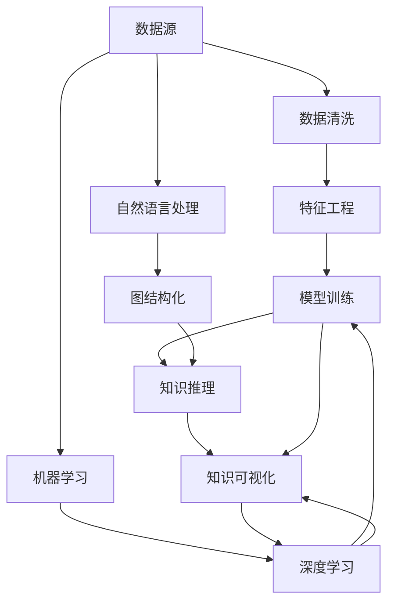

                 

# 知识发现引擎：知识创新的强大引擎

> 关键词：知识发现引擎, 数据挖掘, 机器学习, 人工智能, 知识图谱, 自然语言处理, 深度学习, 人工智能创新

## 1. 背景介绍

### 1.1 问题由来

随着数据时代的到来，从科学研究到商业运营，从日常事务到国家治理，人类社会在各个层面上都产生了前所未有的数据量。如何从海量数据中提取有价值的知识，挖掘潜在的规律，驱动决策科学化、智能化，已经成为信息时代的一大挑战。

知识发现引擎（Knowledge Discovery Engine，简称KDE）应运而生，成为信息时代的重要工具。它利用数据挖掘、机器学习、人工智能等技术手段，自动从原始数据中提炼出有价值的知识和规律，为决策者提供有力支撑。

### 1.2 问题核心关键点

KDE的核心任务是数据驱动的知识发现，其关键点在于：

1. **数据驱动**：KDE以数据为驱动，从海量数据中自动发现知识，而不是依赖人工标注和假设。
2. **自动化**：KDE通过自动化算法和工具，实现了从数据预处理、特征工程、模型训练到知识输出的全流程自动化。
3. **深度学习**：KDE广泛应用深度学习技术，通过构建复杂模型进行知识发现。
4. **可解释性**：KDE注重模型可解释性，帮助用户理解模型的工作原理和结果来源。
5. **跨领域应用**：KDE不仅可以应用于科学研究，还广泛应用于商业、医疗、金融等多个领域。

### 1.3 问题研究意义

在当前信息爆炸的时代，KDE的研发和应用具有重要意义：

1. **决策科学化**：KDE可以帮助决策者从海量数据中提取知识，进行科学决策，提高决策效率和准确性。
2. **智能化转型**：KDE推动了各行各业的智能化转型，通过自动化的知识发现，减少人工劳动，提升生产效率。
3. **创新驱动**：KDE促进了人工智能创新，为科学研究和技术研发提供了新的工具和方法。
4. **社会治理**：KDE在社会治理中的应用，如公共安全、环境监测、健康管理等，有助于提升社会治理水平。
5. **经济效益**：KDE通过数据驱动的知识发现，优化资源配置，提升经济效益，促进企业发展。

## 2. 核心概念与联系

### 2.1 核心概念概述

KDE涉及多个核心概念，这些概念之间相互联系，共同构成了一个完整的数据驱动知识发现框架：

1. **数据挖掘**：从原始数据中自动挖掘出有价值的信息和知识。
2. **机器学习**：通过训练数据集，构建预测模型，自动化地发现数据中的模式和规律。
3. **人工智能**：包括专家系统、自然语言处理、深度学习等，通过智能算法和模型进行知识发现和推理。
4. **知识图谱**：利用图结构表示知识，构建知识网络，支持知识检索和推理。
5. **自然语言处理**：通过文本处理、语音识别、图像处理等技术，将非结构化数据转换为结构化数据，支持知识发现。

这些核心概念通过KDE的算法流程和技术栈紧密联系，共同完成了从数据到知识的自动化转变。

### 2.2 核心概念原理和架构的 Mermaid 流程图



这个流程图展示了KDE的核心工作流程：从原始数据源出发，通过数据清洗、特征工程、模型训练、知识推理等步骤，最终输出知识可视化结果。同时，自然语言处理和图结构化技术为数据转换和知识表示提供了重要支撑。

## 3. 核心算法原理 & 具体操作步骤

### 3.1 算法原理概述

KDE的算法原理基于数据挖掘和机器学习的经典理论，具体包括：

1. **监督学习与无监督学习**：KDE可以同时支持监督学习和无监督学习，从标注数据中学习有监督模型，或从未标注数据中学习无监督模型。
2. **特征选择与降维**：通过特征选择和降维技术，提升模型性能和效率。
3. **模型融合**：采用模型融合技术，结合多个模型的预测结果，提高预测准确性和鲁棒性。
4. **深度学习架构**：利用深度学习架构，构建复杂的非线性模型，增强知识的发现能力。
5. **可解释性算法**：开发可解释性算法，帮助用户理解模型的决策过程和结果来源。

### 3.2 算法步骤详解

KDE的核心算法步骤主要包括以下几个部分：

**Step 1: 数据预处理**

数据预处理是KDE的第一步，旨在清洗和转换原始数据，使其符合模型训练的要求。具体步骤如下：

1. **数据清洗**：去除噪声、缺失值和异常值，保证数据质量。
2. **数据转换**：通过数据转换技术，将数据转换为模型所需的格式，如时间序列、离散化、标准化等。
3. **数据归一化**：将数据归一化到0到1或-1到1的范围内，便于模型处理。

**Step 2: 特征工程**

特征工程是KDE的核心环节，通过特征选择和构造，提升模型的性能和泛化能力。具体步骤如下：

1. **特征选择**：选择对目标变量影响显著的特征，去除冗余和无关特征。
2. **特征构造**：通过特征组合、交叉等方法，构造新的特征，增强模型的表达能力。
3. **特征降维**：通过主成分分析(PCA)、线性判别分析(LDA)等技术，降低特征维度和计算复杂度。

**Step 3: 模型训练**

模型训练是KDE的核心步骤，通过训练数据集，构建预测模型。具体步骤如下：

1. **选择模型**：根据任务特点选择合适的模型，如决策树、随机森林、支持向量机、神经网络等。
2. **训练模型**：使用训练数据集，通过梯度下降等算法优化模型参数，最小化损失函数。
3. **交叉验证**：通过交叉验证技术，评估模型的性能和泛化能力。

**Step 4: 知识推理**

知识推理是KDE的输出环节，将模型预测结果转化为结构化知识。具体步骤如下：

1. **规则提取**：从模型预测结果中提取规则和模式，生成知识库。
2. **知识库构建**：将规则和模式组织成知识图谱，构建知识网络。
3. **知识推理**：利用知识图谱进行推理，支持知识发现和预测。

**Step 5: 知识可视化**

知识可视化是KDE的展示环节，将知识图谱和规则直观展示给用户，支持理解和应用。具体步骤如下：

1. **知识展示**：通过图形化界面展示知识图谱和规则，支持用户直观理解。
2. **交互查询**：提供交互查询功能，支持用户根据需求检索和验证知识。
3. **报告生成**：自动生成知识报告，总结发现的知识和规律，支持决策参考。

### 3.3 算法优缺点

KDE具有以下优点：

1. **自动化高**：KDE通过自动化算法和工具，大大降低了人工干预，提升了效率。
2. **泛化能力强**：KDE通过模型训练和特征工程，能够发现数据中的泛化知识，具有较强的泛化能力。
3. **可解释性强**：KDE注重可解释性算法，能够解释模型的决策过程和结果来源，提高透明度。
4. **跨领域适用**：KDE适用于多种领域，如金融、医疗、电商等，具有广泛应用前景。
5. **灵活度高**：KDE可以根据任务特点和数据类型，灵活选择和组合算法，支持复杂应用场景。

同时，KDE也存在一些缺点：

1. **数据依赖性强**：KDE依赖于高质量的数据集，数据质量和完整性对结果影响较大。
2. **模型复杂度高**：KDE涉及复杂的模型和算法，模型训练和调试难度较大。
3. **计算资源需求高**：KDE需要高性能的计算资源，特别是深度学习模型，对硬件要求较高。
4. **结果可解释性差**：KDE的结果解释性相对较弱，用户难以理解复杂的模型和推理过程。

## 4. 数学模型和公式 & 详细讲解 & 举例说明

### 4.1 数学模型构建

KDE的数学模型构建主要包括：

1. **数据表示**：将原始数据表示为向量或矩阵形式，便于模型处理。
2. **特征表示**：通过特征选择和构造，将特征表示为向量形式，支持模型训练。
3. **模型表示**：选择合适的模型表示形式，如线性回归、逻辑回归、决策树、随机森林、神经网络等。
4. **损失函数**：定义模型预测结果与真实标签之间的损失函数，如均方误差、交叉熵等。
5. **优化算法**：选择优化算法，如梯度下降、随机梯度下降、Adam等，最小化损失函数。

### 4.2 公式推导过程

以线性回归为例，推导模型训练的基本公式。

设训练数据集为 $(x_1, y_1), (x_2, y_2), ..., (x_n, y_n)$，其中 $x$ 为输入特征，$y$ 为输出标签，目标是找到一个线性模型 $f(x) = \theta_0 + \theta_1 x_1 + \theta_2 x_2 + ... + \theta_p x_p$ 进行预测。

线性回归的损失函数为均方误差：

$$
\mathcal{L}(\theta) = \frac{1}{2N} \sum_{i=1}^N (y_i - f(x_i))^2
$$

其中 $N$ 为样本数量。通过梯度下降算法，优化损失函数：

$$
\theta \leftarrow \theta - \eta \nabla_{\theta}\mathcal{L}(\theta)
$$

其中 $\eta$ 为学习率，$\nabla_{\theta}\mathcal{L}(\theta)$ 为损失函数对参数 $\theta$ 的梯度，可以通过反向传播算法计算。

### 4.3 案例分析与讲解

以金融风险评估为例，分析KDE的实际应用。

1. **数据预处理**：收集银行的贷款申请数据，清洗和转换数据，去除噪声和异常值，将数据转换为适合模型训练的格式。
2. **特征工程**：选择对贷款违约率有显著影响的特征，如收入、信用评分、职业、住房情况等，构造新的特征组合，降低特征维度。
3. **模型训练**：选择逻辑回归或随机森林模型，使用训练数据集训练模型，最小化违约率的预测误差。
4. **知识推理**：从模型预测结果中提取规则和模式，构建知识图谱，如收入较高的客户违约率较低，信用评分较高的客户违约率较低等。
5. **知识可视化**：通过图形化界面展示知识图谱和规则，支持银行员工直观理解模型结果，提高决策效率。

## 5. 项目实践：代码实例和详细解释说明

### 5.1 开发环境搭建

KDE的开发环境搭建主要包括以下几个步骤：

1. **安装Python和相关库**：
```bash
pip install pandas numpy scikit-learn scikit-learn-gpu matplotlib seaborn jupyter notebook
```

2. **安装KDE相关的Python库**：
```bash
pip install knowledge-discovery-engine
```

3. **安装深度学习相关的库**：
```bash
pip install tensorflow keras tensorflow-gpu
```

完成上述步骤后，即可开始KDE的开发实践。

### 5.2 源代码详细实现

以下是一个使用KDE进行金融风险评估的Python代码实现：

```python
import pandas as pd
import numpy as np
from sklearn.model_selection import train_test_split
from sklearn.linear_model import LogisticRegression
from sklearn.metrics import accuracy_score
from knowledge_discovery_engine import KnowledgeDiscoveryEngine

# 数据准备
data = pd.read_csv('loan_data.csv')

# 数据预处理
data = data.dropna()
data = data.drop(['id', 'amount'], axis=1)

# 特征工程
X = data[['income', 'credit_score', 'age', 'employment', 'household', 'loan_term']]
y = data['default']

# 模型训练
X_train, X_test, y_train, y_test = train_test_split(X, y, test_size=0.3)
model = LogisticRegression()
model.fit(X_train, y_train)

# 知识推理
kde = KnowledgeDiscoveryEngine(model)
rules = kde.extract_rules(X_test, y_test)
print(rules)

# 知识可视化
kde.generate_report(rules)
```

这段代码首先读取贷款数据，进行数据预处理和特征工程，然后使用逻辑回归模型训练模型，最后使用KDE进行知识推理和可视化。

### 5.3 代码解读与分析

这段代码的详细解读如下：

1. **数据准备**：使用pandas库读取贷款数据，并进行初步清洗。
2. **数据预处理**：去除缺失值和无用特征，将数据转换为适合模型训练的格式。
3. **特征工程**：选择对目标变量有显著影响的特征，构造新的特征组合，降低特征维度。
4. **模型训练**：使用scikit-learn库的逻辑回归模型，训练模型并预测违约率。
5. **知识推理**：使用KDE的extract_rules方法，从模型预测结果中提取规则和模式，构建知识图谱。
6. **知识可视化**：使用KDE的generate_report方法，生成知识报告，支持决策参考。

## 6. 实际应用场景

### 6.1 金融风险评估

KDE在金融领域的应用非常广泛，如信用卡风险评估、贷款违约预测、投资组合优化等。KDE可以通过分析客户的历史行为数据，提取有价值的知识，帮助银行和金融机构评估客户的信用风险，制定更科学的风险管理策略。

### 6.2 医疗诊断预测

KDE在医疗领域的应用主要集中在疾病预测、诊断支持等方面。通过分析患者的医疗记录、基因数据等，KDE可以提取预测模型，帮助医生诊断疾病、预测病情发展趋势，提升医疗服务水平。

### 6.3 电商推荐系统

KDE在电商领域的应用主要集中在个性化推荐、客户细分等方面。通过分析用户的行为数据、购买历史等，KDE可以提取用户偏好，构建推荐模型，提升电商平台的推荐精度和用户满意度。

### 6.4 未来应用展望

未来，KDE将在更多领域得到广泛应用，带来新的突破：

1. **自动驾驶**：KDE可以用于自动驾驶中的数据分析和决策支持，提升驾驶安全和效率。
2. **智能制造**：KDE可以用于智能制造中的质量控制和故障预测，提升生产效率和产品质量。
3. **智慧城市**：KDE可以用于智慧城市中的交通管理、环境监测、公共安全等方面，提升城市治理水平。
4. **生物医药**：KDE可以用于药物发现、基因分析等领域，推动生物医药技术的进步。

## 7. 工具和资源推荐

### 7.1 学习资源推荐

为了帮助开发者系统掌握KDE的理论基础和实践技巧，这里推荐一些优质的学习资源：

1. 《数据挖掘与统计学习基础》：清华大学出版社，系统介绍了数据挖掘的基本概念和算法，适合入门学习。
2. 《机器学习》：斯坦福大学教材，全面介绍了机器学习的经典算法和应用，适合进阶学习。
3. 《Python数据科学手册》：O'Reilly出版社，详细介绍了Python在数据科学中的应用，适合实战练习。
4. 《KDE用户手册》：KDE官方文档，提供了丰富的学习资源和样例代码，适合深入理解。
5. Kaggle竞赛平台：提供了大量的数据集和竞赛项目，适合实践练习和经验积累。

通过对这些资源的学习实践，相信你一定能够快速掌握KDE的精髓，并用于解决实际的业务问题。

### 7.2 开发工具推荐

高效的开发离不开优秀的工具支持。以下是几款用于KDE开发的常用工具：

1. Python：基于Python的开源语言，灵活动态的语法和丰富的库支持，适合数据科学和机器学习开发。
2. Jupyter Notebook：支持Python等语言，提供了交互式的数据分析和机器学习开发环境，适合数据科学家的日常工作。
3. TensorFlow：由Google主导开发的深度学习框架，生产部署方便，适合大规模工程应用。
4. Scikit-learn：基于Python的开源机器学习库，提供了丰富的机器学习算法和工具，适合数据挖掘和特征工程。
5. Seaborn：基于Python的数据可视化库，提供了丰富的图表绘制工具，适合数据可视化和报告生成。

合理利用这些工具，可以显著提升KDE的开发效率，加快创新迭代的步伐。

### 7.3 相关论文推荐

KDE的发展源于学界的持续研究。以下是几篇奠基性的相关论文，推荐阅读：

1. J. Han和M. Kamber的《数据挖掘：概念与技术》：系统介绍了数据挖掘的基本概念和算法，是领域内的经典教材。
2. T. Mitchell的《机器学习》：全面介绍了机器学习的经典算法和应用，适合深入理解。
3. Y. Bengio的《深度学习》：介绍了深度学习的基本原理和应用，是深度学习领域的经典教材。
4. C. Cortes和V. Vapnik的《支持向量机理论》：介绍了支持向量机的基本原理和算法，是机器学习领域的经典论文。
5. R. Tibshirani的《回归分析与特征选择》：介绍了特征选择的基本原理和算法，是数据挖掘领域的经典论文。

这些论文代表了大数据驱动的知识发现技术的发展脉络。通过学习这些前沿成果，可以帮助研究者把握学科前进方向，激发更多的创新灵感。

## 8. 总结：未来发展趋势与挑战

### 8.1 研究成果总结

KDE作为数据驱动的知识发现技术，已经在金融、医疗、电商等多个领域取得了显著的成果，成为信息时代的重要工具。其核心算法包括数据预处理、特征工程、模型训练、知识推理和可视化等，涵盖了数据科学和机器学习的多个方面。KDE通过自动化和智能化，大大提升了数据处理和知识发现的效率，具有广泛的应用前景。

### 8.2 未来发展趋势

KDE的未来发展趋势包括：

1. **自动化水平提升**：随着算法和工具的不断改进，KDE的自动化水平将进一步提升，减少人工干预，提升效率。
2. **模型复杂度降低**：通过模型压缩和剪枝技术，KDE将逐渐降低模型复杂度，提高模型训练和推理的速度。
3. **跨领域应用拓展**：KDE将逐渐拓展到更多领域，如自动驾驶、智能制造、智慧城市等，带来新的突破。
4. **知识表示改进**：通过知识图谱、符号化表示等技术，KDE将提升知识表示的准确性和可理解性。
5. **多模态数据融合**：KDE将逐步支持多模态数据融合，增强知识发现的准确性和泛化能力。

### 8.3 面临的挑战

KDE在发展过程中也面临一些挑战：

1. **数据质量问题**：KDE依赖高质量的数据集，数据质量和完整性对结果影响较大。
2. **模型可解释性**：KDE的复杂模型和算法难以解释，用户难以理解模型的决策过程和结果来源。
3. **计算资源需求**：KDE涉及深度学习等计算密集型算法，对硬件要求较高。
4. **隐私和安全问题**：KDE涉及用户隐私数据，如何保护数据安全和隐私是一个重要问题。
5. **数据分布变化**：KDE需要对新数据进行持续学习和适应，如何保持模型的泛化能力和稳定性是一个挑战。

### 8.4 研究展望

未来的KDE研究需要在以下几个方面寻求新的突破：

1. **数据治理技术**：开发数据治理工具，提升数据质量和完整性，保障数据安全和隐私。
2. **模型压缩技术**：开发模型压缩和剪枝技术，降低模型复杂度，提高计算效率。
3. **跨模态知识发现**：开发多模态知识发现技术，支持视觉、语音、文本等数据的融合和分析。
4. **智能决策支持**：开发智能决策支持系统，结合人类专家知识和机器学习算法，提升决策的科学性和智能化水平。
5. **自动化学习框架**：开发自动化学习框架，将数据治理、特征工程、模型训练、知识推理等步骤自动化，提升KDE的效率和可扩展性。

总之，KDE作为一种重要的数据驱动知识发现技术，其未来的发展将对信息时代产生深远影响。通过不断创新和优化，KDE必将在更多领域大放异彩，为人类社会的智能化转型提供有力支撑。

## 9. 附录：常见问题与解答

**Q1：KDE是否适用于所有类型的数据？**

A: KDE适用于结构化数据和半结构化数据，但不适用于非结构化数据。对于非结构化数据，如文本、图像等，需要结合自然语言处理和计算机视觉技术进行预处理和分析。

**Q2：KDE的计算资源需求是否过高？**

A: KDE涉及深度学习等计算密集型算法，对硬件资源要求较高。通过使用GPU、TPU等高性能计算设备，可以有效提升计算速度和模型性能。

**Q3：KDE的结果可解释性是否较差？**

A: KDE的复杂模型和算法难以解释，用户难以理解模型的决策过程和结果来源。通过开发可解释性算法和工具，可以增强模型的可解释性和透明度，帮助用户理解KDE的结果。

**Q4：KDE在实际应用中是否需要人工干预？**

A: KDE通过自动化算法和工具，大大降低了人工干预。但仍需要人工干预，如数据预处理、特征选择等，以确保数据质量和模型性能。

**Q5：KDE在未来发展中是否有新的突破点？**

A: KDE的未来发展将围绕自动化水平提升、模型复杂度降低、跨领域应用拓展、知识表示改进、多模态数据融合等方向进行突破。结合最新技术，如深度学习、知识图谱、符号化表示等，KDE将不断提升其应用能力和效果。

---

作者：禅与计算机程序设计艺术 / Zen and the Art of Computer Programming

