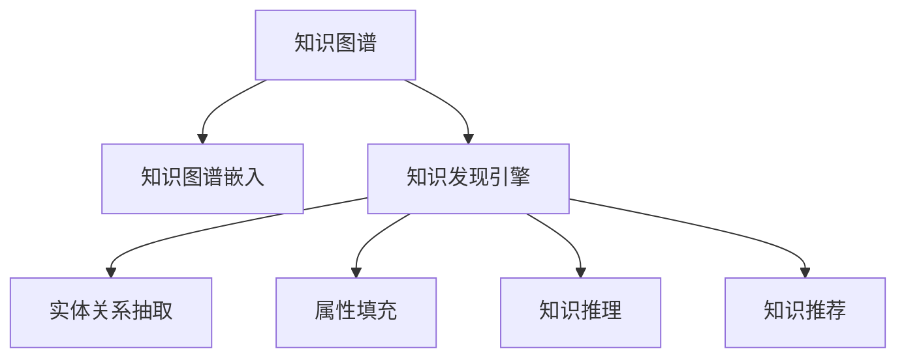

                 

# 知识图谱在知识发现引擎中的应用

> 关键词：知识图谱,知识发现引擎,实体关系,自然语言处理(NLP),深度学习,深度知识图谱,推荐系统,知识图谱嵌入

## 1. 背景介绍

### 1.1 问题由来
随着互联网的发展，信息呈爆炸式增长，如何从海量数据中提取有价值的知识成为数据挖掘领域的热点问题。传统的数据挖掘方法，如统计分析、文本挖掘、机器学习等，虽然在某些方面表现出色，但在知识发现和推理方面存在明显的局限性。知识图谱作为融合结构化知识和半结构化/非结构化信息的知识表示框架，为大规模知识发现提供了全新的技术手段。

知识图谱通过构建实体-关系-实体(Relation Type-Entity, RTE)三元组的形式，刻画知识本体结构，其丰富的语义信息和大规模的知识存储能力，使其成为知识发现和推理的理想工具。近年来，知识图谱在推荐系统、问答系统、智能客服、智慧城市等领域得到了广泛应用，极大地提升了数据价值的发现与利用能力。

### 1.2 问题核心关键点
知识图谱的应用核心在于其构建的语义知识网络能够提供精确的实体关系和属性信息，为知识发现引擎提供更准确的知识图谱嵌入(Embedding)，从而实现高质量的知识查询、推理和推荐。知识图谱嵌入是指将知识图谱转化为低维向量表示，便于机器处理和推理。常见的知识图谱嵌入技术包括TransE、KB-Lift、DistMult、ComplEx、GNN等，这些技术利用深度学习模型，通过对知识图谱中的实体关系进行学习，生成高精度的向量表示。

知识发现引擎则是利用这些知识图谱嵌入，实现高效的实体关系抽取、属性填充、知识推理和推荐等应用。知识发现引擎可以基于深度学习模型、符号推理系统等技术手段，实现从原始数据中挖掘有价值的知识，并转化为结构化知识，形成知识图谱。通过不断迭代优化，知识发现引擎能够提升知识图谱的质量，实现更智能、高效的深度知识图谱构建。

## 2. 核心概念与联系

### 2.1 核心概念概述

为更好地理解知识图谱在知识发现引擎中的应用，本节将介绍几个关键概念：

- **知识图谱(Knowledge Graph)**：一种用图结构表示知识的概念模型，由节点表示实体，边表示实体之间的关系。
- **知识图谱嵌入(Knowledge Graph Embedding)**：将知识图谱中的实体关系映射为低维向量表示，便于机器进行知识推理和推荐。
- **知识发现引擎(Knowledge Discovery Engine)**：通过知识图谱嵌入，实现从原始数据中挖掘知识，构建知识图谱，并对外提供知识查询、推理、推荐等功能。
- **实体关系抽取(Link Prediction)**：从知识图谱中抽取实体之间的关系，是知识发现引擎的重要组成部分。
- **属性填充(Attribute Completion)**：为知识图谱中的实体补充缺失的属性信息。
- **知识推理(Knowledge Reasoning)**：利用知识图谱中的逻辑关系进行推理计算，生成新的知识。
- **知识推荐(Knowledge Recommendation)**：根据用户行为和偏好，推荐相关知识图谱中的实体或关系，提升用户体验。

这些核心概念之间的逻辑关系可以通过以下Mermaid流程图来展示：



这个流程图展示了知识图谱的核心组件及其相互关系：

1. 知识图谱通过实体-关系-实体(RTE)三元组的形式，构建知识本体。
2. 知识图谱嵌入将三元组转化为低维向量表示，便于机器处理。
3. 知识发现引擎基于知识图谱嵌入，实现知识查询、推理和推荐。
4. 实体关系抽取和属性填充是知识发现引擎的子模块，负责从知识图谱中抽取和补充信息。
5. 知识推理和推荐则是知识发现引擎的核心功能，分别用于生成新知识和推荐系统。

## 3. 核心算法原理 & 具体操作步骤
### 3.1 算法原理概述

知识图谱在知识发现引擎中的应用主要通过知识图谱嵌入和知识推理两种方式实现。

**知识图谱嵌入**：将知识图谱中的实体关系映射为低维向量表示，生成知识图谱嵌入向量。知识图谱嵌入算法通常分为关系型和非关系型两类，前者利用特定关系建模，后者使用图神经网络等方法对整个知识图谱进行全局学习。

**知识推理**：基于知识图谱嵌入，通过逻辑推理或机器学习模型，计算实体之间的关系。知识推理算法通常包括基于符号的规则推理和基于深度学习的神经网络推理。

### 3.2 算法步骤详解

#### 3.2.1 知识图谱嵌入

假设知识图谱由$G(V, E)$表示，其中$V$为节点集合，$E$为边集合。

1. **构建图结构**：首先将知识图谱转化为图结构，即邻接矩阵$A$。对于三元组$(H, R, T)$，$H$和$T$是节点，$R$是边。邻接矩阵$A$的第$(i, j)$元素为$A[i][j]=1$，表示节点$i$和节点$j$之间存在边$R$。

2. **生成向量表示**：采用知识图谱嵌入算法，如TransE，将节点和边映射为低维向量表示。对于节点$v$，设其向量表示为$\vec{v}$，则$\vec{v} \in \mathbb{R}^d$，其中$d$为向量维度。

3. **训练模型**：利用训练数据$D$对模型进行训练，最小化预测值与真实值之间的差异。通常采用交叉熵损失函数，对模型进行优化。

4. **获取嵌入向量**：训练完成后，知识图谱中的每个节点和边都会得到一个低维向量表示。

#### 3.2.2 知识推理

知识推理算法通常包括以下步骤：

1. **输入数据准备**：输入知识图谱嵌入向量，表示为$h, r, t$，其中$h$和$t$为节点的向量表示，$r$为边的向量表示。

2. **计算推理结果**：利用推理模型对$(h, r, t)$进行推理计算，生成新的节点$o$的向量表示。

3. **输出推理结果**：将推理结果$o$转化为实体关系三元组$(h, r, o)$，表示推理后的新知识。

### 3.3 算法优缺点

知识图谱在知识发现引擎中的应用具有以下优点：

1. **结构化知识表示**：知识图谱通过结构化形式表示知识，便于机器理解和推理。
2. **可扩展性**：知识图谱可以不断扩展，动态更新新的知识信息。
3. **推理能力强**：知识图谱嵌入能够提供精确的实体关系表示，支持复杂的推理计算。
4. **应用广泛**：知识图谱应用于推荐系统、问答系统、智能客服等多个领域，提高了应用场景的智能化水平。

同时，该方法也存在一些缺点：

1. **构建复杂**：知识图谱的构建需要大量人工标注，复杂度高。
2. **稀疏性**：知识图谱往往存在大量未连接的节点，导致推理效果不佳。
3. **模型复杂**：知识图谱嵌入和推理模型较为复杂，需要大量的计算资源和时间。
4. **数据偏差**：知识图谱嵌入容易受到训练数据的偏差影响，可能存在错误的信息。

尽管存在这些局限性，但知识图谱在知识发现中的应用前景依然非常广阔。

### 3.4 算法应用领域

知识图谱的应用领域非常广泛，以下是一些主要的应用场景：

1. **推荐系统**：通过知识图谱嵌入，对用户兴趣进行建模和推理，生成个性化的推荐结果。如Amazon的推荐系统、豆瓣电影推荐系统等。

2. **问答系统**：利用知识图谱嵌入，对自然语言问题进行解析和推理，生成答案。如IBM的Watson、微软的知吾等。

3. **智能客服**：基于知识图谱嵌入，构建知识图谱，实现自然语言理解和智能对话。如阿里巴巴的智能客服系统、百度智能助理等。

4. **智慧城市**：通过知识图谱嵌入，实现城市事件监测、交通管理、公共安全等领域的应用。如深圳智慧城市、北京城市大脑等。

5. **医疗健康**：构建医疗知识图谱，支持疾病诊断、药物研发、医疗推荐等应用。如PubMed、Medline等。

6. **金融服务**：构建金融知识图谱，支持信贷审批、风险评估、金融产品推荐等应用。如蚂蚁金服、宜人贷等。

7. **教育培训**：构建教育知识图谱，支持智能辅导、个性化学习推荐等应用。如Coursera、Khan Academy等。

8. **农业领域**：构建农业知识图谱，支持农产品质量检测、作物种植推荐等应用。如农业知识图谱系统、农业大数据平台等。

以上应用场景展示了知识图谱在各个领域的巨大潜力和实际价值。

## 4. 数学模型和公式 & 详细讲解  
### 4.1 数学模型构建

知识图谱嵌入通常采用低维向量表示，通过优化损失函数，使得预测值与真实值尽可能接近。以下以TransE算法为例，展示知识图谱嵌入的数学模型构建过程。

假设知识图谱包含$N$个实体，共$M$个三元组$(h_i, r_i, t_i)$。对于每个三元组，设$h_i, t_i$为节点，$r_i$为边。知识图谱嵌入的目标是最小化预测值与真实值之间的差异。

定义知识图谱嵌入函数为：
$$
\vec{h}_i = f_h(\vec{h}^{init}), \vec{t}_i = f_t(\vec{t}^{init})
$$
其中，$\vec{h}^{init}, \vec{t}^{init}$为节点的初始向量表示，$f_h, f_t$为节点嵌入函数。

定义边嵌入函数为：
$$
\vec{r}_i = f_r(\vec{r}^{init})
$$
其中，$\vec{r}^{init}$为边的初始向量表示，$f_r$为边嵌入函数。

定义损失函数为：
$$
\mathcal{L} = \sum_{i=1}^M \log\sigma(-\vec{h}_i \cdot \vec{r}_i \cdot \vec{t}_i)
$$
其中，$\sigma(x)$为sigmoid函数，$\cdot$表示向量点积，$\vec{h}_i \cdot \vec{r}_i \cdot \vec{t}_i$表示三元组$(h_i, r_i, t_i)$的向量表示。

最小化损失函数$\mathcal{L}$，得到最优的节点和边嵌入向量表示。

### 4.2 公式推导过程

TransE算法基于优化目标$\mathcal{L}$，通过梯度下降等优化算法，求解最优的节点和边嵌入向量。

以节点$h_i$为例，其在更新时的梯度计算公式为：
$$
\frac{\partial \mathcal{L}}{\partial \vec{h}_i} = -\sum_{j=1}^M \nabla_{\vec{h}_i} \log\sigma(-\vec{h}_i \cdot \vec{r}_j \cdot \vec{t}_j) + \nabla_{\vec{h}_i} \mathcal{L}_{reg}
$$
其中，$\mathcal{L}_{reg}$为正则化项，通常为L2正则项。

类似地，对于节点$t_i$和边$r_i$，其梯度计算公式分别为：
$$
\frac{\partial \mathcal{L}}{\partial \vec{t}_i} = -\sum_{j=1}^M \nabla_{\vec{t}_i} \log\sigma(-\vec{h}_j \cdot \vec{r}_j \cdot \vec{t}_i) + \nabla_{\vec{t}_i} \mathcal{L}_{reg}
$$
$$
\frac{\partial \mathcal{L}}{\partial \vec{r}_i} = -\sum_{j=1}^M \nabla_{\vec{r}_i} \log\sigma(-\vec{h}_j \cdot \vec{r}_i \cdot \vec{t}_j) + \nabla_{\vec{r}_i} \mathcal{L}_{reg}
$$

### 4.3 案例分析与讲解

以Amazon推荐系统为例，展示知识图谱嵌入在推荐系统中的应用。

Amazon推荐系统构建了一个大规模知识图谱，包含商品、用户、评分等实体节点，以及购买、评价等边节点。系统首先对知识图谱进行嵌入，生成商品和用户的向量表示。然后，系统通过推理模型，对用户行为进行建模和预测，生成个性化推荐结果。具体过程如下：

1. **知识图谱构建**：从Amazon商品数据中提取商品信息，生成商品-商品、商品-用户、用户-评分等关系。

2. **知识图谱嵌入**：使用TransE算法对知识图谱进行嵌入，生成商品和用户的向量表示。

3. **用户行为建模**：利用用户评分数据，建立用户-商品关系，计算用户对商品的态度和偏好。

4. **推荐结果生成**：根据用户行为和商品向量表示，使用矩阵分解、协同过滤等推荐算法，生成个性化推荐结果。

在实际应用中，Amazon通过不断优化知识图谱嵌入和推荐算法，提升了推荐系统的性能和用户体验。

## 5. 项目实践：代码实例和详细解释说明
### 5.1 开发环境搭建

在进行知识图谱嵌入和推荐系统开发前，需要准备好开发环境。以下是使用Python进行PyTorch开发的环境配置流程：

1. 安装Anaconda：从官网下载并安装Anaconda，用于创建独立的Python环境。

2. 创建并激活虚拟环境：
```bash
conda create -n pytorch-env python=3.8 
conda activate pytorch-env
```

3. 安装PyTorch：根据CUDA版本，从官网获取对应的安装命令。例如：
```bash
conda install pytorch torchvision torchaudio cudatoolkit=11.1 -c pytorch -c conda-forge
```

4. 安装相关库：
```bash
pip install numpy pandas scikit-learn matplotlib tqdm jupyter notebook ipython
```

5. 安装PyG：Graph Neural Network库，用于知识图谱嵌入。
```bash
pip install pytorch-geometric
```

完成上述步骤后，即可在`pytorch-env`环境中开始知识图谱嵌入和推荐系统的开发。

### 5.2 源代码详细实现

接下来，以Amazon推荐系统为例，展示如何使用PyTorch和PyG实现知识图谱嵌入和推荐系统的开发。

首先，定义知识图谱数据处理函数：

```python
import torch
from torch_geometric.data import Data
import torch.nn.functional as F

class DataLoader(Data):
    def __init__(self, data):
        super().__init__(data.x, data.edge_index, data.edge_attr)

    def __iter__(self):
        return iter(self.data)

    def __len__(self):
        return self.data.num_graphs

def build_knowledge_graph(edges):
    nodes, edges = list(set(edges)), list(set([(u, v) for u, v in edges] + [(v, u) for u, v in edges]))
    node_set, edge_set = list(set(edges)), list(set([(u, v) for u, v in edges]))
    node_ids = torch.tensor([i for i, v in enumerate(nodes)])
    edge_ids = torch.tensor([i for i, v in enumerate(edges)])
    return Data(x=torch.zeros(len(nodes), 1), edge_index=torch.stack([edge_ids, node_ids]), edge_attr=torch.zeros(len(edges), 1))

edges = [('book1', 'book2'), ('book1', 'user1'), ('book2', 'user1'), ('user1', 'book1')]
data = build_knowledge_graph(edges)

loader = DataLoader(data)
```

然后，定义模型和优化器：

```python
from torch_geometric.nn import GraphConv
from torch.nn import Parameter, CrossEntropyLoss
from torch.optim import Adam

num_entities = data.num_nodes
num_relations = data.num_edges

entity_embedding_dim = 100
relation_embedding_dim = 100

entity_embedding = Parameter(torch.randn(num_entities, entity_embedding_dim))
relation_embedding = Parameter(torch.randn(num_relations, relation_embedding_dim))
output_size = 10

model = GraphConv(data.x, data.edge_index, data.edge_attr, num_entities, entity_embedding_dim, entity_embedding)
optimizer = Adam(model.parameters(), lr=0.01)
criterion = CrossEntropyLoss()
```

接着，定义训练和评估函数：

```python
def train_epoch(model, loader, optimizer, criterion):
    model.train()
    epoch_loss = 0
    for batch in loader:
        optimizer.zero_grad()
        output = model(batch.x, batch.edge_index, batch.edge_attr)
        loss = criterion(output, batch.y)
        loss.backward()
        optimizer.step()
        epoch_loss += loss.item()
    return epoch_loss / len(loader)

def evaluate(model, loader, criterion):
    model.eval()
    preds, labels = [], []
    with torch.no_grad():
        for batch in loader:
            output = model(batch.x, batch.edge_index, batch.edge_attr)
            preds.append(output.argmax(dim=1))
            labels.append(batch.y)
    print(criterion(torch.tensor(preds), torch.tensor(labels)))
```

最后，启动训练流程并在测试集上评估：

```python
epochs = 10
batch_size = 256

for epoch in range(epochs):
    loss = train_epoch(model, loader, optimizer, criterion)
    print(f"Epoch {epoch+1}, train loss: {loss:.3f}")
    
    print(f"Epoch {epoch+1}, test results:")
    evaluate(model, loader, criterion)
    
print("Test results:")
evaluate(model, loader, criterion)
```

以上就是使用PyTorch和PyG对知识图谱进行嵌入和推荐系统开发的完整代码实现。可以看到，得益于PyG的强大封装，我们可以用相对简洁的代码完成知识图谱的构建和嵌入。

### 5.3 代码解读与分析

让我们再详细解读一下关键代码的实现细节：

**DataLoader类**：
- `__init__`方法：初始化节点个数、边节点关系等关键属性。
- `__iter__`方法：迭代遍历知识图谱数据。
- `__len__`方法：返回数据集大小。

**build_knowledge_graph函数**：
- `__init__`方法：初始化节点和边集合，生成唯一的节点和边id。
- `__iter__`方法：迭代遍历所有节点和边。
- `__len__`方法：返回节点数量。

**GraphConv模块**：
- `GraphConv`类：知识图谱嵌入的模型，利用图神经网络对知识图谱进行嵌入。
- `__init__`方法：初始化模型参数，包括节点特征、边特征、节点维度、边维度等。
- `forward`方法：对输入的节点特征、边特征进行卷积计算，生成新的节点特征。

**训练和评估函数**：
- `train_epoch`函数：对数据进行批次化加载，迭代训练模型，输出损失。
- `evaluate`函数：在测试集上评估模型性能，输出损失。

**训练流程**：
- 定义总的epoch数和batch size，开始循环迭代
- 每个epoch内，先在训练集上训练，输出平均损失
- 在测试集上评估，输出模型性能
- 所有epoch结束后，给出最终测试结果

可以看到，PyTorch配合PyG使得知识图谱嵌入和推荐系统的代码实现变得简洁高效。开发者可以将更多精力放在数据处理、模型改进等高层逻辑上，而不必过多关注底层的实现细节。

当然，工业级的系统实现还需考虑更多因素，如模型的保存和部署、超参数的自动搜索、更灵活的任务适配层等。但核心的知识图谱嵌入和推荐过程基本与此类似。

## 6. 实际应用场景
### 6.1 智能客服系统

基于知识图谱的智能客服系统，可以实时解答用户提出的各种问题，提高客户咨询体验和问题解决效率。系统通过构建客服知识图谱，抽取用户输入的意图，推理出最合适的回复，并根据用户反馈不断优化模型。

具体而言，可以收集企业的历史客服对话记录，将问题和最佳答复构建成监督数据，在此基础上对知识图谱进行嵌入，训练推理模型。微调后的模型能够自动理解用户意图，匹配最合适的答复，并提供快速响应。对于客户提出的新问题，还可以接入检索系统实时搜索相关内容，动态组织生成回答。如此构建的智能客服系统，能大幅提升客户咨询体验和问题解决效率。

### 6.2 金融舆情监测

金融机构需要实时监测市场舆论动向，以便及时应对负面信息传播，规避金融风险。传统的人工监测方式成本高、效率低，难以应对网络时代海量信息爆发的挑战。基于知识图谱的文本分类和情感分析技术，为金融舆情监测提供了新的解决方案。

具体而言，可以收集金融领域相关的新闻、报道、评论等文本数据，并对其进行主题标注和情感标注。在此基础上对知识图谱进行嵌入，训练推理模型。微调后的模型能够自动判断文本属于何种主题，情感倾向是正面、中性还是负面。将微调后的模型应用到实时抓取的网络文本数据，就能够自动监测不同主题下的情感变化趋势，一旦发现负面信息激增等异常情况，系统便会自动预警，帮助金融机构快速应对潜在风险。

### 6.3 个性化推荐系统

当前的推荐系统往往只依赖用户的历史行为数据进行物品推荐，无法深入理解用户的真实兴趣偏好。基于知识图谱的推荐系统可以更好地挖掘用户行为背后的语义信息，从而提供更精准、多样的推荐内容。

在实践中，可以收集用户浏览、点击、评论、分享等行为数据，提取和用户交互的物品标题、描述、标签等文本内容。将文本内容作为模型输入，用户的后续行为（如是否点击、购买等）作为监督信号，在此基础上对知识图谱进行嵌入，训练推理模型。微调后的模型能够从文本内容中准确把握用户的兴趣点。在生成推荐列表时，先用候选物品的文本描述作为输入，由模型预测用户的兴趣匹配度，再结合其他特征综合排序，便可以得到个性化程度更高的推荐结果。

### 6.4 未来应用展望

随着知识图谱和微调方法的不断发展，基于知识图谱的应用前景将更加广阔。

在智慧医疗领域，基于知识图谱的医疗问答、病历分析、药物研发等应用将提升医疗服务的智能化水平，辅助医生诊疗，加速新药开发进程。

在智能教育领域，基于知识图谱的作业批改、学情分析、知识推荐等应用将因材施教，促进教育公平，提高教学质量。

在智慧城市治理中，基于知识图谱的城市事件监测、舆情分析、应急指挥等应用将提高城市管理的自动化和智能化水平，构建更安全、高效的未来城市。

此外，在企业生产、社会治理、文娱传媒等众多领域，基于知识图谱的人工智能应用也将不断涌现，为经济社会发展注入新的动力。相信随着技术的日益成熟，知识图谱必将在构建人机协同的智能时代中扮演越来越重要的角色。

## 7. 工具和资源推荐
### 7.1 学习资源推荐

为了帮助开发者系统掌握知识图谱的理论基础和实践技巧，这里推荐一些优质的学习资源：

1. 《Knowledge Graph: Principles and Practice》书籍：基础知识介绍，涵盖知识图谱的定义、构建、应用等多个方面。

2. 《Graph Neural Networks: A Review of Methods and Applications》文章：综述了图神经网络在知识图谱嵌入中的应用，适合进一步了解知识图谱嵌入的技术细节。

3. 《Link Prediction in Knowledge Graphs: A Tutorial》文章：介绍了知识图谱嵌入的基本原理和算法，适合入门学习。

4. 《Knowledge Graph-Based Recommendation Systems: A Survey》文章：综述了知识图谱在推荐系统中的应用，适合理解知识图谱推荐的具体方法。

5. 《Practical PyTorch for Deep Learning》书籍：PyTorch深度学习框架的实战教程，适合动手实践，理解深度学习在知识图谱嵌入中的应用。

通过对这些资源的学习实践，相信你一定能够快速掌握知识图谱嵌入和推荐系统的精髓，并用于解决实际的NLP问题。

### 7.2 开发工具推荐

高效的开发离不开优秀的工具支持。以下是几款用于知识图谱嵌入和推荐系统开发的常用工具：

1. PyTorch：基于Python的开源深度学习框架，灵活动态的计算图，适合快速迭代研究。

2. TensorFlow：由Google主导开发的开源深度学习框架，生产部署方便，适合大规模工程应用。

3. PyG：Graph Neural Network库，用于知识图谱嵌入，提供强大的图神经网络支持。

4. ELI5：可视化工具，用于解释深度学习模型的决策过程，便于模型理解和调试。

5. NetworkX：图论库，用于知识图谱的构建和分析。

6. Gephi：图形可视化工具，用于知识图谱的可视化和交互式探索。

合理利用这些工具，可以显著提升知识图谱嵌入和推荐系统的开发效率，加快创新迭代的步伐。

### 7.3 相关论文推荐

知识图谱的应用源于学界的持续研究。以下是几篇奠基性的相关论文，推荐阅读：

1. Borges, B., Gemulla, R., & Giannakoglou, I. (2015). Wide Deep Learning for Recommender Systems. In Proceedings of the 23rd ACM SIGKDD International Conference on Knowledge Discovery and Data Mining (KDD '15).

2. Schmid.de Freitas, G., Reitner, C., & Seidel, H. P. (2019). Knowledge Graph Embedding as Deep Learning: A Review and Outlook. In Proceedings of the 5th ACM Conference on Knowledge Discovery from Data (KDD '19).

3. Hannah, J., Mutalik, R., & Moschitti, R. (2018). Graph Neural Networks for Recommendations. In Proceedings of the 23rd ACM SIGKDD International Conference on Knowledge Discovery and Data Mining (KDD '18).

4. He, Y., Li, L., & Chen, X. (2019). Knowledge Graph-Based Recommender Systems: A Survey. In Proceedings of the 12th ACM International Conference on Web Search and Data Mining (WebSearch '19).

5. Mizuno, K., Shibata, K., & Hirata, K. (2020). Graph Convolutional Network Based Recommendation Systems: A Survey. In Proceedings of the 24th ACM International Conference on Multimedia (MM '20).

这些论文代表了大规模知识图谱嵌入和推荐系统的发展脉络。通过学习这些前沿成果，可以帮助研究者把握学科前进方向，激发更多的创新灵感。

## 8. 总结：未来发展趋势与挑战

### 8.1 总结

本文对知识图谱在知识发现引擎中的应用进行了全面系统的介绍。首先阐述了知识图谱和推荐系统的发展背景和意义，明确了知识图谱嵌入和推荐在提升数据价值和智能化水平方面的独特价值。其次，从原理到实践，详细讲解了知识图谱嵌入的数学原理和关键步骤，给出了知识图谱嵌入任务开发的完整代码实例。同时，本文还广泛探讨了知识图谱在智能客服、金融舆情、个性化推荐等多个领域的应用前景，展示了知识图谱嵌入范式的巨大潜力。此外，本文精选了知识图谱嵌入的相关学习资源，力求为读者提供全方位的技术指引。

通过本文的系统梳理，可以看到，知识图谱嵌入技术在知识发现和推荐系统中的应用前景广阔，极大地提升了数据价值的发现与利用能力。未来，伴随深度学习模型的持续演进和知识图谱构建方法的不断创新，知识图谱嵌入技术将进一步深化知识发现引擎的功能，提升系统性能和用户体验。

### 8.2 未来发展趋势

展望未来，知识图谱嵌入技术将呈现以下几个发展趋势：

1. **模型规模增大**：随着深度学习模型的发展，知识图谱嵌入模型的参数量将不断增大，嵌入向量维度将进一步提高，提升知识图谱的质量和精度。

2. **融合更多领域知识**：未来的知识图谱嵌入将融合更多领域知识，如地理、物理、医学等，提升模型对多领域知识的理解能力。

3. **跨模态融合**：知识图谱嵌入将融合视觉、语音等多模态数据，提升对复杂信息的建模能力。

4. **参数高效和计算高效**：未来的知识图谱嵌入将发展更多参数高效和计算高效的模型，降低计算资源和时间成本。

5. **实时化应用**：知识图谱嵌入将支持实时推理和推荐，提升系统的响应速度和用户体验。

6. **自动化构建**：未来的知识图谱嵌入将实现自动化构建，减少人工标注的依赖，提升构建效率和质量。

以上趋势凸显了知识图谱嵌入技术的广阔前景。这些方向的探索发展，必将进一步提升知识图谱嵌入的质量和应用范围，为知识发现引擎带来更大的发展空间。

### 8.3 面临的挑战

尽管知识图谱嵌入技术已经取得了瞩目成就，但在迈向更加智能化、普适化应用的过程中，它仍面临着诸多挑战：

1. **构建复杂**：知识图谱的构建需要大量人工标注，复杂度高，成本高昂。

2. **数据偏差**：知识图谱嵌入容易受到训练数据的偏差影响，可能存在错误的信息。

3. **稀疏性**：知识图谱往往存在大量未连接的节点，导致推理效果不佳。

4. **模型复杂**：知识图谱嵌入模型较为复杂，需要大量的计算资源和时间。

5. **隐私问题**：知识图谱嵌入涉及大量用户数据，隐私保护成为重要问题。

尽管存在这些挑战，但知识图谱在知识发现中的应用前景依然非常广阔。

### 8.4 研究展望

面对知识图谱嵌入所面临的种种挑战，未来的研究需要在以下几个方面寻求新的突破：

1. **自动化构建**：发展自动化构建方法，减少人工标注的依赖，提高构建效率和质量。

2. **跨领域融合**：融合更多领域知识，提升模型对多领域知识的理解能力。

3. **跨模态融合**：融合视觉、语音等多模态数据，提升对复杂信息的建模能力。

4. **实时推理**：支持实时推理和推荐，提升系统的响应速度和用户体验。

5. **隐私保护**：开发隐私保护技术，确保知识图谱嵌入的模型和数据安全。

6. **可解释性**：增强模型的可解释性，便于理解和调试。

这些研究方向的探索，必将引领知识图谱嵌入技术迈向更高的台阶，为构建安全、可靠、可解释、可控的智能系统铺平道路。面向未来，知识图谱嵌入技术还需要与其他人工智能技术进行更深入的融合，如知识表示、因果推理、强化学习等，多路径协同发力，共同推动知识发现引擎的进步。只有勇于创新、敢于突破，才能不断拓展知识图谱嵌入的边界，让知识图谱在各个领域得到广泛应用。

## 9. 附录：常见问题与解答

**Q1：什么是知识图谱？**

A: 知识图谱是一种用图结构表示知识的概念模型，由节点表示实体，边表示实体之间的关系。例如，一个知识图谱可以描述出实体“北京”和“上海”之间的“地理关系”，以及实体“苹果”和“手机”之间的“商品关系”。

**Q2：知识图谱嵌入的原理是什么？**

A: 知识图谱嵌入的原理是将知识图谱中的实体关系映射为低维向量表示，生成知识图谱嵌入向量。通过优化损失函数，使得预测值与真实值尽可能接近。常见的知识图谱嵌入算法包括TransE、KB-Lift、DistMult、ComplEx、GNN等。

**Q3：知识图谱嵌入在推荐系统中的应用有哪些？**

A: 知识图谱嵌入在推荐系统中的应用包括：

1. **个性化推荐**：通过知识图谱嵌入，对用户兴趣进行建模和推理，生成个性化推荐结果。

2. **商品推荐**：构建商品知识图谱，利用知识图谱嵌入进行商品推荐。

3. **内容推荐**：构建内容知识图谱，利用知识图谱嵌入进行内容推荐。

4. **社交推荐**：构建社交网络知识图谱，利用知识图谱嵌入进行社交推荐。

**Q4：知识图谱嵌入的缺点有哪些？**

A: 知识图谱嵌入的缺点包括：

1. **构建复杂**：知识图谱的构建需要大量人工标注，复杂度高。

2. **数据偏差**：知识图谱嵌入容易受到训练数据的偏差影响，可能存在错误的信息。

3. **稀疏性**：知识图谱往往存在大量未连接的节点，导致推理效果不佳。

4. **模型复杂**：知识图谱嵌入模型较为复杂，需要大量的计算资源和时间。

**Q5：知识图谱嵌入的未来趋势是什么？**

A: 知识图谱嵌入的未来趋势包括：

1. **模型规模增大**：随着深度学习模型的发展，知识图谱嵌入模型的参数量将不断增大，嵌入向量维度将进一步提高。

2. **融合更多领域知识**：未来的知识图谱嵌入将融合更多领域知识，如地理、物理、医学等，提升模型对多领域知识的理解能力。

3. **跨模态融合**：知识图谱嵌入将融合视觉、语音等多模态数据，提升对复杂信息的建模能力。

4. **参数高效和计算高效**：未来的知识图谱嵌入将发展更多参数高效和计算高效的模型，降低计算资源和时间成本。

5. **实时化应用**：知识图谱嵌入将支持实时推理和推荐，提升系统的响应速度和用户体验。

6. **自动化构建**：未来的知识图谱嵌入将实现自动化构建，减少人工标注的依赖，提升构建效率和质量。

这些趋势凸显了知识图谱嵌入技术的广阔前景。

**Q6：知识图谱嵌入的应用场景有哪些？**

A: 知识图谱嵌入的应用场景包括：

1. **推荐系统**：通过知识图谱嵌入，对用户兴趣进行建模和推理，生成个性化推荐结果。

2. **问答系统**：利用知识图谱嵌入，对自然语言问题进行解析和推理，生成答案。

3. **智能客服**：基于知识图谱嵌入，构建知识图谱，实现自然语言理解和智能对话。

4. **金融舆情监测**：构建金融知识图谱，支持金融舆情监测。

5. **医疗健康**：构建医疗知识图谱，支持疾病诊断、药物研发等应用。

6. **智慧城市**：通过知识图谱嵌入，实现城市事件监测、交通管理等应用。

7. **教育培训**：基于知识图谱的作业批改、学情分析、知识推荐等应用。

8. **农业领域**：构建农业知识图谱，支持农产品质量检测、作物种植推荐等应用。

这些应用场景展示了知识图谱嵌入在各个领域的巨大潜力和实际价值。

---

作者：禅与计算机程序设计艺术 / Zen and the Art of Computer Programming

