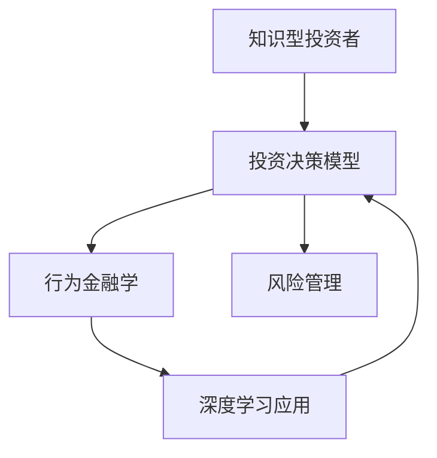

                 

# 知识型投资者的决策模式研究

> 关键词：
> - 投资决策模型
> - 知识型投资者
> - 风险管理
> - 行为金融学
> - 深度学习应用

## 1. 背景介绍

### 1.1 问题由来
在现代金融市场中，投资者的决策模式日益成为影响投资效果的关键因素之一。随着金融科技的发展，智能投顾、量化交易等新型投资方式层出不穷，这些方式在带来高效率、高收益的同时，也对投资者的决策模式提出了新的挑战。特别是对于知识型投资者而言，如何利用自身的知识优势，构建更加高效、科学的决策模型，实现资产的长期稳健增长，成为亟待研究的课题。

### 1.2 问题核心关键点
本研究聚焦于知识型投资者在金融市场中的决策模式，旨在通过构建与优化投资决策模型，提升知识型投资者的决策效果，实现资产的长期稳健增长。关键点包括：
- 知识型投资者的特征分析
- 投资决策模型的构建与优化
- 风险管理与控制
- 行为金融学理论的应用

## 2. 核心概念与联系

### 2.1 核心概念概述

为更好地理解知识型投资者决策模式的研究，本节将介绍几个关键概念：

- 知识型投资者：拥有较高教育水平、专业知识技能、投资经验等的投资者，通常能够独立进行深度研究，进行复杂的投资策略构建。
- 投资决策模型：用于描述和预测投资者在金融市场中的行为决策的数学模型。
- 行为金融学：研究投资者在金融市场中的非理性行为和心理因素对投资决策的影响。
- 风险管理：通过科学的预测和控制，使投资者在面对市场波动时，能够有效规避风险，保护资产安全。
- 深度学习应用：利用深度神经网络等先进算法，在投资决策模型中引入大数据和复杂模式，提升模型预测能力。

这些概念之间的逻辑关系可以通过以下Mermaid流程图来展示：



这个流程图展示了几大关键概念之间的联系：

1. 知识型投资者通过行为金融学和风险管理理论构建投资决策模型。
2. 深度学习技术应用在投资决策模型中，提升模型的预测能力。
3. 行为金融学研究投资者的非理性行为，指导模型的优化。
4. 风险管理确保模型预测的稳定性，规避风险。

## 3. 核心算法原理 & 具体操作步骤
### 3.1 算法原理概述

知识型投资者的决策模式研究，本质上是构建和优化投资决策模型的过程。其主要算法原理如下：

- 基于历史数据的回归分析：通过时间序列分析等方法，建立预测股票价格、市场走势等的时间序列模型。
- 多因子模型构建：利用基本面分析和市场情绪等因子，构建多元线性回归模型，预测资产收益。
- 机器学习模型的引入：引入深度学习等机器学习技术，建立非线性预测模型，提升模型复杂度。
- 风险管理的模型优化：通过VaR、ES等风险指标，优化模型的稳健性。

### 3.2 算法步骤详解

基于上述原理，知识型投资者决策模型的构建步骤包括：

1. **数据收集与预处理**：收集历史股价、成交量、公司财务数据等，并进行数据清洗、归一化等预处理。

2. **特征选择与提取**：根据经验或模型自动选择对资产价格影响较大的因子，如市盈率、市净率、盈利能力等。

3. **模型构建与训练**：构建回归模型、决策树、神经网络等模型，利用历史数据进行训练。

4. **模型评估与优化**：通过交叉验证、网格搜索等方法，评估模型性能，进行超参数调整。

5. **模型应用与更新**：在实际投资中应用模型，进行实时预测和调整，同时持续更新模型以适应市场变化。

### 3.3 算法优缺点

知识型投资者决策模型的构建有以下优点：

- 模型预测能力强：利用深度学习技术，能够挖掘历史数据中的复杂模式，提升模型预测准确性。
- 算法透明性好：回归分析、多因子模型等传统方法具有较好的理论基础，易于理解和解释。
- 风险管理能力强：通过VaR、ES等风险管理指标，能够有效规避市场波动带来的风险。

同时，该方法也存在一定的局限性：

- 模型复杂度高：深度学习模型通常参数量较大，计算复杂度较高。
- 数据依赖性强：模型预测依赖于历史数据，对数据的完整性和质量要求较高。
- 难以处理非线性关系：复杂市场环境下，非线性关系难以捕捉。

### 3.4 算法应用领域

基于知识型投资者决策模型的构建，广泛应用于金融投资、资产管理、风险控制等多个领域。

- 金融投资：构建投资策略模型，实现对股票、债券、商品等各类资产的精准预测和组合优化。
- 资产管理：开发量化交易系统，利用模型进行自动化交易，提高资产管理效率。
- 风险控制：建立风险管理模型，评估投资组合的风险水平，进行实时监控和预警。
- 行为金融学研究：通过分析投资者决策模型，研究市场中的非理性行为，如羊群效应、过度自信等。

## 4. 数学模型和公式 & 详细讲解 & 举例说明

### 4.1 数学模型构建

本节将使用数学语言对知识型投资者决策模型的构建进行更加严格的刻画。

假设投资者的决策模型为 $F(x) = \sum_{i=1}^{n} \alpha_i x_i + \beta$, 其中 $x_i$ 为第 $i$ 个特征， $\alpha_i$ 和 $\beta$ 为模型系数。

### 4.2 公式推导过程

以下是回归模型、多因子模型和深度学习模型的数学推导过程：

**回归模型**：

假设回归模型为 $Y = \beta_0 + \beta_1 X_1 + \beta_2 X_2 + \cdots + \beta_n X_n + \epsilon$, 其中 $Y$ 为资产价格，$X_i$ 为第 $i$ 个特征，$\epsilon$ 为误差项。

回归系数 $\beta_i$ 可以通过最小二乘法求解，其估计值 $\hat{\beta}_i$ 为：

$$
\hat{\beta}_i = \frac{\sum_{i=1}^{n}(x_i - \bar{x})(y_i - \bar{y})}{\sum_{i=1}^{n}(x_i - \bar{x})^2}
$$

**多因子模型**：

假设多因子模型为 $Y = \alpha_0 + \alpha_1 F_1 + \alpha_2 F_2 + \cdots + \alpha_n F_n + \epsilon$, 其中 $F_i$ 为第 $i$ 个因子，如市盈率、市净率等。

多因子模型的回归系数 $\alpha_i$ 可以通过多元线性回归求解，其估计值 $\hat{\alpha}_i$ 为：

$$
\hat{\alpha}_i = \frac{\sum_{i=1}^{n}(x_i - \bar{x})(y_i - \bar{y})}{\sum_{i=1}^{n}(x_i - \bar{x})^2}
$$

**深度学习模型**：

假设深度学习模型为 $Y = f(x; \theta)$, 其中 $x$ 为输入特征向量， $\theta$ 为模型参数。

深度学习模型的损失函数为均方误差损失，其目标是最小化损失函数 $L(Y, \hat{Y}) = \frac{1}{n} \sum_{i=1}^{n} (Y_i - \hat{Y}_i)^2$。

### 4.3 案例分析与讲解

以股票价格预测模型为例，进行详细讲解：

**数据集**：

假设我们收集了某公司过去五年的日股价、成交量等数据，共有 $n=500$ 个样本，每个样本包含 $p=10$ 个特征。

**特征选择**：

通过分析数据，我们选择了市盈率、市净率、盈利能力等 $p=5$ 个对股票价格影响较大的因子。

**模型构建**：

构建多元线性回归模型：

$$
\hat{P} = \alpha_0 + \alpha_1 P/E + \alpha_2 P/B + \alpha_3 EPS + \alpha_4 ROE + \epsilon
$$

**模型评估**：

利用交叉验证方法，对模型进行评估，计算均方误差等指标：

$$
MSE = \frac{1}{n} \sum_{i=1}^{n} (P_i - \hat{P}_i)^2
$$

**模型优化**：

通过网格搜索方法，对模型参数进行优化，找到最优的回归系数：

$$
\hat{\alpha} = \mathop{\arg\min}_{\alpha} MSE(\alpha)
$$

以上推导展示了回归模型、多因子模型和深度学习模型的构建和评估过程。在实际应用中，需要根据具体场景选择合适的模型，并结合行为金融学和风险管理的理论进行优化。

## 5. 项目实践：代码实例和详细解释说明
### 5.1 开发环境搭建

在进行投资决策模型实践前，我们需要准备好开发环境。以下是使用Python进行TensorFlow开发的环境配置流程：

1. 安装Anaconda：从官网下载并安装Anaconda，用于创建独立的Python环境。

2. 创建并激活虚拟环境：
```bash
conda create -n tf-env python=3.8 
conda activate tf-env
```

3. 安装TensorFlow：根据CUDA版本，从官网获取对应的安装命令。例如：
```bash
conda install tensorflow -c conda-forge
```

4. 安装相关工具包：
```bash
pip install pandas numpy scikit-learn matplotlib tensorflow
```

完成上述步骤后，即可在`tf-env`环境中开始模型开发。

### 5.2 源代码详细实现

这里我们以股票价格预测模型为例，给出使用TensorFlow进行构建的代码实现。

首先，导入必要的库和数据集：

```python
import pandas as pd
import tensorflow as tf
from sklearn.model_selection import train_test_split
from tensorflow.keras import Sequential, Dense

# 导入数据
data = pd.read_csv('stock_data.csv')
```

然后，进行数据预处理和特征工程：

```python
# 数据清洗和归一化
data = data.dropna()

# 特征选择和编码
features = data[['P/E', 'P/B', 'EPS', 'ROE']]
target = data['Price']
```

接下来，构建并训练深度学习模型：

```python
# 模型构建
model = Sequential([
    Dense(32, input_shape=(features.shape[1],), activation='relu'),
    Dense(32, activation='relu'),
    Dense(1)
])

# 模型编译
model.compile(optimizer='adam', loss='mse')

# 模型训练
model.fit(features, target, epochs=100, batch_size=32)
```

最后，进行模型评估和预测：

```python
# 模型评估
test_loss = model.evaluate(features, target)

# 模型预测
test_pred = model.predict(features)
```

以上就是使用TensorFlow构建股票价格预测模型的完整代码实现。可以看到，通过TensorFlow的Keras API，我们可以用相对简洁的代码完成模型的构建和训练。

### 5.3 代码解读与分析

让我们再详细解读一下关键代码的实现细节：

**数据导入和预处理**：
- `pd.read_csv`方法：读取CSV文件中的数据，并转换为Pandas DataFrame。
- `data.dropna`方法：删除含有缺失值的行。
- `features`和`target`变量：将数据分为特征和目标变量。

**模型构建**：
- `Sequential`类：搭建神经网络模型。
- `Dense`层：全连接层，用于构建模型的隐藏层和输出层。
- `activation`参数：激活函数，用于增加模型的非线性能力。

**模型编译和训练**：
- `model.compile`方法：设置模型的优化器和损失函数。
- `model.fit`方法：训练模型，设置训练轮数和批大小。

**模型评估和预测**：
- `model.evaluate`方法：评估模型在测试集上的均方误差。
- `model.predict`方法：对测试集进行预测。

可以看到，TensorFlow的Keras API使得构建深度学习模型变得简洁高效。开发者可以将更多精力放在特征选择、模型优化等高层逻辑上，而不必过多关注底层的实现细节。

当然，工业级的系统实现还需考虑更多因素，如模型的保存和部署、超参数的自动搜索、更灵活的模型结构等。但核心的模型构建流程基本与此类似。

## 6. 实际应用场景
### 6.1 股票价格预测

基于知识型投资者决策模型的构建，可以实现对股票价格的精准预测。在金融投资中，通过构建多元线性回归模型，结合历史股价、公司财务数据等，能够预测股票未来的价格走势，为投资决策提供数据支撑。

### 6.2 投资组合优化

知识型投资者决策模型还可以应用于投资组合优化。通过构建多因子模型，分析市场情绪、市场风险等因子，能够优化投资组合，提高资产的收益率和稳定性。

### 6.3 风险管理

在资产管理中，知识型投资者决策模型可以通过VaR、ES等风险管理指标，评估投资组合的风险水平，进行实时监控和预警，确保资产的安全性。

### 6.4 行为金融学研究

通过分析知识型投资者决策模型的预测结果，能够研究市场中的非理性行为，如羊群效应、过度自信等。这些研究结果可以为行为金融学理论提供数据支持，推动理论的进一步发展。

## 7. 工具和资源推荐
### 7.1 学习资源推荐

为了帮助开发者系统掌握知识型投资者决策模型的构建与优化，这里推荐一些优质的学习资源：

1. 《深度学习》系列书籍：由Yoshua Bengio等权威专家撰写，全面介绍了深度学习理论和实践。
2. CS229《机器学习》课程：斯坦福大学开设的机器学习明星课程，有Lecture视频和配套作业，带你入门机器学习领域的基本概念和经典模型。
3. TensorFlow官方文档：TensorFlow的官方文档，提供了海量的模型构建和训练样例，是上手实践的必备资料。
4. Kaggle竞赛：通过参与金融领域的Kaggle竞赛，积累实践经验，掌握数据处理和模型优化技巧。
5. 《金融机器学习》书籍：详细介绍了在金融领域中应用机器学习模型的案例和实践。

通过对这些资源的学习实践，相信你一定能够快速掌握知识型投资者决策模型的构建与优化方法，并用于解决实际的金融投资问题。
### 7.2 开发工具推荐

高效的开发离不开优秀的工具支持。以下是几款用于知识型投资者决策模型开发的常用工具：

1. Python：作为机器学习和深度学习的通用语言，具有丰富的库和框架支持，适合快速迭代研究。
2. TensorFlow：由Google主导开发的深度学习框架，生产部署方便，适合大规模工程应用。
3. PyTorch：Facebook开发的深度学习框架，灵活的计算图设计，适合快速迭代实验。
4. Weights & Biases：模型训练的实验跟踪工具，可以记录和可视化模型训练过程中的各项指标，方便对比和调优。
5. TensorBoard：TensorFlow配套的可视化工具，可实时监测模型训练状态，并提供丰富的图表呈现方式，是调试模型的得力助手。

合理利用这些工具，可以显著提升知识型投资者决策模型的开发效率，加快创新迭代的步伐。

### 7.3 相关论文推荐

知识型投资者决策模型的发展源于学界的持续研究。以下是几篇奠基性的相关论文，推荐阅读：

1. 《应用机器学习在股票价格预测中的挑战与展望》：全面介绍了机器学习在股票价格预测中的应用现状和挑战。
2. 《深度学习在金融领域的应用》：详细讨论了深度学习在金融预测、风险管理等方面的应用。
3. 《投资组合优化：理论、算法与实现》：介绍了投资组合优化理论和方法，及其在实践中的应用。
4. 《行为金融学：理论和实证研究》：探讨了行为金融学的基本理论和实证研究方法，为投资者行为研究提供理论基础。

这些论文代表了大模型微调技术的发展脉络。通过学习这些前沿成果，可以帮助研究者把握学科前进方向，激发更多的创新灵感。

## 8. 总结：未来发展趋势与挑战

### 8.1 总结

本文对知识型投资者决策模型的构建和优化进行了全面系统的介绍。首先阐述了知识型投资者在金融市场中的决策模式，明确了决策模型的构建与优化在提升投资效果中的重要作用。其次，从原理到实践，详细讲解了回归模型、多因子模型和深度学习模型的构建和优化步骤，给出了模型开发的完整代码实例。同时，本文还探讨了这些模型在金融投资、资产管理、风险控制等实际应用场景中的应用前景，展示了模型的巨大潜力。最后，本文精选了模型构建的各类学习资源，力求为读者提供全方位的技术指引。

通过本文的系统梳理，可以看到，知识型投资者决策模型在金融投资领域具有广泛的应用前景，能帮助投资者构建高效、科学的决策体系，实现资产的长期稳健增长。未来，伴随模型的不断优化和实际应用的深入探索，知识型投资者决策模型必将在金融科技领域发挥更大的作用。

### 8.2 未来发展趋势

展望未来，知识型投资者决策模型将呈现以下几个发展趋势：

1. 模型复杂度提升：随着深度学习技术的不断进步，模型复杂度将进一步提升，能够更好地捕捉市场中的复杂模式。
2. 数据质量要求提高：模型预测的准确性越来越依赖于高质量的数据，数据的完整性和多样性将成为模型优化的重要因素。
3. 算法透明性加强：未来的模型将更加透明，便于投资者理解和应用。
4. 实时性要求增加：面对快速变化的市场环境，模型的实时预测和更新能力将不断提升。
5. 跨领域融合：知识型投资者决策模型将与其他金融科技技术进行融合，如区块链、人工智能等，构建更加全面的金融解决方案。

以上趋势凸显了知识型投资者决策模型的广阔前景。这些方向的探索发展，必将进一步提升模型的预测能力，为金融投资者提供更可靠、更高效的决策支持。

### 8.3 面临的挑战

尽管知识型投资者决策模型已经取得了显著的成果，但在迈向更加智能化、普适化应用的过程中，它仍面临着诸多挑战：

1. 数据获取难度高：高质量的金融数据获取难度大，可能存在数据缺失、数据偏差等问题。
2. 模型泛化能力不足：模型面对新数据时，泛化能力不足，容易出现过拟合现象。
3. 参数量过大：深度学习模型通常参数量较大，对算力、内存等硬件资源要求高。
4. 实证研究缺乏：现有模型研究多为理论模型，实证研究的深度和广度有待提升。
5. 伦理和安全问题：模型预测结果可能存在偏见，需关注其公平性和安全性。

解决这些挑战需要从数据质量提升、模型优化、硬件资源优化等多个维度进行综合探索。

### 8.4 研究展望

面对知识型投资者决策模型所面临的挑战，未来的研究需要在以下几个方面寻求新的突破：

1. 数据驱动模型：开发更多数据驱动的模型，减少对经验模型的依赖，提升模型泛化能力。
2. 跨学科融合：引入跨学科的理论与方法，如经济学、心理学等，构建更加全面、系统的模型。
3. 模型压缩技术：研究模型压缩和量化技术，提高模型运行效率。
4. 实时预测与更新：利用分布式计算等技术，实现模型的实时预测与更新，满足实时交易需求。
5. 伦理与安全研究：构建公平、可解释的模型，进行伦理与安全的研究。

这些研究方向的探索，必将引领知识型投资者决策模型迈向更高的台阶，为金融投资者提供更加稳健、高效的投资决策支持。

## 9. 附录：常见问题与解答

**Q1：知识型投资者决策模型是否适用于所有投资者？**

A: 知识型投资者决策模型更适用于具有较高教育水平和专业知识技能的投资者，特别是那些能够独立进行深度研究和复杂投资策略构建的投资者。对于普通投资者而言，可能需要借助智能投顾等工具来简化投资决策过程。

**Q2：深度学习模型在投资决策中的优缺点是什么？**

A: 深度学习模型在投资决策中的优点包括：
- 能捕捉数据中的复杂模式，提升预测准确性。
- 具有较强的泛化能力，能够处理多变的市场环境。
- 自动计算梯度，自动化程度高。

缺点包括：
- 参数量大，需要较高的计算资源。
- 模型黑盒，难以理解和解释。
- 可能过拟合，需注意模型泛化能力。

**Q3：构建知识型投资者决策模型需要哪些步骤？**

A: 构建知识型投资者决策模型需要以下步骤：
1. 数据收集与预处理
2. 特征选择与提取
3. 模型构建与训练
4. 模型评估与优化
5. 模型应用与更新

**Q4：如何评估知识型投资者决策模型的性能？**

A: 评估知识型投资者决策模型的性能通常使用以下指标：
1. 均方误差(MSE)：衡量模型预测值与真实值之间的差异。
2. 平均绝对误差(MAE)：衡量模型预测值与真实值之间的绝对差异。
3. R²值：衡量模型对数据拟合程度。
4. 精确率、召回率、F1值等：衡量模型在不同类别上的预测效果。

通过这些指标，可以全面评估模型的预测性能和泛化能力。

**Q5：知识型投资者决策模型在实际应用中需要注意哪些问题？**

A: 知识型投资者决策模型在实际应用中需要注意以下问题：
1. 数据质量：高质量的数据是模型准确预测的基础。
2. 模型复杂度：过于复杂的模型可能导致计算成本高，难以部署。
3. 模型解释性：模型需具备较高的透明性，便于投资者理解和应用。
4. 市场环境：模型需能够适应快速变化的市场环境，实时更新。
5. 风险管理：模型需结合风险管理工具，确保资产安全。

这些因素都会影响模型的实际应用效果，需要全面考虑并优化。

---

作者：禅与计算机程序设计艺术 / Zen and the Art of Computer Programming

