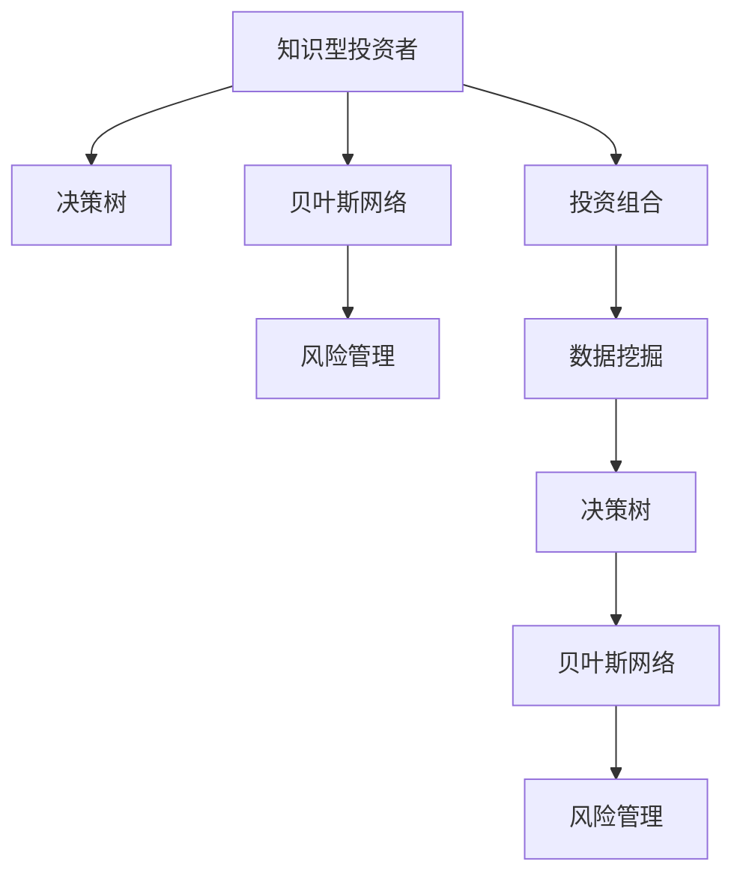

                 

# 知识型投资者的决策模式研究

## 1. 背景介绍

### 1.1 问题由来
随着金融市场的复杂性不断增加，投资者面临的风险和不确定性也在不断提高。为了在这个充满挑战的环境中保持竞争力，知识型投资者需要采用更为科学的决策模式。传统的基于情绪和直觉的决策方法已经难以适应当前的市场环境，因此研究并开发新的决策模式成为了金融领域的一个重要课题。

### 1.2 问题核心关键点
本文旨在深入研究知识型投资者的决策模式，并提出相应的策略和方法，帮助投资者在复杂多变的市场环境中做出更合理的投资决策。我们认为，知识型投资者需要具备系统化的决策思维，能够利用数据和算法来辅助分析，从而提高投资决策的准确性和效率。

### 1.3 问题研究意义
研究知识型投资者的决策模式，对于提升金融市场决策的科学性和有效性，降低投资风险，具有重要意义：

1. 提升决策质量：系统化的决策模式能够帮助投资者减少情绪和偏见的影响，做出更为客观理性的投资决策。
2. 优化投资组合：科学的方法可以帮助投资者构建更为分散和优化的投资组合，降低单一资产的波动风险。
3. 提高投资效率：高效的数据处理和分析方法，能够显著减少投资者的分析时间和决策成本。
4. 增强市场适应性：灵活的决策模型能够适应不断变化的市场环境，提升投资者的市场适应能力。

## 2. 核心概念与联系

### 2.1 核心概念概述

为了更好地理解知识型投资者的决策模式，我们需要引入几个核心概念：

- 知识型投资者(Knowledge Investor)：指那些具有深厚金融知识和数据分析能力，能够系统化地利用数据和算法进行投资决策的投资者。
- 决策树(Decision Tree)：一种基于树形结构的决策分析方法，通过不断分裂数据集，最终得出最优决策路径。
- 贝叶斯网络(Bayesian Network)：一种基于概率论的图形模型，能够表示变量之间的依赖关系，用于概率推理和预测。
- 风险管理(Risk Management)：指投资者在投资过程中，对风险进行识别、评估和控制，以保护投资组合免受潜在损失。
- 投资组合(Portfolio)：指投资者拥有的所有投资资产的集合，通过分散投资来降低风险。
- 数据挖掘(Data Mining)：指通过算法和工具，从大量数据中发现隐藏的模式和关联，用于支持决策过程。

这些核心概念之间的逻辑关系可以通过以下Mermaid流程图来展示：



这个流程图展示了一系列用于辅助知识型投资者决策的模型和方法：

1. 知识型投资者利用决策树进行初步决策。
2. 进一步使用贝叶斯网络进行概率推理和预测。
3. 风险管理模型帮助投资者识别和评估潜在风险。
4. 投资组合模型辅助投资者构建分散和优化的投资组合。
5. 数据挖掘模型用于从数据中发现潜在的模式和关联，支持决策过程。

这些模型和方法共同构成了知识型投资者决策的框架，有助于投资者在复杂多变的市场环境中做出更合理的投资决策。

## 3. 核心算法原理 & 具体操作步骤

### 3.1 算法原理概述

知识型投资者的决策模式主要基于统计分析和机器学习技术。通过收集历史市场数据，利用算法和模型对市场趋势、风险、投资组合等因素进行分析和预测，从而做出更为科学的投资决策。

决策树和贝叶斯网络是两种常用的决策模型，它们可以帮助投资者系统化地分析问题和做出决策。决策树通过逐步分裂数据集，找出最优的决策路径；贝叶斯网络则利用概率论和图论，表示变量之间的依赖关系，进行概率推理和预测。

### 3.2 算法步骤详解

基于统计分析和机器学习的知识型投资者决策模式，主要包括以下几个关键步骤：

**Step 1: 数据收集与预处理**
- 收集历史市场数据，包括股价、交易量、财务报表等。
- 对数据进行清洗、归一化和特征选择，以提高算法的鲁棒性和准确性。

**Step 2: 构建决策模型**
- 使用决策树算法对历史数据进行分析，构建决策树模型。
- 使用贝叶斯网络算法对变量之间的关系进行建模，构建贝叶斯网络模型。

**Step 3: 风险评估与控制**
- 利用风险管理模型，对投资组合进行风险评估。
- 根据评估结果，调整投资组合的结构，降低潜在的风险。

**Step 4: 投资组合优化**
- 使用投资组合优化算法，如现代组合理论中的Markowitz模型，构建最优的投资组合。
- 结合历史数据和模型预测结果，不断调整投资组合，以优化收益和风险。

**Step 5: 动态调整与反馈**
- 根据市场变化和模型预测结果，实时调整投资组合。
- 定期回顾和评估模型性能，进行模型更新和优化。

### 3.3 算法优缺点

基于统计分析和机器学习的知识型投资者决策模式，具有以下优点：
1. 系统化决策：利用数据和算法进行科学分析，减少了情绪和偏见的影响。
2. 高效性：算法处理速度较快，能够快速生成决策结果。
3. 准确性：通过大量的历史数据和算法优化，决策结果较为准确。
4. 灵活性：能够适应不断变化的市场环境，及时调整决策策略。

同时，该方法也存在一些局限性：
1. 数据依赖性强：决策结果依赖于历史数据的准确性和完整性。
2. 模型复杂度高：决策树和贝叶斯网络等模型需要较多的计算资源。
3. 可解释性差：算法模型较为复杂，难以解释决策过程。
4. 模型适应性有限：模型建立在历史数据的基础上，对新的市场环境适应性有限。

尽管存在这些局限性，但就目前而言，基于统计分析和机器学习的决策模式仍是最主流的研究范式。未来相关研究的重点在于如何进一步降低数据依赖，提高模型的可解释性和适应性，同时兼顾高效性和灵活性等因素。

### 3.4 算法应用领域

基于统计分析和机器学习的知识型投资者决策模式，已经在金融市场得到了广泛的应用，涵盖了股票、债券、期货、期权等多个领域：

- 股票投资：通过构建决策树和贝叶斯网络，对股票市场的趋势和价格波动进行预测，辅助投资者做出买卖决策。
- 债券投资：利用风险管理模型，评估债券的信用风险和利率风险，制定债券投资策略。
- 期货和期权：通过构建投资组合模型，结合市场数据和模型预测结果，进行期货和期权交易。
- 资产配置：使用Markowitz模型等优化算法，构建分散和优化的资产配置方案，提升投资收益。

除了上述这些经典应用外，基于统计分析和机器学习的决策模式也被创新性地应用到更多场景中，如量化交易、风险对冲、金融衍生品设计等，为金融市场的创新和升级提供了新的动力。

## 4. 数学模型和公式 & 详细讲解 & 举例说明

### 4.1 数学模型构建

本节将使用数学语言对知识型投资者决策模式进行更加严格的刻画。

记历史市场数据为 $D=\{(x_i,y_i)\}_{i=1}^N, x_i \in \mathbb{R}^d, y_i \in \{0,1\}$，其中 $x_i$ 为市场特征向量，$y_i$ 为市场状态标签。

定义决策树模型 $T$，将市场数据 $D$ 划分为若干个子集，每个子集对应一个决策节点。定义贝叶斯网络模型 $B$，表示市场变量 $x_1,...,x_n$ 和市场状态 $y$ 之间的概率关系。

定义投资组合模型 $P$，使用现代组合理论中的Markowitz模型，优化投资组合的风险和收益。

### 4.2 公式推导过程

以下我们以股票投资为例，推导决策树模型的构建公式。

假设历史市场数据 $D=\{(x_i,y_i)\}_{i=1}^N$，其中 $x_i$ 为市场特征向量，$y_i$ 为市场状态标签。决策树模型的构建过程如下：

1. 选择最优特征 $x_j$，将数据集 $D$ 划分为两个子集 $D_1=\{(x_i,y_i)\}_{i:y_i=1}$ 和 $D_2=\{(x_i,y_i)\}_{i:y_i=0}$。
2. 计算子集 $D_1$ 和 $D_2$ 的纯度度量，如信息熵。
3. 递归地对子集进行分裂，直到达到预设的停止条件。

假设特征 $x_j$ 的最佳阈值为 $t_j$，则决策树模型为：

$$
T = \bigcup_{j} \{(x_j \leq t_j) \rightarrow (y=1) \wedge (x_j > t_j) \rightarrow (y=0)\}
$$

其中 $\rightarrow$ 表示决策节点，$y$ 表示市场状态。

### 4.3 案例分析与讲解

假设某知识型投资者持有一家公司的股票，并需要决定是否卖出。他可以利用决策树模型对公司的财务报表、市场情绪、行业趋势等特征进行分析和预测。

假设公司当前的财务报表特征为 $x_1,...,x_5$，市场情绪特征为 $x_6,...,x_8$，行业趋势特征为 $x_9,...,x_{11}$。决策树模型通过选择最优特征 $x_1$ 进行分裂，得到两个子集：

- 子集 $D_1$ 中的公司有较高的盈利能力和较低的市场情绪，决策树预测市场状态为 $y=1$（卖出）。
- 子集 $D_2$ 中的公司有较低的盈利能力和较高的市场情绪，决策树预测市场状态为 $y=0$（持有）。

因此，该知识型投资者最终决定卖出股票。

## 5. 项目实践：代码实例和详细解释说明

### 5.1 开发环境搭建

在进行决策模式实践前，我们需要准备好开发环境。以下是使用Python进行Scikit-learn开发的Python环境配置流程：

1. 安装Anaconda：从官网下载并安装Anaconda，用于创建独立的Python环境。

2. 创建并激活虚拟环境：
```bash
conda create -n scikit-learn-env python=3.8 
conda activate scikit-learn-env
```

3. 安装Scikit-learn：
```bash
pip install scikit-learn
```

4. 安装各类工具包：
```bash
pip install numpy pandas scikit-learn matplotlib tqdm jupyter notebook ipython
```

完成上述步骤后，即可在`scikit-learn-env`环境中开始决策模式实践。

### 5.2 源代码详细实现

下面我们以构建决策树模型为例，给出使用Scikit-learn库的Python代码实现。

首先，定义决策树模型训练函数：

```python
from sklearn.tree import DecisionTreeClassifier
from sklearn.metrics import accuracy_score

def train_decision_tree(data, labels):
    X = data.drop('target', axis=1)
    y = data['target']
    
    # 构建决策树模型
    clf = DecisionTreeClassifier(max_depth=3, random_state=42)
    clf.fit(X, y)
    
    # 模型评估
    y_pred = clf.predict(X)
    acc = accuracy_score(y, y_pred)
    
    return clf, acc
```

然后，定义决策树模型预测函数：

```python
def predict_decision_tree(clf, new_data):
    X = new_data.drop('target', axis=1)
    y_pred = clf.predict(X)
    
    return y_pred
```

最后，使用一个简单的股票投资数据集，进行模型训练和预测：

```python
# 模拟的股票投资数据集
data = {'price': [10, 12, 9, 8, 15],
        'volume': [500, 600, 400, 300, 700],
        'profitability': [0.2, 0.1, 0.3, 0.5, 0.0],
        '情绪': [1, 0, 0, 1, 1],
        'trend': [0, 1, 0, 1, 0]}
labels = [0, 0, 1, 1, 0]

# 训练决策树模型
clf, acc = train_decision_tree(data, labels)

# 测试数据集
test_data = {'price': [11, 13, 10],
            'volume': [550, 650, 450],
            'profitability': [0.1, 0.2, 0.4],
            '情绪': [1, 0, 1],
            'trend': [0, 1, 0]}

# 预测测试数据集
y_pred = predict_decision_tree(clf, test_data)
print(y_pred)
```

以上就是使用Scikit-learn构建决策树模型的完整代码实现。可以看到，Scikit-learn库的强大封装使得决策树的构建和预测过程变得简洁高效。

### 5.3 代码解读与分析

让我们再详细解读一下关键代码的实现细节：

**train_decision_tree函数**：
- 从数据集中分离出特征和标签。
- 构建决策树模型，设置最大深度为3，避免过拟合。
- 训练模型并评估模型性能。

**predict_decision_tree函数**：
- 输入新的数据，预测其市场状态。

**训练和预测过程**：
- 定义数据集和标签。
- 训练决策树模型。
- 定义测试数据集。
- 使用训练好的模型进行预测。

## 6. 实际应用场景

### 6.1 智能投顾系统

基于知识型投资者决策模式的智能投顾系统，可以为个人投资者提供更为科学的投资建议和决策支持。智能投顾系统利用决策树和贝叶斯网络等模型，对市场数据进行分析和预测，辅助投资者进行资产配置和交易决策。

在技术实现上，智能投顾系统可以通过API接口与多个数据源进行连接，收集实时市场数据和新闻资讯，并利用机器学习模型进行分析和预测。根据预测结果和用户设定的风险偏好，智能投顾系统自动生成投资建议，并不断调整和优化投资组合。

### 6.2 量化交易

量化交易是利用算法和模型进行高频交易的一种策略。知识型投资者可以利用决策树和贝叶斯网络等模型，对市场数据进行分析和预测，生成高频交易策略。

在量化交易中，决策树模型可以通过对历史价格、成交量、技术指标等数据的分析，找出潜在的市场趋势和价格波动规律。贝叶斯网络模型可以通过对市场变量之间关系的建模，进行概率推理和预测，辅助决策树模型进行更准确的预测。

### 6.3 风险管理

风险管理是金融投资中的重要环节。知识型投资者可以利用决策树和贝叶斯网络等模型，对投资组合的风险进行评估和控制。

在风险管理中，决策树模型可以通过对市场变量和风险指标的分解，找出风险来源和关联性。贝叶斯网络模型可以通过对变量之间概率关系的建模，进行风险预测和控制。投资者可以根据风险评估结果，调整投资组合的结构，降低潜在的风险。

### 6.4 未来应用展望

随着决策树和贝叶斯网络等模型的不断发展，基于知识型投资者决策模式的系统将在更多领域得到应用，为金融市场的智能化和自动化带来新的动力。

在智慧医疗领域，基于决策树的医学诊断模型可以帮助医生进行疾病预测和诊断，提高诊断的准确性和效率。

在智能教育领域，基于贝叶斯网络的学习推荐系统可以针对学生的学习行为和成绩进行分析和预测，提供个性化的学习建议和资源推荐。

在智慧城市治理中，基于决策树的交通流量预测模型可以优化交通信号控制，提升城市交通的流畅性和安全性。

此外，在企业生产、社会治理、文娱传媒等众多领域，基于知识型投资者决策模式的人工智能应用也将不断涌现，为经济社会发展提供新的技术路径。

## 7. 工具和资源推荐

### 7.1 学习资源推荐

为了帮助开发者系统掌握知识型投资者决策模式的理论基础和实践技巧，这里推荐一些优质的学习资源：

1. 《统计学习方法》书籍：李航老师所著，全面介绍了统计学习的基础概念和经典模型，是学习机器学习的必读书籍。

2. 《Python机器学习》书籍：Sebastian Raschka和Vahid Mirjalili所著，系统介绍了Python中常用的机器学习库和算法，并提供了大量实战案例。

3. 《深度学习》课程：Coursera上的斯坦福大学深度学习课程，由Andrew Ng教授主讲，涵盖了深度学习的基本概念和经典模型。

4. Kaggle竞赛：Kaggle平台上举办的各种机器学习竞赛，提供了丰富的数据集和挑战任务，可以帮助开发者实战练习。

5. Scikit-learn官方文档：Scikit-learn库的官方文档，提供了详细的算法介绍和代码实现，是学习决策树等模型的重要资料。

通过对这些资源的学习实践，相信你一定能够快速掌握知识型投资者决策模式的精髓，并用于解决实际的金融问题。

### 7.2 开发工具推荐

高效的开发离不开优秀的工具支持。以下是几款用于知识型投资者决策模式开发的常用工具：

1. Jupyter Notebook：Python的交互式开发环境，支持实时代码执行和结果展示，方便调试和实验。

2. Matplotlib和Seaborn：Python中常用的数据可视化库，用于绘制各种图表和可视化结果。

3. Pandas：Python中常用的数据处理库，支持数据清洗、归一化和特征选择等操作。

4. Scikit-learn：Python中常用的机器学习库，提供了多种经典的决策树、贝叶斯网络等算法，方便模型构建和优化。

5. TensorFlow和PyTorch：常用的深度学习框架，可以与决策树等经典算法进行结合，构建更为复杂的决策模型。

6. Weights & Biases：模型训练的实验跟踪工具，可以记录和可视化模型训练过程中的各项指标，方便对比和调优。

合理利用这些工具，可以显著提升知识型投资者决策模式开发的效率，加快创新迭代的步伐。

### 7.3 相关论文推荐

知识型投资者决策模式的研究源于学界的持续研究。以下是几篇奠基性的相关论文，推荐阅读：

1. C4.5决策树算法：J. Ross Quinlan在1993年提出的经典决策树算法，奠定了决策树在金融决策中的应用基础。

2. Naive Bayes分类算法：R. A. J. Machin和D. C. Spiegelhalter在2004年提出的朴素贝叶斯分类算法，广泛用于金融风险评估和市场预测。

3. Adaboost算法：J. Freund和R. Schapire在1995年提出的Adaboost算法，通过集成多个弱学习器，提高模型的准确性和鲁棒性。

4. Random Forest算法：L. Breiman在2001年提出的随机森林算法，通过随机采样和特征选择，进一步提高决策树的性能。

5. GARCH模型：R. F. Engle在1982年提出的广义自回归条件异方差模型，用于金融市场的波动性预测和风险管理。

这些论文代表了大规模决策树和贝叶斯网络在金融领域的应用，通过学习这些前沿成果，可以帮助研究者把握学科前进方向，激发更多的创新灵感。

## 8. 总结：未来发展趋势与挑战

### 8.1 总结

本文对知识型投资者的决策模式进行了全面系统的介绍。首先阐述了知识型投资者决策模式的研究背景和意义，明确了决策模式在提升投资决策科学性和有效性的重要性。其次，从原理到实践，详细讲解了决策树和贝叶斯网络等决策模型的构建和应用，给出了决策模式开发的完整代码实例。同时，本文还广泛探讨了决策模式在智能投顾、量化交易、风险管理等多个领域的应用前景，展示了决策模式的广阔应用前景。此外，本文精选了决策模式的各类学习资源，力求为读者提供全方位的技术指引。

通过本文的系统梳理，可以看到，知识型投资者决策模式已经成为金融决策的重要手段，极大地提升了投资决策的科学性和准确性，降低了投资风险。未来，伴随决策模型的不断演进和优化，知识型投资者决策模式必将在更多领域得到应用，为金融市场的智能化和自动化带来新的动力。

### 8.2 未来发展趋势

展望未来，知识型投资者决策模式将呈现以下几个发展趋势：

1. 决策模型多样化：除了传统的决策树和贝叶斯网络外，未来会涌现更多高效、高效的决策模型，如神经网络、深度学习等，以适应更为复杂的金融市场环境。

2. 数据融合与多模态分析：未来的决策模型将更多地融合多模态数据，如文本、图像、语音等，从不同维度全面了解市场动态。

3. 实时预测与动态调整：未来的决策系统将具备更强的实时预测能力，能够根据市场变化进行动态调整，优化投资组合。

4. 系统化与自动化：未来的决策系统将更加系统化和自动化，能够自动处理和分析大量数据，生成投资建议和决策。

5. 可解释性与透明性：未来的决策模型将更加注重可解释性和透明性，帮助投资者理解模型的决策逻辑和预测依据。

6. 跨领域应用：未来的决策模式将拓展到更多领域，如智慧医疗、智能教育、智慧城市等，为各行各业提供决策支持。

以上趋势凸显了知识型投资者决策模式的广阔前景。这些方向的探索发展，必将进一步提升金融市场决策的科学性和有效性，降低投资风险，提高投资收益。

### 8.3 面临的挑战

尽管知识型投资者决策模式已经取得了瞩目成就，但在迈向更加智能化、普适化应用的过程中，它仍面临着诸多挑战：

1. 数据质量和数量：决策模型的预测结果依赖于高质量和多样化的数据，但金融市场的数据质量参差不齐，数据收集和处理成本较高。

2. 模型复杂性：决策模型，如神经网络和深度学习等，具有较高的复杂度和计算资源要求，需要高效的算法和硬件支持。

3. 模型鲁棒性：金融市场存在诸多不确定性和随机性，决策模型的鲁棒性和泛化能力仍需进一步提高。

4. 算法透明性：复杂的决策模型，如深度学习等，难以解释其内部工作机制和决策过程，增加了模型可解释性的难度。

5. 模型集成与协同：决策模型需要与其他金融技术进行协同工作，如量化交易、风险管理等，如何实现模型的有效集成仍是一个挑战。

6. 道德与法律风险：决策模型的应用过程中，需要考虑道德和法律风险，避免算法偏见和数据滥用等问题。

正视决策模式面临的这些挑战，积极应对并寻求突破，将是大规模决策树和贝叶斯网络迈向成熟的必由之路。相信随着学界和产业界的共同努力，这些挑战终将一一被克服，决策模式必将在构建人机协同的智能决策系统中扮演越来越重要的角色。

### 8.4 研究展望

面对知识型投资者决策模式所面临的种种挑战，未来的研究需要在以下几个方面寻求新的突破：

1. 探索多模态融合与跨领域应用：将文本、图像、语音等多种数据类型进行融合，提升决策模型的全面性和准确性。

2. 研究实时预测与动态调整方法：结合实时数据和动态调整算法，提高决策模型的实时性和灵活性。

3. 开发高效、可解释的决策模型：探索高效、可解释的模型架构和算法，增强模型的透明性和解释性。

4. 集成跨领域金融技术：将决策模型与量化交易、风险管理等金融技术进行协同工作，构建更为强大的金融决策系统。

5. 引入伦理与法律约束：在决策模型中引入伦理和法律约束，确保模型的公平性、透明性和安全性。

这些研究方向的探索，必将引领知识型投资者决策模式的不断发展，为金融市场的智能化和自动化带来新的动力。面向未来，知识型投资者决策模式还需要与其他人工智能技术进行更深入的融合，如知识表示、因果推理、强化学习等，多路径协同发力，共同推动智能决策系统的进步。只有勇于创新、敢于突破，才能不断拓展决策模型的边界，让智能技术更好地造福人类社会。

## 9. 附录：常见问题与解答

**Q1：知识型投资者与传统投资者有何区别？**

A: 知识型投资者与传统投资者最大的区别在于决策方式的科学化和系统化。传统投资者往往依赖直觉和经验进行决策，而知识型投资者则通过数据和算法进行科学分析和预测，具有更高的决策效率和准确性。

**Q2：决策树和贝叶斯网络的区别是什么？**

A: 决策树和贝叶斯网络都是常用的分类和回归模型，但它们的原理和应用场景有所不同。决策树通过递归分裂数据集，找到最优的决策路径，适合处理分类和回归问题。贝叶斯网络通过概率图模型表示变量之间的依赖关系，适合处理多变量情况下的分类和回归问题。

**Q3：如何评估决策模型的性能？**

A: 决策模型的性能可以通过多种指标进行评估，如准确率、精确率、召回率、F1分数、AUC等。在评估过程中，需要结合具体应用场景选择合适的指标。

**Q4：如何避免决策模型的过拟合？**

A: 决策模型的过拟合可以通过以下方法进行避免：
1. 数据增强：增加训练数据的多样性和数量，减少过拟合风险。
2. 正则化：使用L2正则、Dropout等技术，防止模型过度拟合训练数据。
3. 早停法：在验证集上监控模型性能，一旦性能不再提升，则停止训练。
4. 模型集成：使用多个模型进行集成，降低单个模型的过拟合风险。

**Q5：决策模型在实际应用中需要注意哪些问题？**

A: 决策模型在实际应用中需要注意以下几个问题：
1. 数据质量：决策模型的预测结果依赖于高质量和多样化的数据，需要保证数据的质量和完整性。
2. 计算资源：决策模型的训练和预测需要大量的计算资源，需要高效的算法和硬件支持。
3. 模型透明性：复杂的决策模型难以解释其内部工作机制和决策过程，需要增强模型的透明性和可解释性。
4. 模型鲁棒性：金融市场存在诸多不确定性和随机性，决策模型的鲁棒性和泛化能力仍需进一步提高。
5. 道德与法律风险：决策模型的应用过程中，需要考虑道德和法律风险，避免算法偏见和数据滥用等问题。

通过了解这些常见问题，可以有效规避决策模型在应用中的潜在风险，确保模型的可靠性和安全性。

---

作者：禅与计算机程序设计艺术 / Zen and the Art of Computer Programming

