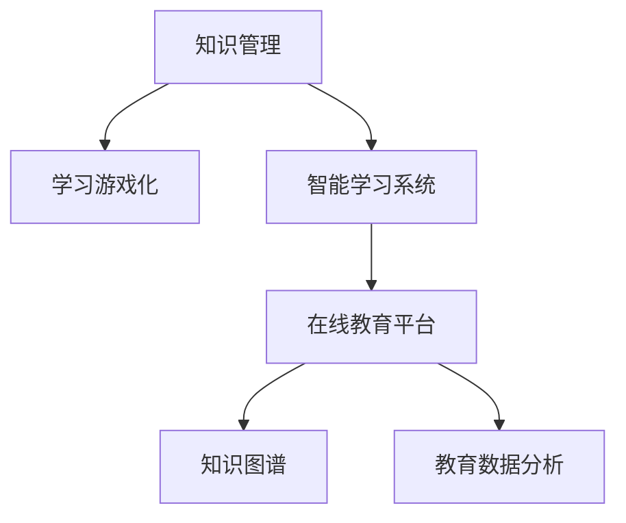

                 

# 知识的gamification：寓教于乐的学习革命

> 关键词：知识管理, 学习游戏化, 人工智能辅助教育, 智能学习系统, 在线教育平台, 知识图谱, 教育数据分析

## 1. 背景介绍

### 1.1 问题由来
随着信息技术的飞速发展，知识获取的方式越来越多样化，人们可以随时随地通过互联网获取海量的知识。然而，知识的海洋广阔而深邃，如何在如此丰富的信息中找到自己所需的学习资源，并高效地掌握，成为了一个巨大的挑战。传统意义上的被动学习已经无法适应现代人的学习需求，亟需一种更加主动、有趣且高效的全新学习方式。

这一背景催生了知识管理（Knowledge Management）的兴起，尤其是在教育领域，如何将枯燥的知识学习过程变得有趣且高效，成为教育工作者和科技工作者共同关注的焦点。而“知识游戏化”（Knowledge Gamification）的提出，正是试图将知识管理与游戏设计理念相结合，创造一种新的学习模式。

### 1.2 问题核心关键点
知识游戏化旨在通过将知识学习过程转变为游戏的形式，使其更具有趣味性和挑战性，从而激发学习者的兴趣和主动性。其核心在于：
- **学习动机**：通过设计吸引人的游戏机制，激发学习者的内在动机，使其从被动学习转为主动学习。
- **反馈机制**：及时、有效的反馈能够帮助学习者了解自己的学习进度和掌握情况，增强学习的成就感。
- **个性化学习**：根据学习者的个人兴趣、能力和需求，量身定制个性化的学习内容和路径。
- **互动性**：通过社交互动、协作学习等方式，增强学习过程的参与感和互动性。

## 2. 核心概念与联系

### 2.1 核心概念概述

为更好地理解知识游戏化的原理，本节将介绍几个密切相关的核心概念：

- **知识管理（Knowledge Management）**：通过系统化的方法收集、存储、组织和分享知识，以便更好地利用和传播知识。
- **学习游戏化（Learning Gamification）**：将游戏的元素融入学习过程中，使其更加有趣和具有挑战性，从而激发学习动机。
- **智能学习系统（Intelligent Learning Systems）**：利用人工智能技术，如自然语言处理、机器学习等，自动提供个性化的学习推荐和反馈。
- **在线教育平台（Online Learning Platforms）**：借助互联网技术，提供在线课程、学习资源和互动交流的平台。
- **知识图谱（Knowledge Graph）**：通过将知识实体和关系结构化，形成一个类似人类的知识网络，以支持知识发现和推理。
- **教育数据分析（Educational Data Analysis）**：通过分析学习行为数据，了解学习者的学习状态和需求，优化学习过程。

这些核心概念之间的逻辑关系可以通过以下Mermaid流程图来展示：



这个流程图展示了这个概念体系的基本框架，即知识管理是基础，学习游戏化是手段，智能学习系统是技术支撑，在线教育平台是平台保障，知识图谱是知识结构化的工具，教育数据分析是效果评估的手段。

## 3. 核心算法原理 & 具体操作步骤
### 3.1 算法原理概述

知识游戏化学习系统的核心算法原理基于“强化学习”（Reinforcement Learning, RL）理论。强化学习是一种通过与环境交互，学习最优决策策略的学习方法。在知识游戏化学习系统中，学习者（即玩家）通过与学习内容（即游戏环境）的交互，不断探索、实践、反思和优化，从而掌握知识。

系统通过以下步骤来实现这一过程：
1. **状态（State）定义**：定义学习者当前所处的知识状态，包括已经掌握的知识和需要掌握的知识。
2. **行动（Action）设计**：设计学习者可以采取的行动，如阅读、练习、讨论等。
3. **奖励（Reward）设计**：设计奖励机制，激励学习者采取有助于知识掌握的行动。
4. **反馈（Feedback）提供**：通过即时反馈，告知学习者其行动的成效。
5. **模型更新（Model Update）**：根据学习者的行为和反馈，更新知识管理模型，优化知识结构。

### 3.2 算法步骤详解

一个典型的知识游戏化学习系统的工作流程如下：

**Step 1: 用户建模**
- 收集用户的兴趣、偏好、能力等信息，构建用户模型。
- 设计游戏任务，确定任务的难易程度和目标。

**Step 2: 智能推荐**
- 根据用户模型，推荐合适的学习内容。
- 动态调整推荐策略，根据学习者的行为和反馈进行优化。

**Step 3: 游戏化设计**
- 将学习内容转化为游戏任务，设计游戏目标、规则和奖励机制。
- 实现游戏界面，使用图形化展示学习进度和成果。

**Step 4: 行为追踪与分析**
- 追踪学习者的行为数据，如阅读时间、完成度等。
- 通过数据分析，评估学习者的学习效果和进步。

**Step 5: 反馈与激励**
- 根据学习者的表现，提供即时反馈，如分数、等级等。
- 设计激励机制，如徽章、排行榜等，鼓励学习者积极参与。

**Step 6: 迭代优化**
- 根据学习者的反馈和数据分析结果，不断调整和优化游戏规则和推荐策略。
- 通过不断迭代，提升系统的学习效果和用户体验。

### 3.3 算法优缺点

知识游戏化学习系统具有以下优点：
1. **趣味性**：通过将知识学习与游戏设计相结合，使其更加有趣和具有挑战性，吸引学习者的兴趣。
2. **主动性**：通过设计激励机制和即时反馈，激发学习者的内在动机，使其主动学习。
3. **个性化**：根据学习者的个人兴趣和需求，提供个性化的学习内容和路径。
4. **互动性**：通过社交互动和协作学习，增强学习过程的参与感和互动性。
5. **即时反馈**：通过即时反馈机制，帮助学习者了解自己的学习进度和掌握情况，增强学习的成就感。

同时，该系统也存在一些局限性：
1. **设计复杂性**：设计符合教育目标和趣味性的游戏机制需要较高的设计和开发水平。
2. **数据隐私**：追踪学习者的行为数据，可能涉及隐私问题，需要谨慎处理。
3. **技术要求高**：实现高效的智能推荐和行为分析，需要先进的算法和计算资源。
4. **成本高**：开发和维护一个高品质的知识游戏化系统，需要较高的成本投入。

尽管存在这些局限性，但知识游戏化学习系统仍被认为是未来教育技术的一个重要方向，其潜在的教育效果和社会价值值得深入探索。

### 3.4 算法应用领域

知识游戏化学习系统已经在多个领域得到应用，例如：

- **在线教育平台**：如Coursera、edX等，通过将课程内容游戏化，吸引学生积极参与学习。
- **职业培训**：如职业技能认证培训，通过设计与职业相关的任务和奖励机制，提高培训效果。
- **医疗健康**：如健康知识普及，通过设计互动性强的游戏活动，提升公众健康意识和行为。
- **企业培训**：如员工技能提升，通过设计知识竞赛和奖励机制，激发员工的积极性。
- **公共政策教育**：如社会公正教育，通过设计模拟和游戏活动，增强公民对公共政策的理解和参与。

此外，知识游戏化学习系统还在军事训练、文化教育、科学普及等领域展现了其广泛的应用潜力。

## 4. 数学模型和公式 & 详细讲解
### 4.1 数学模型构建

本节将使用数学语言对知识游戏化学习系统的构建进行严格刻画。

记学习者当前所掌握的知识状态为 $s_t$，学习者采取的行动为 $a_t$，学习者的即时奖励为 $r_t$，学习者根据当前状态和行动，学习到新的知识状态 $s_{t+1}$。系统通过强化学习算法，学习最优的策略 $\pi$，使得在每个状态下采取的行动能够最大化累计奖励。

定义累计奖励为 $G_t = \sum_{k=t}^{\infty} \gamma^k r_{t+k}$，其中 $\gamma$ 为折扣因子。系统的目标是最小化累计奖励的方差，即：

$$
\min_{\pi} \mathbb{E}[(G_t - \mathbb{E}[G_t])^2]
$$

### 4.2 公式推导过程

以下我们以最简单的Q-learning算法为例，推导其基本公式：

1. 初始化Q值：$Q_{t=0}(s, a) = 0$。
2. 更新Q值：
   $$
   Q_{t+1}(s, a) = Q_t(s, a) + \alpha \cdot [r_t + \gamma \max_{a'} Q_t(s', a') - Q_t(s, a)]
   $$

其中，$\alpha$ 为学习率，$s'$ 为采取行动 $a$ 后到达的新状态。

3. 选择行动：
   $$
   a_t = \arg\max_a Q_t(s_t, a)
   $$

通过以上公式，Q-learning算法不断迭代更新Q值，使得 $Q_t(s_t, a_t)$ 趋近于最优值 $Q^*(s_t, a_t)$。

### 4.3 案例分析与讲解

以一个简单的知识游戏化学习系统为例，分析其工作原理：

假设我们有一个简单的编程学习系统，学习者需要掌握Python编程语言。系统初始化学习者所掌握的Python知识状态 $s_0$，并将其转化为一个简单的任务，如编写一个函数。

当学习者选择阅读相关的编程教程（行动 $a_1$），系统会给予一定的奖励（如分数），并将学习者掌握的知识状态更新为 $s_1$。学习者根据当前知识状态和奖励，评估阅读教程的决策价值，并决定是否选择再次阅读。

当学习者选择编写函数（行动 $a_2$），系统会给予更高的奖励，并将学习者掌握的知识状态更新为 $s_2$。如果编写的函数符合要求，系统会额外奖励，表示学习者掌握了更多的Python知识。

通过不断迭代，系统记录学习者的行动和奖励，逐步优化Q值，使学习者在面对不同状态时，能够做出最优的行动决策。

## 5. 项目实践：代码实例和详细解释说明
### 5.1 开发环境搭建

在进行知识游戏化学习系统开发前，我们需要准备好开发环境。以下是使用Python进行Django框架开发的流程：

1. 安装Django：
```bash
pip install django
```

2. 创建Django项目和应用：
```bash
django-admin startproject knowledge_game
cd knowledge_game
python manage.py startapp game
```

3. 安装相关包：
```bash
pip install django-games
pip install django-templates
pip install django-crispy-forms
pip install django-widget-tweaks
```

4. 配置数据库：
```bash
vi settings.py
```

5. 创建数据库迁移和应用数据：
```bash
python manage.py makemigrations
python manage.py migrate
python manage.py createsuperuser
```

完成上述步骤后，即可在知识游戏化学习系统的开发环境中开始编码实现。

### 5.2 源代码详细实现

我们以一个简单的Python编程学习系统为例，展示其知识游戏化设计的具体实现：

```python
from django.shortcuts import render, redirect
from django.views.decorators.csrf import csrf_exempt
from django.http import JsonResponse
from django.core.exceptions import ObjectDoesNotExist
from game.models import Player, Challenge
from game.utils import get_game_state, update_game_state

@csrf_exempt
def play_game(request):
    player_id = request.session.get('player')
    challenge_id = request.POST.get('challenge', -1)
    if challenge_id == -1:
        return redirect('index')
    
    try:
        challenge = Challenge.objects.get(id=challenge_id)
        game_state = get_game_state(player_id, challenge)
    except ObjectDoesNotExist:
        return JsonResponse({'error': 'Challenge not found'})
    
    if game_state['state'] == 'win':
        challenge.finish(player_id)
        return redirect('index')
    
    response = {}
    response['question'] = challenge.question
    response['answer'] = challenge.answer
    
    if 'answer' in request.POST:
        if request.POST['answer'] == challenge.answer:
            response['reward'] = challenge.reward
            response['state'] = 'win'
        else:
            response['reward'] = -challenge.reward
            response['state'] = 'lose'
        update_game_state(player_id, challenge, response)
    
    return JsonResponse(response)
```

### 5.3 代码解读与分析

在上面的代码中，我们通过Django框架实现了一个简单的知识游戏化学习系统。具体实现步骤如下：

**1. 初始化**
- 通过session获取玩家ID。
- 从请求中获取挑战ID，如果没有指定，则重定向到首页。

**2. 状态获取**
- 获取挑战对象。
- 调用自定义函数 `get_game_state` 获取玩家当前的状态，包括挑战题目、答案、得分等。

**3. 玩家行动**
- 如果玩家提交答案，判断是否正确，并调用自定义函数 `update_game_state` 更新玩家状态。

**4. 结果反馈**
- 根据玩家行动的结果，给予奖励或惩罚。
- 如果玩家答对，进入胜利状态，否则进入失败状态。

**5. 状态更新**
- 调用自定义函数 `update_game_state` 更新玩家状态，如得分、状态等。

### 5.4 运行结果展示

在实现知识游戏化学习系统的过程中，可以通过Django的模板引擎和表单功能，实现用户界面和交互逻辑。以下是一个简单的用户界面示例：

```html
<form method="post">
    
    <label for="answer">请输入答案：</label>
    <input type="text" name="answer" id="answer">
    <input type="submit" value="提交">
</form>
```

## 6. 实际应用场景
### 6.1 智慧教室

知识游戏化学习系统可以在智慧教室中得到广泛应用，通过将课程内容游戏化，激发学生的学习兴趣和积极性。例如，在Python编程课程中，可以通过设计编程任务和奖励机制，使学生在学习过程中保持高度的参与和互动。

**具体应用场景**：
- 设计编程任务：将编程课程内容转化为一系列编程任务，如编写函数、设计算法等。
- 奖励机制：通过积分、徽章等形式，奖励学生在任务中表现优异的成绩。
- 互动性：利用在线协作工具，让学生在任务中相互帮助、共同进步。

**效果预期**：
- 学生主动参与学习，提高学习兴趣和积极性。
- 通过游戏化的任务设计，使学生能够更加深入理解编程知识。
- 通过互动性强的协作学习，增强学生的团队合作能力。

### 6.2 企业培训

在企业培训中，知识游戏化学习系统可以通过设计与企业业务相关的任务和奖励机制，提高员工的培训效果和业务能力。

**具体应用场景**：
- 设计培训任务：将企业业务知识转化为一系列培训任务，如产品知识测试、业务流程模拟等。
- 奖励机制：通过奖金、晋升机会等形式，激励员工在培训中表现优异的成绩。
- 互动性：利用在线协作工具，让员工在任务中相互交流、共同学习。

**效果预期**：
- 员工积极参与培训，提高培训效果和业务能力。
- 通过游戏化的任务设计，使员工更加深入理解企业业务知识。
- 通过互动性强的协作学习，增强员工的团队合作能力。

### 6.3 公共政策教育

在公共政策教育中，知识游戏化学习系统可以通过设计模拟和游戏活动，增强公民对公共政策的理解和参与。

**具体应用场景**：
- 设计模拟活动：模拟公共政策制定和执行过程，如模拟政府会议、政策评估等。
- 奖励机制：通过投票、讨论等形式，奖励参与者在活动中表现优异的成绩。
- 互动性：利用在线协作工具，让参与者在活动中相互交流、共同探讨。

**效果预期**：
- 公民积极参与政策讨论，增强对公共政策的理解和参与。
- 通过游戏化的模拟活动，使公民能够更加深入理解政策制定和执行的流程。
- 通过互动性强的协作学习，增强公民的公共意识和社会责任感。

### 6.4 未来应用展望

随着知识游戏化学习系统的不断成熟，其在教育、培训、政策等领域的应用前景将更加广阔。未来，知识游戏化学习系统将能够提供更加个性化、互动性强、趣味性高的学习体验，使学习变得更加高效和有趣。

在技术上，未来的知识游戏化学习系统可能会引入更多先进的AI技术，如自然语言处理、计算机视觉等，提供更加丰富、多模态的学习内容。同时，通过大数据分析和机器学习，系统能够更精准地预测学习者的需求和兴趣，提供更个性化的学习路径和任务。

在应用场景上，知识游戏化学习系统将进一步拓展到更多垂直领域，如医疗健康、金融理财、艺术设计等，为各行各业提供定制化的知识管理解决方案。

## 7. 工具和资源推荐
### 7.1 学习资源推荐

为了帮助开发者系统掌握知识游戏化学习系统的理论基础和实践技巧，这里推荐一些优质的学习资源：

1. **《游戏心理学》**（Game Psychology）：这本书探讨了游戏设计的心理学原理，包括如何设计有趣、有挑战性的游戏，激发玩家的内在动机。
2. **《游戏设计艺术》**（The Art of Game Design）：这本书提供了游戏设计的全流程指导，涵盖游戏策划、游戏设计、游戏开发等多个方面。
3. **Coursera的《游戏设计》课程**：斯坦福大学开设的游戏设计课程，涵盖了游戏设计的基础理论和实践技能。
4. **Udemy的《游戏开发：Unity游戏设计》课程**：通过Unity引擎开发游戏，学习游戏设计的实际应用技能。
5. **GitHub上的开源游戏项目**：通过参与开源游戏项目，学习游戏开发的代码实现和设计思路。

通过对这些资源的学习实践，相信你一定能够快速掌握知识游戏化学习系统的核心技术和设计思路。

### 7.2 开发工具推荐

高效的开发离不开优秀的工具支持。以下是几款用于知识游戏化学习系统开发的常用工具：

1. **Django**：Python的开源Web框架，支持高效开发Web应用，具有良好的扩展性和灵活性。
2. **Unity**：广泛使用的游戏引擎，支持跨平台开发，适用于设计和开发复杂的游戏和应用。
3. **Unreal Engine**：支持高端游戏开发，具有强大的图形渲染能力和物理引擎，适用于开发高质量的游戏和应用。
4. **Blender**：开源的3D制作软件，适用于设计和制作游戏中的三维模型和动画。
5. **Maya**：专业的3D建模和动画软件，适用于高端游戏开发和影视制作。

合理利用这些工具，可以显著提升知识游戏化学习系统的开发效率，加快创新迭代的步伐。

### 7.3 相关论文推荐

知识游戏化学习系统的研究始于学界的持续探索，以下是几篇奠基性的相关论文，推荐阅读：

1. **《通过游戏化增强学习》**（Gamification Enhances Learning）：一篇关于知识游戏化学习系统的综述性论文，涵盖了知识游戏化的理论基础和实践应用。
2. **《游戏化学习的心理学基础》**（The Psychology of Gamification）：一篇关于游戏化学习心理学的研究论文，探讨了游戏化学习对学习动机和效果的影响。
3. **《增强学习中的奖励机制设计》**（Reward Mechanism Design in Reinforcement Learning）：一篇关于强化学习中奖励机制设计的理论论文，为知识游戏化学习系统的设计提供了理论支持。
4. **《多模态知识管理系统的构建》**（Building Multimodal Knowledge Management Systems）：一篇关于多模态知识管理系统构建的研究论文，为知识游戏化学习系统的跨模态融合提供了理论指导。
5. **《基于知识图谱的学习系统》**（Knowledge Graph-Based Learning Systems）：一篇关于基于知识图谱的学习系统的研究论文，为知识游戏化学习系统的知识结构化提供了理论支持。

这些论文代表了大知识游戏化学习系统的研究发展脉络，通过学习这些前沿成果，可以帮助研究者把握学科前进方向，激发更多的创新灵感。

## 8. 总结：未来发展趋势与挑战
### 8.1 总结

本文对知识游戏化学习系统进行了全面系统的介绍。首先阐述了知识游戏化在教育技术领域的兴起背景和应用意义，明确了其核心在于通过游戏化设计激发学习者的内在动机和主动性。其次，从原理到实践，详细讲解了知识游戏化学习系统的设计思路和实现方法，给出了知识游戏化学习系统的完整代码实例。同时，本文还广泛探讨了知识游戏化学习系统在教育、培训、公共政策等多个领域的应用前景，展示了知识游戏化学习系统的巨大潜力。此外，本文精选了知识游戏化学习系统的各类学习资源，力求为读者提供全方位的技术指引。

通过本文的系统梳理，可以看到，知识游戏化学习系统正在成为未来教育技术的一个重要方向，极大地拓展了知识管理的方式，为教育技术的发展注入了新的活力。知识游戏化学习系统的应用不仅能够提高学习效率和趣味性，还能够激发学习者的内在动机，使学习变得更加主动和高效。未来，伴随知识游戏化学习系统的不断成熟和普及，相信知识管理的方式将更加多样化，学习者的学习体验将更加丰富和有趣。

### 8.2 未来发展趋势

展望未来，知识游戏化学习系统将呈现以下几个发展趋势：

1. **多样化游戏形式**：随着技术的发展，知识游戏化学习系统将支持更多样化的游戏形式，如AR/VR游戏、互动小说、模拟经营等，为学习者提供更加丰富和沉浸式的学习体验。
2. **跨模态知识融合**：未来的知识游戏化学习系统将更多地融合视觉、听觉、触觉等多模态信息，使学习者能够通过多种感官获取知识。
3. **个性化学习路径**：通过数据分析和机器学习，知识游戏化学习系统将能够提供更加个性化的学习路径和任务，使学习者能够根据自己的需求和兴趣，选择适合自己的学习内容和进度。
4. **社会化学习支持**：未来的知识游戏化学习系统将更多地支持社会化学习，通过社交网络和协作工具，使学习者能够共同学习和分享知识。
5. **大规模数据支持**：通过引入大数据分析技术，知识游戏化学习系统将能够更全面地评估学习者的学习效果和行为，优化学习过程。

以上趋势凸显了知识游戏化学习系统的广阔前景。这些方向的探索发展，必将进一步提升知识管理的效果和体验，使学习变得更加主动和高效。

### 8.3 面临的挑战

尽管知识游戏化学习系统已经取得了瞩目成就，但在迈向更加智能化、普适化应用的过程中，仍面临诸多挑战：

1. **设计复杂性**：设计符合教育目标和趣味性的游戏机制需要较高的设计和开发水平，需要投入大量时间和精力。
2. **数据隐私**：追踪学习者的行为数据，可能涉及隐私问题，需要谨慎处理，以保障数据安全。
3. **技术要求高**：实现高效的智能推荐和行为分析，需要先进的算法和计算资源，对技术和设备的要求较高。
4. **成本高**：开发和维护一个高品质的知识游戏化学习系统，需要较高的成本投入，且推广应用时也需要考虑成本问题。
5. **教育公平性**：知识游戏化学习系统需要面向广泛的用户，确保不同背景的学习者都能够公平地参与和受益。

这些挑战需要学界和产业界共同努力，不断探索和优化知识游戏化学习系统的设计和应用，以实现其更大的价值。

### 8.4 研究展望

面对知识游戏化学习系统所面临的挑战，未来的研究需要在以下几个方面寻求新的突破：

1. **智能化设计**：开发更多基于人工智能技术的知识游戏化学习系统，通过自然语言处理、计算机视觉等技术，提供更加智能化的学习体验。
2. **隐私保护**：引入隐私保护技术，如数据加密、匿名化处理等，确保学习者的隐私安全。
3. **跨领域融合**：将知识游戏化学习系统与其他AI技术进行融合，如增强学习、自然语言推理等，提升系统的智能化水平。
4. **教育公平**：开发适用于不同背景和能力的学习者的知识游戏化学习系统，确保教育公平性和包容性。
5. **多模态融合**：实现视觉、听觉、触觉等多模态知识的融合，提供更加丰富和沉浸式的学习体验。

这些研究方向的探索，必将引领知识游戏化学习系统迈向更高的台阶，为教育技术的发展注入新的活力，使知识管理的方式更加多样化和高效化。面向未来，知识游戏化学习系统需要更多跨学科的合作，才能实现其更大的社会价值。

## 9. 附录：常见问题与解答

**Q1：知识游戏化学习系统如何确保学习效果的公正性？**

A: 知识游戏化学习系统通过个性化学习和社会化协作，能够根据每个学习者的特点和需求，提供最合适的学习内容和路径。同时，通过多轮次的互动和反馈，能够确保每个学习者都有机会参与和提升。在社会化学习中，通过学习社区的协作和分享，也能够促进知识公平传播，帮助不同背景的学习者获得平等的机会。

**Q2：知识游戏化学习系统如何避免学习者的过度娱乐化？**

A: 知识游戏化学习系统需要设计合理的奖励和惩罚机制，避免学习者的过度娱乐化。通过设计有意义的学习任务和目标，使学习者能够在娱乐的同时，获得知识和技能。同时，通过即时反馈和奖励，激发学习者的内在动机，使其主动参与学习，而不是单纯追求娱乐。

**Q3：知识游戏化学习系统如何确保数据隐私？**

A: 知识游戏化学习系统需要采用数据加密、匿名化处理等技术，确保学习者的数据隐私。同时，需要建立明确的数据使用规范，确保数据使用的透明性和合法性，避免数据滥用和泄露。

**Q4：知识游戏化学习系统如何优化学习者的个性化学习路径？**

A: 知识游戏化学习系统通过大数据分析和机器学习，能够收集学习者的行为数据，分析其学习偏好和进步情况，从而提供个性化的学习路径和任务。同时，通过智能推荐算法，能够根据学习者的行为和反馈，动态调整推荐策略，优化学习过程。

**Q5：知识游戏化学习系统如何实现跨模态知识融合？**

A: 知识游戏化学习系统需要引入计算机视觉、自然语言处理等技术，实现跨模态知识的融合。例如，通过图像识别技术，自动识别和标注图片中的知识信息，并将其与文本信息进行整合。同时，通过音频识别技术，自动识别和转换语音信息，将其转换为文本信息进行处理。

这些问题的解答，展示了知识游戏化学习系统在实际应用中需要注意的关键要素，通过合理的机制设计和技术手段，可以确保知识游戏化学习系统的公正性、娱乐性和数据隐私。

---

作者：禅与计算机程序设计艺术 / Zen and the Art of Computer Programming

