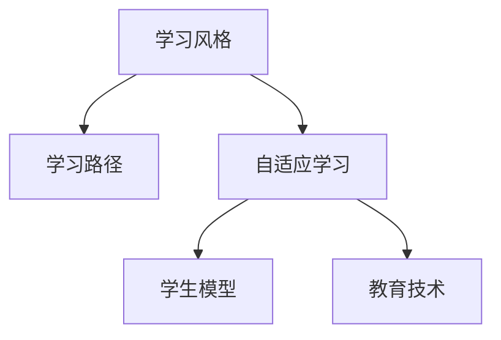

                 

# 知识的个性化：适应不同学习风格

> 关键词：个性化学习, 学习风格, 学习路径, 自适应学习, 人工智能, 机器学习, 深度学习, 数据驱动, 学生模型, 教育技术

## 1. 背景介绍

在知识爆炸的时代，教育领域的挑战也随之增加。如何在海量知识面前，让学生高效、准确地吸收并应用所学知识，是一个迫切需要解决的问题。个性化学习（Personalized Learning）应运而生，旨在根据每个学生的学习风格和能力，提供定制化的学习路径和资源。

然而，个性化学习并不是一个简单的概念。它要求教师和教育技术专家深入了解每个学生的特点，并根据这些特点量身定制学习方案。这不仅需要教育学和心理学上的洞察，也需要先进的教育技术和算法支持。

### 1.1 问题由来

在传统的“一刀切”式教育模式中，教师根据统一的课程大纲和教学进度，传授给所有学生相同的内容和信息。这种模式在过去被证明是有效的，但随着教育理念的演进和教育技术的发展，人们逐渐意识到这种模式存在以下问题：

- **无法适应每个学生的个体差异**：每个学生的学习能力、学习习惯、兴趣点都不相同，传统的教学方法难以满足他们的个性化需求。
- **信息过载**：在海量知识面前，传统的教育模式往往难以筛选出最重要的知识点，导致学生无法有效吸收。
- **学习动机不足**：当学习内容与学生的兴趣不匹配时，学生往往难以保持学习动机，影响学习效果。

### 1.2 问题核心关键点

为了解决这些问题，个性化学习需要：

- **了解每个学生的学习风格和能力**：通过评估和分析，了解学生的优势和劣势，以及他们对知识的理解和应用能力。
- **设计个性化的学习路径**：根据学生的需求和进度，为他们量身定制学习计划和内容。
- **实时调整学习方案**：随着学生的学习情况发生变化，能够动态调整学习路径，提供适当的挑战和支持。

### 1.3 问题研究意义

个性化学习的研究和实践具有重要意义：

- **提升学习效果**：通过个性化的学习路径，学生可以更有效地掌握知识，提高学习效果。
- **促进学生兴趣**：个性化的学习内容和学习方式，能更好地激发学生的学习兴趣，提升学习动机。
- **支持终身学习**：个性化学习不仅适用于学校教育，还能支持终身学习，帮助个人在职业发展中不断提升自我。
- **推动教育公平**：通过个性化学习，可以缩小不同学生之间的学习差距，促进教育公平。

## 2. 核心概念与联系

### 2.1 核心概念概述

为了深入理解个性化学习，我们需要掌握以下核心概念：

- **学习风格（Learning Style）**：学生对知识的感知、处理和记忆方式。包括视觉、听觉、动觉、读写等不同的风格。
- **学习路径（Learning Path）**：根据学生的学习能力和进度，设计的个性化学习序列。
- **自适应学习（Adaptive Learning）**：使用人工智能算法，实时调整学习路径和资源，适应学生的学习状态。
- **学生模型（Student Model）**：通过数据分析和机器学习技术，构建学生知识水平和学习偏好的模型。
- **教育技术（Educational Technology）**：包括自适应学习系统、学习管理系统、在线教育平台等技术，支持个性化学习的实现。

这些核心概念之间的逻辑关系可以通过以下Mermaid流程图来展示：



这个流程图展示了个性化学习的核心概念及其之间的关系：

1. 学习风格决定了学生的知识处理方式。
2. 学习路径根据学习风格设计，以适应学生的学习需求。
3. 自适应学习系统实时调整学习路径，以适应学生变化的学习状态。
4. 学生模型提供了学生知识水平和学习偏好的数据支持。
5. 教育技术为自适应学习提供了工具和方法，支持系统的运行。

## 3. 核心算法原理 & 具体操作步骤

### 3.1 算法原理概述

个性化学习的核心是利用数据驱动的方法，通过机器学习算法，构建学生模型，并实时调整学习路径。其核心算法包括：

- **学生模型构建**：通过数据分析和机器学习技术，构建学生知识水平和学习偏好的模型。
- **学习路径设计**：根据学生模型，设计个性化的学习路径和内容。
- **实时调整**：在学生学习过程中，实时监控学习状态，动态调整学习路径和资源。

### 3.2 算法步骤详解

#### 步骤1：数据收集和预处理

- **学习数据**：收集学生在课堂上、家庭作业、在线学习平台上的表现数据，包括考试成绩、完成作业的时间、在平台上的互动等。
- **特征提取**：将收集到的数据转换为机器学习模型可以处理的形式，如向量、矩阵等。
- **数据清洗**：去除异常值和噪声，确保数据的质量。

#### 步骤2：学生模型构建

- **学生知识水平评估**：通过学生的历史成绩和作业表现，评估学生的知识水平。
- **学习风格识别**：通过学生的互动数据和学习习惯，识别学生的学习风格。
- **数据融合**：将学生的知识水平和学习风格数据进行融合，构建全面的学生模型。

#### 步骤3：学习路径设计

- **路径规划**：根据学生模型，设计适合学生的学习路径和内容。可以包括课程、视频、练习等。
- **路径调整**：随着学生学习情况的变化，动态调整学习路径，以适应学生的学习状态。

#### 步骤4：实时调整

- **学习监控**：实时监控学生的学习进度和表现，评估学习效果。
- **路径调整**：根据学习监控的结果，动态调整学习路径和资源。
- **反馈机制**：提供及时的反馈，帮助学生理解自己的学习状态和改进方法。

### 3.3 算法优缺点

个性化学习算法具有以下优点：

- **高效性**：通过数据驱动的方法，可以快速构建学生模型，并设计个性化的学习路径。
- **适应性**：能够根据学生的实时学习状态，动态调整学习路径，提高学习效果。
- **个性化**：能够根据每个学生的特点，提供量身定制的学习方案，满足个性化需求。

同时，这些算法也存在一些局限性：

- **数据依赖**：个性化学习依赖大量的学生数据，数据收集和处理成本较高。
- **算法复杂性**：构建学生模型和设计学习路径需要复杂的机器学习算法，对技术要求较高。
- **公平性**：个性化学习可能加剧学生的学习分化，某些学生可能因数据不足而无法获得理想的个性化服务。

### 3.4 算法应用领域

个性化学习技术已经广泛应用于以下领域：

- **K-12教育**：为不同年级的学生设计个性化学习路径，提升学习效果。
- **高等教育**：为大学生提供个性化的学习资源和支持，促进终身学习。
- **职业培训**：为在职员工提供定制化的学习方案，提升职业技能。
- **企业培训**：为员工提供个性化的学习资源和支持，提升工作能力。
- **在线教育**：通过自适应学习系统，为学生提供个性化的学习体验。

## 4. 数学模型和公式 & 详细讲解 & 举例说明

### 4.1 数学模型构建

个性化学习的基础是学生模型的构建。我们假设学生模型的输入为 $x$，包括学生的知识水平和学习风格，输出为 $y$，即学生模型对当前学习任务的评估。学生模型可以表示为：

$$
y = f(x)
$$

其中 $f$ 是一个机器学习模型，可以通过各种算法构建。

### 4.2 公式推导过程

以下我们以线性回归模型为例，推导学生模型的构建过程。

假设学生模型为线性回归模型，其形式为：

$$
y = \theta_0 + \theta_1 x_1 + \theta_2 x_2 + \cdots + \theta_n x_n
$$

其中 $\theta_0, \theta_1, \theta_2, \cdots, \theta_n$ 为模型的参数，$x_1, x_2, \cdots, x_n$ 为模型的输入特征。通过最小化损失函数：

$$
L(\theta) = \frac{1}{2} \sum_{i=1}^N (y_i - f(x_i))^2
$$

来求解模型的参数。使用梯度下降算法，可以得到参数的更新公式：

$$
\theta_k \leftarrow \theta_k - \alpha \frac{\partial L}{\partial \theta_k}
$$

其中 $\alpha$ 为学习率，$\partial L/\partial \theta_k$ 为损失函数对参数 $\theta_k$ 的梯度，可通过反向传播算法高效计算。

### 4.3 案例分析与讲解

假设我们有一组学生的成绩数据，包括数学成绩和英语成绩。我们希望构建一个模型，根据学生的数学成绩预测其英语成绩。

首先，我们将数据分为训练集和测试集，分别用于模型的训练和评估。然后，我们将数学成绩作为模型的输入特征 $x$，英语成绩作为输出 $y$。使用线性回归模型，我们可以得到：

$$
y = \theta_0 + \theta_1 x
$$

其中 $\theta_0$ 和 $\theta_1$ 为模型的参数。通过最小化损失函数，我们可以求解模型的参数：

$$
\theta_0, \theta_1 = \mathop{\arg\min}_{\theta_0, \theta_1} \frac{1}{2} \sum_{i=1}^N (y_i - \theta_0 - \theta_1 x_i)^2
$$

使用梯度下降算法，可以得到参数的更新公式：

$$
\theta_0 \leftarrow \theta_0 - \alpha \sum_{i=1}^N (y_i - \theta_0 - \theta_1 x_i)
$$
$$
\theta_1 \leftarrow \theta_1 - \alpha \sum_{i=1}^N (y_i - \theta_0 - \theta_1 x_i) x_i
$$

通过这个过程，我们可以构建一个简单的学生模型，根据学生的数学成绩预测其英语成绩。

## 5. 项目实践：代码实例和详细解释说明

### 5.1 开发环境搭建

在进行个性化学习实践前，我们需要准备好开发环境。以下是使用Python进行Scikit-Learn和TensorFlow开发的环境配置流程：

1. 安装Anaconda：从官网下载并安装Anaconda，用于创建独立的Python环境。

2. 创建并激活虚拟环境：
```bash
conda create -n py36 python=3.6 
conda activate py36
```

3. 安装Scikit-Learn：
```bash
pip install -U scikit-learn
```

4. 安装TensorFlow：
```bash
pip install tensorflow
```

5. 安装TensorFlow Addons：
```bash
pip install tensorflow-addons
```

6. 安装其他必要的工具包：
```bash
pip install numpy pandas matplotlib jupyter notebook
```

完成上述步骤后，即可在`py36`环境中开始个性化学习实践。

### 5.2 源代码详细实现

这里我们以线性回归模型为例，实现一个简单的学生成绩预测系统。

首先，导入必要的库：

```python
import numpy as np
import pandas as pd
import matplotlib.pyplot as plt
import tensorflow as tf
from sklearn.model_selection import train_test_split
```

然后，准备数据：

```python
data = pd.read_csv('student_scores.csv')
X = data[['math_score']]
y = data[['english_score']]
```

接着，将数据分为训练集和测试集：

```python
X_train, X_test, y_train, y_test = train_test_split(X, y, test_size=0.2, random_state=42)
```

然后，定义模型：

```python
model = tf.keras.Sequential([
    tf.keras.layers.Dense(units=1, input_shape=[1], kernel_initializer='he_normal')
])
```

接着，定义损失函数和优化器：

```python
loss_fn = tf.keras.losses.MeanSquaredError()
optimizer = tf.keras.optimizers.Adam()
```

然后，编译模型：

```python
model.compile(optimizer=optimizer, loss=loss_fn)
```

接着，训练模型：

```python
history = model.fit(X_train, y_train, epochs=100, validation_split=0.2, verbose=0)
```

最后，评估模型：

```python
test_loss, test_score = model.evaluate(X_test, y_test, verbose=0)
print('Test loss:', test_loss)
print('Test score:', test_score)
```

### 5.3 代码解读与分析

让我们再详细解读一下关键代码的实现细节：

**数据准备**：
- `pd.read_csv`方法用于读取学生成绩数据。
- `train_test_split`方法用于将数据分为训练集和测试集。

**模型定义**：
- `tf.keras.Sequential`方法用于构建序列模型，其中`Dense`层为全连接层。
- `kernel_initializer='he_normal'`表示使用He初始化，有助于模型收敛。

**损失函数和优化器**：
- `tf.keras.losses.MeanSquaredError`表示均方误差损失函数，适用于回归问题。
- `tf.keras.optimizers.Adam`表示Adam优化器，具有自适应学习率的特点。

**模型编译**：
- `model.compile`方法用于编译模型，指定优化器和损失函数。

**模型训练**：
- `model.fit`方法用于训练模型，其中`epochs`参数表示训练轮数，`validation_split`参数表示验证集占总数据集的比例。

**模型评估**：
- `model.evaluate`方法用于评估模型，返回损失和准确率。

通过这个过程，我们可以使用Python和TensorFlow实现一个简单的学生成绩预测系统，展示了如何通过数据驱动的方法，构建学生模型，并设计个性化的学习路径。

## 6. 实际应用场景

### 6.1 智能教育平台

基于学生模型的个性化学习，可以为智能教育平台提供强有力的支持。智能教育平台可以实时监控学生的学习状态，根据学生的表现动态调整学习路径和资源，提供个性化的学习支持。

在技术实现上，可以集成学生模型，构建智能推荐系统，根据学生的学习状态和偏好，推荐适合的学习资源。同时，平台可以提供学习进度跟踪、学习效果评估等功能，帮助学生了解自己的学习情况，并提供改进建议。

### 6.2 在线学习平台

在线学习平台可以根据学生的学习数据，构建学生模型，设计个性化的学习路径和资源。通过实时监控学生的学习状态，平台可以动态调整学习路径，提供适应性学习。

在技术实现上，平台可以集成自适应学习系统，实时监控学生的学习进度和表现，动态调整学习路径和资源。同时，平台可以提供学习效果评估和改进建议，帮助学生提高学习效果。

### 6.3 企业培训系统

企业培训系统可以根据员工的学习数据，构建学生模型，设计个性化的学习方案。通过实时监控员工的学习状态，系统可以动态调整学习路径，提供适应性学习。

在技术实现上，企业可以构建学习管理系统，集成自适应学习系统，实时监控员工的学习进度和表现，动态调整学习路径和资源。同时，系统可以提供学习效果评估和改进建议，帮助员工提高工作能力。

### 6.4 未来应用展望

随着个性化学习技术的发展，未来的应用场景将更加广泛。

- **智慧课堂**：通过个性化学习，智慧课堂可以根据学生的特点，提供量身定制的学习方案，提升学习效果。
- **虚拟现实教育**：通过虚拟现实技术，个性化学习可以为学生提供沉浸式的学习体验，增强学习效果。
- **游戏化学习**：通过游戏化设计，个性化学习可以激发学生的学习兴趣，提升学习动机。
- **自适应评估**：通过自适应评估技术，个性化学习可以实时评估学生的学习效果，提供改进建议。

## 7. 工具和资源推荐

### 7.1 学习资源推荐

为了帮助开发者系统掌握个性化学习的理论基础和实践技巧，这里推荐一些优质的学习资源：

1. **《个性化学习》（Personalized Learning）书籍**：全面介绍了个性化学习的理论基础、技术和应用案例。
2. **Coursera《个性化学习》课程**：由教育技术专家开设的课程，涵盖个性化学习的核心概念和前沿技术。
3. **edX《自适应学习》课程**：涵盖自适应学习的原理、方法和实践，适合教育技术从业者学习。
4. **Scikit-Learn官方文档**：Scikit-Learn库的官方文档，提供了丰富的机器学习算法和应用案例。
5. **TensorFlow官方文档**：TensorFlow库的官方文档，提供了强大的深度学习框架和应用示例。

通过对这些资源的学习实践，相信你一定能够快速掌握个性化学习的精髓，并用于解决实际的个性化学习问题。

### 7.2 开发工具推荐

高效的开发离不开优秀的工具支持。以下是几款用于个性化学习开发的常用工具：

1. **Jupyter Notebook**：强大的交互式编程环境，适合数据探索和模型调试。
2. **TensorBoard**：用于可视化模型训练和评估的强大工具，适合实时监控和分析模型性能。
3. **Weights & Biases**：实验跟踪工具，可以记录和可视化模型训练过程中的各项指标，方便对比和调优。
4. **Scikit-Learn库**：强大的机器学习库，提供了丰富的算法和数据预处理工具。
5. **TensorFlow库**：强大的深度学习框架，支持大规模分布式训练和部署。

合理利用这些工具，可以显著提升个性化学习任务的开发效率，加快创新迭代的步伐。

### 7.3 相关论文推荐

个性化学习的研究源于学界的持续探索。以下是几篇奠基性的相关论文，推荐阅读：

1. **《自适应学习系统的设计》（Design of Adaptive Learning Systems）**：介绍了自适应学习系统的设计和实现方法，适合教育技术从业者阅读。
2. **《个性化学习：算法和系统的综合》（Personalized Learning: A Survey of Algorithms and Systems）**：全面综述了个性化学习的算法和系统，适合学术研究者阅读。
3. **《学习分析：基于数据的学习分析系统》（Learning Analytics: Beyond the Learner's Analytic）**：介绍了学习分析系统的设计方法和应用案例，适合教育技术从业者阅读。
4. **《机器学习在个性化学习中的应用》（Applications of Machine Learning in Personalized Learning）**：介绍了机器学习在个性化学习中的应用，适合学术研究者阅读。
5. **《自适应学习技术综述》（A Survey of Adaptive Learning Technologies）**：全面综述了自适应学习技术的发展和应用，适合教育技术从业者阅读。

这些论文代表了个性化学习的发展脉络。通过学习这些前沿成果，可以帮助研究者把握学科前进方向，激发更多的创新灵感。

## 8. 总结：未来发展趋势与挑战

### 8.1 总结

本文对个性化学习进行了全面系统的介绍。首先阐述了个性化学习的背景和意义，明确了个性化学习在提升学习效果、促进学生兴趣、支持终身学习等方面的重要作用。其次，从原理到实践，详细讲解了个性化学习的核心算法和具体操作步骤，提供了完整的学生模型构建和个性化学习路径设计代码实现。同时，本文还广泛探讨了个性化学习在教育、企业培训等领域的应用前景，展示了个性化学习的巨大潜力。最后，本文精选了个性化学习的各类学习资源和开发工具，力求为读者提供全方位的技术指引。

通过本文的系统梳理，可以看到，个性化学习是一个复杂而系统的工程，涉及数据收集、模型构建、学习路径设计等多个环节。只有在系统性和科学性的指导下，才能构建有效的个性化学习系统，真正实现学生的主动学习和终身学习。

### 8.2 未来发展趋势

展望未来，个性化学习技术将呈现以下几个发展趋势：

1. **深度学习在个性化学习中的应用**：深度学习技术可以更好地处理复杂的数据，提升个性化学习的效果。未来，深度学习将广泛应用于个性化学习系统。
2. **自适应评估技术的发展**：自适应评估技术可以根据学生的学习情况，动态调整学习路径和资源，提升学习效果。未来，自适应评估技术将更加智能化和自适应化。
3. **跨平台学习体验的实现**：个性化学习将不再局限于单一平台，而是通过跨平台技术，提供无缝的学习体验。未来，个性化学习将更加集成化和开放化。
4. **个性化学习的普及**：随着技术的进步和教育理念的演进，个性化学习将逐渐普及到各个教育阶段和领域。未来，个性化学习将成为教育技术的重要组成部分。
5. **数据驱动的教育决策**：个性化学习将利用大数据分析，为教育决策提供科学依据。未来，数据驱动的教育决策将更加普遍和精细。

### 8.3 面临的挑战

尽管个性化学习技术已经取得了显著成就，但在迈向更加智能化、普适化应用的过程中，仍面临诸多挑战：

1. **数据隐私和安全**：个性化学习依赖大量的学生数据，如何保护学生隐私和安全是一个重要问题。未来，需要进一步加强数据隐私保护技术。
2. **算法复杂性**：个性化学习涉及复杂的机器学习算法和数据处理技术，如何简化算法和优化数据处理是另一个重要挑战。
3. **教育公平**：个性化学习可能加剧学生的学习分化，某些学生可能因数据不足而无法获得理想的个性化服务。未来，需要探索更多公平、包容的个性化学习方案。
4. **教师的角色**：在个性化学习中，教师的角色将发生变化，如何帮助教师掌握个性化学习的技术和方法，是一个重要的挑战。
5. **技术普及**：个性化学习需要先进的技术支持，如何普及个性化学习技术，让更多学校和企业采用，也是一个重要的挑战。

### 8.4 研究展望

为了应对这些挑战，未来的研究需要在以下几个方面寻求新的突破：

1. **数据隐私保护**：开发更高效、更安全的数据隐私保护技术，保护学生数据隐私。
2. **算法简化**：开发更简单、更高效的机器学习算法，简化个性化学习系统。
3. **公平性研究**：探索更多公平、包容的个性化学习方案，缩小学生的学习差距。
4. **教师培训**：开发教师培训课程，帮助教师掌握个性化学习技术和方法。
5. **技术普及**：推广个性化学习技术，让更多学校和企业采用，实现教育技术的普及和应用。

这些研究方向的探索，将引领个性化学习技术迈向更高的台阶，为构建安全、可靠、可解释、可控的智能系统铺平道路。面向未来，个性化学习技术还需要与其他人工智能技术进行更深入的融合，如知识表示、因果推理、强化学习等，多路径协同发力，共同推动教育技术的进步。只有勇于创新、敢于突破，才能不断拓展个性化学习的边界，让教育技术更好地造福人类社会。

## 9. 附录：常见问题与解答

**Q1：个性化学习如何处理数据隐私问题？**

A: 个性化学习依赖大量的学生数据，数据隐私保护是一个重要问题。为解决这一问题，可以采用以下方法：

- **数据匿名化**：对学生数据进行匿名化处理，去除个人身份信息，确保数据的安全性。
- **差分隐私**：在数据收集和分析过程中，采用差分隐私技术，保护个体数据不被泄露。
- **联邦学习**：通过联邦学习技术，将数据分布式存储在多个设备上，确保数据不离开本地设备。
- **访问控制**：设置严格的访问控制策略，确保只有授权人员可以访问学生数据。

**Q2：个性化学习算法复杂度较高，如何解决？**

A: 个性化学习涉及复杂的机器学习算法和数据处理技术，如何简化算法和优化数据处理是另一个重要挑战。为解决这一问题，可以采用以下方法：

- **算法优化**：开发更简单、更高效的机器学习算法，减少算法复杂度。
- **模型压缩**：采用模型压缩技术，减少模型参数和计算量，提高计算效率。
- **数据预处理**：优化数据预处理流程，减少数据处理时间和资源消耗。
- **分布式计算**：采用分布式计算技术，提高数据处理和模型训练的效率。

**Q3：个性化学习如何提高公平性？**

A: 个性化学习可能加剧学生的学习分化，某些学生可能因数据不足而无法获得理想的个性化服务。为解决这一问题，可以采用以下方法：

- **多样化数据采集**：确保数据采集的全面性和多样性，避免数据偏见。
- **多任务学习**：采用多任务学习技术，让模型同时学习多个任务，提高模型的鲁棒性和泛化能力。
- **动态调整**：根据学生的学习状态，动态调整学习路径和资源，确保所有学生都能获得公平的学习机会。

**Q4：教师如何掌握个性化学习的技术和方法？**

A: 在个性化学习中，教师的角色将发生变化，如何帮助教师掌握个性化学习的技术和方法，是一个重要的挑战。为解决这一问题，可以采用以下方法：

- **教师培训课程**：开发教师培训课程，帮助教师掌握个性化学习的技术和方法。
- **教学工具**：提供简单易用的教学工具，帮助教师使用个性化学习系统。
- **教师支持**：建立教师支持系统，提供技术支持和咨询服务。

**Q5：个性化学习如何普及？**

A: 个性化学习需要先进的技术支持，如何普及个性化学习技术，让更多学校和企业采用，也是一个重要的挑战。为解决这一问题，可以采用以下方法：

- **政策支持**：政府和教育机构提供政策支持，推动个性化学习的普及。
- **技术推广**：教育技术公司加强技术推广，提供免费试用和技术支持。
- **教育案例**：通过成功案例，展示个性化学习的实际效果，吸引更多学校和企业采用。

通过这些方法，可以逐步推动个性化学习的普及，实现教育技术的广泛应用。

---

作者：禅与计算机程序设计艺术 / Zen and the Art of Computer Programming

