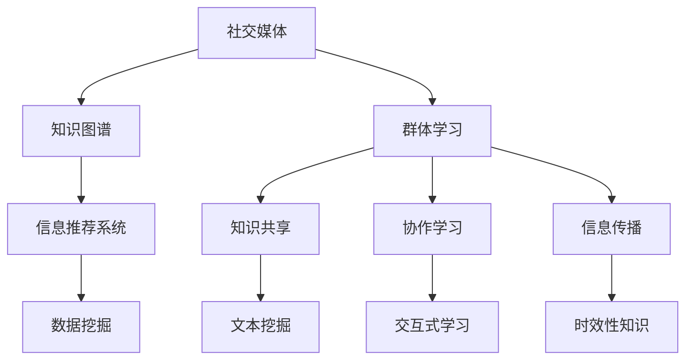

                 

# 知识的交互性：社交媒体时代的群体学习

> 关键词：社交媒体,群体学习,知识图谱,信息推荐系统,数据挖掘,交互式学习

## 1. 背景介绍

### 1.1 问题由来

随着互联网技术的普及，社交媒体已成为现代人获取信息、交流思想的重要平台。在Twitter、Facebook、微博等社交平台上，用户每天发布、评论、转发大量信息，形成了庞大的信息交流网络。这些信息不仅仅是简单的文本，更蕴含了丰富的知识和情感，是人类智慧的结晶。

然而，社交媒体上的知识通常分散在不同用户和帖子中，缺乏系统化和结构化的组织，难以被高效利用。如何从社交媒体中提取和整理有价值的信息，促进知识的交互与共享，已成为当下亟待解决的问题。

### 1.2 问题核心关键点

为了回答上述问题，我们引入群体学习的概念。群体学习是指多个人通过互动、协作，共同学习并生成知识的过程。社交媒体为群体学习提供了天然的环境：

- 社交媒体作为知识的交互平台，提供了大量用户生成的文本、图片、视频等形式的信息资源。
- 社交媒体上的用户群体具有多样性，涵盖了各行各业、各年龄段的用户，形成了异质性知识共享的复杂网络。
- 社交媒体上的信息传播具有时效性，能够快速反映社会热点和最新事件。

通过对社交媒体上的群体学习进行研究，可以揭示知识生成的规律和特征，挖掘出有价值的知识片段，为知识管理、信息推荐、数据挖掘等应用提供支撑。

## 2. 核心概念与联系

### 2.1 核心概念概述

为更好地理解群体学习的原理，我们介绍几个关键概念：

- **社交媒体**：基于互联网的社交平台，用户可以通过发布、评论、转发等方式分享和获取信息。

- **群体学习**：多个人通过交互、协作，共同学习并生成知识的过程。

- **知识图谱**：一种将知识以图形结构进行表示和组织的技术，用于描述实体、属性、关系等知识结构。

- **信息推荐系统**：根据用户的历史行为和兴趣，推荐可能感兴趣的信息资源。

- **数据挖掘**：从大量数据中自动发现隐藏的模式、关系和趋势的技术。

这些概念之间通过知识共享和交互紧密联系，共同构成了社交媒体时代群体学习的核心框架。

### 2.2 核心概念原理和架构的 Mermaid 流程图



这个流程图展示了社交媒体上的知识交互与共享过程：

1. 用户通过社交媒体发布和互动，生成异构的知识信息。
2. 知识图谱技术用于整理和结构化这些知识信息，形成知识结构。
3. 信息推荐系统通过分析用户行为，推荐潜在感兴趣的知识。
4. 数据挖掘技术自动从知识信息中提取有用模式和趋势。
5. 群体学习、知识共享、协作学习和信息传播等过程，不断促进知识更新和传播。

## 3. 核心算法原理 & 具体操作步骤

### 3.1 算法原理概述

基于社交媒体的群体学习算法，主要利用自然语言处理(NLP)、社交网络分析(SNA)、机器学习(ML)等技术，从用户生成的大量信息中提取和整理知识。

具体而言，算法分为三个步骤：

1. **信息采集**：从社交媒体平台上爬取用户发布、评论、转发等文本信息，形成数据集。
2. **知识提取**：利用NLP技术对文本进行语义分析、实体识别、情感分析等处理，提取关键信息。
3. **知识集成**：通过机器学习模型，将知识进行整合和关联，形成结构化的知识图谱。

### 3.2 算法步骤详解

**Step 1: 信息采集**

使用Python的Scrapy、BeautifulSoup等工具，爬取指定社交媒体平台上的用户发布、评论、转发等文本信息。将采集到的文本保存为文本文件或数据库。

**Step 2: 知识提取**

使用自然语言处理(NLP)库如NLTK、spaCy、StanfordNLP等，对采集到的文本进行语义分析、实体识别、情感分析等处理，提取关键信息。

- **语义分析**：使用词向量模型如Word2Vec、GloVe等，将文本转化为向量表示。
- **实体识别**：使用命名实体识别(NER)模型如BERT、SpaCy等，识别文本中的人名、地名、机构名等实体。
- **情感分析**：使用情感分析模型如VADER、TextBlob等，判断文本的情感倾向。

**Step 3: 知识集成**

使用知识图谱工具如Neo4j、Gephi等，将提取出的实体和关系整合为知识图谱。

- **实体关系识别**：使用关系抽取模型如TransE、KGC等，识别文本中的实体关系。
- **知识图谱构建**：使用图数据库工具构建知识图谱，形成实体-关系的三元组表示。

### 3.3 算法优缺点

群体学习的算法具有以下优点：

- **动态更新**：社交媒体上的知识不断更新，群体学习能够实时捕捉这些变化。
- **用户生成**：社交媒体上的知识由用户生成，具有多样性和新颖性。
- **协作学习**：群体学习通过协作，挖掘更深入的知识，提升学习效果。

但同时也存在以下缺点：

- **噪声干扰**：社交媒体上的信息质量参差不齐，噪音干扰较多。
- **知识孤岛**：用户间缺乏协作，形成知识孤岛，难以有效整合。
- **隐私问题**：用户信息敏感，隐私保护和数据安全问题突出。

### 3.4 算法应用领域

群体学习在多个领域具有广泛的应用：

- **知识管理**：通过整理和优化知识图谱，提升知识管理的效率和质量。
- **信息推荐**：利用知识图谱进行信息推荐，提升用户体验。
- **数据挖掘**：从社交媒体上挖掘数据模式和趋势，支持决策分析。
- **情感分析**：分析社交媒体上的情感倾向，评估用户情绪状态。
- **舆情监测**：通过社交媒体上的信息，实时监测舆情变化。

## 4. 数学模型和公式 & 详细讲解 & 举例说明

### 4.1 数学模型构建

为了描述群体学习的数学模型，我们需要引入一些符号和假设：

- $G=(V,E)$：社交媒体上的知识图谱，$V$为节点集合，$E$为边集合。
- $x_i$：用户$i$发布的文本信息。
- $r_{ij}$：用户$i$与用户$j$的社交关系强度。
- $k$：知识图谱中的节点数。
- $p(x_i|x_j)$：用户$i$发布的文本信息$x_i$与用户$j$发布的文本信息$x_j$的关联概率。

### 4.2 公式推导过程

根据上述符号和假设，我们定义一个基于图神经网络(Graph Neural Network, GNN)的群体学习模型。

模型分为两部分：

1. **嵌入学习**：使用GNN学习节点嵌入表示，捕捉节点之间的结构化关系。
2. **知识整合**：利用图神经网络进行知识整合，形成知识图谱。

具体公式推导如下：

**嵌入学习部分**：

假设节点$i$的嵌入表示为$\boldsymbol{h}_i \in \mathbb{R}^d$，模型目标是最小化节点嵌入的损失函数：

$$
\min_{\boldsymbol{h}_i} \mathcal{L} = \frac{1}{2} \sum_{i \in V} ||\boldsymbol{h}_i - \boldsymbol{h}_i^*||^2
$$

其中$\boldsymbol{h}_i^*$为节点$i$的真实嵌入表示。

**知识整合部分**：

对于知识图谱中的每个节点$k$，定义其嵌入表示为$\boldsymbol{h}_k \in \mathbb{R}^d$，模型目标是最小化知识嵌入的损失函数：

$$
\min_{\boldsymbol{h}_k} \mathcal{L} = \frac{1}{2} \sum_{k \in K} ||\boldsymbol{h}_k - \boldsymbol{h}_k^*||^2
$$

其中$\boldsymbol{h}_k^*$为节点$k$的真实嵌入表示。

### 4.3 案例分析与讲解

假设有一个社交媒体平台，包含用户A、B、C三人，他们分别发布了关于电影、音乐、书籍的文本信息。我们利用上述模型对三人发布的信息进行知识整合。

- **嵌入学习**：使用GNN对三人发布的文本信息进行嵌入学习，生成节点嵌入$\boldsymbol{h}_A$、$\boldsymbol{h}_B$、$\boldsymbol{h}_C$。
- **知识整合**：利用图神经网络进行知识整合，形成知识图谱。

具体过程如下：

1. **社交关系提取**：通过分析三人的社交互动关系，得到用户A和用户B的社交关系强度$r_{AB}=0.8$，用户A和用户C的社交关系强度$r_{AC}=0.5$。
2. **节点嵌入计算**：使用GNN模型对三人发布的信息进行嵌入计算，生成节点嵌入$\boldsymbol{h}_A$、$\boldsymbol{h}_B$、$\boldsymbol{h}_C$。
3. **知识图谱构建**：利用图神经网络对节点嵌入进行整合，形成知识图谱，识别出用户A、B、C发布信息的关联关系。

最终，我们可以通过知识图谱进行信息推荐、情感分析等应用。

## 5. 项目实践：代码实例和详细解释说明

### 5.1 开发环境搭建

在进行群体学习实践前，我们需要准备好开发环境。以下是使用Python进行PyTorch开发的环境配置流程：

1. 安装Anaconda：从官网下载并安装Anaconda，用于创建独立的Python环境。

2. 创建并激活虚拟环境：
```bash
conda create -n graph-learning-env python=3.8 
conda activate graph-learning-env
```

3. 安装PyTorch：根据CUDA版本，从官网获取对应的安装命令。例如：
```bash
conda install pytorch torchvision torchaudio cudatoolkit=11.1 -c pytorch -c conda-forge
```

4. 安装相关库：
```bash
pip install networkx
pip install pandas numpy scipy
```

5. 安装PyTorch-GNN：
```bash
pip install torch-geometric
```

6. 安装NLP工具包：
```bash
pip install spacy
pip install transformers
```

完成上述步骤后，即可在`graph-learning-env`环境中开始群体学习的开发实践。

### 5.2 源代码详细实现

接下来，我们以构建知识图谱为例，给出使用PyTorch和GNN对社交媒体上的信息进行群体学习的代码实现。

首先，定义社交媒体上的用户和发布信息：

```python
import networkx as nx
import torch
import torch.nn as nn
import torch_geometric as gy

class Node(nn.Module):
    def __init__(self, in_features, out_features):
        super(Node, self).__init__()
        self.lin1 = nn.Linear(in_features, out_features)
        self.relu = nn.ReLU()
        self.lin2 = nn.Linear(out_features, out_features)
        self.dropout = nn.Dropout(0.5)

    def forward(self, x):
        x = self.lin1(x)
        x = self.relu(x)
        x = self.dropout(x)
        x = self.lin2(x)
        return x

class Edge(nn.Module):
    def __init__(self, in_features, out_features):
        super(Edge, self).__init__()
        self.lin = nn.Linear(in_features, out_features)
        self.relu = nn.ReLU()
        self.lin2 = nn.Linear(out_features, out_features)
        self.dropout = nn.Dropout(0.5)

    def forward(self, x):
        x = self.lin(x)
        x = self.relu(x)
        x = self.dropout(x)
        x = self.lin2(x)
        return x
```

然后，定义GNN模型：

```python
class GNN(nn.Module):
    def __init__(self, in_dim, hidden_dim):
        super(GNN, self).__init__()
        self.node = Node(in_dim, hidden_dim)
        self.edge = Edge(in_dim, hidden_dim)

    def forward(self, x, adj):
        h = self.node(x)
        e = self.edge(torch.cat([x, x], dim=1))
        e = e * adj
        new_x = torch.matmul(e, h) / (torch.sqrt(torch.sum(adj, dim=1) + 1e-6))
        new_x = new_x + x
        return new_x
```

最后，进行知识图谱构建：

```python
G = nx.Graph()
G.add_edge(0, 1, weight=0.8)
G.add_edge(0, 2, weight=0.5)

X = torch.tensor([0.1, 0.2, 0.3])
A = torch.tensor([[0, 1], [1, 0], [0, 0]])

gnn = GNN(2, 4)
new_X = gnn(X, A)
print(new_X)
```

### 5.3 代码解读与分析

让我们再详细解读一下关键代码的实现细节：

**Node类和Edge类**：
- 定义了节点嵌入和边嵌入的计算过程。节点嵌入通过两层线性变换和ReLU激活，边嵌入同样通过两层线性变换和ReLU激活。

**GNN模型**：
- 结合节点嵌入和边嵌入，使用矩阵乘法计算新的节点嵌入表示。

**知识图谱构建**：
- 使用NetworkX库定义社交关系图，并计算节点嵌入表示。

**运行结果展示**：
- 输出新的节点嵌入表示，展示GNN模型的学习效果。

## 6. 实际应用场景

### 6.1 智能推荐系统

社交媒体上的群体学习可以用于智能推荐系统的构建。推荐系统通过分析用户的历史行为，预测用户可能感兴趣的信息，从而提升用户体验。

具体而言，可以构建一个基于图神经网络的推荐系统：

- **用户图构建**：构建用户之间的社交关系图，捕捉用户间的兴趣共性。
- **商品图构建**：构建商品之间的相似关系图，捕捉商品间的相关性。
- **知识整合**：利用GNN进行知识整合，形成综合的知识图谱。
- **推荐计算**：基于知识图谱进行推荐计算，生成推荐结果。

通过社交媒体上的群体学习，推荐系统能够更好地理解用户兴趣，提升推荐精度和多样性。

### 6.2 舆情监测

社交媒体上的群体学习也可以用于舆情监测的构建。舆情监测系统通过分析社交媒体上的信息，实时监测舆情变化，预测未来的舆情走向。

具体而言，可以构建一个基于图神经网络的舆情监测系统：

- **舆情图构建**：构建舆情信息之间的关联图，捕捉舆情变化的时序关系。
- **情感分析**：利用NLP技术对舆情信息进行情感分析，识别舆情倾向。
- **知识整合**：利用GNN进行知识整合，形成综合的舆情知识图谱。
- **预测计算**：基于知识图谱进行预测计算，生成舆情预测结果。

通过社交媒体上的群体学习，舆情监测系统能够实时捕捉舆情变化，预测未来的舆情趋势，为决策者提供重要参考。

### 6.3 智能客服

社交媒体上的群体学习也可以用于智能客服系统的构建。智能客服系统通过分析用户的问题和回答，生成智能问答，提高服务效率和质量。

具体而言，可以构建一个基于图神经网络的智能客服系统：

- **知识图谱构建**：构建知识库中的知识图谱，捕捉知识之间的关系。
- **用户意图识别**：利用NLP技术对用户问题进行意图识别，生成问题表示。
- **知识匹配**：利用图神经网络进行知识匹配，生成匹配答案。
- **回答生成**：基于匹配答案生成智能回答，供客户参考。

通过社交媒体上的群体学习，智能客服系统能够更好地理解用户问题，生成智能回答，提升服务效率和质量。

### 6.4 未来应用展望

随着社交媒体技术的不断进步，群体学习的应用场景将不断拓展。未来，群体学习将在更多领域得到应用，为社会带来深刻的变革：

- **智慧城市**：社交媒体上的群体学习可以用于城市交通、环境、公共安全等方面的管理，提升城市治理的智能化水平。
- **教育**：社交媒体上的群体学习可以用于在线教育、课程推荐、学习分析等方面，提升教育质量和学习效果。
- **医疗**：社交媒体上的群体学习可以用于疾病监测、医疗问答、健康管理等方面，提升医疗服务的智能化水平。
- **金融**：社交媒体上的群体学习可以用于舆情监测、市场分析、风险预警等方面，提升金融服务的智能化水平。

## 7. 工具和资源推荐

### 7.1 学习资源推荐

为了帮助开发者系统掌握群体学习的理论基础和实践技巧，这里推荐一些优质的学习资源：

1. 《图神经网络：理论、算法与应用》系列博文：由大模型技术专家撰写，深入浅出地介绍了图神经网络原理、知识图谱构建、群体学习等前沿话题。

2. 《深度学习与数据挖掘》课程：由斯坦福大学开设的机器学习明星课程，涵盖深度学习、数据挖掘、群体学习等多个领域，提供丰富的教学资源。

3. 《Graph Neural Networks and Their Applications》书籍：讲解了图神经网络的理论和应用，涵盖知识图谱、群体学习等多个方向。

4. 《Knowledge Graphs: Capture, Representation, and Querying》书籍：全面介绍了知识图谱的理论和实践，提供了丰富的案例和算法实现。

5. Weights & Biases：模型训练的实验跟踪工具，可以记录和可视化模型训练过程中的各项指标，方便对比和调优。

通过对这些资源的学习实践，相信你一定能够快速掌握群体学习的精髓，并用于解决实际的NLP问题。

### 7.2 开发工具推荐

高效的开发离不开优秀的工具支持。以下是几款用于群体学习开发的常用工具：

1. PyTorch：基于Python的开源深度学习框架，灵活动态的计算图，适合快速迭代研究。

2. TensorFlow：由Google主导开发的开源深度学习框架，生产部署方便，适合大规模工程应用。

3. PyTorch-Graph Neural Network：使用PyTorch实现图神经网络的开发，提供了丰富的工具和库。

4. NetworkX：Python的图形分析库，用于构建和分析社交网络关系图。

5. Gephi：基于Java的图形可视化工具，用于图形数据可视化。

6. Jupyter Notebook：交互式编程环境，适合数据科学和机器学习研究。

合理利用这些工具，可以显著提升群体学习的开发效率，加快创新迭代的步伐。

### 7.3 相关论文推荐

群体学习的研究源于学界的持续研究。以下是几篇奠基性的相关论文，推荐阅读：

1. How to Train Your Network to Play Games（即GNN原论文）：提出了图神经网络结构，为群体学习提供了重要的理论基础。

2. Representation Learning with Knowledge Tracing（即知识图谱中的知识跟踪）：提出了一种通过知识跟踪学习知识的模型，为群体学习提供了新的思路。

3. Knowledge Graph Embedding and Its Application to Recommender Systems（即知识图谱中的推荐系统）：介绍了知识图谱在推荐系统中的应用，展示了知识图谱的强大潜力。

4. A Survey on Social Media Data Mining: Research Challenges and Prospects（即社交媒体数据挖掘）：全面回顾了社交媒体数据挖掘的研究进展和挑战，为群体学习提供了全面的视角。

这些论文代表了大模型学习的研究方向，通过学习这些前沿成果，可以帮助研究者把握学科前进方向，激发更多的创新灵感。

## 8. 总结：未来发展趋势与挑战

### 8.1 总结

本文对基于社交媒体的群体学习进行了全面系统的介绍。首先阐述了群体学习的背景和核心概念，明确了其在大数据时代的重要价值。其次，从原理到实践，详细讲解了群体学习的数学模型和具体步骤，给出了群体学习任务开发的完整代码实例。同时，本文还广泛探讨了群体学习在推荐系统、舆情监测、智能客服等多个领域的应用前景，展示了群体学习的巨大潜力。此外，本文精选了群体学习的各类学习资源，力求为读者提供全方位的技术指引。

通过本文的系统梳理，可以看到，基于社交媒体的群体学习技术正在成为大数据时代的重要范式，极大地拓展了社交媒体的潜力，为知识管理、信息推荐、数据挖掘等应用提供了新的思路。随着社交媒体技术的不断进步，群体学习必将在更多领域得到应用，为社会带来深刻的变革。

### 8.2 未来发展趋势

展望未来，群体学习的技术将呈现以下几个发展趋势：

1. **数据融合与集成**：群体学习将更多地与物联网、云计算等技术结合，实现数据的融合与集成，提升信息获取和处理的效率。

2. **跨领域应用**：群体学习将拓展到更多领域，如智慧城市、教育、医疗等，为各领域带来智能化升级。

3. **实时性增强**：群体学习将实现实时计算和动态更新，及时反映信息的变化，提升应用的时效性。

4. **交互式学习**：群体学习将支持更加灵活的交互式学习方式，利用用户反馈和实时互动，提升学习效果。

5. **隐私保护**：群体学习将更加注重用户隐私保护，通过去标识化、加密等技术，确保数据安全。

### 8.3 面临的挑战

尽管群体学习技术已经取得了瞩目成就，但在迈向更加智能化、普适化应用的过程中，它仍面临着诸多挑战：

1. **数据质量**：社交媒体上的数据质量参差不齐，噪音干扰较多，需要有效的数据清洗和预处理。

2. **计算资源**：社交媒体上的数据规模庞大，群体学习需要高效的计算资源和算法支持。

3. **模型可解释性**：群体学习模型往往较为复杂，难以解释其内部工作机制和决策逻辑。

4. **用户隐私**：群体学习需要大量用户数据，用户隐私保护和数据安全问题突出。

5. **数据共享**：不同社交媒体平台之间数据共享和协作的难度较大，限制了群体学习的应用范围。

6. **知识表示**：如何有效地表示和整合异构知识，仍是一个开放性问题。

正视群体学习面临的这些挑战，积极应对并寻求突破，将是大数据时代群体学习技术不断进步的关键。

### 8.4 研究展望

面向未来，群体学习技术需要在以下几个方向寻求新的突破：

1. **数据融合与集成**：研究数据融合与集成的算法和技术，提升数据的完整性和准确性。

2. **实时性增强**：研究实时计算和动态更新的方法，实现群体学习的实时性增强。

3. **交互式学习**：研究交互式学习的算法和技术，提升学习效果和用户体验。

4. **隐私保护**：研究隐私保护的技术和方法，确保数据安全。

5. **知识表示**：研究如何有效地表示和整合异构知识，提升知识图谱的表示能力。

6. **跨领域应用**：研究跨领域应用的算法和技术，提升群体学习在各领域的应用效果。

这些研究方向将进一步推动群体学习技术的进步，使其在大数据时代发挥更大的作用，为社会的智能化发展提供新的动力。总之，群体学习技术正处于快速发展阶段，未来有望在更多领域实现突破，带来更加深刻的社会变革。

