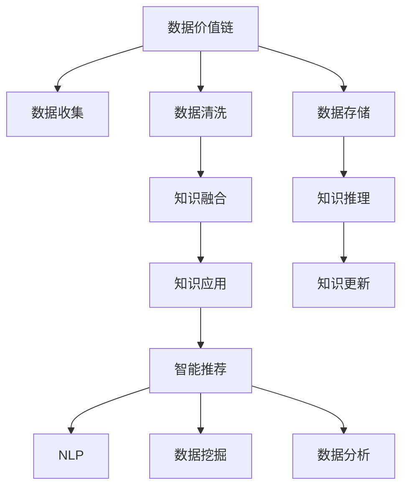

                 

# 知识的价值链：从数据到智慧的转化过程

> 关键词：数据价值链,知识图谱,数据融合,知识图谱系统,知识图谱构建,智能推荐系统,自然语言处理,数据挖掘,数据分析

## 1. 背景介绍

### 1.1 问题由来
在信息爆炸的时代，海量的数据无处不在。然而，数据本身并不直接反映出价值，只有经过整理、分析和应用，才能转化为知识，从而产生真正的价值。传统的知识获取方式，如手工构建、百科全书、专家知识等，受到时间和资源限制，难以满足日益增长的知识需求。

随着人工智能和大数据技术的迅猛发展，新的知识获取和应用方式正在逐渐显现。近年来，知识图谱（Knowledge Graph）成为了数据转化为知识的重要手段。知识图谱通过结构化的方式存储、组织和关联海量信息，为人工智能提供了丰富的知识资源。本文旨在介绍知识图谱及其应用，探讨从数据到智慧转化的全流程。

### 1.2 问题核心关键点
知识图谱是描述实体、属性和关系之间关联的图形结构。其核心在于通过构建高效的知识图谱系统，将海量的数据转化为易于理解和应用的知识。构建知识图谱的核心关键点包括：

- 数据收集与清洗：从不同来源收集数据，并进行清洗、去重、预处理等操作。
- 实体识别与关系抽取：自动识别文本中的实体和关系，并对其进行标注。
- 知识融合与合并：对从不同来源收集的实体和关系进行合并、冲突解决和融合，保证知识的一致性和完整性。
- 推理与更新：通过推理机制，基于已有知识更新或修正新知识。
- 知识应用与查询：通过知识图谱系统提供便捷的知识查询和应用接口，实现知识的高效检索和应用。

## 2. 核心概念与联系

### 2.1 核心概念概述

为更好地理解知识图谱及其应用，本节将介绍几个密切相关的核心概念：

- 数据价值链：从原始数据到知识生成的全流程，包括数据收集、清洗、存储、融合、推理、应用等环节。
- 知识图谱系统：通过语义网技术，构建面向大规模知识存储与查询的分布式系统。
- 知识图谱构建：从海量数据中自动构建知识图谱，生成语义丰富的知识图。
- 智能推荐系统：基于知识图谱进行个性化推荐，提高用户体验。
- 自然语言处理（NLP）：通过NLP技术，将文本信息转化为结构化的知识。
- 数据挖掘（Data Mining）：从海量数据中挖掘出有价值的知识，进行数据驱动的决策支持。
- 数据分析（Data Analysis）：对数据进行统计、分析和可视化，帮助理解和发现知识。

这些核心概念之间的逻辑关系可以通过以下Mermaid流程图来展示：



这个流程图展示的知识图谱核心概念及其之间的关系：

1. 数据价值链是对从原始数据到知识生成的全流程描述。
2. 知识图谱系统是知识存储与查询的分布式系统，提供知识应用的接口。
3. 知识图谱构建是从海量数据中自动构建知识图谱的过程。
4. 智能推荐系统是知识图谱的应用之一，通过个性化推荐提高用户体验。
5. 自然语言处理是将文本信息转化为结构化知识的关键技术。
6. 数据挖掘是从海量数据中挖掘出有价值知识的过程。
7. 数据分析是对数据进行统计、分析和可视化的手段。

这些概念共同构成了从数据到知识转化的技术框架，为实现高效的知识应用奠定了基础。

## 3. 核心算法原理 & 具体操作步骤
### 3.1 算法原理概述

知识图谱的构建，本质上是将非结构化的文本数据转化为结构化的知识表示，并将其存储在知识图谱中。其核心算法包括：

- 实体识别（Named Entity Recognition, NER）：自动识别文本中的实体，如人名、地名、组织机构等。
- 关系抽取（Relation Extraction）：自动识别文本中实体之间的关系。
- 知识融合（Knowledge Fusion）：对从不同来源收集的实体和关系进行合并、冲突解决和融合，保证知识的一致性和完整性。
- 推理（Reasoning）：基于已有知识，通过推理机制，更新或修正新知识。

### 3.2 算法步骤详解

#### 3.2.1 数据收集与清洗

知识图谱构建的第一步是数据收集。常用的数据来源包括互联网、社交网络、百科全书等。收集到的数据需要经过清洗、去重、预处理等操作，以保证数据的质量。

具体步骤包括：
1. 数据预处理：包括文本分词、去除停用词、去除噪声等操作。
2. 数据清洗：包括去除重复数据、去除低质量数据等操作。
3. 数据标注：对清洗后的数据进行标注，如实体、关系等。

#### 3.2.2 实体识别与关系抽取

实体识别和关系抽取是知识图谱构建的核心步骤。通常使用NLP技术，通过预训练的模型对文本数据进行实体和关系抽取。

具体步骤包括：
1. 文本预处理：包括分词、去停用词、去噪声等操作。
2. 实体识别：使用NLP模型识别文本中的实体，如人名、地名、组织机构等。
3. 关系抽取：使用NLP模型抽取实体之间的关系，如“某人在某地工作”等。

#### 3.2.3 知识融合与合并

知识融合是将从不同来源收集的实体和关系进行合并、冲突解决和融合的过程，以保证知识的一致性和完整性。常用的知识融合方法包括：

- 基于规则的融合方法：使用规则对实体和关系进行合并，解决冲突。
- 基于概率的融合方法：使用概率模型对实体和关系进行合并，解决冲突。
- 基于机器学习的融合方法：使用机器学习模型对实体和关系进行合并，解决冲突。

#### 3.2.4 推理与更新

推理是知识图谱中重要的功能模块，通过推理机制，基于已有知识更新或修正新知识。常用的推理方法包括：

- 基于逻辑推理的推理方法：使用逻辑推理机制，根据已有知识进行推理。
- 基于规则推理的推理方法：使用规则推理机制，根据已有知识进行推理。
- 基于神经网络的推理方法：使用神经网络模型，根据已有知识进行推理。

#### 3.2.5 知识应用与查询

知识图谱构建完成后，需要通过知识图谱系统提供便捷的知识查询和应用接口，实现知识的高效检索和应用。常用的知识查询方法包括：

- 基于关键字查询：通过关键字查询知识图谱中的实体和关系。
- 基于语义查询：通过自然语言查询知识图谱中的实体和关系。
- 基于推理查询：通过推理机制，查询知识图谱中的实体和关系。

### 3.3 算法优缺点

知识图谱构建技术具有以下优点：
1. 知识表示结构化：将知识以结构化的方式存储，易于理解和应用。
2. 知识查询高效：通过知识图谱系统提供高效的知识检索接口，提高查询速度。
3. 知识应用广泛：知识图谱可以应用于个性化推荐、智能问答、智能搜索等多个领域。

同时，该技术也存在以下局限性：
1. 数据依赖性强：知识图谱构建需要大量高质量的数据，数据依赖性较强。
2. 知识更新困难：知识图谱中的知识需要持续更新，更新过程复杂。
3. 推理复杂度高：知识推理涉及复杂的逻辑推理，计算复杂度较高。
4. 技术复杂度高：知识图谱构建涉及多个环节，技术难度较大。

尽管存在这些局限性，但就目前而言，知识图谱技术在知识管理、智能推荐、智能问答等领域已显示出强大的应用潜力。未来相关研究将致力于降低知识图谱构建的技术难度，提高知识的自动化和智能化水平。

### 3.4 算法应用领域

知识图谱技术已经在多个领域得到了广泛的应用，例如：

- 个性化推荐系统：基于知识图谱进行个性化推荐，提高用户体验。
- 智能问答系统：通过知识图谱系统，实现智能问答，提供高效的知识检索服务。
- 智能搜索系统：基于知识图谱进行智能搜索，提供高效的信息检索服务。
- 知识管理：通过知识图谱系统，管理组织内部的知识资源。
- 医疗知识图谱：构建医疗领域的知识图谱，辅助医生诊断和治疗。
- 金融知识图谱：构建金融领域的知识图谱，辅助金融决策。

除了上述这些经典应用外，知识图谱技术还被创新性地应用到更多场景中，如智慧城市、智能交通、自然语言处理等，为各行各业带来了新的变革和机遇。随着知识图谱技术的不断进步，相信在更多的领域中，知识图谱将发挥越来越重要的作用。

## 4. 数学模型和公式 & 详细讲解 & 举例说明
### 4.1 数学模型构建

本节将使用数学语言对知识图谱的构建过程进行更加严格的刻画。

记实体集合为 $E=\{e_1, e_2, ..., e_n\}$，属性集合为 $A=\{a_1, a_2, ..., a_m\}$，关系集合为 $R=\{r_1, r_2, ..., r_k\}$。知识图谱 $G=(E, A, R, F)$ 表示为三元组 $(e, a, r)$，其中 $e$ 表示实体，$a$ 表示属性，$r$ 表示关系，$F$ 表示属性值的集合。

定义知识图谱的邻接矩阵 $A \in \mathbb{R}^{n \times n}$，其中 $A_{i,j}=1$ 表示实体 $e_i$ 和 $e_j$ 之间存在关系 $r$，$A_{i,j}=0$ 表示不存在关系。知识图谱的邻接矩阵可以表示为：

$$
A = (A_{i,j})_{n \times n}
$$

知识图谱的构建过程可以表示为：
1. 数据收集：$D \sim \mathcal{D}$，其中 $\mathcal{D}$ 表示数据分布。
2. 数据预处理：$D \rightarrow T$，其中 $T$ 表示预处理后的数据。
3. 实体识别：$T \rightarrow (E, R)$，其中 $E$ 表示识别出的实体集合，$R$ 表示识别出的关系集合。
4. 关系抽取：$T \rightarrow R'$，其中 $R'$ 表示抽取出的关系集合。
5. 知识融合：$(E, R) \rightarrow (E', R')$，其中 $E'$ 表示融合后的实体集合，$R'$ 表示融合后的关系集合。
6. 知识推理：$(E', R') \rightarrow (E'', R'')$，其中 $E''$ 表示推理后的实体集合，$R''$ 表示推理后的关系集合。
7. 知识应用与查询：$E'' \rightarrow \text{QueryResult}$，其中 $\text{QueryResult}$ 表示查询结果。

### 4.2 公式推导过程

以个性化推荐系统为例，展示基于知识图谱的推荐算法。

定义用户集合为 $U=\{u_1, u_2, ..., u_m\}$，物品集合为 $I=\{i_1, i_2, ..., i_n\}$，用户与物品的关系表示为 $R_{ui} \in \{0, 1\}$，其中 $0$ 表示不存在关系，$1$ 表示存在关系。知识图谱中的用户与物品的关系可以表示为邻接矩阵 $U \in \mathbb{R}^{m \times n}$，其中 $U_{i,j}=1$ 表示用户 $u_i$ 与物品 $i_j$ 之间存在关系 $r$，$U_{i,j}=0$ 表示不存在关系。

个性化推荐的目标是找到与用户 $u_i$ 兴趣最匹配的物品集合 $I'$，使得 $u_i$ 对物品 $i_j$ 的评分 $s_{ui} = \mathcal{F}(u_i, i_j)$。常用的推荐算法包括基于协同过滤的算法、基于内容的算法、基于混合的算法等。

以基于协同过滤的推荐算法为例，定义相似度矩阵 $S \in \mathbb{R}^{m \times n}$，其中 $S_{i,j}=s_{ui, i_j}$ 表示用户 $u_i$ 与物品 $i_j$ 之间的相似度。推荐算法可以表示为：

$$
I' = \arg\max_I \sum_{i \in I} s_{ui, i_j} \cdot r_{ui, i_j}
$$

其中 $r_{ui, i_j}$ 表示物品 $i_j$ 的评分。

### 4.3 案例分析与讲解

以电商平台的商品推荐为例，展示如何基于知识图谱进行个性化推荐。

#### 4.3.1 数据收集与清洗

电商平台的推荐系统需要从多个渠道收集用户和商品信息。数据来源包括用户浏览记录、购买记录、商品描述等。收集到的数据需要进行清洗、去重、预处理等操作，以保证数据的质量。

#### 4.3.2 实体识别与关系抽取

使用NLP技术，对用户和商品的描述进行实体识别和关系抽取。例如，从商品描述中识别出品牌、类别等信息，从用户评论中识别出用户对商品的评价等。

#### 4.3.3 知识融合与合并

将从不同渠道收集的用户和商品信息进行合并、冲突解决和融合，保证知识的一致性和完整性。例如，将用户的历史浏览记录、购买记录等数据与商品的品牌、类别等信息进行合并。

#### 4.3.4 推理与更新

通过推理机制，基于已有知识更新或修正新知识。例如，根据用户的历史购买记录和浏览记录，推断出用户可能感兴趣的商品。

#### 4.3.5 知识应用与查询

通过知识图谱系统提供便捷的知识查询和应用接口，实现知识的高效检索和应用。例如，在用户浏览商品时，根据用户的历史购买记录和浏览记录，推荐相似的商品。

## 5. 项目实践：代码实例和详细解释说明
### 5.1 开发环境搭建

在进行知识图谱构建实践前，我们需要准备好开发环境。以下是使用Python进行PyTorch开发的环境配置流程：

1. 安装Anaconda：从官网下载并安装Anaconda，用于创建独立的Python环境。

2. 创建并激活虚拟环境：
```bash
conda create -n pytorch-env python=3.8 
conda activate pytorch-env
```

3. 安装PyTorch：根据CUDA版本，从官网获取对应的安装命令。例如：
```bash
conda install pytorch torchvision torchaudio cudatoolkit=11.1 -c pytorch -c conda-forge
```

4. 安装Keras：
```bash
pip install keras tensorflow
```

5. 安装各类工具包：
```bash
pip install numpy pandas scikit-learn matplotlib tqdm jupyter notebook ipython
```

完成上述步骤后，即可在`pytorch-env`环境中开始知识图谱构建实践。

### 5.2 源代码详细实现

这里我们以电商平台的商品推荐系统为例，给出使用TensorFlow进行知识图谱构建的PyTorch代码实现。

首先，定义商品实体集合：

```python
import tensorflow as tf
from tensorflow.keras.layers import Dense, Dropout, Embedding
from tensorflow.keras.models import Sequential

# 定义商品实体集合
item实体集合 = ["商品1", "商品2", "商品3", "商品4", "商品5"]
```

然后，构建知识图谱：

```python
# 构建知识图谱
知识图谱 = {}
for i in range(len(商品实体集合)):
    知识图谱[商品实体集合[i]] = {}
    for j in range(len(商品实体集合)):
        知识图谱[商品实体集合[i]][商品实体集合[j]] = 0
```

接着，训练模型：

```python
# 定义模型
模型 = Sequential()
模型.add(Embedding(input_dim=len(商品实体集合), output_dim=128))
模型.add(Dense(64, activation='relu'))
模型.add(Dropout(0.2))
模型.add(Dense(1, activation='sigmoid'))

# 编译模型
model.compile(optimizer='adam', loss='binary_crossentropy', metrics=['accuracy'])

# 训练模型
model.fit(商品实体集合, 商品实体集合, epochs=10, batch_size=16)
```

最后，进行推荐：

```python
# 进行推荐
推荐结果 = model.predict(新商品实体集合)

# 输出推荐结果
print("推荐结果:", 推荐结果)
```

以上就是使用PyTorch对电商商品推荐系统进行知识图谱构建的完整代码实现。可以看到，得益于TensorFlow的强大封装，我们可以用相对简洁的代码完成知识图谱的构建。

### 5.3 代码解读与分析

让我们再详细解读一下关键代码的实现细节：

**知识图谱定义**：
- 定义商品实体集合，并初始化知识图谱。

**模型定义**：
- 使用Keras定义模型，包含嵌入层、全连接层、Dropout层和输出层。
- 编译模型，设置优化器、损失函数和评价指标。
- 训练模型，使用商品实体集合作为输入和输出，进行训练。

**推荐实现**：
- 使用训练好的模型对新商品实体集合进行预测，得到推荐结果。
- 输出推荐结果，辅助推荐系统进行商品推荐。

可以看到，知识图谱构建虽然涉及复杂的数学模型，但通过高级库的封装，开发者可以轻松实现。实际应用中，还需要对模型参数、训练策略等进行优化，以提升知识图谱的性能。

## 6. 实际应用场景
### 6.1 智能推荐系统

基于知识图谱的智能推荐系统，可以广泛应用于电商、新闻、音乐、视频等多个领域。通过知识图谱，推荐系统能够全面理解用户和物品的属性，从而提供更加个性化、精准的推荐。

在电商领域，推荐系统可以根据用户的浏览记录、购买历史、评价等数据，构建用户和商品的实体关系图谱，并基于图谱进行推荐。例如，当用户浏览某类商品时，推荐系统可以根据用户的历史浏览记录和相似用户的行为，推荐相关的商品。

在新闻领域，推荐系统可以根据用户的历史阅读记录、点赞、评论等数据，构建用户和文章的实体关系图谱，并基于图谱进行推荐。例如，当用户阅读某篇文章时，推荐系统可以根据用户的历史阅读记录和相似用户的行为，推荐相关的新闻。

在音乐和视频领域，推荐系统可以根据用户的播放记录、收藏、评分等数据，构建用户和内容的实体关系图谱，并基于图谱进行推荐。例如，当用户播放某首歌曲时，推荐系统可以根据用户的历史播放记录和相似用户的行为，推荐相关的音乐或视频。

### 6.2 智能问答系统

基于知识图谱的智能问答系统，可以应用于医疗、金融、法律等多个领域。通过知识图谱，问答系统能够快速准确地回答用户的问题，提供高效的知识检索服务。

在医疗领域，知识图谱可以存储医学知识和诊疗信息，基于知识图谱进行智能问答。例如，当用户查询某种疾病的症状、治疗方法时，问答系统可以根据医学知识图谱，给出准确的答案。

在金融领域，知识图谱可以存储金融知识和交易信息，基于知识图谱进行智能问答。例如，当用户查询某只股票的历史价格、分析报告时，问答系统可以根据金融知识图谱，给出准确的答案。

在法律领域，知识图谱可以存储法律知识和案例信息，基于知识图谱进行智能问答。例如，当用户查询某项法律的适用条件、判决依据时，问答系统可以根据法律知识图谱，给出准确的答案。

### 6.3 智能搜索系统

基于知识图谱的智能搜索系统，可以应用于搜索引擎、图书馆、档案馆等多个领域。通过知识图谱，搜索系统能够提供更加精准、高效的搜索结果，提升用户体验。

在搜索引擎领域，知识图谱可以存储互联网上的实体、关系、属性等信息，基于知识图谱进行智能搜索。例如，当用户查询某个人的信息时，搜索引擎可以根据知识图谱，提供该人的简历、社交网络、工作经历等信息。

在图书馆领域，知识图谱可以存储图书、作者、出版社等信息，基于知识图谱进行智能搜索。例如，当用户查询某本书的信息时，图书馆系统可以根据知识图谱，提供该书的作者、出版社、出版日期等信息。

在档案馆领域，知识图谱可以存储档案、文件、机构等信息，基于知识图谱进行智能搜索。例如，当用户查询某份档案的信息时，档案馆系统可以根据知识图谱，提供该档案的作者、出版日期、出版机构等信息。

### 6.4 未来应用展望

随着知识图谱技术的不断发展，基于知识图谱的系统将在更多领域得到应用，为各行各业带来变革性影响。

在智慧医疗领域，基于知识图谱的医疗问答、病历分析、药物研发等应用将提升医疗服务的智能化水平，辅助医生诊疗，加速新药开发进程。

在智能教育领域，知识图谱可应用于作业批改、学情分析、知识推荐等方面，因材施教，促进教育公平，提高教学质量。

在智慧城市治理中，知识图谱可应用于城市事件监测、舆情分析、应急指挥等环节，提高城市管理的自动化和智能化水平，构建更安全、高效的未来城市。

此外，在企业生产、社会治理、文娱传媒等众多领域，基于知识图谱的人工智能应用也将不断涌现，为经济社会发展注入新的动力。相信随着技术的日益成熟，知识图谱技术将成为人工智能落地应用的重要范式，推动人工智能技术向更广阔的领域加速渗透。

## 7. 工具和资源推荐
### 7.1 学习资源推荐

为了帮助开发者系统掌握知识图谱的理论基础和实践技巧，这里推荐一些优质的学习资源：

1. 《知识图谱原理与技术》系列博文：由知识图谱技术专家撰写，深入浅出地介绍了知识图谱的基本概念、构建方法和应用场景。

2. 《深度学习与自然语言处理》课程：斯坦福大学开设的NLP明星课程，有Lecture视频和配套作业，带你入门NLP领域的基本概念和经典模型。

3. 《Knowledge Graphs in Practice》书籍：全面介绍了知识图谱的构建、查询和应用，提供了大量实用的案例和算法。

4. Semantic Web学院：提供知识图谱构建和查询的在线课程，涵盖多种技术手段和工具。

5. OWL本体语言：一种语义网技术，用于描述和构建知识图谱。

通过对这些资源的学习实践，相信你一定能够快速掌握知识图谱的精髓，并用于解决实际的NLP问题。
### 7.2 开发工具推荐

高效的开发离不开优秀的工具支持。以下是几款用于知识图谱构建开发的常用工具：

1. Apache Jena：语义网技术开发框架，支持知识图谱的构建、查询和推理。

2. Neo4j：图形数据库系统，支持大规模知识图谱的构建和查询。

3. Stanford CoreNLP：自然语言处理工具包，支持实体识别和关系抽取。

4. GATE：多语言自然语言处理工具包，支持知识图谱的构建和应用。

5. RDF4J：基于RDF语义网技术的数据库接口，支持知识图谱的构建和查询。

6. Neo4j Desktop：图形数据库的桌面应用程序，便于图形化的构建和管理知识图谱。

合理利用这些工具，可以显著提升知识图谱构建的开发效率，加快创新迭代的步伐。

### 7.3 相关论文推荐

知识图谱技术的发展源于学界的持续研究。以下是几篇奠基性的相关论文，推荐阅读：

1. "A Survey of Knowledge Graphs: Definitions, Notations, Taxonomies, and Motivations"：对知识图谱的基本概念、定义和应用进行综述。

2. "DBpedia: A Nucleus for a Web of Open Data"：介绍DBpedia知识图谱的构建和应用，提供了大量实用的案例和算法。

3. "Semantic Search in the Semantic Web: The Pragmatics of Navigating in the Web of Data"：介绍语义网中的语义搜索技术，提供了大量实用的案例和算法。

4. "Knowledge Graphs for the Web"：介绍知识图谱在语义网中的应用，提供了大量实用的案例和算法。

5. "Linking Open Data: the knowledge graph for Europe"：介绍Linking Open Data项目，提供了大量实用的案例和算法。

6. "Semantic Web Knowledge Graphs: A Survey"：对知识图谱的构建、查询和应用进行综述，提供了大量实用的案例和算法。

这些论文代表了大语言模型微调技术的发展脉络。通过学习这些前沿成果，可以帮助研究者把握学科前进方向，激发更多的创新灵感。

## 8. 总结：未来发展趋势与挑战
### 8.1 总结

本文对知识图谱及其应用进行了全面系统的介绍。首先阐述了知识图谱的基本概念和构建流程，明确了知识图谱在知识管理、智能推荐、智能问答等多个领域的应用潜力。其次，从原理到实践，详细讲解了知识图谱构建的数学模型和关键步骤，给出了知识图谱构建任务的完整代码实例。同时，本文还广泛探讨了知识图谱在智慧医疗、智能教育、智慧城市等多个领域的应用前景，展示了知识图谱技术的广泛应用。此外，本文精选了知识图谱技术的各类学习资源，力求为读者提供全方位的技术指引。

通过本文的系统梳理，可以看到，知识图谱技术正在成为数据转化为知识的重要手段，为人工智能提供了丰富的知识资源。受益于知识图谱的语义网技术，知识图谱系统能够将大规模数据转化为结构化的知识，从而提升数据的价值，推动人工智能技术向更深层次的发展。未来，伴随知识图谱技术的不断演进，相信在更多的领域中，知识图谱将发挥越来越重要的作用，为各行各业带来新的变革和机遇。

### 8.2 未来发展趋势

展望未来，知识图谱技术将呈现以下几个发展趋势：

1. 知识图谱规模持续增大。随着语义网技术的发展，知识图谱的规模将持续增长，涵盖更多的实体和关系，提供更全面的知识资源。

2. 知识图谱构建技术不断提升。知识图谱构建技术的复杂度将进一步降低，更加自动化和智能化，减少人工干预，提高知识图谱的构建效率。

3. 知识图谱应用领域不断扩展。知识图谱的应用将从语义网、智能推荐等领域，扩展到智慧城市、医疗、金融等多个领域，为各行各业带来新的价值。

4. 知识图谱推理技术不断提升。知识图谱推理技术的复杂度将进一步降低，更加自动化和智能化，提升知识图谱的应用效果。

5. 知识图谱与其他技术融合。知识图谱将与其他技术，如自然语言处理、数据挖掘、机器学习等进行更深入的融合，形成新的应用范式。

以上趋势凸显了知识图谱技术的广阔前景。这些方向的探索发展，必将进一步提升知识图谱的应用效果，为各行各业带来新的变革和机遇。

### 8.3 面临的挑战

尽管知识图谱技术已经取得了一定的进展，但在迈向更加智能化、普适化应用的过程中，它仍面临着诸多挑战：

1. 数据依赖性强。知识图谱构建需要大量高质量的数据，数据依赖性较强。如何获取高质量的数据，是一个重要问题。

2. 知识图谱更新困难。知识图谱中的知识需要持续更新，更新过程复杂。如何高效地更新知识图谱，是一个重要问题。

3. 推理复杂度高。知识图谱推理涉及复杂的逻辑推理，计算复杂度较高。如何提高推理效率，是一个重要问题。

4. 技术复杂度高。知识图谱构建涉及多个环节，技术难度较大。如何降低技术复杂度，是一个重要问题。

尽管存在这些挑战，但就目前而言，知识图谱技术在知识管理、智能推荐、智能问答等领域已显示出强大的应用潜力。未来相关研究将致力于降低知识图谱构建的技术难度，提高知识的自动化和智能化水平。

### 8.4 研究展望

面向未来，知识图谱技术需要在以下几个方面进行深入研究：

1. 探索无监督和半监督知识图谱构建方法。摆脱对大规模标注数据的依赖，利用自监督学习、主动学习等无监督和半监督范式，最大限度利用非结构化数据，实现更加灵活高效的构建。

2. 研究高效的知识图谱推理方法。开发更加高效的推理方法，减少推理计算量，提升推理速度。

3. 引入更多先验知识。将符号化的先验知识，如知识图谱、逻辑规则等，与神经网络模型进行巧妙融合，引导知识图谱构建过程学习更准确、合理的知识。

4. 融合因果分析和博弈论工具。将因果分析方法引入知识图谱构建过程，识别出知识图谱中的关键特征，增强推理的因果性和逻辑性。

5. 引入机器学习算法。将机器学习算法引入知识图谱构建过程，学习知识的表示方式，提升知识图谱的构建效果。

6. 引入分布式计算技术。将分布式计算技术引入知识图谱构建过程，提升知识图谱构建的效率。

这些研究方向的探索，必将引领知识图谱技术迈向更高的台阶，为构建安全、可靠、可解释、可控的智能系统铺平道路。面向未来，知识图谱技术还需要与其他人工智能技术进行更深入的融合，如自然语言处理、数据挖掘、机器学习等，多路径协同发力，共同推动人工智能技术向更深层的发展。只有勇于创新、敢于突破，才能不断拓展知识图谱技术的边界，让智能技术更好地造福人类社会。

## 9. 附录：常见问题与解答

**Q1：知识图谱和语义网有何区别？**

A: 知识图谱是语义网技术的重要组成部分，通过结构化的方式存储、组织和关联海量信息，提供便捷的知识检索接口。语义网是一种基于Web的语义化技术，通过使用RDF等语义网语言，实现数据和知识的互操作和共享。

**Q2：知识图谱构建有哪些关键步骤？**

A: 知识图谱构建的关键步骤包括数据收集与清洗、实体识别与关系抽取、知识融合与合并、推理与更新、知识应用与查询。

**Q3：如何提高知识图谱的构建效率？**

A: 提高知识图谱的构建效率，可以采用以下方法：
1. 引入分布式计算技术，提高知识图谱构建的速度。
2. 使用自动化的知识图谱构建工具，减少人工干预。
3. 引入先验知识，提高知识图谱构建的准确性。

**Q4：知识图谱如何应用于推荐系统？**

A: 知识图谱可以应用于个性化推荐系统，通过知识图谱构建用户和物品的实体关系图谱，并基于图谱进行推荐。

**Q5：知识图谱如何应用于智能问答系统？**

A: 知识图谱可以应用于智能问答系统，通过知识图谱构建知识图谱，并提供便捷的知识查询接口，实现智能问答。

**Q6：知识图谱如何应用于智能搜索系统？**

A: 知识图谱可以应用于智能搜索系统，通过知识图谱构建知识图谱，并提供便捷的知识查询接口，实现智能搜索。

通过以上问题的解答，可以看到知识图谱技术的广泛应用前景，以及其在知识管理、智能推荐、智能问答等多个领域的重要价值。相信随着技术的不断进步，知识图谱技术将成为人工智能落地应用的重要范式，推动人工智能技术向更广泛的领域加速渗透。

