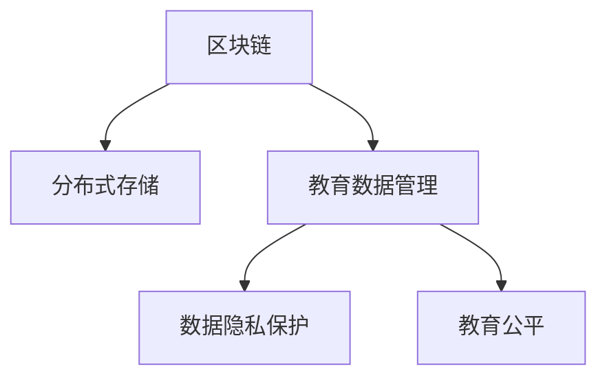

                 

# 知识的分布式存储：区块链技术在教育中的应用

> 关键词：知识存储, 分布式存储, 区块链, 教育, 学生数据管理, 教育公平, 数据隐私

## 1. 背景介绍

### 1.1 问题由来
随着数字化的不断深入，教育领域产生了海量的学习数据。这些数据包括学生的学籍信息、学习行为、考试成绩、学习路径等，对学生的学习过程和结果进行了全面的记录。如何安全、高效地管理和存储这些数据，成为了教育信息化面临的重大挑战。

传统的数据存储方式，如集中式数据库，存在数据冗余、存储成本高、数据易泄露等问题。而区块链技术凭借其去中心化、透明、不可篡改的特性，为教育数据的分布式存储提供了新的解决方案。通过区块链，教育机构可以构建一个去中心化的、安全的、可信赖的数据存储和共享平台，有效解决数据管理难题。

### 1.2 问题核心关键点
- **数据安全**：如何确保教育数据在存储和传输过程中的安全性，防止数据泄露和篡改。
- **数据隐私**：如何保护学生隐私，避免数据被未授权访问和使用。
- **数据共享**：如何在不同教育机构间安全地共享数据，促进教育资源的优化配置和教育公平。
- **数据溯源**：如何确保数据的真实性和可追溯性，避免数据造假和数据篡改。

## 2. 核心概念与联系

### 2.1 核心概念概述

为了更好地理解区块链技术在教育中的应用，本节将介绍几个关键概念：

- **区块链**：一种分布式账本技术，通过去中心化的方式记录和验证交易数据，确保数据的安全性、透明性和不可篡改性。
- **分布式存储**：不同于集中式存储，分布式存储将数据分散存储在多个节点上，以提升数据的安全性和可靠性。
- **教育数据管理**：涉及学生学籍、成绩、行为等各类数据的收集、存储、管理和共享。
- **数据隐私保护**：通过技术手段保护数据不被未授权访问，保护用户隐私权。
- **教育公平**：通过数据共享和分析，优化教育资源配置，促进教育资源均衡分配，提升教育公平性。

这些概念之间的逻辑关系可以通过以下Mermaid流程图来展示：



这个流程图展示了几类关键概念及其之间的关系：

1. 区块链技术为分布式存储提供了安全、透明的数据存储方式。
2. 教育数据管理依赖于分布式存储，确保数据的可靠性和可追溯性。
3. 数据隐私保护是教育数据管理的重要组成部分，确保数据的合法使用。
4. 教育公平通过数据共享和分析实现，依赖于数据管理的完整性和可靠性。

## 3. 核心算法原理 & 具体操作步骤
### 3.1 算法原理概述

区块链技术在教育中的应用主要围绕分布式存储、数据隐私保护和教育公平展开。其核心算法原理包括：

- **分布式共识算法**：用于验证和记录交易数据，确保数据的不可篡改性和一致性。
- **加密算法**：用于保护数据的隐私，确保只有授权用户才能访问和使用数据。
- **智能合约**：用于自动化处理数据共享和使用的规则，确保数据使用的合法性和透明性。

### 3.2 算法步骤详解

基于区块链的教育数据管理，通常包括以下几个关键步骤：

**Step 1: 设计区块链架构**

- 选择合适的共识算法，如PoW、PoS、DPoS等，设计区块链网络的节点组成和通信协议。
- 确定区块的大小和结构，定义数据上链的格式和标准。
- 设计智能合约的逻辑和接口，确保数据共享和使用的规则被自动化执行。

**Step 2: 实施数据上链**

- 将教育数据格式化为符合区块链标准的数据块。
- 通过节点间的共识算法，将数据块验证并记录在区块链上。
- 使用加密算法对数据进行加密，确保数据的隐私性。

**Step 3: 访问和共享数据**

- 设计数据访问接口，允许授权用户通过智能合约获取数据。
- 使用数字签名和权限控制，确保只有授权用户可以访问数据。
- 实现数据共享协议，允许不同教育机构安全地共享和协作。

**Step 4: 监控和审计**

- 部署监控节点，实时监控区块链上的数据流和操作。
- 使用审计工具，定期检查数据的一致性和完整性。
- 设计数据治理机制，处理数据冲突和异常。

### 3.3 算法优缺点

区块链技术在教育中的应用，具有以下优点：

1. **去中心化**：区块链通过分布式存储消除了中心化数据存储的风险。
2. **透明性**：区块链的所有交易数据都是公开透明的，提升了数据使用的可信度。
3. **不可篡改**：区块链的数据一旦上链，就无法被篡改，保证了数据的真实性和可追溯性。
4. **安全性**：区块链的加密算法和共识机制，提供了高水平的数据安全保障。

同时，区块链技术在教育应用中也存在一些缺点：

1. **性能瓶颈**：区块链的共识算法和加密算法增加了系统负担，导致处理速度较慢。
2. **技术复杂度**：区块链技术的实施和维护需要较高的技术门槛，对教育机构的技术团队提出了挑战。
3. **隐私保护**：尽管区块链提供加密算法，但如何保护数据的隐私，防止数据泄露，仍需进一步研究。
4. **成本问题**：区块链技术的实施和维护需要大量的计算资源和资金投入，增加了教育机构的成本负担。

尽管存在这些局限，但区块链技术在教育数据管理中的应用前景广阔，特别是在数据安全、数据共享和教育公平等领域具有独特优势。

### 3.4 算法应用领域

区块链技术在教育中的应用，可以拓展到多个领域，例如：

- **学生学籍管理**：通过区块链存储学生的学籍信息，确保数据的完整性和不可篡改性。
- **学习行为分析**：记录学生的学习路径、行为数据，通过数据分析优化教学策略。
- **成绩和证书管理**：利用区块链存储和验证学生的成绩和证书，确保数据的真实性。
- **教育资源共享**：实现不同教育机构间的资源共享，促进教育公平和资源优化配置。
- **教育公平评估**：通过区块链记录和分析教育资源的使用情况，评估教育公平性。

## 4. 数学模型和公式 & 详细讲解  
### 4.1 数学模型构建

本节将使用数学语言对基于区块链的教育数据管理过程进行更加严格的刻画。

假设教育数据管理系统中，每个学生的数据量为 $D_s$，每个学期的数据量为 $D_t$，系统中共有 $N$ 个学生，数据以区块的形式上链，每个区块大小为 $B$。则区块链上的数据总量为：

$$
D_{total} = N \times D_s \times D_t / B
$$

假设系统的共识算法为PoW，难度系数为 $D$，每个区块生成时间为 $T$，每秒新生成的区块数量为 $N_{block}$。则系统每秒新增的数据量为：

$$
D_{new} = N_{block} / T \times B
$$

系统的存储容量为 $C$，则系统的存储利用率为：

$$
\eta = D_{total} / C
$$

### 4.2 公式推导过程

通过上述公式，我们可以看到，系统的存储利用率主要取决于数据总量、区块大小和共识算法的工作效率。为了提高存储利用率，需要优化区块大小和共识算法的设计。

在实际应用中，可以通过以下措施提升系统性能：

- **区块压缩**：使用数据压缩算法，减小区块大小，提高存储效率。
- **动态调整共识算法**：根据数据生成速度和存储容量，动态调整共识算法，提高系统效率。
- **多链设计**：设计多条链，分别存储不同类型的教育数据，提高存储效率。

### 4.3 案例分析与讲解

以学生成绩和证书管理为例，分析区块链技术的应用。

假设每个学生的成绩数据量为 $D_s$，每个学期的成绩数据量为 $D_t$，系统中共有 $N$ 个学生。为了确保数据的完整性和不可篡改性，每个学期的成绩数据都将上链。

每个区块的大小为 $B$，系统每秒新生成的区块数量为 $N_{block}$。假设系统使用PoW共识算法，难度系数为 $D$，每个区块生成时间为 $T$。则系统每秒新增的数据量为：

$$
D_{new} = N_{block} / T \times B
$$

假设系统的存储容量为 $C$，则系统的存储利用率为：

$$
\eta = N \times D_s \times D_t / B
$$

通过调整区块大小和共识算法参数，可以优化系统的存储利用率，提升教育数据管理的效率。

## 5. 项目实践：代码实例和详细解释说明
### 5.1 开发环境搭建

在进行区块链教育数据管理系统的开发前，我们需要准备好开发环境。以下是使用Python和Hyperledger Fabric进行区块链开发的配置流程：

1. 安装Python：从官网下载并安装Python，确保版本为3.6以上。
2. 安装Hyperledger Fabric：从官网下载并安装Hyperledger Fabric，确保版本为1.4以上。
3. 配置依赖库：安装相关的依赖库，如docker、docker-compose等。
4. 搭建区块链网络：使用docker-compose文件，搭建Hyperledger Fabric网络，并启动节点。
5. 配置环境变量：配置区块链网络所需的环境变量，包括peer地址、通道ID、区块链ID等。

完成上述步骤后，即可在区块链网络中进行数据的上传、查询和共享。

### 5.2 源代码详细实现

下面以学生成绩管理为例，给出使用Hyperledger Fabric进行区块链开发的PyTorch代码实现。

首先，定义区块链网络中的智能合约：

```python
from hyperledger_fabric.contract import Contract
from hyperledger_fabric.utils import format_arg
from hyperledger_fabric.shim import Shims
from hyperledger_fabric.shim.table import Table
from hyperledger_fabric.exceptions import ConstraintViolationException

class StudentScoreContract(Contract):
    def __init__(self):
        super().__init__()
    
    @transaction
    def add_score(self, args):
        student_id = format_arg(args[0])
        score = format_arg(args[1])
        
        if student_id not in self.data:
            self.data[student_id] = {'name': '', 'scores': [], 'grades': []}
        
        self.data[student_id]['scores'].append(score)
    
    @transaction
    def get_scores(self, args):
        student_id = format_arg(args[0])
        
        if student_id not in self.data:
            return []
        
        return self.data[student_id]['scores']
```

然后，定义区块链网络的通道和节点：

```python
from hyperledger_fabric.peer import Peer
from hyperledger_fabric.channel import Channel

# 创建通道和节点
channel = Channel('testchannel')
peer = Peer('peer0.org1.example.com:7051')

# 安装智能合约
peer.installContract('com.example.studentScore', '0.1.0', StudentScoreContract)

# 注册智能合约
peer.registerContract('com.example.studentScore', '0.1.0', StudentScoreContract)
```

接着，定义区块链网络的操作接口：

```python
from hyperledger_fabric.sdk.channel import ChannelClient
from hyperledger_fabric.sdk.stub import Stub
from hyperledger_fabric.sdk.channel.query import QueryRequest

# 连接到通道
client = ChannelClient('testchannel')
stub = Stub('peer0.org1.example.com:7050')

# 查询学生成绩
response = stub.getQueryResult(QueryRequest('com.example.studentScore', 'get_scores', 'e6a59a2b-1e41-4b4b-9c9c-4d99adf1ac5c', '{\n"student_id": "001"\n}'))
scores = response.get('scores')

# 添加学生成绩
request = Stub([('com.example.studentScore', 'add_score', '001', '90')])
response = stub.submitTransaction(request)
```

最后，启动区块链网络并运行代码：

```bash
# 启动Hyperledger Fabric网络
docker-compose up

# 运行代码
python student_score.py
```

以上就是使用Hyperledger Fabric对区块链进行学生成绩管理的完整代码实现。可以看到，Hyperledger Fabric提供了完整的区块链开发框架，开发者可以使用Python等高级语言编写智能合约和操作接口，方便快捷地进行区块链开发。

### 5.3 代码解读与分析

让我们再详细解读一下关键代码的实现细节：

**StudentScoreContract类**：
- `add_score`方法：接收学生ID和成绩，将成绩添加到区块链上的智能合约中。
- `get_scores`方法：接收学生ID，查询该学生的成绩列表。

**通道和节点配置**：
- 使用Hyperledger Fabric的Channel和Peer类，创建通道和节点。
- 通过`installContract`和`registerContract`方法，安装和注册智能合约。

**操作接口**：
- 使用Hyperledger Fabric的Stub类，连接到通道并执行查询和提交操作。
- 通过`getQueryResult`方法，查询学生成绩列表。
- 通过`submitTransaction`方法，提交学生成绩。

可以看到，Hyperledger Fabric提供了一套完整的区块链开发框架，开发者可以使用Python等高级语言进行智能合约的编写和操作接口的实现。使用Hyperledger Fabric进行区块链开发，可以大大降低技术门槛，加速区块链应用的开发和部署。

当然，实际应用中还需要考虑更多的因素，如区块链网络的安全性、性能优化、系统扩展等。但核心的区块链教育数据管理流程基本与此类似。

## 6. 实际应用场景
### 6.1 学生学籍管理

在学生学籍管理中，区块链技术可以记录和验证学生的学籍信息，确保数据的完整性和不可篡改性。

具体而言，可以设计一个智能合约，用于记录学生的学籍信息，包括姓名、性别、出生日期、联系方式等。每个学生的学籍信息将上链，确保数据的完整性和不可篡改性。

通过区块链，学校和教育机构可以安全地共享和查询学生的学籍信息，确保数据的合法使用。同时，学生也可以随时访问自己的学籍信息，确保数据的透明度和可追溯性。

### 6.2 学习行为分析

通过区块链记录学生的学习行为，包括学习时间、学习内容、学习平台等，可以分析学生的学习效果和行为习惯，为个性化教学提供数据支持。

具体而言，可以设计一个智能合约，用于记录学生的学习行为。每个学生的学习行为将上链，包括学习时间、学习内容、学习平台等。

通过区块链，教育机构可以安全地共享和查询学生的学习行为数据，分析学生的学习效果和行为习惯，优化教学策略，提升教学效果。

### 6.3 成绩和证书管理

利用区块链存储和验证学生的成绩和证书，确保数据的真实性和可追溯性。

具体而言，可以设计一个智能合约，用于记录学生的成绩和证书。每个学生的成绩和证书将上链，确保数据的真实性和可追溯性。

通过区块链，学校和教育机构可以安全地共享和查询学生的成绩和证书，确保数据的合法使用。同时，学生也可以随时访问自己的成绩和证书，确保数据的透明度和可追溯性。

### 6.4 教育资源共享

通过区块链实现不同教育机构间的资源共享，促进教育公平和资源优化配置。

具体而言，可以设计一个智能合约，用于记录教育资源的使用情况。每个教育机构的教育资源使用情况将上链，确保数据的真实性和可追溯性。

通过区块链，不同教育机构可以安全地共享和查询教育资源的使用情况，优化教育资源的配置，提升教育公平性。

## 7. 工具和资源推荐
### 7.1 学习资源推荐

为了帮助开发者系统掌握区块链技术在教育中的应用，这里推荐一些优质的学习资源：

1. 《Blockchain Fundamentals for Dummies》系列博文：由大模型技术专家撰写，深入浅出地介绍了区块链原理、应用场景等基础知识。
2. 《Hyperledger Fabric by Example》书籍：Hyperledger Fabric官方文档，提供了完整的区块链开发样例代码，是上手实践的必备资料。
3. 《Blockchain and Bitcoin: The Basics of the Economics of Blockchain Technology》书籍：比特币和区块链技术专家所著，全面介绍了区块链技术的经济基础和应用场景。
4. 《Blockchain Revolution》系列视频：TED Talks中关于区块链技术的讲座，涵盖区块链技术的基本概念和前沿应用。
5. 《The Future of Blockchains in Education》论文：探讨区块链技术在教育领域的应用，分析其优势和挑战。

通过对这些资源的学习实践，相信你一定能够快速掌握区块链技术在教育中的应用，并用于解决实际的教育问题。

### 7.2 开发工具推荐

高效的开发离不开优秀的工具支持。以下是几款用于区块链教育数据管理开发的常用工具：

1. Docker：容器化技术，可以方便地搭建和管理区块链网络。
2. Hyperledger Fabric：开源的区块链开发框架，提供了完整的区块链开发框架，适合快速迭代研究。
3. Truffle：以太坊智能合约开发工具，提供了丰富的开发环境和测试工具。
4. IPFS：分布式文件存储系统，可以用于区块链数据的存储和检索。
5. Web3.js：以太坊和区块链API库，方便开发者进行区块链应用开发。

合理利用这些工具，可以显著提升区块链教育数据管理的开发效率，加快创新迭代的步伐。

### 7.3 相关论文推荐

区块链技术在教育领域的应用研究方兴未艾，以下是几篇奠基性的相关论文，推荐阅读：

1. "Blockchain for Education"论文：探讨区块链技术在教育领域的应用，分析其优势和挑战。
2. "Smart Contracts in Education"论文：研究智能合约在教育中的应用，分析其对教育公平的影响。
3. "Distributed Ledger Technology in Education"论文：分析区块链技术在教育数据管理中的应用，讨论其技术实现和数据隐私保护问题。
4. "Educational Resource Sharing via Blockchain"论文：研究区块链在教育资源共享中的应用，探讨其对教育公平的影响。
5. "Blockchain in Student Identity Verification"论文：研究区块链技术在学生身份认证中的应用，讨论其数据安全和隐私保护问题。

这些论文代表了大模型技术在教育领域的研究方向，通过学习这些前沿成果，可以帮助研究者把握学科前进方向，激发更多的创新灵感。

## 8. 总结：未来发展趋势与挑战

### 8.1 总结

本文对基于区块链的教育数据管理方法进行了全面系统的介绍。首先阐述了区块链技术在教育领域的应用背景和意义，明确了区块链技术在数据存储和共享中的独特价值。其次，从原理到实践，详细讲解了区块链技术的核心算法和操作步骤，给出了区块链教育数据管理的完整代码实例。同时，本文还广泛探讨了区块链技术在学生学籍管理、学习行为分析、成绩证书管理等多个教育场景中的应用前景，展示了区块链技术的广阔应用空间。此外，本文精选了区块链技术的各类学习资源，力求为读者提供全方位的技术指引。

通过本文的系统梳理，可以看到，基于区块链的教育数据管理方法正在成为教育信息化领域的重要范式，极大地提升了教育数据的安全性和可追溯性，促进了教育资源的优化配置，为教育公平的实现提供了新的技术手段。未来，伴随区块链技术的持续演进，教育数据管理的智能化和自动化程度将进一步提升，为教育事业的现代化进程注入新的动力。

### 8.2 未来发展趋势

展望未来，区块链技术在教育中的应用将呈现以下几个发展趋势：

1. **智能化管理**：区块链技术将进一步融入智能合约和AI技术，实现教育数据管理的自动化和智能化，提升教育资源配置的效率和公平性。
2. **隐私保护**：区块链技术将结合隐私计算和去中心化存储，进一步提升数据隐私保护水平，确保学生数据的安全性。
3. **跨领域融合**：区块链技术将与其他人工智能技术，如知识图谱、因果推理等，进行更深入的融合，提升教育数据管理的深度和广度。
4. **社区共建**：区块链技术将促进教育机构和社区的共建共享，形成开放、透明的教育数据共享平台，提升教育资源的利用效率。
5. **生态系统构建**：区块链技术将构建一个完整的教育数据管理和共享生态系统，包括教育机构、社区、技术提供商等多方参与，推动教育信息化进程。

### 8.3 面临的挑战

尽管区块链技术在教育中的应用前景广阔，但在迈向更加智能化、普适化应用的过程中，它仍面临诸多挑战：

1. **技术复杂度**：区块链技术的实现和维护需要较高的技术门槛，对教育机构的技术团队提出了挑战。
2. **性能瓶颈**：区块链的共识算法和加密算法增加了系统负担，导致处理速度较慢。
3. **数据隐私**：尽管区块链提供加密算法，但如何保护数据的隐私，防止数据泄露，仍需进一步研究。
4. **成本问题**：区块链技术的实施和维护需要大量的计算资源和资金投入，增加了教育机构的成本负担。
5. **标准化问题**：目前区块链技术在教育领域的应用尚未形成统一的标准和规范，可能带来数据互操作性和兼容性问题。

### 8.4 研究展望

面对区块链技术在教育应用中所面临的挑战，未来的研究需要在以下几个方面寻求新的突破：

1. **技术优化**：开发更加高效、易用的区块链应用开发框架，降低技术门槛，提升开发效率。
2. **性能提升**：优化区块链共识算法和加密算法，提高系统的处理速度和响应效率。
3. **隐私保护**：研究区块链结合隐私计算等技术，提升数据隐私保护水平，确保学生数据的安全性。
4. **标准化建设**：推动区块链技术在教育领域的应用标准化，形成统一的标准和规范，提升数据互操作性和兼容性。
5. **生态系统构建**：构建一个完整的教育数据管理和共享生态系统，包括教育机构、社区、技术提供商等多方参与，推动教育信息化进程。

这些研究方向的探索，必将引领区块链技术在教育数据管理领域迈向更高的台阶，为构建安全、可靠、可信赖的教育信息生态系统提供新的技术手段。面向未来，区块链技术将在教育信息化进程中扮演越来越重要的角色，推动教育事业的现代化和智能化发展。

## 9. 附录：常见问题与解答

**Q1：区块链技术在教育中主要解决哪些问题？**

A: 区块链技术在教育中主要解决以下几个问题：

1. **数据安全**：通过去中心化的分布式存储，确保教育数据的安全性和不可篡改性。
2. **数据隐私保护**：通过加密算法和权限控制，保护学生的隐私权，确保数据不被未授权访问。
3. **数据共享**：通过智能合约和分布式共识，确保不同教育机构间安全地共享和协作。
4. **数据溯源**：通过区块链的不可篡改性，确保数据的真实性和可追溯性。

**Q2：如何选择合适的区块链共识算法？**

A: 选择合适的区块链共识算法，需要考虑以下几个因素：

1. **性能要求**：根据系统的性能要求，选择适合的高性能共识算法，如PoS、DPoS等。
2. **安全性要求**：根据系统的安全性要求，选择适合的共识算法，如PoW等。
3. **可扩展性**：根据系统的可扩展性要求，选择适合的共识算法，如BFT等。
4. **社区支持**：选择已有社区支持广泛、资源丰富的共识算法，确保系统的可靠性和稳定性。

**Q3：区块链技术在教育中面临的主要挑战是什么？**

A: 区块链技术在教育中面临的主要挑战包括：

1. **技术复杂度**：区块链技术的实现和维护需要较高的技术门槛，对教育机构的技术团队提出了挑战。
2. **性能瓶颈**：区块链的共识算法和加密算法增加了系统负担，导致处理速度较慢。
3. **数据隐私**：尽管区块链提供加密算法，但如何保护数据的隐私，防止数据泄露，仍需进一步研究。
4. **成本问题**：区块链技术的实施和维护需要大量的计算资源和资金投入，增加了教育机构的成本负担。
5. **标准化问题**：目前区块链技术在教育领域的应用尚未形成统一的标准和规范，可能带来数据互操作性和兼容性问题。

**Q4：如何设计一个安全的区块链教育数据管理系统？**

A: 设计一个安全的区块链教育数据管理系统，需要考虑以下几个方面：

1. **数据加密**：使用加密算法对数据进行加密，确保数据的隐私性和安全性。
2. **权限控制**：通过智能合约和访问控制，确保只有授权用户可以访问和使用数据。
3. **智能合约设计**：设计智能合约的逻辑和接口，确保数据共享和使用的规则被自动化执行。
4. **监控和审计**：部署监控节点，实时监控区块链上的数据流和操作，确保系统的安全性和可靠性。
5. **数据治理机制**：设计数据治理机制，处理数据冲突和异常，确保数据的完整性和一致性。

**Q5：区块链技术在教育中能够实现哪些功能？**

A: 区块链技术在教育中可以实现以下功能：

1. **学生学籍管理**：记录和验证学生的学籍信息，确保数据的完整性和不可篡改性。
2. **学习行为分析**：记录和分析学生的学习行为，为个性化教学提供数据支持。
3. **成绩和证书管理**：存储和验证学生的成绩和证书，确保数据的真实性和可追溯性。
4. **教育资源共享**：实现不同教育机构间的资源共享，促进教育公平和资源优化配置。
5. **教育公平评估**：记录和分析教育资源的使用情况，评估教育公平性。

综上所述，区块链技术在教育领域具有广阔的应用前景，可以为教育数据管理提供安全、透明、可追溯的解决方案，推动教育信息化的不断进步。

---

作者：禅与计算机程序设计艺术 / Zen and the Art of Computer Programming

