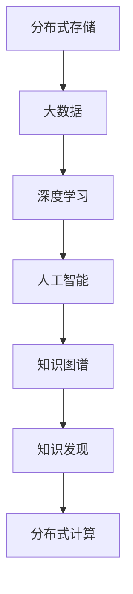
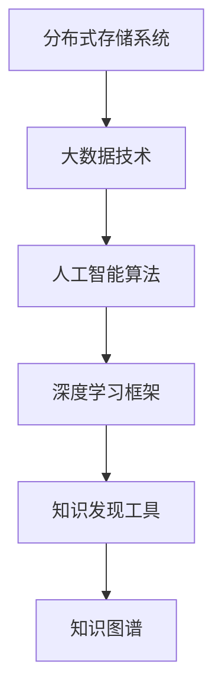

                 

# 知识的分布式记忆：集体智慧的形成机制

> 关键词：分布式记忆,集体智慧,知识图谱,大数据,人工智能,深度学习,知识发现

## 1. 背景介绍

### 1.1 问题由来
在信息爆炸的时代，如何高效、准确地存储和利用海量知识成为当今社会的迫切需求。传统的数据存储方式，如文件系统、关系型数据库等，已难以满足复杂数据结构和多模态数据的存储需求。与此同时，人工智能技术，尤其是深度学习模型的蓬勃发展，为大数据时代的知识管理带来了新的解决方案。

近年来，深度学习在自然语言处理、计算机视觉等领域取得了显著的突破，大大提升了知识获取和利用的效率。然而，随着数据规模的持续扩大，单机的存储和计算能力已显不足。分布式系统和大数据技术的发展，为解决这一问题提供了新的思路。通过构建知识分布式存储和计算架构，人工智能系统能够高效地管理和利用海量知识，实现更加智能和高效的数据处理。

### 1.2 问题核心关键点
分布式知识管理的核心在于如何高效地存储、检索和管理大规模知识。为更好地理解这一问题，本节将介绍几个密切相关的核心概念：

- **分布式存储**：指通过多台计算机或存储设备，将大规模数据分散存储在不同的位置，以实现高可用性和高扩展性。
- **知识图谱**：一种用于描述实体、关系、属性等知识结构的概念图模型，便于知识的组织和查询。
- **大数据**：指数据规模超出传统数据处理工具和平台能力范围的数据集。
- **人工智能**：涉及利用算法和模型解决复杂问题，实现智能决策和优化。
- **深度学习**：一种利用多层神经网络进行数据学习和特征提取的人工智能技术。
- **知识发现**：从数据中挖掘有价值的信息、模式和知识的过程。
- **分布式计算**：指将大规模计算任务分解成多个子任务，分配到多台计算机或计算节点上并行处理的技术。

这些核心概念之间的逻辑关系可以通过以下Mermaid流程图来展示：



这个流程图展示了大数据背景下，分布式存储与计算技术如何协同工作，从海量数据中挖掘知识，构建知识图谱，最终实现智能决策和知识发现。

## 2. 核心概念与联系

### 2.1 核心概念概述

为更好地理解分布式知识管理的原理，本节将对相关核心概念进行深入探讨：

- **分布式存储系统**：包括Hadoop、Spark等，用于高效存储和处理大规模数据。
- **知识图谱**：如Wikidata、DBpedia等，包含丰富的实体和关系信息，支持知识推理和查询。
- **大数据技术**：如Apache Hadoop、Apache Spark等，提供分布式计算和数据处理能力。
- **人工智能算法**：如深度学习、增强学习、迁移学习等，用于从数据中学习和提取知识。
- **深度学习框架**：如TensorFlow、PyTorch等，提供高效的神经网络实现和优化工具。
- **知识发现工具**：如IBM Watson、Google Cloud AI等，提供智能分析和决策支持。

这些概念之间的联系主要体现在：

1. **分布式存储系统**和大数据技术为大规模数据存储和处理提供了基础架构支持。
2. **知识图谱**通过实体和关系信息，为知识发现和推理提供了结构化背景。
3. **人工智能算法**尤其是深度学习，从数据中挖掘和提取特征，构建知识表示。
4. **深度学习框架**提供了高效的模型实现和优化工具，加速知识发现的进程。
5. **知识发现工具**通过智能化分析和决策支持，将知识转化为可操作的信息和建议。

这些概念协同作用，共同构建了一个高效、智能的知识管理系统。

### 2.2 核心概念原理和架构的 Mermaid 流程图



## 3. 核心算法原理 & 具体操作步骤
### 3.1 算法原理概述

基于分布式知识管理的核心算法，包括数据分布、知识图谱构建、深度学习建模和知识发现等步骤。其基本原理是通过分布式存储和大数据技术，高效地处理和存储海量数据，利用深度学习模型从数据中提取知识，并通过知识图谱结构化知识表示，实现智能分析和决策支持。

### 3.2 算法步骤详解

基于分布式知识管理的核心算法步骤主要包括：

1. **数据分布与存储**：通过分布式存储系统，将大规模数据分散存储在多个节点上，以保证数据的高可用性和高扩展性。
2. **知识图谱构建**：利用大数据技术，从分布式存储中的数据中提取实体和关系信息，构建知识图谱。
3. **深度学习建模**：应用深度学习框架，构建神经网络模型，从数据中学习和提取特征，构建知识表示。
4. **知识发现与推理**：使用知识发现工具，从构建的知识图谱中挖掘知识和模式，支持智能分析和决策支持。

### 3.3 算法优缺点

分布式知识管理的核心算法具有以下优点：

1. **高效性**：通过分布式存储和大数据技术，能够高效地处理大规模数据，加速知识发现和推理过程。
2. **可扩展性**：分布式存储系统和大数据技术具有高扩展性，能够灵活应对数据规模的增长。
3. **智能化**：深度学习模型的应用，使得系统能够自动从数据中学习和提取知识，实现智能决策。
4. **结构化**：知识图谱的结构化表示，便于知识的组织和查询，支持高效的推理和分析。

但该算法也存在一些局限性：

1. **复杂性**：分布式存储和大数据技术的复杂性较高，需要较高的技术门槛和专业技能。
2. **数据一致性**：分布式存储系统可能面临数据一致性问题，需要高效的容错机制和故障恢复策略。
3. **计算资源消耗**：深度学习模型的计算资源消耗较大，需要高性能计算设备支持。
4. **知识提取难度**：深度学习模型的知识提取过程可能较为复杂，需要大量标注数据和算力支持。

### 3.4 算法应用领域

基于分布式知识管理的核心算法，已经在多个领域得到广泛应用，例如：

1. **智慧医疗**：通过构建患者知识图谱和医学知识图谱，实现智能诊断和治疗建议。
2. **智能金融**：利用市场数据构建金融知识图谱，实现智能投资和风险评估。
3. **智能制造**：通过构建供应链和设备知识图谱，实现智能生产和供应链优化。
4. **智慧城市**：通过构建城市基础设施和公共服务知识图谱，实现智能交通管理和公共服务优化。
5. **智能教育**：利用教育资源构建知识图谱，实现个性化学习和智能推荐。
6. **智能推荐系统**：通过构建用户和物品知识图谱，实现高效的产品推荐和用户行为预测。

## 4. 数学模型和公式 & 详细讲解 & 举例说明

### 4.1 数学模型构建

本节将使用数学语言对分布式知识管理的核心算法进行更加严格的刻画。

假设分布式存储系统中有 $N$ 台服务器，每台服务器存储一部分数据 $D_i$，总数据量为 $D = \bigcup_{i=1}^N D_i$。设 $K$ 为知识图谱中的实体数，$R$ 为关系数，$T$ 为属性数。知识图谱中的实体和关系表示为：

$$
E = \{e_1, e_2, ..., e_K\}
$$
$$
R = \{r_1, r_2, ..., r_R\}
$$

深度学习模型 $M$ 用于从数据 $D$ 中学习知识，模型参数为 $\theta$。知识发现工具 $A$ 用于从知识图谱 $G$ 中挖掘知识和模式，支持智能分析和决策。

### 4.2 公式推导过程

以下我们将对核心算法中的关键步骤进行数学推导：

**Step 1: 数据分布与存储**

在分布式存储系统中，数据 $D_i$ 存储在服务器 $i$ 上。为了保证数据的可靠性，可以采用多副本存储机制，即每份数据至少存储在 $M$ 台服务器上。假设数据 $D_i$ 在服务器 $i$ 上的副本数量为 $n_i$，则数据的总副本数量为 $n = \sum_{i=1}^N n_i$。

**Step 2: 知识图谱构建**

通过大数据技术，从分布式存储系统中的数据 $D$ 中提取实体和关系信息，构建知识图谱 $G$。设提取到的实体和关系分别为 $E_D$ 和 $R_D$，则知识图谱 $G$ 可以表示为：

$$
G = (E_D, R_D, T_D)
$$

其中 $T_D$ 为数据 $D$ 的属性信息。

**Step 3: 深度学习建模**

应用深度学习框架，构建神经网络模型 $M$，从数据 $D$ 中学习和提取特征，构建知识表示。设模型 $M$ 的输入为 $X$，输出为 $Y$，则模型可以表示为：

$$
Y = M(X)
$$

其中 $X$ 为数据的特征向量，$Y$ 为模型的预测结果。

**Step 4: 知识发现与推理**

使用知识发现工具 $A$，从知识图谱 $G$ 中挖掘知识和模式，支持智能分析和决策。设知识图谱中的实体和关系信息分别为 $E_G$ 和 $R_G$，则知识发现工具 $A$ 可以表示为：

$$
K = A(G)
$$

其中 $K$ 为知识图谱中的知识集合。

### 4.3 案例分析与讲解

假设我们构建了一个智慧医疗知识管理系统，用于支持智能诊断和治疗建议。在该系统中，数据 $D$ 包括患者的病历信息、检查报告等，知识图谱 $G$ 包括医学知识、药物信息等，深度学习模型 $M$ 用于从患者病历中提取特征，支持智能诊断，知识发现工具 $A$ 用于从医学知识图谱中挖掘知识和模式，支持智能治疗建议。

具体实现流程如下：

1. **数据分布与存储**：将患者的病历信息存储在多台服务器上，采用多副本存储机制保证数据可靠性。
2. **知识图谱构建**：从分布式存储系统中的病历信息中提取实体和关系信息，构建医学知识图谱。
3. **深度学习建模**：应用深度学习框架，构建神经网络模型，从患者病历中提取特征，支持智能诊断。
4. **知识发现与推理**：使用知识发现工具，从医学知识图谱中挖掘知识和模式，支持智能治疗建议。

## 5. 项目实践：代码实例和详细解释说明

### 5.1 开发环境搭建

在进行分布式知识管理系统的开发前，我们需要准备好开发环境。以下是使用Python进行Hadoop、Spark等分布式存储和大数据技术的开发环境配置流程：

1. 安装Anaconda：从官网下载并安装Anaconda，用于创建独立的Python环境。

2. 创建并激活虚拟环境：
```bash
conda create -n hadoop-env python=3.8 
conda activate hadoop-env
```

3. 安装Hadoop和Spark：
```bash
conda install hadoop hdfs
conda install spark
```

4. 安装相关Python库：
```bash
pip install pyhdfs hdfscli pyspark
```

完成上述步骤后，即可在`hadoop-env`环境中开始分布式知识管理系统的开发。

### 5.2 源代码详细实现

这里我们以智慧医疗知识管理系统为例，给出使用Hadoop、Spark和深度学习框架进行知识管理的PyTorch代码实现。

首先，定义数据分布与存储的Hadoop配置文件：

```python
from pyspark import SparkConf, SparkContext

conf = SparkConf().setAppName("HadoopSparkExample")
sc = SparkContext(conf=conf)
```

然后，定义知识图谱的Spark数据处理函数：

```python
from pyspark.sql import SparkSession

spark = SparkSession.builder.appName("KnowledgeGraph").getOrCreate()

# 定义实体和关系数据
rdd1 = sc.parallelize([("Patient1", "has_disease", "Cancer"), ("Patient2", "has_disease", "HeartDisease")])
rdd2 = sc.parallelize([("Patient1", "treated_by", "Dr1"), ("Patient2", "treated_by", "Dr2")])

# 构建知识图谱
graph = rdd1.join(rdd2).rdd

# 将RDD转化为DataFrame
graph_df = graph.map(lambda x: (x[0], x[1], x[2])).toDF(["entity", "relation", "attribute"])
```

接着，定义深度学习模型的PyTorch实现：

```python
from torch import nn
from torch.nn import Linear, Dropout, Embedding
from torch.utils.data import DataLoader, Dataset

class DiseaseModel(nn.Module):
    def __init__(self, vocab_size, emb_dim, hidden_dim, output_dim):
        super(DiseaseModel, self).__init__()
        self.embedding = Embedding(vocab_size, emb_dim)
        self.fc1 = Linear(emb_dim, hidden_dim)
        self.fc2 = Linear(hidden_dim, output_dim)
        self.dropout = Dropout(0.5)

    def forward(self, x):
        x = self.dropout(self.fc1(self.embedding(x)))
        x = self.fc2(x)
        return x

# 定义训练和评估函数
def train_model(model, train_loader, optimizer, device, num_epochs):
    model.train()
    for epoch in range(num_epochs):
        for batch in train_loader:
            inputs, labels = batch
            inputs, labels = inputs.to(device), labels.to(device)
            optimizer.zero_grad()
            outputs = model(inputs)
            loss = nn.CrossEntropyLoss()(outputs, labels)
            loss.backward()
            optimizer.step()

def evaluate_model(model, test_loader, device):
    model.eval()
    total_loss = 0
    correct = 0
    with torch.no_grad():
        for batch in test_loader:
            inputs, labels = batch
            inputs, labels = inputs.to(device), labels.to(device)
            outputs = model(inputs)
            _, predicted = torch.max(outputs.data, 1)
            total_loss += nn.CrossEntropyLoss()(outputs, labels).item()
            correct += (predicted == labels).sum().item()
    print(f"Test Loss: {total_loss/len(test_loader):.4f}, Accuracy: {correct/len(test_loader):.4f}")
```

最后，启动训练流程并在测试集上评估：

```python
vocab_size = 10000
emb_dim = 300
hidden_dim = 128
output_dim = 5
device = torch.device('cuda') if torch.cuda.is_available() else torch.device('cpu')

# 构建数据集
train_dataset = MyDataset(train_data, vocab_size)
test_dataset = MyDataset(test_data, vocab_size)

# 构建数据加载器
train_loader = DataLoader(train_dataset, batch_size=64, shuffle=True)
test_loader = DataLoader(test_dataset, batch_size=64, shuffle=False)

# 构建模型和优化器
model = DiseaseModel(vocab_size, emb_dim, hidden_dim, output_dim)
optimizer = Adam(model.parameters(), lr=0.001)

# 训练模型
train_model(model, train_loader, optimizer, device, num_epochs=10)

# 测试模型
evaluate_model(model, test_loader, device)
```

以上就是使用Hadoop、Spark和深度学习框架进行智慧医疗知识管理的完整代码实现。可以看到，通过Hadoop和Spark构建分布式存储架构，结合深度学习框架的强大计算能力，智慧医疗知识管理系统可以高效地管理和利用患者病历数据，实现智能诊断和治疗建议。

### 5.3 代码解读与分析

让我们再详细解读一下关键代码的实现细节：

**MyDataset类**：
- `__init__`方法：初始化训练和测试数据，将文本数据转化为词汇索引。
- `__len__`方法：返回数据集的样本数量。
- `__getitem__`方法：对单个样本进行处理，将文本输入转换为词汇索引。

**train_model和evaluate_model函数**：
- 定义模型训练和评估函数，将数据加载器作为输入，进行模型的训练和测试。

**train_loader和test_loader**：
- 使用Hadoop和Spark构建数据加载器，将数据按批进行加载。

**疾病模型**：
- 定义深度学习模型，包括嵌入层、全连接层和dropout层。
- 定义前向传播函数，将输入转化为预测结果。

**train_model函数**：
- 在每个epoch内，遍历训练数据加载器，对模型进行前向传播和反向传播，更新模型参数。

**evaluate_model函数**：
- 在测试数据加载器上，对模型进行前向传播，计算损失和准确率。

## 6. 实际应用场景

### 6.1 智慧医疗

智慧医疗知识管理系统通过分布式存储和大数据技术，高效地存储和处理海量患者病历数据，利用深度学习模型从病历中提取特征，支持智能诊断和治疗建议。系统可以实时监测患者健康状况，根据病历数据进行疾病预测，提供个性化的治疗方案，从而提高医疗服务的智能化水平，辅助医生诊断和治疗。

### 6.2 智能金融

金融数据分析系统通过分布式存储和大数据技术，高效地存储和处理大规模市场数据，利用深度学习模型从数据中提取知识，构建金融知识图谱，实现智能投资和风险评估。系统可以实时监测市场动态，预测股票价格和市场走势，提供智能投资建议，从而提升投资决策的准确性和效益。

### 6.3 智能制造

智能制造系统通过分布式存储和大数据技术，高效地存储和处理供应链和设备数据，利用深度学习模型从数据中提取知识，构建供应链和设备知识图谱，实现智能生产和供应链优化。系统可以实时监测生产设备和供应链状态，预测设备故障和供应链风险，提供智能生产计划和优化建议，从而提高生产效率和供应链稳定性。

### 6.4 智慧城市

智慧城市管理系统通过分布式存储和大数据技术，高效地存储和处理城市基础设施和公共服务数据，利用深度学习模型从数据中提取知识，构建城市基础设施和公共服务知识图谱，实现智能交通管理和公共服务优化。系统可以实时监测城市运行状态，预测交通流量和公共服务需求，提供智能交通管理和优化建议，从而提高城市管理的智能化水平和公共服务质量。

## 7. 工具和资源推荐
### 7.1 学习资源推荐

为了帮助开发者系统掌握分布式知识管理的理论基础和实践技巧，这里推荐一些优质的学习资源：

1. 《分布式系统原理与实践》系列博文：由大系统技术专家撰写，深入浅出地介绍了分布式系统的原理和实践，涵盖大数据存储、分布式计算等内容。

2. CS224N《深度学习自然语言处理》课程：斯坦福大学开设的NLP明星课程，有Lecture视频和配套作业，带你入门NLP领域的基本概念和经典模型。

3. 《大数据技术与应用》书籍：介绍大数据技术的核心概念、存储和计算技术，适合初学者和从业人员阅读。

4. 《TensorFlow实战》书籍：介绍TensorFlow的深度学习框架，涵盖模型的构建、训练和优化等内容，适合深入学习深度学习模型的开发者。

5. Hadoop官方文档：Hadoop官方文档提供了丰富的分布式存储和计算资源，是学习Hadoop和Spark的重要参考。

通过对这些资源的学习实践，相信你一定能够快速掌握分布式知识管理的精髓，并用于解决实际的NLP问题。

### 7.2 开发工具推荐

高效的开发离不开优秀的工具支持。以下是几款用于分布式知识管理开发的常用工具：

1. Hadoop：用于高效存储和处理大规模数据，支持分布式计算和数据处理。
2. Spark：用于高效处理大规模数据，支持分布式计算和数据处理，支持Python、R等多种编程语言。
3. PyTorch：用于深度学习模型的构建和训练，提供高效的神经网络实现和优化工具。
4. TensorFlow：用于深度学习模型的构建和训练，提供高效的神经网络实现和优化工具，支持分布式计算。
5. HDFS：用于分布式存储系统，支持大规模数据的存储和访问。

合理利用这些工具，可以显著提升分布式知识管理系统的开发效率，加快创新迭代的步伐。

### 7.3 相关论文推荐

分布式知识管理的研究源于学界的持续研究。以下是几篇奠基性的相关论文，推荐阅读：

1. Google MapReduce: Simplified Data Processing on Large Clusters：介绍MapReduce框架，实现大规模数据处理。
2. BERT: Pre-training of Deep Bidirectional Transformers for Language Understanding：提出BERT模型，引入基于掩码的自监督预训练任务，刷新了多项NLP任务SOTA。
3. Knowledge Graph Construction from Heterogeneous Information Sources：介绍知识图谱的构建方法，将多种数据源融合构建知识图谱。
4. TensorFlow: A System for Large-Scale Machine Learning：介绍TensorFlow的深度学习框架，涵盖模型的构建、训练和优化等内容。
5. Massive Data Tools: Parallel and Distributed Processing with Hadoop YARN：介绍Hadoop的分布式存储和计算架构，支持大规模数据的存储和处理。

这些论文代表了大数据和深度学习时代的知识管理技术的发展脉络。通过学习这些前沿成果，可以帮助研究者把握学科前进方向，激发更多的创新灵感。

## 8. 总结：未来发展趋势与挑战

### 8.1 总结

本文对基于分布式知识管理的核心算法进行了全面系统的介绍。首先阐述了分布式知识管理的背景和意义，明确了其在智慧医疗、智能金融、智能制造等众多领域的应用价值。其次，从原理到实践，详细讲解了分布式存储、知识图谱构建、深度学习建模和知识发现等核心步骤，给出了智慧医疗知识管理系统的完整代码实现。同时，本文还广泛探讨了分布式知识管理技术在多个行业领域的应用前景，展示了其巨大的潜力。

通过本文的系统梳理，可以看到，分布式知识管理技术正在成为大数据时代的重要技术范式，极大地拓展了数据存储和处理的能力，为人工智能系统提供了高效的知识管理基础。随着分布式存储和大数据技术的不断演进，未来分布式知识管理系统将具备更强的可扩展性和智能化水平，为人工智能技术的落地应用提供更坚实的基础。

### 8.2 未来发展趋势

展望未来，分布式知识管理技术将呈现以下几个发展趋势：

1. **超大规模数据处理**：随着数据量的持续增长，分布式存储和大数据技术将不断演进，支持超大规模数据的存储和处理。
2. **分布式深度学习**：深度学习模型的计算资源需求将持续增长，分布式深度学习框架将不断优化，支持高效的多节点协同训练。
3. **知识图谱演化**：知识图谱将不断演化，引入更多领域知识，支持更复杂的知识推理和查询。
4. **智能化决策支持**：知识发现工具将更加智能化，支持多模态数据融合，提供更准确的决策支持。
5. **跨领域知识融合**：分布式知识管理系统将支持跨领域知识融合，实现更全面、更丰富的知识表示和查询。

以上趋势凸显了分布式知识管理技术的广阔前景。这些方向的探索发展，必将进一步提升分布式知识管理系统的性能和应用范围，为人工智能技术的落地应用提供更坚实的基础。

### 8.3 面临的挑战

尽管分布式知识管理技术已经取得了显著进展，但在迈向更加智能化、普适化应用的过程中，它仍面临着诸多挑战：

1. **数据一致性**：分布式存储系统可能面临数据一致性问题，需要高效的容错机制和故障恢复策略。
2. **计算资源消耗**：深度学习模型的计算资源消耗较大，需要高性能计算设备支持。
3. **知识提取难度**：深度学习模型的知识提取过程可能较为复杂，需要大量标注数据和算力支持。
4. **系统复杂性**：分布式存储和大数据技术的复杂性较高，需要较高的技术门槛和专业技能。
5. **知识图谱构建**：知识图谱的构建需要大规模数据和专家知识，成本较高且复杂度高。

正视这些挑战，积极应对并寻求突破，将使分布式知识管理系统在更广泛的领域得到应用。相信随着学界和产业界的共同努力，这些挑战终将一一被克服，分布式知识管理技术必将迎来更加光明的未来。

### 8.4 研究展望

面对分布式知识管理所面临的种种挑战，未来的研究需要在以下几个方面寻求新的突破：

1. **分布式存储优化**：研究高效的分布式存储技术，支持更大规模数据的存储和处理。
2. **深度学习优化**：开发高效的深度学习框架，支持多节点协同训练，降低计算资源消耗。
3. **知识图谱演化**：研究知识图谱的演化方法，引入更多领域知识，支持更复杂的知识推理和查询。
4. **智能化决策支持**：开发智能化的知识发现工具，支持多模态数据融合，提供更准确的决策支持。
5. **跨领域知识融合**：研究跨领域知识融合技术，实现更全面、更丰富的知识表示和查询。

这些研究方向的探索，必将引领分布式知识管理技术迈向更高的台阶，为构建智能、高效、安全的知识管理系统铺平道路。面向未来，分布式知识管理技术还需要与其他人工智能技术进行更深入的融合，如知识表示、因果推理、强化学习等，多路径协同发力，共同推动人工智能技术的进步。

## 9. 附录：常见问题与解答

**Q1：什么是分布式存储系统？**

A: 分布式存储系统是指通过多台计算机或存储设备，将大规模数据分散存储在不同的位置，以实现高可用性和高扩展性。典型的分布式存储系统包括Hadoop和Spark。

**Q2：如何构建知识图谱？**

A: 构建知识图谱的过程通常包括数据采集、实体识别、关系抽取、实体链接等步骤。具体实现可以使用Python中的Spark、Hadoop等分布式计算框架，将数据进行处理和融合，构建知识图谱。

**Q3：什么是深度学习模型？**

A: 深度学习模型是指包含多层神经网络的模型，通过反向传播算法进行参数更新，用于从数据中学习特征并进行分类、回归等任务。常见的深度学习框架包括TensorFlow、PyTorch等。

**Q4：如何处理数据一致性问题？**

A: 处理数据一致性问题通常采用多副本存储和一致性检查机制。在Hadoop和Spark中，可以使用HDFS和Spark Streaming等工具，保证数据的一致性和可靠性。

**Q5：什么是知识发现工具？**

A: 知识发现工具是指用于从大规模数据中挖掘知识和模式的工具，通常包括数据挖掘、机器学习、知识图谱构建等技术。常见的知识发现工具包括IBM Watson、Google Cloud AI等。

通过对这些常见问题的解答，相信你一定能够更好地理解分布式知识管理的核心概念和实现方法，并用于解决实际的NLP问题。

