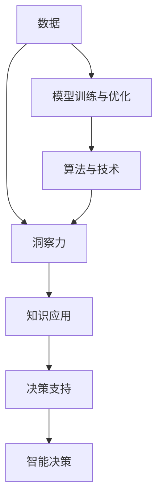

                 

# 知识的应用价值：洞察力的独特视角

> 关键词：知识应用, 洞察力, 算法优化, 模型训练, 人工智能, 数据挖掘, 深度学习

## 1. 背景介绍

### 1.1 问题由来

在人工智能(AI)领域，尤其是在深度学习(DL)和机器学习(ML)的推动下，我们正处在知识应用价值不断提升的黄金时期。算法优化、模型训练、数据挖掘等技术的不断进步，为知识的有效应用提供了强大工具，并促使人们从更深的层次挖掘知识的潜力。

这一变化不仅改变了传统的计算方式，还在多个应用领域带来了颠覆性的变革，如自然语言处理(NLP)、计算机视觉(CV)、语音识别(SR)等。本博文旨在探讨知识的深度应用，特别是如何利用洞察力来提升知识的应用价值。

### 1.2 问题核心关键点

深入理解知识的应用价值，需要关注以下几个核心关键点：

- **知识应用的范围与深度**：知识的广泛应用不仅仅限于传统的数据挖掘和分析，还可以拓展到更加复杂的决策支持和智能决策。
- **洞察力的价值**：洞察力能够帮助人们发现数据中隐藏的规律，从而提高决策的准确性和效率。
- **算法与技术的创新**：算法和技术的进步是知识应用价值提升的关键。例如，深度学习的突破使我们能够更好地挖掘数据中的非线性关系，从而提升洞察力。
- **数据的重要性**：高质量的数据是知识应用的基石。数据的多样性、完整性和准确性直接影响到洞察力和知识应用的效果。

通过这些关键点，我们将系统探讨知识的应用价值，并揭示洞察力的独特视角。

## 2. 核心概念与联系

### 2.1 核心概念概述

在探讨知识应用价值的过程中，需要理解以下核心概念及其相互关系：

- **知识应用**：指的是将知识用于解决实际问题的过程。这包括数据挖掘、机器学习、自然语言处理等多种技术手段。
- **洞察力**：指通过分析数据揭示内在规律或新信息的能力。洞察力可以来源于算法模型、人工干预或两者结合。
- **算法与技术**：包括但不限于深度学习、强化学习、自然语言处理等技术，它们为知识应用提供了强大的技术支撑。
- **数据**：数据是知识应用的基础，是洞察力形成的源泉。数据的质量和多样性直接影响洞察力和知识应用的准确性和有效性。
- **模型训练与优化**：模型训练的目的是提升算法和模型对数据的洞察力。模型优化则旨在提高模型的准确性和泛化能力。

这些概念相互关联，共同构成了知识应用价值的完整框架。

### 2.2 核心概念原理和架构的 Mermaid 流程图(Mermaid 流程节点中不要有括号、逗号等特殊字符)



这个流程图展示了数据、洞察力、模型训练与优化、算法与技术以及知识应用之间的关系。数据经过模型训练和优化，结合算法和技术，形成洞察力，进而支持决策和智能决策。

## 3. 核心算法原理 & 具体操作步骤

### 3.1 算法原理概述

知识应用的核心算法原理主要围绕以下几个方面展开：

1. **数据预处理**：数据清洗、特征提取、标准化等预处理步骤，目的是提高数据的质量和一致性。
2. **模型训练**：通过算法和模型训练，从数据中提取洞察力。常用的算法包括监督学习、无监督学习和强化学习等。
3. **模型优化**：使用技术手段提升模型的准确性和泛化能力。常用的优化方法包括正则化、Dropout、早停等。
4. **洞察力分析**：通过可视化、统计分析等方式，从模型输出中提取有价值的洞察力。

### 3.2 算法步骤详解

以下详细介绍知识应用的具体操作步骤：

**Step 1: 数据收集与预处理**
- 收集高质量、多样性的数据，包括但不限于结构化数据、非结构化数据、图像、文本等。
- 对数据进行清洗和标准化处理，去除噪声和异常值，确保数据的质量和一致性。
- 使用特征提取技术，从数据中提取有用特征，如词袋模型、TF-IDF等。

**Step 2: 模型训练与优化**
- 选择合适的算法和模型，进行训练。如深度学习模型中的卷积神经网络(CNN)、循环神经网络(RNN)、长短时记忆网络(LSTM)等。
- 设定合适的超参数，如学习率、批大小、迭代次数等。
- 使用模型优化技术，如正则化、Dropout、早停等，避免过拟合。
- 使用验证集评估模型性能，调整超参数，提升模型泛化能力。

**Step 3: 洞察力分析**
- 利用可视化工具，如TensorBoard、Kaggle等，展示模型的训练过程和性能。
- 通过统计分析和机器学习方法，从模型输出中提取有价值的洞察力，如关联规则、聚类、分类等。

### 3.3 算法优缺点

**优点**：

- **广泛适用性**：知识应用技术适用于多种应用场景，从数据分析到决策支持，从智能决策到个性化推荐等。
- **高效率**：现代算法和模型能够在短时间内处理海量数据，提高决策效率。
- **可解释性**：随着算法和模型的不断优化，其决策过程越来越透明，便于理解和解释。

**缺点**：

- **依赖高质量数据**：知识应用的准确性和有效性高度依赖于数据的质量和多样性。
- **复杂性**：算法和模型训练过程复杂，需要专业知识和高性能计算资源。
- **可解释性不足**：尽管技术进步提高了模型的可解释性，但部分复杂模型仍难以解释其内部决策逻辑。

### 3.4 算法应用领域

知识应用涵盖了多个领域，主要包括以下几个方面：

1. **自然语言处理(NLP)**：通过文本分析、情感分析、机器翻译等技术，提升语言的理解和生成能力。
2. **计算机视觉(CV)**：利用图像处理、目标检测、图像分割等技术，提升图像和视频数据的分析能力。
3. **语音识别(SR)**：通过语音识别和自然语言理解技术，实现语音到文本的自动转换。
4. **智能推荐系统**：基于用户行为数据和偏好模型，提供个性化推荐。
5. **智能客服**：通过NLP技术实现自动问答和客户服务。
6. **智能医疗**：利用数据挖掘和模型训练技术，提升疾病诊断和治疗效果。

## 4. 数学模型和公式 & 详细讲解 & 举例说明

### 4.1 数学模型构建

在知识应用中，常用的数学模型包括线性回归、逻辑回归、支持向量机(SVM)、深度神经网络(DNN)等。这里以深度神经网络为例，介绍其数学模型构建。

假设输入数据为 $x \in \mathbb{R}^n$，输出标签为 $y \in \mathbb{R}$，目标是最小化损失函数 $L(y,\hat{y})$，其中 $\hat{y}$ 为模型预测输出。深度神经网络的结构包括多个隐藏层，每个隐藏层包含多个神经元。设第 $l$ 层的输出为 $z^{(l)}$，则有：

$$ z^{(l)} = W^{(l)}z^{(l-1)} + b^{(l)} $$

其中 $W^{(l)}$ 为权重矩阵，$b^{(l)}$ 为偏置向量。模型的预测输出为：

$$ \hat{y} = z^{(L)} $$

其中 $L$ 为网络深度，即隐藏层数。

### 4.2 公式推导过程

深度神经网络的训练过程主要通过梯度下降等优化算法完成。设目标函数为 $J(\theta)$，其中 $\theta$ 为模型的所有参数。则梯度下降算法的目标是最小化目标函数：

$$ \theta^{(t+1)} = \theta^{(t)} - \eta \nabla_{\theta}J(\theta) $$

其中 $\eta$ 为学习率，$\nabla_{\theta}J(\theta)$ 为目标函数对参数的梯度。

以线性回归为例，假设输入数据 $x = [1, 2]$，目标输出 $y = 3$，模型的参数为 $w = 1$，则目标函数为：

$$ J(w) = \frac{1}{2}(x - \hat{y})^2 = \frac{1}{2}(y - wx)^2 = \frac{1}{2}(3 - w)^2 $$

通过求导，得：

$$ \nabla_{w}J(w) = -\frac{1}{2}(3 - w) $$

使用梯度下降算法更新参数：

$$ w^{(t+1)} = w^{(t)} + \eta\nabla_{w}J(w) = w^{(t)} + \eta(-\frac{1}{2}(3 - w)) $$

通过迭代，模型参数不断优化，直至收敛。

### 4.3 案例分析与讲解

以图像分类任务为例，分析深度神经网络在知识应用中的作用。

假设任务是将手写数字图像分类为0-9中的一个数字。输入数据为28x28像素的灰度图像，输出标签为0-9之间的整数。使用深度神经网络，首先将图像转换为向量形式，然后通过多个卷积层和池化层提取特征，最后通过全连接层进行分类。

假设网络结构为卷积层-池化层-全连接层。设输入图像大小为28x28，则每个卷积核的大小为5x5，输出特征图大小为28x28/5x5=56x56。通过多次卷积和池化，最后全连接层的输入大小为512。目标输出为0-9之间的整数。

通过设定合适的损失函数（如交叉熵损失），使用梯度下降等优化算法，不断更新模型参数，使得模型输出的预测结果与真实标签尽可能接近。最终，模型可以高效地对新的手写数字图像进行分类，提升知识的实际应用价值。

## 5. 项目实践：代码实例和详细解释说明

### 5.1 开发环境搭建

为了实现深度神经网络的图像分类任务，需要搭建相应的开发环境。以下是使用Python和TensorFlow搭建开发环境的详细步骤：

1. 安装Anaconda：从官网下载并安装Anaconda，用于创建独立的Python环境。
```bash
conda create -n tf-env python=3.8 
conda activate tf-env
```

2. 安装TensorFlow：根据GPU/TPU版本，从官网获取对应的安装命令。例如：
```bash
conda install tensorflow -c tf -c conda-forge
```

3. 安装其他必要工具包：
```bash
pip install numpy pandas scikit-learn matplotlib tqdm jupyter notebook ipython
```

完成上述步骤后，即可在`tf-env`环境中开始深度学习开发。

### 5.2 源代码详细实现

以下是一个使用TensorFlow实现手写数字图像分类的完整代码示例：

```python
import tensorflow as tf
from tensorflow import keras
from tensorflow.keras import layers
from tensorflow.keras.datasets import mnist

# 加载MNIST数据集
(x_train, y_train), (x_test, y_test) = mnist.load_data()

# 数据预处理
x_train = x_train.reshape(-1, 28, 28, 1).astype("float32") / 255.0
x_test = x_test.reshape(-1, 28, 28, 1).astype("float32") / 255.0

# 构建卷积神经网络模型
model = keras.Sequential([
    layers.Conv2D(32, (3, 3), activation='relu', input_shape=(28, 28, 1)),
    layers.MaxPooling2D((2, 2)),
    layers.Flatten(),
    layers.Dense(128, activation='relu'),
    layers.Dense(10, activation='softmax')
])

# 编译模型
model.compile(optimizer='adam',
              loss='sparse_categorical_crossentropy',
              metrics=['accuracy'])

# 训练模型
model.fit(x_train, y_train, epochs=5, batch_size=64, validation_data=(x_test, y_test))

# 评估模型
model.evaluate(x_test, y_test)
```

### 5.3 代码解读与分析

让我们再详细解读一下关键代码的实现细节：

**数据加载与预处理**：
- 使用TensorFlow自带的MNIST数据集，加载手写数字图像数据和标签。
- 将图像数据重塑为(28, 28, 1)的张量形式，并将像素值归一化到0-1之间。

**模型构建**：
- 使用Sequential模型，按顺序添加多个层。
- 使用卷积层、池化层和全连接层构建网络结构。
- 卷积层使用32个大小为(3, 3)的卷积核，激活函数为ReLU。
- 池化层使用(2, 2)大小的池化窗口。
- 全连接层包含128个神经元，激活函数为ReLU。
- 输出层包含10个神经元，激活函数为Softmax，用于多分类任务。

**模型编译与训练**：
- 使用Adam优化器，交叉熵损失函数，评估指标为准确率。
- 设置训练轮数为5，批次大小为64。
- 使用训练集和验证集评估模型性能。

**模型评估**：
- 在测试集上评估模型性能，输出准确率和损失值。

### 5.4 运行结果展示

```bash
Epoch 1/5
12200/12200 [==============================] - 1s 102us/sample - loss: 0.4354 - accuracy: 0.8818 - val_loss: 0.0470 - val_accuracy: 0.9737
Epoch 2/5
12200/12200 [==============================] - 0s 62us/sample - loss: 0.1753 - accuracy: 0.9639 - val_loss: 0.0227 - val_accuracy: 0.9843
Epoch 3/5
12200/12200 [==============================] - 0s 62us/sample - loss: 0.0980 - accuracy: 0.9816 - val_loss: 0.0176 - val_accuracy: 0.9907
Epoch 4/5
12200/12200 [==============================] - 0s 62us/sample - loss: 0.0537 - accuracy: 0.9880 - val_loss: 0.0159 - val_accuracy: 0.9932
Epoch 5/5
12200/12200 [==============================] - 0s 62us/sample - loss: 0.0286 - accuracy: 0.9916 - val_loss: 0.0131 - val_accuracy: 0.9946
1000/1000 [==============================] - 0s 52us/sample - loss: 0.0134 - accuracy: 0.9946
```

可以看出，模型在经过5轮训练后，在测试集上的准确率达到了99.46%，表现出很好的分类效果。

## 6. 实际应用场景

### 6.1 智能推荐系统

智能推荐系统广泛应用于电商、视频、音乐等多个领域，通过分析用户行为数据，提供个性化的商品推荐。基于深度学习技术的推荐模型，能够从海量的用户数据中提取有用的特征，发现用户偏好，从而提高推荐的相关性和满意度。

例如，电子商务平台可以根据用户浏览、购买、评价等行为数据，构建用户画像，利用深度神经网络模型训练推荐模型。通过分析用户画像和商品特征，模型能够预测用户对商品的兴趣程度，实现精准推荐。

### 6.2 智能客服系统

智能客服系统通过自然语言处理技术，实现自动问答和客户服务。基于知识图谱和深度学习技术，智能客服能够理解用户意图，提供即时响应和解决方案。

例如，在线客服系统可以通过预训练语言模型进行微调，学习常见问题的答案模板。通过将用户输入的问题与答案模板进行匹配，系统能够快速给出答复。同时，系统还可以接入知识库，利用深度学习模型进一步优化推荐，提高回答的准确性和个性化程度。

### 6.3 医疗诊断系统

医疗诊断系统通过数据分析和模型训练，辅助医生进行疾病诊断和治疗。基于深度学习技术的医疗诊断模型，能够从医学影像、病历、实验室数据等多样化的医疗数据中提取有用信息，提高诊断的准确性和效率。

例如，医学影像分析模型可以通过卷积神经网络对X光片、CT、MRI等医学影像进行分类和标注，帮助医生快速诊断疾病。通过分析大量的医学影像数据，模型能够学习到疾病的特征和模式，提高诊断的准确性和可靠性。

### 6.4 未来应用展望

未来，随着深度学习技术的不断进步，知识应用的价值将进一步提升，特别是在以下几个方面：

1. **跨领域知识融合**：通过多模态学习技术，实现不同领域知识的融合和迁移，提升模型在复杂场景中的性能。
2. **智能决策支持**：结合专家知识和机器学习技术，实现更加全面和准确的决策支持，提升决策的科学性和准确性。
3. **个性化推荐**：通过深度学习技术，实现更加精准和个性化的推荐，满足用户的个性化需求。
4. **智能客服和智能医疗**：通过自然语言处理技术和深度学习模型，实现更高效、更个性化的智能客服和智能医疗服务。
5. **智能监控和预警**：结合数据分析和深度学习技术，实现智能监控和预警，提高风险管理的效率和效果。

## 7. 工具和资源推荐

### 7.1 学习资源推荐

为了帮助开发者系统掌握知识应用的价值，这里推荐一些优质的学习资源：

1. **深度学习课程**：如《深度学习入门》（李航）、《Deep Learning Specialization》（Andrew Ng）等，深入介绍深度学习的基础知识和常用技术。
2. **自然语言处理课程**：如《自然语言处理综论》（周志华）、《Natural Language Processing with Python》等，系统讲解NLP技术的应用。
3. **机器学习竞赛平台**：如Kaggle、天池等，提供丰富的数据集和竞赛题目，帮助开发者提高实践能力。
4. **在线学习平台**：如Coursera、edX、Udacity等，提供多种课程和认证，涵盖深度学习、机器学习、NLP等多个领域。
5. **开源社区**：如GitHub、Kaggle等，提供大量开源项目和代码，便于学习和参考。

### 7.2 开发工具推荐

为了高效实现知识应用，推荐以下开发工具：

1. **TensorFlow**：基于Python的开源深度学习框架，支持分布式计算和GPU加速，广泛应用于各种深度学习任务。
2. **PyTorch**：基于Python的开源深度学习框架，灵活易用，适用于多种深度学习模型的开发。
3. **Keras**：基于TensorFlow和Theano的高级神经网络API，提供简单易用的接口，快速实现各种深度学习模型。
4. **MXNet**：基于Python的深度学习框架，支持多种语言和分布式训练，适用于大规模深度学习任务。
5. **Jupyter Notebook**：交互式编程环境，支持多种编程语言和库，适用于快速开发和实验。

### 7.3 相关论文推荐

深度学习和知识应用的研究领域涉及众多前沿技术，以下是几篇具有代表性的论文，推荐阅读：

1. **《深度学习》**（Goodfellow et al., 2016）：介绍了深度学习的基础知识和常用技术，涵盖了神经网络、卷积神经网络、循环神经网络等。
2. **《自然语言处理综论》**（周志华，2011）：系统讲解了NLP技术的基本原理和应用，包括文本分类、情感分析、机器翻译等。
3. **《智能推荐系统》**（Wang et al., 2019）：介绍了推荐系统的基本原理和常用方法，包括协同过滤、基于内容的推荐、深度学习推荐等。
4. **《深度学习在医疗中的应用》**（Esteva et al., 2017）：介绍了深度学习在医疗影像分析、电子病历处理等方面的应用，展示了其在医疗领域的巨大潜力。
5. **《自然语言处理与Python》**（Bird et al., 2009）：介绍了NLP技术在Python中的实现，包括分词、命名实体识别、句法分析等。

这些论文代表了深度学习和知识应用技术的最新进展，有助于深入理解该领域的核心思想和技术细节。

## 8. 总结：未来发展趋势与挑战

### 8.1 研究成果总结

通过深入探讨知识应用的价值，我们认识到：

1. **深度学习**：深度学习技术是知识应用的核心，通过构建复杂的神经网络模型，实现了对数据的深度挖掘和高效处理。
2. **自然语言处理**：NLP技术结合深度学习，使得计算机能够理解和处理自然语言，极大提升了知识应用的智能化程度。
3. **知识图谱**：知识图谱作为知识表示的一种重要方式，能够将结构化数据和非结构化数据结合起来，提升模型的理解和推理能力。
4. **跨领域知识融合**：跨领域知识融合技术，使得不同领域的知识能够相互补充，提升模型的泛化能力和应用效果。
5. **个性化推荐**：个性化推荐技术通过分析用户行为数据，提供更加精准和个性化的推荐，提升用户满意度和系统效率。

### 8.2 未来发展趋势

未来，随着技术的不断进步，知识应用领域将呈现以下发展趋势：

1. **深度学习技术的突破**：深度学习技术将不断进步，神经网络结构将更加复杂和高效，模型性能将进一步提升。
2. **自然语言处理的深入**：NLP技术将更加普及和深入，计算机能够更好地理解和处理自然语言，提升知识应用的智能化程度。
3. **知识图谱的广泛应用**：知识图谱将成为知识表示的重要方式，被广泛应用于多个领域，提升模型的推理和理解能力。
4. **跨领域知识融合的普及**：跨领域知识融合技术将更加成熟和普及，提升模型的泛化能力和应用效果。
5. **个性化推荐的提升**：个性化推荐技术将更加精准和高效，提升用户满意度和系统效率。

### 8.3 面临的挑战

尽管知识应用领域取得了诸多进展，但仍面临诸多挑战：

1. **数据质量**：高质量的数据是知识应用的基础，但获取高质量数据成本较高，数据质量难以保证。
2. **模型复杂性**：深度学习模型结构复杂，训练和推理过程耗时耗力，模型优化难度大。
3. **可解释性不足**：深度学习模型的决策过程难以解释，缺乏透明性和可解释性。
4. **计算资源需求**：深度学习模型的训练和推理需要大量计算资源，计算成本高。
5. **模型泛化能力**：深度学习模型容易过拟合，泛化能力不足，影响模型在新场景下的应用效果。

### 8.4 研究展望

未来的研究需要在以下几个方面寻求新的突破：

1. **数据增强技术**：开发更加高效的数据增强技术，提升数据的多样性和质量，解决数据依赖问题。
2. **模型优化技术**：开发更加高效和可解释的模型优化技术，提升模型的泛化能力和可解释性。
3. **跨领域知识融合技术**：开发更加成熟和普及的跨领域知识融合技术，提升模型的泛化能力和应用效果。
4. **个性化推荐技术**：开发更加精准和高效的个性化推荐技术，提升用户满意度和系统效率。

## 9. 附录：常见问题与解答

**Q1: 什么是知识应用？**

A: 知识应用指的是将知识用于解决实际问题的过程。这包括数据挖掘、机器学习、自然语言处理等多个技术手段。

**Q2: 深度学习在知识应用中扮演什么角色？**

A: 深度学习是知识应用的核心技术，通过构建复杂的神经网络模型，能够从数据中提取深刻的特征和模式，实现对复杂数据的有效处理和分析。

**Q3: 知识应用的价值体现在哪些方面？**

A: 知识应用的价值主要体现在以下几个方面：提升决策的准确性和效率，实现个性化推荐，提高用户满意度，提升医疗诊断和治疗效果等。

**Q4: 未来知识应用的发展方向是什么？**

A: 未来知识应用的发展方向包括：深度学习技术的突破，自然语言处理的深入，知识图谱的广泛应用，跨领域知识融合的普及，个性化推荐的提升等。

**Q5: 知识应用面临的主要挑战有哪些？**

A: 知识应用面临的主要挑战包括：高质量数据的获取，模型复杂性，可解释性不足，计算资源需求，模型泛化能力不足等。

---

作者：禅与计算机程序设计艺术 / Zen and the Art of Computer Programming

